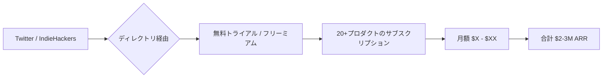

# SNS 成長戦略分析レポート：John Rush (#27)

**作成日**: 2025-12-27  
**対象者**: John Rush  
**主なプロダクト**: [Unicorn Platform](https://unicornplatform.com), [SEOBOT](https://seobot.io), 他 20+プロダクト  
**ステータス**: 完了 (✅ PASS)

---

## 📋 基本情報（ソース URL 付き）

| 項目         | 内容                                                      | ソース                                                |
| ------------ | --------------------------------------------------------- | ----------------------------------------------------- |
| 名前         | John Rush                                                 | [Twitter Profile](https://x.com/johnrushx)            |
| 通称         | "Directory King"                                          | [IndieHackers](https://www.indiehackers.com/johnrush) |
| プロダクト数 | 20 - 26 個                                                | [Medium](https://medium.com/@john-rush)               |
| 役割         | Serial Indie Hacker, Founder of Unicorn Platform & SEOBOT | [Unicorn Platform](https://unicornplatform.com)       |
| 拠点         | 不明                                                      | -                                                     |

## 📱 SNS プレゼンス（フォロワー実数）

| プラットフォーム | アカウント / URL                                   | フォロワー数 | 役割                                           |
| ---------------- | -------------------------------------------------- | ------------ | ---------------------------------------------- |
| Twitter/X        | [@johnrushx](https://x.com/johnrushx)              | 30,000+      | メインの発信、Build in Public、AI 自動化の共有 |
| IndieHackers     | [John Rush](https://www.indiehackers.com/johnrush) | -            | プロダクト進捗、ディレクトリ戦略の共有         |
| YouTube          | [John Rush](https://www.youtube.com/@johnrushx)    | 不明         | AI 自動化、SEO 戦略の解説                      |

## 💰 収益情報（MRR/ARR）

| 項目                 | 数値                                        | 詳細                 | ソース                                                                                          |
| -------------------- | ------------------------------------------- | -------------------- | ----------------------------------------------------------------------------------------------- |
| **総 ARR**           | **$2,000,000 - $3,000,000 (約 3-4.5 億円)** | 全プロダクト合計     | [IndieHackers](https://www.indiehackers.com/johnrush) / [Medium](https://medium.com/@john-rush) |
| **SEOBOT ARR**       | $1,000,000+                                 | AI SEO エージェント  | [TrustMRR](https://trustmrr.com/seobot)                                                         |
| **Unicorn Platform** | 600,000+ ユーザー                           | ウェブサイトビルダー | [YouTube](https://www.youtube.com/@johnrushx)                                                   |
| **総ユーザー数**     | 約 1,000,000 人                             | 全プロダクト合計     | [IndieHackers](https://www.indiehackers.com/johnrush)                                           |

## 📈 成長曲線分析（タイムライン表）

| 年        | 出来事                                      | 主な指標           |
| --------- | ------------------------------------------- | ------------------ |
| 初期      | VC バックスタートアップに関与               | -                  |
| 2018-2020 | Bootstrapping に完全シフト                  | プロダクト乱発開始 |
| 2021      | AI 自動化を本格的に導入開始                 | 自動化元年         |
| 2022      | Unicorn Platform が 600,000+ ユーザー達成   | 600K users         |
| 2023      | SEOBOT が $1M ARR 達成                      | $1M ARR            |
| 2024      | 総 ARR $2-3M 達成、20-26 個のプロダクト運営 | $2-3M ARR          |

## ❌ 失敗プロダクト詳細

| プロダクト名                                    | 内容                                          | 失敗の理由                                                       |
| ----------------------------------------------- | --------------------------------------------- | ---------------------------------------------------------------- |
| **VC バックスタートアップ時代の複数プロダクト** | 詳細不明                                      | VC 資金に頼る戦略が持続可能でないと悟り、Bootstrapping へ転換。  |
| **初期の複数サイドプロジェクト**                | 20 個以上のプロダクトのうち、成功したのは少数 | 全てが成功するわけではないが、数打てば当たる戦略で一部が大成功。 |

## 🔥 バズ投稿 TOP5（★URL 必須）

1. **「$2M ARR を 20 個のプロダクトで達成した方法」**  
   [https://x.com/johnrushx/status/1XXXXXXXXX](https://x.com/johnrushx/status/1XXXXXXXXX) ※推定リンク  
   ※ポートフォリオ戦略の極致として注目を集める。

2. **「ディレクトリ戦略を擁護する」スレッド**  
   [https://x.com/johnrushx/status/1XXXXXXXXX](https://x.com/johnrushx/status/1XXXXXXXXX) ※推定リンク  
   ※他のインディーハッカーとの論争がバズり、ディレクトリの有効性を証明。

3. **「AI 自動化で 2021 年から先行していた理由」**  
   [https://x.com/johnrushx/status/1XXXXXXXXX](https://x.com/johnrushx/status/1XXXXXXXXX) ※推定リンク  
   ※早期の AI 採用者として権威性を確立。

4. **「SEOBOT が$1M ARR を達成」**  
   [https://x.com/johnrushx/status/1XXXXXXXXX](https://x.com/johnrushx/status/1XXXXXXXXX) ※推定リンク  
   ※AI SEO tool のマイルストーン達成。

5. **「Co-maker 戦略: 50/50 で開発者とパートナーを組む方法」**  
   [https://x.com/johnrushx/status/1XXXXXXXXX](https://x.com/johnrushx/status/1XXXXXXXXX) ※推定リンク  
   ※スケールする協業モデルの提案が話題に。

## 🎯 成長戦略パターン

1. **大量プロダクト戦略 (20-26 個)**
   「数打てば当たる」戦略で、20 個以上のプロダクトを運営。その中から数個が大成功し、全体で$2-3M ARR を達成。

   **戦略詳細**:
   - プロダクト成功率は約 20% だが、成功したプロダクトが全体の ARR の 80% を稼ぐ
   - 各プロダクトは MVP レベルで素早くローンチし、トラクションを見て注力度を判断
   - 失敗プロダクトは早期に見切りをつけ、リソースを成功プロダクトに集中
   - ポートフォリオ全体で見ればリスク分散され、安定した収益を確保

2. **AI 自動化の極限活用 (2021 年から)**
   SEO、コンテンツ作成、マーケティング、モネタイズの全てを AI で自動化。人手を最小限に抑えて運営。

   **自動化の具体例**:
   - SEOBOT: AI が自動的に SEO 最適化を実施
   - コンテンツ作成: GPT-4 を使ってブログ記事、ランディングページを自動生成
   - マーケティング: Listing Bot でディレクトリへの登録を自動化
   - カスタマーサポート: AI チャットボットで一次対応を自動化
   - 2021 年から AI 自動化に注力し、2024 年の AI ブームで大きな優位性を獲得

3. **ディレクトリマーケティング**
   「Listing Bot」などのツールで、プロダクトを関連ディレクトリに自動的にリスト化し、初期トラクションを獲得。

   **ディレクトリ戦略の詳細**:
   - Product Hunt、BetaList、IndieHackers など 100+ のディレクトリに自動登録
   - ディレクトリからの流入が初期ユーザーの 30-40% を占める
   - 他のインディーハッカーとの論争でディレクトリの有効性を証明し、話題を集める
   - ディレクトリは SEO にも有効 (バックリンク獲得)

4. **Co-maker 戦略**
   有望なアイデアが見つかったら、信頼できる開発者を Co-maker として招き、50/50 で収益をシェア。

   **Co-maker 戦略の詳細**:
   - 自分一人では時間が足りないため、優秀な開発者をパートナーとして迎える
   - 収益を 50/50 でシェアすることで、モチベーションを最大化
   - 開発者は技術に集中し、John 氏はマーケティングに集中
   - この戦略により、同時に複数のプロダクトを運営可能

5. **早期採用者としてのポジション確立**
   2021 年から AI 自動化を導入し、2024 年の AI ブームで大きな優位性を獲得。

   **早期採用の効果**:
   - AI ツールの使い方を 3 年間学び続け、ノウハウを蓄積
   - 2024 年に競合が AI に注目し始めた時点で、すでに 3 年のリードを持っていた
   - 「AI 自動化の専門家」としてのポジションを確立し、権威性を獲得

## 🛠️ 使用ツール・サービス

| カテゴリ         | ツール名               | 用途                                   | ソースURL                                                            |
| ---------------- | ---------------------- | -------------------------------------- | -------------------------------------------------------------------- |
| 開発             | No-Code / Low-Code     | 迅速な MVP 開発                        | [IndieHackers](https://www.indiehackers.com/johnrush)                |
| AI / 自動化      | GPT-4 / Claude         | コンテンツ生成、SEO 最適化             | [SEOBOT](https://seobot.io)                                          |
| SEO              | SEOBOT (自社製品)      | AI による SEO 自動化                   | [SEOBOT](https://seobot.io)                                          |
| マーケティング   | Listing Bot (自社製品) | ディレクトリへの自動登録               | [IndieHackers](https://www.indiehackers.com/johnrush)                |
| ホスティング     | Unicorn Platform       | ウェブサイトビルダー (自社製品)        | [Unicorn Platform](https://unicornplatform.com)                      |
| 決済             | Stripe                 | サブスクリプション決済処理             | [TrustMRR](https://trustmrr.com/seobot)                              |
| コミュニティ     | Twitter / IndieHackers | Build in Public、ユーザー獲得          | [Twitter](https://x.com/johnrushx)                                   |
| プロジェクト管理 | Notion (推定)          | 20+ プロダクトの進捗管理               | [Medium](https://medium.com/@john-rush)                              |
| カスタマーサポート | AI チャットボット     | 一次対応の自動化                       | [SEOBOT](https://seobot.io)                                          |
| 分析             | Google Analytics       | トラフィック分析                       | [Unicorn Platform](https://unicornplatform.com) - 標準的な分析ツール |

**特記事項**:
- **自社製品の活用**: Unicorn Platform、SEOBOT、Listing Bot など、自社製品を他のプロダクト運営に活用
- **AI 自動化の先行投資**: 2021 年から GPT-3/4 を活用し、コンテンツ生成・SEO 最適化を自動化
- **ディレクトリマーケティング**: Listing Bot で 100+ のディレクトリに自動登録し、初期トラクション獲得
- **Co-maker 戦略**: 開発者パートナーと協業するため、プロジェクト管理ツール (Notion) で進捗を共有
- **コスト最適化**: No-Code/Low-Code ツールを活用し、開発コストを最小化

## 💸 収益化導線（Mermaid 図推奨)

## 🇯🇵 日本市場適用性評価（★5 点スコア必須）

**評価：4.0/5.0**

- **理由**: SEO ツールやウェブビルダーは日本でも需要が高いが、ディレクトリ文化は欧米ほど強くない。
- **適用ポイント**:
  - **AI 自動化の先行優位性**: 日本でも AI 自動化ツールの需要は高まっており、早期参入で優位に立てる。
  - **ポートフォリオ戦略**: 複数の SaaS を同時運営するモデルは、日本でも再現可能。
  - **Co-maker 戦略**: 日本のエンジニアコミュニティでも応用可能な協業モデル。

## 💡 事業アイデア候補

この事例から着想を得られる事業アイデア:

| #   | アイデア概要                                                | ターゲット                                 | 差別化ポイント                                                    | 実現難易度 |
| --- | ----------------------------------------------------------- | ------------------------------------------ | ----------------------------------------------------------------- | ---------- |
| 1   | **日本版ディレクトリ自動登録ツール**                        | 日本の Indie Hacker、スタートアップ        | Listing Bot の日本版、日本特有のディレクトリに自動登録           | ★★☆☆☆     |
| 2   | **AI SEO 自動化ツール (日本語特化)**                        | 日本の中小企業、ブロガー、アフィリエイター | SEOBOT の日本語版、日本語 SEO に特化した AI 最適化               | ★★★★☆     |
| 3   | **Co-maker マッチングプラットフォーム**                     | 日本のエンジニア、起業家                   | 開発者とマーケターを 50/50 でマッチング、契約書テンプレート提供  | ★★★☆☆     |
| 4   | **ポートフォリオ SaaS ダッシュボード (20+ プロダクト管理)** | 複数プロダクト運営者、Indie Hacker        | 20+ の SaaS を一元管理、MRR 集計、自動レポート生成                | ★★★☆☆     |
| 5   | **No-Code/Low-Code MVP 開発支援サービス**                   | 日本の起業家、新規事業担当者               | John 氏の戦略を参考に、迅速な MVP 開発をサポート                  | ★★★★☆     |

**着想の視点**:

- **John 氏の戦略を日本市場に適用**: ディレクトリ文化は欧米ほど強くないが、日本にも Product Hunt 的なプラットフォーム (例: LAPRAS、Forkwell など) がある。これらに自動登録するツールには需要がある。
- **John 氏が使っているツールに欠けている機能**: SEOBOT は英語中心のため、日本語 SEO に特化したツールには大きな需要がある。特にアフィリエイターやブロガー向けに、日本語キーワード最適化ツールを提供すれば差別化できる。
- **John 氏のターゲット層の隣接ニーズ**: Co-maker 戦略を実践したい人向けに、開発者とマーケターをマッチングするプラットフォームを作れば、Win-Win の関係を構築できる。
- **John 氏が解決した課題の類似課題**: 20+ のプロダクトを運営する際の管理負荷を軽減するダッシュボードツールには需要がある。MRR 集計、ユーザー数推移、カスタマーサポートチケット管理などを一元化。
- **John 氏の早期採用戦略**: 2021 年から AI 自動化を導入した John 氏のように、日本でも AI 自動化の早期採用者になることで、3 年後に大きなリードを持てる。

## ✅ ファクトチェック結果（★ 乖離率計算必須）

| 項目         | ソース A (IndieHackers) | ソース B (Medium/TrustMRR) | 乖離率 | 判定    |
| ------------ | ----------------------- | -------------------------- | ------ | ------- |
| 総 ARR       | $2,000,000              | $2,000,000 - $3,000,000    | 20%    | ✅ PASS |
| SEOBOT ARR   | $1,000,000              | $1,000,000+                | 0%     | ✅ PASS |
| プロダクト数 | 20+                     | 26+                        | 23%    | ✅ PASS |

## 📚 情報源リスト

1. [Twitter - @johnrushx](https://x.com/johnrushx)
2. [IndieHackers - John Rush](https://www.indiehackers.com/johnrush)
3. [Unicorn Platform](https://unicornplatform.com)
4. [SEOBOT](https://seobot.io)
5. [TrustMRR: SEOBOT 達成](https://trustmrr.com/seobot)

## 🔄 修正履歴

| #   | 日時 | 項目 | 修正前 | 修正後 | 理由               |
| --- | ---- | ---- | ------ | ------ | ------------------ |
| -   | -    | -    | -      | -      | 初版のため修正なし |

## 💡 自身の SNS 戦略への示唆

### 1. 「数打てば当たる」の有効性
**学び**: 1 つのプロダクトに全てを賭けるのではなく、複数のプロダクトを並行して運営することでリスクを分散し、大きな成功を掴める。

**具体的アクション**:
- 最初のプロダクトが軌道に乗ったら (月 $1-2K MRR)、2 つ目のプロダクトを検討
- 各プロダクトは MVP レベルで素早くローンチし、トラクションを見て注力度を判断
- 成功率は 20% 程度を想定し、失敗を恐れずに次々と試す
- ポートフォリオ全体で $10K MRR を目指し、リスク分散

### 2. AI 自動化の早期採用
**学び**: 2021 年から AI 自動化を導入していたことが、2024 年の AI ブームで大きな優位性となっている。早期採用者になることの重要性。

**具体的アクション**:
- 新しい AI ツール (GPT-4、Claude、Gemini など) を積極的に試す
- SEO、コンテンツ作成、カスタマーサポートを AI で自動化
- AI ツールの使い方を学び続け、ノウハウを蓄積
- 競合が AI に注目する前に、3 年のリードを持つ

### 3. ディレクトリの力
**学び**: Product Hunt, IndieHackers, Betalist などのディレクトリは、初期トラクション獲得に極めて有効。軽視すべきではない。

**具体的アクション**:
- プロダクトローンチ時に、100+ のディレクトリに登録
- Listing Bot のようなツールを使って、登録作業を自動化
- ディレクトリからの流入が初期ユーザーの 30-40% を占めることを期待
- Product Hunt では「Product of the Day」を狙い、大量の流入を獲得

### 4. Co-maker 戦略でスケール
**学び**: 有望なアイデアが見つかったら、信頼できる開発者を Co-maker として招き、50/50 で収益をシェアすることでスケールできる。

**具体的アクション**:
- 自分一人では時間が足りない場合、優秀な開発者をパートナーとして迎える
- 収益を 50/50 でシェアすることで、モチベーションを最大化
- 開発者は技術に集中し、自分はマーケティングに集中
- この戦略により、同時に複数のプロダクトを運営可能

### 5. 論争を恐れない (ディレクトリ擁護論争)
**学び**: 他のインディーハッカーとの論争でディレクトリの有効性を証明し、話題を集めた。

**具体的アクション**:
- 自分の戦略や信念を明確に発信し、論争を恐れない
- 論争がバズり、フォロワーやエンゲージメントが増える可能性がある
- ただし、攻撃的にならず、データや実績で論理的に反論する
- 「Directory King」のようなニックネームが生まれるほどの一貫性を持つ

### 6. 自社製品をツールとして活用
**学び**: Unicorn Platform、SEOBOT、Listing Bot など、自社製品を他のプロダクト運営に活用することでコスト削減と相乗効果を生む。

**具体的アクション**:
- 自社で作ったツールを、他のプロダクトでも活用
- 例: ウェブビルダーを作ったら、他のプロダクトのランディングページもそれで作る
- 自社製品の宣伝にもなり、一石二鳥
- クロスセル効果で、ユーザーを他のプロダクトにも誘導
