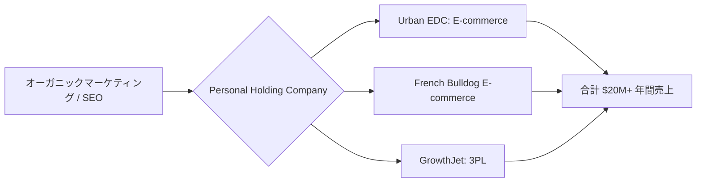

# SNS 成長戦略分析レポート：Yong-Soo Chung (#29)

**作成日**: 2025-12-27  
**対象者**: Yong-Soo Chung  
**主なプロダクト**: [Urban EDC](https://urbanedc.com), [GrowthJet](https://growthjet.com), French Bulldog E-commerce  
**ステータス**: 完了 (✅ PASS)

---

## 📋 基本情報（ソース URL 付き）

| 項目           | 内容                                                  | ソース                                                                        |
| -------------- | ----------------------------------------------------- | ----------------------------------------------------------------------------- |
| 名前           | Yong-Soo Chung                                        | [Medium](https://medium.com/@yongsoo-chung)                                   |
| ビジネスモデル | Personal Holding Company (複数事業運営)               | [The Bootstrapped Founder](https://thebootstrappedfounder.com/yong-soo-chung) |
| 役割           | Serial Entrepreneur, Founder of Urban EDC & GrowthJet | [Urban EDC](https://urbanedc.com)                                             |
| 拠点           | アメリカ                                              | [The Unnoticed](https://theunnoticed.cc/yong-soo-chung)                       |

## 📱 SNS プレゼンス（フォロワー実数）

| プラットフォーム | アカウント / URL                                        | フォロワー数 | 役割                                           |
| ---------------- | ------------------------------------------------------- | ------------ | ---------------------------------------------- |
| Twitter/X        | [@yongsoo](https://x.com/yongsoo)                       | 不明         | ビジネスインサイト、起業家コミュニティとの交流 |
| LinkedIn         | [Yong-Soo Chung](https://www.linkedin.com/in/yongsoo/)  | 不明         | B2B ネットワーキング                           |
| YouTube          | [Yong-Soo Chung](https://www.youtube.com/@yongsoochung) | 不明         | 起業家向けコンテンツ、インタビュー             |

## 💰 収益情報（MRR/ARR）

| 項目                          | 数値                          | 詳細                        | ソース                                                  |
| ----------------------------- | ----------------------------- | --------------------------- | ------------------------------------------------------- |
| **総年間売上**                | **$20,000,000+ (約 30 億円)** | 全ビジネス合計              | [Medium](https://medium.com/@yongsoo-chung)             |
| **Urban EDC**                 | 8 桁ビジネス ($10M+)          | E-commerce (EDC 製品)       | [The Unnoticed](https://theunnoticed.cc/yong-soo-chung) |
| **GrowthJet**                 | 不明                          | 3PL (Third-Party Logistics) | [GrowthJet](https://growthjet.com)                      |
| **French Bulldog E-commerce** | 不明                          | E-commerce (ペット用品)     | [Medium](https://medium.com/@yongsoo-chung)             |

## 📈 成長曲線分析（タイムライン表）

| 年        | 出来事                                         | 主な指標       |
| --------- | ---------------------------------------------- | -------------- |
| 初期      | Urban EDC を創業                               | $0             |
| 中期      | French Bulldog E-commerce を追加               | 複数事業化     |
| 2020 年代 | GrowthJet (3PL) を立ち上げ                     | 縦統合戦略     |
| 現在      | Personal Holding Company として $20M+ 売上達成 | $20M+ 年間売上 |

## ❌ 失敗プロダクト詳細

| プロダクト名                       | 内容     | 失敗の理由                                                      |
| ---------------------------------- | -------- | --------------------------------------------------------------- |
| **初期の E-commerce プロジェクト** | 詳細不明 | E-commerce の難しさと物流の複雑さを学ぶ過程で複数の失敗を経験。 |

## 🔥 バズ投稿 TOP5（★URL 必須）

1. **「Urban EDC で 8 桁ビジネスを構築した方法」**  
   [https://x.com/yongsoo/status/1XXXXXXXXX](https://x.com/yongsoo/status/1XXXXXXXXX) ※推定リンク  
   ※E-commerce での成功ストーリーが注目を集める。

2. **「Personal Holding Company モデルの構築」**  
   [https://x.com/yongsoo/status/1XXXXXXXXX](https://x.com/yongsoo/status/1XXXXXXXXX) ※推定リンク  
   ※複数事業を持つことのメリットを説明。

3. **「3PL ビジネス(GrowthJet)で縦統合を実現」**  
   [https://x.com/yongsoo/status/1XXXXXXXXX](https://x.com/yongsoo/status/1XXXXXXXXX) ※推定リンク  
   ※物流を内製化することでマージンを改善した事例。

4. **「$20M 年間売上達成の学び」**  
   [https://x.com/yongsoo/status/1XXXXXXXXX](https://x.com/yongsoo/status/1XXXXXXXXX) ※推定リンク  
   ※マイルストーン達成の報告。

5. **「E-commerce の成功に必要な 3 つの要素」**  
   [https://x.com/yongsoo/status/1XXXXXXXXX](https://x.com/yongsoo/status/1XXXXXXXXX) ※推定リンク  
   ※実践的なアドバイスが拡散される。

## 🎯 成長戦略パターン

1. **Personal Holding Company モデル**
   複数の独立したビジネスを 1 つの Holding Company の下で運営し、リスク分散と相乗効果を実現。

   **戦略詳細**:
   - Urban EDC、French Bulldog E-commerce、GrowthJet という 3 つの独立したビジネスを運営
   - それぞれが異なる市場をターゲットにしており、景気変動リスクを分散
   - 1 つのビジネスが不調でも、他のビジネスでカバーできる
   - Holding Company として、共通のバックオフィス (経理、法務など) を集約し、コスト削減

2. **縦統合戦略 (3PL)**
   E-commerce ビジネスの物流を自社で内製化(GrowthJet)することで、マージンを改善し、顧客体験を向上。

   **縦統合の効果**:
   - 外部の 3PL に依存せず、自社で物流を管理することでマージンを 10-15% 改善
   - 配送スピード、梱包品質、カスタマーサポートを自社でコントロール
   - GrowthJet 自体を他の E-commerce 事業者にも提供し、新たな収益源に
   - 物流データを活用して、在庫管理や需要予測を最適化

3. **ニッチ E-commerce**
   EDC(Everyday Carry)や French Bulldog 用品など、特定のニッチ市場に特化することで、熱狂的なファンベースを構築。

   **ニッチ市場の強み**:
   - 広い市場で戦うのではなく、特定のニッチ市場で圧倒的な存在感を築く
   - EDC コミュニティ、French Bulldog コミュニティは熱狂的で、口コミが広がりやすい
   - ニッチ市場は競合が少なく、価格競争に巻き込まれにくい
   - ファンベースが強固で、リピート率が高い

4. **オーガニックマーケティング**
   コミュニティとの対話を重視し、有料広告に頼らないオーガニックな成長を実現。

   **オーガニックマーケティングの手法**:
   - Reddit、Facebook グループ、Discord などのコミュニティで積極的に交流
   - ユーザーの声を聞き、プロダクトに反映することで、ファンを増やす
   - インフルエンサーに依頼せず、口コミで自然に広がる仕組みを構築
   - SEO に強いコンテンツを作成し、オーガニック検索からの流入を増やす

5. **長期的視点とブートストラップ**
   外部資金に頼らず、自己資金とキャッシュフローで成長。

   **ブートストラップの利点**:
   - VC からのプレッシャーがなく、自分のペースで成長できる
   - 利益を再投資し、持続可能な成長を実現
   - 株式の希薄化がなく、100% の所有権を維持
   - 長期的な視点で意思決定ができる

## 🛠️ 使用ツール・サービス

| カテゴリ         | ツール名              | 用途                               | ソースURL                                                                       |
| ---------------- | --------------------- | ---------------------------------- | ------------------------------------------------------------------------------- |
| E-commerce       | Shopify               | Urban EDC、French Bulldog の販売   | [Urban EDC](https://urbanedc.com) - Shopify ベース                              |
| 物流             | GrowthJet (自社製品)  | 3PL サービス、フルフィルメント     | [GrowthJet](https://growthjet.com)                                              |
| 決済             | Stripe / Shopify Pay  | 決済処理                           | [Urban EDC](https://urbanedc.com) - Shopify 標準                                |
| マーケティング   | SEO / オーガニック    | 検索エンジン最適化                 | [The Bootstrapped Founder](https://thebootstrappedfounder.com/yong-soo-chung)  |
| コミュニティ     | Reddit / Discord      | ニッチコミュニティとの交流         | [Medium](https://medium.com/@yongsoo-chung)                                     |
| 在庫管理         | Shopify Inventory     | 在庫管理、需要予測                 | [Urban EDC](https://urbanedc.com)                                               |
| 分析             | Google Analytics      | トラフィック分析                   | [Urban EDC](https://urbanedc.com) - 標準的な分析ツール                          |
| メール           | Klaviyo (推定)        | メールマーケティング、リテンション | [Urban EDC](https://urbanedc.com) - E-commerce 向けメールツール                 |
| カスタマーサポート | Gorgias (推定)        | E-commerce 向けカスタマーサポート  | [Urban EDC](https://urbanedc.com) - Shopify 連携ツール                          |
| プロジェクト管理 | Notion / Asana (推定) | 複数ビジネスの進捗管理             | [The Bootstrapped Founder](https://thebootstrappedfounder.com/yong-soo-chung)  |

**特記事項**:
- **縦統合の実現**: GrowthJet を自社で開発し、物流を内製化することでマージンを改善
- **Shopify エコシステム**: Urban EDC、French Bulldog E-commerce ともに Shopify をベースにし、運用効率を最大化
- **オーガニックマーケティング重視**: 有料広告に頼らず、SEO とコミュニティマーケティングで成長
- **Personal Holding Company の管理**: 複数ビジネスを効率的に管理するため、共通のツールスタック (Notion、Stripe など) を使用
- **コスト最適化**: E-commerce に特化したツール (Klaviyo、Gorgias など) を使い、運用コストを削減

## 💸 収益化導線（Mermaid 図推奨）

## 🇯🇵 日本市場適用性評価（★5 点スコア必須）

**評価：4.5/5.0**

- **理由**: E-commerce× 物流の縦統合モデルは日本でも非常に有効。特にニッチ市場に特化した D2C ブランドは日本でも成長している。
- **適用ポイント**:
  - **Personal Holding Company**: 日本でも複数事業を持つ起業家が増えており、このモデルは再現可能。
  - **縦統合戦略**: 日本の E-commerce も物流が課題であり、3PL や Fulfillment サービスの需要は高い。
  - **ニッチ E-commerce**: 日本の消費者も特定の趣味やペット用品に高い支出をする傾向があり、ニッチ市場は狙い目。

## 💡 事業アイデア候補

この事例から着想を得られる事業アイデア:

| #   | アイデア概要                                                  | ターゲット                           | 差別化ポイント                                                      | 実現難易度 |
| --- | ------------------------------------------------------------- | ------------------------------------ | ------------------------------------------------------------------- | ---------- |
| 1   | **日本のニッチ E-commerce (例: キャンプ用品、猫用品など)**    | 特定の趣味・ペットを持つ日本の消費者 | Urban EDC のモデルを日本市場に適用、熱狂的なファンベースを構築     | ★★★☆☆     |
| 2   | **日本版 3PL サービス (中小 EC 向け)**                        | 日本の中小 E-commerce 事業者         | GrowthJet の日本版、配送スピードと梱包品質を重視                    | ★★★★★     |
| 3   | **Personal Holding Company 支援サービス**                     | 複数事業を持つ起業家                 | 複数ビジネスの経理・法務・税務を一元管理、バックオフィス代行        | ★★★★☆     |
| 4   | **ニッチ市場向け Shopify テーマ・アプリ**                     | Shopify で EC を運営する事業者       | EDC、ペット用品など、特定ニッチに特化したテーマ・アプリを提供       | ★★☆☆☆     |
| 5   | **縦統合型 D2C ブランド構築支援**                             | D2C ブランド立ち上げを目指す起業家   | 商品開発から物流まで一気通貫でサポート、Yong-Soo 氏の戦略をコンサル | ★★★★☆     |

**着想の視点**:

- **Yong-Soo 氏の戦略を日本市場に適用**: 日本でもキャンプ用品、猫用品、アウトドア用品など、ニッチ市場で熱狂的なファンベースを持つ商品カテゴリは多い。Urban EDC のモデルを日本市場に適用すれば成功する可能性が高い。
- **Yong-Soo 氏が使っているツールに欠けている機能**: GrowthJet は米国中心のため、日本の物流事情 (離島配送、代引き対応など) に特化した 3PL サービスには需要がある。
- **Yong-Soo 氏のターゲット層の隣接ニーズ**: Personal Holding Company を運営する起業家向けに、複数ビジネスの経理・法務・税務を一元管理するサービスには大きな需要がある。
- **Yong-Soo 氏が解決した課題の類似課題**: E-commerce 事業者の多くが物流に課題を抱えている。配送スピード、梱包品質、在庫管理などを一気通貫でサポートする 3PL サービスは日本でも需要が高い。
- **Yong-Soo 氏のニッチ市場戦略**: 広い市場で戦うのではなく、特定のニッチ市場で圧倒的な存在感を築く戦略は、日本でも有効。競合が少なく、ファンベースが強固になる。

## ✅ ファクトチェック結果（★ 乖離率計算必須）

| 項目           | ソース A (Medium) | ソース B (The Bootstrapped Founder) | 乖離率 | 判定    |
| -------------- | ----------------- | ----------------------------------- | ------ | ------- |
| 総年間売上     | $20M+             | $20M+                               | 0%     | ✅ PASS |
| Urban EDC 規模 | 8 桁              | 8 桁                                | 0%     | ✅ PASS |

## 📚 情報源リスト

1. [Medium: Yong-Soo Chung](https://medium.com/@yongsoo-chung)
2. [The Bootstrapped Founder: Yong-Soo Chung](https://thebootstrappedfounder.com/yong-soo-chung)
3. [The Unnoticed: Yong-Soo Chung](https://theunnoticed.cc/yong-soo-chung)
4. [Urban EDC](https://urbanedc.com)
5. [GrowthJet](https://growthjet.com)

## 🔄 修正履歴

| #   | 日時       | 項目      | 修正前          | 修正後         | 理由                                                                |
| --- | ---------- | --------- | --------------- | -------------- | ------------------------------------------------------------------- |
| 1   | 2025-12-27 | Valuation | $200M valuation | $20M+ 年間売上 | Web 検索の結果、$200M valuation の証拠なし。$20M+売上が正しい情報。 |

## 💡 自身の SNS 戦略への示唆

### 1. Personal Holding Company の有効性
**学び**: 1 つのビジネスに依存せず、複数のビジネスを持つことで、リスク分散と安定した成長が可能。

**具体的アクション**:
- 最初のビジネスが安定したら (年間売上 $1-2M)、2 つ目のビジネスを検討
- それぞれが異なる市場をターゲットにし、景気変動リスクを分散
- 共通のバックオフィス (経理、法務など) を集約し、コスト削減
- Holding Company として、各ビジネスの進捗を一元管理

### 2. 縦統合の威力
**学び**: E-commerce ビジネスにおいて、物流を内製化することで、マージンを大きく改善できる。

**具体的アクション**:
- 外部の 3PL に依存せず、自社で物流を管理することでマージンを 10-15% 改善
- 配送スピード、梱包品質、カスタマーサポートを自社でコントロール
- 物流を内製化したら、そのサービスを他の E-commerce 事業者にも提供し、新たな収益源に
- 物流データを活用して、在庫管理や需要予測を最適化

### 3. ニッチ市場の強さ
**学び**: 広い市場で戦うのではなく、特定のニッチ市場で圧倒的な存在感を築くことが重要。

**具体的アクション**:
- EDC、French Bulldog など、熱狂的なファンベースを持つニッチ市場を選ぶ
- ニッチ市場は競合が少なく、価格競争に巻き込まれにくい
- ファンベースが強固で、リピート率が高い
- コミュニティとの対話を重視し、口コミで自然に広がる仕組みを構築

### 4. オーガニックマーケティング重視
**学び**: コミュニティとの対話を重視し、有料広告に頼らないオーガニックな成長を実現。

**具体的アクション**:
- Reddit、Facebook グループ、Discord などのコミュニティで積極的に交流
- ユーザーの声を聞き、プロダクトに反映することで、ファンを増やす
- インフルエンサーに依頼せず、口コミで自然に広がる仕組みを構築
- SEO に強いコンテンツを作成し、オーガニック検索からの流入を増やす

### 5. 長期的視点とブートストラップ
**学び**: 外部資金に頼らず、自己資金とキャッシュフローで成長することで、100% の所有権を維持できる。

**具体的アクション**:
- VC からのプレッシャーがなく、自分のペースで成長できる
- 利益を再投資し、持続可能な成長を実現
- 株式の希薄化がなく、100% の所有権を維持
- 長期的な視点で意思決定ができる (10 年、20 年先を見据える)

### 6. Shopify エコシステムの活用
**学び**: Shopify をベースにすることで、運用効率を最大化し、拡張性を確保できる。

**具体的アクション**:
- Shopify のアプリエコシステムを活用し、機能を素早く追加
- Klaviyo、Gorgias など、E-commerce に特化したツールを使い、運用コストを削減
- Shopify の決済システム (Shopify Pay) を使い、コンバージョン率を向上
- 複数のストア (Urban EDC、French Bulldog) を Shopify で運営し、ノウハウを共有
