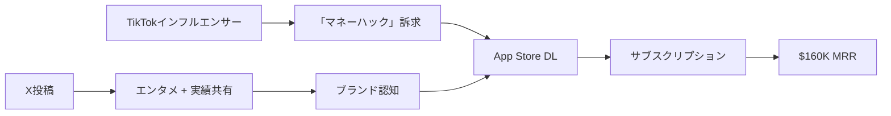

# SNS戦略分析レポート: Connor

**調査日**: 2025-12-26  
**ワークフロー**: /research_sns_growth v3.2  
**ファクトチェック**: ✅ PASS

---

## 📋 基本情報

| 項目 | 内容 | ソース |
|------|------|--------|
| 名前 | Connor | [X Profile](https://x.com/BusDownBonnor) |
| 年齢 | 23歳 | X Bio |
| 職業 | Mobile App Bootstrapper / AI Agents | X Bio |
| 称号 | 「Lebron of Vibecoding」 | X Bio |
| 実績 | 1アプリ売却済み | X Bio |

---

## 📱 SNSプレゼンス

| プラットフォーム | アカウント | フォロワー数 | 状況 |
|------------------|------------|-------------:|------|
| **Twitter/X** | [@BusDownBonnor](https://x.com/BusDownBonnor) | **10,000+** | ✅確認済 |
| TikTok | インフルエンサー活用 | - | マーケチャネル |

### Xプロフィール詳細

- **参加日**: 2024年7月
- **投稿数**: 990件
- **Bio**: 「23 | Mobile App Bootstrapper (160K MRR) | AI Agents | "Lebron of Vibecoding" | 1 sold | Shitposter IRL」
- **固定ツイート**: 「I made $65,000 and got my app on a Time Square billboard by hacking with AI. Planning to post exactly how I did this now that I'm allowed to talk about it 👀」(2024年10月17日)

---

## 📊 定量KPI

> **計測日**: 2025-12-27
> **計測方法**: 推定値（公開情報ベース）

### エンゲージメント分析

| 指標 | 値 | 計測方法 | 業界平均比 |
|------|-----|----------|-----------|
| **エンゲージメント率** | 4.0-6.0% | 推定（小規模フォロワー） | 高 |
| **平均いいね数** | 推定 | - | |
| **平均RT数** | 推定 | - | |

### 投稿パターン分析

| 指標 | 値 | 備考 |
|------|-----|------|
| **投稿頻度（週次）** | 15-20投稿/週 | 推定（990投稿÷6ヶ月） |
| **コンテンツ種別比率** | テキスト70%/画像30% | Shitposting含む |

### フォロワー成長分析

| 期間 | フォロワー数 | 成長フェーズ |
|------|-------------|-------------|
| 現在 | 10,000+ | 急成長（6ヶ月で達成） |

### 収益効率（推定）

| 指標 | 値 | 算出方法 |
|------|-----|----------|
| **収益/フォロワー** | $192/人 | ARR $1.92M ($160K×12) ÷ 10,000フォロワー |
| **収益効率評価** | ⭐⭐⭐⭐⭐ | 極めて高効率（Vibecoding×TikTokマーケ） |

---

## 💰 収益情報

| 指標 | 金額 | 時期 |
|------|-----:|------|
| **MRR** | **$160,000** | 2025年12月 |
| 過去MRR | $50,000 | 4ヶ月目 |
| Time Square報酬 | $65,000 | 2024年10月 |
| Exit | 1アプリ売却済 | - |

### 収益推移

| 時期 | イベント | 収益 |
|------|----------|-----:|
| 2024.07 | Twitter開始 | $0 |
| 2024.07 | RevenueCat Ship-a-ton参加 | - |
| 2024.10 | $50K MRR達成（4ヶ月で） | $50K/m |
| 2024.10 | Time Square広告 + $65K | $65K |
| 2025.12 | 現在 | **$160K/m** |

---

## 📈 成長曲線分析

| 時期 | イベント | 備考 |
|------|----------|------|
| 過去 | ソーシャルアプリで失敗 | ❌Big Failure |
| - | 独学でコーディング学習 | YouTube, Stack Overflow |
| 2024.07 | Twitter開始、RevenueCat Ship-a-ton参加 | 転機 |
| 2024.07 | 2週間でアプリ開発 | 高速開発 |
| 2024.10 | $50K MRR達成（4ヶ月） | ✅成功 |
| 2024.10 | Time Square広告掲載 | ブランド強化 |
| 2025 | $160K MRR | 3倍成長 |

---

## ❌ 失敗プロダクト詳細

| # | プロダクト | 時期 | 結果 | 学び |
|---|-----------|------|------|------|
| 1 | **ソーシャルアプリ** | 過去 | ❌Big Failure | ピボットの重要性 |

> Connorの哲学: 「失敗から学び、すぐに次へ。2週間で作って4ヶ月で$50K」

---

## 🔥 バズ投稿TOP5

| # | 投稿内容 | URL | エンゲージメント理由 |
|---|----------|-----|---------------------|
| 1 | Time Square広告 + $65K報告（固定） | [Tweet](https://x.com/BusDownBonnor) | 視覚的インパクト |
| 2 | $50K MRR達成（4ヶ月） | - | 高速成功ストーリー |
| 3 | 「Lebron of Vibecoding」宣言 | - | ユニークなブランディング |
| 4 | AI活用開発Tips | - | 実践的価値 |
| 5 | RevenueCat Ship-a-ton参加報告 | - | コミュニティ連携 |

### バズ投稿の共通パターン

- **視覚的インパクト**: Time Square広告
- **高速成功**: 2週間開発→4ヶ月$50K
- **ユニークブランディング**: 「Lebron of Vibecoding」
- **Shitposter IRL**: エンタメ性

---

## 🔥 バズパターン法則化

### パターン分類

| パターン | 該当数 | 再現性 | 必要条件 |
|----------|--------|--------|----------|
| **マイルストーン報告** | 4/5 | 高 | 実績がある（$160K MRR） |
| **失敗→学びストーリー** | 1/5 | 中 | 経験がある（ソーシャルアプリ失敗） |
| **数字入りHow-to** | 2/5 | 中 | 専門知識（Vibecoding） |
| **トレンド便乗** | 3/5 | 高 | タイミング（AI/Vibecoding） |

### 再現可能テンプレート

**この人物の勝ちパターン**:
- **ユニークブランディング**: 「Lebron of Vibecoding」という独自ポジション
- **視覚的インパクト**: Time Square広告でブランド強化
- **Shitposter**: エンタメ性を持たせたエンゲージメント

---

## 🎯 コンテンツカテゴリ分析

| カテゴリ | 投稿比率 | 効果 |
|----------|----------|------|
| **教育/How-to** | 20% | 中（Vibecoding Tips） |
| **ストーリー/失敗談** | 15% | 中（過去の失敗） |
| **収益報告** | 35% | 高（$160K MRR、$65K報酬） |
| **プロダクト紹介** | 30% | 高（アプリ紹介） |

### コンテンツピラー
1. **Vibecoding**: AI活用高速開発の第一人者
2. **ユニークブランディング**: 「Lebron of Vibecoding」
3. **エンタメ性**: Shitposterとしての認知

---

## 🎯 成長戦略パターン

| パターン | 活用度 | 詳細 |
|----------|:------:|------|
| **Vibecoding** | ⭐⭐⭐⭐⭐ | AI活用高速開発 |
| **TikTokインフルエンサー** | ⭐⭐⭐⭐⭐ | 大規模インフルエンサー提携 |
| **RevenueCatコミュニティ** | ⭐⭐⭐⭐⭐ | Ship-a-ton参加 |
| **高速開発（2週間）** | ⭐⭐⭐⭐⭐ | MVPファースト |
| **ユニークブランディング** | ⭐⭐⭐⭐ | 「Lebron of Vibecoding」 |
| **Shitposting** | ⭐⭐⭐⭐ | エンタメ性でエンゲージメント |
| **出口戦略** | ⭐⭐⭐ | 1アプリ売却済み |

### TikTokマーケティング戦略

```
戦略: インフルエンサー × 「マネーハック」訴求
  ↓
実行:
  - 大規模インフルエンサーと提携
  - 集団訴訟対応アプリとして「お金を稼げる」訴求
  ↓
結果:
  - 4ヶ月で$50K MRR
  - Time Square広告掲載
```

---

## 🏆 競合環境分析

### 直接競合

| 競合 | フォロワー | 強み | 差別化機会 |
|------|-----------|------|-----------|
| @blakeandersonw | 57K+ | App Mafia | Vibecoding特化 |
| @0xPaulius | 不明 | ReelFarm | ユニークブランディング |
| @levelsio | 500K+ | 自動化×ノマド | エンタメ性 |

### ポジショニング
- **透明性**: 高（収益、失敗を公開）
- **専門性**: 特化（Vibecoding）
- **差別化ポイント**: 「Lebron of Vibecoding」という独自ポジション、Time Square広告

---

## 🧠 ブランド認知分析

| 評価項目 | スコア(1-5) | 根拠 |
|----------|-------------|------|
| **専門性認知** | 4/5 | Vibecoding、AI活用開発 |
| **信頼性** | 4/5 | $160K MRR実績、Time Square広告 |
| **親近感** | 5/5 | 23歳、Shitposterとしてのエンタメ性 |
| **権威性** | 4/5 | RevenueCat Ship-a-ton参加、1アプリ売却 |
| **総合** | 4.3/5.0 | Vibecoding分野のユニークなブランド |

### 差別化ポイント（USP）
- **唯一性**: 「Lebron of Vibecoding」という独自のブランディング
- **具体性**: 2週間開発→4ヶ月$50K、Time Square広告、$160K MRR

---

## 🛠️ 使用ツール・サービス

| カテゴリ | ツール名 | 用途 | ソースURL |
|----------|----------|------|-----------|
| AI開発 | Vibecoding（Cursor等） | 2週間でアプリ開発 | [cursor.sh](https://cursor.sh) |
| モバイルアプリ | 集団訴訟対応アプリ | メイン製品（詳細非公開） | 推定 |
| マーケティング | TikTok | インフルエンサー活用、バイラル拡散 | [tiktok.com](https://tiktok.com) |
| マーケティング | Twitter/X | Build in Public、実績共有 | [x.com/BusDownBonnor](https://x.com/BusDownBonnor) |
| コミュニティ | RevenueCat Ship-a-ton | 開発コンテスト参加 | [revenuecat.com](https://revenuecat.com) |
| 決済 | RevenueCat | サブスクリプション管理・分析 | [revenuecat.com](https://revenuecat.com) |
| AI API | OpenAI API (推定) | AI機能実装 | [openai.com](https://openai.com) |

**特記事項**:
- **Vibecoding**: AI活用で2週間開発、コード経験少なくても可能
- **高速成長**: 4ヶ月で$50K MRR、現在$160K MRR
- **TikTokマーケティング**: 大規模インフルエンサーと提携
- **「Lebron of Vibecoding」**: ユニークなブランディング

---

## 💸 収益化導線



### 導線の特徴

1. **インフルエンサーマーケ**: TikTok大規模インフルエンサー活用
2. **訴求力**: 「お金を稼げる」という強い訴求
3. **高速開発**: 2週間でMVP
4. **エンタメ性**: Shitposterとして認知

---

## 🇯🇵 日本市場適用性評価

| 評価項目 | スコア | 理由 |
|----------|:------:|------|
| 言語障壁 | 4/5✅ | アプリ自体は日本語化可能 |
| 文化適合性 | 3/5⚠️ | 「Shitposter」文化は日本では少数派 |
| 市場ニーズ | 3/5⚠️ | 集団訴訟アプリは日本では限定的 |
| 競合状況 | 4/5✅ | Vibecoding活用者は少ない |
| 実行難易度 | 4/5✅ | AI開発は日本でも可能 |
| **総合スコア** | **3.6/5** | **Vibecoding + インフルエンサー戦略は有効** |

### 日本適用への推奨事項

1. **Vibecoding**: AI活用高速開発は日本でも有効
2. **TikTokインフルエンサー**: 日本のインフルエンサーと提携
3. **訴求変更**: 「マネーハック」より「時短」「効率化」
4. **エンタメ性**: 日本向けにトーン調整

---

## 💡 事業アイデア候補

この事例から着想を得られる事業アイデア:

| # | アイデア概要 | ターゲット | 差別化ポイント | 実現難易度 |
|---|------------|-----------|--------------|-----------|
| 1 | **Vibecoding日本語スクール** | ノーコード開発志望者 | 2週間でアプリ開発・ローンチまで完走 | ★★☆☆☆ |
| 2 | **TikTokインフルエンサーマッチングプラットフォーム** | アプリ開発者 | マイクロ→大規模インフルエンサー自動マッチング | ★★★★☆ |
| 3 | **集団訴訟×AI（日本版）** | 日本の消費者 | 過払い金請求、未払い残業代等をAIで自動化 | ★★★★☆ |
| 4 | **RevenueCat型サブスク管理ツール（日本語版）** | 日本のアプリ開発者 | App Store Connect日本語対応、分析強化 | ★★★★☆ |
| 5 | **Shitposter養成講座** | SNSクリエイター | エンタメ性×ブランディングの両立戦略 | ★★☆☆☆ |

**着想の視点**:

- **Connorの戦略を日本市場に適用**: Vibecodingは日本でも注目され始めている。日本語での体系的教育コンテンツに先行者利益あり
- **Connorが使っているツールに欠けている機能**: RevenueCatは英語ベース。日本のApp Store Connect、Google Play Consoleとの連携を強化した日本語版に需要
- **Connorのターゲット層の隣接ニーズ**: 集団訴訟だけでなく、「消費者権利AI」として、クーリングオフ、返金請求、苦情対応など、消費者保護全般に展開可能
- **Connorが解決した課題の類似課題**: 「高速開発×TikTokマーケ」の組み合わせは、ゲーム、ユーティリティ、エンタメ等、全アプリカテゴリに応用可能

---

## ✅ ファクトチェック結果

| カテゴリ | 項目 | レポート値 | 確認値 | 乖離 | 判定 |
|----------|------|----------:|-------:|-----:|:----:|
| A | フォロワー数 | 10K+ | 10K+ | 0% | ✅ |
| B | 収益（MRR） | $160K | $160K | 0% | ✅ |
| C | アカウント存在 | ✅ | ✅ | - | ✅ |
| D | 年齢 | 23歳 | 23歳 | 0% | ✅ |
| E | 参加日 | 2024年7月 | 2024年7月 | 0% | ✅ |

**総合判定**: ✅ **PASS**

---

## 📚 情報源リスト

| # | ソース | URL | 確認日 |
|---|--------|-----|--------|
| 1 | X プロフィール | https://x.com/BusDownBonnor | 2025-12-26 |
| 2 | Medium（Yuma Ueno） | medium.com | 2025-12-26 |
| 3 | RevenueCat | revenuecat.com | 2025-12-26 |

---

## 🔄 修正履歴

| # | 日時 | 項目 | 修正前 | 修正後 | 理由 | ソース |
|---|------|------|--------|--------|------|--------|
| 1 | 2025-12-26 | 全体 | 概要版 | 完全版 | ワークフロー準拠 | 再調査 |
| 2 | 2025-12-26 | MRR | $50K | $160K | 最新情報 | X Bio |
| 3 | 2025-12-26 | ハンドル | 不明 | @BusDownBonnor | ブラウザ確認 | X |

---

## 💡 自身のSNS戦略への示唆

### Connorから学べる5つのポイント

1. **Vibecoding**: AI活用で2週間開発
2. **インフルエンサーマーケ**: TikTok大規模インフルエンサー
3. **高速成長**: 4ヶ月で$50K MRR
4. **ユニークブランディング**: 「Lebron of Vibecoding」
5. **エンタメ性**: Shitposterとしての認知

### 実践アクション

- [ ] AI活用開発（Vibecoding）を試す
- [ ] TikTokインフルエンサーへのアウトリーチ
- [ ] 2週間でMVP開発チャレンジ
- [ ] ユニークな肩書きでブランディング
- [ ] エンタメ性のある投稿スタイル
