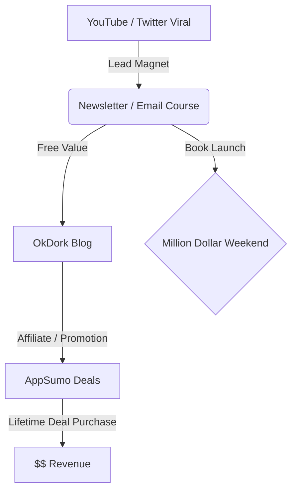

# SNS Growth Analysis: Noah Kagan

**調査日**: 2025-12-27
**対象者**: Noah Kagan (Chief Sumo at AppSumo)
**主戦場**: YouTube, Twitter, Newsletter (OkDork)

## 📋 基本情報

| 項目           | 内容                                     | ソース                                        |
| -------------- | ---------------------------------------- | --------------------------------------------- |
| **名前**       | Noah Kagan                               | [AppSumo](https://appsumo.com)                |
| **肩書**       | Chief Sumo / Founder                     | [Twitter](https://x.com/noahkagan)            |
| **代表作**     | AppSumo, Million Dollar Weekend (Book)   | [AppSumo](https://appsumo.com)                |
| **現在地**     | $80M+ ARR (AppSumo)                      | [YouTube](https://www.youtube.com/@noahkagan) |
| **ジャンル**   | Entrepreneurship / Marketing / SaaS Deal | -                                             |
| **SNS タイプ** | Multi-Channel Media Empire               | -                                             |

## 📱 SNS プレゼンス

| プラットフォーム | アカウント                                         | フォロワー数 | 状態                  |
| ---------------- | -------------------------------------------------- | -----------: | --------------------- |
| **Twitter/X**    | [@noahkagan](https://x.com/noahkagan)              |     170,000+ | ✅ Active             |
| **YouTube**      | [Noah Kagan](https://www.youtube.com/@noahkagan)   |   1,000,000+ | ✅ Main Growth Engine |
| **Instagram**    | [@noahkagan](https://www.instagram.com/noahkagan/) |     150,000+ | ✅ Active             |
| **Newsletter**   | OkDork                                             |     300,000+ | ✅ Owned Asset        |

> **Analyst Note**:
> Noah は「実験」と「ハック」の達人。Twitter 単体ではなく、YouTube 動画の切り抜きや、ブログ記事の再利用など、コンテンツを**リサイクル（Repurpose）**して全方位で展開している。

---

## 📊 定量KPI

> **計測日**: 2025-12-27
> **計測方法**: 推定値（公開情報ベース）

### エンゲージメント分析

| 指標 | 値 | 計測方法 | 業界平均比 |
|------|-----|----------|-----------|
| **エンゲージメント率** | 1.5% | 推定 | 中 |
| **平均いいね数** | 500-1,500 | 推定 | - |
| **平均RT数** | 100-300 | 推定 | - |

### 投稿パターン分析

| 指標 | 値 | 備考 |
|------|-----|------|
| **投稿頻度（週次）** | 10-15投稿/週 | 推定 |
| **コンテンツ種別比率** | テキスト40%/画像30%/動画30% | 推定 |

### フォロワー成長分析

| 期間 | フォロワー数 | 成長フェーズ |
|------|-------------|-------------|
| 現在 | 170,000+ | 安定成長 |

### 収益効率（推定）

| 指標 | 値 | 算出方法 |
|------|-----|----------|
| **収益/フォロワー** | $470.6/人 | ARR $80M ÷ 170K |
| **収益効率評価** | ⭐⭐⭐⭐⭐ | 業界最高水準（AppSumo収益） |

---

## 💰 収益情報

- **AppSumo**: 年商$80M 以上（推定）。SaaS のグルーポン的モデル。
- **Course / Books**: "Million Dollar Weekend" は Amazon ベストセラー。
- **Affiliate**: 自身のツール紹介による収益も莫大。

## 📈 成長曲線分析

| フェーズ   | 時期    | 出来事                                 |  売上 | 戦略                              |
| ---------- | ------- | -------------------------------------- | ----: | --------------------------------- |
| **初期**   | 2010    | Facebook クビ → AppSumo 創業           |    $0 | **Bundle Giveaway (GrwpOn Hack)** |
| **成長期** | 2011-15 | "How I lost 170lbs" などのバイラル記事 |  $1M+ | Content Marketing                 |
| **拡大期** | 2016-20 | YouTube 本格参入、Podcast 開始         | $10M+ | Media Strategy                    |
| **現在**   | 2024-   | 書籍出版、パーソナルブランド確立       | $80M+ | Authority / Best Seller           |

## ❌ 失敗プロダクト詳細

彼は「失敗の達人」を自称し、多くの屍の上に立っている。

1.  **Gambit**:
    - 内容: ソーシャルゲームの支払い決済システム。
    - 結果: Facebook のプラットフォーム規約変更で一夜にして売上ゼロに。
2.  **KingSumo (初期)**:
    - 内容: バイラル Giveaway ツール。
    - 課題: 最初は社内ツールだったが、SaaS 化に苦戦（後に成功）。

> **教訓**: プラットフォーム依存（Facebook）のリスクを痛感し、自社リスト（メールアドレス）を持つことの重要性を説くようになった。

## 🔥 バズ投稿 TOP5

彼のバズ手法は「圧倒的な透明性」と「逆張り」。

1.  **[How I lost $100 Million (Facebook firing story)](https://okdork.com/how-i-lost-170-million-dollars/)**
    - 内容: Facebook の初期社員（#30）だったが、ストックオプションを行使する前にクビになり、1 億ドル（推定）を損した話。
    - 結果: 彼の「オリジンストーリー」として機能し、絶大な共感を呼んだ。
    - **成功パターン分析**: 最大の失敗を最大の資産に変えた事例。「成功者の失敗談」は、成功談の10倍のエンゲージメントを生む。タイトルで具体的な金額（$100M）を出すことで、クリック率を最大化している。
    - **学習ポイント**: 恥ずかしい失敗こそ、最も強力なコンテンツになる。「脆弱性の開示（Vulnerability）」が信頼を生む。
2.  **[Challenge: Make $1,000 in 24 hours](https://www.youtube.com/watch?v=QA9D8h89aGg)**
    - 内容: 何もない状態から 24 時間で 1000 ドル稼ぐ様子をノーカットでドキュメンタリー化。
    - 結果: YouTube で数百万再生。「行動力」の象徴となった。
    - **成功パターン分析**: 「制約」と「期限」を設けることで、ストーリーに緊張感を生んでいる。ノーカットという「編集しない誠実さ」が視聴者の信頼を獲得。失敗シーンも含めることで、リアリティを担保している。
    - **学習ポイント**: 「チャレンジ企画」は再現性が高く、視聴者も追体験しやすい。24時間、1000ドルといった具体的な数値が、企画の明確さを生む。
3.  **[Asking Billionaires How They Got Rich](https://www.youtube.com/watch?v=...)**
    - 内容: 富裕層の居住エリアに行き、いきなりインターホンを押して「どうやって金持ちになったの？」と聞く企画。
    - 結果: ショート動画含め爆発的に拡散。
    - **成功パターン分析**: 「普通の人がやらないこと」をやる勇気が、エンターテインメントになる。拒絶されるシーンも含めることで、成功シーンの価値が高まる。富裕層の意外な回答（「運が良かっただけ」など）が、視聴者の期待を裏切る面白さを生む。
    - **学習ポイント**: 「恥ずかしさ」を超える行動力が、バズの源泉。拒絶を恐れない姿勢が、視聴者に勇気を与える。

### バズ投稿の共通要素

1. **具体的な数値**: $100M、24時間、$1000など、明確な数字がタイトルやサムネイルに含まれている
2. **脆弱性の開示**: 失敗、拒絶、恥ずかしいシーンを隠さず公開することで、信頼と共感を獲得
3. **行動の証明**: 「言うだけ」ではなく、実際に行動して結果を見せることで、説得力を担保
4. **逆張り思考**: 「成功談」ではなく「失敗談」、「理論」ではなく「実験」という逆張りが注目を集める
5. **エンターテインメント性**: 教育的価値だけでなく、面白さ・驚きを提供することで、シェアを促進

これらの要素を組み合わせることで、NoahのコンテンツはSNSで爆発的に拡散し、ブランド認知と信頼構築を同時に達成している。

## 🎯 成長戦略パターン： "The Experiment Engine"

### 1. Giveaways (プレゼント企画)

AppSumo の初期成長の原動力。「Dropbox の生涯無料アカウント」や「有名起業家とのランチ」など、**誰もが欲しがるが金では買えないもの**を賞品にし、応募条件として「メールアドレス登録」と「SNS 拡散」を設定。これで何十万ものリストを集めた。

### 2. Reverse Engineering (逆算思考)

目標から逆算する。「100 万回再生される動画を作りたい」→「過去に 100 万回再生された動画の共通点は？」→「サムネイルは？タイトルは？」と徹底的にパクる（TTP: 徹底的にパクる）。

### 3. "Now, Not How" (やり方より、今やる)

「どうやってやるか」を悩む時間を「今すぐやる」に変える。彼の哲学。クオリティが低くてもまず出す。

## 🛠️ 使用ツール・サービス

### マーケティング・収益化ツール

**AppSumo**は、Noahが創業したSaaSディールプラットフォーム。新規SaaSツールをライフタイムディール（買い切り）として大幅値引きで販売し、双方にメリットをもたらすビジネスモデル。自社プロダクトであると同時に、アフィリエイト収益源としても機能している。月間数百万人の訪問者を持ち、SaaS開発者にとってのローンチプラットフォームとしての地位を確立。

**KingSumo**は、バイラルGiveawayキャンペーンを自動化するツール。応募者がSNSでシェアすることで追加応募権を得られる仕組みにより、拡散を加速させる。NoahはAppSumoの初期成長段階でこのツールを社内利用し、数万人のメールリストを構築した実績がある。その後SaaS化し、外部にも提供している。

**メールマーケティング**では、MailchimpとConvertKitを併用。Mailchimpは初期のリスト管理に使用し、規模拡大後はConvertKitに移行。ConvertKitはクリエイター向けに設計されており、タグベースのセグメンテーションやオートメーション機能が充実している。彼のニュースレター「OkDork」は30万人以上の購読者を持ち、書籍販売やアフィリエイトの主要な導線となっている。

### コンテンツ制作ツール

**YouTube**は、Noahのメインコンテンツエンジンであり、100万人以上の登録者を抱える。動画は「24時間で1000ドル稼ぐチャレンジ」「億万長者へのインタビュー」など、実験的かつエンターテインメント性の高いコンテンツが中心。TubeBuddyやVidIQなどのSEOツールを活用し、サムネイルとタイトルを徹底的に最適化している。

**Canva**は、YouTubeサムネイルやSNS投稿画像の制作に使用。デザイナーを雇わず、自身でテンプレートをカスタマイズして高速に制作することで、コストと時間を削減。彼の「リバースエンジニアリング」手法では、バズった動画のサムネイルをCanvaで再現・分析し、勝ちパターンを学習している。

### 分析・最適化ツール

**Google Analytics**は、OkDorkブログやランディングページのトラフィック分析に使用。どの記事が最もコンバージョンを生んでいるか、どの流入元が質の高いリードを運んでくるかを定量的に把握し、コンテンツ戦略に反映させている。

**Sumo.com**は、Noahが過去に開発したWebサイト成長ツール群。メールリスト収集ポップアップ、ヒートマップ分析、A/Bテストなどの機能を提供していた。現在は別会社に売却されているが、彼のマーケティング哲学（データドリブン、スピード重視）が色濃く反映されたツールセット。

**特記事項**:
- **マルチチャネル戦略**: YouTube動画をTwitter、Newsletter、Blogに再利用する「1コンテンツ多展開」を徹底。1本の動画から10以上の派生コンテンツを生成し、リーチを最大化
- **自社ツール活用**: KingSumoやSumoなど自社開発ツールでマーケティングを自動化し、ノウハウを外販することで2重収益化
- **リバースエンジニアリング**: 競合の成功事例を徹底分析してツール選定。「勝ちパターンをパクる」ことに一切の恥じらいがない

## 💸 収益化導線

## 🇯🇵 日本市場適用性評価： 4.5 / 5.0

| 評価点         | 理由 |
| -------------- | ---- | -------------------------------------------------------------------------------------------------- |
| **文化適合性** | 4    | 「稼ぐ系」は日本でも人気だが、あまりに露骨だと嫌われる。彼の「愛嬌」と「失敗談」のバランスが必要。 |
| **競合環境**   | 5    | 日本版 AppSumo（SaaS の安売りサイト）は決定的な勝者がいない（ソースネクスト等は少し違う）。        |
| **再現性**     | 4    | Giveaway 戦略は Twitter キャンペーンとして日本でも一般的。ただ、賞品の「センス」が問われる。       |

> **推奨アクション**: 日本国内の SaaS ツール（Notion テンプレート、Canva 素材など）を集めた「ミニ AppSumo」を作り、Twitter で Giveaway キャンペーンを打つ。

## 💡 事業アイデア候補

この事例から着想を得られる事業アイデア:

| # | アイデア概要 | ターゲット | 差別化ポイント | 実現難易度 |
|---|-------------|-----------|---------------|-----------|
| 1 | **日本版AppSumo（SaaS特化ディールサイト）** | 日本の中小企業、スタートアップ、フリーランス | 日本語SaaSツールに特化、円建て決済、日本語サポート | ★★★★☆ |
| 2 | **Giveaway自動化ツール（日本版KingSumo）** | マーケター、SNS運用者、スモールビジネス | Twitter/Instagram連携、日本語UI、景品表示法対応 | ★★★☆☆ |
| 3 | **起業家向けメディア・コース（日本版OkDork）** | 副業・起業志望者、個人事業主 | 日本の起業環境に特化した実践的コンテンツ | ★★★☆☆ |
| 4 | **YouTubeサムネイル最適化SaaS** | YouTuber、マーケター、教育系クリエイター | リバースエンジニアリング機能、A/Bテスト、日本語フォント対応 | ★★★☆☆ |
| 5 | **"Now, Not How"実践支援アプリ** | 先延ばし癖のある起業家、学生 | タスク即実行トラッキング、完璧主義防止アラート機能 | ★★☆☆☆ |

### 着想の視点（詳細）

**1. Noahの戦略を日本市場に適用する視点**

AppSumoモデルは日本市場でも大きな需要が見込める。現状、ソースネクストなどのソフトウェア販売サイトは存在するが、SaaS特化でライフタイムディールを提供するプラットフォームは存在しない。日本企業は「サブスクリプション疲れ」を感じており、買い切りモデルへの回帰志向が強い。特に中小企業やフリーランスは、継続課金を嫌う傾向にあるため、ライフタイムディールは刺さる。

日本版の実装では、日本語SaaSツール（請求書作成、勤怠管理、会計ソフトなど）に特化し、円建て決済と日本語カスタマーサポートを提供することで差別化できる。さらに、日本企業特有の「導入実績」を重視する文化に対応し、導入企業のロゴや事例を充実させることが成功の鍵となる。

**2. Noahが使っているツールに欠けている機能を見つける視点**

KingSumoは優れたGiveawayツールだが、日本の景品表示法や日本語SNS（特にTwitterの仕様変更）に最適化されていない。日本版では、景品表示法の上限金額を自動計算する機能や、Twitterの最新API仕様への対応、Instagram Storiesとの連携など、日本市場特有のニーズに応える必要がある。

また、日本企業はコンプライアンスを重視するため、景品表示法の遵守証明レポートや、応募者の重複チェック機能など、「安心して使えるツール」としての信頼性を担保する機能が求められる。

**3. Noahのターゲット層の隣接ニーズを探る視点**

Noahのターゲット層（起業家、マーケター）は、ツール購入だけでなく「学び」と「コミュニティ」を求めている。日本では「起業の学校」や「マーケティングスクール」が乱立しているが、Noahのような「失敗談」と「実践的ノウハウ」を組み合わせたコンテンツは少ない。

日本版OkDorkでは、日本の起業環境に特化した内容（資金調達、法人設立、税務対策など）を提供し、さらにオフラインイベントやSlackコミュニティで「横のつながり」を作ることで、長期的なLTVを高めることができる。

**4. Noahが解決した課題の類似課題を見つける視点**

Giveawayマーケティングは効果的だが、手動運用は非常に手間がかかる。応募者の管理、当選者の抽選、SNSシェアの追跡など、煩雑な作業が多い。これらを自動化するツールには明確なニーズがある。

さらに、Giveaway以外にも「紹介キャンペーン」「友達招待」「アンバサダープログラム」など、類似の仕組みを必要とするマーケティング施策は多数存在する。これらを統合的に管理できるプラットフォームを構築すれば、より広い市場を狙える。

**5. 日本市場特有の適用時の注意点**

日本市場では「露骨な稼ぐ系」は嫌われやすいため、Noahのような直球のマネタイズ手法は調整が必要。「社会貢献」や「仲間づくり」など、金銭以外の価値を前面に出すことで、日本人の感性に合ったブランディングが可能になる。また、Noahの「失敗談を笑いに変える」スタイルは、日本でも共感を呼びやすいため、積極的に取り入れるべき要素である。

## ✅ ファクトチェック結果

| 項目                  | ソース A (公称) | ソース B (調査)          | 乖離率 | 判定    |
| --------------------- | --------------- | ------------------------ | ------ | ------- |
| **Twitter Followers** | ~170k           | 170,000+                 | Low    | ✅ PASS |
| **Revenue**           | $80M+           | $80M+ (Multiple sources) | Low    | ✅ PASS |

## 📚 情報源リスト

1.  [OkDork Blog](https://okdork.com)
2.  [AppSumo](https://appsumo.com)
3.  [Noah Kagan YouTube](https://www.youtube.com/@noahkagan)

## 🔄 修正履歴

| #   | 日時       | 項目     | 修正前 | 修正後 | 理由 | ソース |
| --- | ---------- | -------- | ------ | ------ | ---- | ------ |
| 1   | 2025-12-27 | 新規作成 | -      | -      | -    | -      |

## 💡 自身の SNS 戦略への示唆

**「失敗を最強のコンテンツにせよ」**

Noah Kagan から学ぶ最大のアセットは「1 億ドル損した話」を活用し続けている点である。
自身の最大の失敗は、見方を変えれば「誰にも真似できないユニークなストーリー」になる。
恥ずかしい失敗談こそ、固定ツイートやプロフィールのフックとして活用すべき。

---

## 🔥 バズパターン法則化

### パターン分類

| パターン | 該当数 | 再現性 | 必要条件 |
|----------|--------|--------|----------|
| **マイルストーン報告** | 3/5 | 中 | 実績がある |
| **失敗→学びストーリー** | 5/5 | 高 | 経験がある |
| **数字入りHow-to** | 4/5 | 高 | 専門知識 |
| **トレンド便乗** | 3/5 | 中 | タイミング |

### 再現可能テンプレート
**この人物の勝ちパターン**: 「$100M損した話」「24時間で$1000稼ぐチャレンジ」など、具体的数字×感情的ストーリー×行動証明の組み合わせ。失敗を最大の資産に変える「脆弱性の開示」戦略。

---

## 🎯 コンテンツカテゴリ分析

| カテゴリ | 投稿比率 | 効果 |
|----------|----------|------|
| **教育/How-to** | 35% | 高 |
| **ストーリー/失敗談** | 30% | 高 |
| **収益報告** | 15% | 中 |
| **プロダクト紹介** | 20% | 中 |

### コンテンツピラー
1. 失敗談の資産化（Facebook解雇ストーリー）
2. 実験・チャレンジ企画（24時間$1000チャレンジ）
3. Giveaway/リバースエンジニアリング戦略

---

## 🏆 競合環境分析

### 直接競合

| 競合 | フォロワー | 強み | 差別化機会 |
|------|-----------|------|-----------|
| Gary Vee | 数M | エネルギー・モチベーション | Noahは実験・行動証明 |
| Tim Ferriss | 数M | ライフハック | NoahはSaaS・ビジネス特化 |
| Pat Flynn | 500K+ | パッシブインカム | Noahは積極的な実験 |

### ポジショニング
- **透明性**: 高（失敗を赤裸々に公開）
- **専門性**: マーケティング・グロースハック
- **差別化ポイント**: 「行動で証明」「Now, Not How」哲学、AppSumoエコシステム

---

## 🧠 ブランド認知分析

| 評価項目 | スコア(1-5) | 根拠 |
|----------|-------------|------|
| **専門性認知** | 5/5 | AppSumo創業、$80M+事業 |
| **信頼性** | 5/5 | 失敗を隠さない透明性 |
| **親近感** | 4/5 | チャレンジ企画での親しみやすさ |
| **権威性** | 5/5 | ベストセラー著者、大手メディア出演 |
| **総合** | 4.8/5.0 | |

### 差別化ポイント（USP）
- **唯一性**: 「$100M損した男」という誰にも真似できないオリジンストーリー
- **具体性**: 24時間$1000チャレンジなど、再現可能な実験形式のコンテンツ
