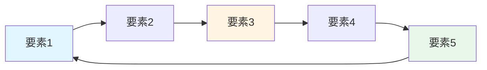

# Flywheel Design（フライホイール設計）

> **出典**: 田所雅之「起業大全」第5章、Jim Collins「Turning the Flywheel」
> **関連**: [[FRAMEWORK_LEAN_001]], [[CONCEPT_PMF_001]]

---

## 1. 定義

**Flywheel（フライホイール）**とは、ビジネスの成長を加速させる「好循環のメカニズム」を設計する戦略フレームワーク。

**フライホイールの本質**:
- 一度回り始めると、勢いが増して加速する
- 各要素が次の要素を強化し、循環が自己強化される
- 外部からの追加投資なしでも成長が持続する

**Amazonフライホイール（2001年発表）**:
```
低価格 → 顧客体験向上 → トラフィック増加 → 出店者増加
→ 品揃え拡大 → 顧客体験向上 → さらなる低価格 → ...
```

## 2. なぜ重要か

フライホイール設計の効果:
- ✅ **持続的成長**: 一時的な施策ではなく、システムとして成長
- ✅ **資本効率**: 追加投資なしでも成長が加速
- ✅ **競合優位性**: 簡単に真似できない複雑な循環構造
- ✅ **意思決定の指針**: 何を優先すべきかが明確に

フライホイールがない場合:
- ❌ 成長が線形的で遅い
- ❌ 常に追加投資が必要
- ❌ 競合に追いつかれやすい

## 3. 成長エンジン3類型

### 3.1 Viral Engine（バイラル型）

| 特徴 | 説明 | 例 |
|------|------|-----|
| **メカニズム** | ユーザーが新規ユーザーを連れてくる | Dropbox、WhatsApp |
| **KPI** | Viral Coefficient（K値） > 1.0 | 1人が1人以上を招待 |
| **成長速度** | 指数関数的（最速） | - |

**Flywheelの例（Dropbox）**:
```
優れた製品 → 友人に共有 → 紹介インセンティブ（追加容量）
→ 新規ユーザー獲得 → ネットワーク価値向上 → 優れた製品 → ...
```

### 3.2 Sticky Engine（リテンション型）

| 特徴 | 説明 | 例 |
|------|------|-----|
| **メカニズム** | ユーザーが使い続ける仕組み | Slack、Notion |
| **KPI** | Churn Rate < Growth Rate | 解約率 < 新規獲得率 |
| **成長速度** | 安定的・持続的 | - |

**Flywheelの例（Slack）**:
```
チーム採用 → 利用頻度増加 → データ蓄積 → スイッチングコスト増大
→ Churn率低下 → 他チームへ推奨 → チーム採用 → ...
```

### 3.3 Paid Engine（広告投資型）

| 特徴 | 説明 | 例 |
|------|------|-----|
| **メカニズム** | LTV > CAC の経済性で拡大 | Amazon、Uber |
| **KPI** | LTV/CAC > 3.0 | - |
| **成長速度** | 投資額に比例 | - |

**Flywheelの例（Amazon）**:
```
低価格 → 顧客満足 → 購入頻度増加 → LTV向上
→ CAC上限引き上げ → より多くの広告投資 → 新規顧客獲得 → ...
```

## 4. 設計ステップ

### STEP 1: 成長エンジンの特定（30分）

**質問**:
1. ユーザーは友人を招待するか？ → Viral
2. ユーザーは毎日使い続けるか？ → Sticky
3. 広告投資で顧客獲得できるか？ → Paid

**判定基準**:
- 1つを**主エンジン**として選定
- 他の2つは補助的に組み合わせ可

### STEP 2: フライホイール要素の洗い出し（60分）

**3つの視点から要素を抽出**:

| 視点 | 質問 | 例 |
|------|------|-----|
| **価値提供側** | 顧客に何を提供するか？ | 低価格、豊富な品揃え、速い配送 |
| **顧客側** | 顧客はどう反応するか？ | 購入、レビュー、友人に共有 |
| **ビジネス側** | ビジネスにどう返ってくるか？ | トラフィック増、出店者増、データ蓄積 |

**ブレストのコツ**:
- 最低5-7要素を抽出
- 定量的に測定可能な要素を優先
- 時間軸（短期/長期）を意識

### STEP 3: 循環ロジックの構築（90分）

**接続ルール**:
1. 各要素が**次の要素を強化する**理由を明確化
2. 循環が**最低4ステップ**で1周する
3. 最終的に**起点に戻る**

**設計テンプレート**:

| ステップ | 要素 | 次への接続理由 |
|:-------:|------|--------------|
| 1 | [要素1] | [要素1]が増えると[要素2]が増える理由 |
| 2 | [要素2] | [要素2]が増えると[要素3]が増える理由 |
| 3 | [要素3] | ... |
| ... | ... | ... |
| N | [要素N] | [要素N]が増えると[要素1]が増える理由（循環） |

**検証質問**:
- 各接続に「なぜ？」を3回繰り返しても成り立つか？
- 外部要因（資金投入等）に依存していないか？

### STEP 4: Mermaid図で視覚化（30分）



### STEP 5: ネットワーク効果の検討（45分）

**3種類のネットワーク効果**:

| タイプ | 説明 | 例 |
|-------|------|-----|
| **直接NE** | ユーザー同士が直接価値を生む | 電話、SNS |
| **間接NE** | 両面市場で相互に価値を高める | Uber（乗客↔︎運転手） |
| **データNE** | データ蓄積で精度向上 | Google検索、Netflix推薦 |

**適用可能性チェック**:
- [ ] ユーザー数が増えると価値が高まるか？
- [ ] 両面市場構造があるか？
- [ ] データ蓄積でサービスが改善するか？

### STEP 6: 強化策の策定（60分）

**各接続ポイントの評価**:

| 接続 | 現状評価 | 強化策 | 優先度 |
|------|:-------:|--------|:------:|
| A → B | 強 | - | Low |
| B → C | 中 | [具体策] | Medium |
| C → D | 弱 | [具体策] | High |

**強化策の例**:
- **弱い接続**: インセンティブ追加、UX改善、自動化
- **中程度**: A/Bテスト、パーソナライゼーション
- **強い**: そのまま維持、監視のみ

### STEP 7: KPI設定（45分）

**各要素の測定指標**:

| 要素 | KPI | 目標値 | 測定頻度 |
|------|-----|--------|:--------:|
| 要素1 | [指標] | [数値] | 週次 |
| 要素2 | [指標] | [数値] | 月次 |

**全体KPI**:
- **循環速度**: 1周にかかる時間
- **加速度**: 月次成長率の変化
- **強度**: 各接続の健全性スコア

## 5. テンプレート

### フライホイール設計テンプレート

```markdown
# [プロダクト名] Flywheel

## 1. 成長エンジン

**選定**: [Viral / Sticky / Paid]

**理由**: [なぜこのエンジンを選んだか]

---

## 2. フライホイール要素

### 価値提供側
1. [要素1]
2. [要素2]
3. [要素3]

### 顧客側
1. [要素4]
2. [要素5]
3. [要素6]

### ビジネス側
1. [要素7]
2. [要素8]

---

## 3. 循環ロジック

| ステップ | 要素 | 次への接続理由 |
|:-------:|------|--------------|
| 1 | [要素1] | [理由] |
| 2 | [要素2] | [理由] |
| ... | ... | ... |

**Mermaid図**:
\`\`\`mermaid
graph LR
    A[要素1] --> B[要素2]
    B --> C[要素3]
    ...
\`\`\`

---

## 4. ネットワーク効果

- [x] 直接ネットワーク効果: [説明]
- [ ] 間接ネットワーク効果: [適用不可]
- [x] データネットワーク効果: [説明]

---

## 5. 強化策

| 接続 | 現状 | 強化策 | 優先度 |
|------|:----:|--------|:------:|
| A→B | 弱 | [策] | High |
| B→C | 中 | [策] | Med |

---

## 6. KPI

| 要素 | KPI | 目標 | 頻度 |
|------|-----|------|:----:|
| [要素1] | [指標] | [値] | 週次 |
```

### 記入例（Notion）

```markdown
# Notion Flywheel

## 1. 成長エンジン

**選定**: Sticky Engine（リテンション型）

**理由**:
- ユーザーがデータを蓄積するほどスイッチングコストが高まる
- チーム利用で組織全体に浸透
- 高いリテンション率（90%+）が成長の鍵

---

## 2. フライホイール要素

### 価値提供側
1. 柔軟なブロックシステム
2. テンプレート豊富
3. データベース機能

### 顧客側
1. 個人利用開始
2. データ蓄積
3. チームメンバー招待
4. 組織全体へ拡大

### ビジネス側
1. テンプレート利用データ収集
2. おすすめ機能の精度向上
3. ネットワーク効果

---

## 3. 循環ロジック

| ステップ | 要素 | 次への接続理由 |
|:-------:|------|--------------|
| 1 | 個人利用開始 | 柔軟性に惹かれて個人のメモとして使い始める |
| 2 | データ蓄積 | 毎日使うことでデータが増え、Notionが「第二の脳」に |
| 3 | スイッチングコスト増大 | データが増えるほど他ツールへの移行が困難に |
| 4 | チーム招待 | 便利さを実感し、同僚を招待 |
| 5 | 組織全体へ拡大 | チーム利用が成功し、全社導入へ |
| 6 | テンプレート共有 | 社内テンプレートが増え、さらに便利に |
| 7 | 新規個人ユーザー | 他チームのメンバーが個人でも使い始める（循環） |

**Mermaid図**:
\`\`\`mermaid
graph LR
    A[個人利用開始] --> B[データ蓄積]
    B --> C[スイッチングコスト増大]
    C --> D[チーム招待]
    D --> E[組織全体へ拡大]
    E --> F[テンプレート共有]
    F --> A

    style A fill:#e1f5ff
    style C fill:#fff4e1
    style E fill:#e8f5e9
\`\`\`

---

## 4. ネットワーク効果

- [x] **直接NE**: チームメンバーが増えるほど、共同編集の価値が高まる
- [x] **間接NE**: テンプレート作成者とユーザーの両面市場
- [x] **データNE**: 利用データでおすすめ機能・検索精度が向上

---

## 5. 強化策

| 接続 | 現状 | 強化策 | 優先度 |
|------|:----:|--------|:------:|
| データ蓄積→招待 | 中 | 招待インセンティブ追加 | High |
| チーム→全社 | 弱 | 管理者向けダッシュボード提供 | High |
| 個人開始→蓄積 | 強 | そのまま維持 | Low |

---

## 6. KPI

| 要素 | KPI | 目標 | 頻度 |
|------|-----|------|:----:|
| 個人利用 | DAU/MAU | 40%+ | 週次 |
| データ蓄積 | Avg Pages per User | 50+ | 月次 |
| チーム招待 | Invite Rate | 30% | 月次 |
| 組織拡大 | Team Size Growth | 20%/月 | 月次 |
| リテンション | D30 Retention | 60%+ | 月次 |
```

## 6. よくある失敗パターン

| パターン | 症状 | 対策 |
|---------|------|------|
| **循環になっていない** | 要素が一方通行で終わる | 起点に戻る接続を明確化 |
| **要素が多すぎる** | 複雑で理解できない | 5-7要素に絞る |
| **外部要因依存** | 資金投入しないと回らない | 自己強化される循環を設計 |
| **測定不可能** | KPIが曖昧 | 各要素に具体的指標を設定 |
| **弱い接続を放置** | 循環が加速しない | 弱い接続を最優先で強化 |

## 7. 事例

### 7.1 成功事例

- **Amazon**: 低価格→顧客満足→トラフィック→出店者→品揃え→低価格（循環）
- **Facebook**: ユーザー増→コンテンツ増→価値向上→ユーザー増（ネットワーク効果）
- **Tesla**: 高価格車→利益→R&D投資→量産車→低価格化→市場拡大→高価格車（循環）

### 7.2 失敗事例

- **Groupon**: クーポン発行→顧客獲得→... → 循環せず線形成長に終わる
- **Quibi**: コンテンツ投資→ユーザー獲得→... → シェア機能なしでViral効果ゼロ

## 8. 関連フレームワーク

| フレームワーク | 関係性 | リンク |
|--------------|--------|--------|
| Lean Canvas | Flywheelが成長戦略を具体化 | [[FRAMEWORK_LEAN_001]] |
| AARRR | FlywheelのKPI設定に利用 | [[FRAMEWORK_AARRR_001]] |
| Unit Economics | Paid EngineのLTV/CAC計算 | [[TACTIC_UNIT_ECO_001]] |

---

## クイックリファレンス

```
用途: 持続的成長の仕組みを設計
所要時間: 3-4時間（初回設計）
出力: Flywheel図、循環ロジック、KPI
タイミング: リーンキャンバス作成後、PSF検証前
更新頻度: 四半期ごと、ピボット時
成功指標: 各KPIが月次で改善、循環速度が加速
```

---

**ファイル情報**
- 作成日: 2025-12-28
- 最終更新: 2025-12-28
- バージョン: 1.0
