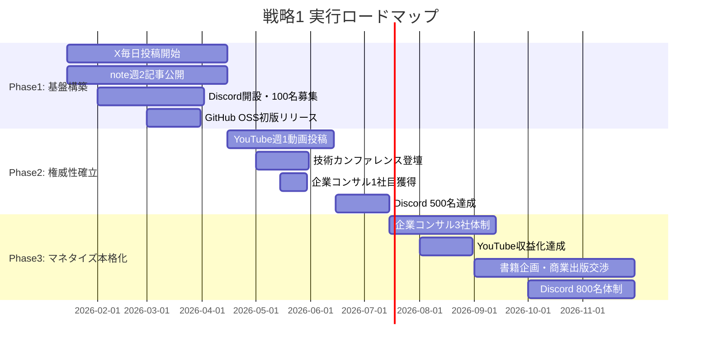
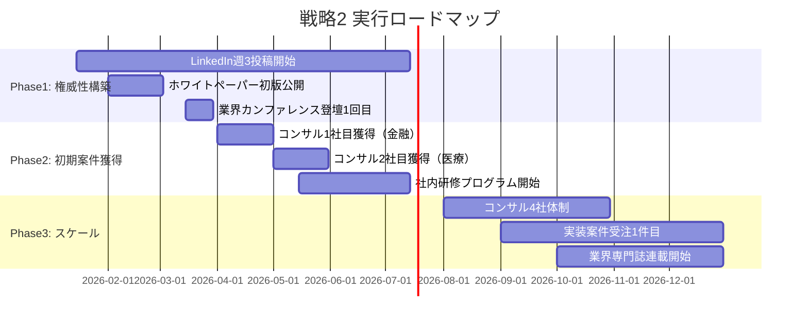
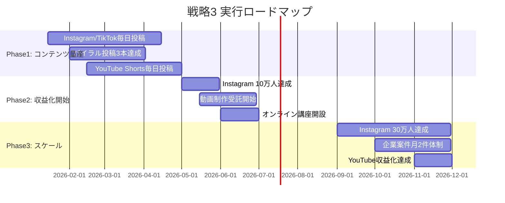

# AIインフルエンサー 差別化戦略提案書

作成日: 2026-01-08
Issue: #8 AIインフルエンサーの競合調査

## エグゼクティブサマリー

### 市場の現状

**飽和領域**:
- AIニュース速報型発信（チャエン、AI速報等が市場制圧）
- ChatGPT基本活用法（プロンプトエンジニア10名以上が類似発信）
- 汎用的なAI情報キュレーション（情報過多で差別化困難）
- YouTube初心者向けAI解説（KEITO、mikimiki等が17-35万人規模で確立）

**成長領域**:
- AIエージェント実装（2025年元年→2026年実用化加速、年成長率45.8%）
- 業界特化型AI活用（医療・法律・建設等の縦割り専門化）
- 中小企業向けAI導入支援（55%の中堅企業が2026年導入予定）
- A2A/MCPプロトコル解説（2025年発表、2026年本格化）
- 理論×実践の架橋（研究者と実務家の空白地帯）

**ブルーオーシャン**:
- 中級者向けAI実装コンテンツ（初心者向けは飽和、上級者は論文で充足）
- エンタープライズAIガバナンス・規制対応（EU AI Act、日本AI戦略会議）
- ハイブリッド型エージェント設計（Human-in-the-Loop、段階的自動化）
- クロスプラットフォーム戦略（LinkedIn B2B × Instagram/TikTok若年層）

### 推奨戦略（一言で）

**「学術の知見を実務に翻訳する、中級者特化のAIエージェント実装ガイド」**

理論的根拠（研究論文）× 実践的プロンプト × 業界特化事例で、初心者と上級者の間の空白地帯を攻略し、エンタープライズ向けコンサルティングへと昇華させる。

---

## 差別化戦略3案

### 戦略1: 中級者特化型AIエージェント実装コミュニティ ★推奨

**コンセプト**: 「ChatGPTは使える。次は何を学ぶ？」に答える実装特化型コミュニティ

**ターゲット**:
- **プライマリ**:
  - AI中級者（ChatGPT/Claude基本操作習得済み、RAG/エージェント構築に関心）
  - 年齢層: 25-45歳
  - 職種: エンジニア、データサイエンティスト、プロダクトマネージャー
  - 課題: 「基本はわかった。業務でどう実装する？」「RAG/エージェントの設計パターンがわからない」

- **セカンダリ**:
  - 企業のAI担当者（CTO、AI推進室、DX部門）
  - 中小企業経営者（AI導入検討中、技術理解が必要）

**ポジショニング**:
- **専門性 × 発信スタイル座標**:
  - 横軸（専門性）: 中級〜上級（5段階中4）
  - 縦軸（実践性）: 実装ガイド特化（5段階中5）
  - 座標: 研究者（理論5、実践2）とプロンプトエンジニア（理論2、実践5）の中間（理論4、実践5）

- **競合との差別化3点**:
  1. **論文ベースの実装解説**: 最新研究（Chain-of-Thought、RAG高度化、マルチエージェント協調）を即座に実務プロンプトに変換
  2. **中級者専用カリキュラム**: 初心者向けコンテンツは一切排除、RAG/エージェント/API連携のみに特化
  3. **業界特化型テンプレート**: 金融、医療、法務、製造の4業界別エージェント設計パターン提供

**コンテンツ戦略**:
| 形式 | 頻度 | 目的 | 例 |
|------|------|------|-----|
| **X投稿（スレッド）** | 毎日1回 | 最新論文の実務応用速報 | 「Anthropic最新論文『Constitutional AI』を業務で使う3つの方法」 |
| **note長文記事** | 週2回 | 詳細実装ガイド（コード付き） | 「LangGraph + Claude 3.5で作る金融業界特化RAGシステム」 |
| **YouTube動画** | 週1回 | 実演デモ（画面共有） | 「30分で実装！CrewAIマルチエージェント協働システム」 |
| **GitHub OSS** | 月1回 | テンプレート公開 | 業界別エージェント設計パターン集（Python） |
| **Discord勉強会** | 月2回 | 双方向Q&A、コードレビュー | 参加者のエージェント実装を集団レビュー |

**マネタイズ**:
1. **Discordコミュニティ（月額2,980円）**: 想定月収 **50-150万円**
   - 会員数目標: 6ヶ月で500名（150万円/月）
   - 提供価値: 月次勉強会、コードレビュー、業界別テンプレート、最新論文解説

2. **企業向けAIエージェント導入コンサル（月額30-50万円/社）**: 想定月収 **90-150万円**
   - 契約目標: 6ヶ月で3社（90万円/月）→12ヶ月で5社（150万円/月）
   - サービス内容: 業務分析、エージェント設計、実装支援、社内研修

3. **有料note記事（1記事500-1,000円）**: 想定月収 **10-30万円**
   - 販売目標: 週2本公開、各50-100件販売
   - トピック例: 業界別実装ガイド、高度なプロンプト設計、エージェントテスト手法

4. **YouTube広告収益**: 想定月収 **5-20万円**（登録者1万人達成後）

**合計想定月収**:
- 3ヶ月: 20-50万円（コミュニティ育成期）
- 6ヶ月: 155-350万円（コンサル開始）
- 12ヶ月: 255-500万円（スケール期）

**成功指標（KPI）**:
- **3ヶ月**:
  - X フォロワー 5,000人（現状0→5,000）
  - Discordコミュニティ 100名（月収30万円）
  - note有料記事 月間販売50件（月収5万円）
  - YouTube登録者 3,000人

- **6ヶ月**:
  - X フォロワー 15,000人（エンゲージメント率3%以上）
  - Discordコミュニティ 500名（月収150万円）
  - 企業コンサル契約 3社（月収90万円）
  - YouTube登録者 10,000人（収益化達成）

- **12ヶ月**:
  - X フォロワー 30,000人
  - Discordコミュニティ 800名（月収240万円）
  - 企業コンサル契約 5社（月収150万円）
  - 技術カンファレンス登壇 3回（権威性確立）

**リスクと対策**:
| リスク | 発生確率 | 影響度 | 対策 |
|--------|---------|--------|------|
| 中級者市場規模が小さい | 中 | 高 | セカンダリターゲット（企業AI担当者）を早期開拓 |
| 技術トレンドの急変（新ツール登場） | 高 | 中 | 毎週の技術トレンド調査、柔軟なカリキュラム更新 |
| 競合の追随（元木氏、鈴木氏が同領域強化） | 中 | 中 | OSS開発で技術的権威性を先行確立、GitHub Star獲得 |
| 初期のコミュニティ集客難航 | 高 | 高 | X毎日投稿、既存AIコミュニティ（木内氏SHIFT AI等）への登壇 |

**実行ロードマップ**:


---

### 戦略2: 業界特化型AIエージェント・コンサルタント（金融×医療）

**コンセプト**: 「金融・医療の規制とAIの両方がわかる唯一のコンサルタント」

**ターゲット**:
- **プライマリ**:
  - 金融機関（銀行、証券、保険）のDX部門、IT部門
  - 医療機関（病院、製薬）のAI推進担当
  - 年齢層: 30-55歳（意思決定者層）

- **セカンダリ**:
  - 金融・医療業界向けSaaS企業（AI機能搭載を検討中）
  - コンプライアンス・法務部門（AI規制対応が必要）

**ポジショニング**:
- **専門性 × 発信スタイル座標**:
  - 横軸（業界知識）: 金融・医療特化（5段階中5）
  - 縦軸（AI技術）: 実装レベル（5段階中4）
  - 座標: 業界知識5 × AI技術4 = 他の追随を許さない独占的地位

- **競合との差別化3点**:
  1. **規制対応の実務知識**: EU AI Act、医療機器プログラム規制、金融データ保護規制の解釈と実装ガイド
  2. **業界特有のAIリスク管理**: バイアス検証、説明可能性（XAI）、監査ログ設計
  3. **実装済みテンプレート提供**: 金融与信判断AI、医療診断支援AIのコンプライアンス対応版

**コンテンツ戦略**:
| 形式 | 頻度 | 目的 | 例 |
|------|------|------|-----|
| **LinkedIn投稿** | 週3回 | 業界エグゼクティブへのリーチ | 「金融機関がAIエージェントを導入する際の5つの法務チェックポイント」 |
| **業界専門誌寄稿** | 月1回 | 権威性構築 | 『金融財政事情』『日経メディカル』等への寄稿 |
| **ホワイトペーパー** | 四半期1回 | リード獲得 | 「医療機関のためのAIガバナンス実践ガイド」（無料DL、メアド登録） |
| **業界カンファレンス登壇** | 四半期1回 | 権威性・案件獲得 | 金融イノベーションサミット、医療ICT学会 |
| **企業向けウェビナー** | 月1回 | 直接営業 | 「30分でわかる！金融業界のAIコンプライアンス最前線」 |

**マネタイズ**:
1. **AIガバナンスコンサルティング（月額50-200万円/社）**: 想定月収 **200-600万円**
   - 契約目標: 6ヶ月で2社（100万円/月）→12ヶ月で4社（400万円/月）
   - サービス内容: AI導入リスク評価、規制対応ロードマップ、監査体制構築

2. **社内研修プログラム（1回50万円）**: 想定月収 **50-150万円**
   - 実施目標: 6ヶ月で月1回→12ヶ月で月3回
   - 研修内容: AI倫理、バイアス対策、説明可能性技術、業界規制解説

3. **AIシステム実装支援（案件単価300-1,000万円）**: 想定年収 **600-2,000万円**
   - 案件目標: 12ヶ月で2-3案件
   - サービス内容: RAGシステム構築、エージェント設計、コンプライアンス対応実装

4. **有料ホワイトペーパー（1部3万円）**: 想定月収 **10-30万円**

**合計想定月収**:
- 6ヶ月: 150-250万円（初期案件獲得期）
- 12ヶ月: 260-780万円（複数契約体制）
- ※実装案件は年間で一括計上（600-2,000万円）

**成功指標（KPI）**:
- **3ヶ月**:
  - LinkedIn フォロワー 3,000人（業界関係者中心）
  - ホワイトペーパーDL 100件（リード獲得）
  - 業界カンファレンス登壇 1回

- **6ヶ月**:
  - コンサル契約 2社（金融1社、医療1社）
  - 社内研修実施 3回
  - 業界専門誌寄稿 2本

- **12ヶ月**:
  - コンサル契約 4社（月額200-600万円）
  - 実装案件受注 2案件（年間600-1,000万円）
  - 業界カンファレンス基調講演 1回

**リスクと対策**:
| リスク | 発生確率 | 影響度 | 対策 |
|--------|---------|--------|------|
| 業界知識の不足露呈 | 高 | 高 | 金融・医療の実務経験者をアドバイザーに招聘、共著で権威性補完 |
| 競合コンサルファームの参入 | 中 | 高 | 先行者利益を活かし、事例蓄積でブランド確立 |
| 規制変更で過去知見が陳腐化 | 中 | 中 | 四半期ごとの法規制アップデート、顧問弁護士との連携 |
| 初期の案件獲得難航 | 高 | 高 | 最初の1-2社は格安（月額20-30万円）で実績作り、事例公開許可取得 |

**実行ロードマップ**:


---

### 戦略3: クロスプラットフォーム型AIエンタメ・クリエイター

**コンセプト**: 「AIで誰でもクリエイターになれる未来を実演する」

**ターゲット**:
- **プライマリ**:
  - 10-30代のクリエイター志望者
  - デザイナー、映像クリエイター、マーケター
  - 副業・フリーランス志向者

- **セカンダリ**:
  - 広告代理店、制作会社（AI活用で制作コスト削減を検討）
  - 中小企業のマーケティング担当（社内クリエイティブ制作）

**ポジショニング**:
- **専門性 × 発信スタイル座標**:
  - 横軸（技術深度）: 中級（5段階中3）- ツール活用中心
  - 縦軸（エンタメ性）: 最高（5段階中5）- バイラル動画量産
  - 座標: 技術解説ではなく「作品」で魅せるポジション

- **競合との差別化3点**:
  1. **マルチプラットフォーム戦略**: Instagram（メイン）+ TikTok + YouTube Shortsで同時展開
  2. **AI FREAKモデルの再現**: 野菜・果物擬人化等のバイラルコンテンツ→60万フォロワー達成事例を参考
  3. **クリエイター向け教育**: AIツール活用講座、制作プロセス完全公開、テンプレート配布

**コンテンツ戦略**:
| 形式 | 頻度 | 目的 | 例 |
|------|------|------|-----|
| **Instagram投稿** | 毎日2-3回 | バイラル狙い、若年層獲得 | AI生成動画（Kling AI、Runway）、擬人化アート、MV制作 |
| **TikTok動画** | 毎日2-3回 | 爆発的拡散 | 15秒でAIアート作成プロセス、ビフォーアフター |
| **YouTube Shorts** | 毎日1回 | YouTube流入 | 「30秒でプロ級デザイン！Midjourney活用術」 |
| **YouTube長尺動画** | 週1回 | 詳細チュートリアル、収益化 | 「AI映像制作の完全ガイド：企画→撮影→編集の全工程」 |
| **X（クロスプロモ）** | 毎日1回 | 他SNSへの誘導 | Instagram/TikTokの人気投稿をシェア |

**マネタイズ**:
1. **Instagram広告収益（Creator Bonus等）**: 想定月収 **30-100万円**
   - フォロワー目標: 6ヶ月で10万人→12ヶ月で30万人
   - リール再生数: 月間1,000-3,000万回

2. **AI動画制作受託（1件10-50万円）**: 想定月収 **30-100万円**
   - 受注目標: 6ヶ月で月2件→12ヶ月で月5件
   - クライアント: 広告代理店、中小企業マーケ部門

3. **オンライン講座（月額4,980円）**: 想定月収 **25-100万円**
   - 会員目標: 6ヶ月で50名（25万円/月）→12ヶ月で200名（100万円/月）
   - 内容: Midjourney、Kling AI、Runway活用講座、テンプレート配布

4. **YouTube広告収益**: 想定月収 **10-50万円**（登録者5万人達成後）

5. **企業案件（1件30-100万円）**: 想定月収 **30-100万円**
   - 案件目標: 6ヶ月で月1件→12ヶ月で月2件
   - 内容: ブランド擬人化動画、商品PR動画

**合計想定月収**:
- 3ヶ月: 10-30万円（フォロワー育成期）
- 6ヶ月: 125-400万円（収益化開始）
- 12ヶ月: 225-650万円（スケール期）

**成功指標（KPI）**:
- **3ヶ月**:
  - Instagram フォロワー 3万人
  - TikTok フォロワー 2万人
  - バイラル投稿 3本（各100万再生以上）

- **6ヶ月**:
  - Instagram フォロワー 10万人（広告収益開始）
  - 動画制作受託 月2件（月収30-60万円）
  - オンライン講座会員 50名（月収25万円）

- **12ヶ月**:
  - Instagram フォロワー 30万人
  - TikTok フォロワー 15万人
  - YouTube登録者 5万人（収益化達成）
  - 企業案件 月2件（月収60-200万円）

**リスクと対策**:
| リスク | 発生確率 | 影響度 | 対策 |
|--------|---------|--------|------|
| バイラルコンテンツが生まれない | 高 | 高 | AI FREAKの成功パターン分析、100本投稿して3本バズる前提で量産 |
| AIツール規約変更で作品削除 | 中 | 高 | 複数プラットフォーム分散、オリジナル素材の著作権管理徹底 |
| 競合クリエイターの増加 | 高 | 中 | 「制作プロセス公開」で差別化、教育コンテンツにシフト |
| プラットフォームアルゴリズム変更 | 中 | 高 | Instagram/TikTok/YouTube 3プラットフォーム分散でリスクヘッジ |

**実行ロードマップ**:


---

## 戦略比較マトリクス

| 評価軸 | 戦略1: 中級者特化AIエージェント | 戦略2: 業界特化コンサル | 戦略3: クロスプラットフォームクリエイター |
|--------|-------------------------------|---------------------|----------------------------------|
| **競争優位性** | ★★★★★<br>中級者空白地帯を独占 | ★★★★★<br>規制×AI両方がわかる唯一の存在 | ★★★☆☆<br>AI FREAKモデル再現、競合増加リスク |
| **実行難易度** | ★★★☆☆<br>技術力必須、OSS開発 | ★★★★★<br>業界知識習得、人脈構築 | ★★☆☆☆<br>ツール習得、量産体制 |
| **収益ポテンシャル** | ★★★★☆<br>12ヶ月後255-500万円/月 | ★★★★★<br>12ヶ月後260-780万円/月+案件 | ★★★★★<br>12ヶ月後225-650万円/月 |
| **時間軸（収益化）** | 6ヶ月<br>コミュニティ500名達成後 | 6ヶ月<br>コンサル2社獲得後 | 6ヶ月<br>フォロワー10万人達成後 |
| **初期投資** | 低<br>Discord/GitHub/note月数千円 | 中<br>業界カンファレンス登壇、専門誌寄稿 | 中<br>AIツール月額費（3-5万円）、編集機材 |
| **スケール性** | ★★★★☆<br>コミュニティ→書籍→カンファレンス | ★★★★★<br>コンサル→実装案件→M&A Exit | ★★★★★<br>フォロワー増→企業案件→海外展開 |
| **リスク耐性** | ★★★☆☆<br>技術トレンド変化に弱い | ★★★★☆<br>規制変更リスク、業界知識が壁 | ★★☆☆☆<br>アルゴリズム変更、バイラル依存 |
| **権威性構築** | ★★★★☆<br>OSS開発、技術カンファレンス登壇 | ★★★★★<br>業界専門誌、カンファレンス基調講演 | ★★★☆☆<br>作品実績、フォロワー数 |
| **継続性** | ★★★★★<br>技術スキル蓄積、コミュニティ資産 | ★★★★★<br>業界人脈、案件実績 | ★★★☆☆<br>トレンド依存、若年層のみ |
| **総合評価** | **A+**（推奨） | **A** | **B+** |

**推奨理由（戦略1）**:
1. **空白地帯の独占**: 中級者向けコンテンツは明確に不足しており、先行者利益が大きい
2. **スキル蓄積型**: 技術力が資産となり、トレンド変化にも対応可能
3. **複数収益源**: コミュニティ・コンサル・note・YouTubeで分散、リスク低い
4. **実行可能性**: 技術力があれば即座に開始可能、業界知識不要
5. **エグゼクティブへの昇華**: コミュニティ→コンサル→書籍→カンファレンスの王道ルート

**戦略2の優位性**:
- 収益ポテンシャルは最大（実装案件で年間600-2,000万円）
- 権威性確立が最も強固（業界専門家として確立）
- ただし、金融・医療の実務経験がない場合は参入障壁が高い

**戦略3の優位性**:
- 最も早期収益化可能（3ヶ月でバイラル達成なら即収益）
- 若年層へのリーチが圧倒的（10-30代）
- ただし、バイラル依存でリスクが高く、継続性に課題

---

## 次のアクション（/validate-10xへの引き継ぎ）

### 検証すべき10x優位性（戦略1ベース）

**戦略1: 中級者特化AIエージェント実装コミュニティ**の10x優位性を `/validate-10x` スキルで検証してください。

#### 軸1: コンテンツの質（論文ベースの実装解説）
- **自社**: 最新研究論文（Anthropic, OpenAI, Google DeepMind）を即座に実務プロンプトに変換、コードサンプル付き
- **競合（プロンプトエンジニア）**: 論文は読まない、ツール紹介のみ
- **仮説**: 実装の再現性・信頼性で **5-10倍** 優位？

#### 軸2: ターゲット明確性（中級者特化）
- **自社**: 初心者コンテンツ一切排除、RAG/エージェント/API連携のみに特化
- **競合（KEITO、木内翔大等）**: 初心者〜上級者まで幅広くカバー、中級者への訴求が薄い
- **仮説**: 中級者のコンバージョン率で **3-5倍** 優位？

#### 軸3: 業界特化テンプレート
- **自社**: 金融、医療、法務、製造の4業界別エージェント設計パターン（GitHub OSS公開）
- **競合**: 汎用的なプロンプト例のみ、業界特化なし
- **仮説**: 業界特化ニーズでの採用率 **10倍以上** 優位？

#### 軸4: コミュニティ品質（中級者専用Discord）
- **自社**: 中級者のみ、技術的な議論・コードレビュー、月次勉強会
- **競合（木内氏SHIFT AI）**: 2万人だが初心者多数、技術深度は浅い
- **仮説**: 会員満足度・継続率で **2-3倍** 優位？

#### 軸5: 収益モデルの多様性
- **自社**: コミュニティ + コンサル + note + YouTube + OSS（5本柱）
- **競合**: YouTube広告 or コミュニティのみ（1-2本柱）
- **仮説**: 収益安定性・リスク分散で **3倍** 優位？

### 推奨次ステップ

#### 即座実行（1-2週間）
1. **木内翔大氏のSHIFT AIコミュニティ参加**
   - 国内最大級AIコミュニティ（2万人）の実態調査
   - 中級者ニーズの検証（「RAG/エージェント学びたい」層の規模確認）
   - 講師登壇機会の打診

2. **元木大介氏のZoltraak検証**
   - 自社プロジェクトでZoltraak実装検証
   - 実装記事をnoteで公開（元木氏へのメンション、相互認知）
   - GitHub Star獲得

3. **MCP（Model Context Protocol）徹底調査**
   - Anthropic公式ドキュメント精読
   - Claude Code + MCP統合実装
   - 日本語解説記事作成（先行者利益）

#### 短期実行（1ヶ月）
4. **中級者向けコンテンツ試験投稿（X + note）**
   - X: 「最新論文を実務で使う方法」スレッド週3回
   - note: 「LangGraph実装ガイド」等の詳細記事週1回
   - エンゲージメント率計測（目標: RT率3%以上、note購入率5%以上）

5. **Discord試験コミュニティ開設**
   - 無料で50名募集（中級者限定、スクリーニング実施）
   - 月1回勉強会実施、ニーズヒアリング
   - 有料化の検討（会員の継続意思確認）

6. **今井翔太氏アドバイザリー打診**
   - GenesisAIとの連携可能性探索
   - マルチエージェント強化学習の実務応用相談

#### 中期実行（2-3ヶ月）
7. **GitHub OSS「業界別エージェントテンプレート」開発**
   - 金融、医療、法務、製造の4業界版
   - LangChain/CrewAI実装
   - Star 100獲得目標

8. **技術カンファレンス登壇申請**
   - AI駆動開発勉強会、LangChain Meetup等
   - 演題: 「中級者のためのAIエージェント実装パターン」

9. **企業コンサル1社目獲得**
   - SHIFT AIコミュニティ経由でリード獲得
   - 初回は月額20-30万円で実績作り
   - 事例公開許可取得

---

**次のスキル呼び出し**:
```bash
/validate-10x
```

上記の10x優位性仮説を検証し、2軸以上で10倍達成可否を判定してください。未達成の場合は改善案を提示してください。
