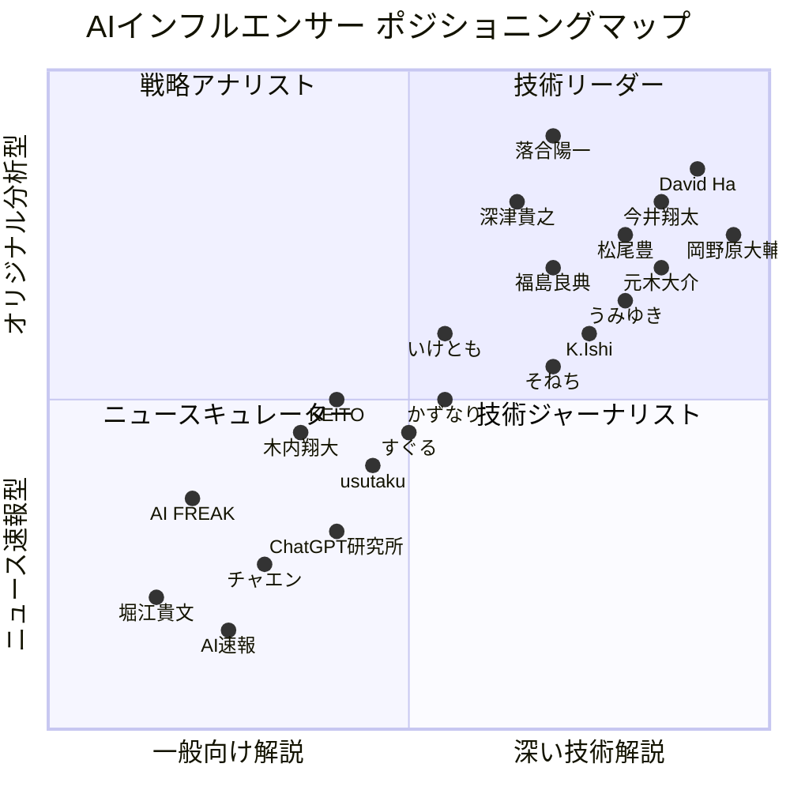
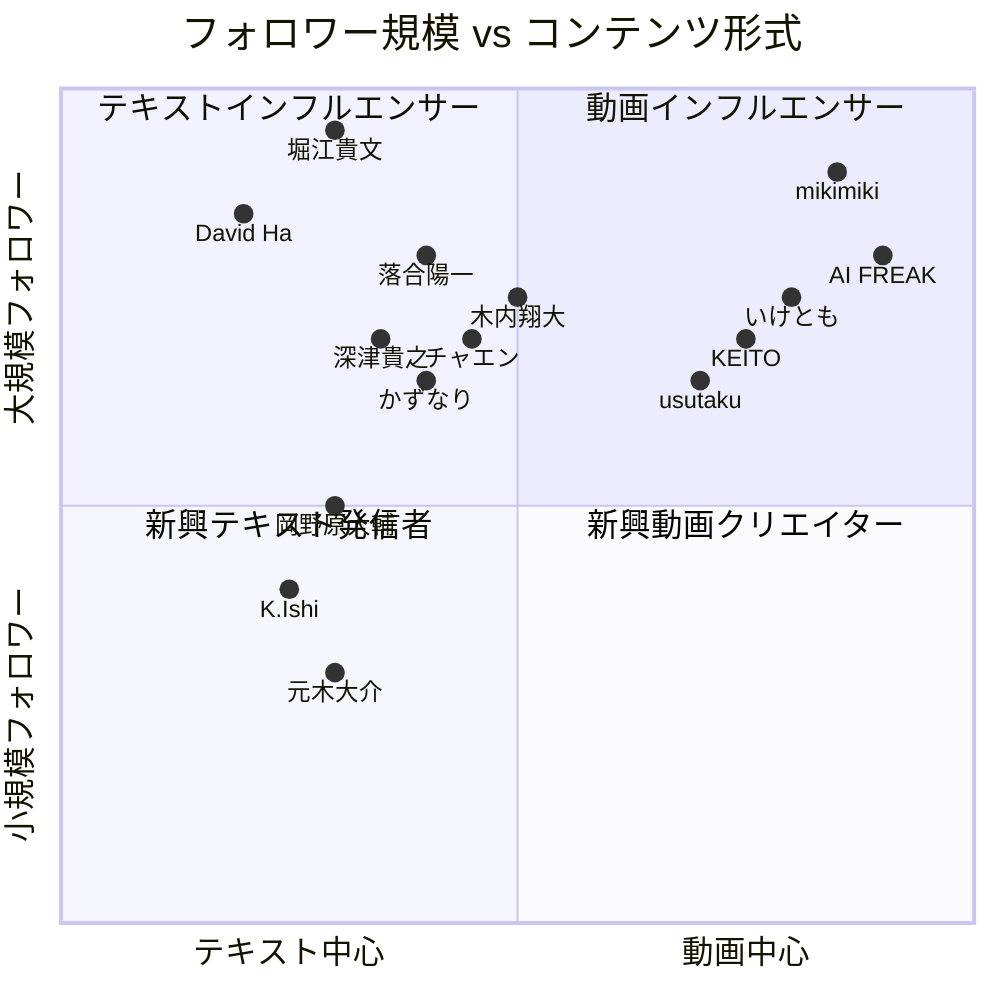
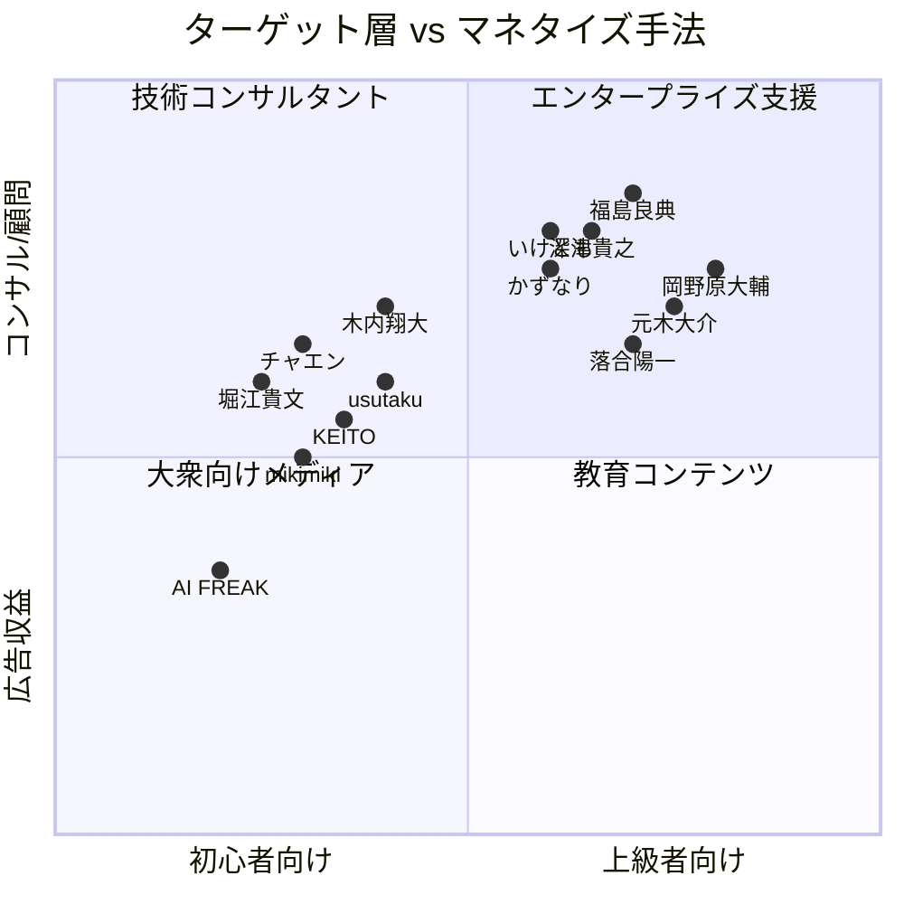
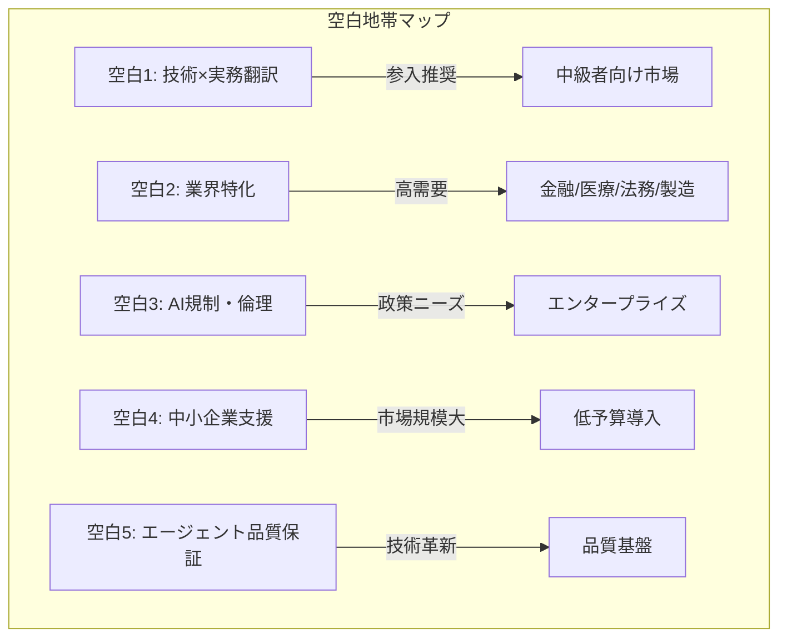
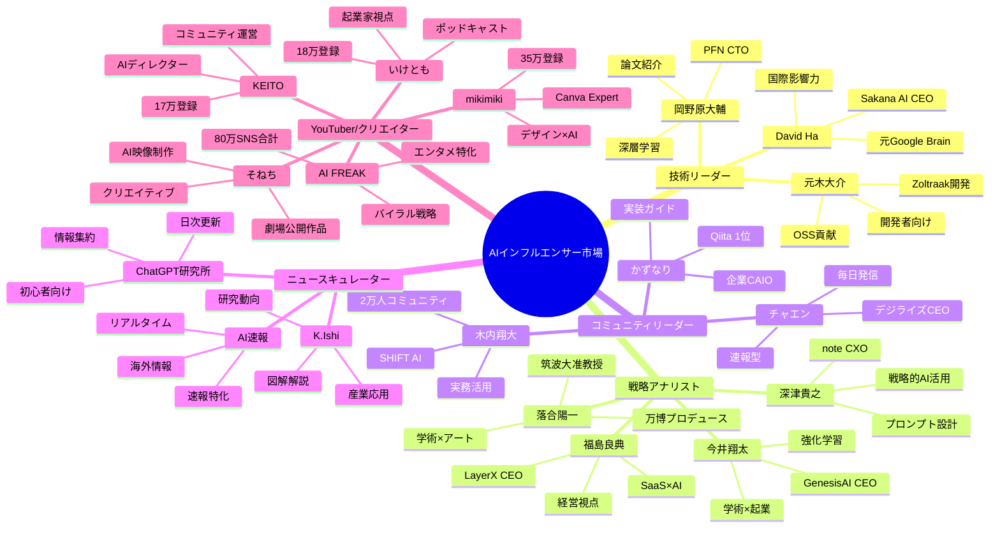
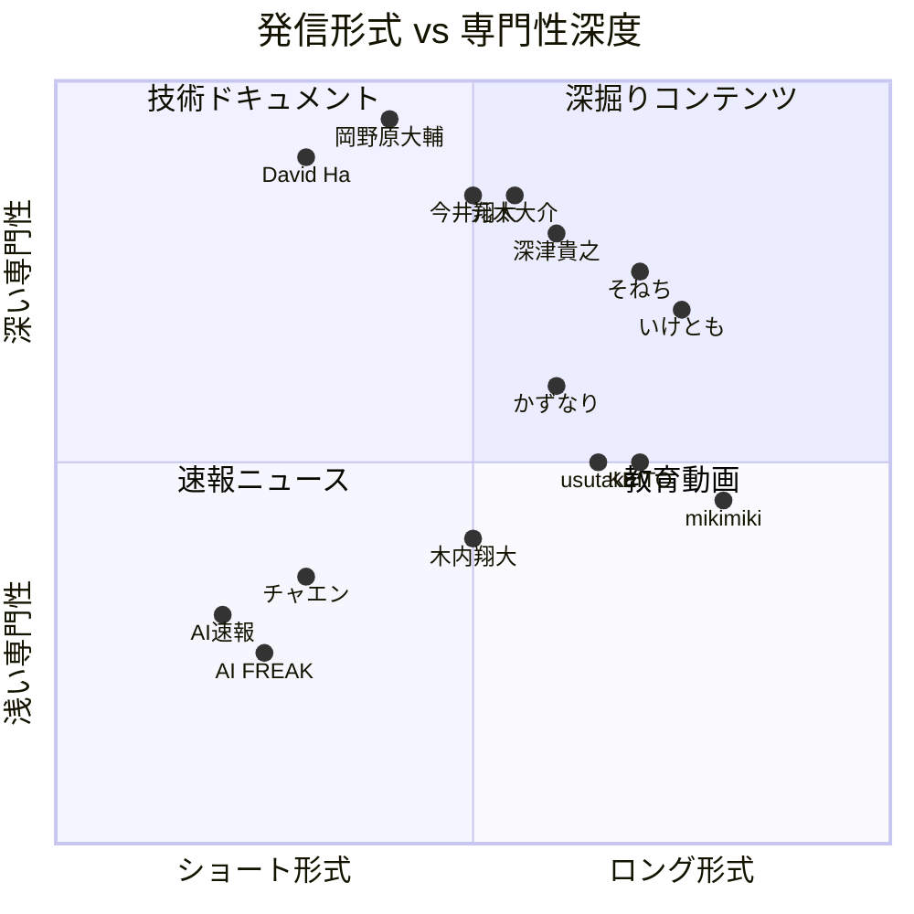
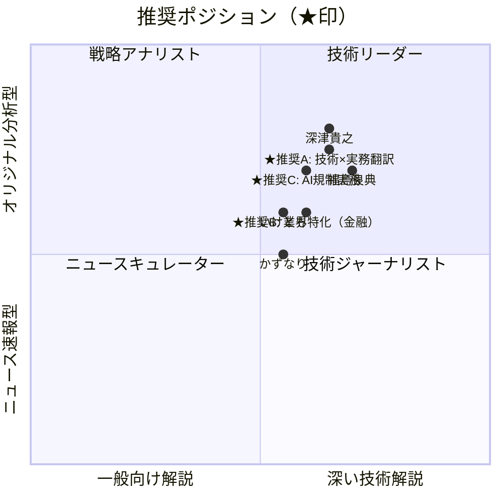

# AIインフルエンサー ポジショニングマップ 2026

作成日: 2026-01-08
Issue: #8 AIインフルエンサーの競合調査

## ポジショニングマップ概要

### 軸の定義
- **X軸**: 専門性レベル（左: 一般向け解説 ←→ 右: 深い技術解説）
- **Y軸**: 発信スタイル（下: ニュース速報型 ←→ 上: オリジナル分析型）

## メインマップ

## セグメント別マップ

### マップ2: フォロワー規模 × コンテンツ形式

### マップ3: ターゲット層 × マネタイズ手法

## 空白地帯分析

### 特定された空白地帯（5箇所）

#### 1. 技術×実務翻訳ゾーン
- **位置**: X軸 0.6-0.7（中級技術）、Y軸 0.7-0.8（オリジナル分析）
- **現状**: 深津貴之が部分的にカバー、しかし技術深度は限定的
- **機会**:
  - 研究論文を実務プロンプトに翻訳
  - 技術的根拠のある実装ガイド
  - 中級者向けの体系的教育コンテンツ
- **参入難易度**: 中（技術知識＋実務経験が必要）
- **推奨アクション**:
  - 論文解説×実装デモの組み合わせ
  - LangChain/CrewAI等のフレームワーク深掘り
  - エンタープライズ向けケーススタディ作成

#### 2. 業界特化型AI活用
- **位置**: X軸 0.5-0.6（実務応用）、Y軸 0.5-0.6（業界分析）
- **現状**: 汎用的なAI活用論が飽和、業界別深掘りはほぼ不在
- **機会**:
  - 金融×AI（リスク管理、トレーディング）
  - 医療×AI（診断支援、研究補助）
  - 法務×AI（契約書レビュー、判例分析）
  - 製造×AI（品質管理、予知保全）
  - 建設×AI（設計最適化、工程管理）
- **参入難易度**: 高（業界知識＋AI技術の両方が必要）
- **推奨アクション**:
  - 特定業界での5年以上の実務経験を活かす
  - 業界団体・カンファレンスでの登壇
  - 業界専門誌への寄稿

#### 3. AI規制・倫理の実務対応
- **位置**: X軸 0.55-0.65（専門知識）、Y軸 0.65-0.75（政策分析）
- **現状**: EU AI Act、日本AI戦略の解説は断片的、実務対応ガイド不在
- **機会**:
  - AIガバナンス体制構築支援
  - AI倫理ガイドライン策定コンサル
  - リスク評価フレームワーク提供
  - コンプライアンスチェックリスト
- **参入難易度**: 高（法律知識＋AI技術＋企業実務）
- **推奨アクション**:
  - 弁護士との協業
  - 企業のAI導入支援での実績作り
  - 規制当局との対話実績

#### 4. 中小企業向けAI導入支援
- **位置**: X軸 0.35-0.45（初心者向け）、Y軸 0.55-0.65（実践支援）
- **現状**: 大企業事例は豊富、中小企業の低予算AI導入は空白
- **機会**:
  - 月10万円以内でのAI業務効率化
  - ノーコードツール（Dify等）活用支援
  - 補助金・助成金活用ガイド
  - 段階的導入ロードマップ
- **参入難易度**: 中（実務経験＋営業力が必要）
- **推奨アクション**:
  - 業種別AIツールテンプレート開発
  - 地域の商工会議所との連携
  - ROI可視化ツールの提供

#### 5. AIエージェント品質保証
- **位置**: X軸 0.75-0.85（技術特化）、Y軸 0.7-0.8（新領域研究）
- **現状**: エージェントのテスト・品質評価手法が未成熟
- **機会**:
  - エージェント自動テストフレームワーク開発
  - 品質メトリクス定義（成功率、精度、応答時間）
  - ログ・モニタリング基盤構築
  - Human-in-the-Loop設計パターン
- **参入難易度**: 高（深い技術知識＋品質管理経験）
- **推奨アクション**:
  - OSS開発（エージェントテストツール）
  - 学術論文投稿（品質評価手法）
  - カンファレンス登壇

### 空白地帯ビジュアル

## 競合クラスター分析

## クロス分析：発信形式×専門性

## 推奨ポジション

### 最適ポジショニング提案

### 推奨位置の根拠

#### 推奨A: 技術×実務翻訳（X=0.65, Y=0.75）

**理由**:
1. **競合の空白**: 深津貴之の右側、岡野原大輔の左側に位置
   - 深津氏より技術的に深く、岡野原氏より実務的
   - 論文レベルの技術を実装可能なレベルに翻訳

2. **市場ニーズ**: 中級者向けコンテンツの不足
   - 初心者向け（チャエン、木内）は飽和
   - 上級者向け（岡野原、David Ha）は学術的すぎる
   - 中間層の「実装できる技術者」向けが空白

3. **差別化要素**:
   - 論文ベースのプロンプトエンジニアリング
   - LangChain/CrewAI/MCP等の最新フレームワーク深掘り
   - エンタープライズ向けRAG/エージェント構築ガイド

#### 推奨B: 業界特化型（金融）（X=0.6, Y=0.6）

**理由**:
1. **ブルーオーシャン**: 金融×AIの日本語コンテンツが極めて少ない
   - 海外事例の翻訳紹介
   - 金融規制対応のAI活用
   - リスク管理・トレーディングへのAI応用

2. **高単価市場**: 金融機関のAI投資は大規模
   - コンサル案件の単価が高い
   - 継続的な顧問契約の可能性
   - 業界カンファレンスでの登壇機会

3. **参入障壁**: 金融知識が必要→競合参入が難しい
   - 既存の金融業界経験を最大限活用
   - 専門性が高いため差別化しやすい

#### 推奨C: AI規制・倫理の実務対応（X=0.6, Y=0.7）

**理由**:
1. **政策ニーズ**: EU AI Act、日本AI戦略の施行で需要急増
   - 企業のガバナンス体制構築支援
   - リスク評価フレームワーク提供
   - 倫理ガイドライン策定コンサル

2. **競合不在**: 技術者は倫理に弱く、法律家は技術に弱い
   - 両方を理解する人材が極めて少ない
   - 弁護士との協業で差別化可能

3. **長期的需要**: 規制は強化される一方
   - 2026年以降も継続的なニーズ
   - エンタープライズ向けの高単価案件

## マネタイズマトリクス

### ポジション別の収益構造

| ポジション | 主要収益源 | 推定月収レンジ | 参入難易度 | 推奨度 |
|----------|----------|-------------|-----------|--------|
| **推奨A: 技術×実務翻訳** | 企業コンサル + 書籍 + コミュニティ | 50-200万円 | 中 | ⭐⭐⭐⭐⭐ |
| **推奨B: 業界特化（金融）** | 企業顧問 + 研修 | 100-300万円 | 高 | ⭐⭐⭐⭐⭐ |
| **推奨C: AI規制実務** | 企業顧問 + 講演 | 80-250万円 | 高 | ⭐⭐⭐⭐ |
| ニュース速報型 | 広告 + Tips | 10-50万円 | 低 | ⭐⭐ |
| YouTuber型 | 広告 + 企業案件 | 30-200万円 | 中 | ⭐⭐⭐ |
| 技術リーダー型 | OSS + 企業 | 50-300万円 | 高 | ⭐⭐⭐⭐ |

## 成長戦略ロードマップ

### フェーズ1: ポジショニング確立（0-3ヶ月）

**目標**: 「技術×実務翻訳」ポジションの確立

**アクション**:
1. 最新論文を実務プロンプトに翻訳（週1本）
   - ArXiv → 実装コード＋解説
   - LangChain/CrewAI実践ガイド
   - MCP/A2Aプロトコル解説

2. 中級者向けコンテンツ強化
   - RAG構築の完全ガイド
   - エージェントフレームワーク比較
   - API連携プロンプト設計パターン

3. プラットフォーム戦略
   - X: 毎日1投稿（技術解説＋実装デモ）
   - note: 週1本（3,000字以上の詳細記事）
   - YouTube: 月2本（実装デモ動画）

### フェーズ2: 権威性構築（3-6ヶ月）

**目標**: 「この分野ならこの人」の認知獲得

**アクション**:
1. 技術カンファレンス登壇
   - AI駆動開発勉強会
   - LangChain Tokyo
   - PyCon JP

2. 研究者とのコラボレーション
   - 今井翔太氏（強化学習×エージェント）
   - 元木大介氏（Zoltraak活用事例）
   - 松尾研出身者へのインタビュー

3. 書籍企画・執筆
   - 「実践LangChain/CrewAI」
   - 「エンタープライズAIエージェント構築ガイド」
   - Kindle出版 → 商業出版

### フェーズ3: マネタイズ本格化（6-12ヶ月）

**目標**: 月収100万円突破

**収益源の確立**:
1. 企業コンサルティング: 40-60万円
   - 月2-3社、1社20万円
   - RAG/エージェント導入支援

2. オンラインスクール: 20-30万円
   - 中級者向けLangChain講座
   - エンタープライズAI実装講座

3. コミュニティ運営: 10-20万円
   - Discord/Slackコミュニティ（月額3,000円）
   - 月次オンライン勉強会

4. 書籍印税: 10-20万円
   - 商業出版の印税収入

5. YouTube広告: 5-10万円
   - 月間再生10万回目標

## 競合との差別化戦略

### 既存インフルエンサーとの比較優位性

| 競合 | 強み | 弱み | 差別化ポイント |
|------|------|------|-------------|
| **深津貴之** | プロンプト設計の第一人者 | 技術深度は中程度 | より深い技術解説＋実装コード |
| **岡野原大輔** | 論文紹介の権威 | 初心者には難解 | 実装可能なレベルに翻訳 |
| **元木大介** | OSS開発の実績 | フォロワー少ない | コミュニティ拡大支援 |
| **かずなり** | 企業向け実装ガイド | LLM活用が中心 | エージェント特化の深掘り |
| **木内翔大** | 巨大コミュニティ | 技術深度は浅い | 技術的根拠の提供 |

### 独自の強み（USP）

1. **学術×実務の架橋**
   - 研究論文を実装レベルに翻訳
   - 技術的根拠のある実践手法
   - 理論→実装→ビジネス応用の一貫性

2. **中級者向け体系的教育**
   - 初心者向けは飽和
   - 上級者向けは学術的
   - 中間層の「実装できる技術者」育成

3. **エンタープライズ向け実装支援**
   - セキュリティ・ガバナンス対応
   - 大規模システムへの統合
   - ROI可視化・効果検証

## まとめ

### 市場の成熟度
- **飽和領域**: 汎用AIニュース速報、ChatGPT基本活用法、初心者向けプロンプト集
- **成長領域**: 業界特化事例、AIエージェント実装、中級者向け技術教育
- **ブルーオーシャン**: AI規制実務対応、技術×実務翻訳、エンタープライズ品質保証

### 成功パターン
1. **技術的深度**: 岡野原、元木のような深い技術知識
2. **実務応用**: 深津、福島のようなビジネス視点
3. **コミュニティ**: 木内、KEITOのような継続的エンゲージメント
4. **マルチチャネル**: X + note + YouTube の組み合わせ

### 最終推奨ポジション

**「研究論文を実務に翻訳する、技術的根拠のあるAIエージェント実装ガイド」**

- 位置: X軸 0.65（中級技術）、Y軸 0.75（オリジナル分析）
- ターゲット: 中級エンジニア、企業のAI担当者
- 差別化: 論文ベースのプロンプト設計×実装コード
- マネタイズ: 企業コンサル + 書籍 + コミュニティ
- 推定月収: 50-200万円（1年後目標）

---

## 参照

### 調査ソース
- [カテゴリA+B分析](/Users/yuichi/AIPM/aipm_v0/Flow/202601/2026-01-08/ai_influencer_competitive_analysis.md)
- [カテゴリC+D分析](/Users/yuichi/AIPM/aipm_v0/Flow/202601/2026-01-08/ai_influencer_category_cd_analysis.md)
- [カテゴリE+F分析](/Users/yuichi/AIPM/aipm_v0/Flow/202601/2026-01-08/category_e_f_competitive_analysis.md)
- [カテゴリG分析](/Users/yuichi/AIPM/aipm_v0/Flow/202601/2026-01-08/ai_influencer_category_g_report.md)

### 調査対象
- カテゴリA: トップインフルエンサー（5名）
- カテゴリB: AIスタートアップCEO（7名）
- カテゴリC: 研究者（6名）
- カテゴリD: プロンプトエンジニア（10名）
- カテゴリE: ニュース系（6名）
- カテゴリF: YouTuber系（10名）
- カテゴリG: AIエージェント特化（10名）
- 合計: 54名

**作成者**: Claude Code AI Agent
**作成日**: 2026-01-08
**更新日**: 2026-01-08
