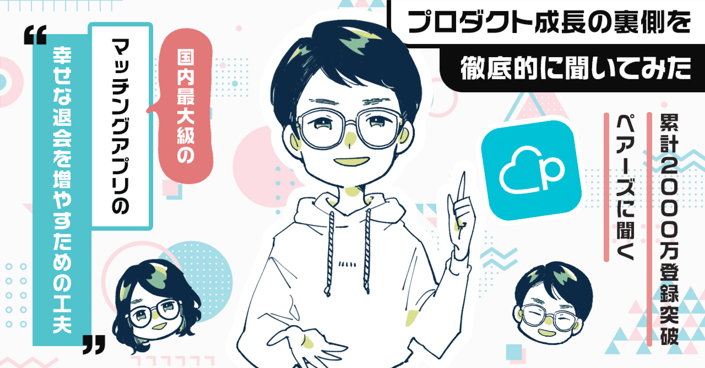  

# マッチングアプリの写真を「長方形」にしたらコミュニケーションが促進。累計登録数2,000万を突破した「ペアーズ」成長の裏側と、マッチング品質を高めた3つの工夫。

107

[%22%20d%3D%22M-100-100h300v300h-300z%22%2F%3E%3C%2Fsvg%3E)](/)

[アプリマーケティング研究所](/)

2024年11月27日 11:30

¥2,000/月

マッチングアプリ「ペアーズ」さんを取材しました。

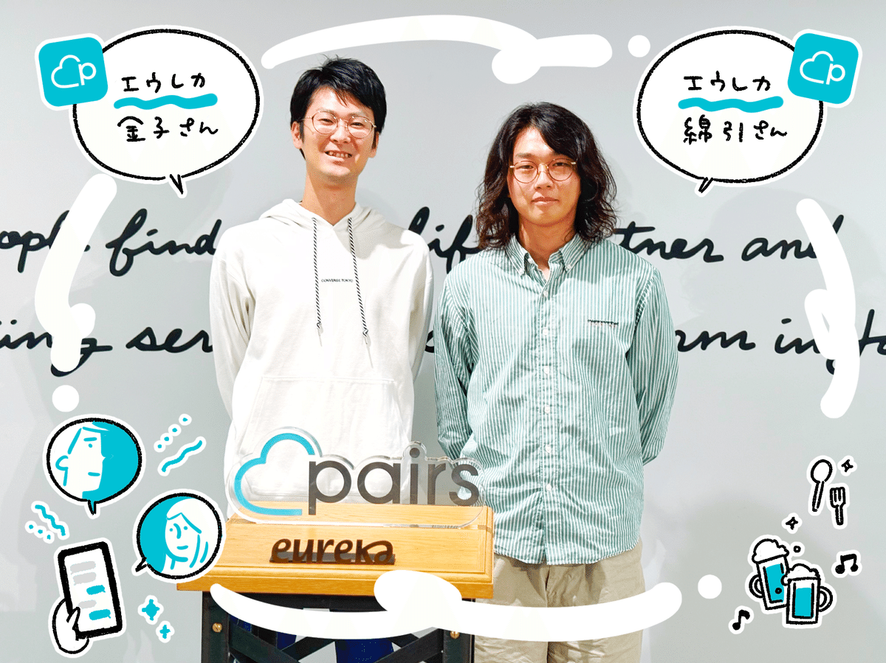

株式会社エウレカ CTO 金子 慎太郎さん、シニアプロダクトマネージャー 綿引 康介さん

### ⸺ペアーズの歴史について教えてください。

金子：  
ペアーズは2012年10月にサービスを開始した、**国内最大級の「恋活・婚活マッチングアプリ」です。累計登録数としては2,000万を超えています。**ちょうどサービス開始12周年を迎えました。

運営会社のエウレカは、2008年に赤坂優と西川順が共同創業した会社です。初期は受託開発などを行なっていましたが、途中から自社サービスの開発に舵を切ることになります。

僕は2012年に入社したのですが、ちょうど入社前日に「ペアーズが公開された」というタイミングでした。

当時は小さな会社だったので、地べたに座って「何つくる？」と少人数で企画会議をしながら、機能を開発していたのを覚えています。

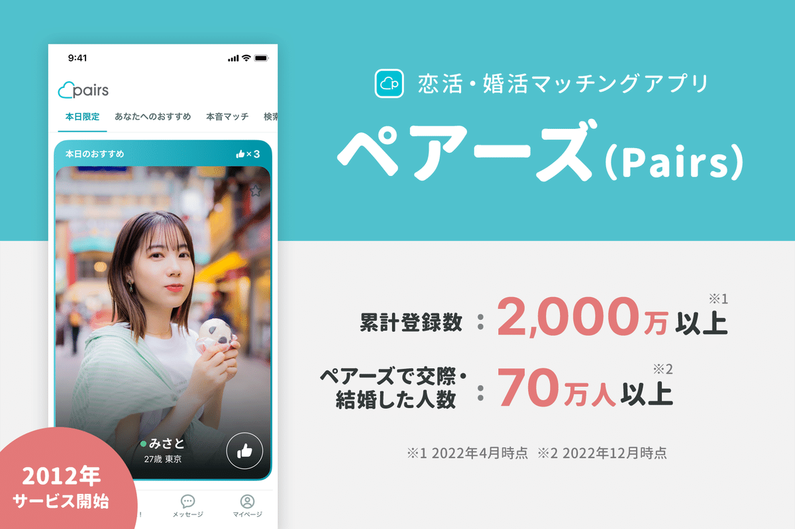

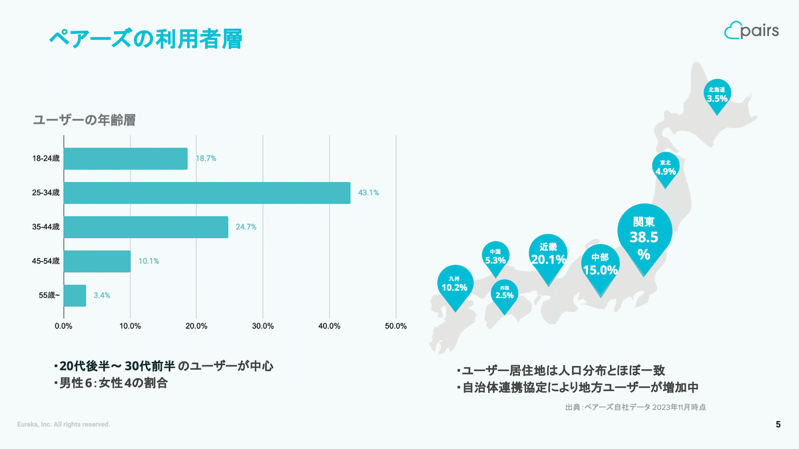

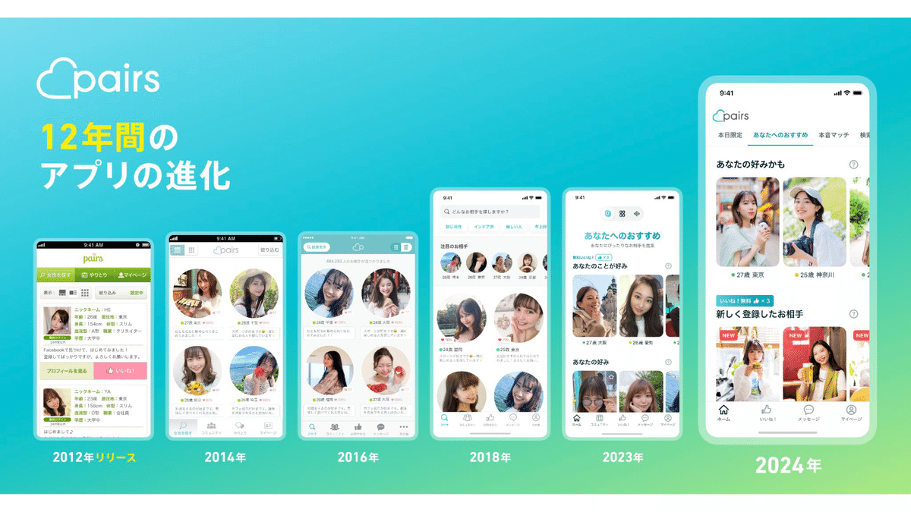

### ⸺初期はどんなことを考えてペアーズを運営していましたか？

金子：  
会社は小さかったですが、僕らは最初からペアーズを「安心安全なサービスにしたい。真剣な相手を探せる場所にしたい。」と考えていました。

そのため、**初期はペアーズに登録するときに「Facebookログインを必須にする」という設計にしました。**実名性のFacebookを前提にすることで、ペアーズに「真剣な人」を集めようと考えたんですね。

今では、マッチングアプリが浸透してきていますが、当時は「出会い系」と呼ばれていて「怖い・怪しい」というイメージも強かったので、安心安全なサービスにするためにこうした設計にしました。

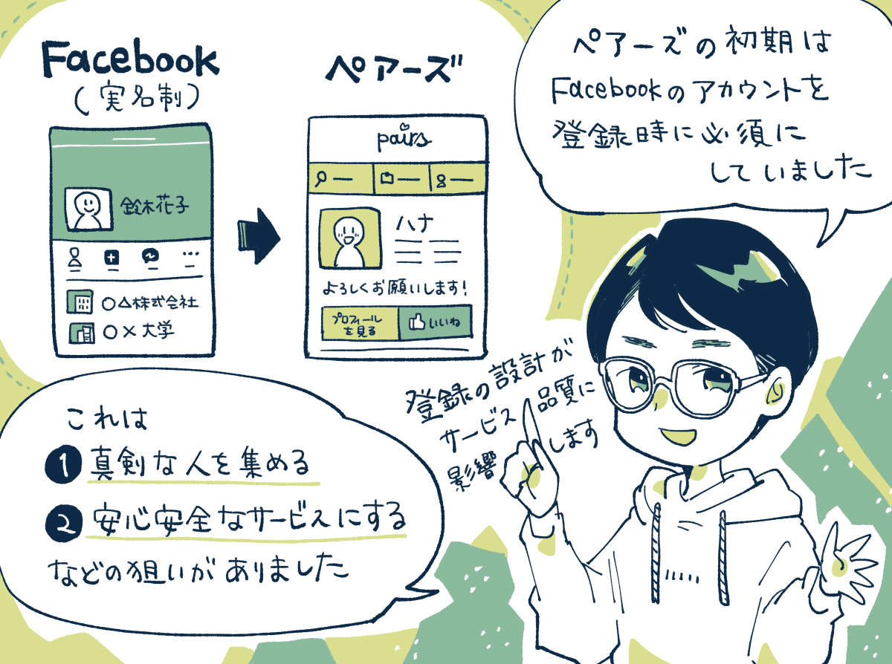

今でもペアーズの「いいね！」が親指アイコンなのは、「Facebook登録を必須」にしていた初期の名残で、Facebookに合わせていたからだという。

集客については、**初期から「Facebook広告」を活用しました。出稿をはじめて数ヶ月で、月に数百万円〜1,000万円以上の広告費をかけましたね。**

Facebook広告からだと、そのままFacebookユーザーが「登録・ログイン」もできるため、高いCVR（登録率）につながっていました。

初期の広告は、**男性ユーザーは「便益訴求」の効果が高く、女性ユーザーには「安心感」を訴求すると効果が高いといった傾向がありました。**

マッチングアプリは、立ち上げフェーズでは「会員数」が大事になるので、初期は「新規会員数」を重要指標に置いていましたね。

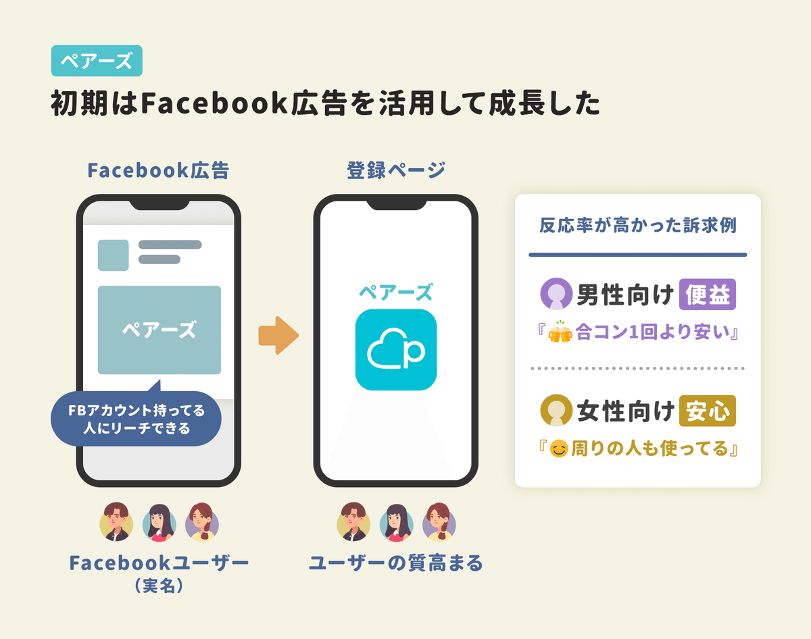

ほかに集客に貢献したのは「診断系アプリ」でした。これは当時のFacebookで流行していたもので、「相性占い」「性格診断」などを行なってフィードに診断の結果を投稿するというWebサービスです。

この「診断系アプリ」を3ヶ月で約100個ほど作って、これらを使うときにFacebookのペアーズのページへの「いいね！」を必須にする仕組み（当時の仕様では可能だった）により「いいね！」が伸びました。

ペアーズのページに「いいね！」をしてもらえると、ペアーズからフィードに投稿を届けられるようになります。**恋愛系の投稿に絡めてペアーズを紹介していくと、大きく登録者が増えていきました。**

もう10年以上前ですが、この時代のFacebookは「技術的な仕様」の自由度がかなり高くて、Webアプリを柔軟に開発できた時代でした。

## コミュニティの機能は「出会いのキッカケ」を増やす効果があった。

### ⸺ペアーズで「転換点になった出来事」があれば教えてください。

金子：  
初期からペアーズでは、「いつかは結婚したいけど、いい人が周りにいない」という人でも、素敵な人と出会える場所にしたいと考えていました。

転換点になったのは、**2013年に公開した「コミュニティ」機能です。これはmixiさんのコミュニケーションを広げる設計がヒントになりました。**

mixiって登録しただけだと、周りの友達と「マイミク」としてつながることはできますが、そこから先の人間関係は生まれにくいですよね。

でも、**mixiには「コミュニティ」があることで、同じ趣味の人や共通点のある人と交流して、人間関係を広げていける設計になっていました。**

ペアーズでもこれを参考に「コミュニティ」をつくり、人間関係をなかなか広げられない人でも、新しい人と出会えるようにしたいと。

意外だったのは、**コミュニティの実装によって「相手がどんな人なのか？」がわかるようになるという効果が生まれたことです。**

プロフィールに載せる情報が「履歴書」だとすると、コミュニティで見える情報というのは「人となり」に近いんですよね。

例えば、「お酒を飲む人なんだ」とか「猫が好きなんだ」とか、プロフィールには表れない「人となり」がわかると、相手に興味を持ちやすくなります。これはマッチング率の向上にも貢献したと考えています。

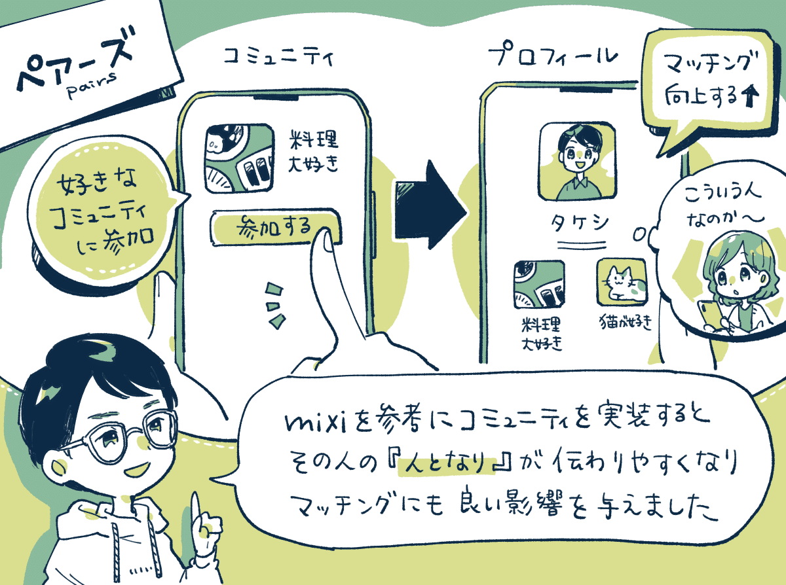

## 毎日おすすめの人を紹介する「ピックアップ」が習慣化に貢献した。

### ⸺ほかに「転換点になった機能」はありますか？

金子：  
2013年にペアーズに**「ピックアップ」（現在の「本日のおすすめ」）を入れたところ、アプリの起動率を大きく高めることができました。**

これは毎日朝8時くらいに、それぞれのユーザーに何人かの「おすすめの人」を提案する機能です。その時間にプッシュ通知も送っていましたね。

この機能によって、**主体的に「いい人を探す」というだけでなく、受動的に「おすすめの人を毎日見る」という新しい習慣が生まれました。**

継続的に使っていただくには「アプリを開く動機」が大切になります。この「ピックアップ」はアプリを開く動機につながりました。

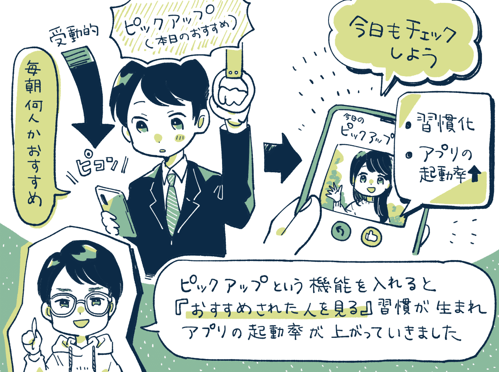

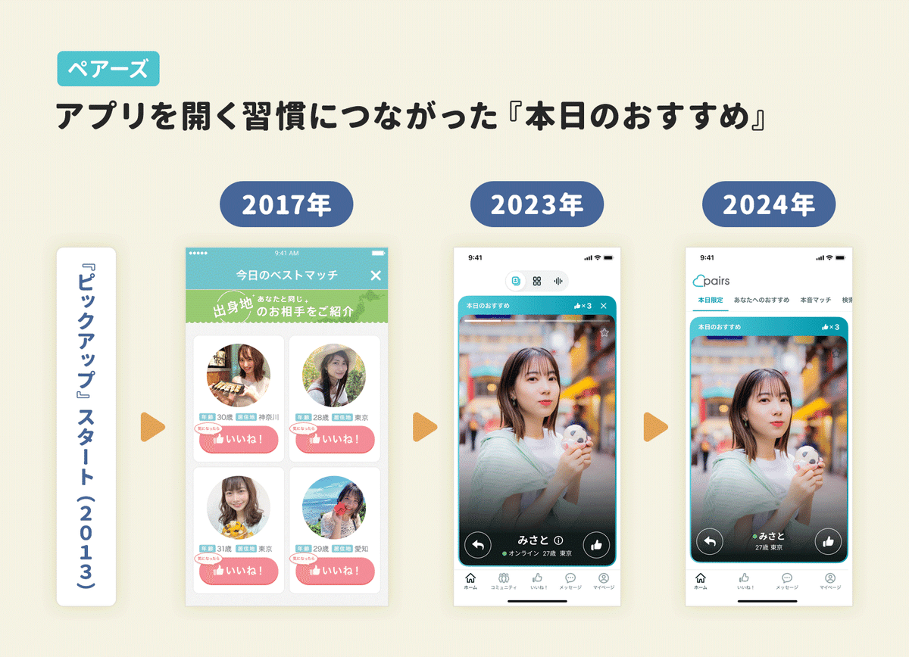

### ⸺そこからはどのように成長していきましたか？

金子：  
2014年頃から運用拡大フェーズに入り「LTVの向上」に注力しました。2014年の5月には、単月の売上が約1億円を突破しましたね。

そこから、2015年5月にエウレカは、米国の「Match Group」にM&Aにより参画することになり、日本市場で「どうしたらマッチングアプリが一般的になれるか?」を考えたブランディングの取り組みも進めていきました。

ポイントだったのは、**ペアーズを「家族や友人にも堂々と言えるサービス」にするために文化を広げて、ユーザーに安心感を抱いてもらうこと**です。

2016年にはカスタマーサポートを内製化、2017年には大手飲料メーカーや、著名パティシエの洋菓子店とコラボ。2020年コロナ禍には「ビデオデート」を開発するなどニーズに合わせて機能も拡張しました。

2021年にはペアーズの「プリペイドカード」を大手コンビニ等で販売開始、2023年には業界初のテレビCMを放映しました。

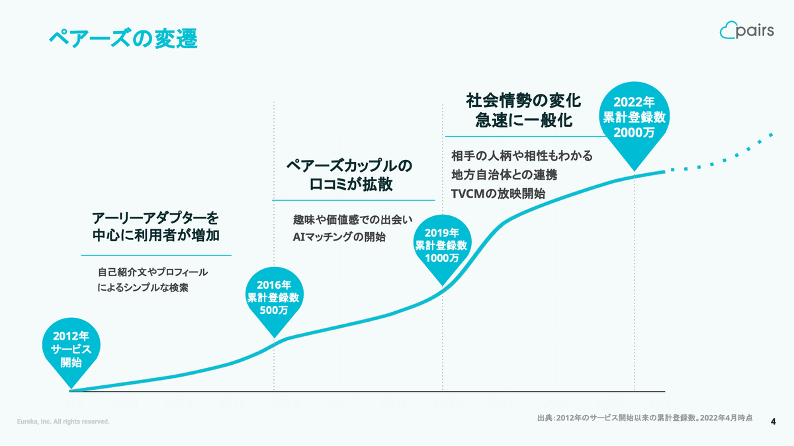

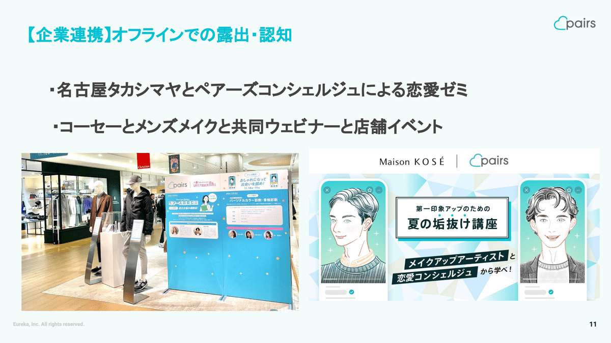

## ペアーズの「幸せ退会」を増やす取り組み。

### ⸺プロダクトの運営で「大事にしている指標」を教えてください。

綿引：  
最も大事な指標は、会員の方の「幸せ退会の数」なのですが、それを伸ばすために「コアファネル」と呼ばれるものを追っています。

これは**『ライク』『マッチ』『ファーストメッセージ』『メッセージリプライ』という4つの指標に分かれていて、これらを徹底的に磨いているんです。**

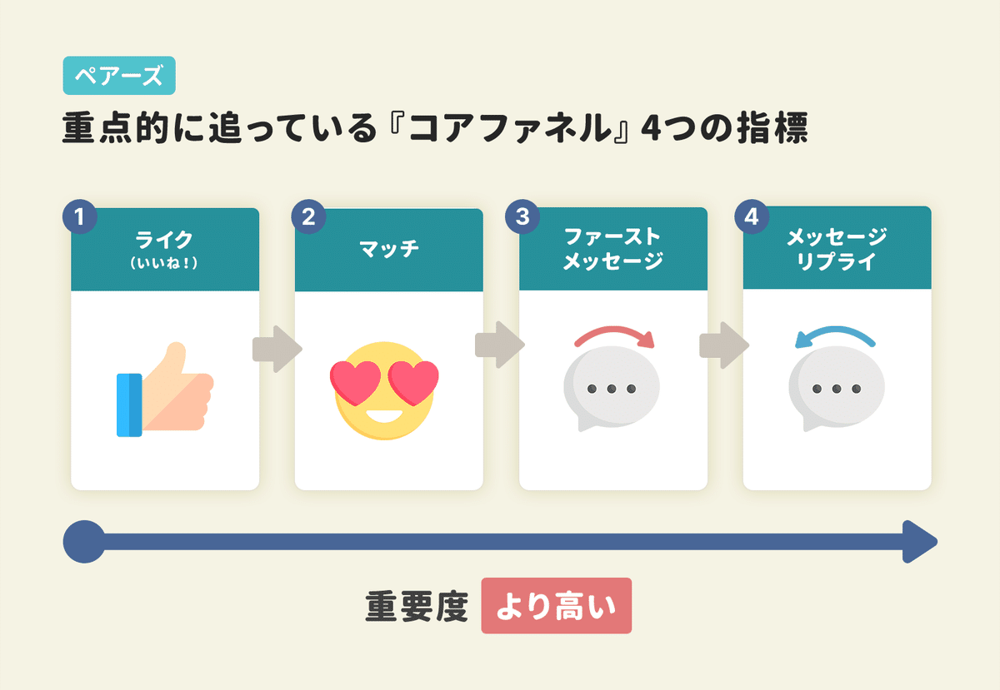

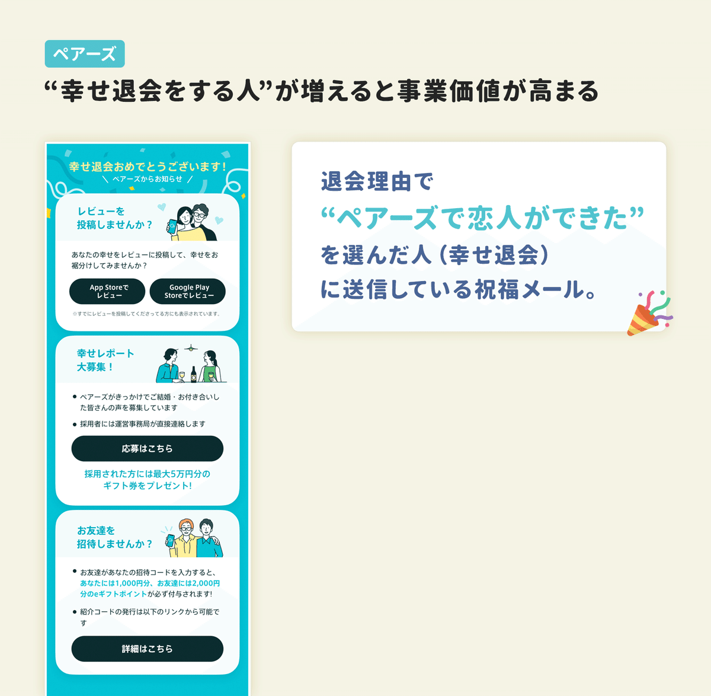

とくに意識しているのは「マッチングの品質」を高めることです。ユーザーの方が「ピッタリの相手」と出会えるように改善を繰り返しています。

例えば、**無料のライク数を増やして「男性側のライク」だけが急増しても、女性側はお相手を選びきれずにユーザー体験が悪化してしまいます。**

そのため、発生した「マッチ」は3つだけでも、その先の「リプライ」まできちんとつながる。そういった状態を目指していますね。

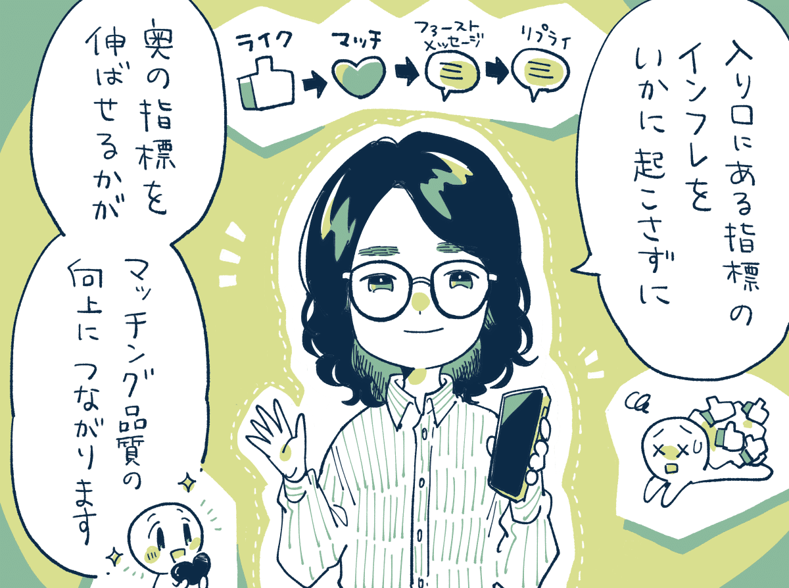

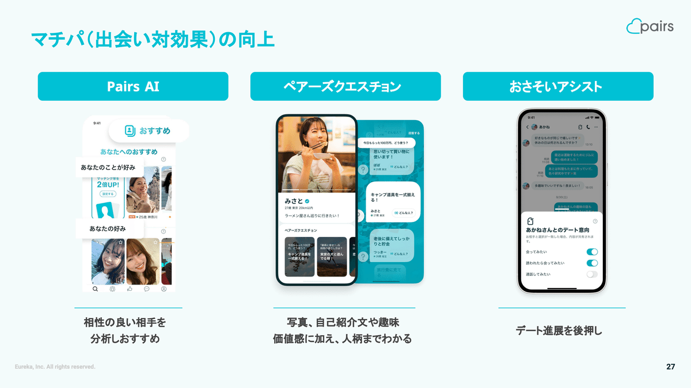

マッチング品質（マッチングパフォーマンス）を高める取り組み。

## マッチング品質を高めた3つの成功施策。

### 成功施策①：ペアーズの写真を「長方形」にしたらコミュニケーションが促進された。

綿引：  
ペアーズでは、**写真のデザインを「長方形」に変更したことで、ユーザー間のコミュニケーションを促進することができました。**

ペアーズの写真って、初期は「四角」からはじまって、そこから「丸型」になって、今では「長方形の写真」になっています。

これには理由があるんです。

我々の仮説では、ユーザーは写真の中の「人の顔」を見ていると考えていたのですが、**リサーチを進めると「趣味や人間性」といった情報を、実は写真からキャッチしているとわかってきました。**

つまり、**長方形の写真にすると「周りの背景」も含まれるようになるので、趣味や人柄を知るヒントを増やすことにつながるんです。**「この人こんな場所に行くんだな。」「こんな服装で出かけるんだな。」という感じですね。

こうした情報は「会話のネタ」にもなるため、これがメッセージの促進につながったと考えています。この変更はユーザーからも好評でした。

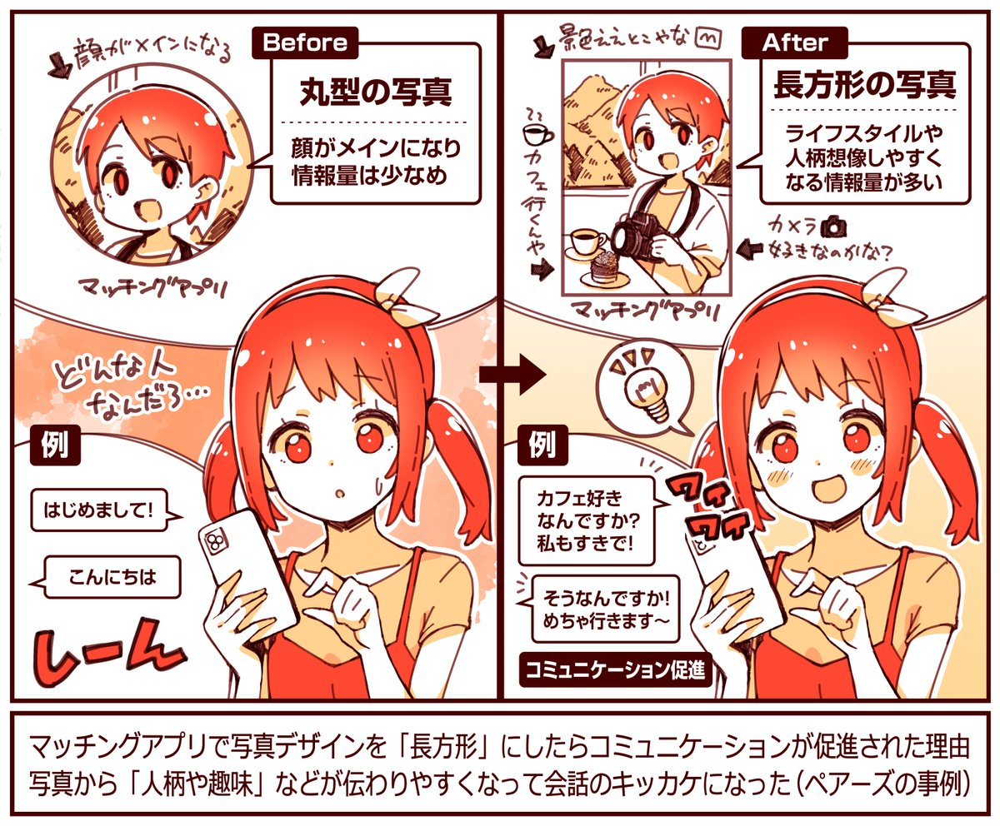

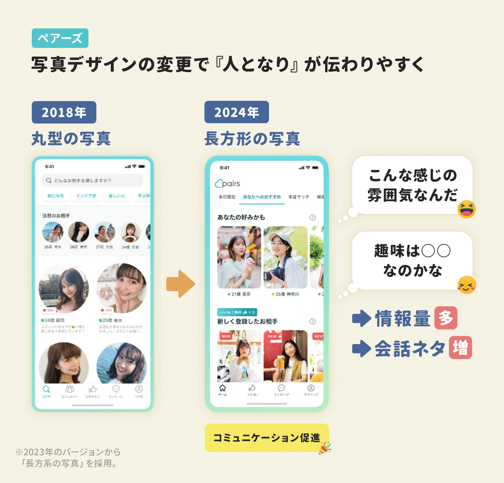

長方形になったことで「引きの写真」がマッチしやすい傾向も出ているそう。アップの写真だと「大部分が顔」になり主張されすぎてしまうため。

### 成功施策②：マッチ後に「挨拶」を送る機能でコミュニケーション促進。

綿引：  
ペアーズでマッチングした瞬間の画面で「挨拶メッセージ」が送れる機能を入れたところ、コミュニケーションが促進されました。

マッチングの演出が入ったら、**メッセージ画面にすぐ遷移するのではなく、挨拶をポポッと打てる機能を女性ユーザー向けに提供したんです。**すると、メッセージの発生率がかなり改善されたんですね。

理由としては、はじめに「簡単な挨拶」を入れることで、ファーストメッセージのハードルを下げることができたからだと解釈しています。

背景としては、やっぱり「オフラインの出会い」と「オンラインの出会い」には明確な違いがあると考えていて。

オフラインの出会いでは、**LINEを交換したあとの「ファーストメッセージ」には、その前にある「会話の文脈」が含まれることが多いと思います。**

例えば、「この前はありがとう。」とか「あれ楽しかったよね。」みたいに、その人についての「既知の情報」から会話がはじまるケースが多い。

一方で、オンラインの出会いは、それがない状態で「ファーストメッセージ」がはじまるという点が、ハードルの高さにつながっています。

そのため、ユーザーは慎重に「1通目のメッセージ」を送る傾向があります。いかにこれをカジュアルに送信してもらえるかを考えました。

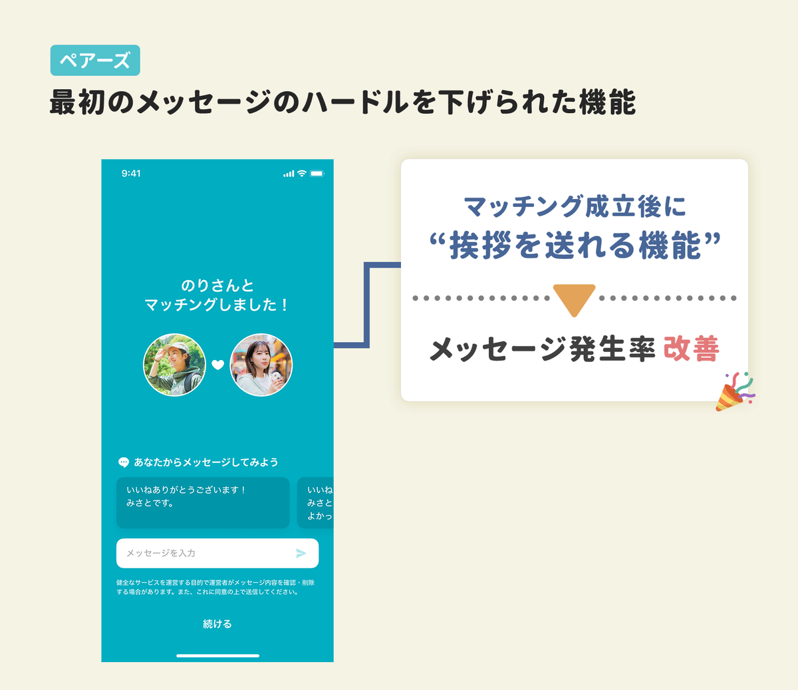

### 成功施策③：アプリの「UIデザインの変更」で利便性が向上。

綿引：  
ペアーズでは、2024年にUIデザインをアップデートした際に、ABテストを行いながらUIを改善しました。

例えば、**以前のUIではユーザーの「お相手を探す」といった目的に対して、どこのタブを押せば良いかがあまり明確ではなかったんです。**

そこで、新UIではホームに「お相手を探す」目的の機能を統合して、ライクやメッセージは「コアファネル」に沿ってタブに並べました。

また機能を**「アイコン」ではなく「言葉」で説明するように変更しました。これらの改善によって各機能への遷移が伸びていきましたね。**

いろいろな軸から「ライクを送りたいお相手」を見つけやすくなったことで「マッチ」も生まれやすくなったと考えています。

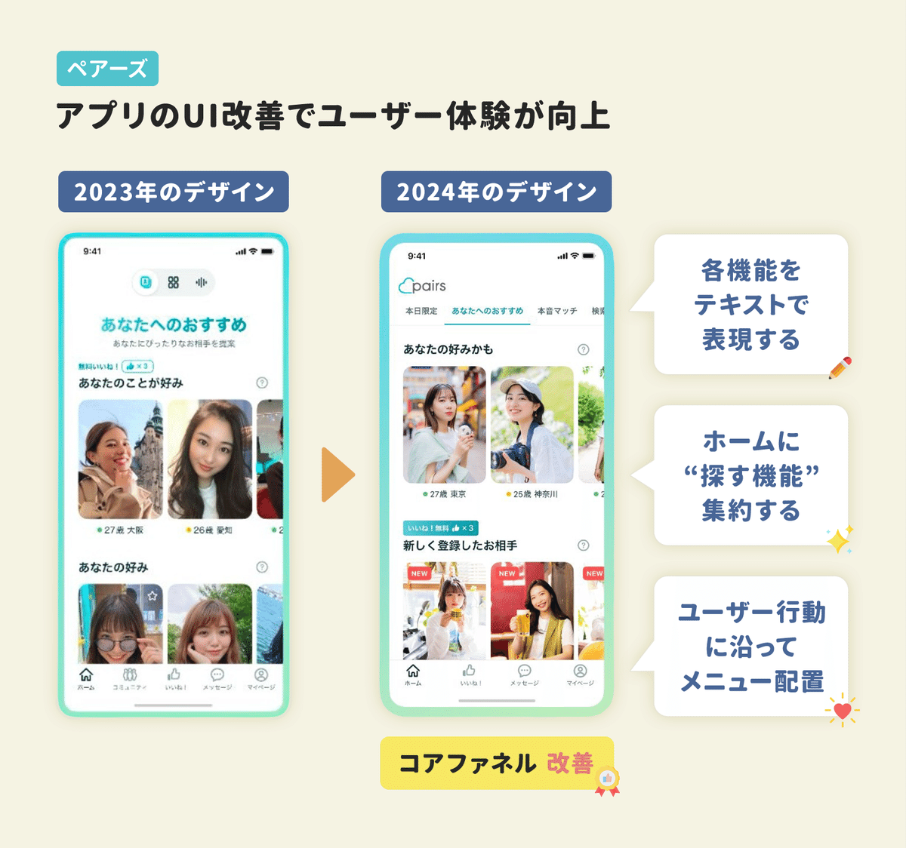

ファーストビューは「どれだけ『人の写真』を見てもらえるか？」も勝負。とくに「上段2列」はコアファネルへの影響が大きいため、どの端末でもファーストビューに出るよう工夫している。

---

【取材協力】  
株式会社エウレカ：[https://eure.jp](https://eure.jp/)   
ペアーズ：<https://www.pairs.lv/>  
株式会社エウレカ 金子 慎太郎さん、綿引 康介さん

【告知】エウレカさん（ペアーズ）では各職種で採用中。ご興味あれば下記サイトからご覧ください。

[**株式会社エウレカ｜採用サイト**
*国内最大級のオンラインデーティングサービス『Pairs』を運営する株式会社エウレカの採用サイトです。*
*career.pairs.lv*](https://career.pairs.lv/)

> ※ 以降は、＋αの事例を5つほど『ここだけの話』として、note購読者向けにまとめています。写真登録の心理的なハードルを下げる工夫、AIのレコメンド精度を高められた改善、パーソナライズを「自分向けだ」と感じてもらう工夫、などご興味あればご覧ください。

  

ダウンロード

 

copy

## ここから先は

1,512字
/
5画像

%22%20d%3D%22M-100-100h300v300h-300z%22%2F%3E%3C%2Fsvg%3E)

アプリやプロダクトの成功事例が学べるマガジンです。プロダクトの売上やユーザー数を伸ばしたい人にオススメです。成長プロダクトのインタビュー、効果のあったマーケティング施策、事例やデータなどが中心（月に7記事ほど）多くの過去記事も5年ほど遡って読めます。クレカ決済だと初月無料なのでお試しでもぜひ。

### [月刊アプリマーケティング](/m/mc375c9b46464)

¥2,000 / 月  
初月無料

プロダクト運営について学べるマガジンです。アプリやプロダクトの売上やユーザー数を伸ばしたい人にオススメです。月に7記事ほどお届けします。

購読手続きへ

%22%20d%3D%22M-100-100h300v300h-300z%22%2F%3E%3C%2Fsvg%3E)%22%20d%3D%22M-100-100h300v300h-300z%22%2F%3E%3C%2Fsvg%3E)%22%20d%3D%22M-100-100h300v300h-300z%22%2F%3E%3C%2Fsvg%3E)%22%20d%3D%22M-100-100h300v300h-300z%22%2F%3E%3C%2Fsvg%3E)%22%20d%3D%22M-100-100h300v300h-300z%22%2F%3E%3C%2Fsvg%3E)%22%20d%3D%22M-100-100h300v300h-300z%22%2F%3E%3C%2Fsvg%3E)%22%20d%3D%22M-100-100h300v300h-300z%22%2F%3E%3C%2Fsvg%3E)

7人が高評価

[ログイン](https://note.com/cd/login?redirect_to=https%3A%2F%2Fmarkelabo.com%2Fn%2Fn23376592131f)

   

107

[%22%20d%3D%22M-100-100h300v300h-300z%22%2F%3E%3C%2Fsvg%3E)](/)

[アプリマーケティング研究所](/)

フォロー

プロダクトの成功事例を発信しているメディアです。2013年から約10年運営しています。取材相談はツイッターDM（@appmarkelabo）かメールにてどうぞ！info@appmarketinglabo.net