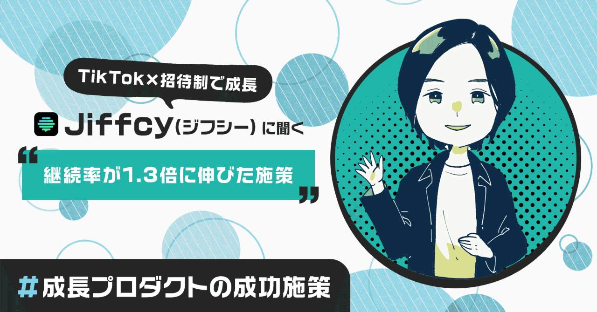
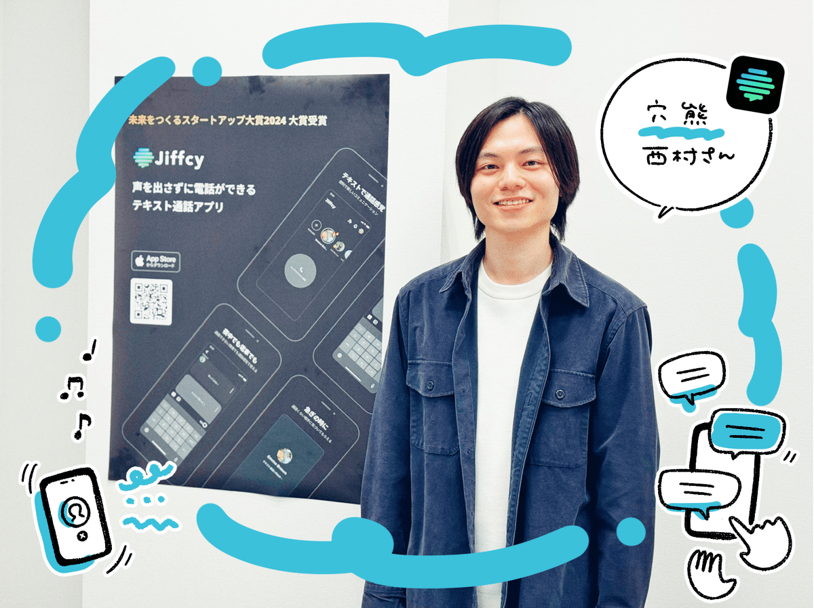
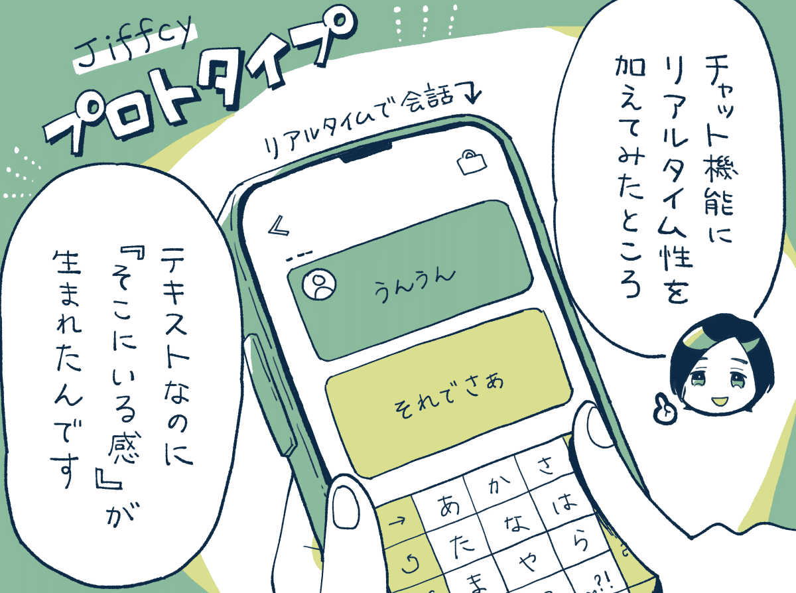
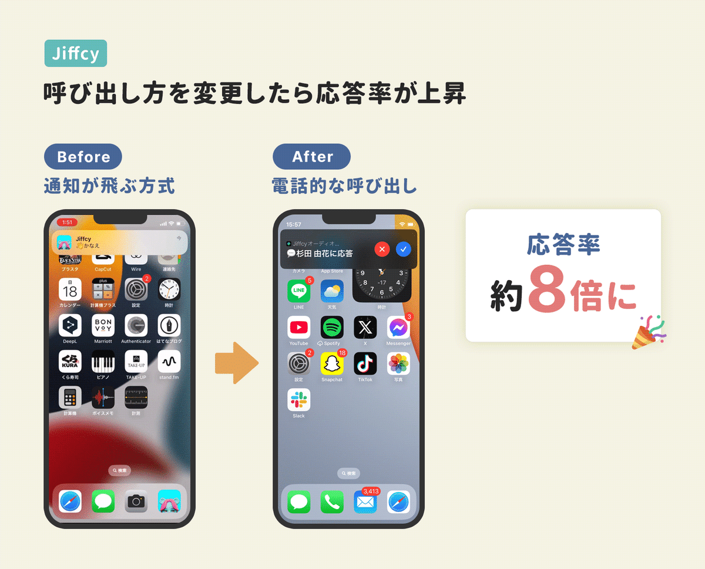
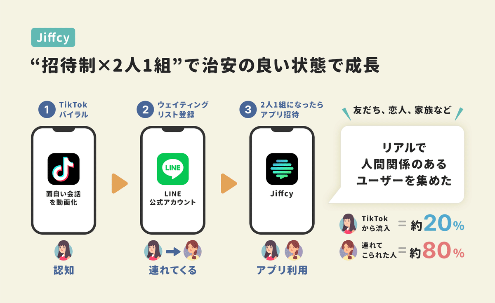
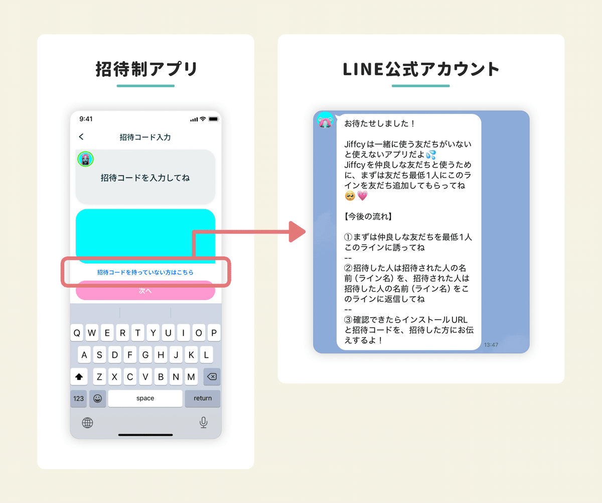
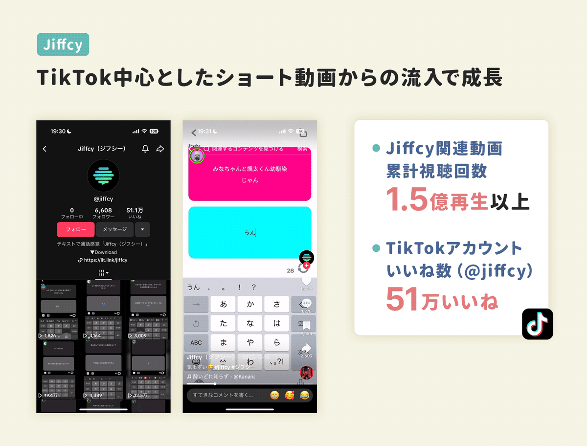
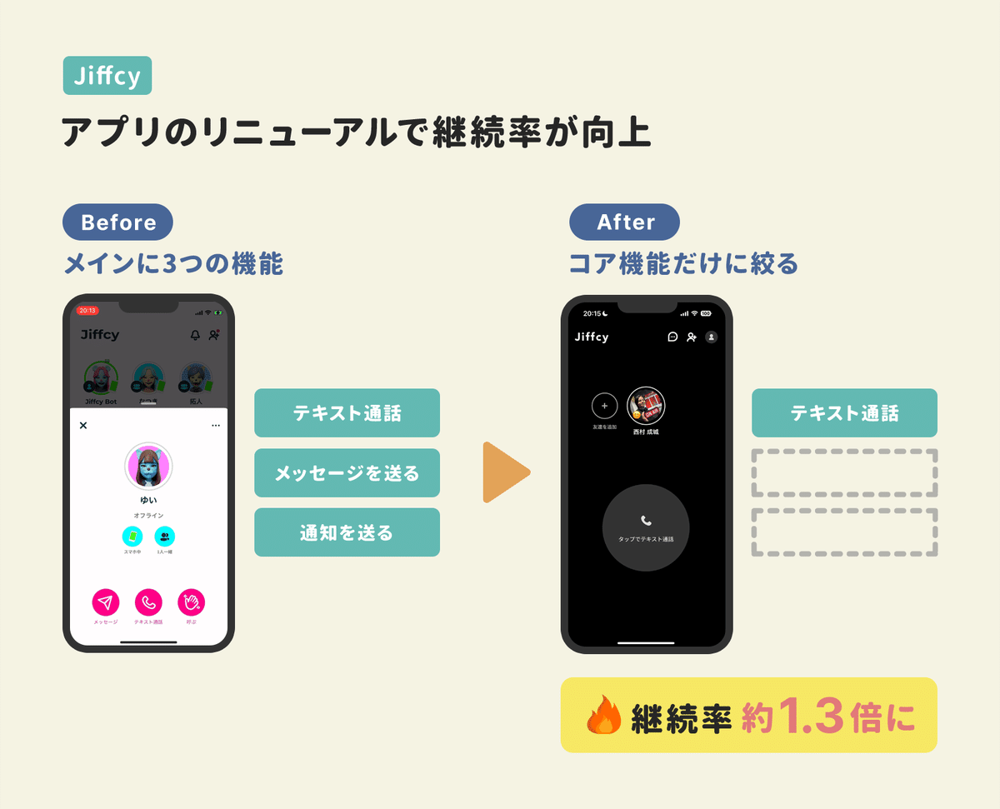

  

# TikTok×招待制で成長。新興SNSアプリの「Jiffcy」に聞く、アプリのUIを「コアな機能」に絞ったデザインに変えたら、継続率が1.3倍になった話。

40

[%22%20d%3D%22M-100-100h300v300h-300z%22%2F%3E%3C%2Fsvg%3E)](/)

[アプリマーケティング研究所](/)

2024年11月28日 11:30

¥2,000/月

テキスト通話アプリの「Jiffcy」さんを取材しました。

株式会社穴熊 代表取締役 CEO 西村 成城さん

### ⸺Jiffcy（ジフシー）について教えてください。

西村：  
2023年4月に正式リリースした、通話感覚でテキストコミュニケーションができるテキスト通話アプリです。**ユーザー数などは非公開ですが、アクティブユーザー数は過去4ヶ月で8倍に成長しています。**

電話のように呼び出して、**相手が応じると「入力した文字」が1文字ずつ表示される、リアルタイムトーク（テキスト）を行うことができます。**

現段階では「Z世代やα世代の学生」が中心で、18歳までのユーザーが80％、全体の約70％が女性です。

主なユースケースとしては、**寝る前に友達と「恋バナや愚痴」を話したり、電車の中で恋人と話したり、「声を出さないで通話のように話したいとき」に使われることが多いですね。**

22時の利用が最も多く、朝と夕方の通勤通学の時間帯にも使われています。「カップル」「家族」「仲良しの友達グループ」での利用が多いです。

学生時代を含めてこれまでに約20サービスを開発。多くの失敗を経て「Jiffcy」が生まれたそう。

### ⸺どのように「Jiffcy」は生まれたのでしょうか？

西村：  
自分が落ち込んでいたときに、**仲の良い友達と「他愛もない会話をしたい」と思ったのが、Jiffcyを開発したキッカケでした。**

友達と通話するほど元気ではない。でもLINEで「今ひま？」と送って3時間後に返信が来ても、そのときは別のことをやっていたりする…。

アプリを開いたときに、友達に通知が飛んで、暇な人が出てくれる「他愛もない話ができるアプリ」があったら良いなと。

それで、プロトタイプを開発してみました。**テキストでリアルタイムに「他愛もない会話」ができるアプリを作ってみたら、友達と1時間会話が続くこともホントに多くて「これは価値があるかもしれないぞ」**と。

最初に突き当たったのは、「友達が通知に気づいてくれない。」という課題でした。初期のバージョンでは応答率は10％程度でした。

これを解決したのが**「電話的な呼び出し」でした。電話のように着信で呼び出す設計にしたところ、応答率が約8倍になったんですね。**

このときに、βユーザーから「これってテキストで通話してる感じだよね。」と言われて、そこで「テキスト通話アプリ」という概念が生まれました。

## TikTokからの集客と「招待制」で成長した。

### ⸺Jiffcyのユーザーはどのように増えていったのでしょうか？

西村：  
2023年4月に「Jiffcy」を正式リリースして、TikTokに「Jiffcyの面白い会話」を投稿していくと、動画がバズってユーザーが増えていきました。

また成功したのは「招待制」にして、**友達や恋人など「リアルな人間関係」で使ってもらうことで、アプリの治安を良くするという設計です。**

具体的には、**LINEの公式アカウントで「ウェイティングリスト」に登録してもらって、「友達と2人1組」になった人からアプリに招待しました。**

2023年4月から「招待制」を開始。 → 2024年7月から「招待制」を解除して一般公開。

一緒に使う「LINEの友達の名前」を、合言葉のように入れてもらうことで、リアルで人間関係のある2人組に入ってもらえるようにしたんですね。

そのSNSが「知らない人と使われるか、リアルな人と使われるか」は初動が大事なんです。それで、最初は「リアルで知ってる人」を集めました。

また、僕らがTikTokに「Jiffcyの動画」を投稿して話題になると、ユーザーも真似して投稿してくれて、さらにアプリが広がりました。

現在では、動画プラットフォーム上の「Jiffcy」関連のショート動画は、累計1.5億回以上視聴されています。

### 成功施策：アプリのUIを「コアな機能」に絞ったら継続率が1.3倍に。

西村：  
成功した施策としては、2024年に実施したアプリのリニューアルです。ポイントになったのは「コアな機能に絞ったこと」でした。

もともと、Jiffcyには「3つの機能」がホームに表示されていました。1つ目はメッセージを送る、2つ目はテキスト通話、3つ目は通知を送るです。

しかし、ヘビーユーザーに話を聞くと「テキスト通話」しか使っていないことに気づきました。

そこで、**思いきって「テキスト通話」に絞って、残り2つは削除したところ、リテンション（継続率）が1.3倍に伸びたんですね。**

長期の継続率も大幅に伸びました。最初にいかに「テキスト通話」を体験してもらうかが重要だったんです。

他には、初期からあったキャラクター（アバター）を廃止したり、デザインを黒ベースにして全年齢が使いやすい色合いにも変更しました。

海外展開も進めていて、世界100ヵ国以上のユーザーに使われています。アメリカなどでもTikTokを活用して伸びはじめています。

---

【取材協力】  
株式会社穴熊：<https://anaguma.co.jp/>   
Jiffcy：[App Store](https://apps.apple.com/jp/app/jiffcy%E3%82%B8%E3%83%95%E3%82%B7%E3%83%BC-%E3%83%86%E3%82%AD%E3%82%B9%E3%83%88%E9%80%9A%E8%A9%B1%E3%82%A2%E3%83%97%E3%83%AA-real-time/id6443536642)  
株式会社穴熊 西村 成城さん

【告知】穴熊さんでは各職種で採用中。マーケターやデザイナーなど探しているとのこと。ご興味あれば下記サイトからご覧ください。

[**株式会社穴熊　採用情報 | Notion**
*Join our team. We’re hiring!!*
*career-anaguma.notion.site*](https://career-anaguma.notion.site/80a2f6ac2dc949e2a46610cee60aa4a8)

> ※ 以降は、＋αの事例を3つほど『ここだけの話』として、note購読者向けにまとめています。継続率を高めたオンボーディングの工夫、長期継続するユーザーの共通点、アプリにハマる仕掛け、などご興味あればご覧ください。

  

ダウンロード

 

copy

## ここから先は

1,123字
/
3画像

%22%20d%3D%22M-100-100h300v300h-300z%22%2F%3E%3C%2Fsvg%3E)

アプリやプロダクトの成功事例が学べるマガジンです。プロダクトの売上やユーザー数を伸ばしたい人にオススメです。成長プロダクトのインタビュー、効果のあったマーケティング施策、事例やデータなどが中心（月に7記事ほど）多くの過去記事も5年ほど遡って読めます。クレカ決済だと初月無料なのでお試しでもぜひ。

### [月刊アプリマーケティング](/m/mc375c9b46464)

¥2,000 / 月  
初月無料

プロダクト運営について学べるマガジンです。アプリやプロダクトの売上やユーザー数を伸ばしたい人にオススメです。月に7記事ほどお届けします。

購読手続きへ

%22%20d%3D%22M-100-100h300v300h-300z%22%2F%3E%3C%2Fsvg%3E)%22%20d%3D%22M-100-100h300v300h-300z%22%2F%3E%3C%2Fsvg%3E)%22%20d%3D%22M-100-100h300v300h-300z%22%2F%3E%3C%2Fsvg%3E)%22%20d%3D%22M-100-100h300v300h-300z%22%2F%3E%3C%2Fsvg%3E)%22%20d%3D%22M-100-100h300v300h-300z%22%2F%3E%3C%2Fsvg%3E)

5人が高評価

[ログイン](https://note.com/cd/login?redirect_to=https%3A%2F%2Fmarkelabo.com%2Fn%2Fn188cd95abe49)

   

40

[%22%20d%3D%22M-100-100h300v300h-300z%22%2F%3E%3C%2Fsvg%3E)](/)

[アプリマーケティング研究所](/)

フォロー

プロダクトの成功事例を発信しているメディアです。2013年から約10年運営しています。取材相談はツイッターDM（@appmarkelabo）かメールにてどうぞ！info@appmarketinglabo.net