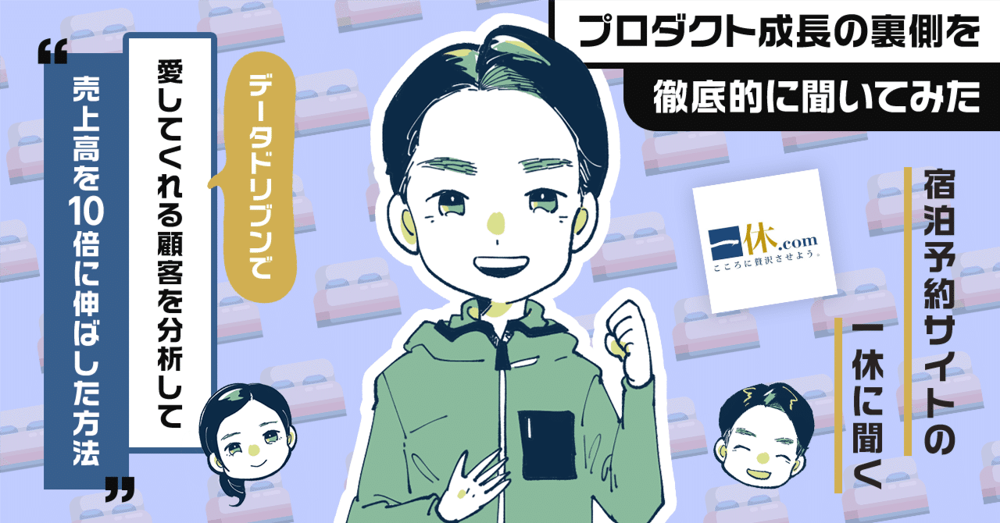  

# データから「最も愛してくれているお客様」を特定して売上高が10倍に成長。高級宿泊予約サイトの「一休.com」に聞く、データドリブンなプロダクト運営と顧客を絞る理由。

346

[%22%20d%3D%22M-100-100h300v300h-300z%22%2F%3E%3C%2Fsvg%3E)](/)

[アプリマーケティング研究所](/)

2024年12月25日 11:30

¥2,000/月

一休さんを取材しました。

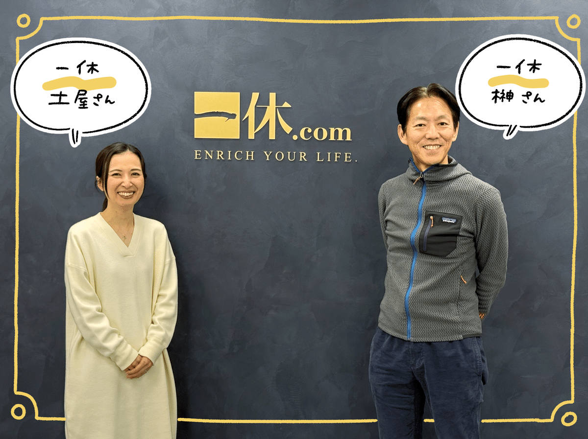

株式会社一休 代表取締役社長 榊 淳さん、チーフディレクター 土屋 美佐子さん。

### ⸺「一休.com」について教えてください。

榊：  
一休.comは「こころに贅沢させよう。」をコンセプトに掲げて、2000年に運営を開始した、高級ホテル・旅館の予約サイトです。

会社としては、消費者ニーズを捉えた事業を通して、世の中に「こころに贅沢」な時間を増やすことを目指しています。

例えば、プレミアムグルメの予約サイト「一休.comレストラン」や、贅沢体験をお届けする「一休.comスパ」など、様々なサービスを展開しています。

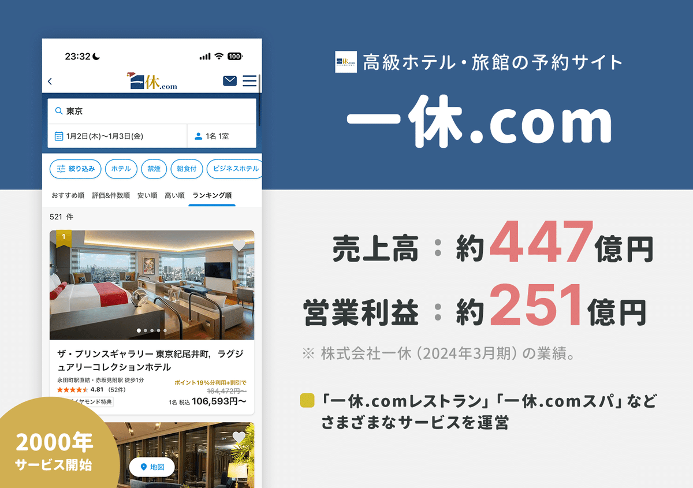

2012年から「データドリブン経営」を軸に、約10年で売上高が10倍以上に成長した。2024年3月期の売上高は447億円、営業利益は251億円。

### ⸺そもそも、「一休.com」はどのようにはじまったのでしょうか？

榊：  
元々の発想としては、創業社長が新宿の夜空を見上げると、電気がついていない部屋がたくさんあって、その部屋が「高級ホテル」だったそうです。

恐らく、ネット予約サイトが大量に出てきていた当時に、差別化のために「高級ホテルへのフォーカスを選んだ」ということでもあったのかなと。

そこから一休は成長して、2007年には東証一部へ上場しました。ものすごい勢いで成長していましたが、その後の数年間は業績が伸び悩んでいました。

このとき2012年から、僕は最初はコンサルタントとして、クライアントである一休と関わることになりました。

（その後、2013年に一休に入社して、2016年に代表取締役に就任することになる。）

### ⸺コンサルタントとして、最初は何をしていったのでしょうか。

榊：  
データの分析を進めながら「社内の人の考え」を理解しようと考えました。**なぜなら、そこに「何をすればいいのか？」という問いに対する答えがあることが多いからです。**

コンサル企業で働く中で数十社に関わりましたが、コンサルで価値を出すって難しいんですよ。だって、その業界のことも知らないですし、社内からは「あんた、誰よ？」という目で見られます。

ただ、**短期間で「その業界の構造」を理解することと、誰が言っていることが真実なのかを「見極める能力」だけは身につくんですよね。**

それで、社内の方にお話を聞くと「この方が言ってることは正しそうだ。こっちに進めば成長の兆しが見えるかも。」みたいなものが見つかるわけです。

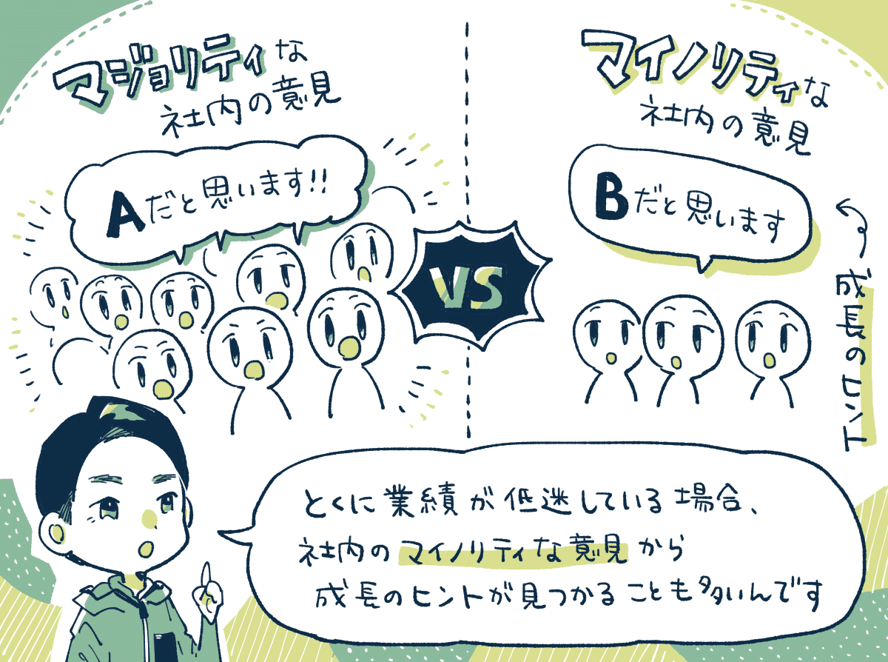

大体**その人の意見って「マイノリティ」なんですね。それがマジョリティなのであれば、その会社はポテンシャルをフルに発揮しているはず**なので。

つまり、ボタンを掛け違えているところを見つけて、成長の余白を発見することが大事で。そのために「社内の意見」に耳を傾ける必要があるんです。

## ヒアリングでわかった「市場を取りきった」という思い込み。

### ⸺社内でヒアリングをして「印象的だった言葉」はありますか？

榊：  
印象的だった言葉のひとつは、**多くの方が「もう市場は取りきったよ。」とおっしゃっていたことでした。**

当時、こんな質問をしてみました。

「ネットの『宿の予約サービス』の市場は伸びているように思います。競合のA社・B社・C社、みんな伸びていますよね。その中で、一休だけが伸びていないのは、どうしてだと思われますか？」

すると「いや、伸びてるのは市場全体ですよね？ 高級な市場は伸びていないと思いますよ。」と返ってきたとします。

そのときに**「なるほど、なぜ高級市場だけ伸びていないと思うのですか？」と聞くと、「もう取りきったから。」という回答が多かったんです。**

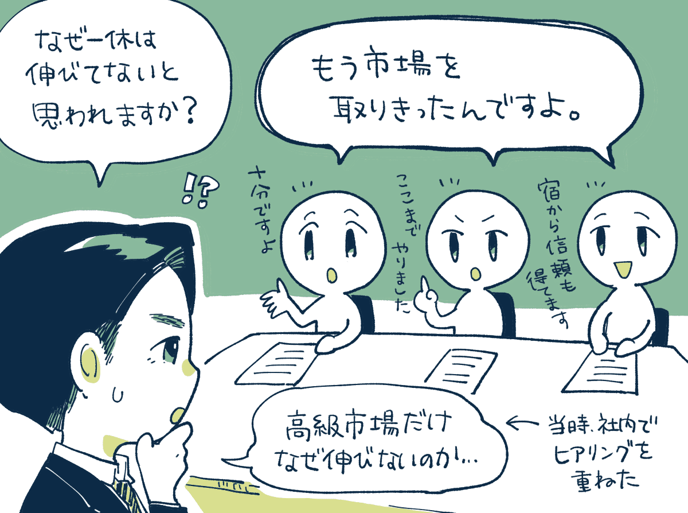

この「もう取りきったから。」というニュアンスの言葉は、面白いことにたくさんの社内の方から出てきたワードでした。

ところが、**一休の販売データを見てみると「市場を取りきっていないこと」は明白だったんですよね。**

例えば、100室を保有する宿で「1日平均3室」を一休が販売しているなら、一休の販売シェアは3％ですよね。97%のポテンシャルがあります。

これを全ての宿で見ると、一休の販売シェアは低水準で停滞していました。つまり、市場ではなくて「販売シェア」が伸びていなかったんです。

こうした数字を見せてお話しすると、「だとしたら、もう少し伸ばせるかもね。」といったオープンな会話も生まれていきました。

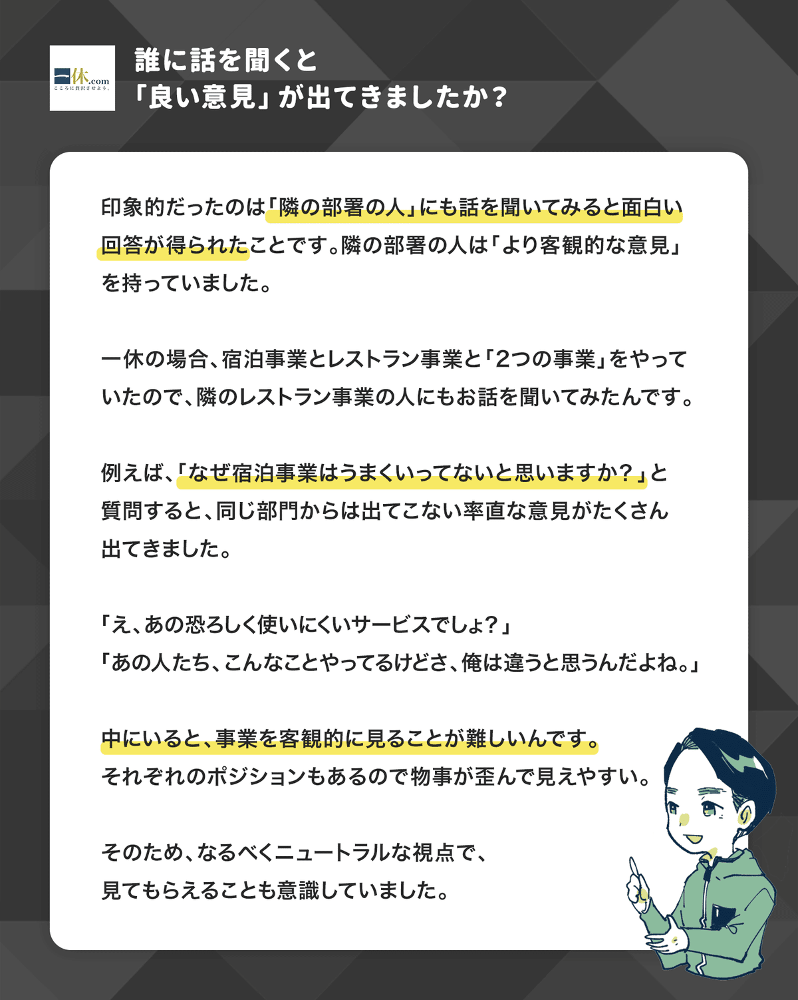

## データから「どのお客様を狙うのか？」を明確にした。

### ⸺そこからは、どのように進めていったのでしょうか？

榊：  
市場ではなく「一休の販売シェア」が伸びていない。これがわかってからは「どのお客様を狙うか？」を考えました。

ボウリングの1番ピンを倒せないと、2番ピンは倒れません。**じゃあ「1番ピンは一体誰なのか？」これを考えるのが、経営戦略の大事なポイントです。**

これは「狙わないお客様」を決めることでもあります。そして、ターゲット市場は小さければ小さいほど良いんです。これは劣勢な会社ほどそう。

窮地に追い込まれている会社が、「我々のターゲットは日本国民全員です！」といっても説得力がないですよね。絞って尖らせたほうが良いんです。

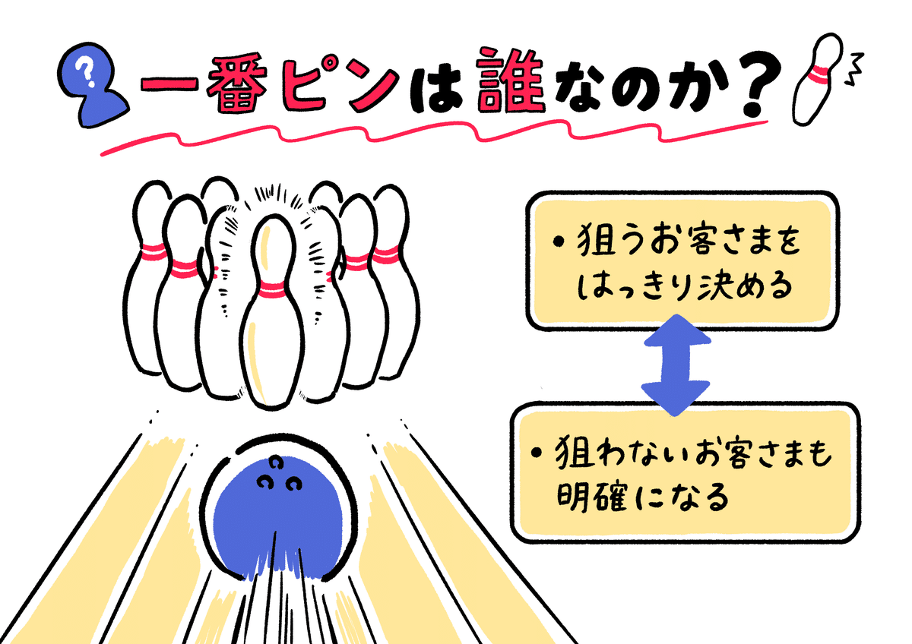

それを踏まえて、一休のデータを見ながら「どのお客さんが伸びているか？」を調べていくと、**年間の利用金額が「100万円を超えるお客様」の利用金額が伸びていることがわかりました。**

次に、そのお客様たちに会ってみました。皆さんがおっしゃっていたのは「一休はノイズがないから、一番使いやすいです。」というお話でした。

カジュアルな宿は出てこなくて、探すときにもノイズが非常に少ない。**このサービスを最も愛してくれていたのは「高級な宿に頻繁に泊まるお客さん」だったんですね。**

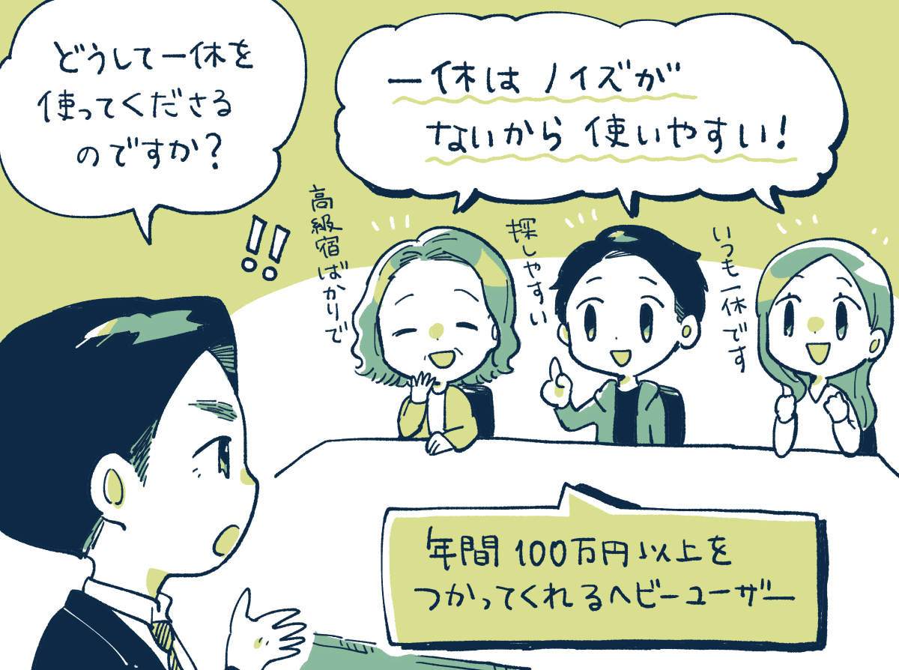

ここまで見えてくると、ただ「年間100万円を使ってくれる層」が伸びているというよりも、もっと肌感覚で「お客様は誰か」がわかってきませんか？

**データとして見てしまうと、乾いた情報のようにも感じますが、必ずその背後には「お客様」がいらっしゃいます。**お客様の心理を反映した行動があります。ここまで掘り下げていくことが大切なんですね。

そして「誰に」が定まったので、**そこから「何をするか？」を決めました。「高級な宿に頻繁に泊まるお客さん」にとって嬉しいことをしよう。**

例えば、「サイト内の広告は廃止しよう。」とか「大きな写真を載せて高級感をより感じてもらえるようにしよう。」といった感じです。

実は掲載されている「高級な宿泊施設の数」自体は、この10年間でそこまで変わっていないんですよ。お客様の数とリピート率が変わりました。

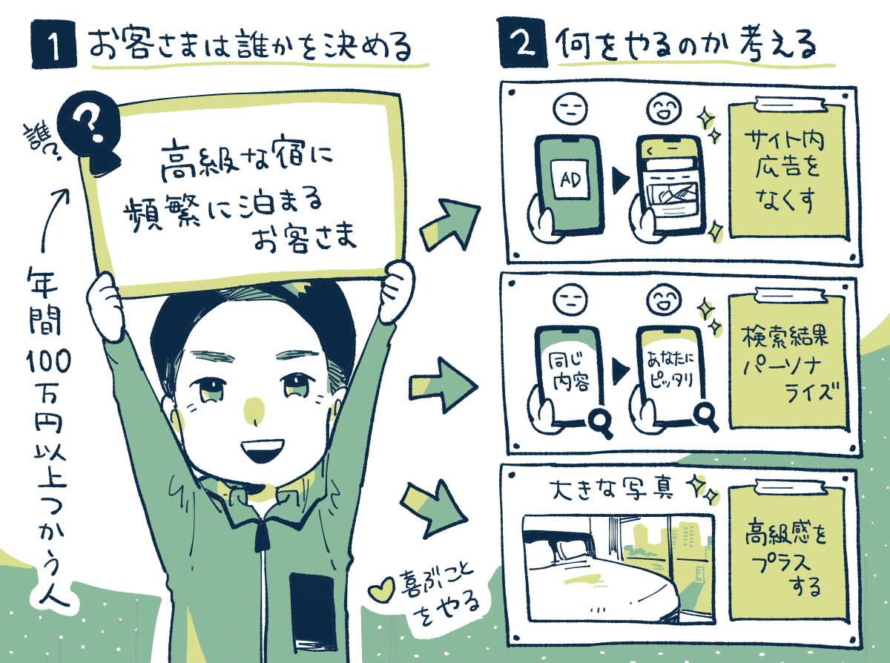

もともと「高級市場」にフォーカスはしていたが、徐々に「カジュアルな宿も開拓しよう」「サイト内に広告を増やそう」など、コンセプトがズレてしまっていたと。

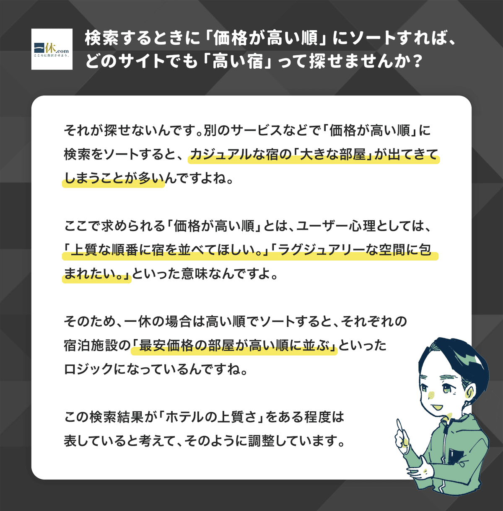

より詳しく「データドリブン経営」の裏側について知りたい方は、榊さんの著書「[DATA is BOSS](https://www.shoeisha.co.jp/book/campaign/dataisboss)」も参考になります。

### ⸺「お客さんの理解」を深めるためにやっている取り組みを教えてください。

土屋：  
週に1回「ユーザージャーニー勉強会」を行なっています。これはお客様が一休にアクセスしてから「どんな行動をされているか？」を考える会です。

具体的には、URLの遷移を見ながら、「どう予約に至っているか」「どこで離脱をしているか」「なぜそうなったのか」などを議論するのですが、ここからさまざまなことがわかります。

ここから、「どんな行動をされているか」「どこに落とし穴があるか」などの課題の種を見つけて、それを施策に落とし込んでいますね。

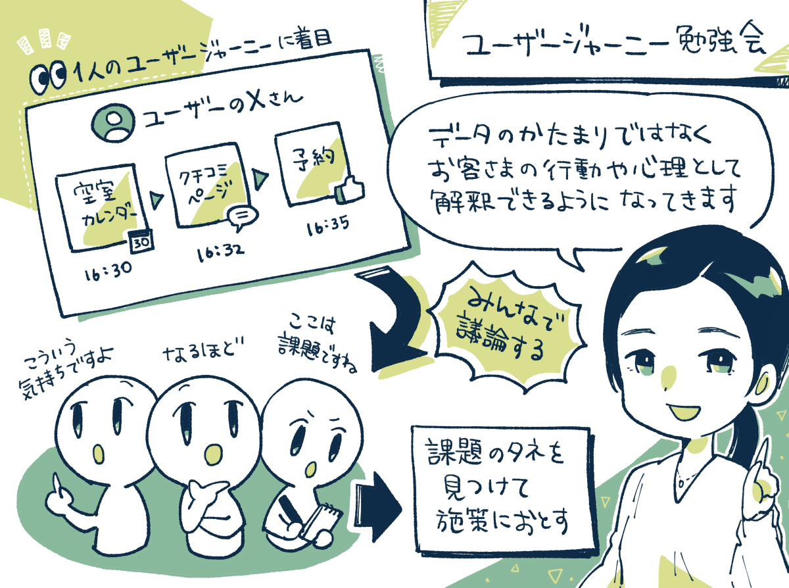

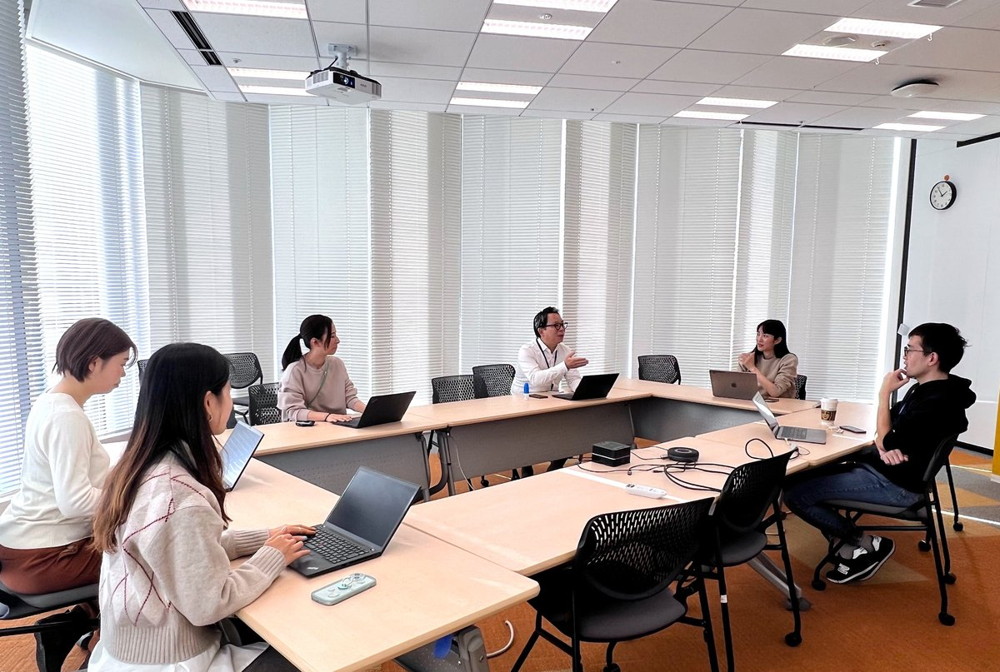

ユーザージャーニー勉強会の様子。

榊：  
やっぱり「データドリブン」とか言いはじめると、自分たちが賢くなったように勘違いして、頭で考え過ぎてしまうんですよ。

**どうしてもグラフって「集計されたデータ」でしかない。データの後ろには1人1人の行動があって、そこの洞察こそがものすごく大切。**

例えば、「こういう行動を取るお客様がいる。なぜなら、こうだからだよ。」みたいに、頭でわかるんじゃなくて、肌身でわかることが大事。組織にそうした栄養素を増やそうとはじめた取り組みです。

僕自身もずっとお客様のジャーニーを見ています。そうしないとわからなくなるので。発想も施策もディテールが全てなんです。

土屋：  
わたしも2017年頃に、榊から「考えるな、感じろ。」と言われましたね。「ジャーニーを見よ！」と。難しいことを考えていたんでしょうね。

これを続けると「この人は他社で予約をしたんだ。」「値段を比較している。」みたいなことも本当にわかるようになってきます。

例えば、出張の用途のお客様は「場所をすごく重視してるんだ」とわかり、地図検索の改善の優先度を上げたことがあります。

これは一休がLINEヤフー社から委託され運営している「Yahoo!トラベル」の事例ですが、頭だけで考えると視野が狭くなってしまうので、お客様から教えていただいています。

## 一休.comの体験を改善した「2つの施策」

### 改善施策①：「クーポンをサイトに直接表示した。」

土屋：  
一休.comではクーポンを活用して、利用を後押ししていますが、クーポンの届け方を変えることで、効果を高めることができました。

具体的には、**お客様がサイトから離れた後にメールでクーポンを送るよりも、画面上にクーポンを出したほうが効果が高くなりました。**

やっぱり、メールは閲覧してくれる方もいれば、してくれない方もいるので、そのまま表示したほうが良かったです。

2024年の夏には、お客様が再訪された際に「その人に使っていただきたい」というときに、クーポンを出す仕組みを作ると効果がより高まりました。

例えば「どんな施設を見ていたか？」「どんな価格のプランを見ていたか？」などの過去の行動履歴をベースに、クーポンの内容を最適化しています。

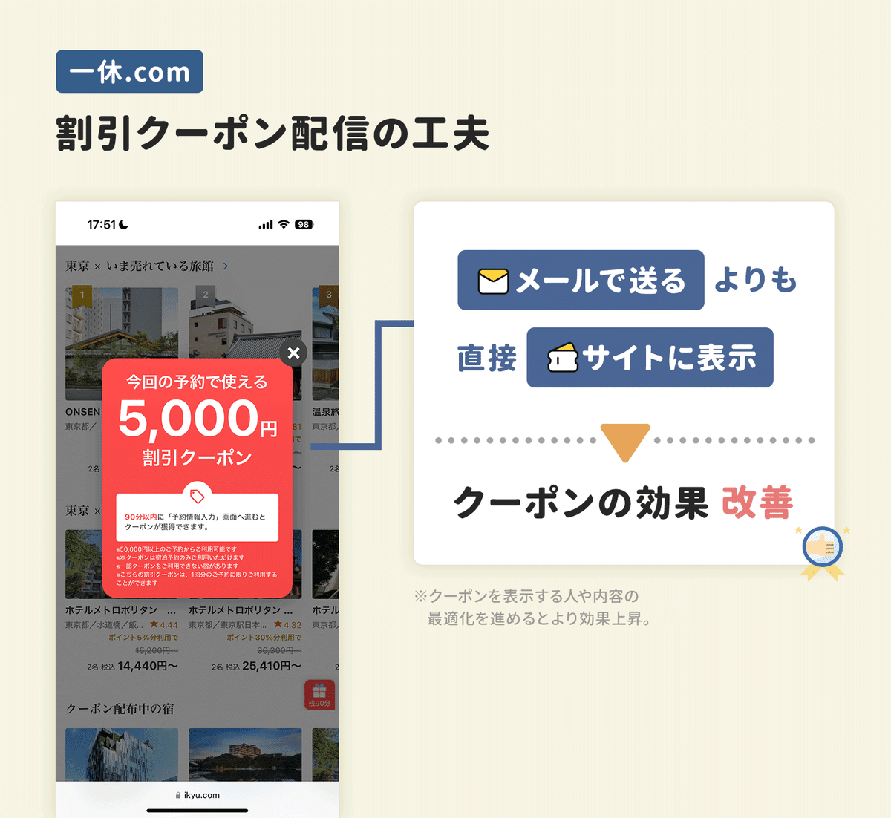

また、以前はクーポンコードを予約画面で入力しないと使えなかったが、クーポンが表示された人には「自動で適用」されるようにすると、利用率をより高めることができた。

### 改善施策②：「キャンセルフレンドリーなサイトにした。」

土屋：  
一休.comでは「キャンセル」という行動を、**なるべくポジティブに捉えて「気持ちのいいキャンセル」ができるように意識しています。**

キャンセルって「ネガティブなもの」と捉えられがちで、結構どのサイトでも奥まったところに「解約・キャンセル」のボタンがあると思うんですよ。

でもキャンセル率って、**継続的に見てもあまり大きく変動しないですし、お客様も「気持ちいいキャンセル」ができたほうが嬉しいですよね。**

例えば、以前は「キャンセルの理由」を聞いていたのですが、そういうのもなくしてしまって、ボタン1個でキャンセルできるようにしました。

この考え方を、わたしたちは「キャンセルフレンドリー」と呼んでいます。心地のよい体験を提供して「また来てね。」と見送る感じですね。

宿泊予約サイトでは、どうしても一定のキャンセルは出てしまうのですが、この取り組みで少なくとも「イラッとする瞬間」は減らせているかなと。

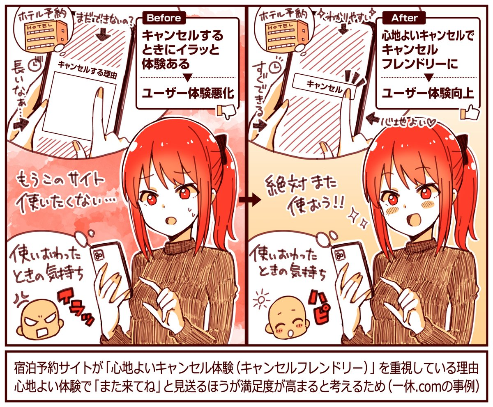

### ⸺普段は、どんな風に「データ」を見ているのかぜひ教えてください。

榊：  
イメージ的には「毎週健康診断を受ける」みたいな感じで見ています。毎週日曜に一休の健康状況をまとめたレポートを僕が出していて、それに沿って改善を進めていますね。

最も重視するのはリピート率なのですが、健康診断と一緒でKPIっていっぱいあるんですよ。体重もあれば、血圧もあれば、肝機能もある。

健康診断を受ける。もちろん悪いところもある。でも毎週ショックを受けていても仕方ないですよね。しかも、全部を一気に治せないわけですし。

例えば、肝機能がちょっと悪いから、肝機能にフォーカスしようみたいな。血圧とかは1回忘れて、お酒をまずは控えてみようと。運動しながらお酒も控えるって結構きついじゃないですか。

つまり、大事なのは「今これを治そう」という判断を適切にすることです。**今のマーケットで、お客さんはどんな動きをしていて、その状況でどの数字が良くてどの数字が悪くて、今何をすべきなのか**を考える。

データを見ながら、今のマーケットに誰よりも素早く反応することが、データドリブン経営の一番のポイントかもしれないです。

---

【取材協力】  
株式会社一休：<https://www.ikyu.co.jp/>   
一休.com：<https://www.ikyu.com/>   
株式会社一休 榊 淳さん、土屋 美佐子さん

【告知】一休さんでは各職種で採用中。マーケティングディレクターやプロダクトデザイナーなど募集中とのこと。ご興味あれば下記サイトからご覧ください。

[**株式会社一休**
*株式会社一休 です。| HRMOS*
*hrmos.co*](https://hrmos.co/pages/ikyu/jobs)

> ※ 以降は、＋αの事例を5つほど『ここだけの話』として、note購読者向けにまとめています。ゲストユーザーの予約数を伸ばした工夫、顧客との接点を増やすことができた企画、などご興味あればご覧ください。

  

ダウンロード

 

copy

## ここから先は

1,985字
/
3画像

%22%20d%3D%22M-100-100h300v300h-300z%22%2F%3E%3C%2Fsvg%3E)

アプリやプロダクトの成功事例が学べるマガジンです。プロダクトの売上やユーザー数を伸ばしたい人にオススメです。成長プロダクトのインタビュー、効果のあったマーケティング施策、事例やデータなどが中心（月に7記事ほど）多くの過去記事も5年ほど遡って読めます。クレカ決済だと初月無料なのでお試しでもぜひ。

### [月刊アプリマーケティング](/m/mc375c9b46464)

¥2,000 / 月  
初月無料

プロダクト運営について学べるマガジンです。アプリやプロダクトの売上やユーザー数を伸ばしたい人にオススメです。月に7記事ほどお届けします。

購読手続きへ

%22%20d%3D%22M-100-100h300v300h-300z%22%2F%3E%3C%2Fsvg%3E)%22%20d%3D%22M-100-100h300v300h-300z%22%2F%3E%3C%2Fsvg%3E)%22%20d%3D%22M-100-100h300v300h-300z%22%2F%3E%3C%2Fsvg%3E)%22%20d%3D%22M-100-100h300v300h-300z%22%2F%3E%3C%2Fsvg%3E)%22%20d%3D%22M-100-100h300v300h-300z%22%2F%3E%3C%2Fsvg%3E)

5人が高評価

[ログイン](https://note.com/cd/login?redirect_to=https%3A%2F%2Fmarkelabo.com%2Fn%2Fn5f1ba5a41f4c)

   

346

[%22%20d%3D%22M-100-100h300v300h-300z%22%2F%3E%3C%2Fsvg%3E)](/)

[アプリマーケティング研究所](/)

フォロー

プロダクトの成功事例を発信しているメディアです。2013年から約10年運営しています。取材相談はツイッターDM（@appmarkelabo）かメールにてどうぞ！info@appmarketinglabo.net