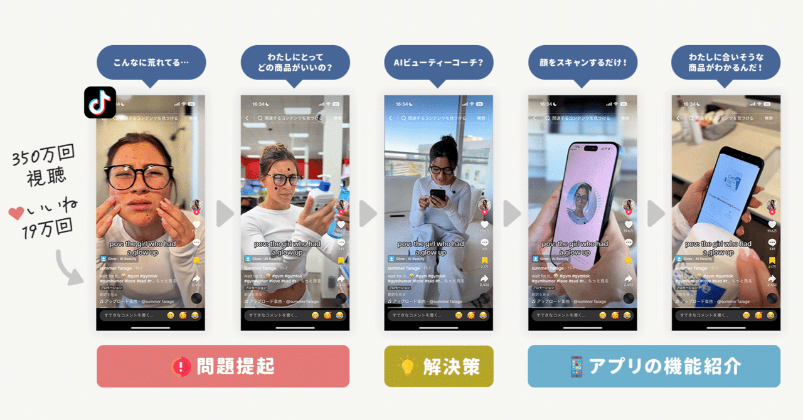

  

# 1億人超に使われたが「低価値・低頻度」で収益性が伸びなかったアプリの話、TikTokを起点に「数日で150万円」のサブスク収益を生んだアプリが語るTikTokマーケのコツなど、アプリやプロダクトのまとめ（12月）

13

[%22%20d%3D%22M-100-100h300v300h-300z%22%2F%3E%3C%2Fsvg%3E)](/)

[アプリマーケティング研究所](/)

2024年12月31日 17:00

¥2,000/月

  

ダウンロード

 

copy

## ここから先は

5,535字
/
14画像

%22%20d%3D%22M-100-100h300v300h-300z%22%2F%3E%3C%2Fsvg%3E)

アプリやプロダクトの成功事例が学べるマガジンです。プロダクトの売上やユーザー数を伸ばしたい人にオススメです。成長プロダクトのインタビュー、効果のあったマーケティング施策、事例やデータなどが中心（月に7記事ほど）多くの過去記事も5年ほど遡って読めます。クレカ決済だと初月無料なのでお試しでもぜひ。

### [月刊アプリマーケティング](/m/mc375c9b46464)

¥2,000 / 月  
初月無料

プロダクト運営について学べるマガジンです。アプリやプロダクトの売上やユーザー数を伸ばしたい人にオススメです。月に7記事ほどお届けします。

購読手続きへ

%22%20d%3D%22M-100-100h300v300h-300z%22%2F%3E%3C%2Fsvg%3E)%22%20d%3D%22M-100-100h300v300h-300z%22%2F%3E%3C%2Fsvg%3E)

2人が高評価

[ログイン](https://note.com/cd/login?redirect_to=https%3A%2F%2Fmarkelabo.com%2Fn%2Fnbc967c1c1d77)

   

13

[%22%20d%3D%22M-100-100h300v300h-300z%22%2F%3E%3C%2Fsvg%3E)](/)

[アプリマーケティング研究所](/)

フォロー

プロダクトの成功事例を発信しているメディアです。2013年から約10年運営しています。取材相談はツイッターDM（@appmarkelabo）かメールにてどうぞ！info@appmarketinglabo.net