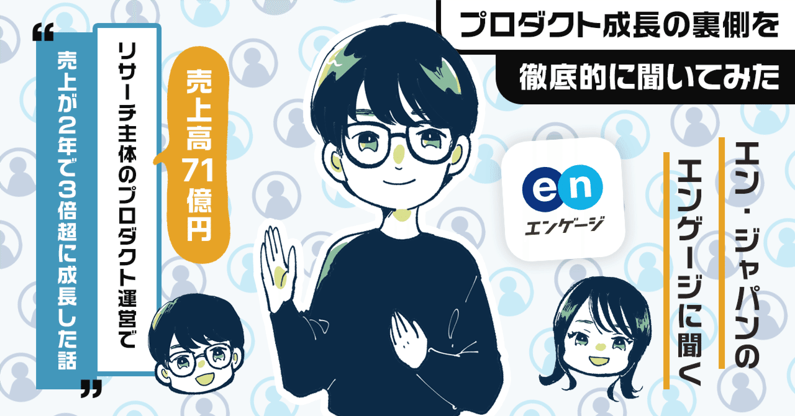  

# リサーチを中心に置いたプロダクト開発で売上高が3倍に成長。エン・ジャパンの「エンゲージ」に聞く、2つのリサーチで顧客理解を深めて、売上71億円まで到達した方法。

97

[%22%20d%3D%22M-100-100h300v300h-300z%22%2F%3E%3C%2Fsvg%3E)](/)

[アプリマーケティング研究所](/)

2025年1月28日 11:30

¥2,000/月

エン・ジャパンさんを取材しました。

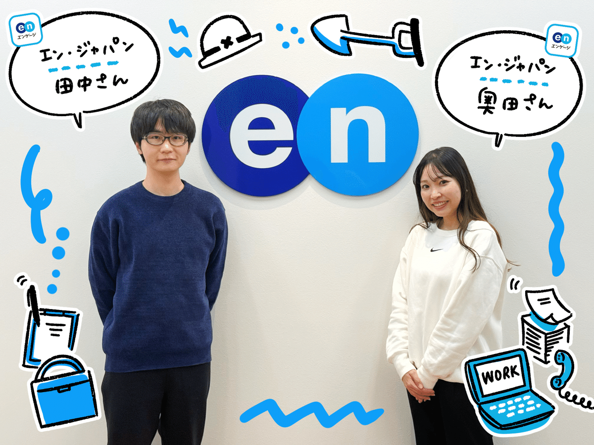

エン・ジャパン株式会社 執行役員 マーケティング本部長 田中 奏真さん、マーケティング本部 マネージャー 奥田 奈緒さん

### ⸺「エンゲージ」について教えてください。

田中：  
エン・ジャパンが運営する、国内最大級の「総合求人サイト」です。求職者の会員数は800万人、公開求人数は190万件を突破しています。

**売上高は71.9億円（2024年3月期）となっており、ここ2年間で3.7倍ほどに成長しています。**1日単位で求人の露出を増やせる「エンゲージプレミアム」という企業向けのプランなどでマネタイズしています。

売上が成長した理由のひとつは「リサーチを通じた顧客理解」です。ここにめちゃくちゃこだわったのが良かったのかなと思います。

多種多様な「求職者の心理」を少しでも理解して、ユーザーさんに応募してもらうためにはどうしたらいいのかを考えました。

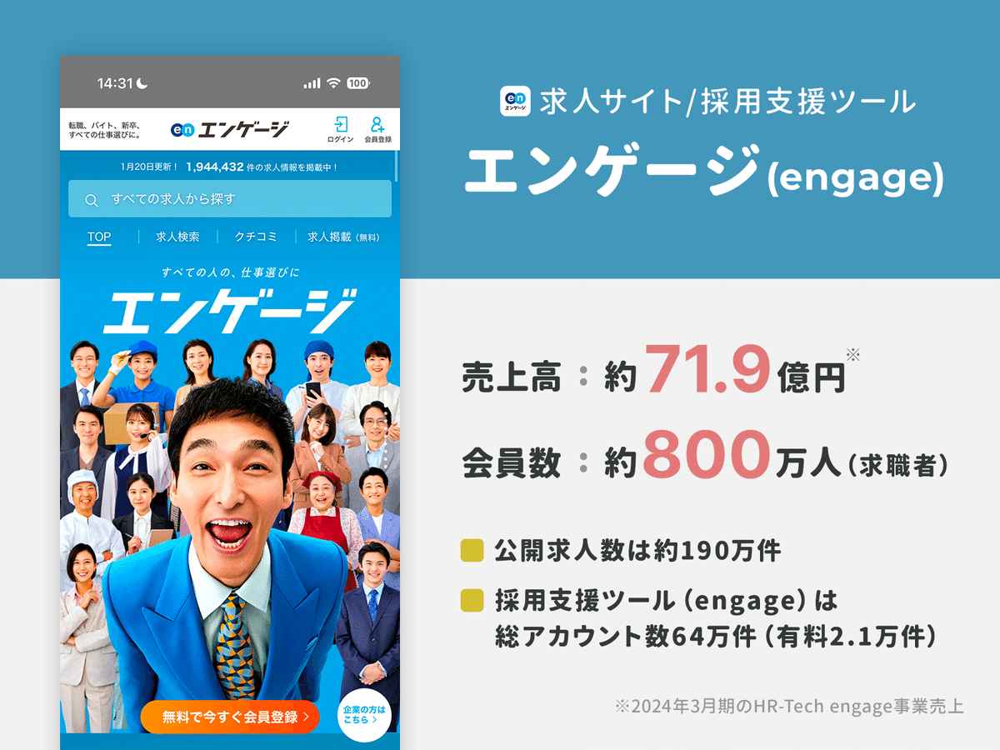

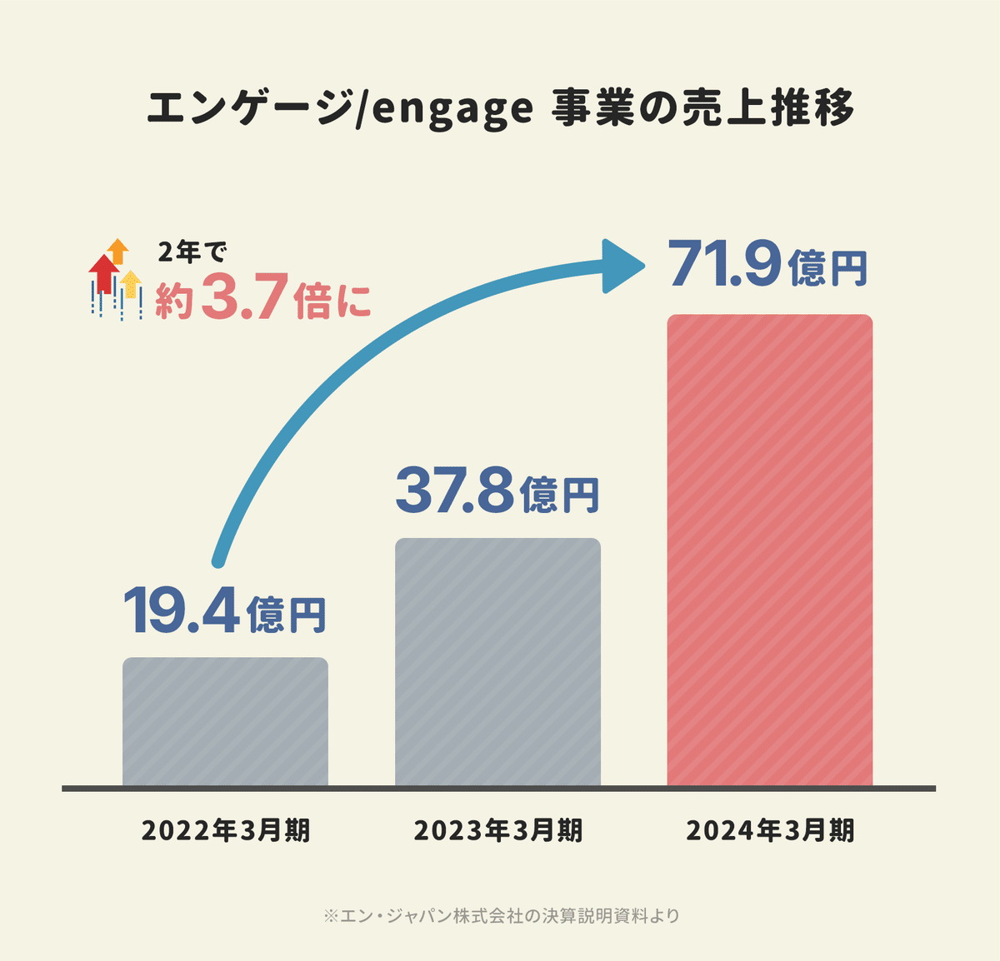

### ⸺なぜ「リサーチ」に力を入れたのでしょう？

田中：  
広告予算で勝負する「戦力の戦い」からは降りて、「戦略の戦い」にシフトすべきだと思ったから、というのが一つありますね。

求職者の方って、**求人サイトを10個も使わないんですよ。多くても3つ程度となると、その人が使うのは「名前を知ってるサイト」になります。**

そうなると「ブランドの認知度」が大事になる。テレビCMやデジタル広告をガンガンやっている、広告費用を使う会社が勝ちやすいわけです。

でも、われわれエン・ジャパンって、メジャーな企業に比べると広告宣伝費が実はかなり少ないんです。普通にやっていると負けてしまいます。

その中で事業を伸ばすには、広告などで一発で「いいね」と思っていただいたり、触った瞬間に「使いやすい」と感じてもらわないといけません。

そのためには、リサーチが必要だと考えました。ユーザーさんに「選ばれる理由」を知るためにもリサーチを強化しようと。

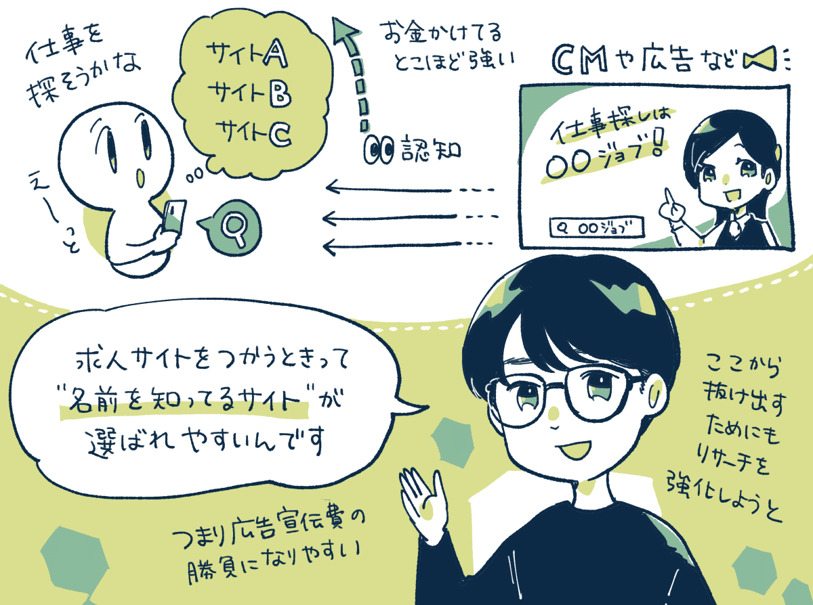

### リサーチ手法①：「ナラティブ分析」で体験を振り返ってもらう。

田中：  
ナラティブ分析というのは、ユーザーさんが自分の体験を語る言葉を「物語」と捉えて、仕事を探している人のニーズを探るリサーチです。

具体的には、約1,450人にアンケートを実施しながら、その中から約150人にユーザーインタビューをして詳しくお話を聞きました。

とくに**「仕事探しで役立ったサービスは何か？」という質問からは良い回答が得られましたね。ユーザーが「欲している体験」がわかるためです。**

例えば、「YouTubeで服装など『面接のマナー』を学んだのが役立ちました」という意見があったら、それは「欲しているものなんだ」とわかります。

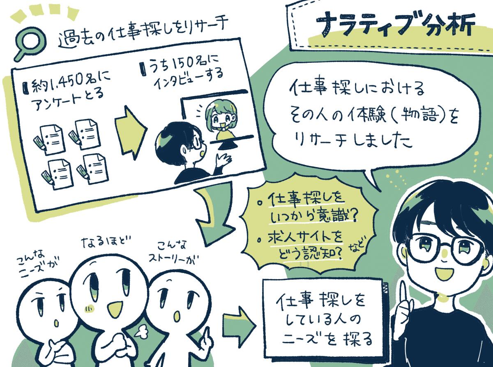

150名は「エンゲージで課題解決できそうな人」を選んだ。

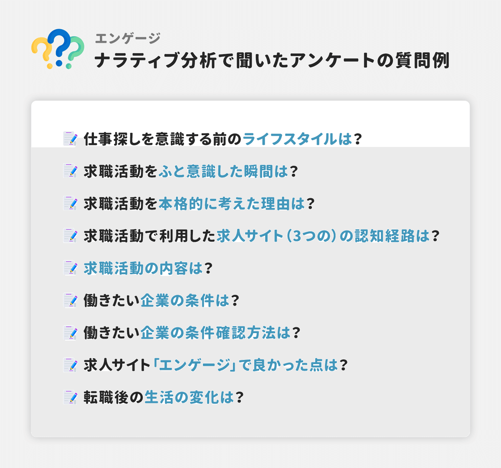

この「役に立ったもの」はフェーズで変わるため、プロダクト改善のヒントにもなるし、なぜそれが役立つかという理解にもつながりました。

そこから「職務経歴書」が簡単に作れる機能や、職場の雰囲気を表現してくれる「動画の投稿機能」なども生まれましたね。

まとめると、ナラティブ分析は、当時を思い出しながら語ってもらうため、広くて浅い「本の目次」のような理解がしやすかったです。

ただ、仕事探しをしている瞬間の「リアルな心理や行動」はあまり深くは得られませんでした。それが知りたくて行ったのが次のリサーチです。

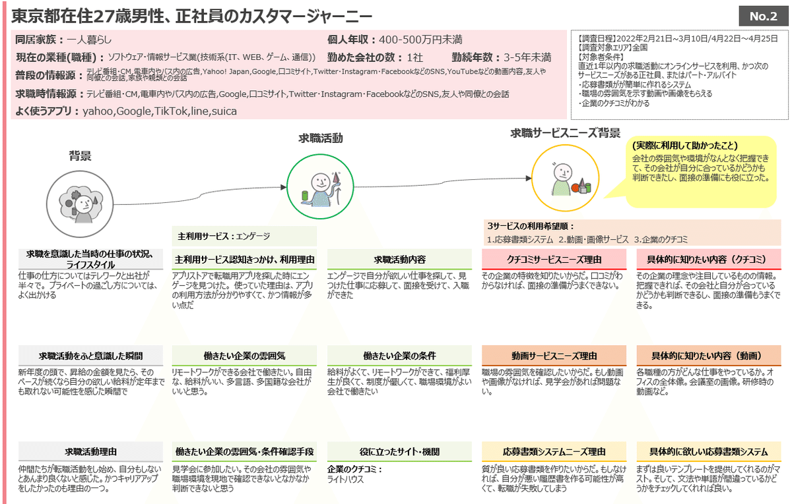

「ナラティブ分析」の結果をまとめたもの。

### リサーチ②：「密着型のリサーチ」でリアルタイムな行動や心理を知る。

奥田：  
次に行ったのが、同一のユーザーさんに3ヶ月間に渡ってお話を聞く「定点密着型のリサーチ」でした。

例えば、会員登録した人に取材をする。1ヶ月後にまた同じ人に取材をする。さらに、1ヶ月後にまた同じ人に取材をする。みたいな感じですね。

エンゲージでは**「求人に応募がある」だけではなくて、その先の「入社後に活躍してもらうこと」までを目標に掲げて運営をしています。**

そのためには「どうしたらいいか？」を掴むためにも、仕事探しをしている瞬間の方にフォーカスしてリサーチをする必要がありました。

インタビューでは、「最近の転職活動どうですか？」「なぜその企業を選んだんですか？」という感じで、仕事探しでやったことを聞いていきます。

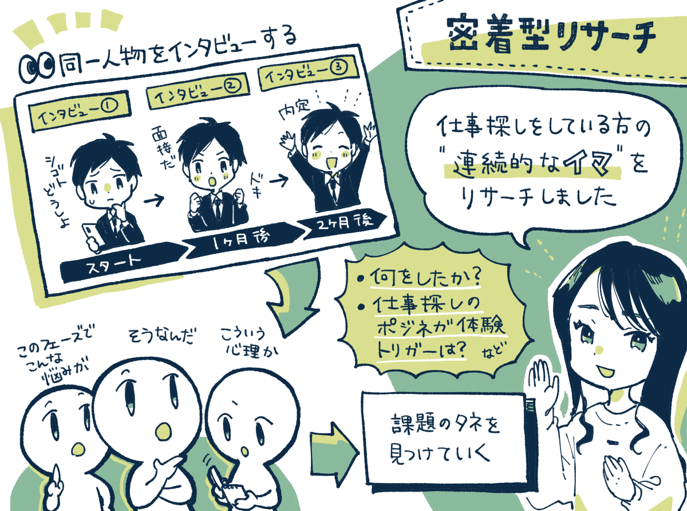

主には仕事探しの「検索→比較検討→選考」における遍歴を聞いていって、前回と変化した点をポイントとして捉えて深堀りしました。

ほかには、転職活動に前向きになる「ポジティブなトリガー」は何か、逆に消極的になる「ネガティブなトリガー」は何かなども整理しましたね。

ユーザーさんに密着しながら、どういう経験をしていくと、入りたいと思う企業が明確になっていくのかを考えました。

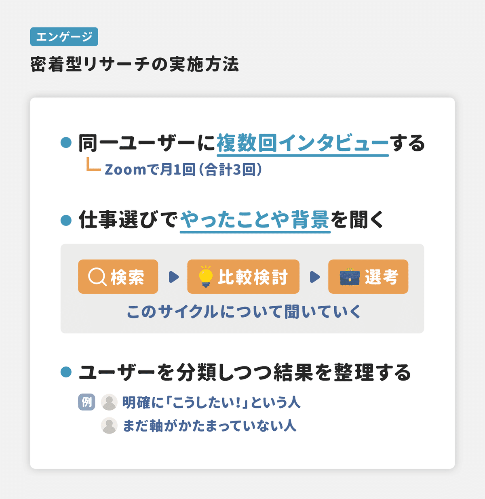

転職理由が「こうしたい」と明確な人もいれば、まだ曖昧な人もいます。その選定軸をいくつかのカテゴリーに分けて整理しましたね。

こういうユーザーの方には、このときに「履歴書の機能」を届けると最も喜んでもらえるよねなど、何をいつ提供するかのヒントにもなりました。

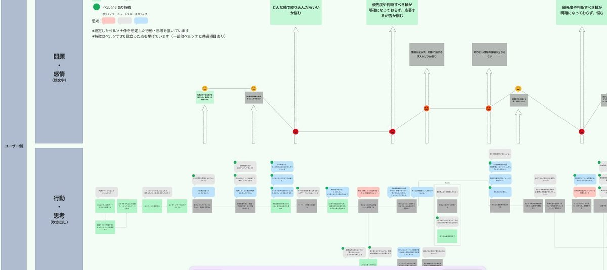

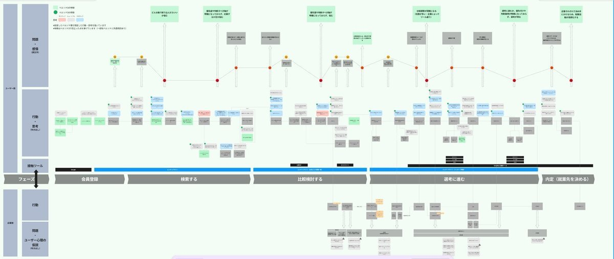

「密着型のリサーチ」の結果をまとめたもの。

田中：  
この2つのリサーチ結果を行き来すると、だんだん解像度が上がって正しい施策を行えるようになりました。

**ナラティブ分析って、「いつも朝食は何を食べますか？」「パンが9割ですね」みたいな会話に近いように思います。**

過去を振り返ってもらうので、平面的で網羅的な「全体感」が掴みやすい。でも、ディテールは抜け落ちてしまうことも多い。

**密着型のリサーチは、「今日の朝食は何を食べました？」「いつもはパンですが、今日は卵かけご飯だったんですよ」みたいな会話に近いのかなと。**

リアルタイムにディテールを語ってもらえるため、そのときの行動や気持ちを具体的に立体的に知ることができます。

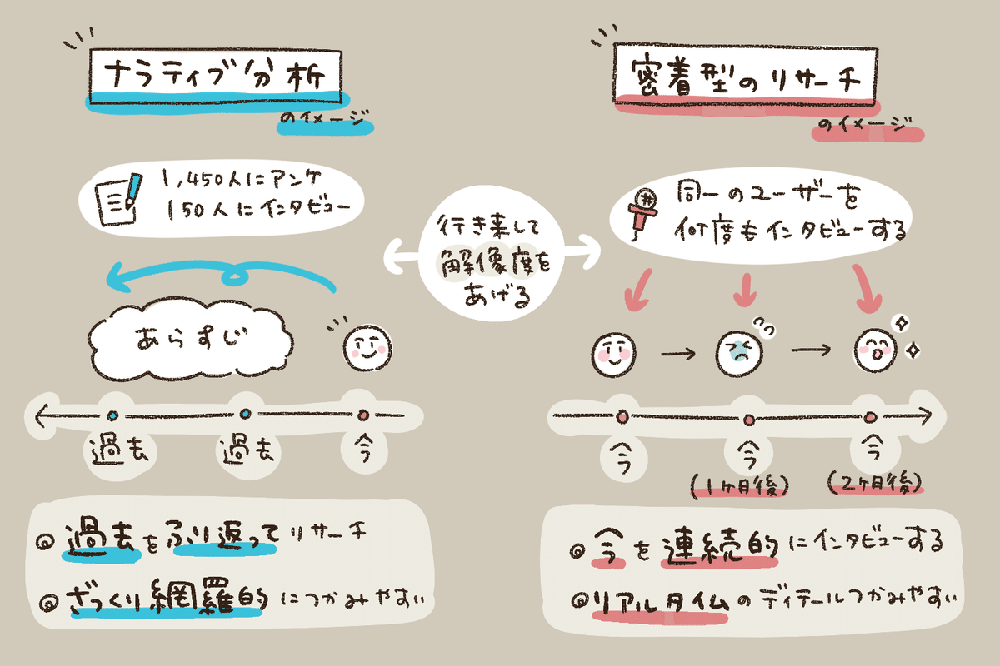

生成AIを活用して「インタビューの前日ロープレ」も行うこともあるそう。プロンプトは「あなたは接客業の25歳の女性で、こんな悩みがあります」のように指定して「インタビューしますね」とAIを相手に予行演習をする。

### ⸺リサーチにおける「失敗例」などがあれば教えてください。

田中：  
ユーザーインタビューで初期に失敗したのは、**「この人から話を引き出そう。エッセンスを得て生産性を上げよう。」と思いすぎてしまったことです。**

当初は「困っていることは何ですか？何がどうなったら嬉しいですか？」と聞いて、役に立つ意見をすぐに言ってもらおうとしていたんです。

でもそうではなくて、**「何をしてきましたか？何が起こったんですか？」と、ありのままの事実を教えてもらうほうが成果につながりました。**

コミュニケーションにフィルターをかけすぎず、無加工のままの意見を語ってもらったほうが、結果的に顧客理解につながったんです。

例えば、**「履歴書を書いたときの困り事は何ですか？」と聞くよりは、「履歴書を書いてみてどうでしたか？」って事実を聞くほうが良いんですよ。**

そして、出してくださったエピソードの中から、僕らが「困り事のタネ」を見つけるんですね。

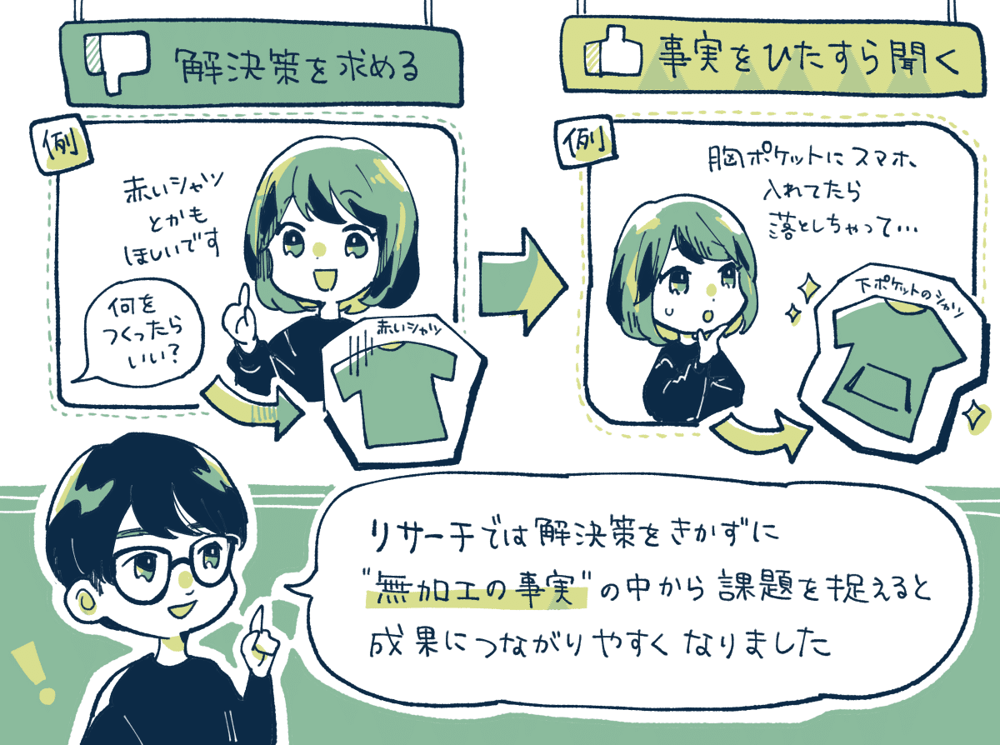

例えば、Tシャツを売ってるとして、ユーザーさんに「何に困ってますか？」と聞いたら、「違う色もほしいですね」みたいな意見が出ます。

でも、これって「問題解決」ではないと思うんですよね。相手に解決策をただ求めてしまっています。

そうではなく事実を聞きます。例えば「胸ポケットにスマホを入れていて、子どもを抱っこしたら落としちゃった。」というお話が出てきたとします。

**そこから「じゃあ、ポケットはお腹のところにつけたほうがいいかもね」とこちらが解決策を考えてお客様に提供する。**これが問題解決なのかなと。

つまり、ただ「欲しいもの」を聞くよりも、**ユーザーさんのお困り事が解決できたときに、それが買ってもらえる商品になるということです。**

これは適切な例かわかりませんが、子どもに「今日さ、幼稚園で良いことあった？」と聞いたら、その回答には「子どもの解釈」が含まれますよね。

でもそうではなくて、「今日あったこと」をひたすら聞いて、その中から良いことを見つけていくほうが、子どものことを理解できるように思います。

この感覚に似ている気がします。少なくとも、わからないまま終わっていたものが「わかるようになる確率」は上がるのではないかなと。

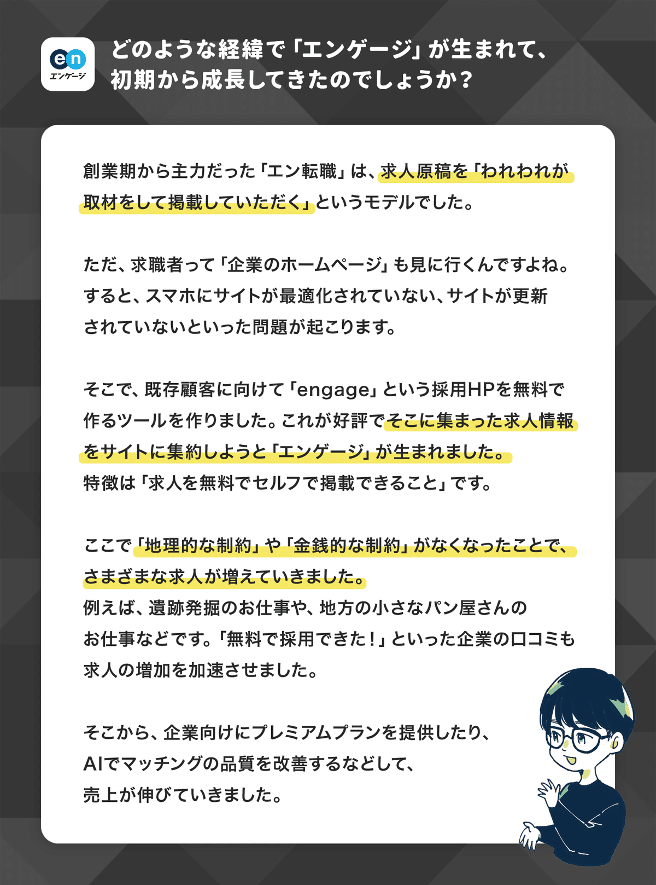

### 成功施策①：おすすめ求人を「スワイプUI」で紹介したら応募率改善。

奥田：  
エンゲージでは**「スワイプ型のUI」で、おすすめの求人をお気に入りできる機能をつけたところ、ここからの応募率を1.5倍にすることができました。**

もともとは、リスト型でおすすめ求人を並べていたのですが、それを左右にスワイプして振り分けられるようにしたんですね。

ユーザーさんには1日1回だけ、「あなたへのおすすめ求人を確認しますか？」と出すようにもしています。

これはインタビューで、**ユーザーさんが「使い慣れているベンリな体験」を調査して、自社サービスに応用してみようと試した機能でした。**

以前は、スクロールで読み進めるUIが主流でしたが、最近はTikTokやTinderのような、次から次に情報をうけとれるUIが浸透しています。

求人サービスでは、こうした「振り分け型のUI」は珍しいのですが、実際に開発してみるとすごく使われる機能になりました。

お気に入りがより活用されるようになり、AIのレコメンド精度の向上につながったことが、総合的なユーザー体験の底上げにもつながりました。

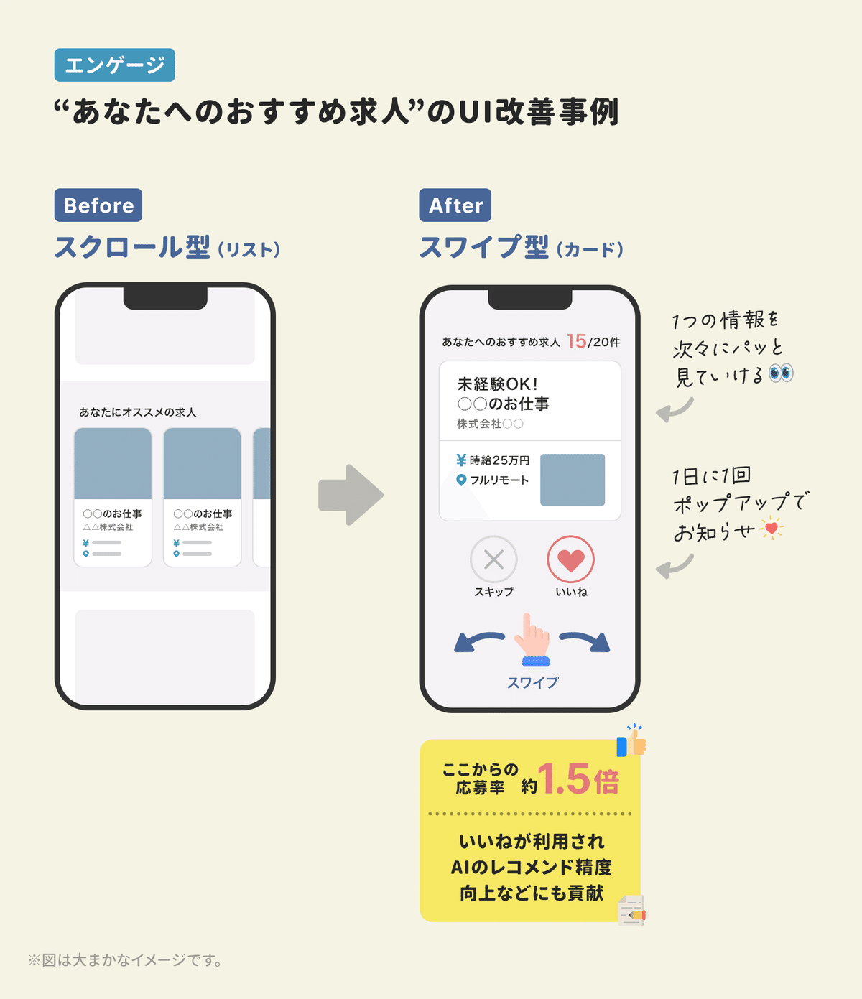

いろいろ試した結果「1日に20件の求人」を紹介すると最も良い数値になったそう。

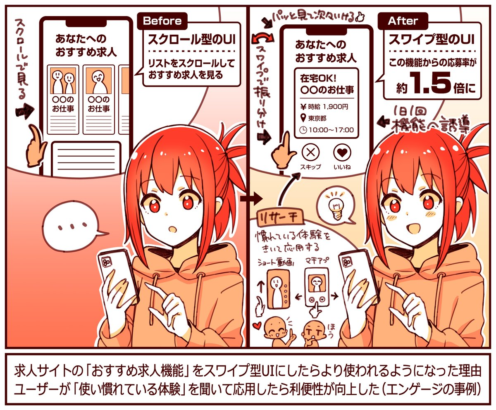

### 成功施策②：「広告とLPの訴求」を揃えたらCVRが2倍に。

田中：  
プロモーションで、**広告と飛び先のLPで訴求する情報を「一致させること」を意識したところ、全体のCVRが約2倍になりました。**

具体的には、広告バナーで訴求しているものを、LPのファーストビューでも訴求するようにして、情報の整合性を一致させるようにしたんですね。

例えば、広告の訴求内容が「在宅OKの仕事が探せる」なら、LPで最初に目に入る情報も「在宅OKの仕事が探せる」にしたほうが良いわけです。

一見当たり前ですが、インスタやTikTokなどに「色々な種類の広告を出そう」と広告を大量に出していると、これがズレていってしまうんですよ。

そうなると、広告を見てくれた方が離脱してしまうので、自動化を進めて効率を高めていきました。

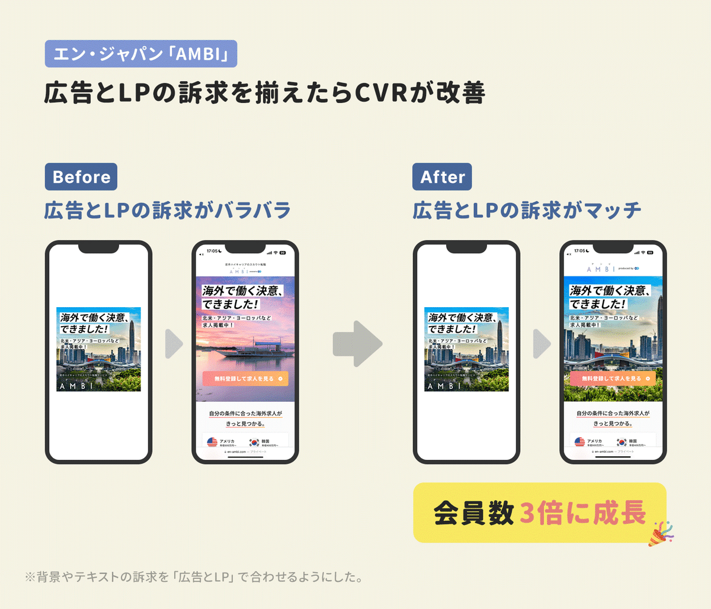

---

【取材協力】  
エン・ジャパン株式会社：<https://corp.en-japan.com/>  
エンゲージ：<https://en-gage.net/>  
エン・ジャパン株式会社 田中 奏真さん、奥田 奈緒さん

【告知】エン・ジャパン社のマーケ関連の取り組みや採用情報は[田中さんのX（旧Twitter）などで発信中](https://x.com/tanacasoma%C2%A0)。ぜひ一度チェックしてみてください。

> ワンカットで撮影した15秒動画を、セリフだけ変えて複数パターン作成し検証。その結果、視聴者の指名検索数に1.4倍の差が出た。やっぱり言葉へのこだわりは大事。細部にこそ、効果を左右するヒントが隠れている。
>
> — 田中奏真 (@tanacasoma) [January 10, 2025](https://twitter.com/tanacasoma/status/1877660202889072671?ref_src=twsrc%5Etfw)

> ※ 以降は、＋αの事例を5つほど『ここだけの話』として、note購読者向けにまとめています。登録完了率を高めたフォームの工夫、求人の応募率を高めたラベル施策、リサーチで理解を深めるための質問のコツ、などご興味あればご覧ください。

  

ダウンロード

 

copy

## ここから先は

1,575字
/
4画像

%22%20d%3D%22M-100-100h300v300h-300z%22%2F%3E%3C%2Fsvg%3E)

アプリやプロダクトの成功事例が学べるマガジンです。プロダクトの売上やユーザー数を伸ばしたい人にオススメです。成長プロダクトのインタビュー、効果のあったマーケティング施策、事例やデータなどが中心（月に7記事ほど）多くの過去記事も5年ほど遡って読めます。クレカ決済だと初月無料なのでお試しでもぜひ。

### [月刊アプリマーケティング](/m/mc375c9b46464)

¥2,000 / 月  
初月無料

プロダクト運営について学べるマガジンです。アプリやプロダクトの売上やユーザー数を伸ばしたい人にオススメです。月に7記事ほどお届けします。

購読手続きへ

%22%20d%3D%22M-100-100h300v300h-300z%22%2F%3E%3C%2Fsvg%3E)%22%20d%3D%22M-100-100h300v300h-300z%22%2F%3E%3C%2Fsvg%3E)

2人が高評価

[ログイン](https://note.com/cd/login?redirect_to=https%3A%2F%2Fmarkelabo.com%2Fn%2Fn92045db94ff9)

   

97

[%22%20d%3D%22M-100-100h300v300h-300z%22%2F%3E%3C%2Fsvg%3E)](/)

[アプリマーケティング研究所](/)

フォロー

プロダクトの成功事例を発信しているメディアです。2013年から約10年運営しています。取材相談はツイッターDM（@appmarkelabo）かメールにてどうぞ！info@appmarketinglabo.net