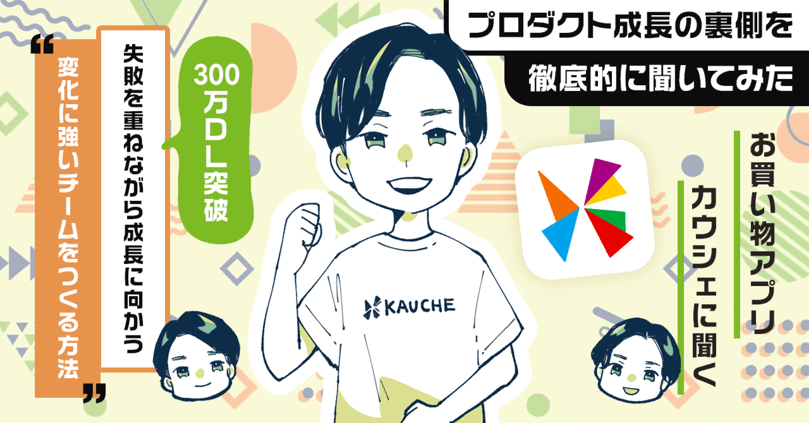  

# 300万ダウンロードを突破した「カウシェ」に聞く「シェア買い」が普及しなかった理由。非目的な買い物市場と「変化に強いチーム」で前年同月比で16倍に成長した方法。

57

[%22%20d%3D%22M-100-100h300v300h-300z%22%2F%3E%3C%2Fsvg%3E)](/)

[アプリマーケティング研究所](/)

2025年1月29日 17:00

¥2,000/月

カウシェさんを取材しました。

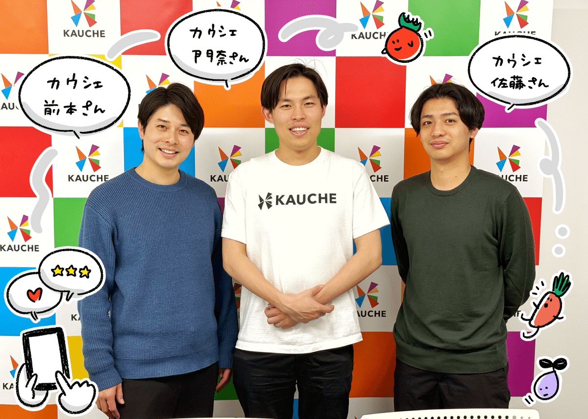

株式会社カウシェ 代表取締役 門奈 剣平さん、取締役 前本 航太さん、プロダクト本部 開発二部 部長 佐藤 俊輔さん

### これまでの「カウシェの歴史」について教えてください。

門奈 ：  
僕らカウシェは、もともとは「シェア買いアプリ」として、商品を誰かと一緒に購入するというコンセプトで2020年にスタートしました。

**初期から継続率をかなり意識して、食品や飲料など「購入頻度の高いもの」を中心に扱っていました。**

また新しさを感じてもらえるように「共同購入」ではなくて、「シェア買い」というワードを押し出して、150万ダウンロードまで成長しました。

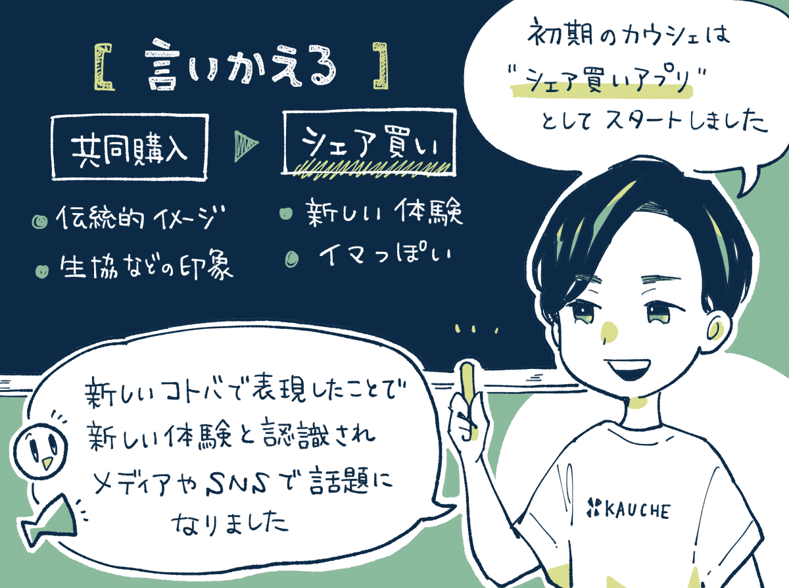

でも、この「シェア買い」には限界も見えてきていて、2023年に方向転換をすることになります。これが最大のターニングポイントになりました。

この「シェア買い」というのは、もともとは中国で爆発的に広がったECアプリのモデルでしたが、日本とは前提条件に違いがありました。

中国の地方都市って、**より農村に近いような雰囲気があります。親戚の親戚が近くに住んでいたり、日本よりも「親密圏」がもっと大きいわけです。**

なので、中国ではすごく広がったけど、日本では兄弟までで拡散が止まってしまうなど、ある程度までは成長したものの限界も見えていました。

結果的にここはストップして、別の方向性に切り替えることになります。僕もこの意思決定をするときは、最初は怖かったですしドキドキしました。

株主の皆さんに相談すると、当然最初は「どうでしょうね」という反応でしたし、社員や出品してくれている事業者さんの反応も不安でした。

でも、「ここまで考えて検証もやり切った。この方向性しかない」と考えて、グッと決断することにしたんです。

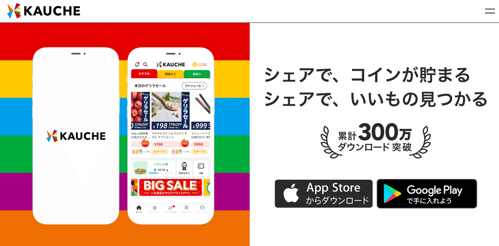

コンセプト変更後のサイト

### 新しいカウシェのコンセプトは「どこが変わった」のでしょうか？

門奈 ：  
何が変わったかというと、**これまでは「買い物の瞬間」に注目していましたが、買い物の前後にも「面白さや楽しさ」を提供するようにしました。**

お客様のインサイトを観察するうちに、「発見と交流があるEC」に手応えを感じて、そこに向けて機能を投下すると数字が伸びていったんです。

**これは「非目的な買い物の市場」だと捉えています。近くのコンビニやスーパーというよりは、ドン・キホーテでの買い物の体験に近い**です。

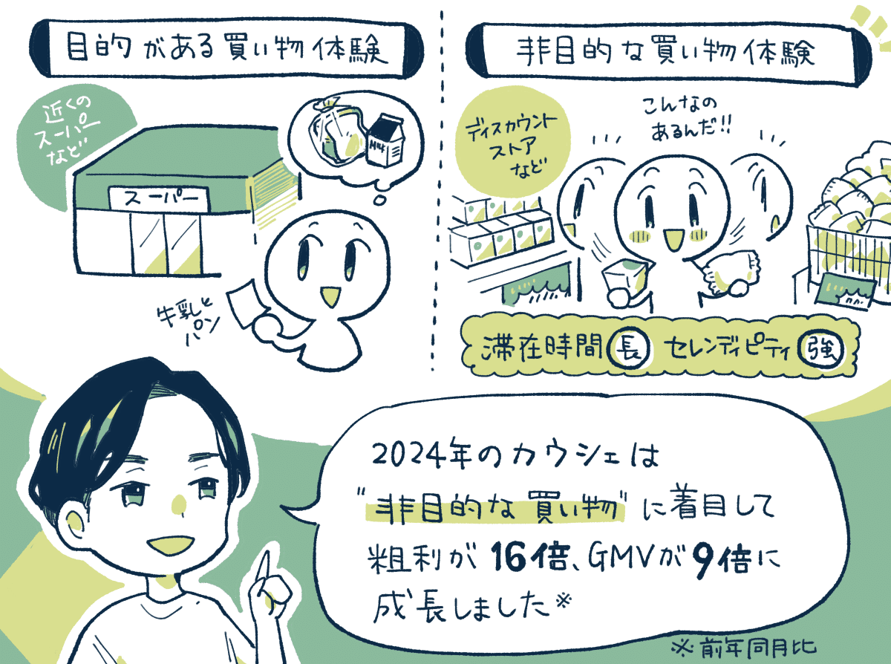

ドン・キホーテとかって「目的がはっきりしないまま」に買い物に行く方も多いと思います。**でも楽しい売り場を回って、いろいろな商品を見て手に取っていくうちに、いつの間にか商品を買っている。**

カウシェもそれと同様で、少し変わった商品があり、おトクに買える感覚があり、誰かと一緒にも楽しめるようになっています。

このような、**「非目的な買い物体験」に着目していて、買い物の前後にも「交流と発見」を軸にした楽しさを提供しています。**

例えば、買い物の前には「カウシェファーム」というデジタル農園ゲームがあって、デジタルの作物を育てると「本当のお米や野菜」が自宅に届きます。

ゲームの中で使える「肥料や水」は、カウシェで買い物をしたり商品を見たりするともらえるので、お買い物とも連動しています。

買い物の後には「みんなの投稿」という口コミ投稿機能があり、自分の口コミから誰かが購入すると、少しリワードが入るようにもなっています。

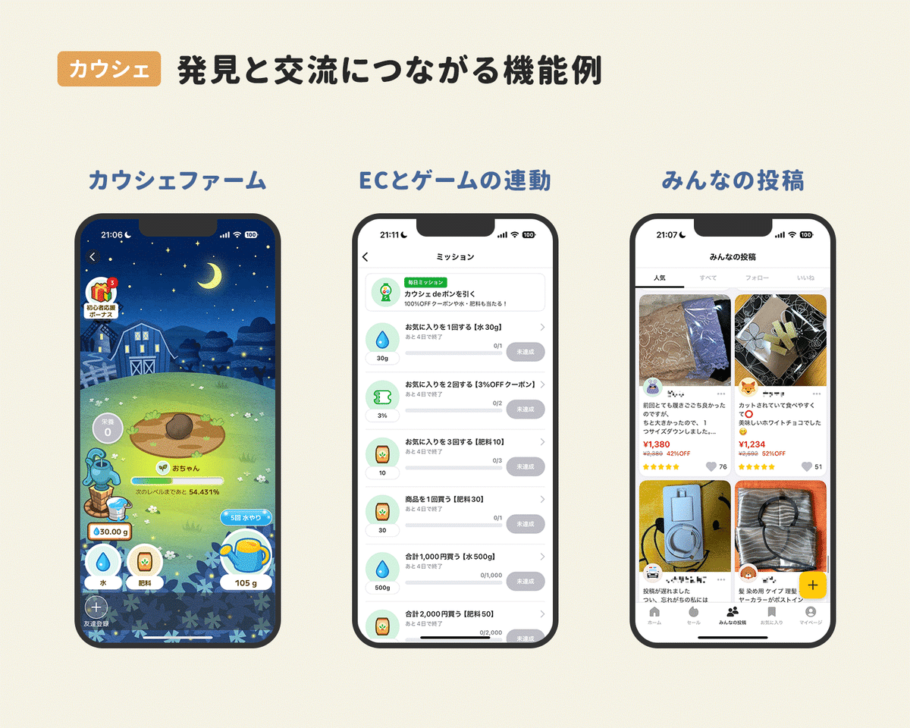

このような工夫で「ECなのに毎日来てしまう」体験を提供しました。

すると、アクティブユーザーの1日の滞在時間は6倍に成長し、買い物の頻度も上がっていき、事業が毎月20～30％成長していきました。

平均的なアクティブユーザーは、1日に約30分滞在し、1日に3〜4回起動し、月に4回買い物をしてくれます。9割の購入はアプリ内検索を経由しません。

結果として、前年同月比では売上総利益（粗利）が16倍、GMVが9倍、累計300万ダウンロードに到達という成果につながりました。

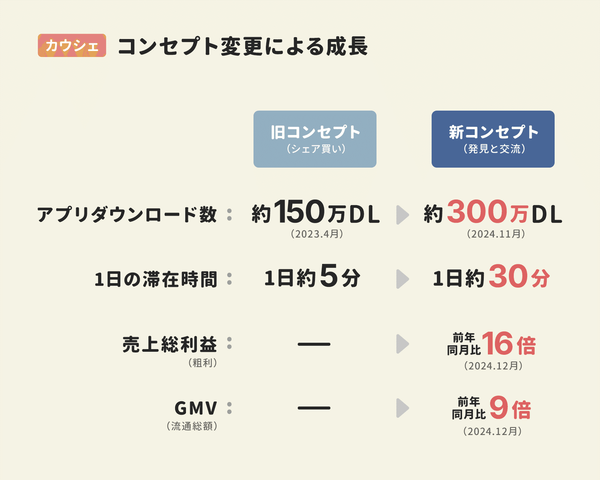

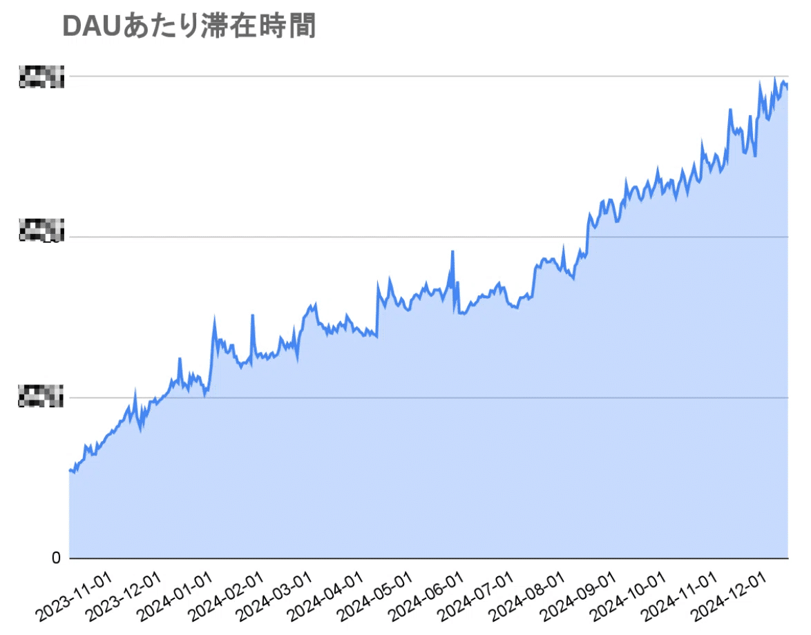

## 変化に強いチームを作るための3つの工夫。

### 変化を促進する仕組み①：社内のモメンタムを高める。

門奈 ：  
ひとつは「モメンタム」を高めることを意識しました。これは組織としての勢いや盛り上がり感のようなものです。

よくあるのは**「成果が出て勢いがついた」ですが、今回はその逆なんです。勢いを保てたからこそ「変化して成果に辿り着けた」なのかなと。**

困難を乗り越える過程においては「変化を楽しむ力」そのものが、大転換を起こすと考えているんですね。

例えば、社内のSlackには「モメンタムチャンネル」があって、社内で僕たちが起こした「変化の波」をみんなで共有しています。

これは**「変化を後押しして応援する文化」を醸成します。勇気を持って挑戦したメンバーを1人にさせずにみんなで応援します。**

社内の挑戦やお祝いごとを、モメンタム局を中心に「賞賛して盛り上げる」これをやり続けたことで、チームの熱量と一体感が向上しました。

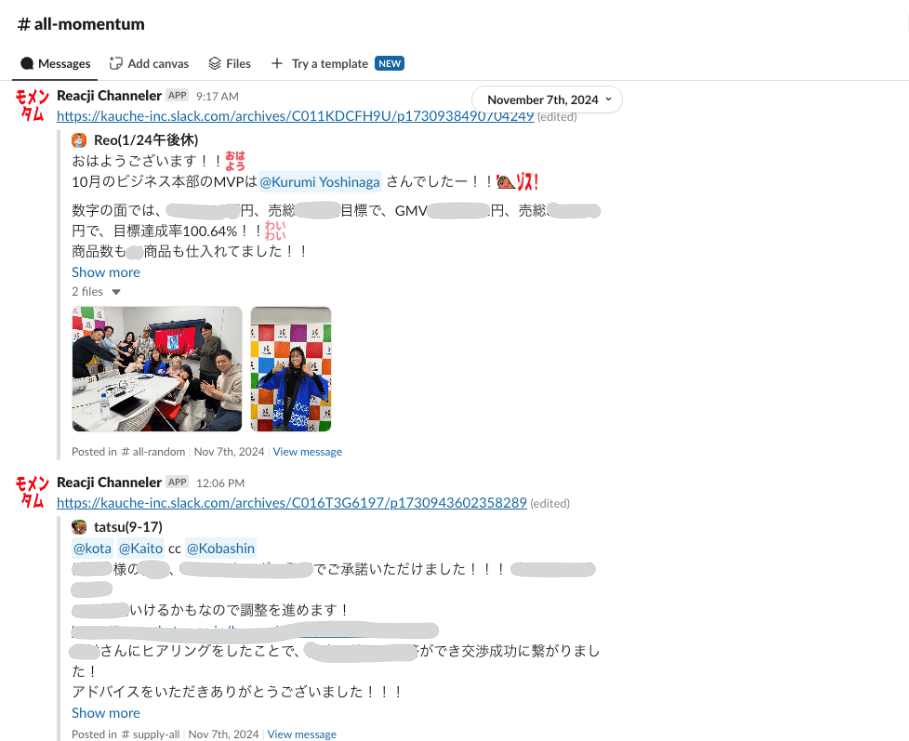

モメンタムチャンネルの様子。

僕自身も「モメンタム局長」として、先頭に立って法被を着て盛り上げたりモメンタムを高めるための主演俳優を務めています。

以前はもっと落ち着いた雰囲気の組織でしたが、最近は部活っぽく全国大会を目指してます、みたいな感じになって雰囲気も良くなりましたね。

モメンタム局を作ってから、Slackのパブリックチャンネルの投稿数は30％増加していて、スタンプのリアクション数も3倍に増加しています。

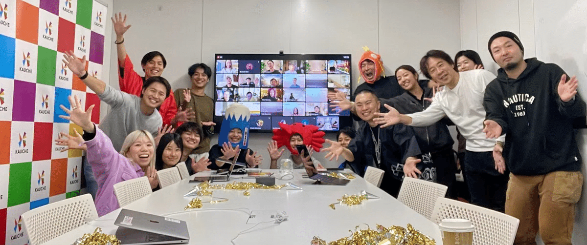

### 変化を促進する仕組み②：未来を可視化する指標を見る。

前本：  
プロダクト側で見るようにして良かったのは、「Carrying Capacity」というアクティブユーザーの最大保持数を予測する指標です。

これは簡単にいうと**「1日の新規流入数」と「1日の離脱率」を見れば、そのプロダクトが保持できるDAUが大まかに定義できる**というものです。

計算式としては、「1日あたりの新規流入のユーザー数 ÷ 1日あたりのユーザーの離脱率」で算出できます。

これを見ると「将来の限界値」がわかります。「変化しないと」という危機感も生まれますし、小さな改善がもたらす長期の効果も可視化できます。

施策の優先順位として「離脱率の改善」にフォーカスする理由も非常にクリアになりました。

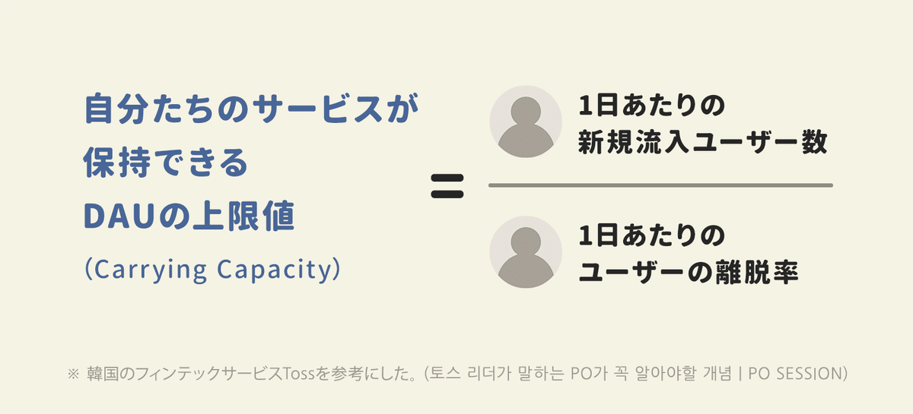

例えば、毎日5,000人の方が入ってくる環境で1％の方が離脱してしまうと、DAUの上限値って50万人になるわけですね。

50万人の1％の離脱 = 5,000人の離脱であり、そのタイミングで5,000人の新規流入と均衡するので、プラマイ0になって50万人に落ち着きます。

一時的なキャンペーンや広告でユーザー数を伸ばしても、新規流入数と離脱率によって最後は「一定の水準」に落ち着くわけですね。

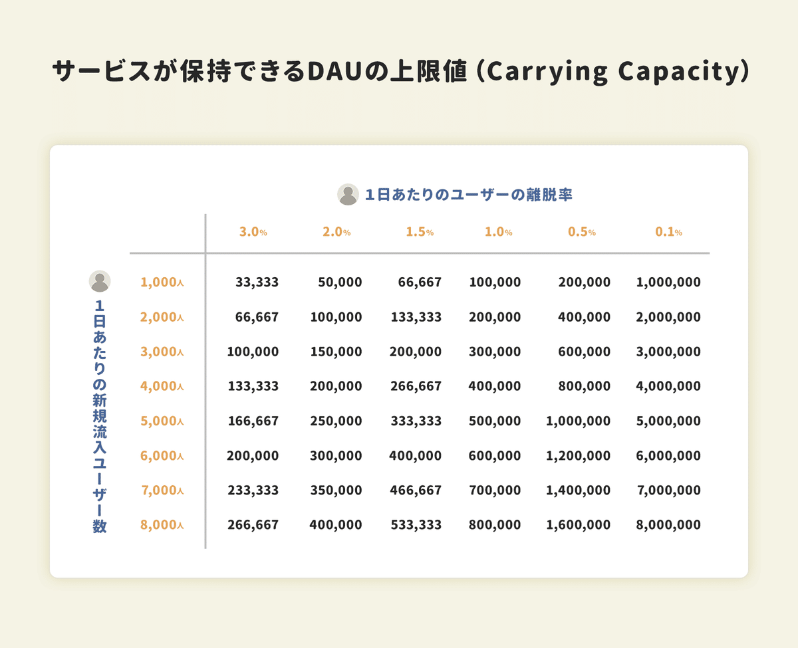

離脱率を1%改善する効果ってわかりにくいですけど、本当に離脱率が1%変わると保持できるDAUの量がすさまじく変わるんですよ。

この指標を見るようになって、なぜこんな簡単なことに今まで気づかなかったのかと思うくらい、経営的にはインパクトがありましたね。

例えば、離脱率の改善を前提としながら、このタイミングでこの高さまで行きたいなら流入数を上げるために、このタイミングで広告宣伝費に投資をしよう、みたいに判断できるようになります。

この「Carrying Capacity」は、もともと生態学の分野で「特定の環境下で維持できる、生物種の最大個体数」について表現した用語です。

最大個体数が100であれば、150まで個体が増えたとしても、エサや水などの資源が決まっているので、100まで戻ってしまうといったニュアンスです。

韓国のTossという有名なフィンテックサービスが、この指標を見ているという話を参考にして、カウシェでも見るようになりました。

### 変化を促進する仕組み③：ペルソナの行動の「変化幅」を考える。

佐藤：  
カウシェでは「宮崎さん」と呼ばれるペルソナを中心に置いて、開発の意思決定などを行っています。

どうしたら「宮崎さんの行動変容」が強く大きく起きるかを意識しながら、機能開発の優先度をつけたりもしていますね。

宮崎さんに対する「解像度を高める」という意味でも、ユーザーさんに集まってもらって座談会やインタビューを行っています。

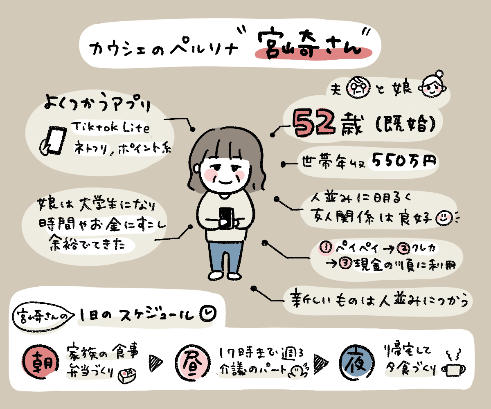

## 成長につながった「2つの成功施策」

### 成功施策①：インフルエンサーの「PR投稿」のクリエイティブを買い取って広告配信したら獲得効率が2倍に。

前本：  
カウシェで効果があったのは、**インフルエンサーの方にプロモーションとして投稿してもらった動画を買い取らせていただき、運用型広告で配信するようにしたことです。**

その動画をもとに「体験型の動画広告」に切り替えたことで、クリック率が大幅に上がって、配信ボリュームを大幅に伸ばすことができました。

成果としては、**これまでの自社作成の動画クリエイティブと比較すると、1インストールあたりの獲得効率は2倍以上になっています。**

これまでは、運用型の広告は各プラットフォームに最適化した動画を自社でつくって配信していたのですが、今はほぼこの方法になっています。

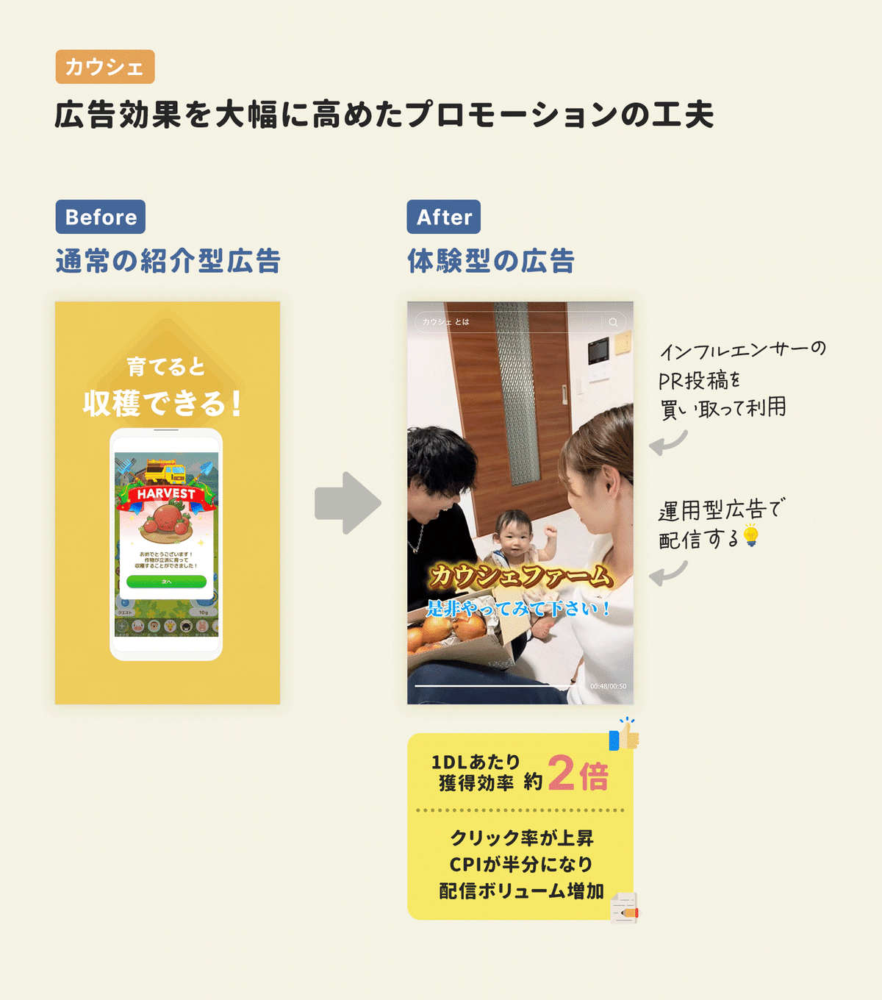

TikTokなどの「ファミリー系インフルエンサー」にPR投稿を依頼、その動画を買い取って広告配信するケースが多いそう。

インフルエンサーマーケティングは、「普段のその方の投稿フォーマット」にそって投稿いただくのが、基本は一番伸びやすいと思います。

**どのインフルエンサーへ依頼するかは「エンゲージメント指標」を見ます。その人が「発信する情報」にファンの方が興味を持っているかどうか**。

例えば、**PR投稿なのに「今日もかわいいですね」「お洋服どこのですか？」といったコメントばかりだと、PRの内容に関心が向いていません。**

そのため、動画の内容に対してコメントがついているか、過去のPR動画でその方の発言からコンバージョンにつながっていそうかなどを見ます。

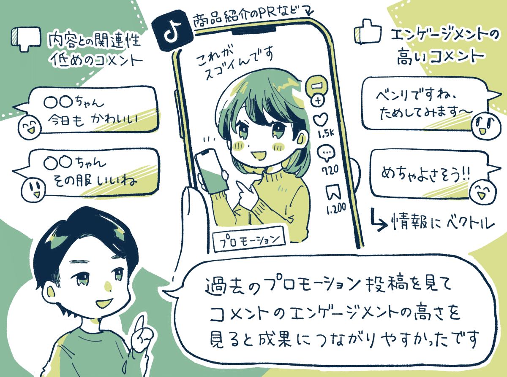

### 成功施策②：ホームのレコメンドを改善したら売上が19％向上。

佐藤：  
ホームのレコメンドのスコアリングを2ヶ月で23回調整すると、ここからの売上が19％伸びたという施策があります。

例えば、カウシェ内の「セールを考慮する」という要素を強くすると、よりおトク感な商品を発見しやすくなり、改善幅が大きめに出ましたね。

また基本的には、「単価・クリック率・購入率」などのバランス調整がうまくいったときに改善幅が大きくなりました。

-----

【取材協力】  
株式会社カウシェ：<https://about.kauche.com/>   
カウシェ：<https://kauche.com/>   
株式会社カウシェ 門奈 剣平さん、前本 航太さん、佐藤 俊輔さん、広報の原田 七穂さん

【告知】カウシェさんでは各職種で採用中。エンジニア、デザイナー、PdMなどを募集しているそう。ご興味ある方は下記サイトよりどうぞ。

[**株式会社カウシェ**
*株式会社カウシェ です。| HRMOS*
*hrmos.co*](https://hrmos.co/pages/kauche/jobs)

> ※ 以降は、＋αの事例を5つほど『ここだけの話』として、note購読者向けにまとめています。カゴ落ち率を改善したパーソナライズ施策、初回限定商品の反応率を高めた工夫、定着率の改善策、などご興味あればご覧ください。

  

ダウンロード

 

copy

## ここから先は

1,662字
/
4画像

%22%20d%3D%22M-100-100h300v300h-300z%22%2F%3E%3C%2Fsvg%3E)

アプリやプロダクトの成功事例が学べるマガジンです。プロダクトの売上やユーザー数を伸ばしたい人にオススメです。成長プロダクトのインタビュー、効果のあったマーケティング施策、事例やデータなどが中心（月に7記事ほど）多くの過去記事も5年ほど遡って読めます。クレカ決済だと初月無料なのでお試しでもぜひ。

### [月刊アプリマーケティング](/m/mc375c9b46464)

¥2,000 / 月  
初月無料

プロダクト運営について学べるマガジンです。アプリやプロダクトの売上やユーザー数を伸ばしたい人にオススメです。月に7記事ほどお届けします。

購読手続きへ

[ログイン](https://note.com/cd/login?redirect_to=https%3A%2F%2Fmarkelabo.com%2Fn%2Fn34ba8d32f56b)

   

57

[%22%20d%3D%22M-100-100h300v300h-300z%22%2F%3E%3C%2Fsvg%3E)](/)

[アプリマーケティング研究所](/)

フォロー

プロダクトの成功事例を発信しているメディアです。2013年から約10年運営しています。取材相談はツイッターDM（@appmarkelabo）かメールにてどうぞ！info@appmarketinglabo.net