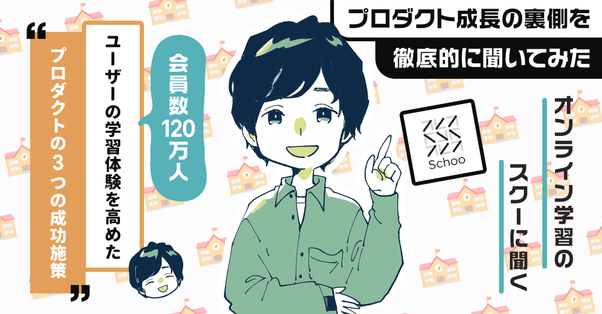  

# 売上高28億円、累計会員120万人のスクーが語る「ユーザーの学習体験」を高めることに成功した3つの施策と、マネタイズの方法は「お客様の声」に従ったら成功した話。

74

[%22%20d%3D%22M-100-100h300v300h-300z%22%2F%3E%3C%2Fsvg%3E)](/)

[アプリマーケティング研究所](/)

2025年2月25日 11:30

¥2,000/月

Schooさんを取材しました。

株式会社Schoo 代表取締役社長 CEO 森 健志郎さん、デザイン部門責任者 井上 誠さん

### ⸺「Schoo」について教えてください。

森：  
2012年にサービス開始したオンライン動画学習サービスです。生放送の授業と9,000本以上の録画授業で学びを提供しています。

**会員数としては累計120万人。2024年9月期の売上高としては約28億円で、通期黒字化に到達しています。**

売上の90％以上を占めるのは「Schoo for Business」という法人向けのプランで、約2,500社にアクティブにご利用いただいています。

創業時から「世の中から卒業をなくす」というミッションを掲げています。

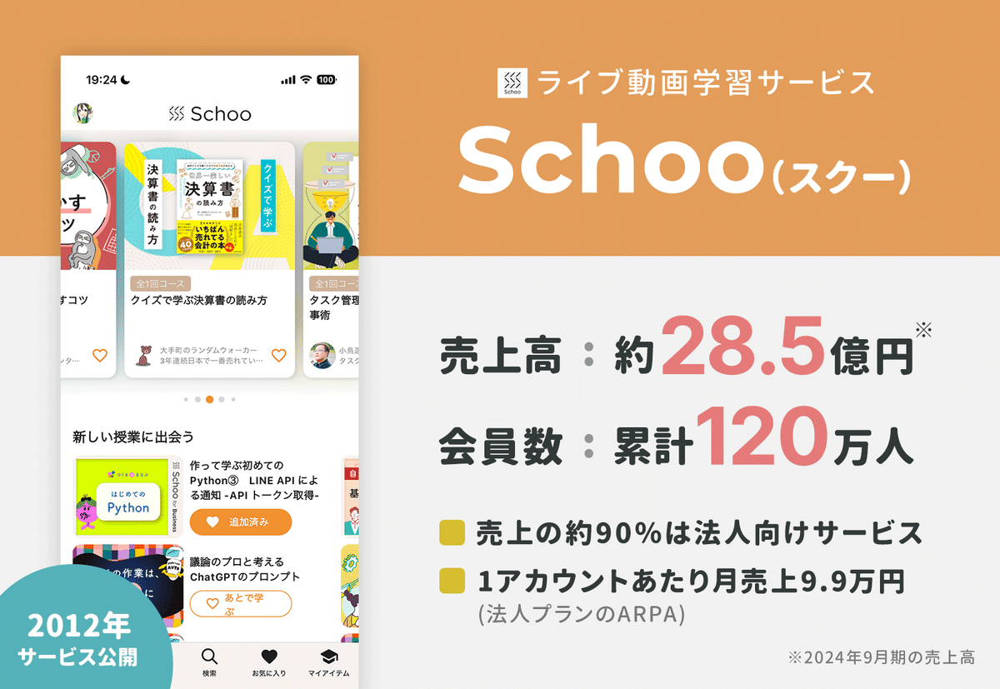

### ⸺Schooはどのように誕生したのでしょう？

森：  
会社員時代に受けたeラーニングが「つまらなかった」という原体験から、Schooという教育サービスを作ろうと起業しました。

設計時に意識したのは、**「生配信や動画 × コメント」という要素で、これは教育サービスの体験としてすごく可能性があるなと考えていました。**

例えば、ニコニコ動画って「ただの猫の動画」であっても、コメントによる双方向的な価値によって、動画の面白さが何倍にもなりますよね。

これを、教育や学びのフォーマットに落とし込み、実名性のサービスにしてコミュニティの健全性を保てたら、面白くないものであっても面白いものに変えられるパワーが生まれるのではないか。

学びが億劫だったり、面倒くさがりな人でも、面白く学べるサービスが提供できると考えたんですね。

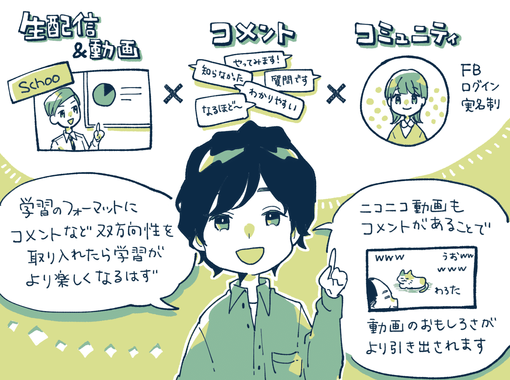

### ⸺初期に「どのようにユーザーを集めたのか」をぜひ教えてください。

森：  
Schooが最初に軌道に乗れたのは、有名な起業家の方たちが「先生」として登壇してくれて、ユーザーさんが集まるサイクルを作れたからでした。

**起業家の方たちと「面識」があったわけではなくて。SNSのDMとか会社のメールアドレスに企画書を送付して、一人一人お願いしていましたね。**

断られたこと、返信がなかったこと、当然たくさんあります。でも、その中で「面白いね、協力するよ！」と返信してくれた方がいました。

当時の社名でいうと、ビズリーチの南さん。ヤフーの川邊さん。小澤隆生さん、けんすうさん、カヤックの柳澤さん、家入一真さんなどです。

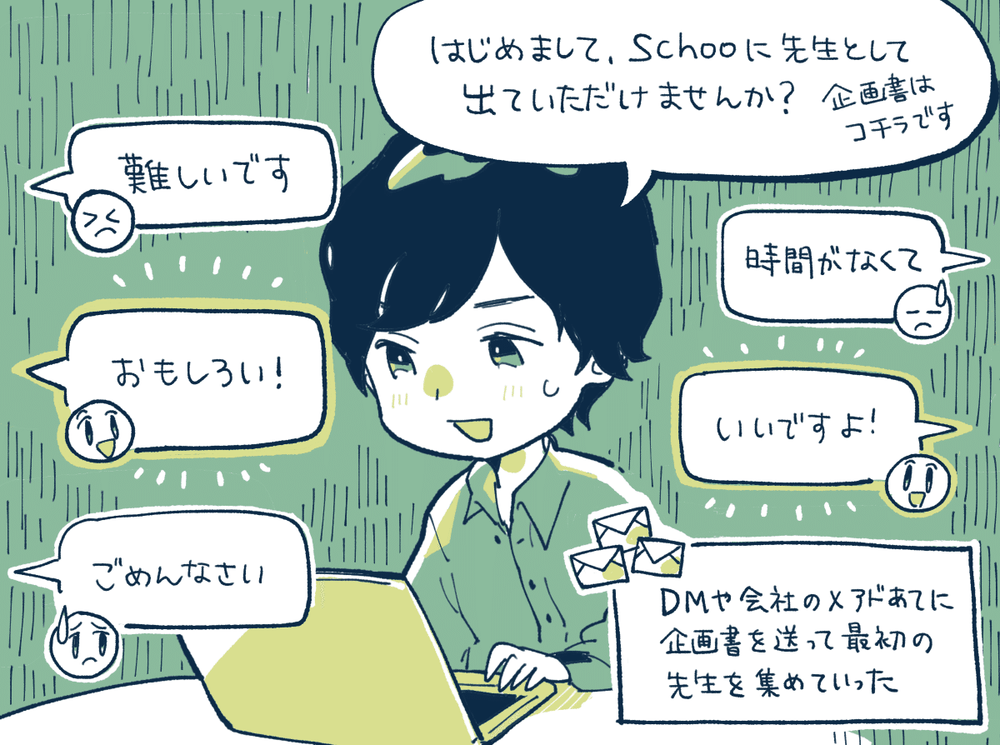

最初の約2年間は社長が主に「出演の交渉」をした。

それでリリースに向けて、2011年の冬に「こんな人が授業をやってくれます」というティザーサイトを出して、2012年にSchooをリリースしました。

初回の授業からSNSで話題にしてもらえて、数千人が見に来てくれて、すぐに1万人の会員が集まりました。これにはものすごく興奮しました。

何も持っていない僕らが作ったサービスが、SNSで話題になってたくさんの人が見に来てくれた。インターネットってすごいなと。

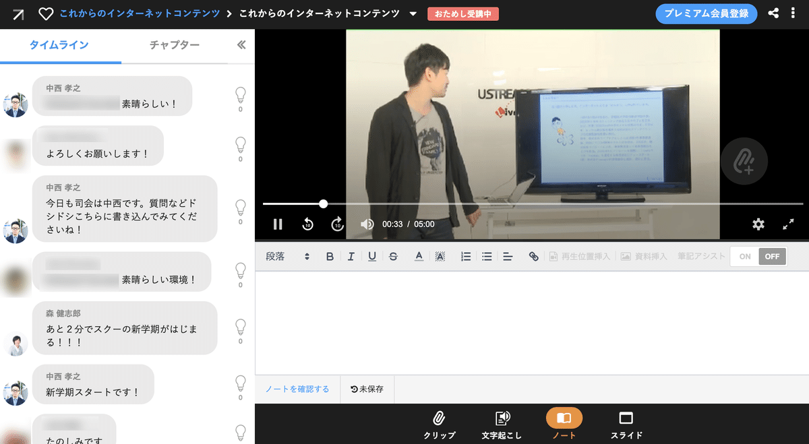

Schooの初期の授業（けんすうさん）

はじめに有名な起業家が出てくれたことで、「○○さんが出ているなら！」とその後の先生との交渉もスムーズになりました。

それによって、**コンテンツを先に集めるべきか、ユーザーを集めるべきかという、いわゆる「ニワトリ卵問題」を解決できたんですよ。**これは本当にたくさんの方の愛とご協力のおかげです。

新しい先生に出てもらえると、その授業から新規の生徒が増えて、一部の人がアーカイブに月額課金する、こうしたサイクルができました。

あと、個人向けから始めたのは、従業員が「面白い」と思うコンテンツじゃないと定着しないから、まずは個人から始めたという側面もあります。

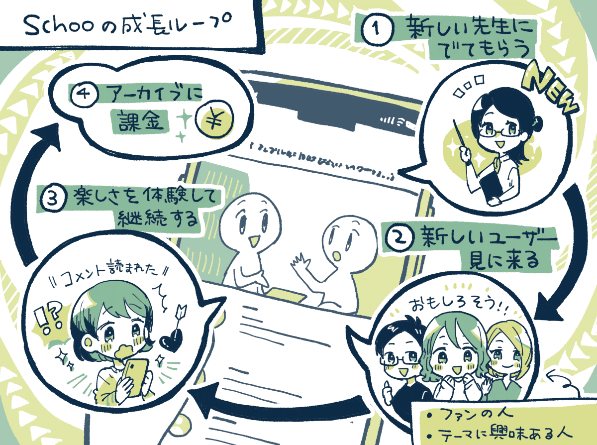

## Schooの「学習の体験」を改善した3つの施策。

### ⸺当初はどんなことを意識して「ユーザー体験」を磨きましたか？

森：  
僕らが初期から**コアな指標としてめちゃくちゃ追っていたのは、生放送の授業での「コメントの投稿率や投稿数」でした。**

なぜなら、Schooの一番セクシーな体験って、生放送のコメントが先生に読まれたり、誰かのコメントに対して「面白い」と思ったりする、双方向の体験の中にあるからなんですよ。

実際、**コメントを投稿してくれた人は「2回目以降の継続率」が高くなる、質問が先生に読まれた人は「大幅に継続率が高まる」**といった関連性などもデータからハッキリと見えていました。

生放送の参加者は伸びていたのですが、コメント投稿率が伸びていないことが当初の課題だったので、様々な工夫をして伸ばしていきました。

### ● 体験を高めた工夫①：「着席ボタンで心理的なハードルを下げる」

森：  
コメント率を上げるためには、静かに授業を見ている生徒に「いかに発言してもらえるか」が大切です。これは、心理的なハードルが壁になります。

成功した工夫のひとつは、**生放送授業の「着席ボタン」でした。このボタンを押すと「○○さんが着席しました」とタイムラインに流れます。**

この仕組みによって、**最初の一歩を踏み出してもらい、心理的なハードルを下げられたことで、コメントの投稿率が約3倍になりました。**

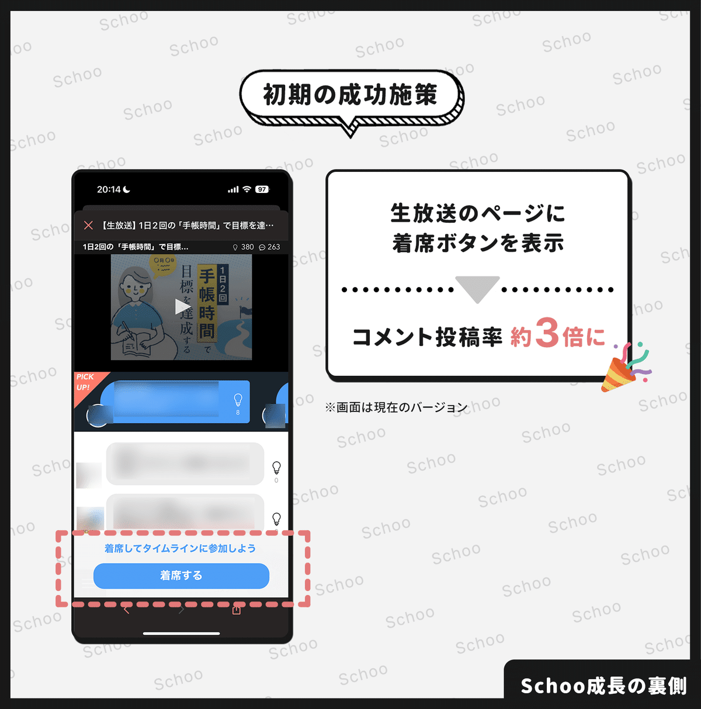

ライブなどでも、後方の人にも一回声を出してもらえると、会場全体が声を出すようになり「一体感」が生まれますよね。これに似ているのかなと。

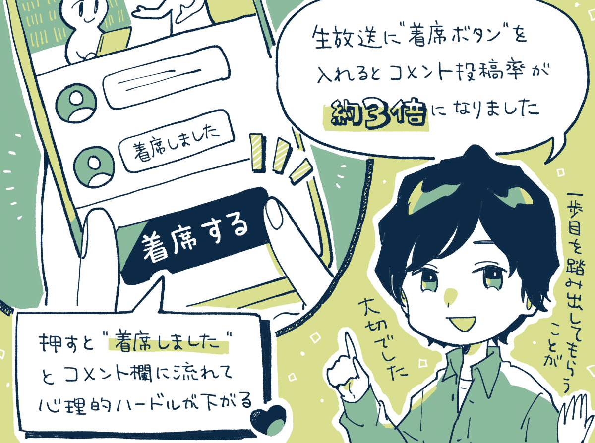

### ● 体験を高めた工夫②：「コメントが見られている感を高める」

森：  
コメントの投稿率を上げるには、先生たちが「コメントを見ていますよ」と伝えることも大切です。

うまくいった工夫としては、**先生の手元にiPadなどを置いて、コメントを流しながらiPadの後ろに「先生がコメントを読んでます」のような紙を貼ったことでした。**これは単純ですが、すごく効果がありましたね。

そこから発展して、スタジオ現地にコメントを流すシステムも作りました。**現地に自分のコメントが流れていたら、読まれているとわかりますし、自分もここに参加しているという没入感が生まれます。**

当時は今ほど「生配信のコメントが見られている」という感覚は一般的ではなかったので、そこの体験を理解してもらえるようにしました。

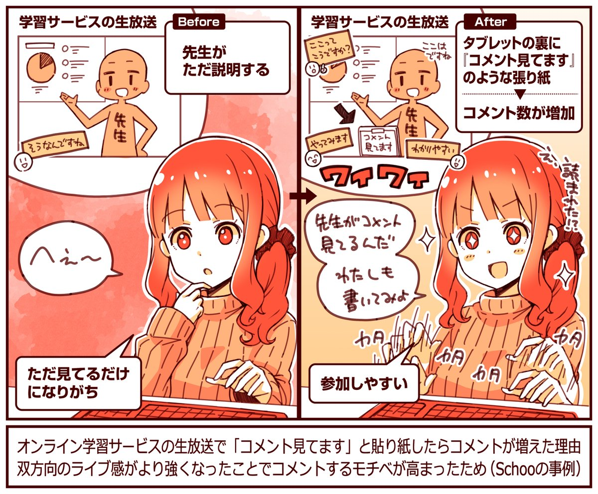

先生への質問数が伸びて、生徒の満足度も向上した。

### ● 体験を高めた工夫③：「注目度を可視化したら授業の品質向上」

森：  
先生に向けて「生徒の期待値」を事前に可視化したことも、授業の品質などに影響を与えました。

具体的には、**「受けたいボタン」をつけて注目度を可視化したところ、授業のクオリティの向上につながったんですよ。**

先生からすると「1,000人に期待されている！」とわかったほうが、当日までに資料をより良くしようとか、頑張ろうとなりやすいのだと思います。

実際に、アンケートベースで「生徒の満足度」をモニタリングすることで、授業のクオリティが向上していることもわかりました。

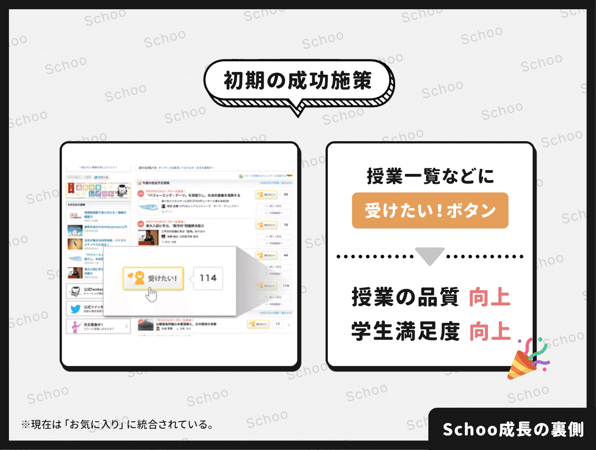

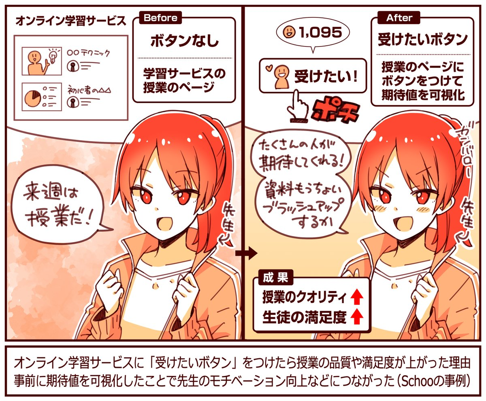

### ⸺2015年にスタートした「法人プラン」が、どのようにはじまったのかぜひ聞かせてください。

森：  
今では、法人プランの売上が90%を超えていますが、法人向けに力を入れようとした2015年当時は、投資家からも社内からも反対されていました。

例えば**「なぜやるの？」「競合もいっぱいる」「もっとtoCが伸びてから」という意見が出ましたが、僕はニーズがあると実感していました。**

なぜかというと、ユーザーと毎日のように直接話す中で「企業向けのプランがあったら使いたい」という声がめっちゃ多かったからです。

C向けのマネタイズのときも「アーカイブが見たい」という、ユーザーの声に従ったら伸びたんですよ。その成功体験もあったかなと。

それで、当時の社長室にいたメンバーと3人で、ガンガン営業をして「最初の50社」から受注できたことで、法人のニーズを証明できました。

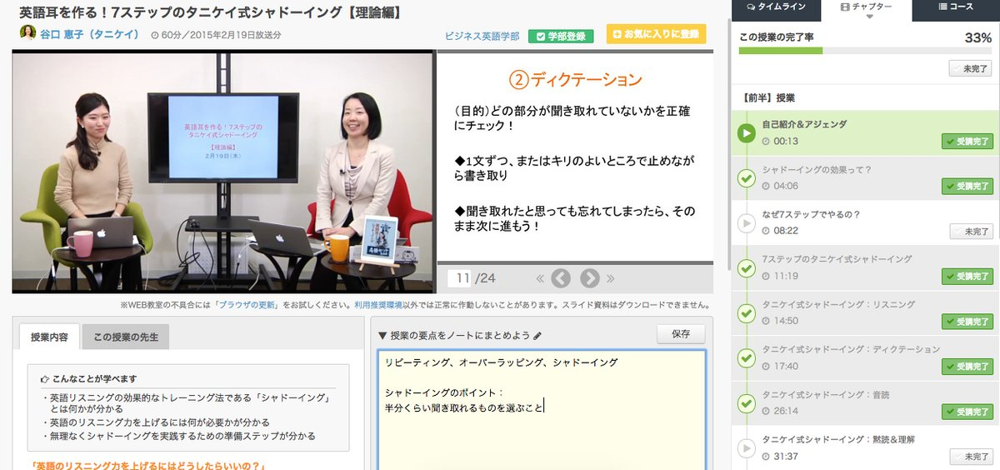

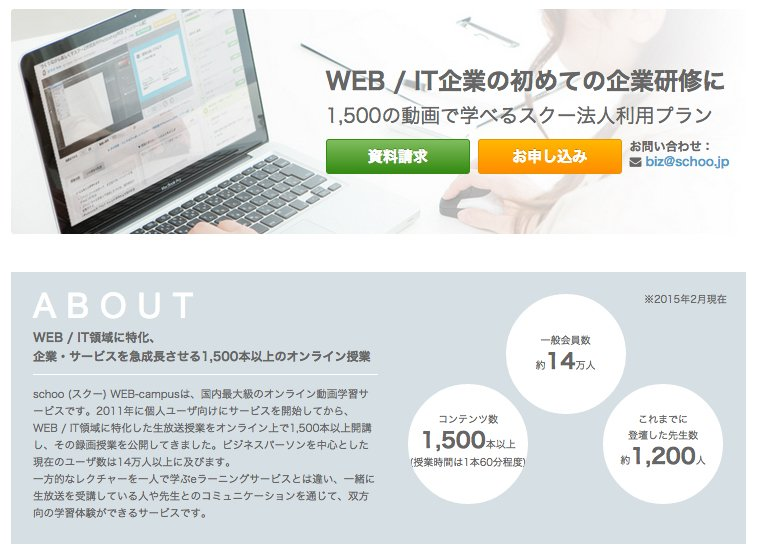

2015年に法人向けプランを開始。

法人プランでは、みんなで視聴できる「集合学習」という機能の発明が生まれたことも大きかったです。

これは、**Schooの過去の授業のアーカイブを、特定の時間と参加者をセットすると、その時間に自動で再生して流せるというもの**です。

そうすると、ニコニコ動画の「非同期型のコメント」のようなイメージで、参加者がチャットをしながら見られるため、研修などにも適しています。

この体験を「みんなで価値」と呼んでいます。動画を見るだけじゃなくて、体験に「みんなで」という奥行きを作ることも大切です。

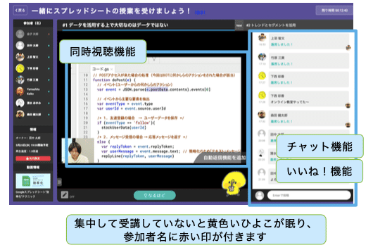

オンライン集合学習機能（2020）

2020年にコロナ禍に入ると、対面研修ができなくなってしまい、研修がオンライン化していきました。

それで多くの会社さんが、オンライン研修を試して「これでも全然良いよね」と気づいた結果、大きくマーケットが拡大していったんです。

またリスキリング文脈の盛り上がりもあって、法人プランの新規のお客様が増えていって、2024年度には通期黒字化に到達しました。

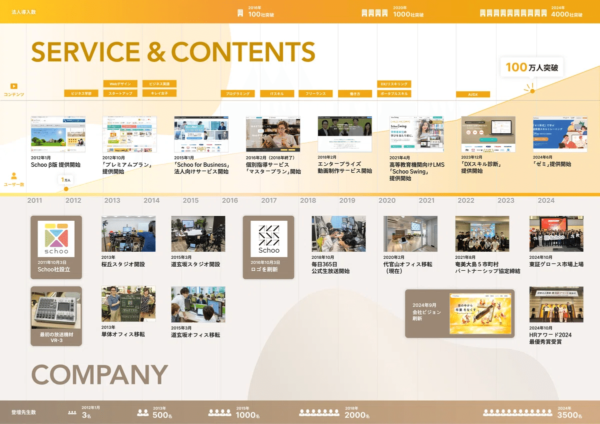

Schooの創業からの年表

## 開発チームに聞く「プロダクトの運営」の話。

### ⸺プロダクトの開発では「どんな指標」を重視していますか？

井上：  
よく見ているのは、**MAU（月間アクティブユーザー）ですね。「授業を月1回以上は視聴した人」をMAUとして定義しています。**

例えば、ログインしても見てくれないのは「見たい授業が見つからない」という状態なので、きちんと視聴までを追っていますね。

ほかに、**データからわかったことは「PCとアプリを並行利用している人」はアクティブな利用率が何割か高いということです。**

通勤時間やスキマ時間にスマホで授業をお気に入りし、あとからPCでじっくり視聴のように、生活スタイルに合わせてデバイスを活用している人は習慣化が進んでいると言えると思います。

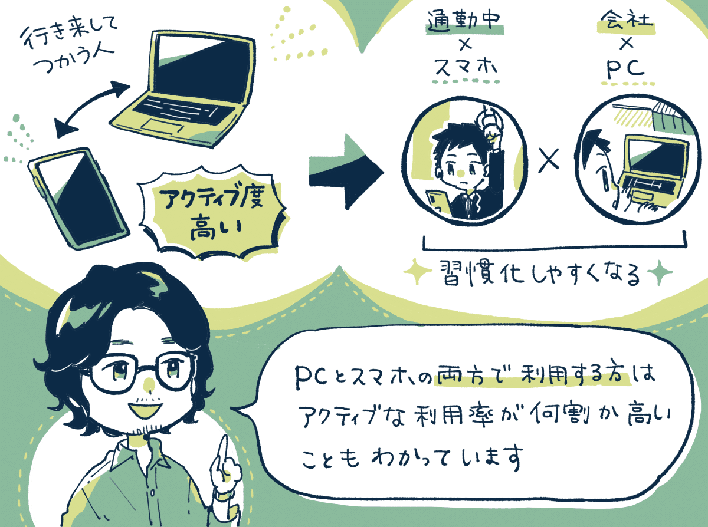

スマホで耳だけで「ながら聞き」するニーズも高いそう。

### ⸺「チームの生産性」を高めた工夫があれば教えてください。

井上：  
開発の生産性を高めるために、「爆弾チケット」と「おつまみチケット」というものを管理しています。

爆弾チケットは、**絶対にいつか直さないと爆発するんだけど、今すぐ改修が必要というわけでもない、という項目を可視化したものです。**

言い換えるなら、重要だけど優先度の低いものです。これは分けて管理しておかないと、みんなの心の中にはあるけど、忘れ去られてしまいます。

もう1つの、おつまみチケットは、そこまで重要ではないけど、今すぐできるものという感じですね。1日あれば開発できるものとか。

これも分けて管理しておくと、手が空いたときにパッと改修できます。例えば「ここの枠線の色を直すと見やすくなるよね」とか。

この2つがあることによって、優先度の判断をそこまでガッツリしなくても改修を進めやすくなりました。

---

【取材協力】  
株式会社Schoo：<https://corp.schoo.jp/>   
Schoo：<https://schoo.jp/>   
株式会社Schoo 森 健志郎さん、井上 誠さん、広報の大金さん、野村さん

【告知】Schooさんでは各職種で採用中。PdMやマーケティング担当など募集中とのこと。ご興味あれば下記サイトからご覧ください。

[**採用情報 - 株式会社 Schoo（スクー）**
*インターネットでの学びや教育を起点とした社会変革に取り組んでいます。*
*corp.schoo.jp*](https://corp.schoo.jp/careers)

> ※ 以降は、＋αの事例を5つほど『ここだけの話』として、note購読者向けにまとめています。アプリストアのレビュー評価を高めた工夫、法人プランの立ち上げ時にデータを軸に開拓した方法、SNSやブログで「口コミ」を書いてもらいやすくする工夫、などご興味あればご覧ください。

  

ダウンロード

 

copy

## ここから先は

2,007字
/
4画像

%22%20d%3D%22M-100-100h300v300h-300z%22%2F%3E%3C%2Fsvg%3E)

アプリやプロダクトの成功事例が学べるマガジンです。プロダクトの売上やユーザー数を伸ばしたい人にオススメです。成長プロダクトのインタビュー、効果のあったマーケティング施策、事例やデータなどが中心（月に7記事ほど）多くの過去記事も5年ほど遡って読めます。クレカ決済だと初月無料なのでお試しでもぜひ。

### [月刊アプリマーケティング](/m/mc375c9b46464)

¥2,000 / 月  
初月無料

プロダクト運営について学べるマガジンです。アプリやプロダクトの売上やユーザー数を伸ばしたい人にオススメです。月に7記事ほどお届けします。

購読手続きへ

[ログイン](https://note.com/cd/login?redirect_to=https%3A%2F%2Fmarkelabo.com%2Fn%2Fnff0da0c7b2c6)

   

74

[%22%20d%3D%22M-100-100h300v300h-300z%22%2F%3E%3C%2Fsvg%3E)](/)

[アプリマーケティング研究所](/)

フォロー

プロダクトの成功事例を発信しているメディアです。2013年から約10年運営しています。取材相談はツイッターDM（@appmarkelabo）かメールにてどうぞ！info@appmarketinglabo.net