  

# ショート動画は「生のリアクション」を入れるとアクションにつながりやすい。ファッションフリマアプリ「digdig」がリアリティを軸にしたSNS戦略で15万DLまで成長した話。

42

[%22%20d%3D%22M-100-100h300v300h-300z%22%2F%3E%3C%2Fsvg%3E)](/)

[アプリマーケティング研究所](/)

2025年2月26日 11:30

¥2,000/月

digdigさんを取材しました。

株式会社FUNEE 代表取締役 楊 承峻さん

### ⸺「digdig」について教えてください。

楊：  
不要になった服を売買できる「ファッションフリマアプリ」です。服好きのZ世代（18歳〜30歳が約80％）を中心に広がっています。

**2024年の1月に正式リリースをしていて、2024年8月に公開したアプリ版は累計15万ダウンロードを突破しています。**

特徴的なのは、服を売るときの「不便さ」を解消しているところです。不要になった服を簡単に納得のいく値段で手放せることにこだわっています。

出品するユーザーは、出品キット（袋）に洋服を詰めて発送して、希望する販売価格を入力するだけで出品できます。

そこから、採寸・撮影・梱包・発送などの業務は全て「digdig」側で行い、洋服を販売するというモデルになっています。

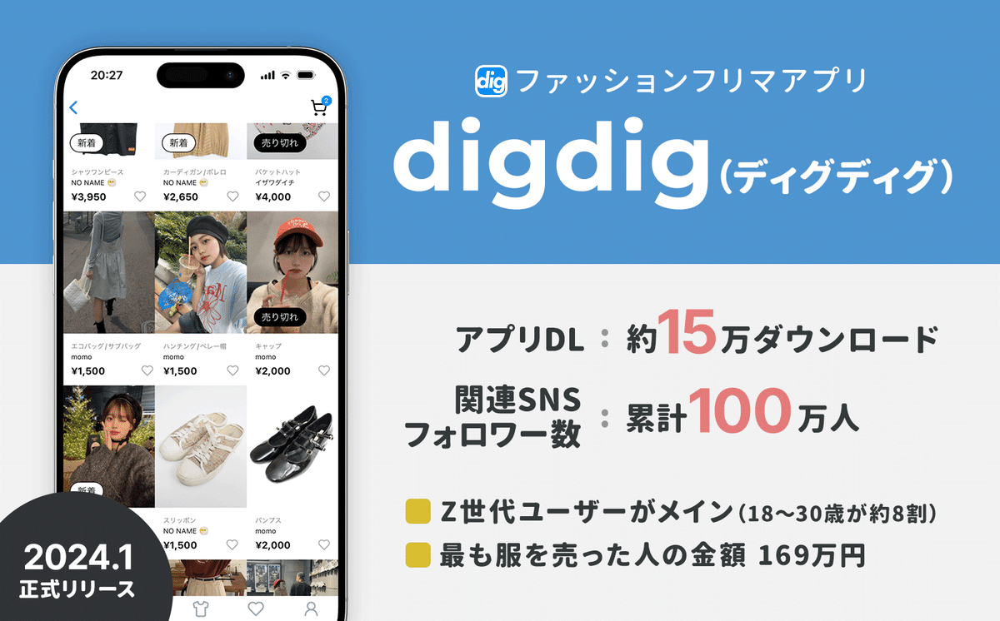

### ⸺digdigはどのように生まれたのでしょうか。

楊：  
もともとは、僕自身やメンバーが服が大好きで、洋服のプラットフォームをつくっていきたいなと考えていました。

その中で**「服好きな人」の課題を考えたときに「自宅にたくさんある古着を数十着まとめてラクに売りたい」というものがあるなと**。

でも、既存のフリマアプリだと、自分で撮影して採寸して梱包してとやると大変という「手間の課題」があって、店舗での買取も数十着で数百円にしかならないこともあるという「報酬的な課題」がある。

これを解決するプロダクトが作れないかと、服を売るときの面倒を解消するフリマアプリというアイディアを考えました。

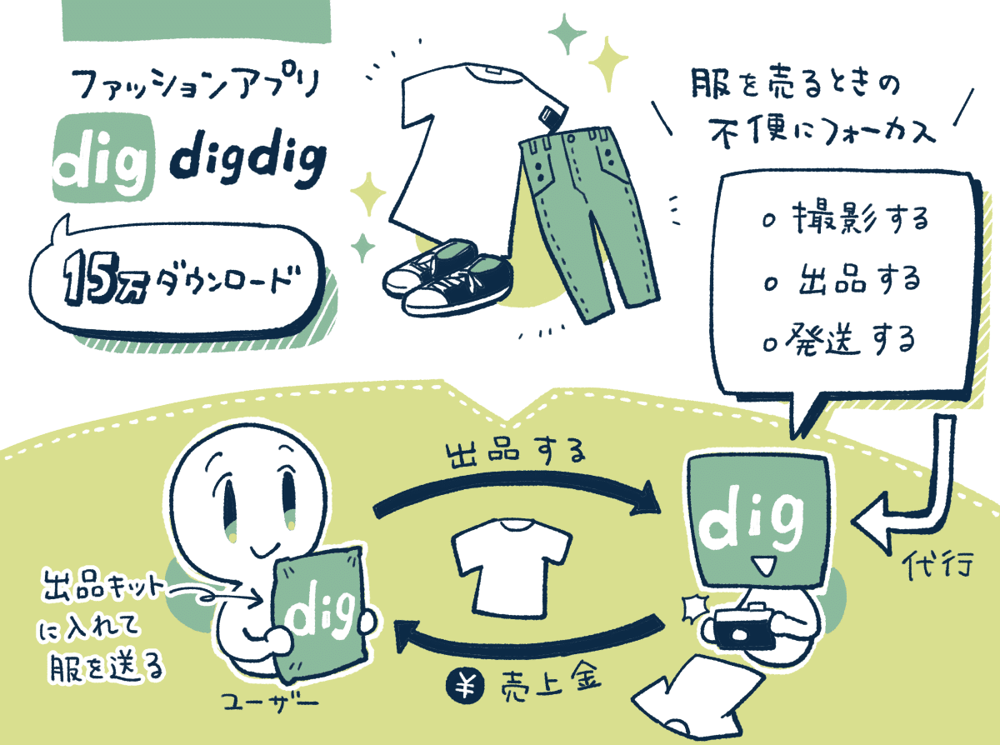

### ⸺はじめはどのような「検証」を行いましたか？

楊：  
ビジネスモデルやオペレーションの検証のために、2023年7月にβ版を公開、最初は出品を「承認制」にして、服好きのインフルエンサーさんに限定して出品してもらう形を取りました。

仮説としては、憧れている「〇〇さんの着ていた服なら自分も着たい」などの「人軸」で服が買われるというニーズも検証したかったのです。

ただ結果としては、**もちろん「人軸」のニーズもなくはなかったのですが、単純に「モノ軸」のほうがニーズが強かったです。**

知るきっかけとしての「人軸」は成立するけど、購入時には多くのユーザーさんは「モノ軸」で買うかどうかを判断されていました。

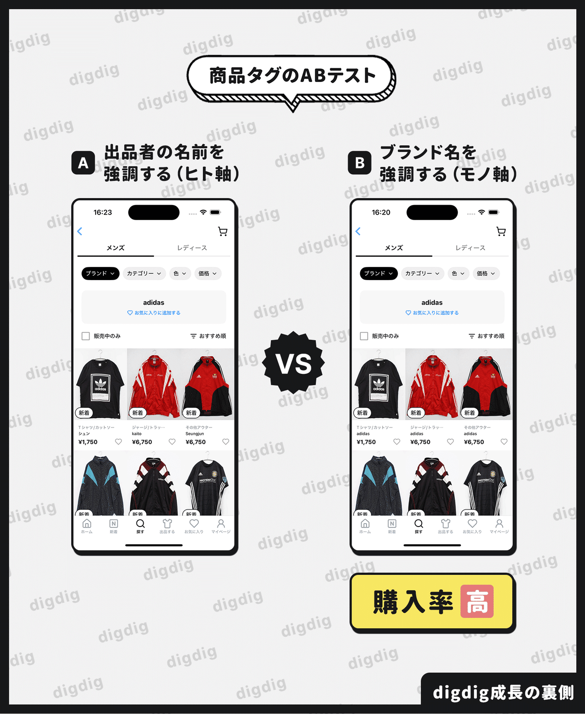

初期のABテスト。商品カテゴリの下に「出品者名」を表示するより「ブランド名」を表示したほうが購入につながった。

あとは、**極端な話「ボロボロな服」ばかり送られきてしまうと、ビジネスとして成立するのは難しくなるだろう**と心配していました。

しかし、結果としてはみなさん非常にしっかりした服を送ってくださって、「これなら成立しそうかも」という手応えが得られました。

最初は「服好きなインフルエンサー」の方に声をかけて、出品側も購入側も「服好きの人」が集まるコミュニティにできたのも良かったのかなと。

僕らのような無名のサービスが、**最初から一定の人に使ってもらえたのは、インフルエンサーさんがファンの方に告知してくれたから**でした。

インフルエンサーの方が、**出品後にSNSで「古着をdigdigに出品したから、みんな見てみてね！」と自然に投稿してくださったんですね。**

ここでSNSを軸に「出品者が増えれば増えるほど、購入者も増える」というサイクルが生まれて、口コミで広がっていきました。

そこから、2024年1月に正式リリースをして、2024年8月から誰でも出品できるように変更、2025年1月に累計15万ダウンロードまで成長しました。

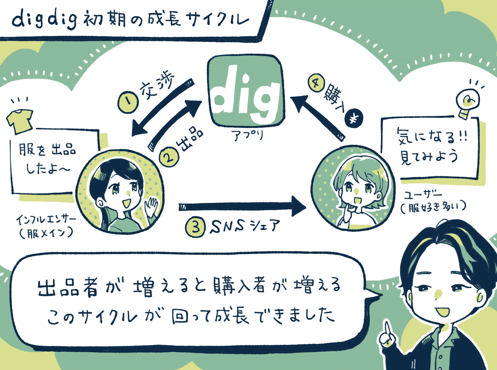

出品者と購入者を「どう集めるか？」という問題を、「服好きのインフルエンサー（出品者）」を集めていけば購入者も自然と集まる、という構図にすることで解決できたという。

### ⸺2024年8月にアプリを公開、半年弱で「15万ダウンロード」に到達していますが、どうユーザーを集めたのでしょうか。

楊：  
広告は基本は出していなくて。SNSが中心なんです。TikTokやインスタからダウンロードが増えています。

僕らのSNS戦略としては、まず誰でも興味が持てるアカウントを作りつつ、サブとしてジャンルを区切ったアカウントを多く運営しています。

強く意識しているのは、**SNSで「接する面を増やす」こと。理由は、接触の面と接触の回数を伸ばすほど、アプリがダウンロードされるからです。**

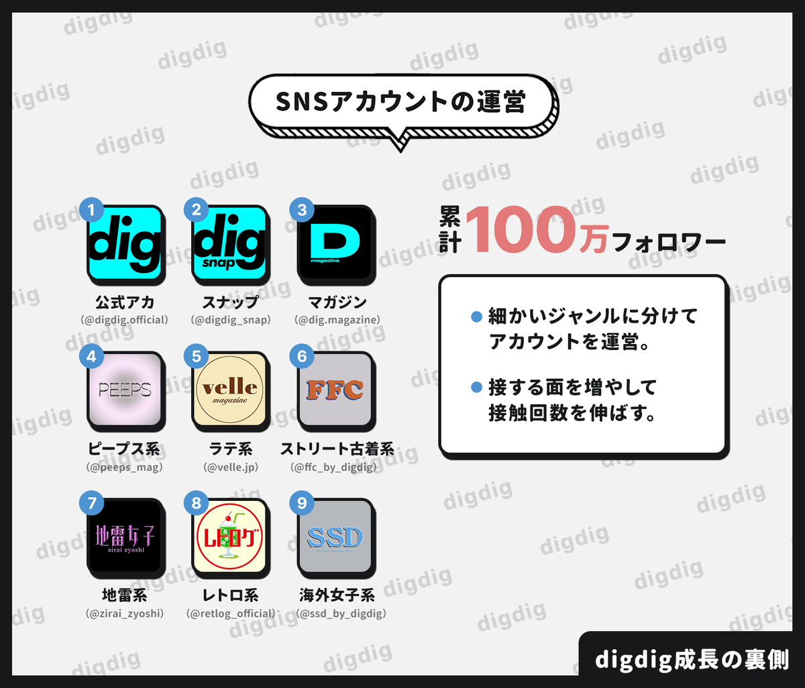

僕らも普段SNSを眺めているときに、1回見かけただけでは「アプリをダウンロードしてみよう！」とまでは、あまりならないと思うんですね。

でも、**何度も見かけると「これ聞いたことある」「これ流行ってるのかな？」と気になってきて、アプリをダウンロードしやすくなります。**

なので、この「接する面」をいかに増やせるかという発想で、アカウントを何個も何個も細かく分けて「接する面」を増やしています。

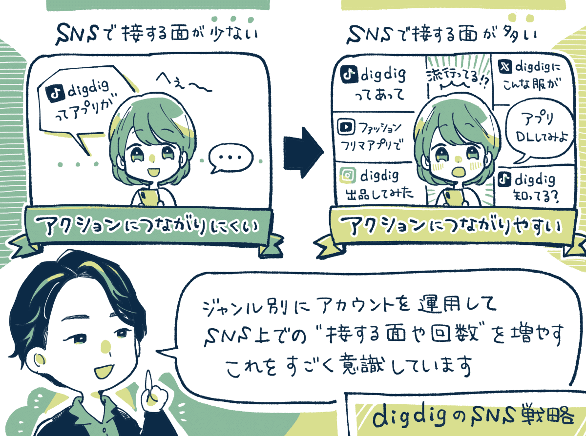

あと最初は「Web版」だけを公開していたのですが、アプリ版を出した瞬間からSNSからの流入が3〜4倍になって、めちゃくちゃ伸びたんですよ。

理由としては、**Z世代にとっては「サービス＝アプリ」という認識を持つ人が多いからだと解釈しています。**

実際に、アプリを出す前には「ぜひ使ってね」と紹介すると、コメント欄で「App Storeで調べても出てこないよ！」とよく言われていました。

### ⸺メインのコンテンツを「スナップ動画」にしたのはなぜですか？

楊：  
これは色々試しました。投稿フォーマットについては、「公式感がある動画」と「公式感がない動画」という2軸に分けて検証していました。

最終的には、**「公式感がない動画」の中のコーデを紹介するスナップ動画が最も反応が良かったので、これに落ち着いていった**感じでしたね。

スナップ動画は、視聴維持率も一番高かったですし、コメントが非常に盛り上がりやすく、アプリのダウンロードにもつながりました。

おそらくですが、「オシャレな人のコーデなら最後まで知りたい！」という心理が働くことで、途中での離脱がすごく少なくなるのかなと。

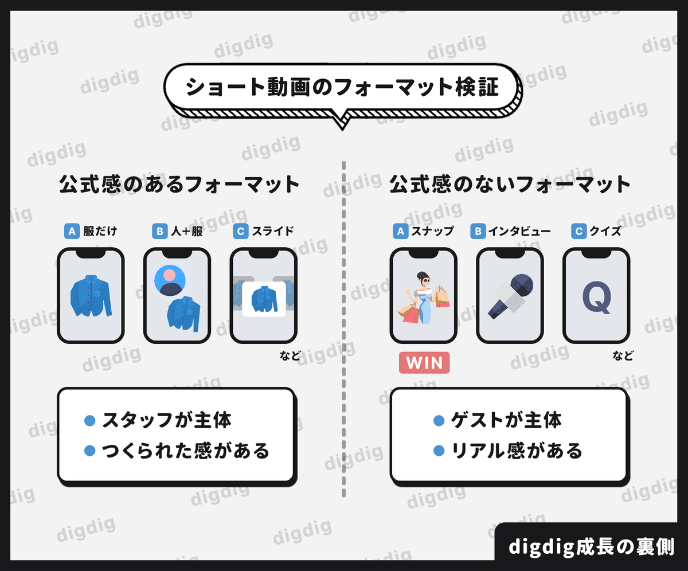

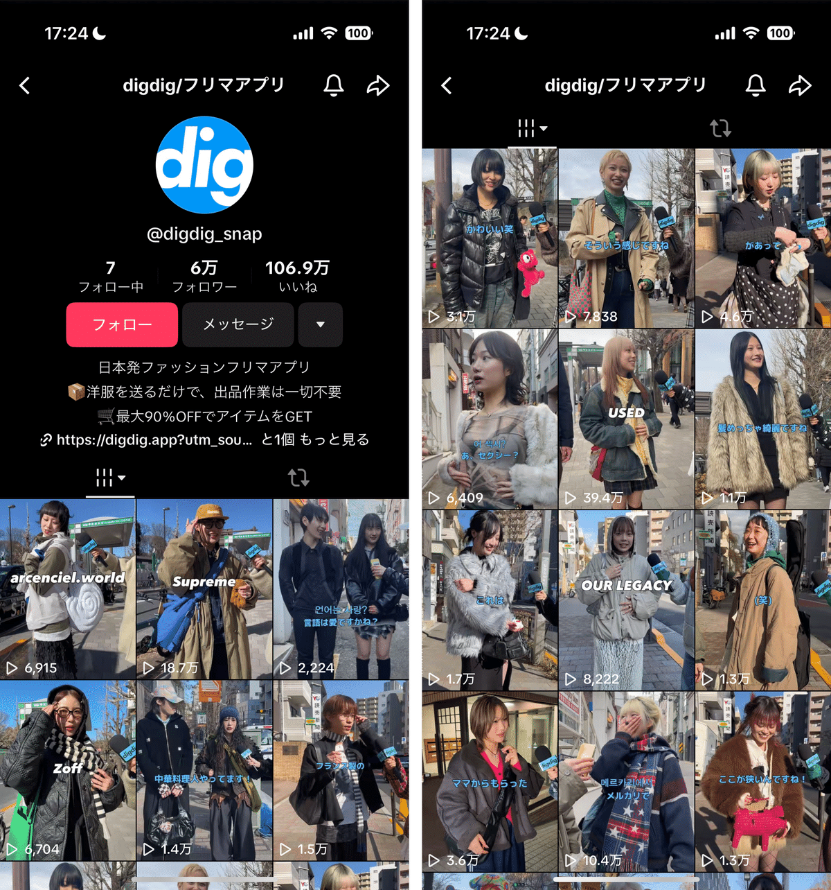

「スナップ動画」をメインにしている。

### ⸺ショート動画から「アプリのダウンロード」に上手くつなげるためには何を意識しますか？

楊：  
ダウンロードしてもらうには「良さそうだ」と思ってもらうだけではなく、実際に行動してもらう必要があります。これはハードルが高いことです。

そのためには**「リアル感のある後押し」が必要なんです。これは第三者の反応があるかどうかが結構大きいかなと考えています。**

例えば、僕が「最高のアプリです！」と伝えても、「えー、本当にそうなの？」と疑われてしまうんですよ。これはリアルではないからですよね。

でも、**関係ない第三者から「すごく便利ですね！私も使ってみたい！」という反応があると、「そうなんだ！」と信じてもらいやすい。**

なので、僕らは「今日何着てますか？」というスナップ動画からはじめて、**最後に「digdigってアプリがあって」と話しかけて、僕らのアプリに対して生のリアクションをもらうようにしているんですよ。**

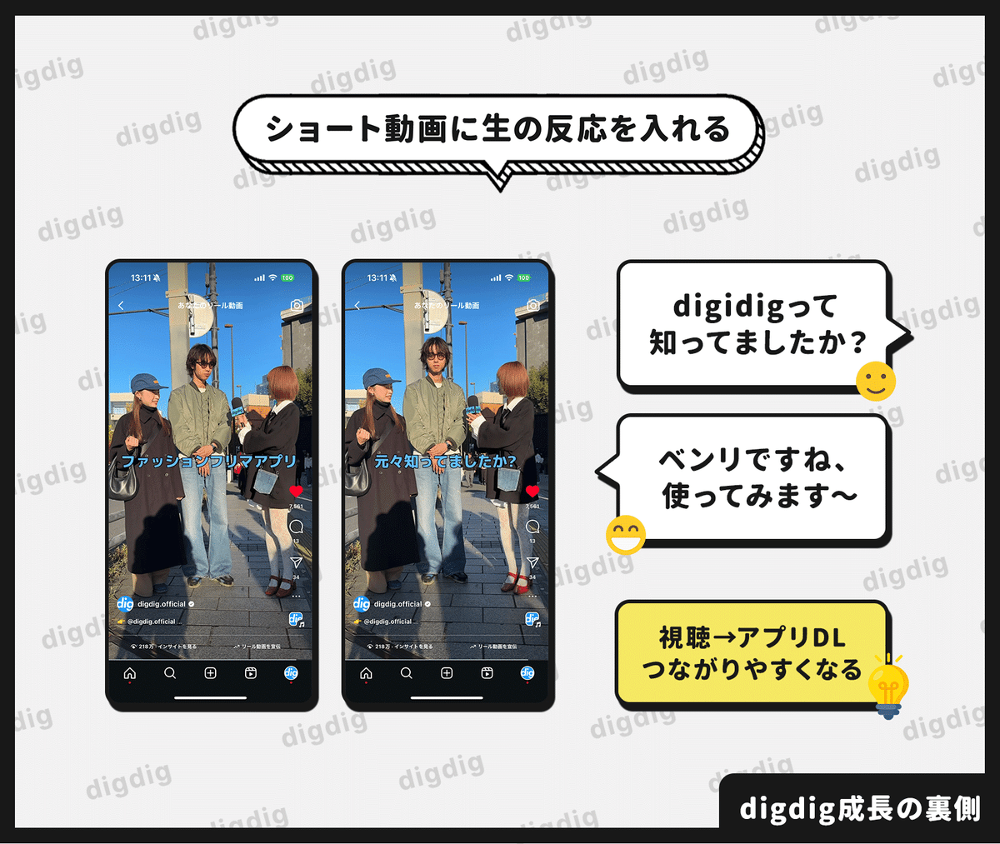

インタビューを受けてくれた方に、**動画の中で「リアル感のある反応」をもらえるだけでも、ダウンロードにつながる数は大幅に変わってきます。**

再生数や視聴維持率が高くても、この後押しがないとアクションにつながりにくいので、これはどのアカウントでもすごく意識しています。

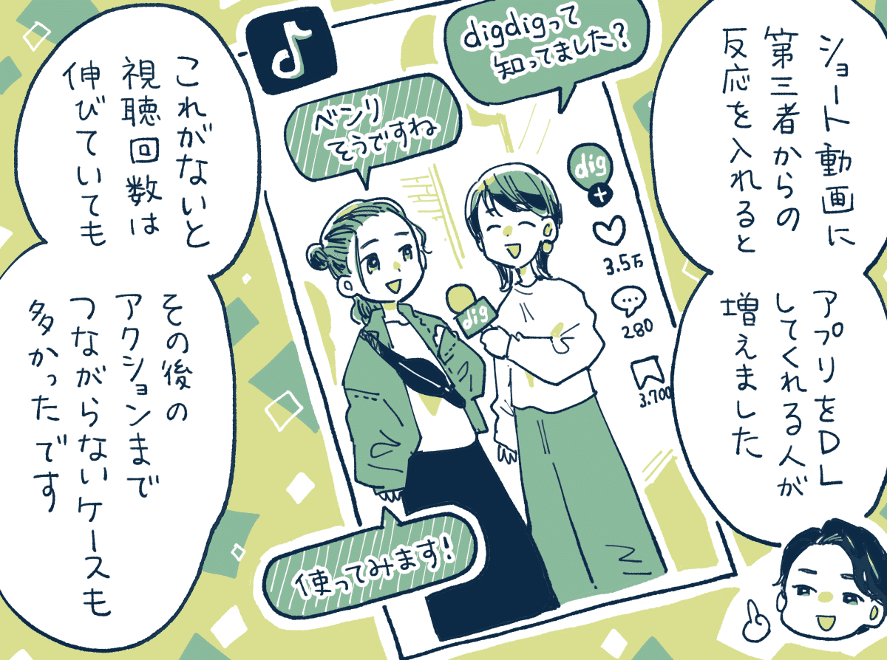

実際に、スナップ動画が終わったあとに、**場面が切り替わってスタッフが「digdig使ってみてね！」と紹介するパターンよりも、生のリアクションを入れるパターンのほうが圧倒的に流入が多かった**です。

前者だと、アプリの紹介をはじめた時点で離脱する人が多かったり、再生数は伸びてもダウンロードにつながらないことがありました。

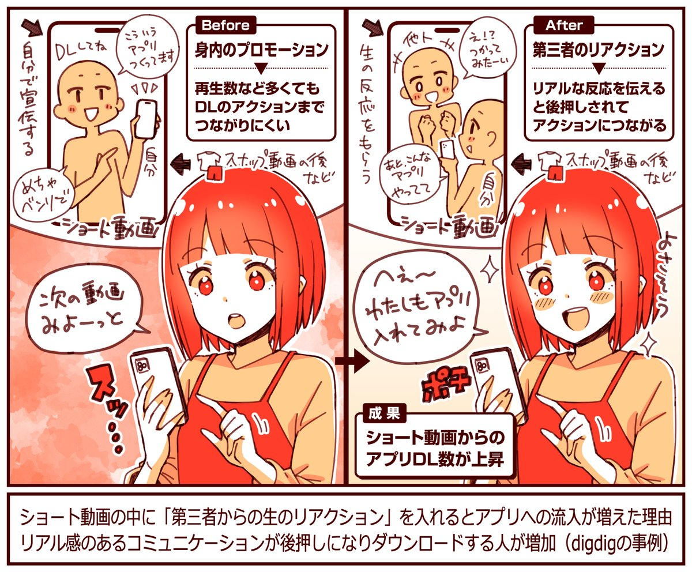

### ⸺ショート動画を最後まで見てもらう「視聴維持率」を上げるにどんな工夫をしていますか？

楊：  
視聴維持率を上げるには、やっぱり動画の中の「反応が良いところ」を冒頭に持ってきて、最初の1秒で惹きつけることを意識しますね。

例えば、「指示語や可愛い物を0秒目に」持ってきます。**指示語は「これって」などのことですが、これから何か良いものを紹介してくれるんだという期待感を高める効果がある**と考えています。

動画を見てもらうには、その動画に時間を費やすべきかを判断してもらう必要があります。「あ、見たい！」となるきっかけづくりが大事なんです。

あと、ショート動画って「リアル感」が求められるので、ナチュラルに表現したほうが数字につながりやすいと感じています。

なので、画質の良いカメラよりも、画質が良すぎないスマホで撮影します。そのほうが「作られた感」が薄まるのではないかなと。

### アプリの成功施策：出品時に「集荷日」を決めてもらうと出品数増加。

楊：  
成功施策としては、**出品したい方に「出品キット」を配送するときに、集荷日も同時に決めてもらうと、送られてくる服が大幅に増えたことです。**

どういうことかというと、出品時に「いつ集荷に行きますね」というある種の締め切りを決めてもらうことで、服の発送率が上がったのだと思います。

これがないと「いつでも送れるから、時間があったらやろう」となるので、忘れてしまったり優先順位が下がって発送率が下がるのだと思います。

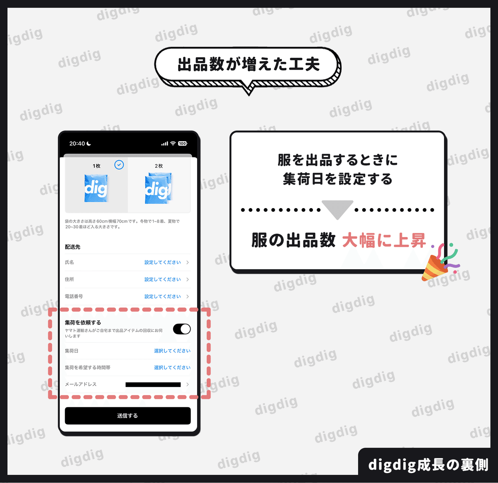

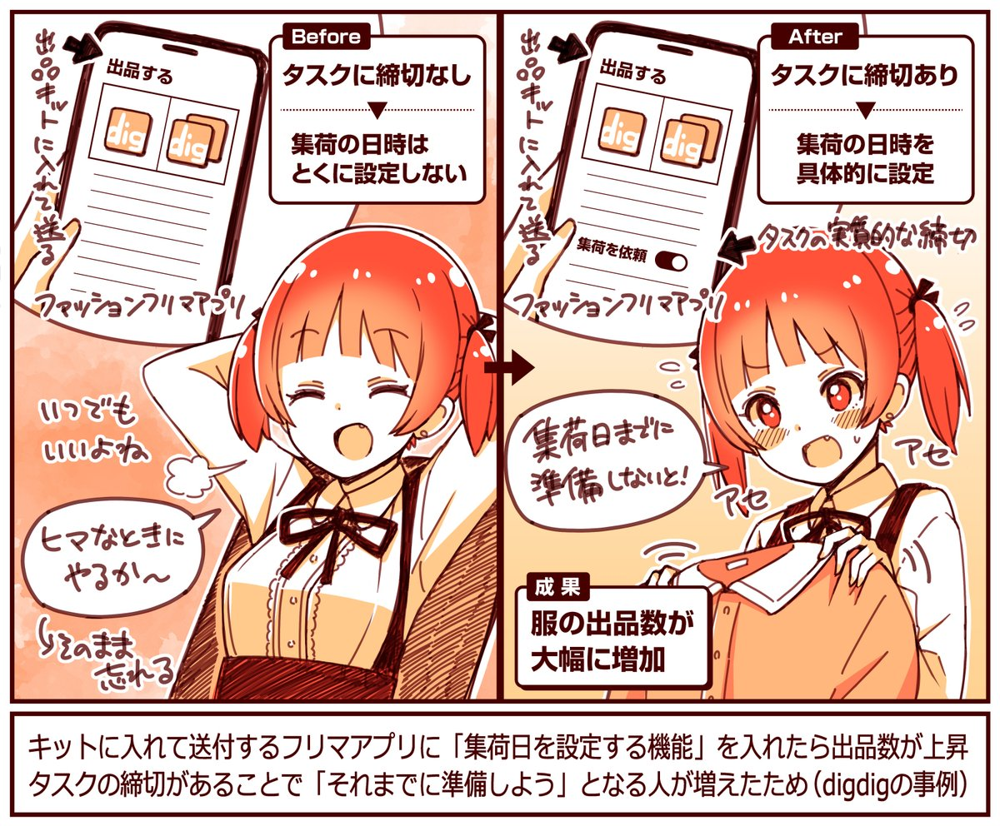

---

【取材協力】  
株式会社FUNEE：<https://funee.jp/>   
digdig：<https://digdig.app/>   
株式会社FUNEE 楊 承峻さん

【告知】FUNEEさんでは各職種で採用中。プロダクトマネージャーなど募集中とのこと。ご興味あれば下記サイトからご覧ください。

[**FUNEE - 採用情報 | Notion**
*会社説明資料*
*funee.notion.site*](https://funee.notion.site/FUNEE-8a2130650ec7405b842773eac6239e81)

> ※ 以降は、＋αの事例を6つほど『ここだけの話』として、note購読者向けにまとめています。ショート動画を伸ばすポイント、注文数増加につながった決済系の施策、SNSでの口コミ増加につながった工夫、インフルエンサーとの出品交渉時に行った工夫、などご興味あればご覧ください。

  

ダウンロード

 

copy

## ここから先は

1,928字
/
5画像

%22%20d%3D%22M-100-100h300v300h-300z%22%2F%3E%3C%2Fsvg%3E)

アプリやプロダクトの成功事例が学べるマガジンです。プロダクトの売上やユーザー数を伸ばしたい人にオススメです。成長プロダクトのインタビュー、効果のあったマーケティング施策、事例やデータなどが中心（月に7記事ほど）多くの過去記事も5年ほど遡って読めます。クレカ決済だと初月無料なのでお試しでもぜひ。

### [月刊アプリマーケティング](/m/mc375c9b46464)

¥2,000 / 月  
初月無料

プロダクト運営について学べるマガジンです。アプリやプロダクトの売上やユーザー数を伸ばしたい人にオススメです。月に7記事ほどお届けします。

購読手続きへ

%22%20d%3D%22M-100-100h300v300h-300z%22%2F%3E%3C%2Fsvg%3E)

1人が高評価

[ログイン](https://note.com/cd/login?redirect_to=https%3A%2F%2Fmarkelabo.com%2Fn%2Fn6bbbc9a963d4)

   

42

[%22%20d%3D%22M-100-100h300v300h-300z%22%2F%3E%3C%2Fsvg%3E)](/)

[アプリマーケティング研究所](/)

フォロー

プロダクトの成功事例を発信しているメディアです。2013年から約10年運営しています。取材相談はツイッターDM（@appmarkelabo）かメールにてどうぞ！info@appmarketinglabo.net