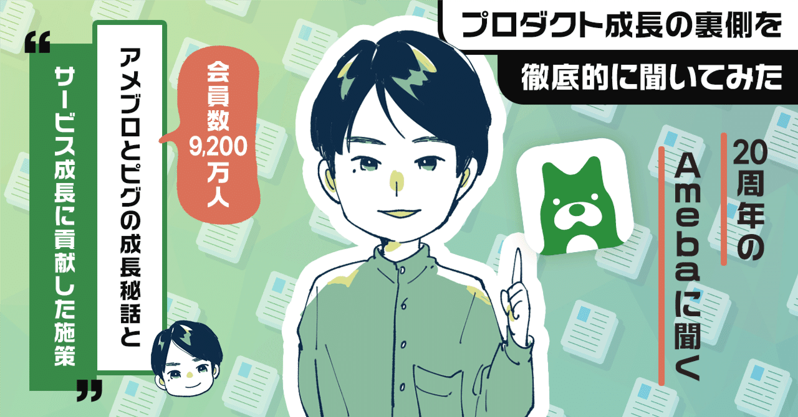  

# アメーバピグの後継サービスに「アイテムの交換機能」を入れたら売上が急増した理由。アメブロが「ニュース化戦略」で成長した話。20周年の「Ameba」に聞くサービス成長の裏側。

40

[%22%20d%3D%22M-100-100h300v300h-300z%22%2F%3E%3C%2Fsvg%3E)](/)

[アプリマーケティング研究所](/)

2025年3月24日 11:30

¥2,000/月

20周年を迎えた「Ameba」さんを取材しました。

株式会社サイバーエージェント AmebaLIFE事業本部 事業本部長 下山 航平さん、AmebaLIFE事業本部 クリエイティブディレクター 武本 敏治さん、AmebaLIFE事業本部 プロダクトマネージャー 大西 絢子さん

### ⸺「Ameba」について教えてください。

下山：  
2024年9月に「20周年」を迎えたメディアプラットフォームです。会員数は9,200万人を超えていて、国内最大級のメディアサービスとなっています。

ブログサービス、アバターSNSやニュース、記事メディアといった、生活に根ざした多様なコンテンツを提供しています。

主力事業である**「Amabaブログ」は累計投稿数が28億件。アクセス数の65％を一般ブログが占めていて、35％を芸能人ブログが占めています。**

最近伸びているのは「生活に根差した情報」です。生活の中の長文の体験談や子育て系といったジャンルが伸びていますね。

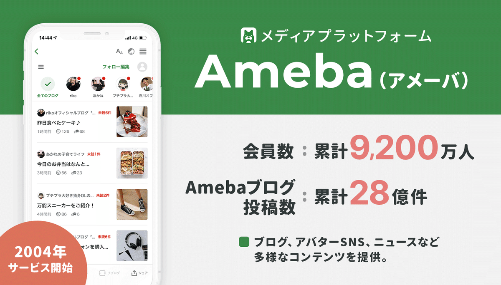

### ⸺どうして「Amebaブログ」は後発でも成長できたのでしょうか？

下山：  
Amabaブログが後発で成長できた理由のひとつは、「芸能人・有名人ブログ」に力を入れたことでした。これを軸にグンと成長できたんです。

当時はインスタなどもなかったですし、**芸能人・有名人の方が「日常や生の意見を発信できる場所」があまりなくて希少性も高かったんですよ。**

初期から専門のチームを置いて、芸能事務所さんとひとつひとつ泥臭く交渉してブログを開設いただくような動きを取っていましたね。

そして、メディアに出ている「芸能人・有名人」の方がブログで発信してくれると、読者が集まってアメブロの認知度も上がっていきました。

### ⸺ブログを書いてもらうために「どんな工夫」を行ないましたか？

下山：  
**当然「書く理由」がないと「芸能人・有名人」の方にブログを書いていただくのは難しいですよね。これを促進できたのはランキングでした。**

ランキング上位になると注目されますし、**あと我々が「Ameba News」というメディアで外部に向けても「ニュース化」していったんですよ。**

何気ない「○○さんの手料理に反響」といった話題から、「○○さんの長男が卒園」のようなものまで読者の声も含めて記事にしました。

ニュース化すると何が起きたかというと、**テレビや新聞などの外部メディアでニュースとして紹介されるようになります。そしてそれを起点にブログに再度アクセスが集まったんですね。**「○○さんのアメーバブログによると…」と紹介されたりするからです。

タレントさんは「ニュース化」を喜んでくれることが多かったです。新しい仕事やファンの獲得につながるためですね。それがアメブロに投稿する理由にもつながりました。これは今でも変わりません。

このニュースを軸にしたPR効果は大きくて、芸能人・有名人の方にブログを書いてもらえるほど話題が広がるというサイクルが生まれました。

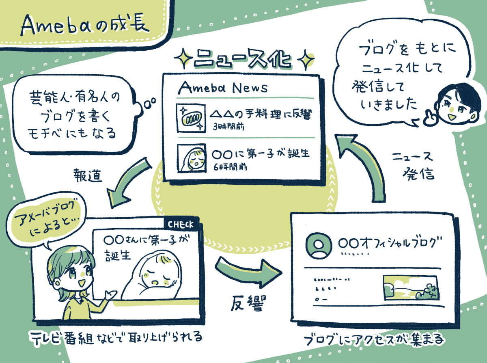

また「Amebaトピックス」という枠を作り、編集チームが面白いブログを見つけたら、**キャッチーに20文字ほどで「タイトルを再編集」してサイト内で配信することで、読者が面白い投稿に回遊しやすくしました。**

こうした工夫で、アメブロに投稿すると「ニュースになる」「仕事が集まる」「新しい一面が発見される」といったことが起こりやすくしたんです。

実際に、テレビ番組のキャスティングの会社さんがニュースを見てくれて、様々な仕事につながるといったケースもたくさん出てきましたね。

### ⸺ブログの後には「どんなサービス」がヒットしましたか？

下山：  
2009年から開始した「アメーバピグ」というコミュニティサービスも若年層を中心に大ヒットしました。

ここまでヒットした理由は、**LINEがない時代に「リアルタイムでチャットができる」という独自の価値がウケて、爆発的に広がったのが一つあります。**

アメーバピグ（2009年）

家に帰って「みんなでPCを開いて遊ぶ」みたいな感じになって、ユーザーが発明した「ごっこ遊び」のようなものが流行りました。

例えば、仮想空間の中で「家族や恋人」のようなものを作ったり、カフェを作って友達を呼んで「カフェごっこ」のようなことをしたり。

アバターのアイテム課金などに使う、ピグ内の仮想通貨「アメゴールド」の流通額は2010年には月間で約6億円に到達しました。

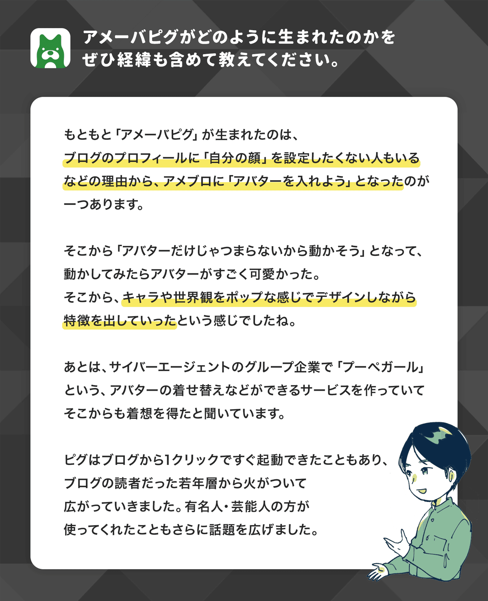

### ⸺ピグで「印象的な結果になった改善」があれば教えてください。

下山：  
PC版の「ピグ」で印象的だったのは、**アバターパーツ（目や口や髪型など）を数倍に増やしたところ、アクティブユーザー数が大きく伸びたことです。**DAUが10〜20％は伸びましたね。2015〜2016年の話です。

当時は「これで伸びる」とは思っていませんでした。でも色々な施策を行ってもほぼ動かなかったDAUがこれで動いたんです。本当に驚きました。

**ここで改めて学んだのは「ベースにある体験ってめちゃくちゃ大事なんだな」ということです。**

ピグのモチベーションの根幹って「可愛い顔を作りたい」とか「自分に似た顔を作りたい」だと思うんですよね。ユーザーはそれを期待しています。

だから、ベースの体験を良くする「アバターのパーツを増やすこと」には効果があったのかなと。結果的にこれはおそらくPC版のピグでは「一番伸びた施策」になったと思いますね。

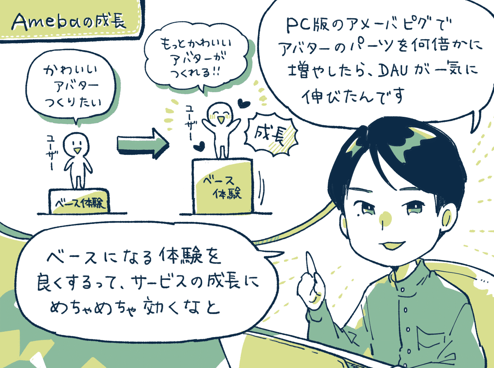

### ⸺おもしろいですね。他にはどうでしょうか？

下山：  
もう一つ印象的だったのは、PC版ピグの後継サービスの「ピグパーティ」にアバターのアイテムを「交換できる機能」を入れたことでした。

**アイテムを交換できるようにしたことで、月の売上が1.3〜1.4倍に伸びたんですよ。**これも「ええ〜！？」という驚きがありましたね。

なぜ売上が伸びたかというと、**人気が低かったアイテムの価値が上がるという現象が起こったからです。**

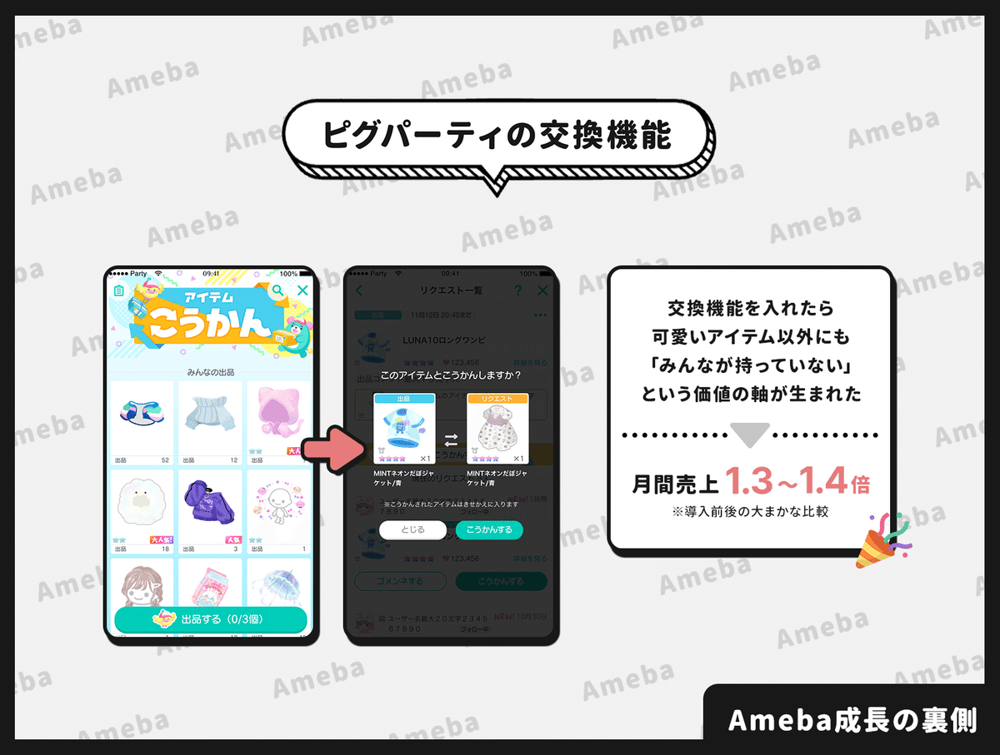

2019年に交換を実装した。

アイテムはガチャで回したりショップで買えます。今までは、人気のアイテムは基本は「可愛いアイテム」でした。可愛いものは売上への貢献度が高くて、そうじゃないと思われたものは貢献度が低かった。

だから、**アイテムの評価基準は「可愛さ」が主軸だったわけですけど、交換機能によって「レアリティ」という新しい基準が加わったんですよ。**

つまり、**みんなが持っていないアイテムに「みんなが持っていない」という価値が生まれて、売れないアイテムまで売れるようになった。**

売れなかったアイテムは流通していないため、ヴィンテージ的な価値が生まれて「レアなアイテム」になった。

普通に考えると「交換機能」を入れたら売れなくなりそうじゃないですか。それを心配していたのですが、真逆のことが起こりましたね。

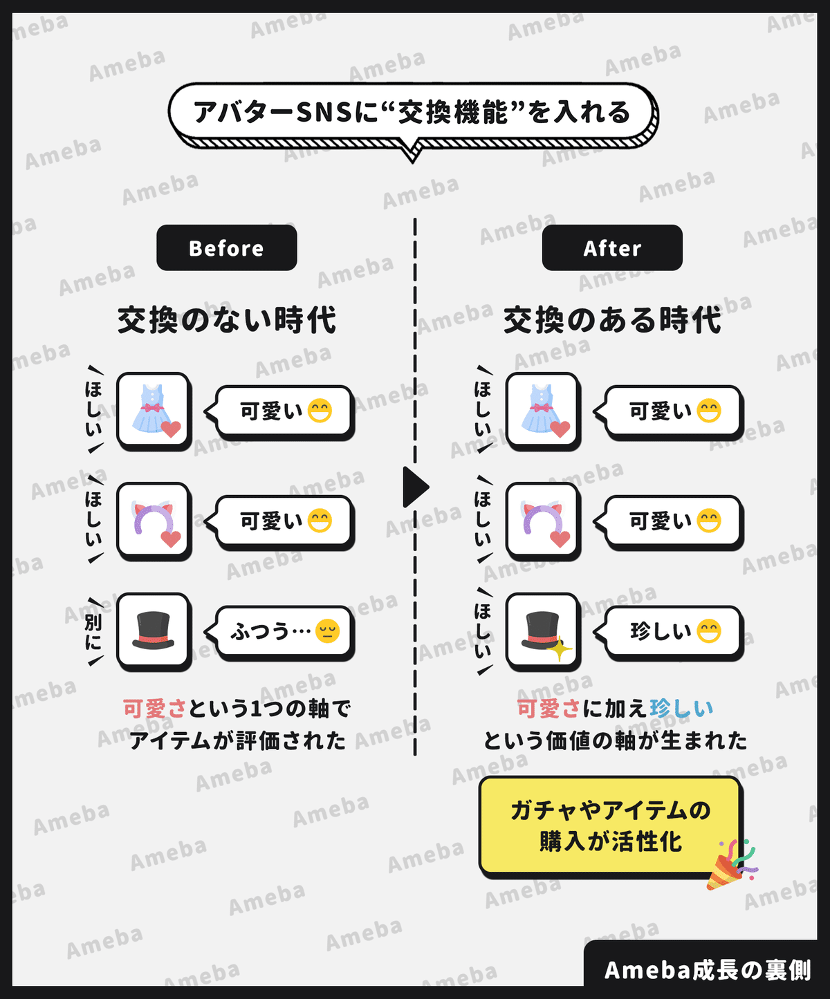

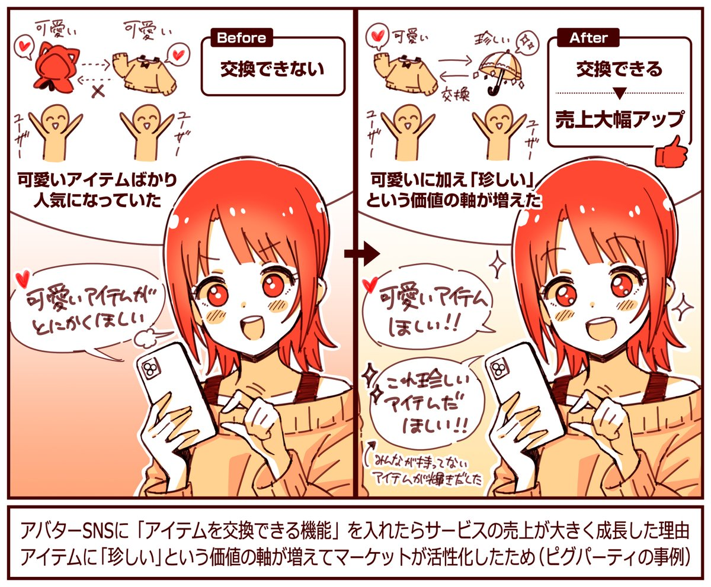

### ⸺そこからはAmebaから「どんなサービス」が生まれましたか？

武本：  
2012年以降は、スマホの普及を見据えて「Amebaスマホ」として、スマホ向けに100サービスの立ち上げを一気に行いましたね。

プロデューサーが企画を立てて、デザイナーにモックを作って、社長の藤田に承認されたら仕上げる。そんな感じでした。

結果としては、**ほとんどがサービス終了になって失敗と言えば失敗ですが、失敗の数を積み上げたから「今がある」という感覚も結構あって。**

そのときに、失敗しながら学んだ開発やグロースのノウハウっていうのが、我々が今やっているサービスに「全部いきてるな」と本当に思います。

早いものだと1週間でサービスを閉じたものもありますね。今も残ってるのは「Amebaマンガ」と「Ameba占い」と「ゲーム系」でしょうか。

そこから、ゲーム事業が独立してクオリアーツという会社が生まれたり、スマホサービスへの投資からABEMAなど色々な事業が生まれたなと思います。

## Ameba関連の3つの成功施策。

### 成功施策①：デザインシステムで開発コストを削減。

武本：  
Amebaでは**ブランドを体現する仕組みとしてのデザインシステム（Spindle）を2021年に開発したことで、運営コストを大幅に下げることができました。**

簡単にいうと「このデザイン原則をみんなで守ろう」と約束事を決めて共通言語化したことと、共通コンポーネントを開発したことで、開発がスムーズになったという感じです。

例えば、ボタン1つ取っても「ここ何色なんだっけ」「ホバーするんだっけ」みたいなことがなくなり、コミュニケーションのロスが圧倒的に減りましたね。

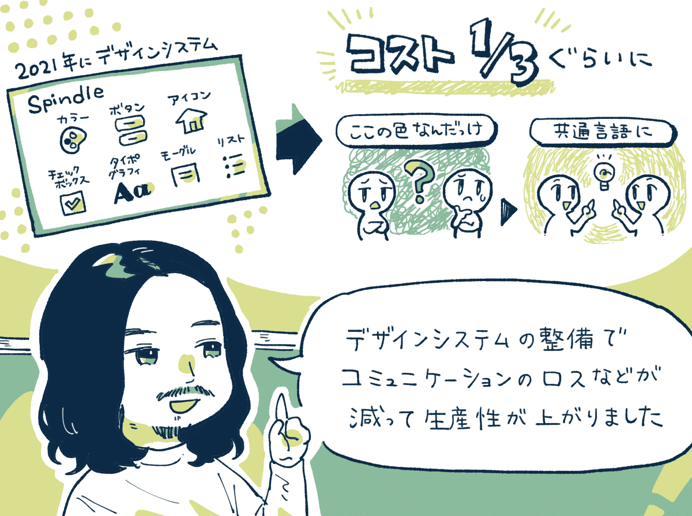

下山：  
これをやらなかったら、コストが3倍ほどに跳ね上がっていたと思うので、本当に潰れていたかもしれません。

新規事業もある中で、ブログだけに人員をかけられません。負債解消に対する投資などは結構やっているほうだと思います。

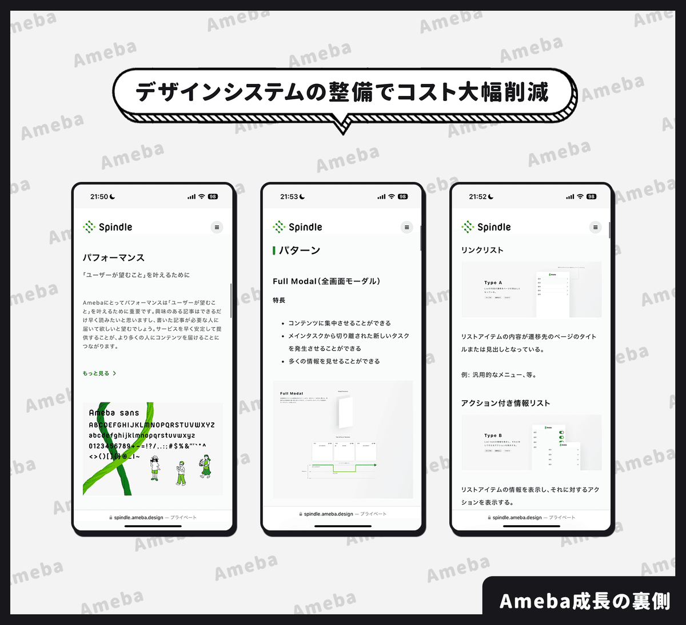

デザインシステム（Spidle）は[サイト上で公開されている](https://spindle.ameba.design/)。

### 成功施策②：「機能をつかうべき理由」を伝えたら利用率が改善。

大西：  
Amebaブログでは、**投稿画面で「機能をつかうと得られる便益」を伝えるようにしたところ、利用率などを高めることができました。**

例えば、「記事タイトルを15文字以上にして注目を集めよう」「カバー画像を設定すると見てもらいやすくなります」のような感じです。

成果としては、カバー画像（サムネイル）を設定する人や、タイトル文字数を多く設定する人を増やすことができました。

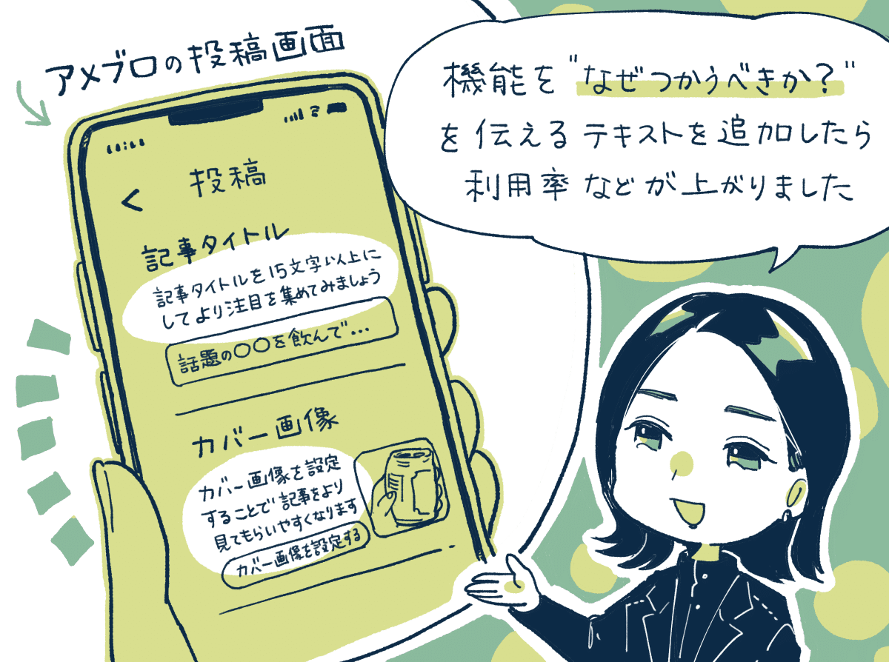

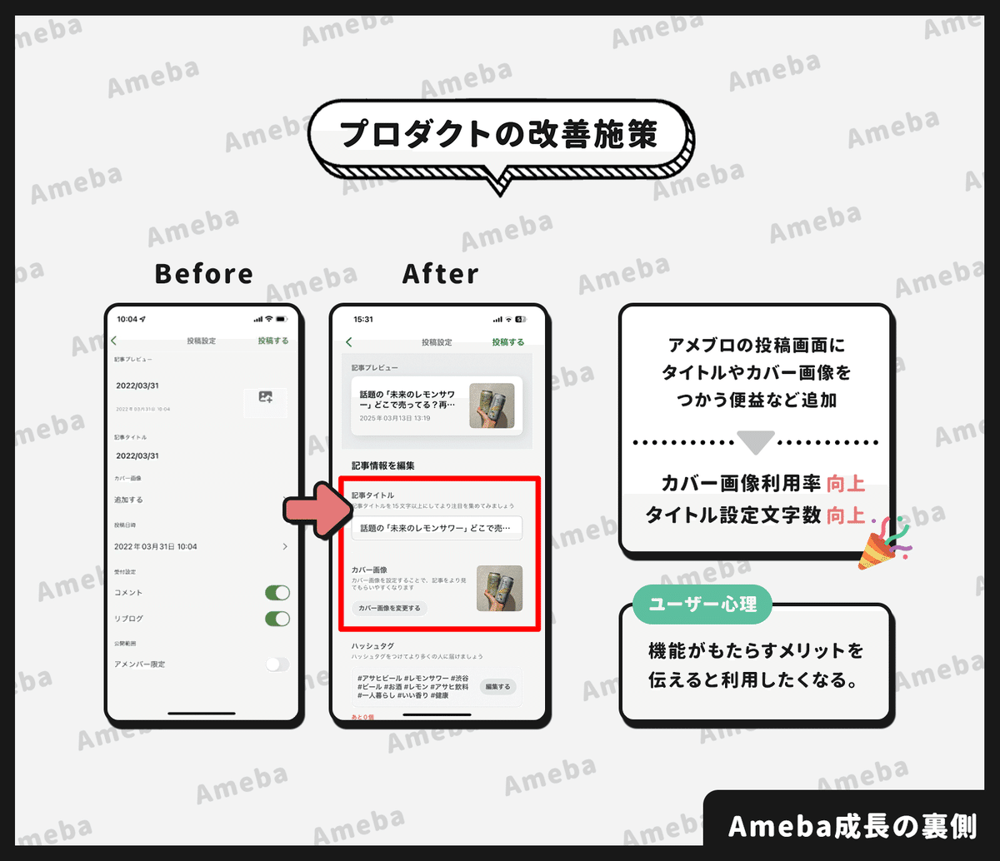

### 成功施策③：プッシュ通知に「ニックネーム」で開封率が1.2倍。

大西：  
Amebaブログでは、特定のプッシュ通知に**「ユーザーのニックネーム」を入れるようにしたところ開封率が1.2倍に改善しました。**

人間は「自分の名前」に反応しやすいためだと考えています。ニックネームを呼びかけることで反応してくれる方が増えたんです。

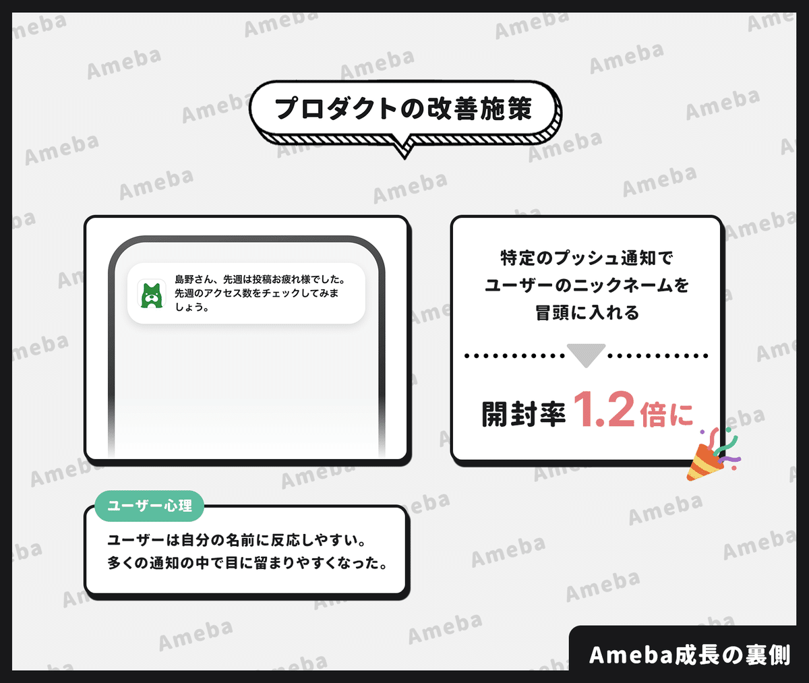

あと、特定のプッシュ通知で**文末に「？」を入れて疑問形にしたことでも開封率が改善されました。**

ユーザー心理的には「？」で終えることで「続きが知りたい」と感じやすくなる効果が生まれたのかなと。

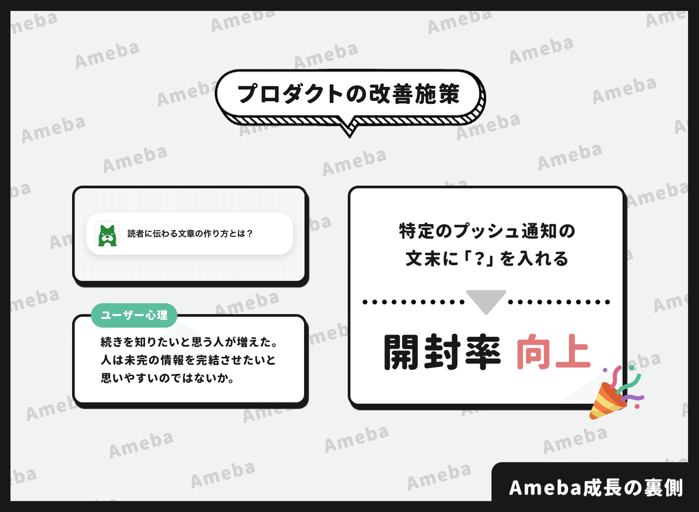

---

【取材協力】  
株式会社サイバーエージェント：<https://www.cyberagent.co.jp/>   
Amebaブログ：<https://ameblo.jp/>   
アメーバピグ：<https://s.pigg.ameba.jp/>

【告知】サイバーエージェントさんでは各職種で採用中。ご興味あれば下記サイトからご覧ください。

[**採用情報 | 株式会社サイバーエージェント**
*サイバーエージェントの採用情報ページです。「21世紀を代表する会社を創る」をビジョンに掲げるサイバーエージェントでは、様々*
*www.cyberagent.co.jp*](https://www.cyberagent.co.jp/careers/)

> ※ 以降は、＋αの事例を5つほど『ここだけの話』として、note購読者向けにまとめています。回遊性を高めた改善、AIで監視業務を効率化した話、広告の反応率を高めた工夫など（改善施策④〜⑨）ご興味あればご覧ください。

  

ダウンロード

 

copy

## ここから先は

1,375字
/
6画像

%22%20d%3D%22M-100-100h300v300h-300z%22%2F%3E%3C%2Fsvg%3E)

アプリやプロダクトの成功事例が学べるマガジンです。プロダクトの売上やユーザー数を伸ばしたい人にオススメです。成長プロダクトのインタビュー、効果のあったマーケティング施策、事例やデータなどが中心（月に7記事ほど）多くの過去記事も5年ほど遡って読めます。クレカ決済だと初月無料なのでお試しでもぜひ。

### [月刊アプリマーケティング](/m/mc375c9b46464)

¥2,000 / 月  
初月無料

プロダクト運営について学べるマガジンです。アプリやプロダクトの売上やユーザー数を伸ばしたい人にオススメです。月に7記事ほどお届けします。

購読手続きへ

%22%20d%3D%22M-100-100h300v300h-300z%22%2F%3E%3C%2Fsvg%3E)

1人が高評価

[ログイン](https://note.com/cd/login?redirect_to=https%3A%2F%2Fmarkelabo.com%2Fn%2Fna810327530d8)

   

40

[%22%20d%3D%22M-100-100h300v300h-300z%22%2F%3E%3C%2Fsvg%3E)](/)

[アプリマーケティング研究所](/)

フォロー

プロダクトの成功事例を発信しているメディアです。2013年から約10年運営しています。取材相談はツイッターDM（@appmarkelabo）かメールにてどうぞ！info@appmarketinglabo.net