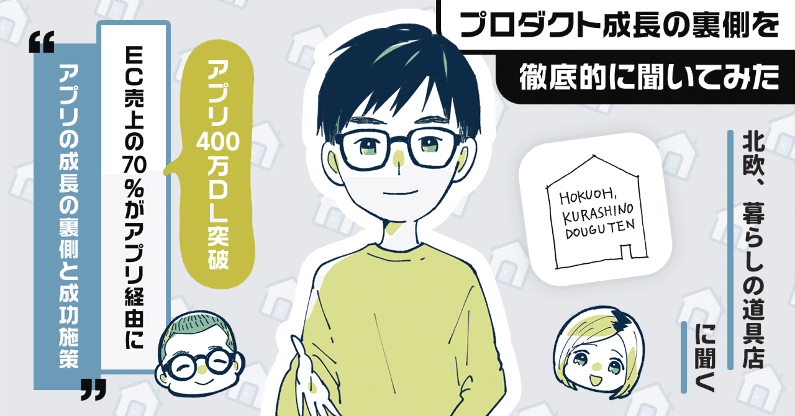  

# 売上66億円に成長した「北欧、暮らしの道具店」のアプリを支える「データだけでは辿り着けない顧客理解」に向かうUXリサーチのポイント。成功した3つのABテスト。

90

[%22%20d%3D%22M-100-100h300v300h-300z%22%2F%3E%3C%2Fsvg%3E)](/)

[アプリマーケティング研究所](/)

2025年3月27日 11:30

¥2,000/月

「北欧、暮らしの道具店」を運営するクラシコムさんを取材しました。

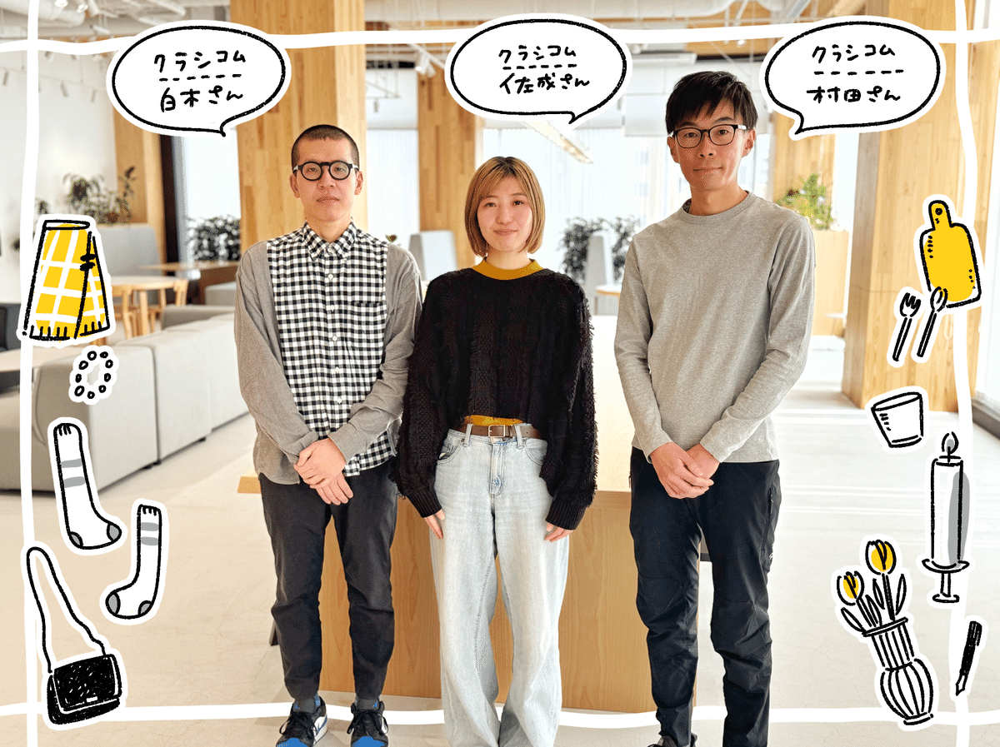

株式会社クラシコム システムプラットフォーム部 部長 執行役員 村田省吾さん、プロダクトマーケティンググループ デザイナー 白木良憲さん、プロダクトマーケティンググループ 佐成美咲さん

### ⸺「北欧、暮らしの道具店」について教えてください。

村田：  
「北欧、暮らしの道具店」は、雑貨やアパレルをECで販売しながら、暮らしにまつわるコンテンツを提供している「ライフカルチャープラットフォーム」です。

売上高は約66億円（2024年7月期）となっていて、ECの売上の7割以上がアプリ経由（2024年10月時点）になっています。

アプリは累計400万ダウンロードされていて、**新規ダウンロードから30日間の1人あたりの平均購入金額（ARPU）は約3年で1.8倍に成長しています。**

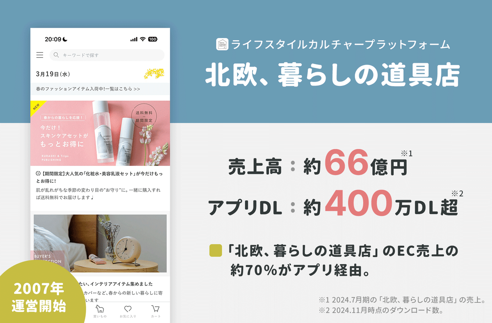

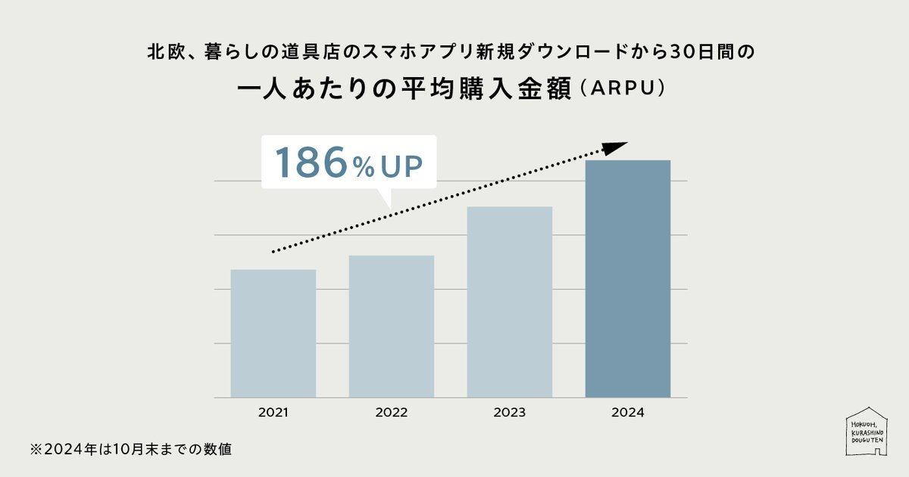

### ⸺どうして「アプリの売上やDL数」がここまで成長しているのでしょうか？

村田：  
大きく分けると、アプリの改善を続けていること、広告配信のノウハウなどが溜まったこと、商品ラインナップが増えたことの3点があるかなと。

集客に貢献しているのは**広告プロモーションですが、広告だけを頑張っているというよりは、SNSなどでのコンテンツ発信と「セット」になって成果が出ているという感じなんですよ。**

例えば、インスタを1つの街だとすると、**その街での知名度が上がって「ちょっとイイかも」とブランドに良い印象を持ってくれる人も増えてきた。**

その状態で、街にアプリの広告を出したら「こんなものが買えるんだ！」とみなさん気づいてくれて、広告の調子も良くなっている感じです。

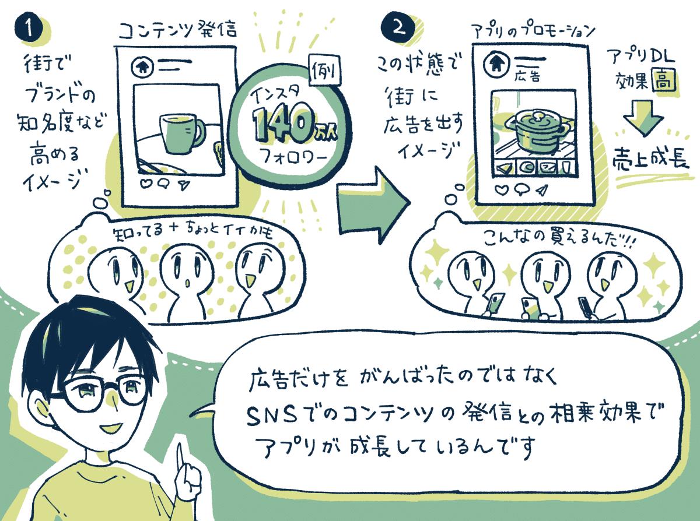

佐成：  
当店のSNSの中では、インスタのフォロワー数が「140万人」と最も多いこともあって、広告もインスタからの獲得が多くなっています。

中でも、**ダウンロードや収益に最もつながるのはファッションやカバンの広告だともわかってきました。**

広告クリエイティブも「商品を5つ並べる」「3,000円以下の商品をまとめる」「複数商品を1つのテーマで掲載する」など色々と検証していますね。

村田：  
なので、Webのお客様がアプリに引っ越しているというわけではなく、基本は新しいお客様が「広告」を起点にどんどん増えているんです。

ダウンロード数の推移的には、ずっと順調に伸びているようにも見えますが、中から見るとこれは「試行錯誤の連続だったな」と感じます。

ひとつ何かが当たって伸びる。やがて伸びなくなる。また何かに挑戦する。ずっとこの繰り返しですね。

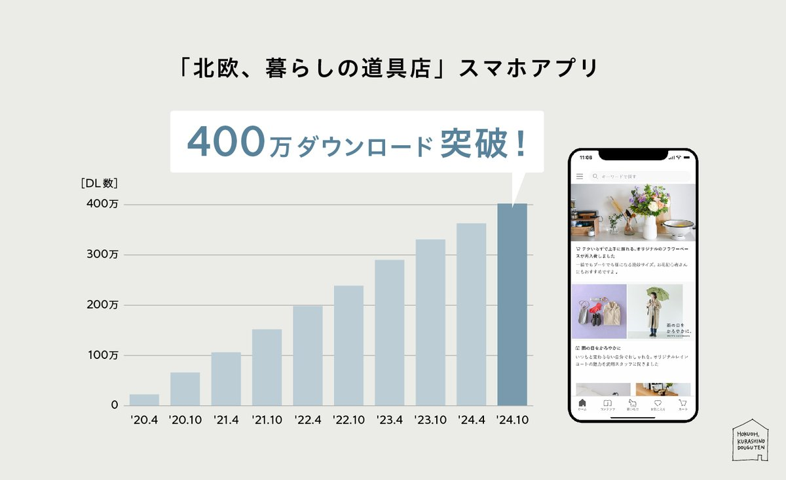

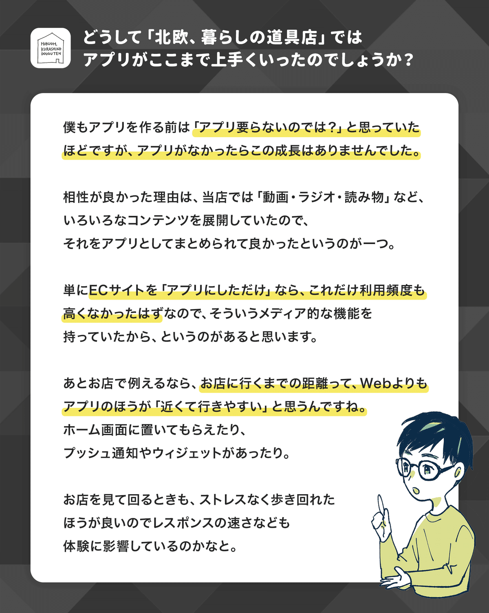

## 顧客理解につなげる「UXリサーチ」のコツ。

### ⸺アプリの改善には「ユーザーインタビュー」も活用しているそうですね。

白木：  
そうですね。以前から座談会などで「お客様にお話を聞く機会」はあったのですが、2021年から本格的にUXリサーチをはじめました。

現在は、月2回ほどの頻度でリモートでユーザーインタビューをしています。アンケートをもとに「目的に合いそうな方」に声をかけていますね。

**ただもちろん「課題が見つかるといいな」と思ってお話を聞いてはいるのですが、主な目的は「お客様のことを理解したい」なんですよ。**

例えば、最近20代のお客様が増えているけれど、あまり若いお客様について知らないなと思ったら、一気に10人ほどにインタビューしたりします。

### ⸺UXリサーチにおいて「これはやって良かった」と感じる工夫があれば教えてください。

白木：  
良かった工夫としては、**お客様と当店の関係性を「ジャーニーマップ形式」でまとめながらインタビューをするという方法です。**

何かを買う、何かを見るって「お客様のライフステージ」に紐付いていることも多いので、時系列を整理しながら聞くと思い出してもらいやすいです。

例えば、「結婚したときに見なくなったな」「子どもが生まれた後にまた見るようになって、買うようにもなった」みたいな感じですね。

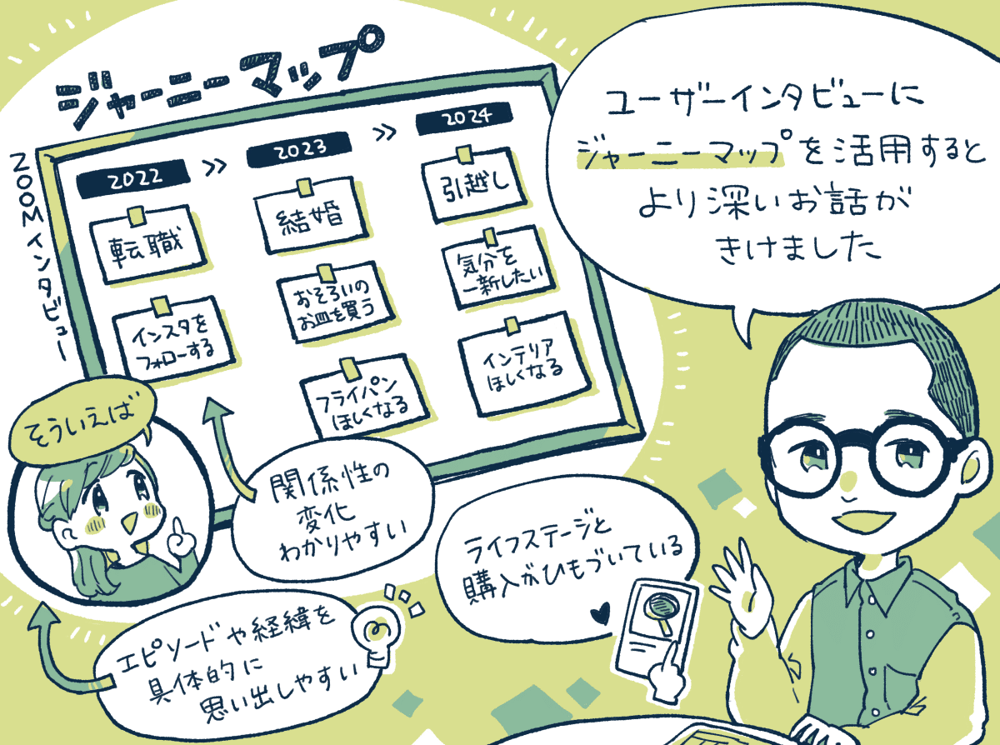

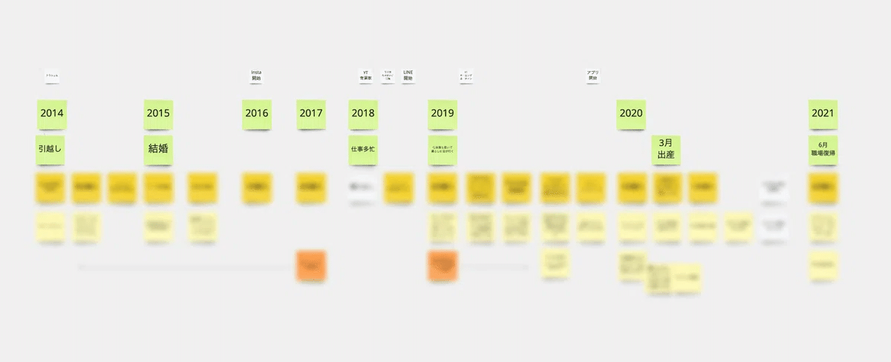

ジャーニーマップの例（社内インタビューで作ったもの）

流れとしては、Zoomで画面共有をしながら「当店と出会ったのは何年ですか？」「そこから当店との関係性はどう変わりましたか？」と聞いています。

「見なくなったタイミングはありましたか？」とか「年ごとにどんな出来事がありましたか？」みたいに深ぼっていく感じですね。

### ⸺なるほど。ほかにも「これをやって良かった」と感じる工夫はありますか？

村田：  
ほかに良かったのは、**お客様から許諾をいただいた上で、購入履歴のデータを補助的に活用しながらお話を聞くという方法です。**

例えば「初回購入はこのときでしたね」とお伝えすると、「そういえば、これはこういう理由で買ったんです！」と思い出していただけたりします。

そこから出てくるエピソードって、データや行動ログからは見えませんし、ただお話を聞いていても「出てこなかった情報」だと思うんですよ。

なので、購入データをもとに「それを引き出せるようになった」というのが面白いポイントだと感じます。これもすごくおすすめですね。

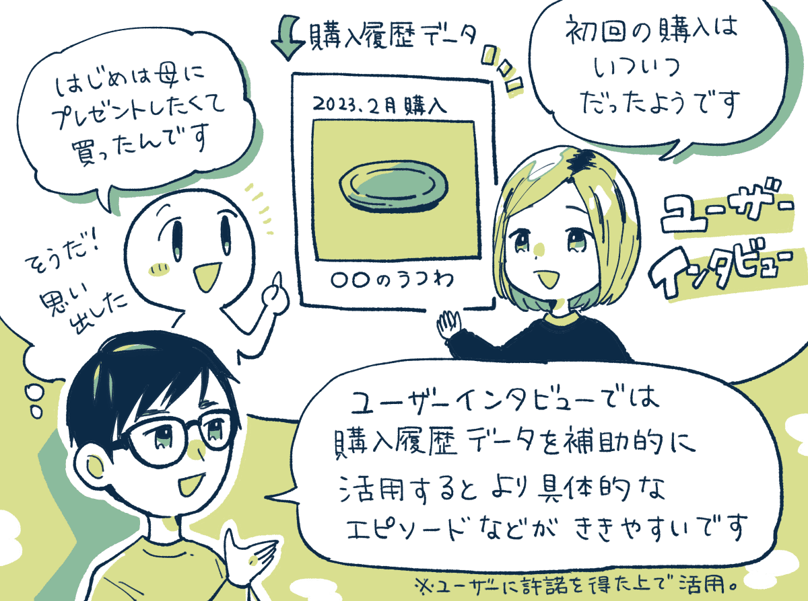

### ⸺ユーザーインタビューの中で「良い気づき」を得るために意識していることはありますか？

白木：  
まず、僕らにとって大きな価値のあるヒントって、お客様が「当たり前にしていること」の中に見つかることが多いんですよね。

そのため、**ちょっとでも引っ掛かりがあったら「それすごく興味深いです！」とお伝えして、詳しく話していただくことを意識しています。**

お客様からすると、当然僕らが「何を知りたいか？」を具体的にはイメージできていないとは思うので、積極的に「それ気になる！」を伝えます。

お客様としては「当たり前のこと」なのでサラッと話されることが多いんですよ。なので、気になったら流れを1回止めて聞くという感じですね。

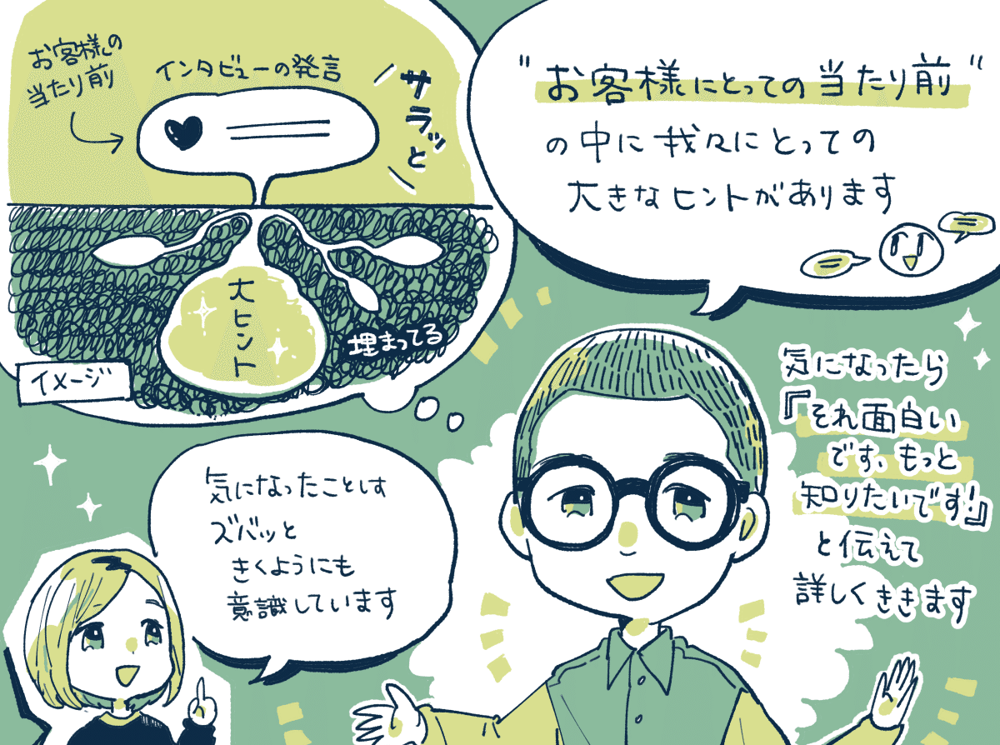

佐成：  
あと、より真意を掴みやすくなったなと思うのは、**「なぜ買わなかったのですか？」みたいな質問をズバッと聞くようにしたことです。**

最初は「なぜ買わなかったのか？」みたいな話って、ちょっと圧がかかる印象になってしまうかなと思って「聞きづらいな」と思っていたんです。

でも、一時期リサーチに関する外部アドバイザーの方にも同席いただいていたのですが、結構ズバッと「え、なんでですか？」と聞かれていたのに対して、お客様もリラックスして回答されていたのを見て「普通に聞いても良かったんだ」と気付けました。

白木：  
あと注意しているのは、**お客様は「悪いことは言わないほうがいいのかな」と思って発言を遠慮されているケースがあるんですよ。**

そのため、最初に「僕らは楽しんでいることも知りたいですが、それ以上に困っていることも知りたいと考えています。」と伝えています。

つまり「サービスの改善」を目指していることを伝えることで、フィードバックや困りごとを教えてもらいやすくなる効果があるのかなと。

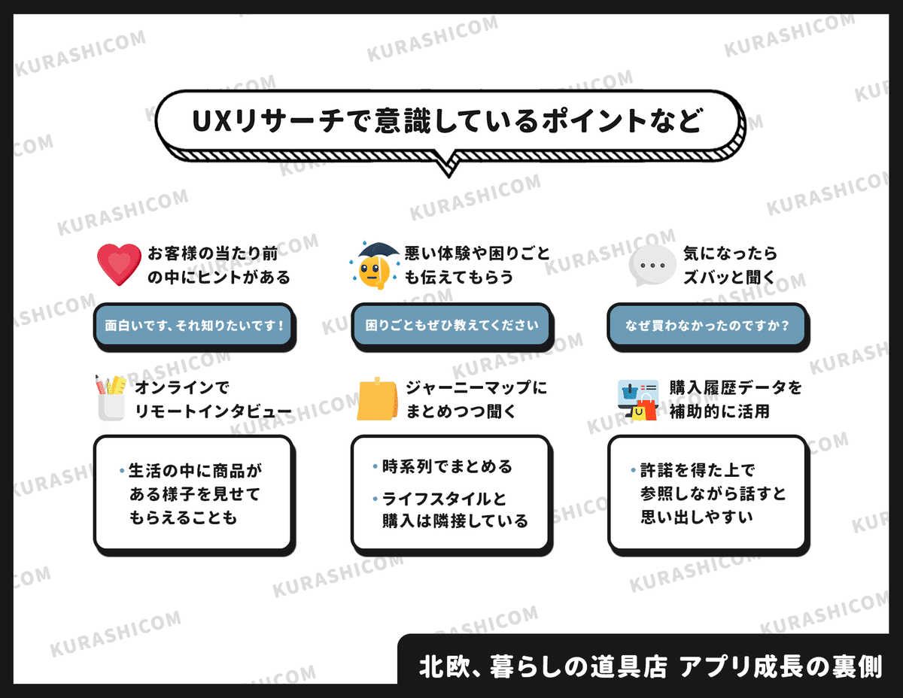

## アプリの体験を改善した「3つのABテスト」

### 成功施策①：アプリトップで「定番商品」を紹介したらCVR改善。

白木：  
アプリのインストール後に**最初の3日間だけ「定番商品リスト」を紹介するバナーをホームに表示したところ購入完了率（CVR）が上がりました。**

この施策を行なった理由は、アンケートの中に「商品が探せません」という声がすごく多くて。その課題を解決するための施策の一つでした。

バナーも色々と試したのですが、**広告掲載商品やカテゴリ別の人気商品よりも「定番商品を並べたバナー」が最も良い結果につながりました。**

どのお客様にとっても「定番商品」は関心が高く、飛び先のページとしてもラインナップが伝わりやすかったのも良かったのかなと。

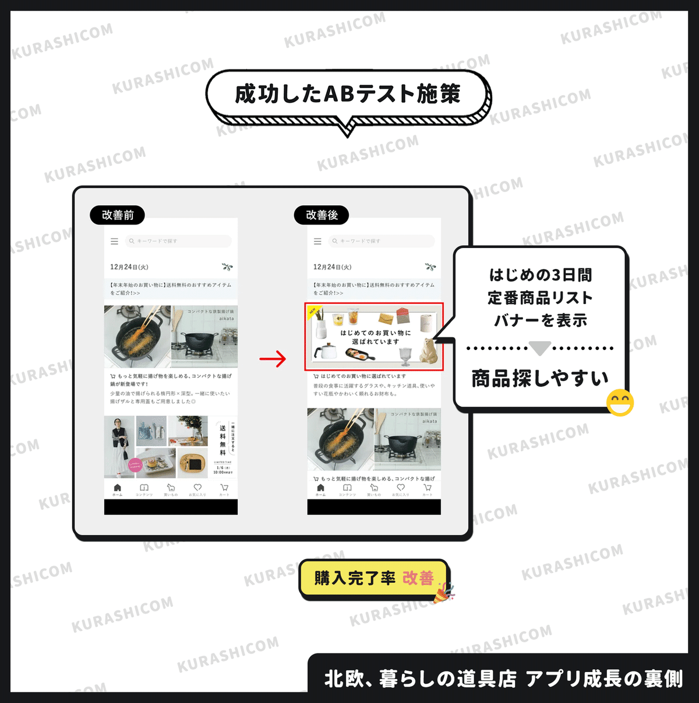

商品詳細画面への到達率、カート追加率、購入完了率が向上。開発工数を大きくかけずに改善につながった。

ちなみに、送料無料キャンペーンをやっていたときは、バナーで「送料無料」を押し出したら効果が上がると考えたのですが、実際に試してみると変化がほぼありませんでした。

**僕らにとっては「特別」ですが、ECで送料無料って結構よくあると思うので新規のお客様にとっては「あまり特別ではなかった」**ということなのかなと。

なお、こうした施策の優先順位は「RICEスコアリング」をもとに決めていますね。これは開発工数を考慮しながら決められるのがメリットです。

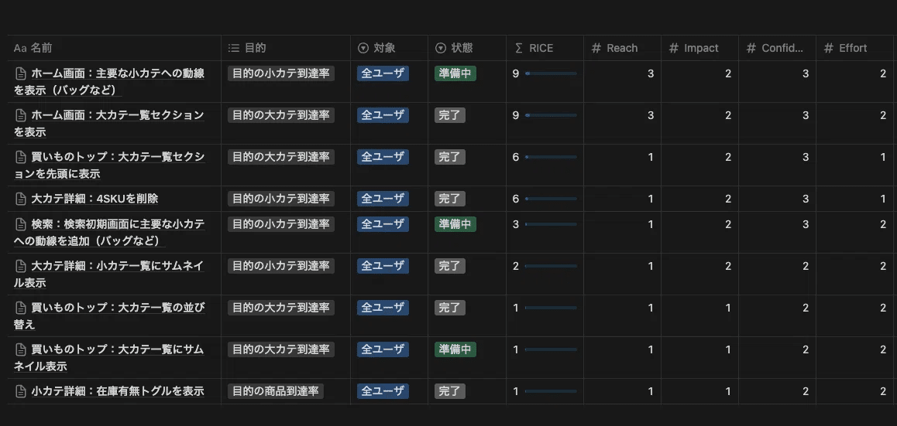

RICEの項目別（Reach, Impact, Confidence, Effort）に1〜3でスコア化して優先度を決める。

### 成功施策②：小カテゴリーに「サムネ画像」をつけたら指標が改善。

白木：  
あと、小カテゴリーのリストに**「サムネイル画像」を追加したところ、次の画面にある「商品リスト」への到達率が大きく上がりました。**

これはアイディア段階では「効果あるのかな？」と疑っていたんですよ。テキストがあるのだし選びやすさは変わらないのではと。

でも、結果としてはサムネイル画像で視覚的にわかりやすくなったことで、商品が探しやすくなりました。

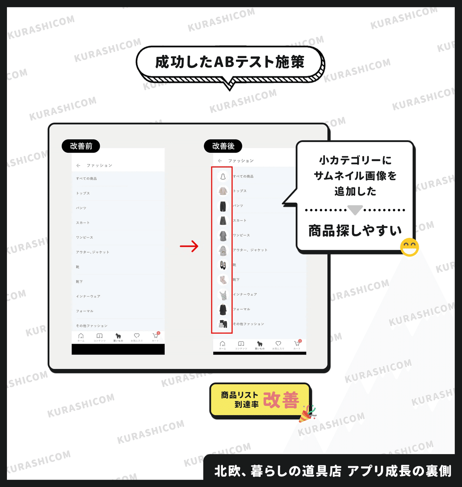

この施策で意識したのは、**仮説に対して大きな課題があるであろうところに絞って「小さく実験してみる」ということです。**

具体的には、**小カテゴリー数の多い「ファッション」では選びにくさの課題が顕在化しやすいと考えて、まずはそこでABテストを行いました。**

すると、先のページに遷移する人が圧倒的に増えたんですよ。社内の人たちにも見てもらうと「かなり印象が変わるね」という声もあがりました。

サムネイルがあるだけでもワクワクするページになるのだなと。ここで効果があるとわかったため全体に展開しました。

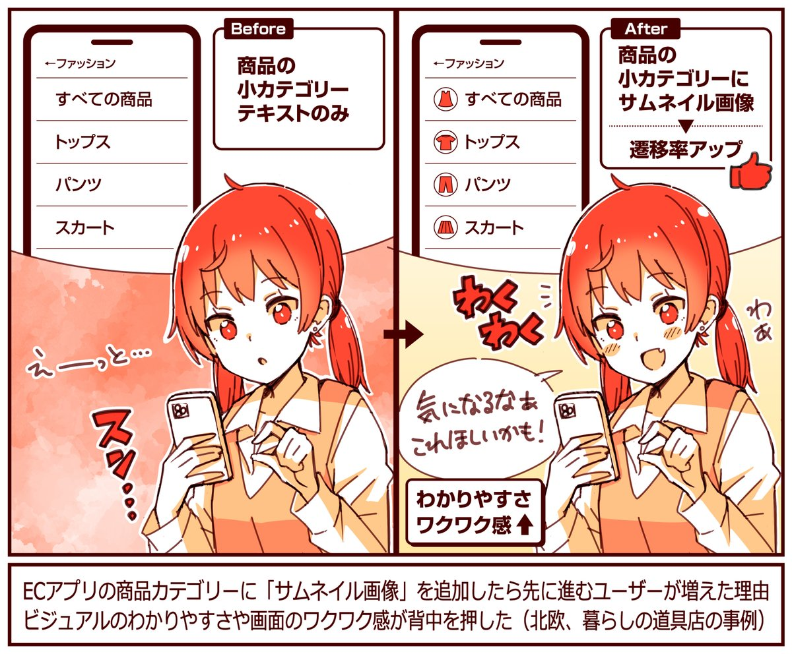

### 成功施策③：カテゴリーを「目立つ位置」に置いたら指標が改善。

白木：  
新規と常連のお客様の「体験のバランス」を考えながらデザインを調整したところ、良い成果につながったこともあります。

まず施策としては、**買いものトップの「商品カテゴリー」を目立つところに移動したところ、カート追加率などが伸びたんですね。**

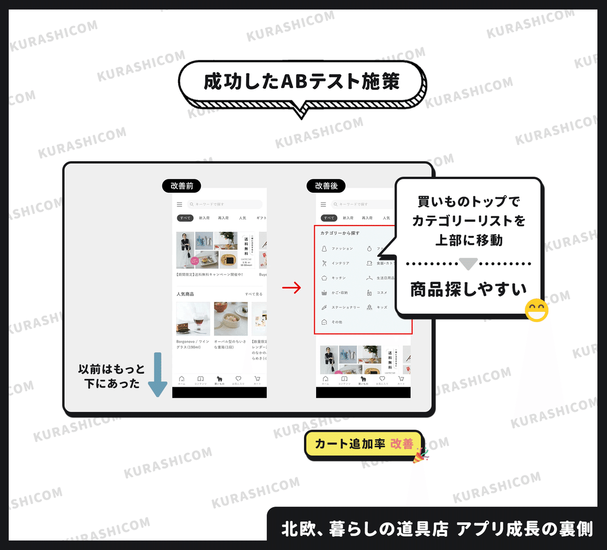

なぜこれで伸びたかというと、全体における「新規のお客様の比率」が高くなってきたからだと解釈しています。

当店では、毎日のように「新入荷・再入荷商品」があって、以前はそれを一番に表示していました。常連のお客様もそれに慣れていました。

つまり、**常連のお客様に向けて「今日アプリを見に行けば、今日新しく出たものがわかる！」という体験を優先していたんです。**

ところが、新規のお客様が増えると「今日、新しく出たもの」よりも「今、自分が気になっているものを探したい」という方が増えます。

なぜなら「当店がどんなお店か？」をまだわかってもらう前の段階だからです。例えば「広告で見た商品はどこか？」「自分に合ったものがあるか？」といった情報を知りたい人が多いという感じです。

そのため、「気になる商品を探しやすくする体験」を強化したことで指標が伸びたのかなと思います。

---

【取材協力】  
株式会社クラシコム：<https://kurashi.com/>   
北欧、暮らしの道具店：<https://hokuohkurashi.com/>   
株式会社クラシコム 村田省吾さん、白木良憲さん、佐成美咲さん

【告知】クラシコムの仕事にご興味を持たれた方は、採用やビジネス関連の情報が届くメールマガジンにぜひ登録してほしいとのこと。ご興味あれば以下のURLからご覧ください。

[**Kurashicom**
*Kurashicom Email Forms*
*kurashi.us13.list-manage.com*](https://kurashi.us13.list-manage.com/subscribe?u=547fde2578fcf6f8feb079f6f&id=bcf889445a)

> ※ 以降は、＋αの事例を5つほど『ここだけの話』として、note購読者向けにまとめています。課題の発見につながる「アンケートの活用法」、LINE公式アカウントの登録数を伸ばした工夫、効果の高かった広告の話、インタビューで得られたキーワードの話、などご興味あればご覧ください。

  

ダウンロード

 

copy

## ここから先は

1,884字
/
4画像

%22%20d%3D%22M-100-100h300v300h-300z%22%2F%3E%3C%2Fsvg%3E)

アプリやプロダクトの成功事例が学べるマガジンです。プロダクトの売上やユーザー数を伸ばしたい人にオススメです。成長プロダクトのインタビュー、効果のあったマーケティング施策、事例やデータなどが中心（月に7記事ほど）多くの過去記事も5年ほど遡って読めます。クレカ決済だと初月無料なのでお試しでもぜひ。

### [月刊アプリマーケティング](/m/mc375c9b46464)

¥2,000 / 月  
初月無料

プロダクト運営について学べるマガジンです。アプリやプロダクトの売上やユーザー数を伸ばしたい人にオススメです。月に7記事ほどお届けします。

購読手続きへ

%22%20d%3D%22M-100-100h300v300h-300z%22%2F%3E%3C%2Fsvg%3E)

1人が高評価

[ログイン](https://note.com/cd/login?redirect_to=https%3A%2F%2Fmarkelabo.com%2Fn%2Fnc4ee90ab55c2)

   

90

1

[%22%20d%3D%22M-100-100h300v300h-300z%22%2F%3E%3C%2Fsvg%3E)](/)

[アプリマーケティング研究所](/)

フォロー

プロダクトの成功事例を発信しているメディアです。2013年から約10年運営しています。取材相談はツイッターDM（@appmarkelabo）かメールにてどうぞ！info@appmarketinglabo.net