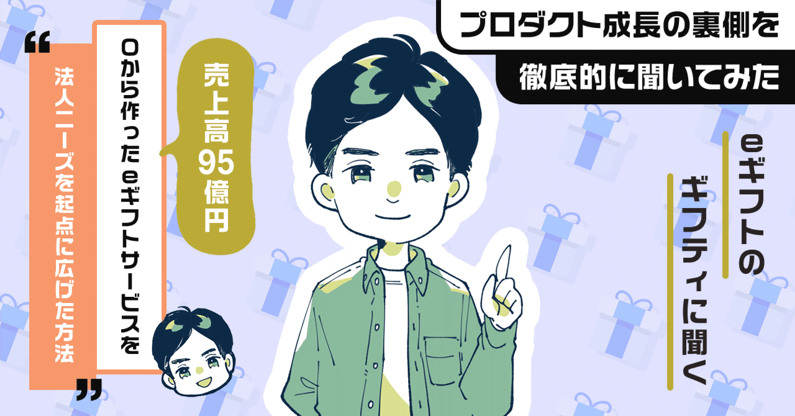
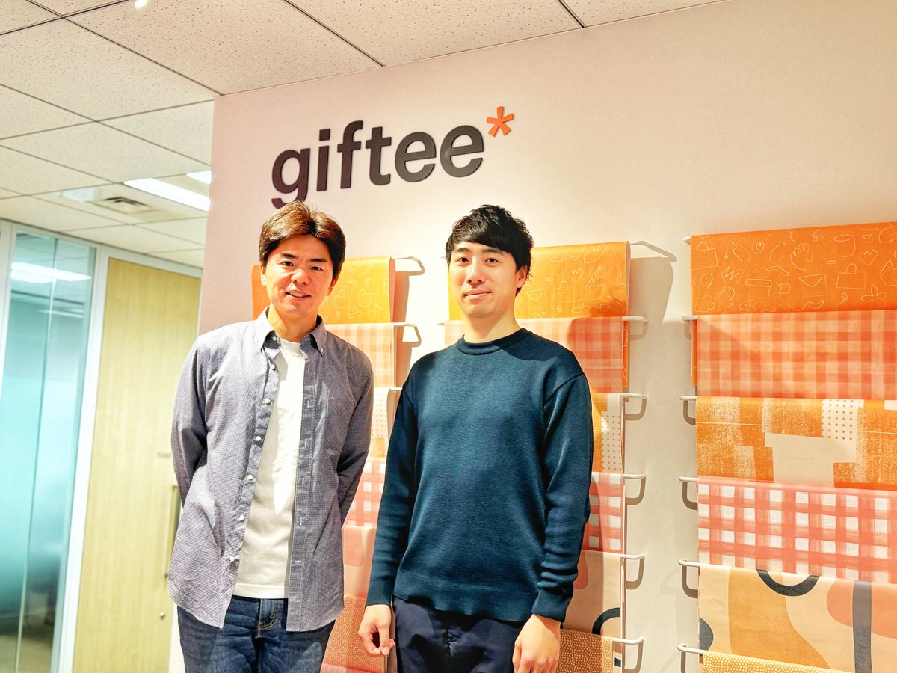
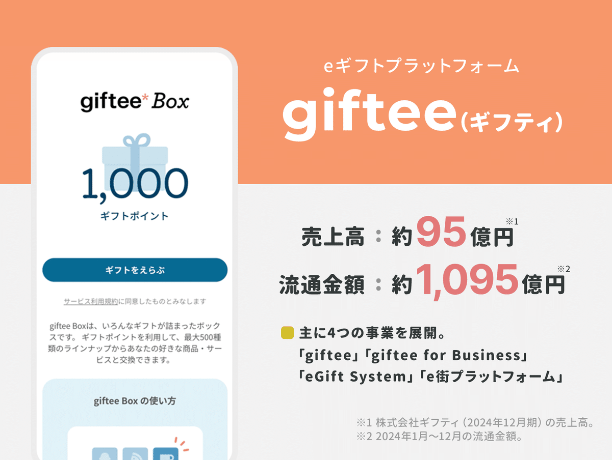
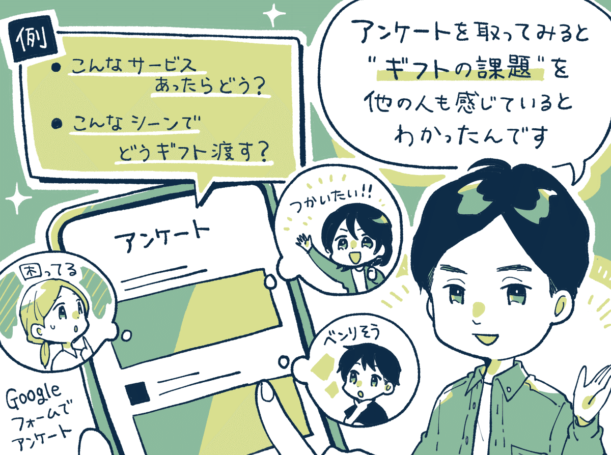
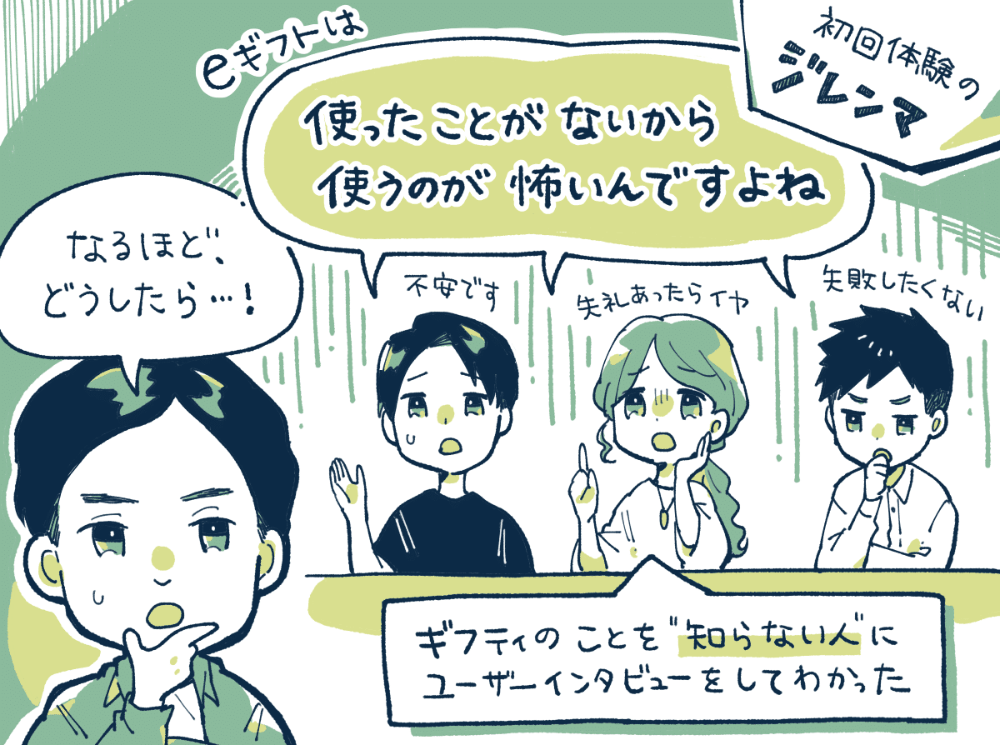
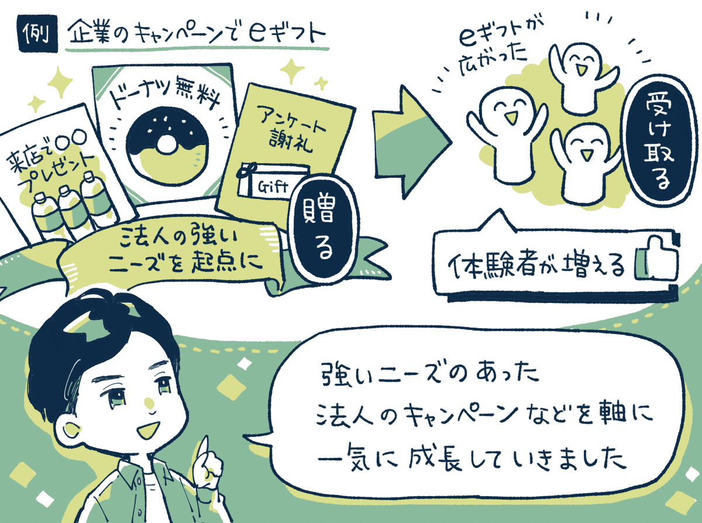
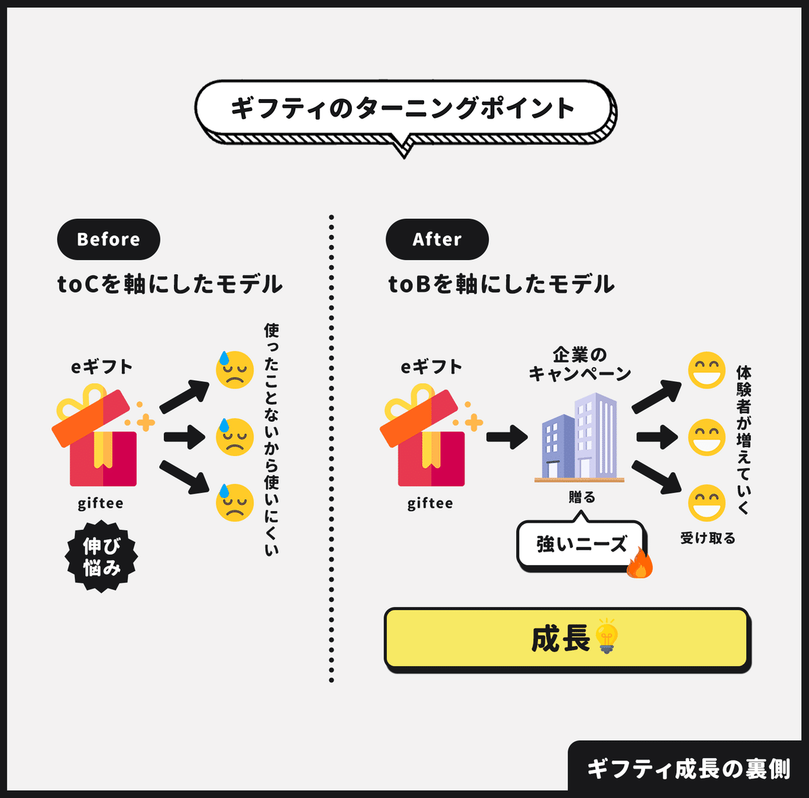
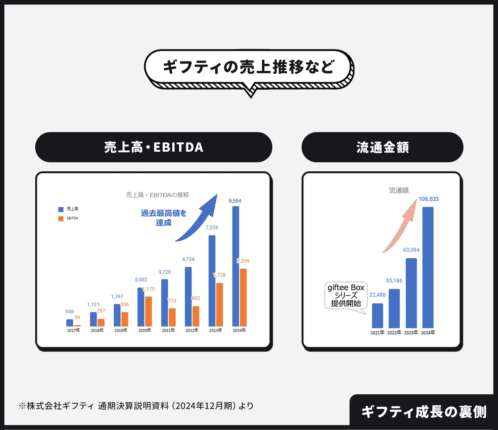
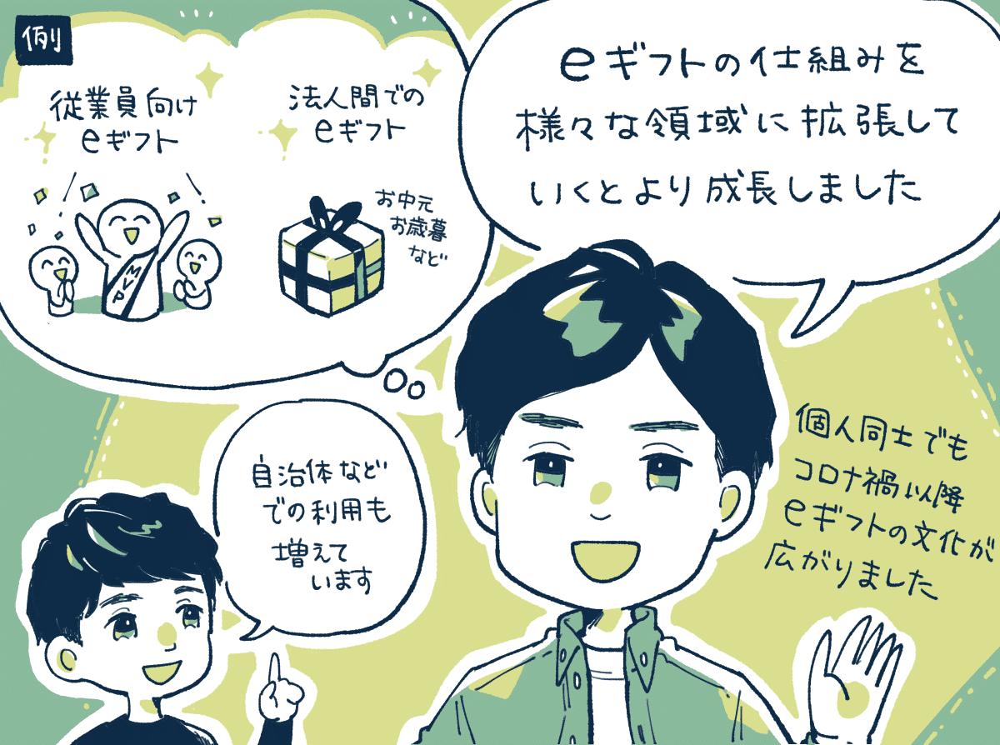

  

# 流通金額は1,095億円。売上95億円に成長したeギフトの「ギフティ」に聞く、初回体験のジレンマなどで広がらなかったeギフトが「法人のニーズ」を捉えて急成長した話。

24

[%22%20d%3D%22M-100-100h300v300h-300z%22%2F%3E%3C%2Fsvg%3E)](/)

[アプリマーケティング研究所](/)

2025年4月17日 11:30

¥2,000/月

ギフティさんを取材しました。

株式会社ギフティ 代表取締役 太田睦さん(左)、「giftee for Business」事業責任者 篠塚 大樹さん(右)

### ⸺ギフティの事業について教えてください。

太田：  
eギフトの発行から販売・流通までを提供する 「eギフトプラットフォーム」を展開しています。**2024年の流通金額は1,095億円に到達しています。**

会社の売上は約95億円（2024年12月期）となっていて、**売上の65％を法人向けのサービスである「giftee for Business」が占めています。**

これは法人が、キャンペーンの景品やお客様への謝礼として、ギフトをLINEやメールで贈れるサービスで、累計5.7万件の導入案件実績があります。

直近で成長している理由は、お取り扱いできるブランド数が増えたことで流通額が伸びていたり、DX文脈で用途が広がったことなどがあります。

## 課題の普遍性を「アンケート」で検証した

### ⸺最初はどのように「アイディア」が生まれたのでしょうか？

太田：  
最初のアイディアとしては、友人や家族との何気ないチャットのメッセージに「ギフトを添えられたらいいのに」というモヤモヤからはじまりました。

例えば、友達の誕生日に「おめでとう！」とチャットで書き込んだときに、もっとお祝いの気持ちを表現できる方法があったらいいのにと。

これって自分だけなのか。他の人も同じ課題を感じているか。**課題の普遍性を確認してみようと思い、自分のFacebookに「Googleフォーム」で作ったアンケートを投稿してみたんですよね。**

そこで、このアイディアに多くの方が「使いたい」と回答してくれるなど、他の人にも「同じ課題があるんだな」と思いサービスを作ってみようと。

そこから、サービスの開発と並行しながら、eギフトを発行いただけるお店を探そうと、街中のカフェにひたすら訪問営業をしていましたね。

当然断られることも多かったです。でも「eギフトはコストをかけずに新規顧客を集客できる仕組みだ」と捉えていただけたり、反応は想像より悪くなかったです。

なんとか、はじめの約30店でeギフトを発行いただくことが決まり、2011年3月に「giftee」（個人向け）をリリースすることになります。

管理画面で購入がバーッと発生しているのを見たときには、「本当にギフトが贈られているんだ…！」という言葉にできない嬉しさがありましたね。

### ⸺リリース後に「どんな課題」が出てきたかを教えてください。

太田：  
初期に出てきた課題は、**gifteeを日常的に利用しようとすると、相手が「どこに住んでいるか？」を知らないと成立しにくい**というものでした。

例えば、九州に住んでいる人に「東京のカフェのチケット」を贈ってもすぐには使えません。そのまま有効期限が過ぎてしまったりもしました。

ここで改めてわかったのは、**gifteeが成長するためには、全国チェーンのコンビニやカフェなどの「大企業さんとの提携」が必要だということです。**

そこから少しずつ実績を積み上げました。2012年には大手コンビニさんに、2014年にはコンペの結果、スターバックスコーヒージャパン（以下、スターバックス）さんにeギフトを発行いただけました。

小さな会社が成果を出せたのは「Fail fast」に尽きます。早く出して早く失敗したからこそ知見が溜まり、チャンスに対して良い準備ができたんです。

## 「初回体験のジレンマ」が成長を阻んでいた

### ⸺そこから「急成長」がはじまったのですか？

太田：  
いえ、スターバックスさんに導入いただいた後も、思ったほど売上を伸ばすことはできなかったんですよ。

初期からリピート率を見ていて。初回購入から「3ヶ月後のリピート率」を追っていたのですが、日常的に使ってもらえるところまで行かなかった。

あと印象的だったのは、**ユーザーインタビューを"gifteeのことを知らない人"にしてみてわかったのが、eギフト未体験の方からの「使ったことがないから使うのが怖い」という意見です。**

数百円のギフトであっても、失礼があったら嫌だ。お祝いなんだから失敗したくない。それが「怖い」という心理につながっていました。

新しいサービスだったこともあり、「自分が体験したことがないから、相手にも贈りづらいよね」というジレンマが発生していたんです。

## 法人ニーズを捉えて急成長がはじまった

### ⸺その課題はどうやったら解決できたのでしょうか。

太田：  
じゃあ、eギフトを"体験したことがある人"をどうしたら増やせるだろうか。そう考えていた頃に、こんなお問合せがありました。

**「雑誌のアンケートの謝礼としてeギフトを使いたいんです。」こうしたお問い合わせから法人のニーズを知ることになります。**

お話を伺いに行くと、アンケートなどの謝礼のために企業様が「カード型のギフト」を買ってきて発送していることを知りました。

封筒に入れて発送すると送料や人件費がかかるので「発送コストの課題」が発生します。店舗で手渡しをするなら在庫管理が必要で「管理コストの課題」が発生します。

**こうした課題に向けてeギフトをご案内すると「便利だね！」と言っていただけました。**そこから法人向けに「giftee for Business」を提供すると、サービスの成長が一気にはじまりました。

最初の接点が「一般ユーザー」から「法人」になったことで、強いニーズのある法人を起点に、"eギフトの体験者"を増やしていけるようになった。この構造の変化が非常に大きかったです。

例えば、KDDIさんの「au三太郎」というキャンペーンでは、auの会員になると「3のつく日」にお得になるという企画をやっていて。

**その中の「無料でドーナツがもらえる」という企画ではeギフトを数千万人の方に使っていただけました。**

これは「3のつく日」になるとミスドさんに大行列ができるんですよ。すると「ん？何だろう」って思いますよね。調べてみると「auの会員だと無料になるんだ！」となる。そういうマーケティング施策でした。

各社が似た企画を行われていましたが、意図的に行列を作ることでニュースになったりしたんですね。

これは一例ですが、こうした法人のキャンペーンの裏側にeギフトが活用されることで事業が伸びました。

2019年には東証マザーズに上場、2020年には東証第一部へ市場変更、2024年には年間流通額が1,095億円に成長しています。

篠塚：  
最近では、eギフトだけではなくて「体験ギフト」「モノのギフト」に拡張したり、新しいギフトのフォーマットの開発も成長に貢献しています。

とくに2021年にはじめた「giftee Box」「えらべるPay」を選択されるケースがgiftee for Businessの提供eギフトの多くを占めるようになっています。

---

【取材協力】  
株式会社ギフティ：<https://giftee.co.jp/>     
giftee for business：<https://giftee.biz/>   
株式会社ギフティ 太田 睦さん、篠塚 大樹さん

【告知】ギフティさんではさまざまな職種にて採用中。ご興味あれば下記のサイトからご覧ください。

[**採用情報**
*株式会社ギフティの採用情報です。各職種の紹介や会社のカルチャー、社員インタビュー等をご覧いただける他、現在の募集情報を掲載*
*giftee.co.jp*](https://giftee.co.jp/recruit/)

> ※ 以降は、＋αの事例を5つほど『ここだけの話』として、note購読者向けにまとめています。法人向けサービスの「認知度を高めた工夫」、初期に大手などから問い合わせが来たチャネル、新しい「ニーズの芽」を見つける方法、大手のコンペで何が評価されたか、などご興味あればご覧ください。

  

ダウンロード

 

copy

## ここから先は

2,704字
/
3画像

%22%20d%3D%22M-100-100h300v300h-300z%22%2F%3E%3C%2Fsvg%3E)

アプリやプロダクトの成功事例が学べるマガジンです。プロダクトの売上やユーザー数を伸ばしたい人にオススメです。成長プロダクトのインタビュー、効果のあったマーケティング施策、事例やデータなどが中心（月に7記事ほど）多くの過去記事も5年ほど遡って読めます。クレカ決済だと初月無料なのでお試しでもぜひ。

### [月刊アプリマーケティング](/m/mc375c9b46464)

¥2,000 / 月  
初月無料

プロダクト運営について学べるマガジンです。アプリやプロダクトの売上やユーザー数を伸ばしたい人にオススメです。月に7記事ほどお届けします。

購読手続きへ

%22%20d%3D%22M-100-100h300v300h-300z%22%2F%3E%3C%2Fsvg%3E)

1人が高評価

[ログイン](https://note.com/cd/login?redirect_to=https%3A%2F%2Fmarkelabo.com%2Fn%2Fn725e069ab260)

   

この記事は[noteマネー](https://money.note.com/)にピックアップされました

* [4449

  ギフティ](https://money.note.com/companies/4449)

24

[%22%20d%3D%22M-100-100h300v300h-300z%22%2F%3E%3C%2Fsvg%3E)](/)

[アプリマーケティング研究所](/)

フォロー

プロダクトの成功事例を発信しているメディアです。2013年から約10年運営しています。取材相談はツイッターDM（@appmarkelabo）かメールにてどうぞ！info@appmarketinglabo.net