  

# ニーズを検証してから「売る」を徹底したら売上総利益が60億円に成長。プレックス流の「新規事業の立ち上げ」のポイント。作る前に「売れるかわかる」ヒアリングのコツ。

81

[%22%20d%3D%22M-100-100h300v300h-300z%22%2F%3E%3C%2Fsvg%3E)](/)

[アプリマーケティング研究所](/)

2025年4月24日 11:30

¥2,000/月

プレックスさんを取材しました。

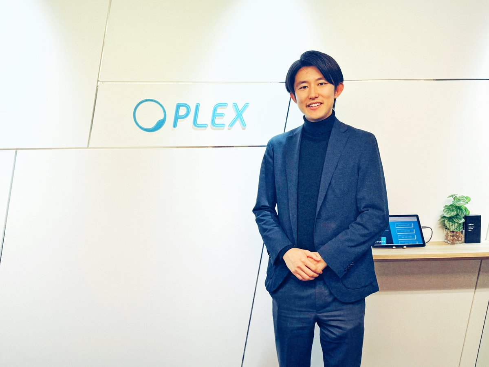

株式会社プレックス 代表取締役 黒崎 俊さん

### ⸺「プレックス」について教えてください。

黒崎：  
プレックスは、物流・建設・製造といった「インフラ産業やエッセンシャルワーカーの現場の課題」を解決している会社です。

**2018年に「ドライバー向け人材紹介」からはじめて、そこから2024年度の売上総利益（粗利）は約60億円に成長しています。**

メイン事業は、人材紹介の「プレックスジョブ」で、そのほかに「サクミル」というSaaSや、M&Aの支援事業などを行っています。

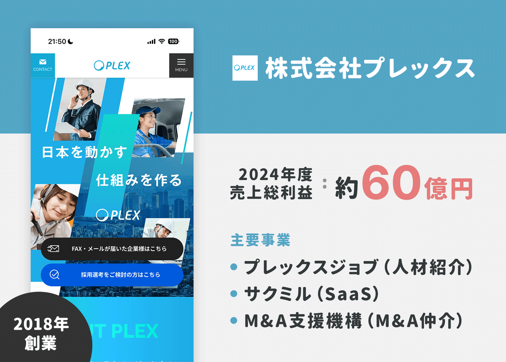

## LPを広告に出稿して「ニーズを検証した」

### ⸺どのように「1つ目の事業」を立ち上げたのかぜひ教えてください。

黒崎：  
はじめの事業は「ドライバーさん向けの人材紹介」でした。経済センサスなどを参考に「物流の企業さまの課題解決をしよう！」と決めましたね。

まずはニーズを検証しようと、簡単な「求人のLP」を広告に出稿してみて、「ドライバーさんが本当に集まるか？」を検証してみたんですよ。

**自分でつくった「手作り感のあるLP」を、GoogleやYahoo!の検索キーワード広告に出稿してみると、バッと申し込みがきました。当時は集客コストがかなり安くて、1登録者あたりの獲得コストは現在の1/10でした。**

それを見て「あれ、これは成立しそうだぞ」と。いまは当時の10倍以上のCPAになっています、参入時期って大事だなと。

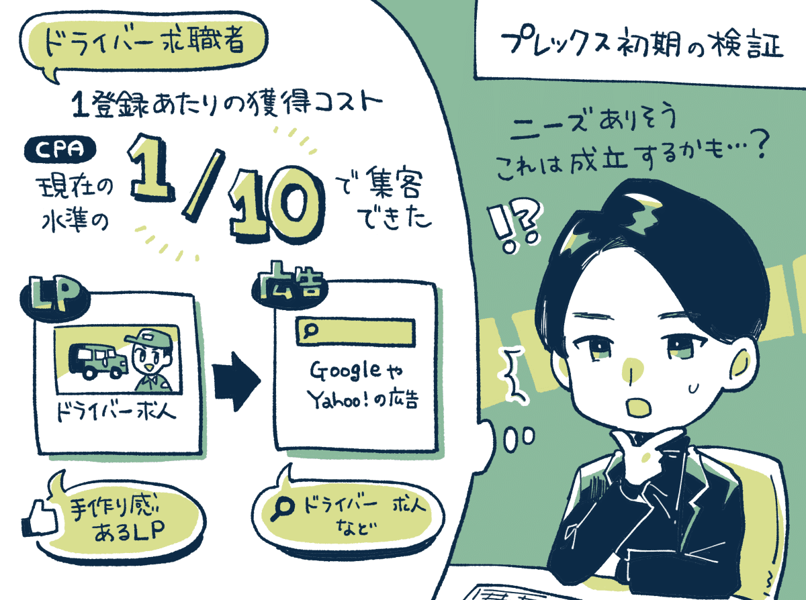

次に採用する側の「企業さんのニーズがあるか？」も調べてみました。

ニュースでもよく**「ドライバーが足りません！」と言っていますよね。でもそれって本当なのかな？と思って、物流会社さんに電話してみたんです。**

「こんにちは。ドライバーさんって採用されてますか？」と聞くと、「採用してるに決まってるじゃん！それ『今日はいい天気だね』っていうのと同じ。それくらい人が来ない。」と言われました。

「人がきたら嬉しいですか？」と聞くと「そんなの当たり前だよ！」みたいな感じで。採用側のニーズもめちゃくちゃあるんだなって。

このように、まずは「両者にニーズがあるか？」を検証してからスタートしましたね。

### ⸺ニーズを検証してから「人材紹介」をスタートしたんですね。

黒崎：  
はい。最初は「求人媒体の営業」からはじめて、その間に人材紹介の免許を3ヶ月ほどで取得して、そこから人材紹介の事業をスタートしましたね。

印象的だったのは、1社目のお客様は「段ボールの古紙」などを回収する会社さんだったのですが、1社成約すると2社3社と成約が続いたことでした。

**これどういう理屈かというと「本当に売れるのかな？」と疑いながら電話していると、自信のなさが伝わりますし、架電数も伸びないんですよ。**

「また断られた。何がダメなのかな…？」と悩みながら電話するよりも、1社でも成約して「売れる！」と思いながら電話したほうが1日の架電量が2倍とかになる。

また、僕以外のメンバーからも成約が生まれると「自分もいけるぞ！」と周りも思えるため、社内が売れる空気になっていきました。

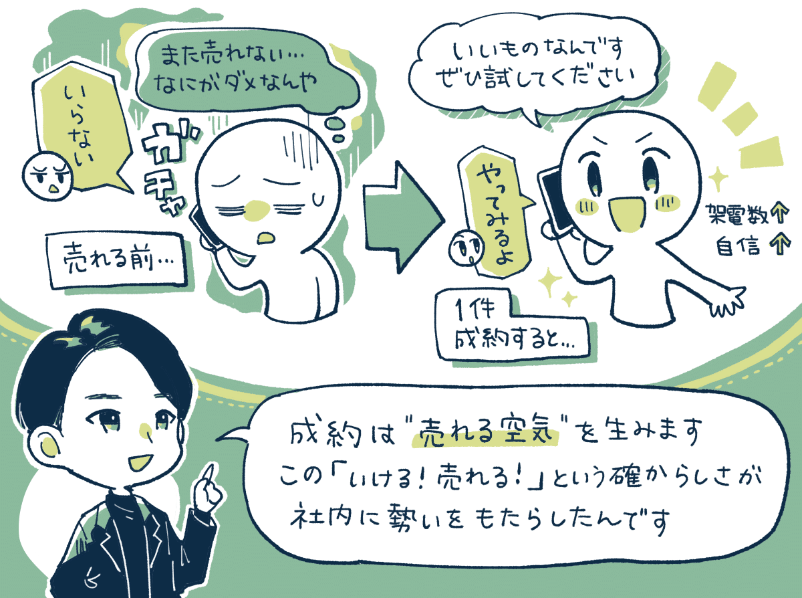

やっぱり、この「確からしさ」みたいなものが実感できたほうが、人間って少しでも頑張れるんだなって。

なので、**一瞬でも「これ…うまくいくかも！」という雰囲気を、仮に錯覚的だったとしてもいかにつくり続けられるか。**これがスタートアップや新規事業の立ち上げ時にはめちゃくちゃ大事なんだなと。

そこからは、提案のトークスクリプトを改善したり、オペレーションを改善したりしながら、徐々に規模を拡大していきました。

### ⸺ここを抑えたから「事業が伸びた」みたいな戦略のポイントがあれば知りたいです。

黒崎：  
人材紹介のビジネスって**「求職者さん」と「紹介先の企業さん」この2つのサイドが増えるほど、大きく事業が成長していきます。**

極端な話、一番はじめって「求職者さん1人」と「紹介先の企業さん1社」しかいない状態だから、なかなかマッチングしないわけです。

でも「求職者さん1万人」「紹介先の企業さん1万社」ここまで集められたらマッチング率も上がります。

つまり、紹介先の企業様が増えるほど、求職者様の登録数が増えるほど、成約数や売上が伸びていくので、一定まで数を積むことが大事。

実際にここまで行くのに2〜3年はかかったのですが、そこからはグングンと伸びていきました。

## SaaSはPDFを見せて「売ってから作った」

### ⸺2つ目の事業である「SaaS」はどう立ち上げたのでしょう？

黒崎：  
SaaSを立ち上げたときは、まず「IR1,000本ノック」をやって。売上と利益の大きい上場企業、約1,000社のIRをまとめていったんですよね。

そこから、売上や利益が出やすい「9つのモデル」に分類して、その中からSaaSを選択しました。

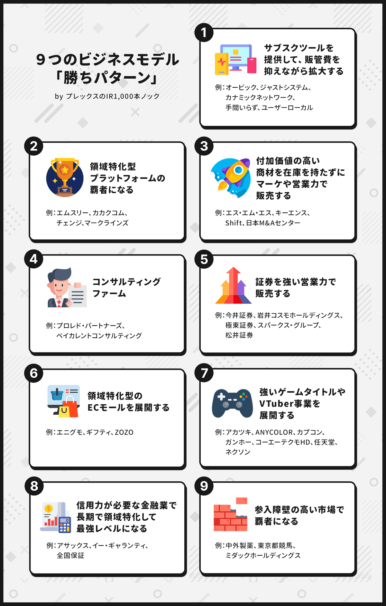

立ち上げの担当は新卒のメンバーだったのですが、**「プロダクトを開発していいですか？」と言っていたので「いや、それはダメ！笑」と答えました。**

「プロダクトをいきなり作ったらどうなると思う？」「え？わかりません」「大抵のものは売れないんだ。だから、作る前に売るんや！」と。

それで、コンセプトをまとめたPDFを作って、最終的には数十〜100社回ってお客さんにヒアリングをしたんですよ。プロダクトがない状態で。

**PDFにアイディアをまとめて「これ要りますか？これ買ってくれますか？」と聞いて回って、まずは「作る前に10件売ろう」と考えたんですね。**

最初はうまくいかず、業界や内容を変えてピボットもしました。3ヶ月聞いて「これはダメかも」となって。また3ヶ月、3ヶ月、3ヶ月と3回繰り返すと、ようやく今の「サクミル」の原型が見えてきました。

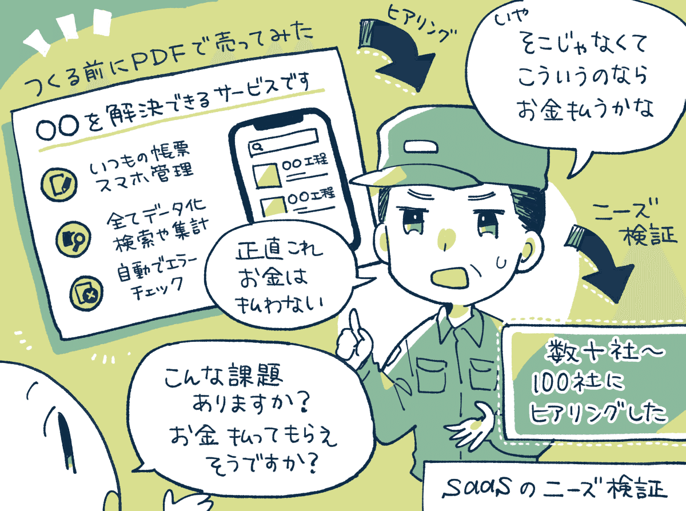

### ⸺サービスの内容はどう設計したんですか？

黒崎： **発言ベースで「課題」を教えてもらって。その中からお金を払ってくれそうな「上位5つの課題」をまとめてサービス化しましたね。**

工夫としては、**ヒアリングでは「このプロダクトどう思いますか？」と聞くのではなく「いくら払う価値がありますか？」と聞くようにしました。**

みなさんいい人なので「どうですか？」と聞くと「いいと思うよ！」という回答になりがちで、課題の大きさがよくわからないんですよ。

でも、**「いくら払いますか？」と金額まで踏み込んで聞くと、課題の大きさを可視化できるし、課題同士を比較できるようになるんです。**

例えば、「いや1,000円かな」となれば「少ないですね」となるし、「これは3万払っても価値あるね！」となれば「これは大きいぞ」とわかります。

つまり、この「金額の大きさ」って「課題の大きさ」とニアリーイコールになることが多くて。経営に与えるインパクトを指標化できるわけですね。

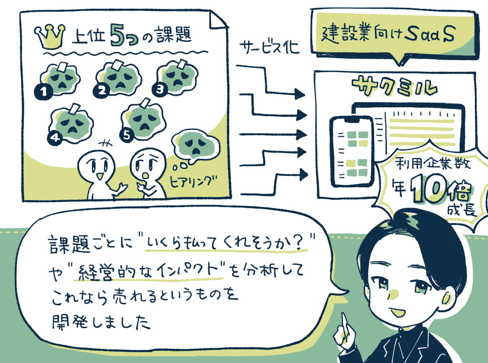

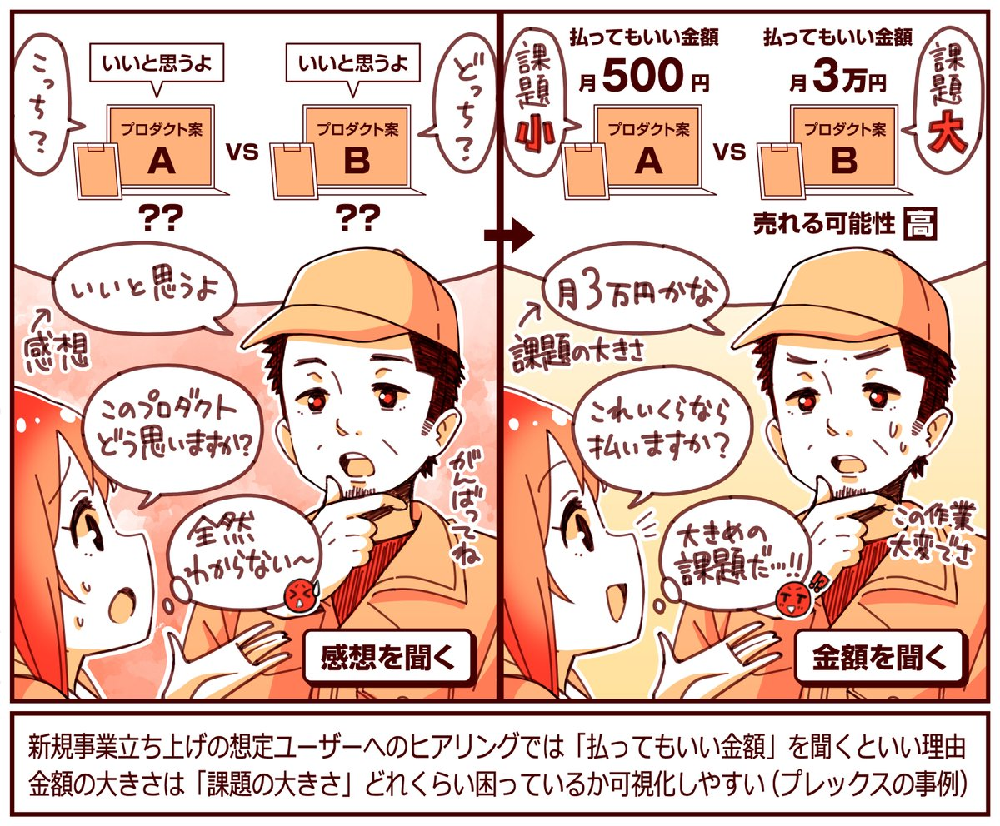

### ⸺なぜ「PDFでまず売ろう」という発想になったのでしょう？

黒崎：  
実は、人材紹介を立ち上げた後に、新規事業に3回ほど挑戦したのですが、全部「ニーズがなくて売れなかった」という経験をしたんですよ。

プロダクトを作ってからダメになると、エンジニアもテンションが下がる。そういう経験から「PDFでまず売る」という方法に辿り着いたんです。

そこから「サクミル」は、1年目は10社の契約でしたが、2年目には100社、3年目には1,000社と10倍ずつ成長していて、いい感じに伸びています。

## オペレーションの改善で「1年で7倍に成長」

### ⸺ほかに「売上成長につながった取り組み」があれば知りたいです。

黒崎：  
2021年から「人材紹介事業のオペレーションの改善」に取り組んだところ、約1年間で単月の売上総利益を7倍ほどに伸ばすことができました。

当時は月数千万円ほどでしたが、これが月数億円ぐらいまで伸びて、組織としてもパワーアップすることができましたね。

これは、過去の「古いルール」がそのままになっていたりしたので、不要なルールをなくしたり、より適切なルールに変えたのが大きかったです。

### ⸺なるほど！ はじめはどこに着目しましたか？

黒崎：  
まず着目したのは「人」です。現場のみんなに話を聞いていったんですよ。もうシンプルに「最近、ぶっちゃけどう？」みたいな。

すると、**みんなの愚痴が集まるんですよ。「いやー、正直このルールがあるとやりづらいです…。」「これ、意味ないと思うんすよね…。」とか。**

それをブワーッて集めていって。**これは「事業を伸ばすために必要だな」と思ったものに優先順位をつけながら手を打っていきました。**

この手順で「こんな施策どう？」って聞くと「え、めっちゃいいですね！」ってなるんですよ。なぜなら、愚痴をもとに作っているからです。笑

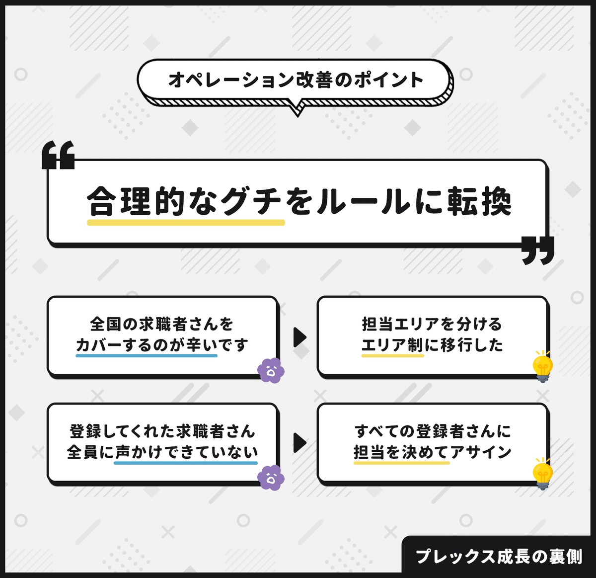

## オペレーションの改善は「順番」がいのち。

### ⸺そこからは、どのように改善を進めましたか？

黒崎：  
改善の項目を挙げたら、次に「順番」を決めました。オペレーションの改善ってこの順番がめっちゃ大事。

わかりやすい例は、**まずは「属人的なハイクオリティ」を確立させてから、それをマニュアル化して組織に落とし込む。この順番なんですよ。**

未熟な「30点の状態」で仕組み化しても意味がないので、属人的にまずは「80点の状態」を作って、それを仕組み化で再現します。

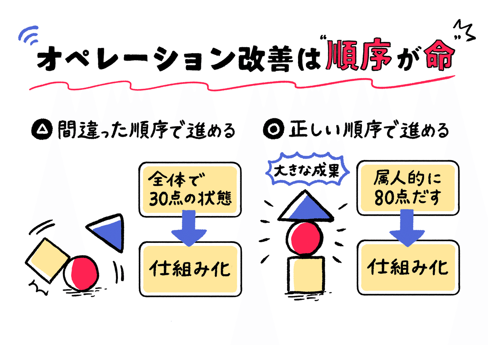

具体的には、**まずエネルギーの高い人たちを採用して、ルーキーたちを集めた「特命チーム」を作って、自由に成果を出してもらいました。**

例えば、元アイドル、元アミューズメントストアの店長とか、過去に何かを熱量を持ってやろうとしていた「未経験の若手」みたいな人を採用したんです。

それで、「いけます。自分やれます！」みたいな、勢いと熱量のある人を集めて、社内に新しい風を巻き起こしてもらったわけです。

**意識したのは「既存のチーム」と分けることです。理由は既存のチームには良くも悪くも「社内の当たり前」が浸透しているから**なんですよ。

例えば、「月の売上はこれくらい」「こうするのが当たり前だ」みたいな予定調和的なものがあり、そこと混ぜると既存の方法に染まってしまいます。

そのため、新人たちは「特命チーム」に配属し、不要なルールは無視してもらいながら、とにかく「君たちならいける！」と背中を押しました。

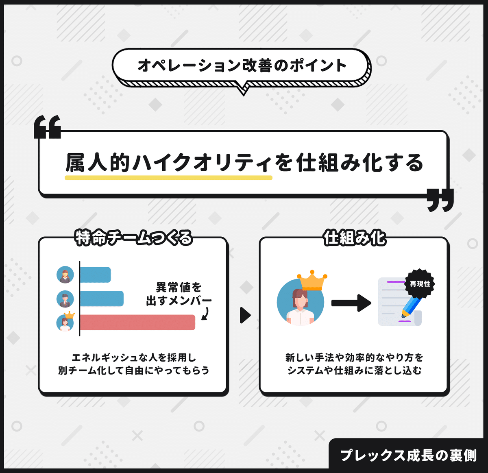

すると、**ホントに「異常値」を叩き出すメンバーが出てきます。最高記録を何倍も更新する人が出る。その人を今度は「観察」していくんですよ。**

例えば、社内システムを使わずに、謎のExcelで「お客様の状況」を管理して成果をあげている人がいました。電話するタイミングまで管理していたり。

そういう「これセンスいいな！」みたいな方法を見つけたら、それを社内のシステムなどに転用しました。

### ⸺オペレーション改善による「意外な効果」があれば知りたいです。

黒崎：  
面白かったのは「仕組み化で生産性が伸びる」これもあるけど、シンプルにスゴイ人がいると周りも感化されてパワーアップしたことです。

まず、**すごい成果をあげる人が現れると「なんであんなに結果が出せるの？めっちゃすごいね！」みたいに社内で話題になるわけです。**

すると、周りも「どうやるんですか？」と聞くようになる。具体的な方法を体感的に理解する人が増えると、既存のチームにも変化が起こる。

そういう流れで、既存メンバーも「こんなやり方があったんだ！」と学んでくれることで、全体のパフォーマンスが上がっていきましたね。

-----

【取材協力】  
株式会社プレックス：<https://plex.co.jp/>   
プレックスジョブ：<https://www.plex-job.com/>   
サクミル：<https://sakumiru.jp/>   
CEOの黒崎さん：[@shunkurosaki](https://x.com/shunkurosaki)   
黒崎さんのnote：<https://note.com/shunkurosaki>

【告知】プレックスさんではさまざまな職種で採用を強化中。ご興味ある方は下記サイトよりどうぞ。

[**株式会社プレックス｜中途・新卒採用 求人情報**
*株式会社プレックスは、エッセンシャルワーカーと企業をつなぐ採用プラットフォーム「プレックスジョブ」を運営するIT企業です。*
*plex.co.jp*](https://plex.co.jp/recruit)

> ※ 以降は、＋αの事例を6つほど『ここだけの話』として、note購読者向けにまとめています。ヒアリングで「本気度の高い回答」を引き出すコツ、新規事業の「立ち上げスピード」を加速させるポイント、提案の成約率を高めるトークスクリプトの工夫、などご興味あればご覧ください。

  

ダウンロード

 

copy

## ここから先は

2,074字
/
4画像

%22%20d%3D%22M-100-100h300v300h-300z%22%2F%3E%3C%2Fsvg%3E)

アプリやプロダクトの成功事例が学べるマガジンです。プロダクトの売上やユーザー数を伸ばしたい人にオススメです。成長プロダクトのインタビュー、効果のあったマーケティング施策、事例やデータなどが中心（月に7記事ほど）多くの過去記事も5年ほど遡って読めます。クレカ決済だと初月無料なのでお試しでもぜひ。

### [月刊アプリマーケティング](/m/mc375c9b46464)

¥2,000 / 月  
初月無料

プロダクト運営について学べるマガジンです。アプリやプロダクトの売上やユーザー数を伸ばしたい人にオススメです。月に7記事ほどお届けします。

購読手続きへ

%22%20d%3D%22M-100-100h300v300h-300z%22%2F%3E%3C%2Fsvg%3E)%22%20d%3D%22M-100-100h300v300h-300z%22%2F%3E%3C%2Fsvg%3E)%22%20d%3D%22M-100-100h300v300h-300z%22%2F%3E%3C%2Fsvg%3E)

3人が高評価

[ログイン](https://note.com/cd/login?redirect_to=https%3A%2F%2Fmarkelabo.com%2Fn%2Fnf4582555162e)

   

81

[%22%20d%3D%22M-100-100h300v300h-300z%22%2F%3E%3C%2Fsvg%3E)](/)

[アプリマーケティング研究所](/)

フォロー

プロダクトの成功事例を発信しているメディアです。2013年から約10年運営しています。取材相談はツイッターDM（@appmarkelabo）かメールにてどうぞ！info@appmarketinglabo.net