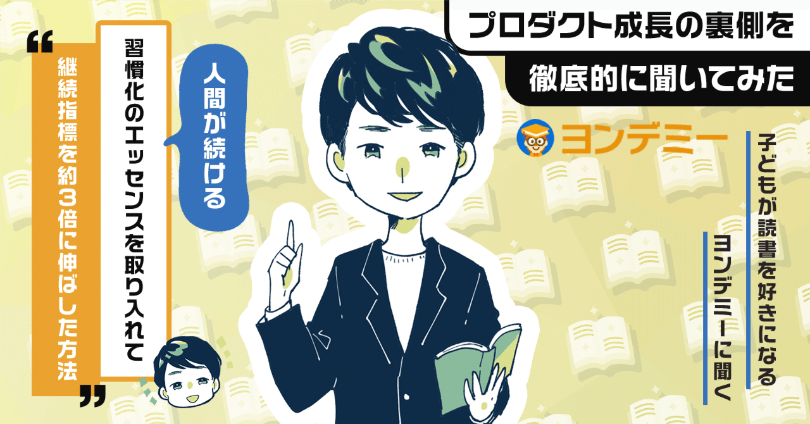  

# 東大生が考案した「子どもの読書」を習慣化するサービス「ヨンデミー」に80万件の本の感想が送られるまでの話。ユーザーの習慣化に貢献した3つの成功施策。

95

[%22%20d%3D%22M-100-100h300v300h-300z%22%2F%3E%3C%2Fsvg%3E)](/)

[アプリマーケティング研究所](/)

2025年5月26日 11:30

¥2,000/月

子どもが本を好きになる「ヨンデミー」さんを取材しました。

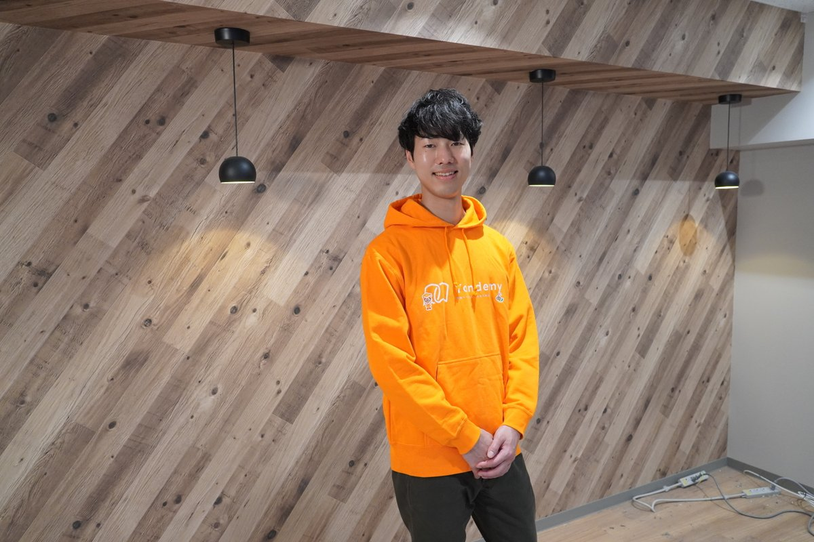

株式会社Yondemy 代表取締役 CEO 笹沼 颯太さん。東大在学中にヨンデミーを開発した。

### ⸺ヨンデミーについて教えてください。

笹沼：  
ヨンデミーは「読書は、一生モノの習い事」をテーマにした読書教育のオンライン習い事サービスです。

**累計会員数は2万人（無料会員を含む）を超えていて、これまでに80万件超の本の感想がヨンデミーを通して提出されています。**

AIの"ヨンデミー先生"というキャラクターが「読書の家庭教師」のように、おすすめの本を紹介したり読書のサポートをしてくれます。

有料会員の平均読書冊数は月に25冊。月額定額制で小学生を中心にご利用いただいています。

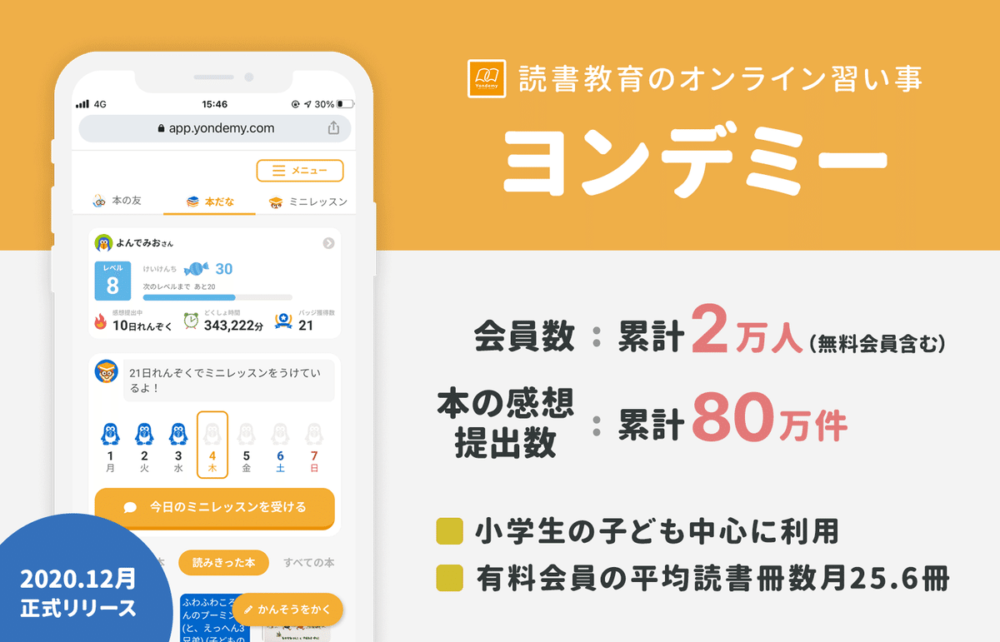

### ⸺ヨンデミーはどう生まれたのでしょうか。

笹沼：  
学生をしながら家庭教師のバイトをしていたときに、どのご家庭でもこんな質問を受けたんですよ。

**「先生、うちの子まったく本を読まないんです。先生はどうやって本を好きになったんですか…？」**

周りの友だちに話すと「あー、それ俺も聞かれる」「わたしも聞かれた！」みたいな反応で。家庭教師のバイトあるあるだったんですね。

**つまり「本を読め」という大人は多いけど、「どうしたら楽しく本を読めるのか？」を教えてくれる大人は周りにいなかった。**

子どもも親も、そこが一番知りたいのに、誰も答えを持っていない。なら、自分たちで仕組みをつくればいいんじゃないか。と考えたんですね。

### ⸺なるほど。事業アイディアが決まってからはどう進めましたか？

笹沼：  
まずは「この事業アイディアは成立するか？」を確認するために「仮説の検証をしよう」と考えました。

**検証したかったのは2点です。①本を読まない子にも本を好きになってもらうことができるのか。②そして親はお金を払ってくれるのか。**

まずは、家庭教師を募集する掲示板で「東大生が無料で家庭教師をします！ただし指導方法はお任せください。」みたいな感じで投稿しました。

それで、応募者に「1ヶ月無料で国語の指導をします」と伝えつつ、週に1回読書の指導をしてみたんです。

例えば、LINEで「おすすめの本」を送って、Googleフォームで「本の感想」を教えてもらって、その感想をスプレッドシートにまとめて「読書の記録」を親が見られるようにしました。

結果としては、**9人中5人が「月額3,000円を払っても続けたい」と言ってくれて。子どもが本を好きになってくれる手応えも得られました。**

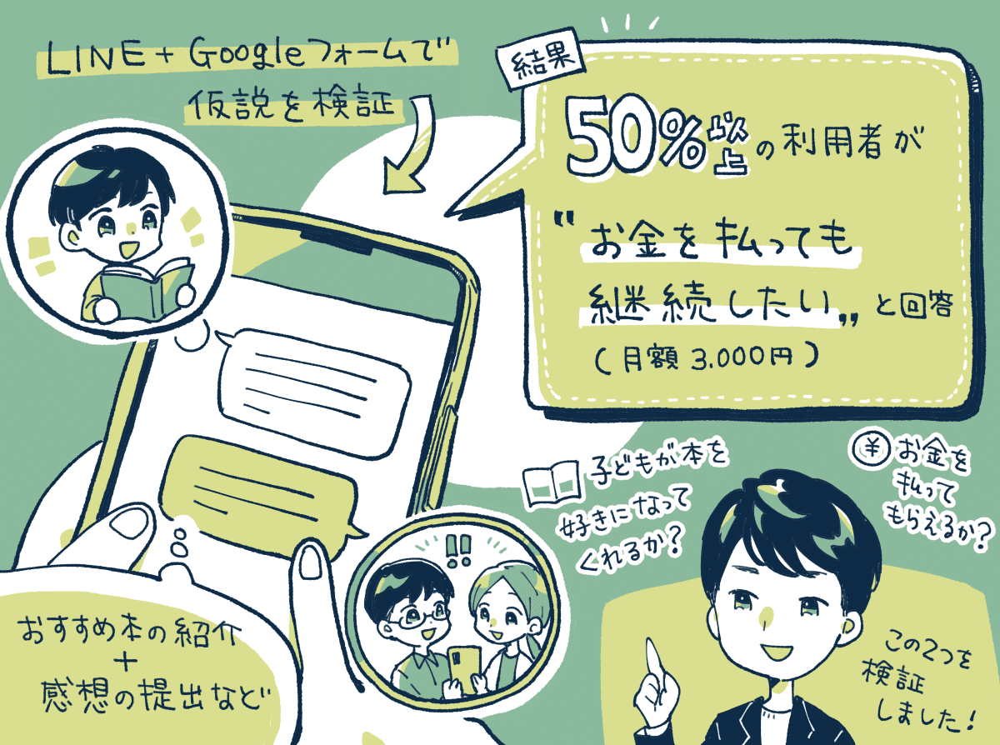

はじめは家庭教師の形式でやってみて、徐々に「オンライン化＋自動化」を進めた。

この検証を経て、LINEとGoogleフォームでお金を払ってもらえるなら、Webアプリにしたらもっと便利になるはずだよねと。

そこから、開発をはじめて会社を作り資金調達をして2020年末に「ヨンデミー」を正式リリースしました。

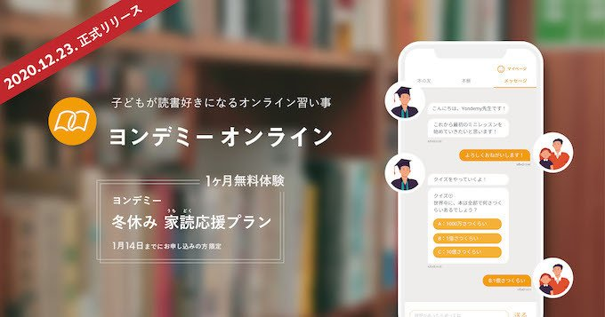

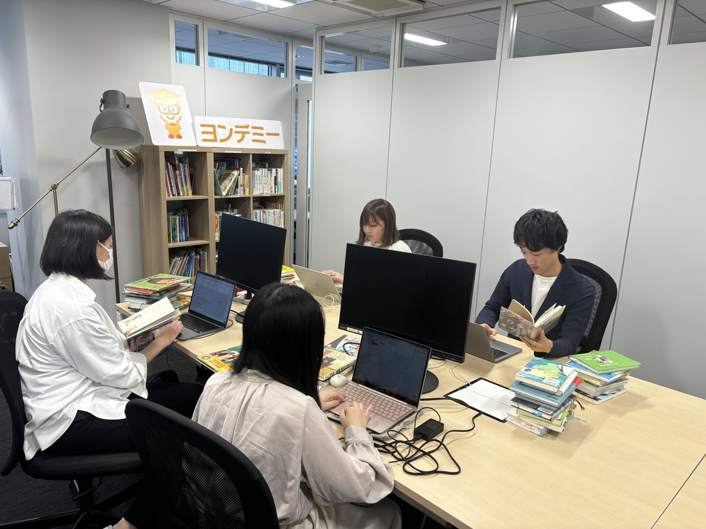

子どもたちに「おすすめの本」を紹介するために、初期から本をひたすら読んで、データベースに登録している。本の難しさのレベル、主人公に共感できるか？（主人公の性格）など。

### ⸺リリースした後の「手応え」はどうでしたか？

笹沼：  
嬉しいことに割と手応えがありました。アメブロの教育ブロガーさんの間で口コミが広まったためです。

リリースから半年弱の段階で、口コミによる自然流入で成長して、継続率もめちゃくちゃ高く、VCから追加で資金調達もできました。

ところが、2021年の資金調達後に「東大在学中の起業家が1億円を調達！」のように**メディアで話題にしていただき一気に流入が増えると、無料お試し後の「有料登録率」がいきなり約1/3に下がってしまって。**

最初は何が起きているかわかりませんでしたが、調査をしてみるとユーザー層がものすごく変わっていることに気づきました。

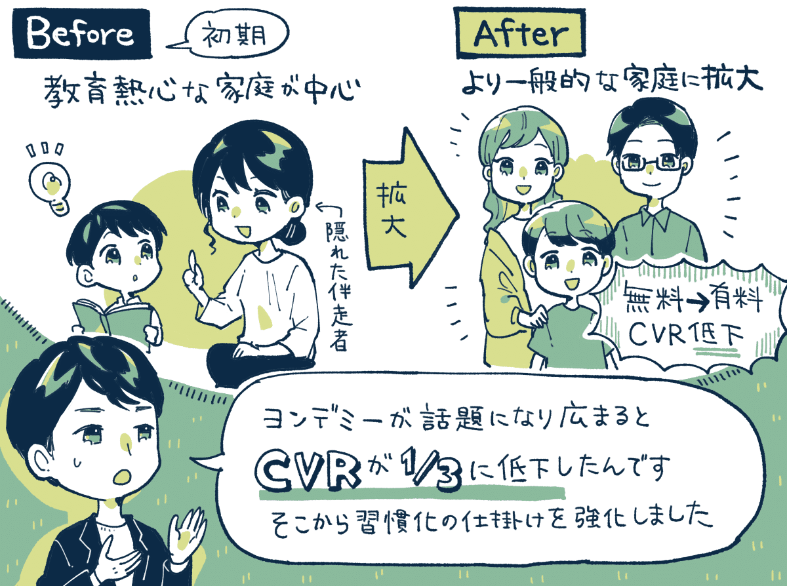

初期のユーザーさんたちは、教育ブログを熱心に読んでいるような、子どもの教育的コントロールが上手な保護者さんが多かったんです。

例えば、**子どもが本を読むように「ヨンデミー先生からチャット来てるよ」とか声掛けをしてくれたり、子どもの隣で伴走してくれていた。**

それ以降のユーザーさんたちは、より一般的な家庭が多くなったというか、必ずしも教育熱心なユーザーさんばかりではなくなってきた。

つまり、声をかけて本を読ませる役割も、ヨンデミーで代替しないと広がらないことに気づいて。2022年に大幅なリニューアルをしたんです。

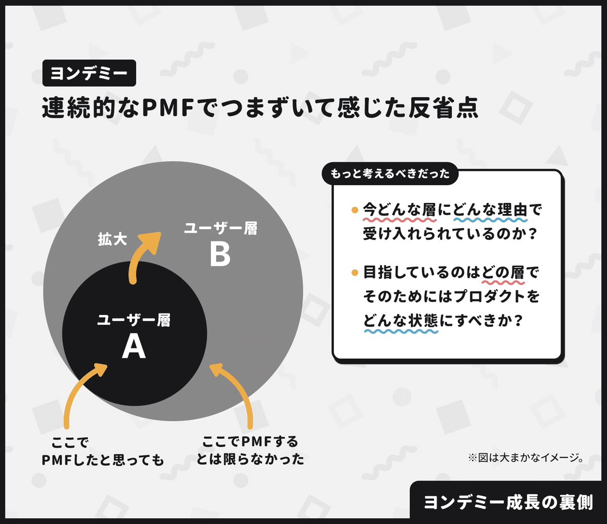

初期の手応えから「これはPMFに到達した！」と判断したが、PMFは何度も迎えるという前提で「ユーザー層と課題の変化」をもっと考えるべきだった、とのこと。

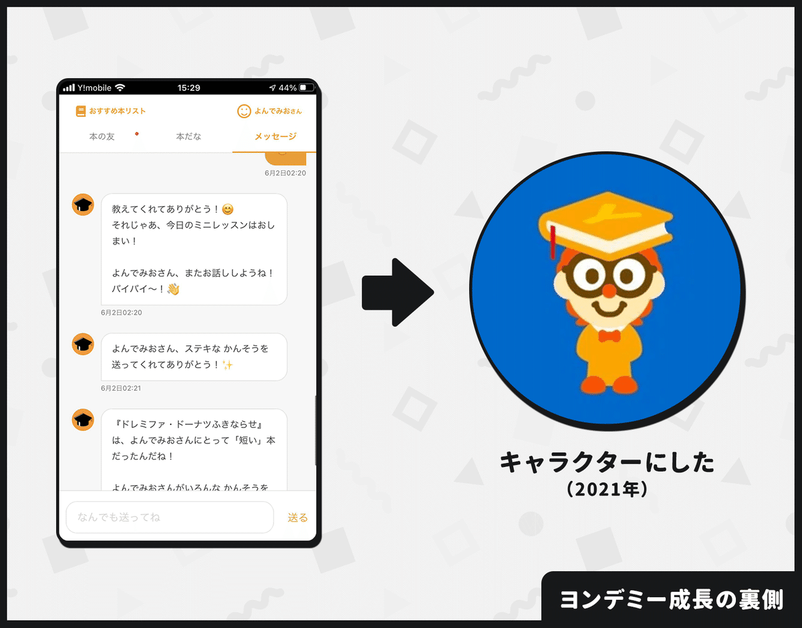

2021年には「ヨンデミー先生」をキャラクター化した。想像以上に子どもたちがAI先生を「本物の先生」のように認識してくれたため。

### ⸺リニューアル後の「指標」はどう変化しましたか？

笹沼：  
継続率が大幅に上がりましたね。**最初の1週間で4回以上レッスンを受けた人の比率が2〜3倍になりました。**

大きな要因は2つ。1つはストーリーの活用です。子どもが夢中になるものには「ストーリー」があります。例えば、ポケモンマスターを目指す、ピーチ姫を助け出すみたいな感じです。

ヨンデミーでは「伝説の読書家を目指そう。本を読むと、本が救われる。」というストーリーを取り入れました。**すると、子どもたちが「本を助けたい！」と言ってくれるようになった。これがすごく大きかった。**

もう1つは「習慣化の理論」を取り入れたこと。海外のダイエットや禁煙外来などの習慣化の研究を調べて、サービスに取り入れました。

例えば、効果があったのは「最初のハードルを思い切って下げる」でした。**ヨンデミーって「本を読ませるサービス」ですが、はじめの1週間は本を読まなくても良くして、レッスンを受けるだけにしたんですよ。**

あとは、最初の1ヶ月間のオンボーディングも作り直したところ、これも色々な良い影響が出ました。

このように「習慣化の理論」を取り入れたことで、読書を続けるユーザーが大幅に増えていき、読書の定着率が向上していきましたね。

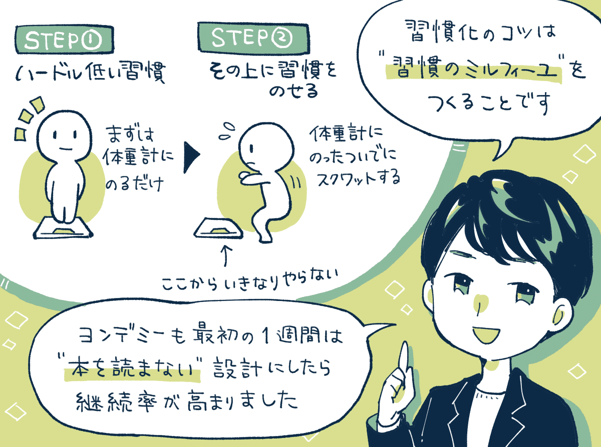

## ヨンデミーの3つの成功施策。

### 成功施策①：「圧倒的に効果が高かったコピーの発見」

笹沼：  
ヨンデミーの広告で**突出した成果を出したコピーは、「1日2時間のYouTubeが1日二冊の読書になる」というものなんですね。**

このコピーが成功したのは「課題＋サービスの体験価値」をセットで伝えられたのが良かったのかなと考えています。

以前から「YouTubeを見過ぎてる」「YouTubeをやめさせたい」といった課題にフォーカスするコピーを試していたのですが、クリック率は高いものの有料転換率はかなり悪かったんですよね。

なぜなら、**YouTubeはやめさせたいけれど、解決方法として「本を読ませること」をマストだと思っていない人にも届いていたからです。**

そこから「2時間のYouTubeが二冊の読書になる」というコピーに変えたことによって「本を読ませたい」と思っている人に響くコピーになった。

結果としても、**広告のコンバージョン率が大幅に伸びただけではなく、Webアプリのエンゲージメントや継続率にまで良い影響を与えました。**

このフレーズは書籍の帯にも採用したほどです。これは数え切れないほど広告のコピーの検証を続けた結果として生まれたものでした。

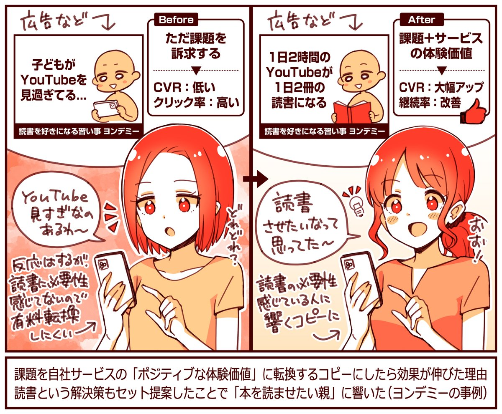

### 成功施策②：先生と「じゃんけん」したらレッスンの継続率が向上。

笹沼：  
Webアプリの改善事例としては、レッスンの締めくくりに**「じゃんけん」を組み込んだところ、翌日以降のレッスンの継続率が大きく伸びました。**

ヨンデミー先生と「じゃんけん」をするだけで継続が伸びたんです。これを入れたときは驚きましたね。子どもたちが「明日もレッスンを受けたい！」と思える理由を増やせたのが良かったのかなと。

最初のじゃんけんは勝ちやすくする、過度に負け続けないようにするなど、子どもが楽しめるような工夫も行なっています。

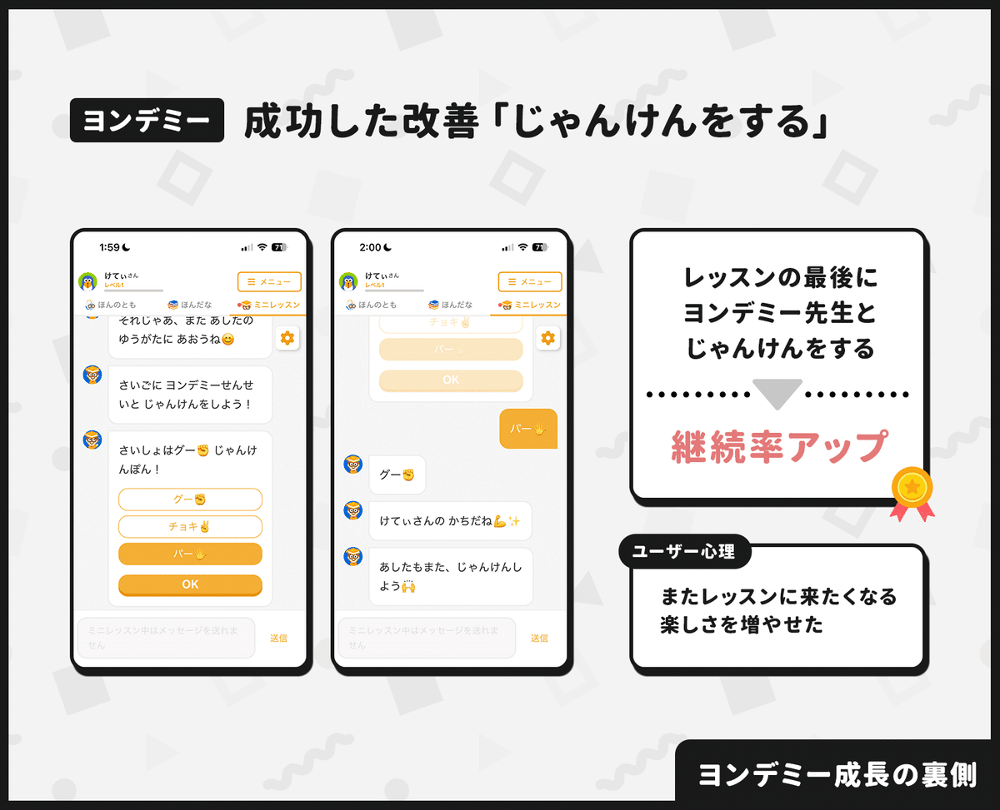

### 成功施策③：レッスンの後に「次の約束」をしたら継続率が向上。

笹沼：  
ミニレッスンの最後に、**ヨンデミー先生から「次はいつ会いにきてくれる？」と話しかけて、約束をしてもらうとレッスンの継続率が上がりました。**

単に「次はいつ来てね！」と伝えられるよりも、自分から能動的に約束してもらったほうが、約束の効力が高まるのかなと思います。

また、約束の選択肢は「直近の約束」のほうが効果が高かったです。**1週間分の日にちを表示するよりも、例えば「明日」「明後日」のように短期で約束をしてもらうほうがレッスンの継続につながりました。**

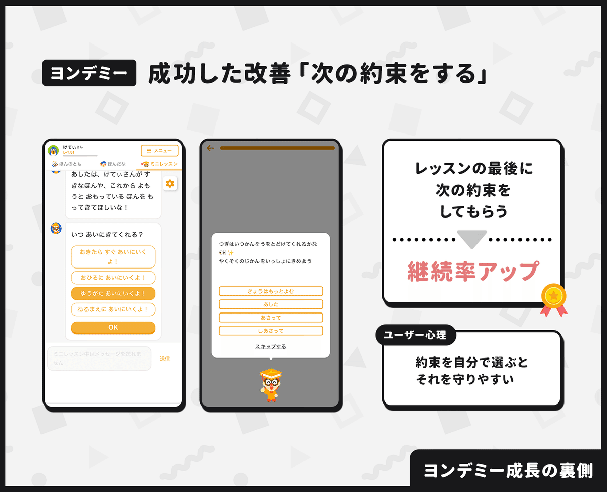

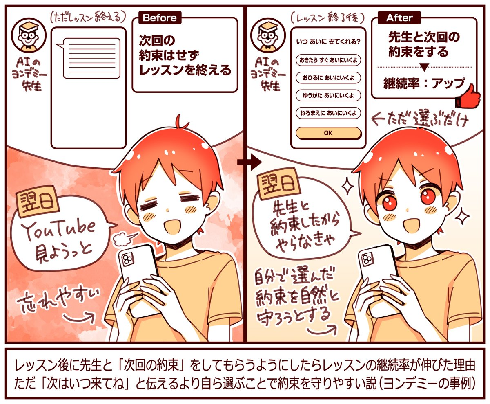

-----

【取材協力】  
株式会社Yondemy：<https://corp.yondemy.com/>   
ヨンデミー：<https://lp.yondemy.com/>   
代表の笹沼さん：[@souta\_sasanuma](https://x.com/souta_sasanuma)

【告知】ヨンデミーのことをより詳しく知りたい方は、ぜひ「REAL VALUE」の出演動画を見てほしいとのこと。気になった方は以下よりどうぞ。

> ※ 以降は、＋αの事例を5つほど『ここだけの話』として、note購読者向けにまとめています。登録完了率を高めたオンボーディングの設計、効果の高いコピーを作るためのポイント、LTVの高いユーザーの特徴などご興味あればご覧ください。

  

ダウンロード

 

copy

## ここから先は

1,753字
/
4画像

%22%20d%3D%22M-100-100h300v300h-300z%22%2F%3E%3C%2Fsvg%3E)

アプリやプロダクトの成功事例が学べるマガジンです。プロダクトの売上やユーザー数を伸ばしたい人にオススメです。成長プロダクトのインタビュー、効果のあったマーケティング施策、事例やデータなどが中心（月に7記事ほど）多くの過去記事も5年ほど遡って読めます。クレカ決済だと初月無料なのでお試しでもぜひ。

### [月刊アプリマーケティング](/m/mc375c9b46464)

¥2,000 / 月  
初月無料

プロダクト運営について学べるマガジンです。アプリやプロダクトの売上やユーザー数を伸ばしたい人にオススメです。月に7記事ほどお届けします。

購読手続きへ

%22%20d%3D%22M-100-100h300v300h-300z%22%2F%3E%3C%2Fsvg%3E)%22%20d%3D%22M-100-100h300v300h-300z%22%2F%3E%3C%2Fsvg%3E)%22%20d%3D%22M-100-100h300v300h-300z%22%2F%3E%3C%2Fsvg%3E)%22%20d%3D%22M-100-100h300v300h-300z%22%2F%3E%3C%2Fsvg%3E)%22%20d%3D%22M-100-100h300v300h-300z%22%2F%3E%3C%2Fsvg%3E)

5人が高評価

[ログイン](https://note.com/cd/login?redirect_to=https%3A%2F%2Fmarkelabo.com%2Fn%2Fn52622336530b)

   

95

[%22%20d%3D%22M-100-100h300v300h-300z%22%2F%3E%3C%2Fsvg%3E)](/)

[アプリマーケティング研究所](/)

フォロー

プロダクトの成功事例を発信しているメディアです。2013年から約10年運営しています。取材相談はツイッターDM（@appmarkelabo）かメールにてどうぞ！info@appmarketinglabo.net