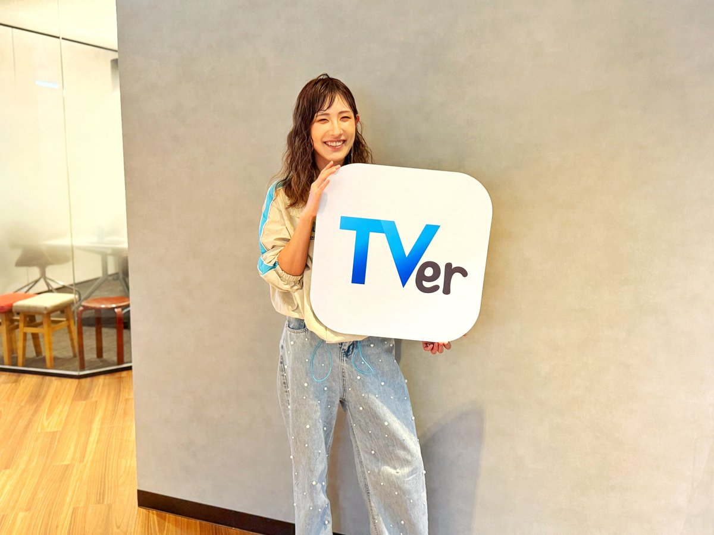
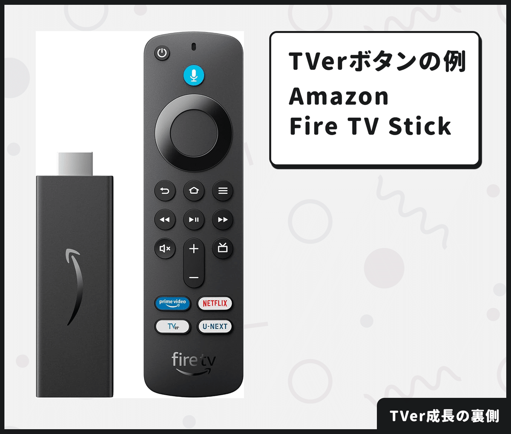
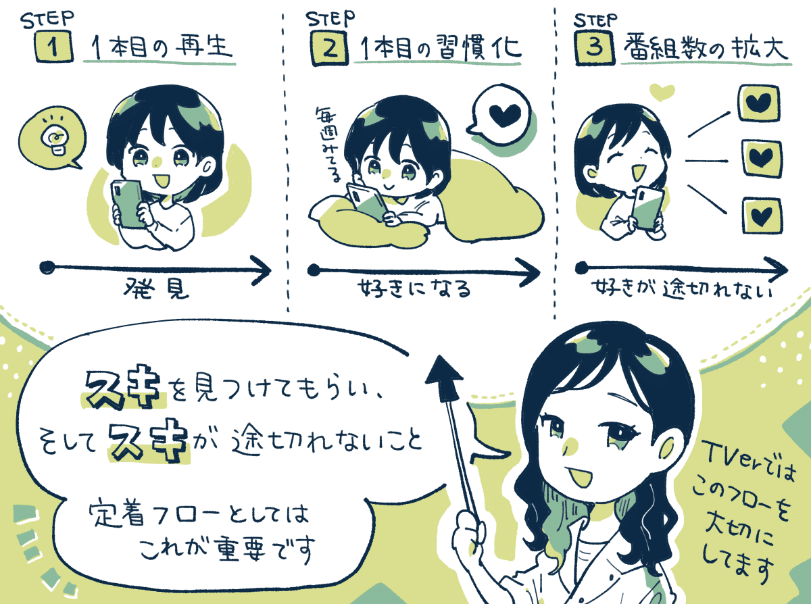
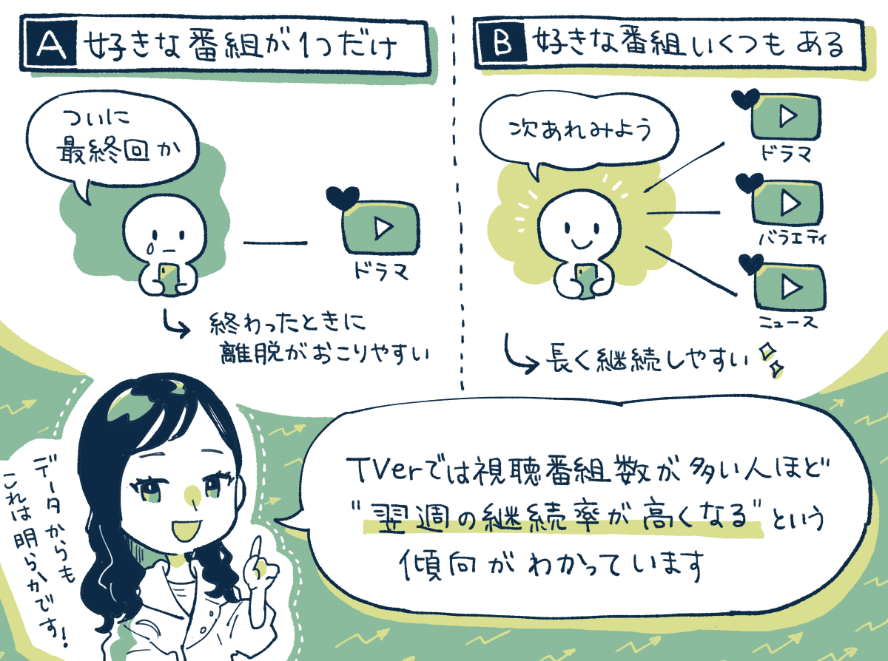
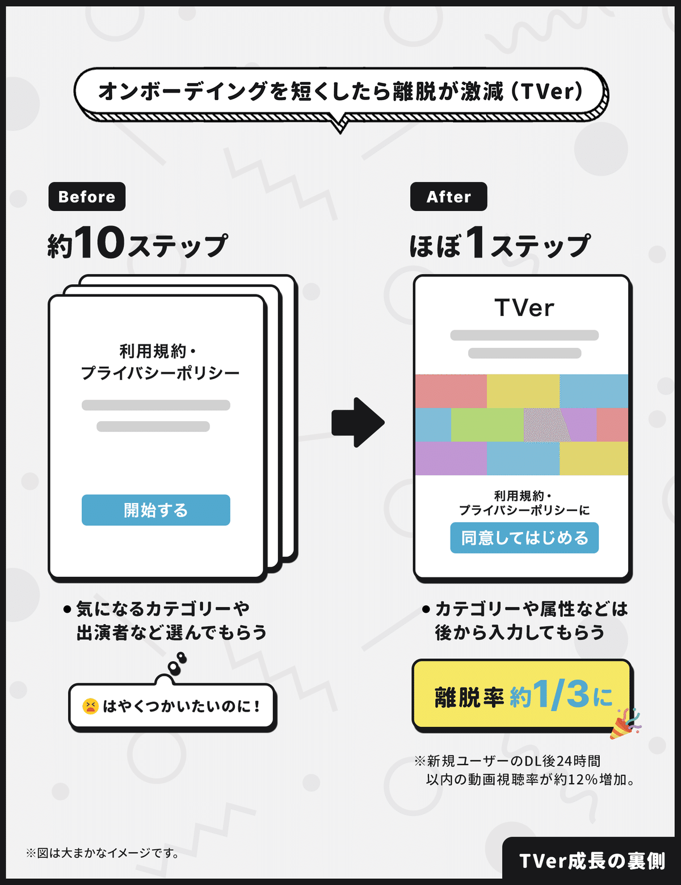
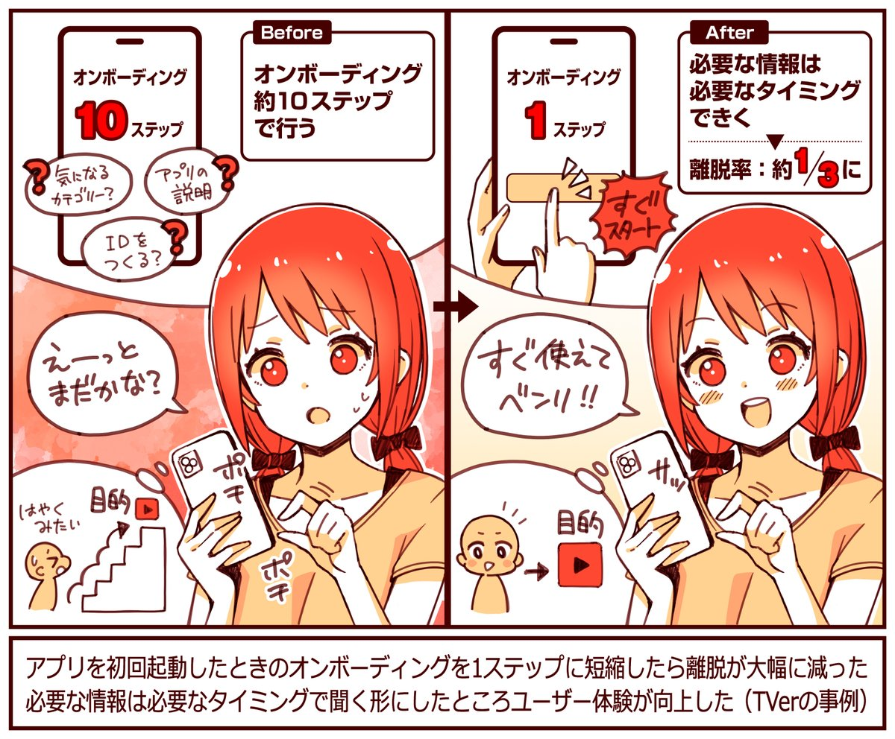
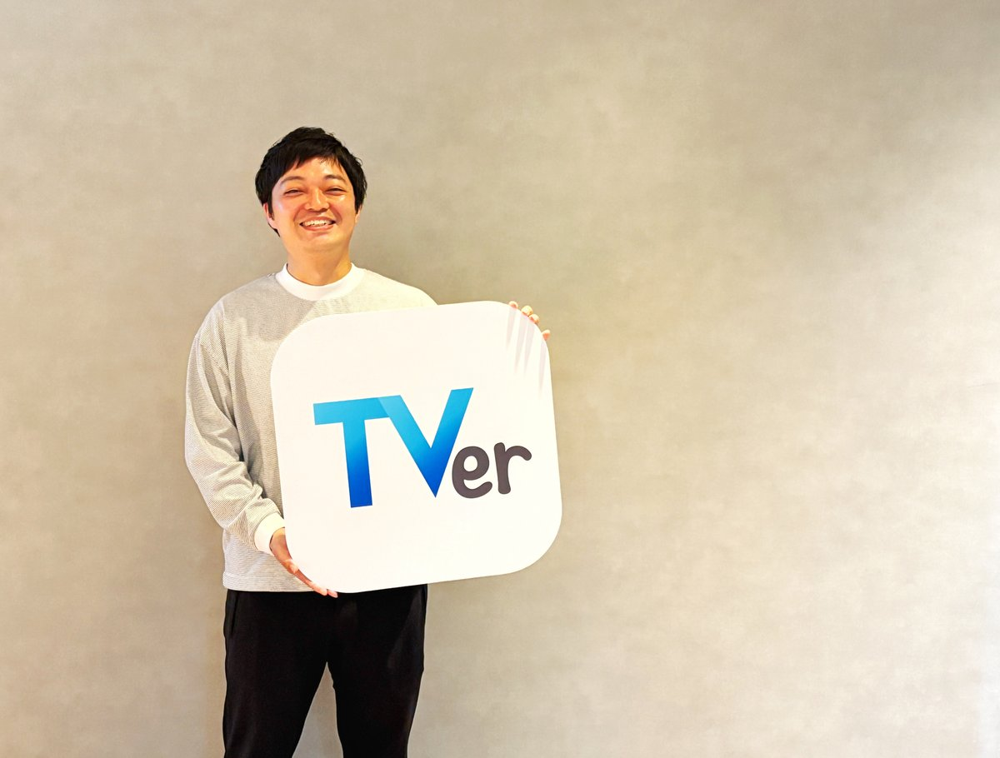
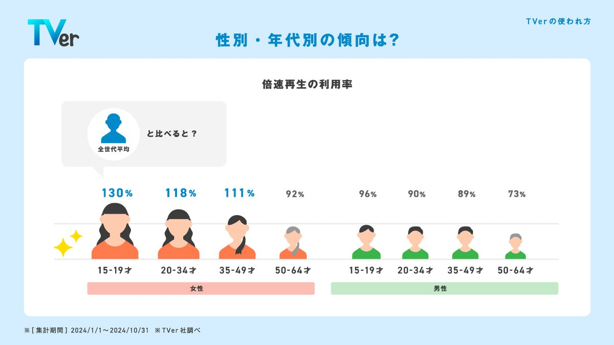
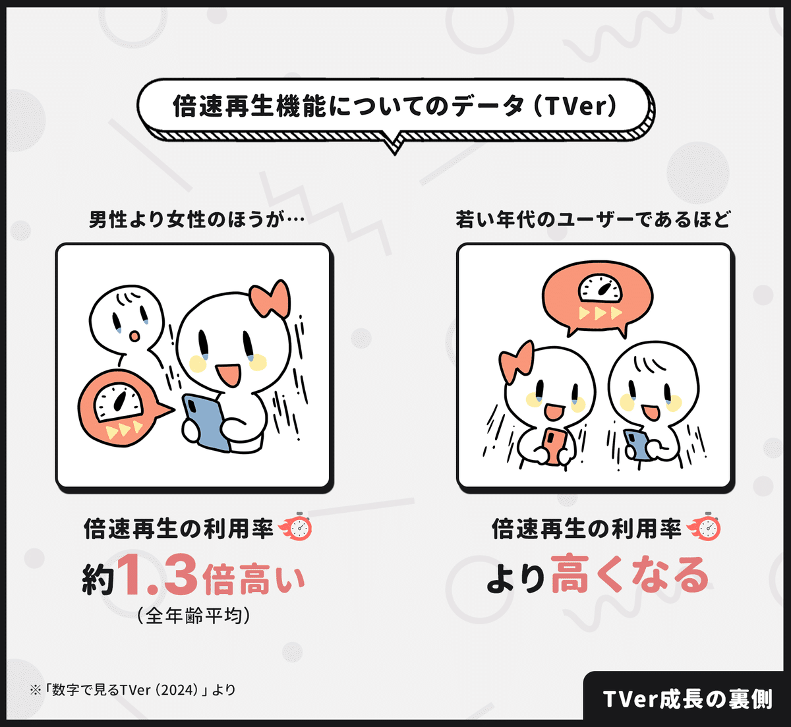

  

# 月間4,100万のユーザーが使う「TVer」に聞く「定着のための3ステップ」の話。アプリのオンボーディングの「シンプル化」で離脱を1/3まで減らすことができた施策。

44

[%22%20d%3D%22M-100-100h300v300h-300z%22%2F%3E%3C%2Fsvg%3E)](/)

[アプリマーケティング研究所](/)

2025年5月29日 11:30

¥2,000/月

急成長中の「TVer」さんを取材しました。

株式会社TVer サービス事業本部 サービス推進部 部長補佐 プロダクトマネージャー 松岡 綾乃さん

### ⸺「TVer」について教えてください。

松岡：  
2015年に開始した、民放公式テレビ配信サービスです。月間4,100万以上のユーザーさん（ユニークブラウザ）に使っていただいています。

**累計のアプリダウンロード数としては8,500万を超えていて、2024年12月には月間の動画再生数が4.96億回を突破しました。**

特徴としては定着率が高く、週1回以上見ているユーザーさんがかなり多くの割合を占めていることです。

成長要因としては、コンテンツラインナップの充実度に連動しているのと、対応デバイスの拡大が最も大きいと思います。盤石になりつつあるドラマ以外にもバラエティやスポーツを見る人などが積み重なって成長しています。

### ⸺伸びているデバイスなどはありますか？

松岡：  
コネクテッドTVからの視聴が伸びていますね。再生数で見ると全体の40％近くを占めるほどになっていて。

スマホアプリと比較しても、**コネクテッドTVは「定着率・1ユーザーあたりの再生数、見ている番組数」が高いことがハッキリわかっています。**

理由は大きく2つあって。**1つは「落ち着いた状況」で見やすいのと、あとは「複数人数で視聴される」可能性があるため、必然的にそうなるのかなと。**

やっぱり、コネクテッドTVは「リモコンのTVerボタン」をポチっと押したらすぐ見られるというのも非常に大きいと思います。

コネクテッドTVからの**アクセスログを見ても、リモコンのTVerボタン経由の流入ってものすごく多いんですよ。**

リモコンにボタンを配置してくださるメーカー様が増えたのは、サービスの成長によって、皆様にTVerを認知していただいた結果というのもあります。

またボタンを置いてもらえた結果、TVerユーザーの利用や定着もさらに増していった側面もあり、良い成長サイクルが回っているなと感じます。

### ⸺TVerに定着してもらうために「意識していること」はなんですか？

松岡：  
定着してもらえるまでには、大事なステップが3つあります。好きなものを見つけてもらって縦に深め、それを横に広げていくイメージです。

1. **まずは「1本目の番組」を再生してもらう。（1本目の再生）**
2. **その1本が「いつも見る番組」になる。（1本目の習慣化）**
3. **「見たい番組」をどんどん広げてもらう。（番組数の拡大）**

そのため、まずは番組に出会ってもらい、それを好きになってもらって再生につながるかも非常に重視しているところです。

### ⸺どうして「番組数の拡大」は大事なんですか？

松岡：  
**1個だけしか好きなものがないと、ユーザーさんはそれがなくなると離脱しちゃうからなんですよ。**

例えば、あるドラマにハマったとしても、最終回を迎えてその次のクールに気になるドラマがないと、どうしても離脱してしまう。

しかし、ニュースやバラエティ番組も見ていたら、クールの間の端境期にも見にくるモチベーションが続くので継続してくれやすくなる。

つまり、**まず1つ好きなものができること、そこから好きなものが途切れないことが、定着までのきれいなフローとして見えているんですよ。**

### ⸺なるほど、それは納得感があります。

松岡：  
はい。実際にヘビーユーザーの方ほど「見ているジャンル数」が多く、視聴番組数が多ければ多いほど、翌週の継続率が高い傾向も出ていますね。

ドラマだけを見ている人よりも、ドラマもバラエティもアニメも見ている人のほうが継続率が高くなりやすい。そのため「平均の視聴番組数」という指標も継続性を高めるために重要です。

あと、**カテゴリーと「それを好きな層」って連動していて。ドラマ好きな人がいきなりスポーツをガンガン見るケースってあまりないんですね。**

つまり、スポーツが好きな人に来てもらうなら、スポーツ番組のラインナップを充実させる必要がある。

TVerも初期は「ドラマを見る人」が中心でしたが、バラエティやスポーツの番組が増えることで、ユーザー層が厚くなって成長しているんです。

### ⸺他には「どんな指標」をよく見ていますか？

松岡：  
**主に追っているのは「週間のユニークブラウザ数」です。これは1週間あたりのアクティブユーザー数みたいな感じですね。**

SNSだと1日のアクティブユーザー数を見たりしますよね。動画配信サービスだと1ヶ月間のアクティブユーザー数を見たり。

でも、TVerは1週間単位で見ます。なぜなら、**これはTVerの最大の特徴でもあるのですが、体験のサイクルが「週次のサイクル」だからなんです。**

厳密にはそうではないパターンもありますが、基本的には1週間に1回新しく番組が公開されて、1週間経つとそれが消えてしまう。

そのため、ユーザーさんの体験サイクル的にも「週次のサイクル」で指標を追うべきだなと考えています。

### 成功施策①：オンボーディングの改善

### ⸺プロダクトの改善につながった「成功施策」を教えてください。

松岡：  
TVerでは、オンボーディングにおける「ステップ数」を、なるべく短くする変更を行ったところ、離脱率を大きく下げることができました。

**これまではウォークスルーが約10枚ほどあったのですが、思い切って1枚に減らしたところ、離脱率を約1/3まで減らすことができたんです。**

削ったステップの中には、「気になるカテゴリーを聞く」「ID登録を案内する」などがありましたが、これは必要なタイミングで聞くようにしました。

また最初の離脱率が減ったことで、**新規ユーザーさんの「ダウンロードから24時間以内」の動画視聴率が約12％増える効果もありましたね。**

TVerってダウンロードして立ち上げたタイミングで、ユーザーさんにはもうほぼ高確率で「見たい番組」があるはずなんですよ。

つまり、どんなサービスかはわかっていて、何かを見たいからはじめる方が多くて、「早く見たい！」というモチベーションが高い。

なので、見ないまま離脱されてしまうよりは、1回見てもらってTVer好きだなとなってから教えてもらうほうが適切だと判断しました。

### 成功施策②：プッシュ通知に画像をつけた。

株式会社TVer サービス事業本部 コンテンツPR部 後藤 雄大さん

後藤：  
リッチプッシュ通知という**「画像付きのプッシュ通知」を送ると、通知からの視聴開始率（CVR）が平均1.25倍高くなる、という結果が出ました。**

恐らく、画像をつけたことで「本編のイメージがちょっと湧いた」みたいな感じで、ユーザーさんの態度変容が一定見られたのかなと。

番組のサムネイルを使用したり、エピソード単位で出すこともできるので、内容によって最適なものを出しわけています。

TVerでは、プッシュ通知を「直接開封から動画が再生されたか？」を指標にしていますね。再生まで寄与したかまで見るためです。

### ⸺TVerでは「倍速視聴」のデータも分析しているそうですが、ぜひ詳しく教えてください。

松岡：  
TVerにおいて、性別・年代別の「倍速再生の利用率」を調べてみたところ、以下のような傾向がデータからわかりました。

① 年代が若ければ若いほど「倍速再生」の利用率は高くなる。  
② 男性よりも女性のほうが「倍速再生」の利用率は高くなる。全年齢平均で約1.3倍の差がある。

**最も若い10代ユーザー（15-19歳）で比較しても、男性よりも女性のほうが約1.3倍ほど「倍速再生の使用率」が高くなっています。**

これはあくまで仮説ですが、女性は同じシーズンの中で「複数のドラマ」を視聴するなど、多くのコンテンツを追う傾向があるためなのかなと。

限られた時間の中で、複数のドラマのストーリーを視聴しようとすると自然と倍速再生が使われやすい、ということなのかもしれません。

---

【取材協力】  
株式会社TVer：<https://tver.co.jp/>   
TVer：<https://tver.jp/>   
株式会社TVer [松岡 綾乃さん](https://x.com/y_a_j_i)、後藤 雄大さん、広報の永友さん

【告知】TVerさんでは各職種で採用中。マーケターやデータアナリストやエンジニアなど探しているそう。ご興味あれば下記サイトからご覧ください。

[**株式会社TVer 採用サイト**
*株式会社TVer採用サイトです。福利厚生や職種紹介、社員インタビューなど様々な採用向け情報を紹介しています。*
*recruit.tver.co.jp*](https://recruit.tver.co.jp/)

> ※ 以降は、＋αの事例を5つほど『ここだけの話』として、note購読者向けにまとめています。視聴中の番組にラベルを表記して再生率を伸ばせた工夫、ユーザーを視聴頻度でわけて分析する方法、コンテンツのジャンルにより適切な通知タイプが変わる話、などご興味あればご覧ください。

  

ダウンロード

 

copy

## ここから先は

2,110字
/
3画像

%22%20d%3D%22M-100-100h300v300h-300z%22%2F%3E%3C%2Fsvg%3E)

アプリやプロダクトの成功事例が学べるマガジンです。プロダクトの売上やユーザー数を伸ばしたい人にオススメです。成長プロダクトのインタビュー、効果のあったマーケティング施策、事例やデータなどが中心（月に7記事ほど）多くの過去記事も5年ほど遡って読めます。クレカ決済だと初月無料なのでお試しでもぜひ。

### [月刊アプリマーケティング](/m/mc375c9b46464)

¥2,000 / 月  
初月無料

プロダクト運営について学べるマガジンです。アプリやプロダクトの売上やユーザー数を伸ばしたい人にオススメです。月に7記事ほどお届けします。

購読手続きへ

[ログイン](https://note.com/cd/login?redirect_to=https%3A%2F%2Fmarkelabo.com%2Fn%2Fna6b0c37471dc)

   

44

[%22%20d%3D%22M-100-100h300v300h-300z%22%2F%3E%3C%2Fsvg%3E)](/)

[アプリマーケティング研究所](/)

フォロー

プロダクトの成功事例を発信しているメディアです。2013年から約10年運営しています。取材相談はツイッターDM（@appmarkelabo）かメールにてどうぞ！info@appmarketinglabo.net