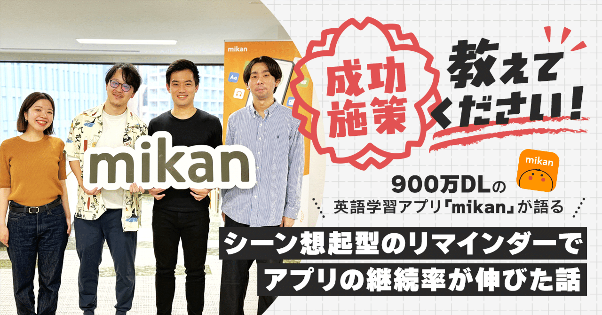
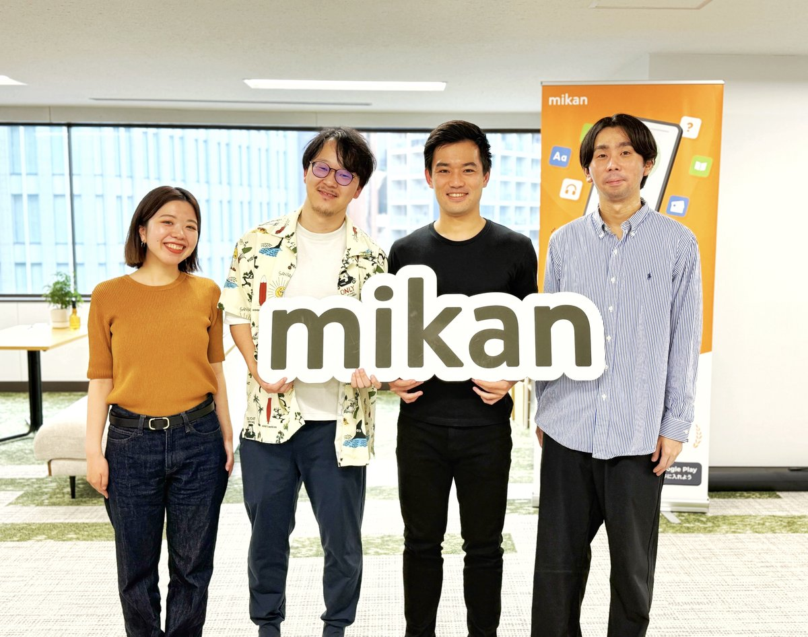
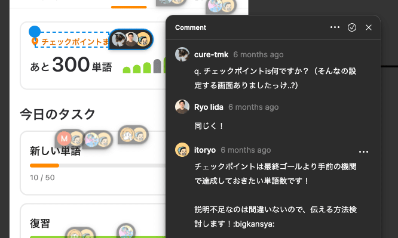
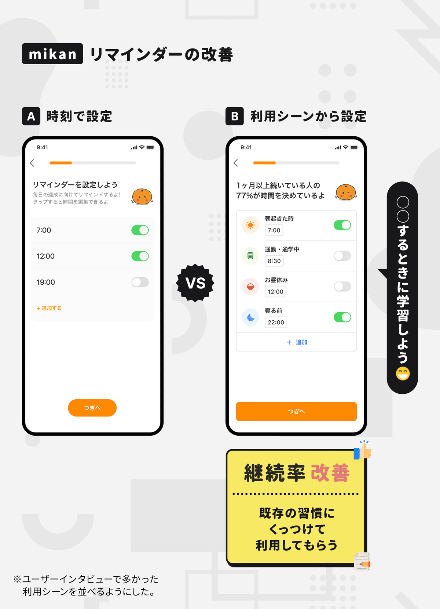
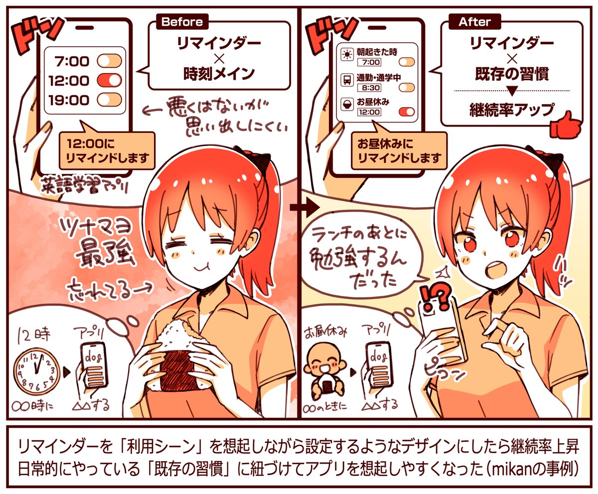
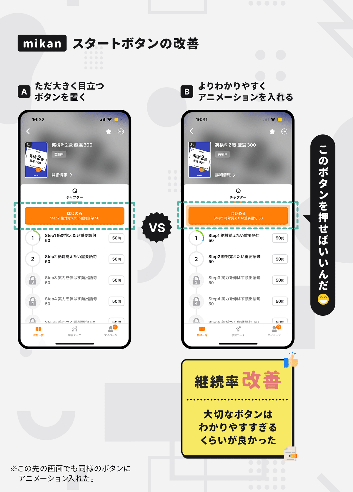
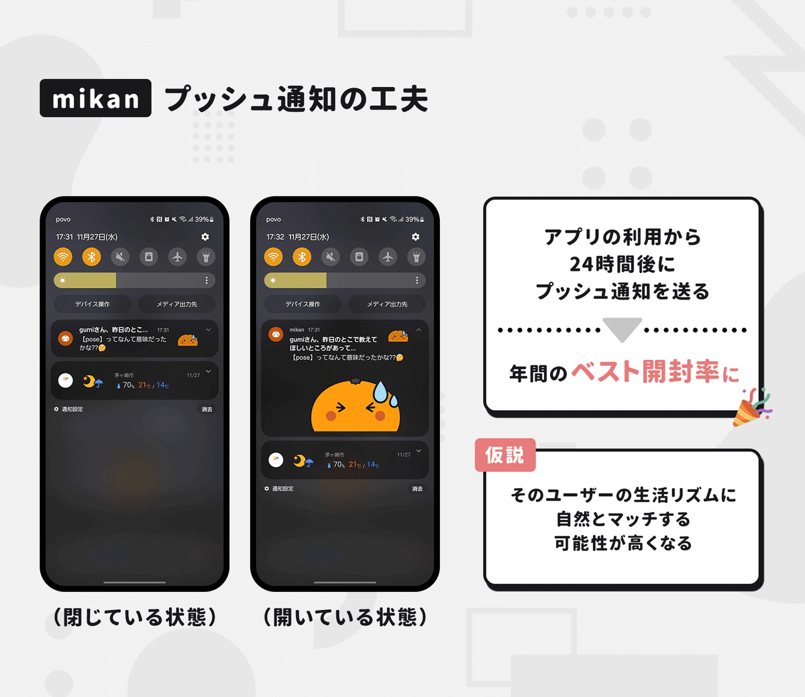
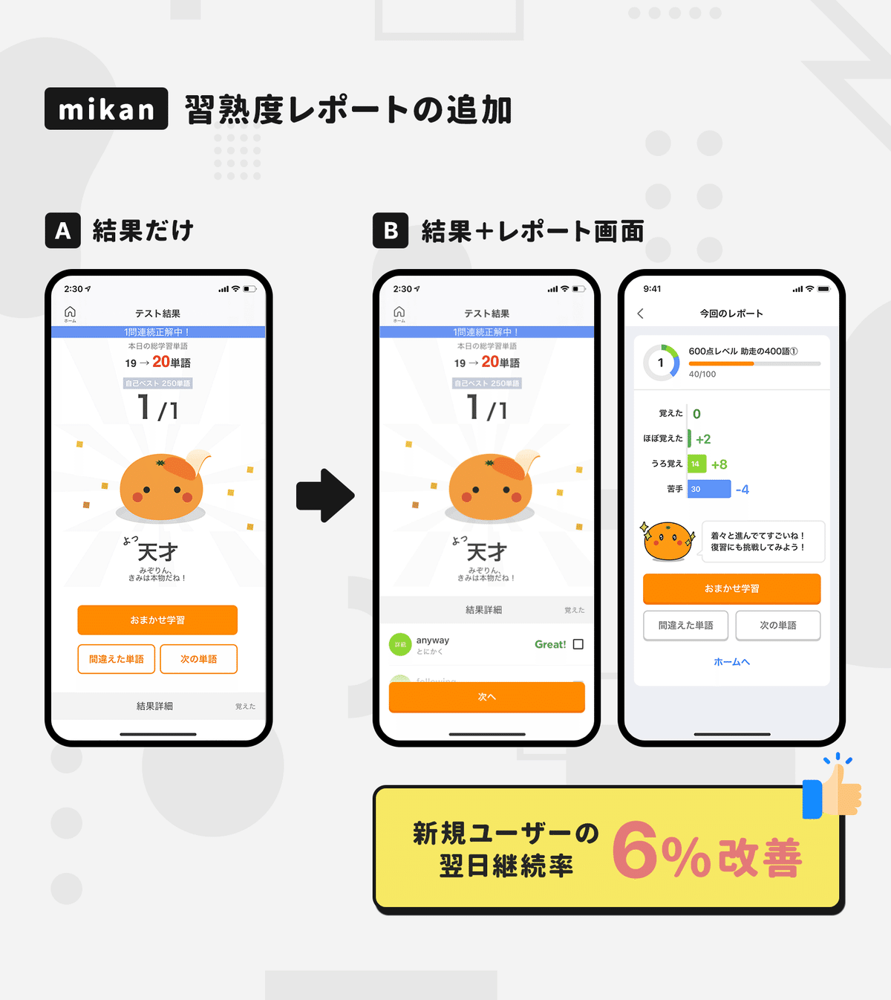
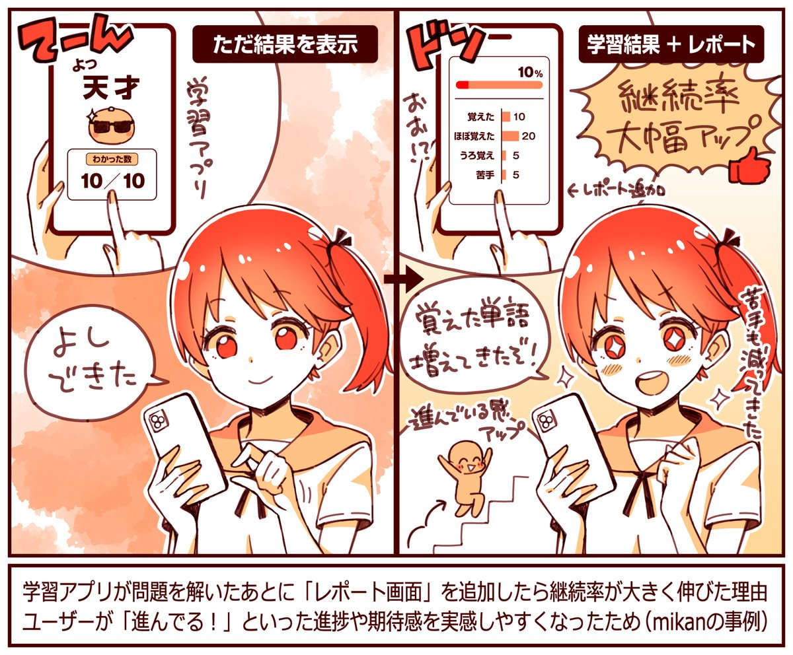
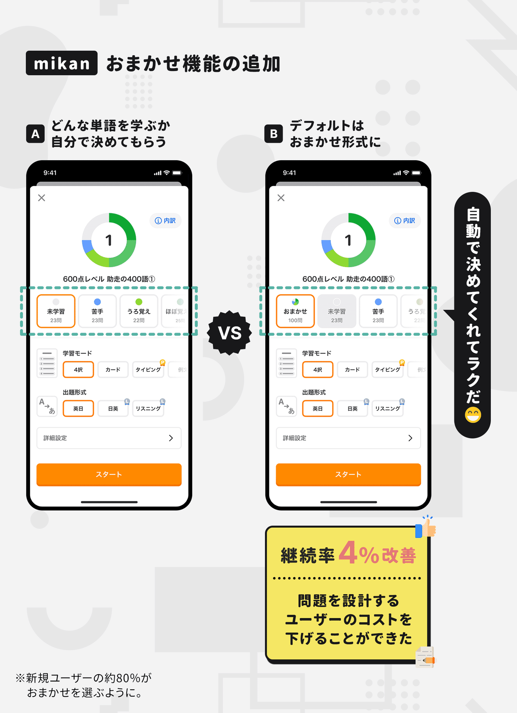

  

# シーン想起型の「リマインダー」を入れたらアプリの継続率が伸びたワケ。900万ダウンロードの語学アプリ「mikan」に聞く、学習の継続率などを高めた5つの工夫。

51

[%22%20d%3D%22M-100-100h300v300h-300z%22%2F%3E%3C%2Fsvg%3E)](/)

[アプリマーケティング研究所](/)

2025年6月16日 11:30

¥2,000/月

英語学習アプリの「mikan」さんを取材しました。

（左から）株式会社mikan デザイナー 長瀧 彩花さん、Androidエンジニア 山中 爽史さん、プロダクトマネージャー 飯田 諒さん、 プロダクトマネージャー 伊東 凌さん

> 900万ダウンロードを超える、英語学習アプリ「mikan」では、さまざまな工夫を行うことで学習の継続率を高めています。具体的に「どんな施策」がうまくいったのかなどを聞きました。本連載の一部は2026年に出版される書籍にも収録される予定です。（[取材申請はコチラ](https://few-robin-203.notion.site/21353af152a3802f8f87c1eaca8cbb99?pvs=143)から）

### ⸺プロダクト開発で「これはやって良かった！」と感じる取り組みを教えてください。

長瀧：  
mikanでは、経営陣がデザイナー・エンジニア出身というのもあり、全社でデザインを大切にしています。

デザイン関連で**「やって良かった」と思うのは、デザインプロセスの中に「オープンレビュー」を取り入れたことです。**

デザインが出来たらFigmaでファイルを共有し、社内のメンバーから任意でコメント形式でフィードバックをもらっています。

社内のメンバーが初見で感じたことは、ユーザーさんも使った時に同じことを感じる可能性が高く、**デザイナー視点では見えていなかったことに早めに気づけることがメリットです。**

本格的な開発に入る前に「小さく早く相談して、手戻りを少なくすること」にもつながるため、開発のコストも圧縮できていますね。

オープンレビューの様子。

もともとは「お触り会」というカルチャーがあって。割と開発が進んでから社内でアプリを触って意見を出し合っていたんですよ。

ただ、開発が進んでから「意見をもらって直そう」とすると再開発の工数がかかります。そこで、よりプロセスの手前で見直す形にしました。

## アプリの指標を高めた「5つの成功施策」

### 成功施策①：時間よりも「利用シーン」を想起しながらリマインダーを設定してもらう。

伊東：  
mikanでは、**リマインダーを「利用シーン」を想起しながら設定してもらうようにすると、継続率をグッと高めることができました。**

例えば、**「通勤・通学」「お昼休み」のように、生活の中にある利用シーンをイメージしながら「このときに勉強しよう」と思ってもらう感じです。**

以前は「この時間に設定する」という感じでしたが、「この利用シーンで送られるように設定する」というニュアンスに変えたんです。

これは、**タスクを「時刻で想起して行う」というよりは、生活の中の「既存の習慣」から想起して行う人が多いことがヒントになりました。**

例えば、朝8時になったから「歯磨きをしよう」というよりは、朝ごはんを食べたから「歯磨きをしよう」と想起する人が多いと思います。

mikanも、**朝8時になったから「勉強しよう」というよりは、通勤電車に乗ったから「さぁ、勉強しよう」と想起している人が多かったんです。**

また、定着率が高い方の統計データを分析すると、ある程度は「同じ時間にアクセスしている人」のほうが継続率が高いことも見えていて。こうしたヒントをもとにリマインダーを改善しました。

### 成功施策②：大切なボタンは「わかるだろう」という思い込みを捨てて過剰にわかりやすくする。

飯田：  
mikanには、**学習をはじめる「オレンジの大きなボタン」があるのですが、このボタンにアニメーションを加えると継続率が伸びました。**

mikanを開いた画面を見ても、**少なくとも10個以上は「ボタン」があるんですよね。それだけ多くの選択肢があるということです。**

とくに新規ユーザーさんは「どこを押せばいいの？」と迷ってしまうんですよ。はじめて来た駅に「どこに何があるか」がわからないのと同じです。

ここから学んだのは、目立つボタンを置いたから「わかるだろう」では実は足りていなくて、誰から見てもわかりやすいことが大切ということです。

ボタンを"ポワポワさせる"アニメーションを追加した。

長瀧：  
自分たちが「目立っているはず」と思い込んでいたものを「より目立たせる」という方向性で改善すると想像以上に成果がでたりします。

アプリに不慣れなユーザーさんでも、迷わずに使えるように配慮することも大事な視点だと感じます。

### 成功施策③：プッシュ通知を「利用から24時間後」に送る。

山中：  
mikanでは、**プッシュ通知を「アプリ利用から24時間後」に送ったところ、通常通知と比べると開封率が1.5倍ほど高くなりました。**

なぜそうなるかというと、学習から24時間後に通知を送ると、そのユーザーさんの生活サイクルに「自然に溶け込めるため」だと考えています。

例えば、夜21時に寝る前にmikanで学習している人は、翌日も夜21時に学習をしてくれる可能性が高い。理屈としてはそういう感じです。

2024年に送った通知の中では「最も高い開封率」が出ていて、アプリの起動率にも貢献してくれました。

### 成功事例④：レポートを出して「期待感や進捗感」を感じてもらう。

伊東：  
**mikanで単語を学習した後に「分析レポート」を挟むようにしたのですが、これもグッと継続率を高める効果がありました。**

以前は、ただ「10問中8問正解でした」と結果だけ伝えていたのを、「覚えた単語や苦手な単語の数」なども出すようにした感じですね。

苦手な単語が減ったり、覚えた単語が増えたりすることで「進んでいる感」を感じやすくなった。

学習アプリにおいては、**「覚えられそう・覚えられている」という期待感や進捗感のようなものを、成果を得られる前に「感覚的に持てるか？」というのがひとつの継続のポイントになるんです。**

なぜなら、勉強って成果が出るまでに「時間や労力」がかなり必要ですし、そもそも「続けない理由」のほうが多すぎるんですよね。

そのため、短期的に手応えが得られたり、テンションが上がる仕掛けがあったほうが、長期的にも続けやすくなるのかなと。

### 成功施策⑤：おまかせモードで「決めるコスト」を減らす。

飯田：  
mikanでは、**学習する単語を自動で選ぶ「おまかせ学習」を入れたところ継続率がグッと高まりました。**

以前は、ユーザーさんに「どんな単語を問題に出すか」を設定してもらっていたんですよ。新しい単語をやる、苦手な単語をやる、みたいに。

そこに「おまかせ学習」を追加したことで、選んで決めるコストが低くなって続けやすくなったのかなと。

寿司屋さんで例えるなら、アラカルトの単品注文だけだったお店に、「大将のおすすめコース」も追加したという感じです。

通な人は自分でネタを注文すればいいけど、海外の方や詳しくない方にとっては「おすすめコース」もあったほうが恐らく便利ですよね。

ここから学んだのは、**絶対に通る道には「自分で選ばなきゃいけない要素」はなるべく減らしたほうが継続しやすい**ということでした。

【取材協力】  
株式会社mikan：<https://mikan.link/>   
mikan：<https://mikan.com/>  
株式会社mikan 長瀧 彩花さん、山中 爽史さん、飯田 諒さん、伊東 凌さん

【告知】mikanさんでは各職種で採用中。デザインマネジャーやバックエンドエンジニアなどを探しているそう。ご興味あれば下記サイトからどうぞ。

[**株式会社mikan | 採用情報**
*mikanの人事・採用に関するページです。ミッション、バリュー、カルチャーをはじめ、募集中の職種などもご覧いただけます。*
*mikan.link*](https://mikan.link/careers)

> ※ 以降は、＋αの事例（成功施策⑥〜⑨）を購読会員向けにまとめています。売上が約10％伸びたトライアルの工夫、初回体験で「何をしてもらうか？」で継続率が変わる話、サブスクのCVRが伸びた機能、などご興味あればご覧ください。

  

ダウンロード

 

copy

## ここから先は

2,088字
/
4画像

%22%20d%3D%22M-100-100h300v300h-300z%22%2F%3E%3C%2Fsvg%3E)

アプリやプロダクトの成功事例が学べるマガジンです。プロダクトの売上やユーザー数を伸ばしたい人にオススメです。成長プロダクトのインタビュー、効果のあったマーケティング施策、事例やデータなどが中心（月に7記事ほど）多くの過去記事も5年ほど遡って読めます。クレカ決済だと初月無料なのでお試しでもぜひ。

### [月刊アプリマーケティング](/m/mc375c9b46464)

¥2,000 / 月  
初月無料

プロダクト運営について学べるマガジンです。アプリやプロダクトの売上やユーザー数を伸ばしたい人にオススメです。月に7記事ほどお届けします。

購読手続きへ

[ログイン](https://note.com/cd/login?redirect_to=https%3A%2F%2Fmarkelabo.com%2Fn%2Fn3e737cf909ac)

   

51

[%22%20d%3D%22M-100-100h300v300h-300z%22%2F%3E%3C%2Fsvg%3E)](/)

[アプリマーケティング研究所](/)

フォロー

プロダクトの成功事例を発信しているメディアです。2013年から約10年運営しています。取材相談はツイッターDM（@appmarkelabo）かメールにてどうぞ！info@appmarketinglabo.net