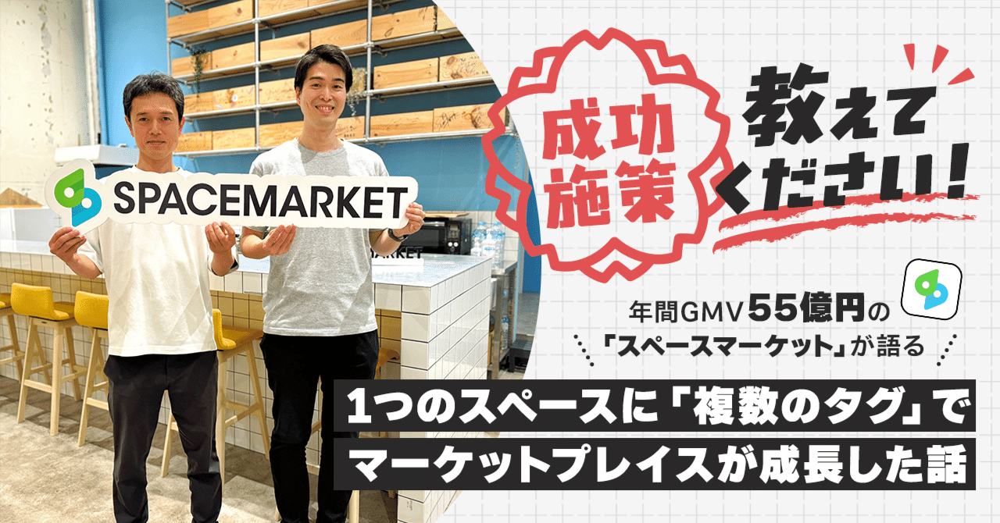
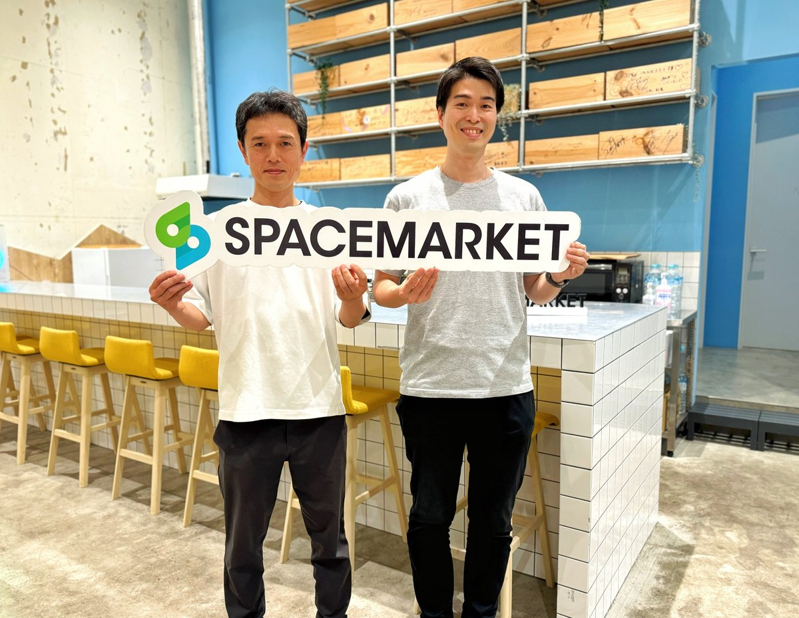
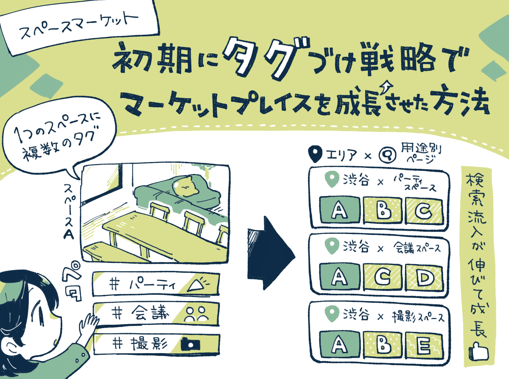
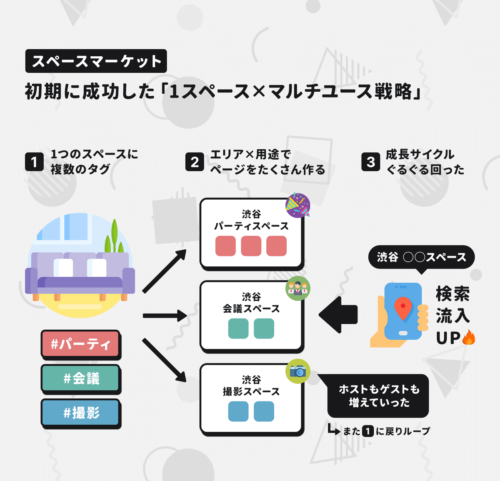
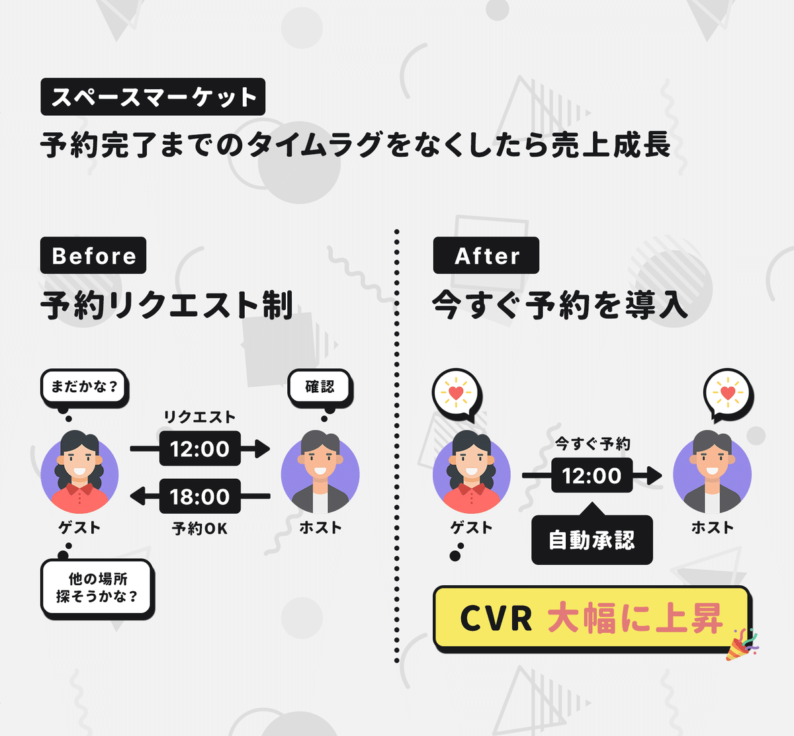
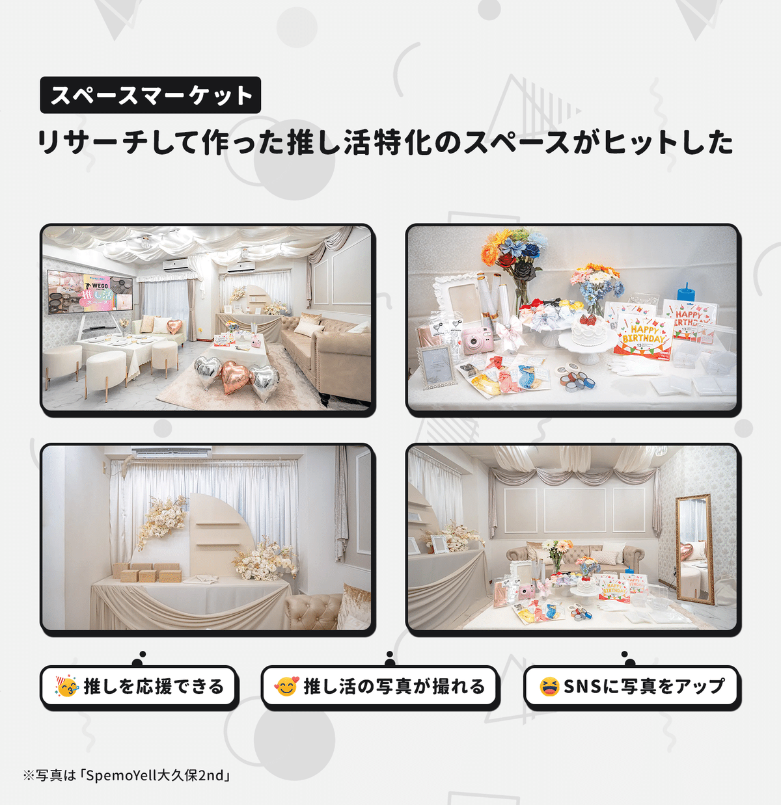
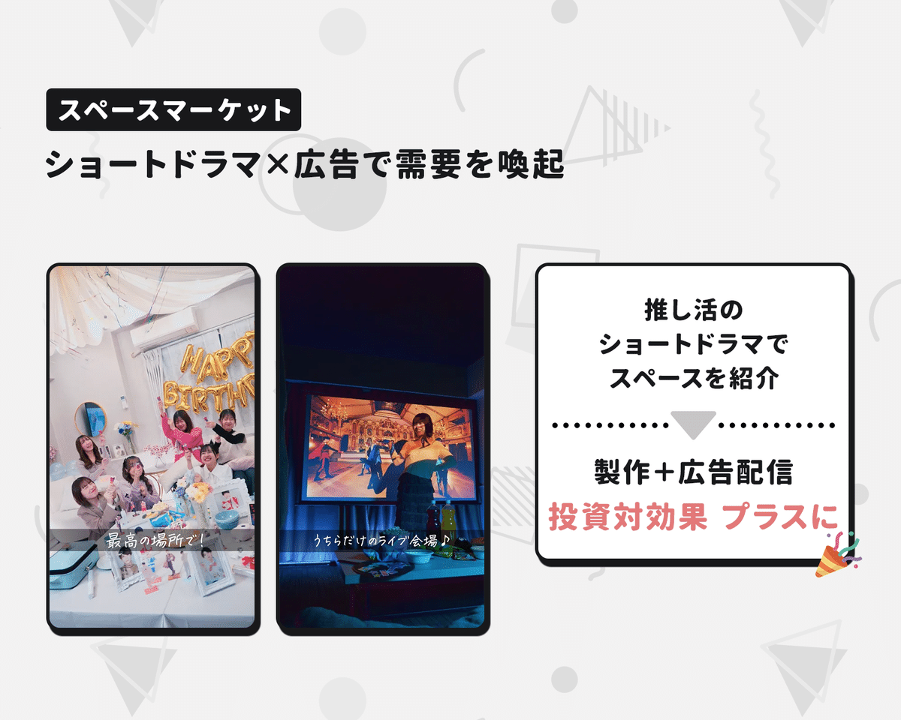

  

# 予約完了までの「タイムラグ」を減らしたら予約率が伸びたワケ。1つのスペースに用途に合わせた「複数のタグ」をつけたら成長。年間GMVが55億円を超える「スペースマーケット」3つの成長施策。

33

[%22%20d%3D%22M-100-100h300v300h-300z%22%2F%3E%3C%2Fsvg%3E)](/)

[アプリマーケティング研究所](/)

2025年6月20日 11:30

¥2,000/月

場所を貸し借りできるマーケットプレイスの「スペースマーケット」さんを取材しました。

（左から）株式会社スペースマーケット 執行役員CTO 三重野 政幸さん、マーケティンググループリーダー 柏木正徳さん

> 年間GMVが55億円を超える「スペースマーケット」では、さまざまな工夫を重ねることでユーザー体験を向上させています。具体的に「どんな施策」がうまくいったのかなどを聞きました。本連載の一部は2026年に出版される書籍にも収録される予定です。（[取材申請はコチラ](https://few-robin-203.notion.site/21353af152a3802f8f87c1eaca8cbb99)から）

## 事業の成長につながった「3つの工夫」

### 1、スペースに「複数の用途のタグ」をつけた。

三重野：  
初期に成功したのは**「少数のスペース」でも利用シーンにあった「タグ」をつければ、プラットフォームの充実度を高められるという工夫でした。**

例えば、1つのスペースに「撮影用」「会議用」「パーティ用」と3つの適切なタグをつければ、ユーザーさんとの接点が3つに増えますよね。

すると、**「エリア × 用途」のページも充実するため、検索エンジンで上位を獲得しやすくなって検索流入がすごく伸びる効果がありました。**

出品時に「スペースに合ったタグ」をつけてもらい、それをデータベースに蓄積してコンテンツとしても活用した。

例えば、検索エンジンで「渋谷 会議スペース」と検索したときに、1つのページに数個しかスペースがないよりも、1つのページに10個スペースがあったほうが上位になる可能性も高くなりますよね。

そのため、タグの活用でコンテンツが充実して、検索からの流入が伸びて、ホストやゲストが増える、こうした成長サイクルが回ったんですよ。

スペースマーケットのような、2種類のユーザーに向き合うツーサイドプラットフォームでは、サービス立ち上げ時に「出品者と購入者をどう集めるのか？」が大きな課題になりますが、この施策はその問題を乗り越える有効な一手になりました。

### 2、予約完了までのタイムラグを減らしたら「予約率が大きく伸びた」

三重野：  
もうひとつ、初期に成功したのは「今すぐ予約」という予約リクエストを自動承認する機能でした。

当初は、ゲストが「このスペースを予約します」とリクエストして、それをホストが「承諾」してはじめて予約が確定する仕組みでした。

このときに、**コンバージョン率を上げるには「予約リクエストが飛んでから承認されるまでの時間」が大事な指標であるように見えたんですよ。**

そのため、早めに承認してほしいので、メールやプッシュ通知を送ったり、ときには個別に連絡をしていましたが、**ホストにヒアリングをすると「夜遅くになると承認しづらい。ゲストを待たせたくないので自動承認があると嬉しい。」といった意見が多くて。**

それで「なるほど！」と。それなら自動承認できる仕組みをつくろうと「今すぐ予約」を出したんですね。

結果としては、**利用者からすると「クリックすればすぐに予約が確定する」という体験に変わったことで、予約率がものすごく伸びたんですよ。**

ラグがあると「不安だから別の場所をとろうかな」と迷ったりしますよね。このラグを無くすことで意思決定してくれやすくなったんです。

実際に、**機能を公開したときは「今すぐ予約」を設定したスペースだけが、コンバージョン率が大幅に上がっていましたね。**

ホスト・ゲストからも好評だったため、**あるときから「今すぐ予約」をデフォルト設定に変えたのですが、ここでさらに予約率が伸びました。**

オプションの頃は約10％の設定率でしたが、デフォルト設定になったことで50％以上は「今すぐ予約」を設定してくれるようになりました。

### 3、「推し活」などのカテゴリーを開拓して成長。

柏木：  
スペースマーケットでは、データを見ながら「新しいカテゴリーを開拓する」取り組みも行っています。

例えば、最近伸びているのは「推し活」です。前年比で20～30％の成長率で利用が伸びていますね。

新しいカテゴリーを開拓するときには、**まずは"伸びている兆候"を見ます。予約時のコメントを見ながら「推し活の用途が増えているな」とか。成約数が前年比でかなり伸びてきているなとか。**

それを見つけたら、今度は「用途の分析」をします。**何千件ものコメントを分析すると「ライブ映像などの鑑賞会」「本人不在の誕生日会」などが主なユースケースであるとわかってきました。**

そこから、推し活に特化したスペースを作ると、さらに用途が広がったり、推し活の対応スペースが増えたりすることで利用が伸びました。

ユーザーにインタビューを重ねて「痒いところに手が届く」スペースを作った。

ほかには「推し活のショートドラマ」を撮って、SNSに投稿したりTikTokの広告に出稿したところ、大きな反響をいただいています。

実際に成果も出ていて、**ドラマの制作費と広告費を含めたコストに対して、投資対効果を見たときにもプラスになっています。**

ショートドラマ形式で「推し活スペースの活用法」を訴求。

---

【取材協力】  
株式会社スペースマーケット：<https://spacemarket.co.jp/>   
スペースマーケット：<https://www.spacemarket.com/>   
株式会社スペースマーケット 三重野 政幸さん、柏木正徳さん、広報の伊藤 亜美奈さん

【告知】スペースマーケットさんでは各職種で随時採用中。エンジニアなど募集されているとのこと。詳細は下記サイトからどうぞ。

[**採用情報｜スペースマーケット**
*「スペースシェアをあたりまえに」をミッションに掲げ、あらゆるスペースを時間単位で貸し借りするプラットフォームなどを運営する*
*spacemarket.co.jp*](https://spacemarket.co.jp/recruit/)

> ※ 以降は、＋αの事例（成功施策④〜⑧）を購読会員向けにまとめています。ニーズの把握につながった工夫、クーポン予算を最適化した取り組み、お気に入り登録数が伸びたデザインの工夫、などご興味あればご覧ください。

  

ダウンロード

 

copy

## ここから先は

1,436字
/
4画像

%22%20d%3D%22M-100-100h300v300h-300z%22%2F%3E%3C%2Fsvg%3E)

アプリやプロダクトの成功事例が学べるマガジンです。プロダクトの売上やユーザー数を伸ばしたい人にオススメです。成長プロダクトのインタビュー、効果のあったマーケティング施策、事例やデータなどが中心（月に7記事ほど）多くの過去記事も5年ほど遡って読めます。クレカ決済だと初月無料なのでお試しでもぜひ。

### [月刊アプリマーケティング](/m/mc375c9b46464)

¥2,000 / 月  
初月無料

プロダクト運営について学べるマガジンです。アプリやプロダクトの売上やユーザー数を伸ばしたい人にオススメです。月に7記事ほどお届けします。

購読手続きへ

[ログイン](https://note.com/cd/login?redirect_to=https%3A%2F%2Fmarkelabo.com%2Fn%2Fn3e18bb1b7d7a)

   

この記事は[noteマネー](https://money.note.com/)にピックアップされました

33

[%22%20d%3D%22M-100-100h300v300h-300z%22%2F%3E%3C%2Fsvg%3E)](/)

[アプリマーケティング研究所](/)

フォロー

プロダクトの成功事例を発信しているメディアです。2013年から約10年運営しています。取材相談はツイッターDM（@appmarkelabo）かメールにてどうぞ！info@appmarketinglabo.net