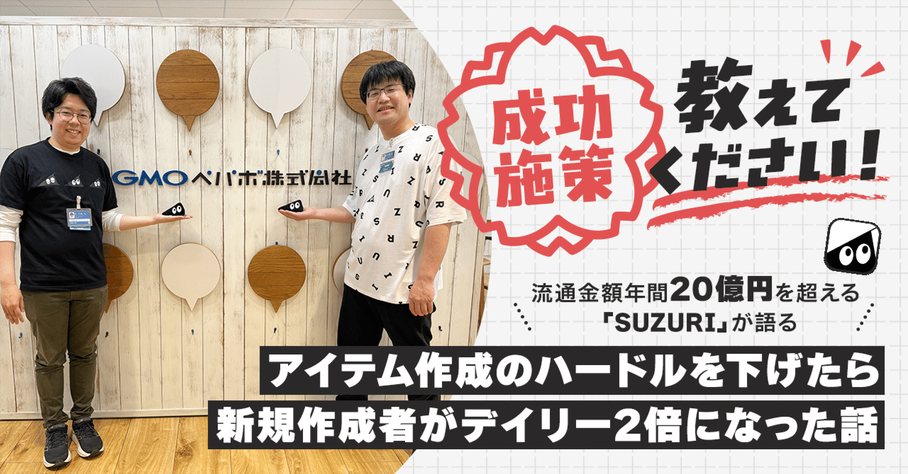
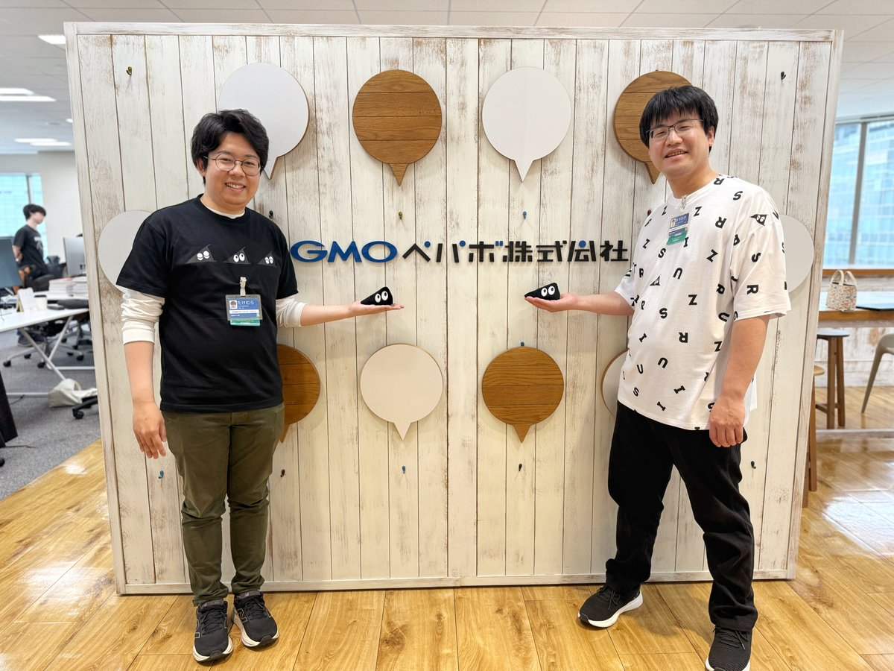
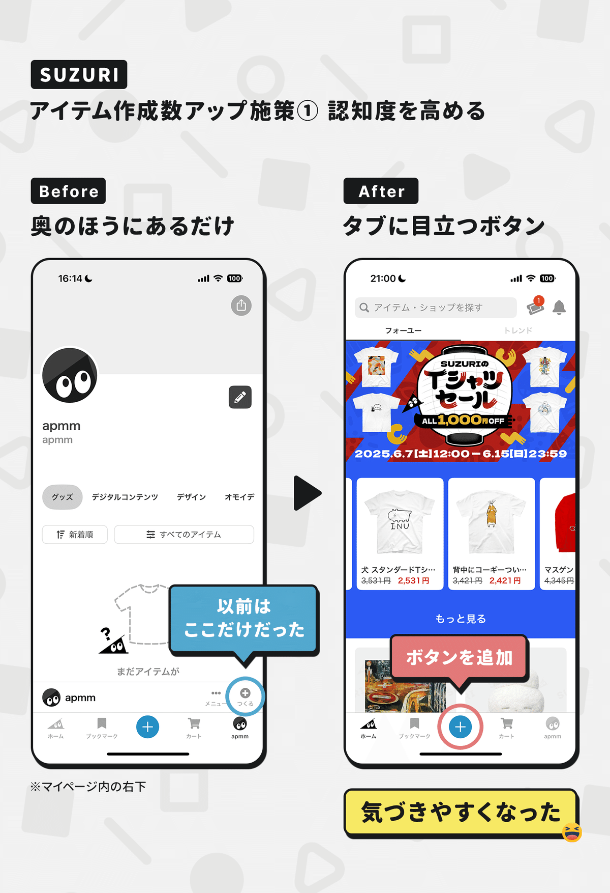
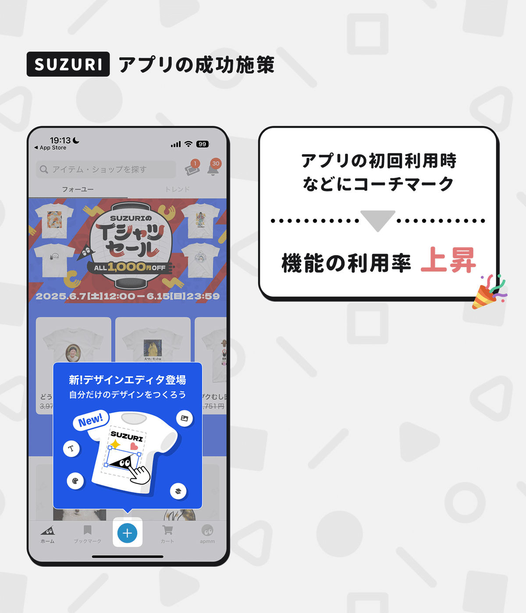
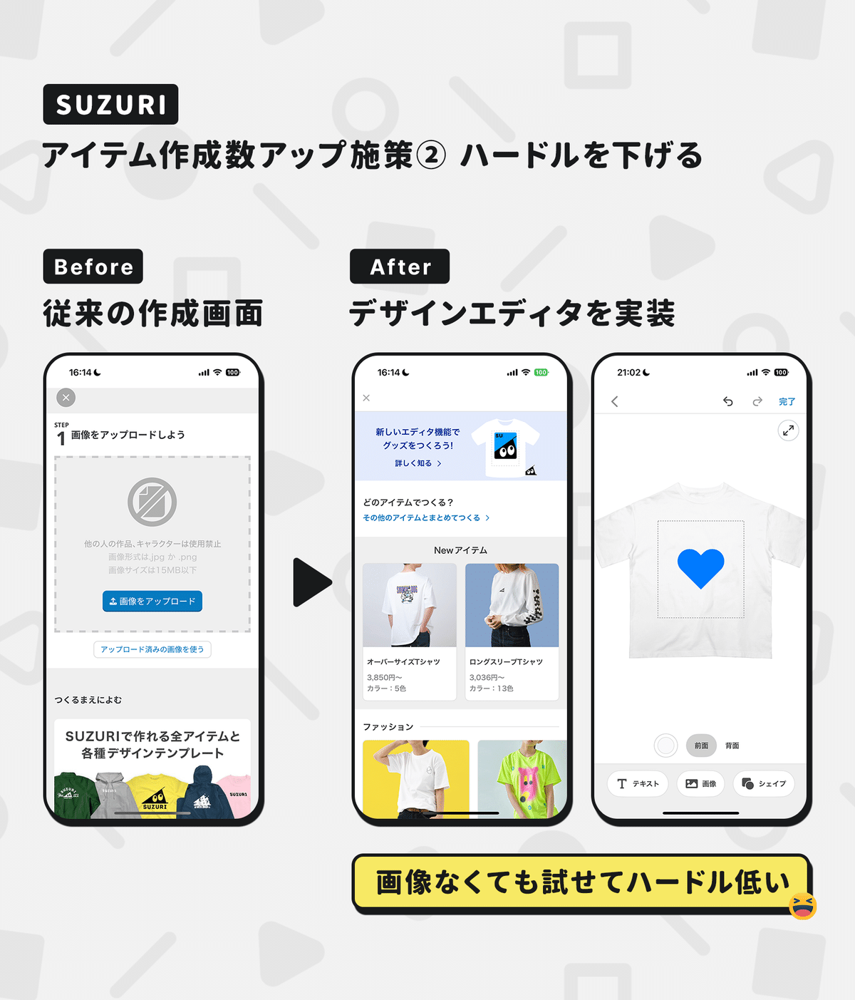
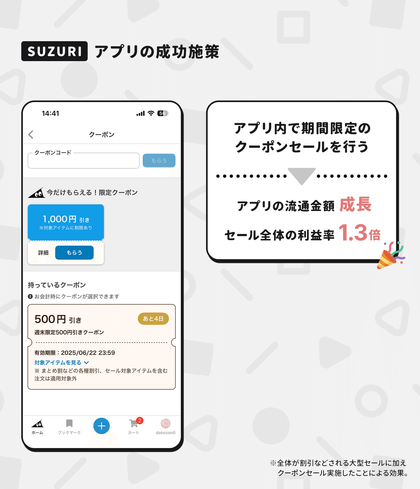
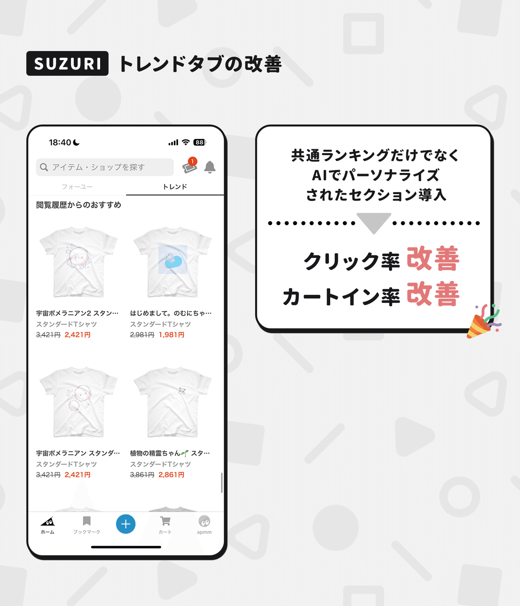

  

# ハードルを下げたらアイテムの新規作成者数がデイリーで2倍に。年間流通額20億円を超える「SUZURI」に聞く3つの成長施策。

11

[%22%20d%3D%22M-100-100h300v300h-300z%22%2F%3E%3C%2Fsvg%3E)](/)

[アプリマーケティング研究所](/)

2025年6月23日 11:30

¥2,000/月

オリジナルグッズ作成・販売サービス「SUZURI byGMOペパボ」さんを取材しました。

（左から）GMOペパボ株式会社 SUZURI事業部 マーケットプレイスグループ プロダクトチーム 竹村 凜さん、宮脇 良太さん

> 累計会員数210万人、年間の流通金額が20億円超のオリジナルグッズ作成・販売サービスの「SUZURI byGMOペパボ」では、さまざまな工夫でクリエイターやユーザーの体験を向上させています。具体的に「どんな施策」がうまくいったのかなどを聞きました。本連載の一部は2026年に出版される書籍にも収録予定です。（[取材申請はコチラ](https://few-robin-203.notion.site/21353af152a3802f8f87c1eaca8cbb99)から）

## ユーザー体験向上につながった3つの施策

### 1、ハードルを下げたら「アイテム作成数」が急増。

竹村：  
SUZURIでは、主に2つの工夫で「作るハードル」を下げたところ、アイテム作成数が成長しました。

まず1つ目は「階層の深さ」の改善です。以前はアプリのマイページの中にある「つくる」というボタンから作成する形でした。

これだと、**一部のユーザーさんの目にしか触れません。そこで作成ボタンをメインのタブに置いて「機能の認知度」を高めるようにしました。**

「コーチマーク」を出すと利用率がより高くなった。

もうひとつは「簡単にしたこと」です。以前の作成画面はハードルがあって少し難しかったんですよ。画像がないと先に進めなかったり。

そこで、**新しく「デザインエディタ」を開発して、手元に画像などがなくても気軽にアイテムの作成を試せるように改善しました。**

この2つの工夫によって、**新規の作成者数がデイリーで約2倍ほどに増えて、アイテムの作成数が1.6倍に伸びる**という成果が出ました。

そもそもの背景としては、新規クリエイター数を増やすのは大事だけど「どうしたら増やせるだろうか？」と考えたのがはじまりでしたね。

それで「今は簡単に作成できるとは言い切れないぞ、ハードルがあるかもな」というところでエディタを開発したという経緯です。

宮脇：  
SUZURIの登録クリエイター数は、2021年の約38万人から、2025年現在では約92万人まで伸びています。

それに伴って、クリエイター層や表現の幅も広がっているので、幅広い方々に気軽に試してもらえるようになったのが良かったのかなと。

### 2、クーポンセールが好調。

宮脇：  
もともと、SUZURIではWebも含めた大規模なセールを行っていましたが、アプリでも購入していただけるキッカケを増やしたいと考えていました。

実際に、Webよりアプリのほうが購入率などが高く、アプリ側の流通金額を伸ばすことができれば、事業の成長につながるとわかっていました。

そこで行った取り組みが、**アプリでクーポンを配布する「クーポンセール」というものです。**通常のセールでは、全体に対して値引きが行われますが、クーポンセールは「クーポンを必要とする人」だけに値引きが行われます。

スーパーで例えるなら、全品20％オフセールだけ行うのではなく、チラシにクーポンをつける「クーポンセール」もはじめたという感じです。

成果としては、**アプリの流通金額の成長に加えて、セール全体における利益率が1.3倍ほどに改善されたことを試算しています。**

これからは、定期的に行っている大型のセールと、アプリ内のクーポンセールをうまく組み合わせながら運営していく予定です。

### 3、トレンドタブに「AIセクション」を追加した。

竹村：  
SUZURIでは、ユーザーさんに合わせた情報を届ける「パーソナライズ施策」も成果が出ています。

例えば、以前はトレンドタブに「Tシャツ売れ筋ランキング」など、全てのユーザーに向けて同じアイテムを並べていたんですよ。

それを、過去の行動をもとに（ズッキュン、ブックマークなど）その人に合わせて「これがおすすめですよ」とAIを使って表示しました。

以前の形式に比べると**「履歴からのおすすめ」というセクションでは、カートイン率が約2倍に、クリック率は24％ほど向上しています。**

---

【取材協力】  
GMOペパボ株式会社：<https://pepabo.com/>   
SUZURI：<https://suzuri.jp/>   
GMOペパボ株式会社 竹村 凜さん、宮脇 良太さん

【告知】GMOペパボさんでは各職種で採用を強化中。詳細は下記サイトよりご覧ください。

[**キャリア採用 | GMOペパボ株式会社 採用サイト**
*アイデアとテクノロジーで世界中の表現者を支える。日本最大級のハンドメイドマーケット「minne」やレンタルサーバー「ロリポ*
*recruit.pepabo.com*](https://recruit.pepabo.com/info/career/)

> ※ 以降は、＋αの事例（成功施策④〜⑧）を購読会員向けにまとめています。カートイン数が成長した文言の改善、アプリのDAUが約20％伸びた事例、会員登録率が約15％伸びた取り組み、などご興味あればご覧ください。

  

ダウンロード

 

copy

## ここから先は

1,402字
/
5画像

%22%20d%3D%22M-100-100h300v300h-300z%22%2F%3E%3C%2Fsvg%3E)

アプリやプロダクトの成功事例が学べるマガジンです。プロダクトの売上やユーザー数を伸ばしたい人にオススメです。成長プロダクトのインタビュー、効果のあったマーケティング施策、事例やデータなどが中心（月に7記事ほど）多くの過去記事も5年ほど遡って読めます。クレカ決済だと初月無料なのでお試しでもぜひ。

### [月刊アプリマーケティング](/m/mc375c9b46464)

¥2,000 / 月  
初月無料

プロダクト運営について学べるマガジンです。アプリやプロダクトの売上やユーザー数を伸ばしたい人にオススメです。月に7記事ほどお届けします。

購読手続きへ

[ログイン](https://note.com/cd/login?redirect_to=https%3A%2F%2Fmarkelabo.com%2Fn%2Fna54aa59c8015)

   

11

[%22%20d%3D%22M-100-100h300v300h-300z%22%2F%3E%3C%2Fsvg%3E)](/)

[アプリマーケティング研究所](/)

フォロー

プロダクトの成功事例を発信しているメディアです。2013年から約10年運営しています。取材相談はツイッターDM（@appmarkelabo）かメールにてどうぞ！info@appmarketinglabo.net