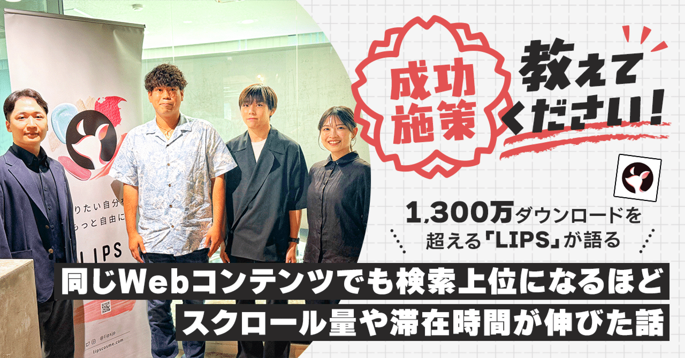
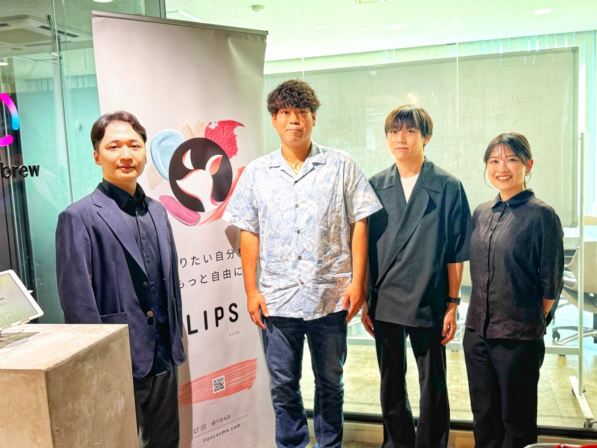
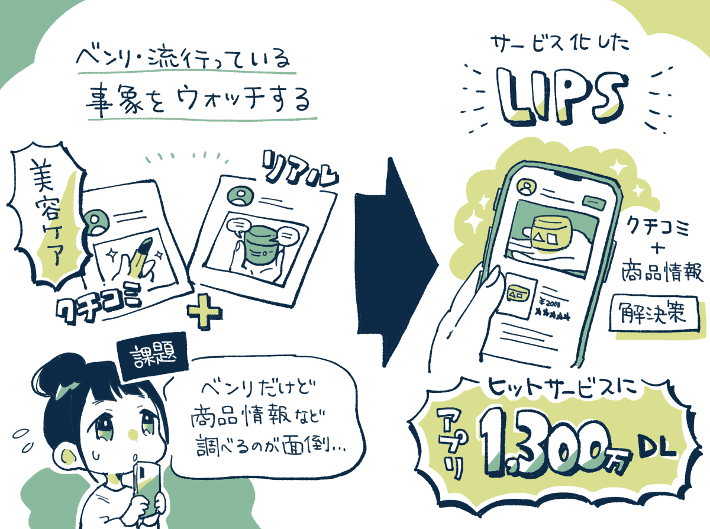
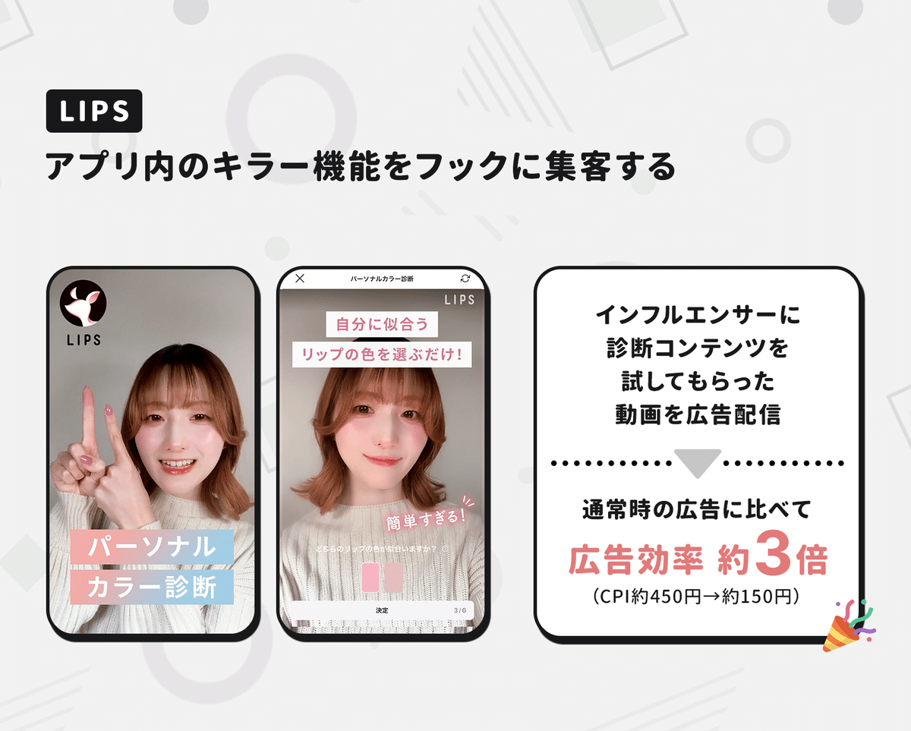
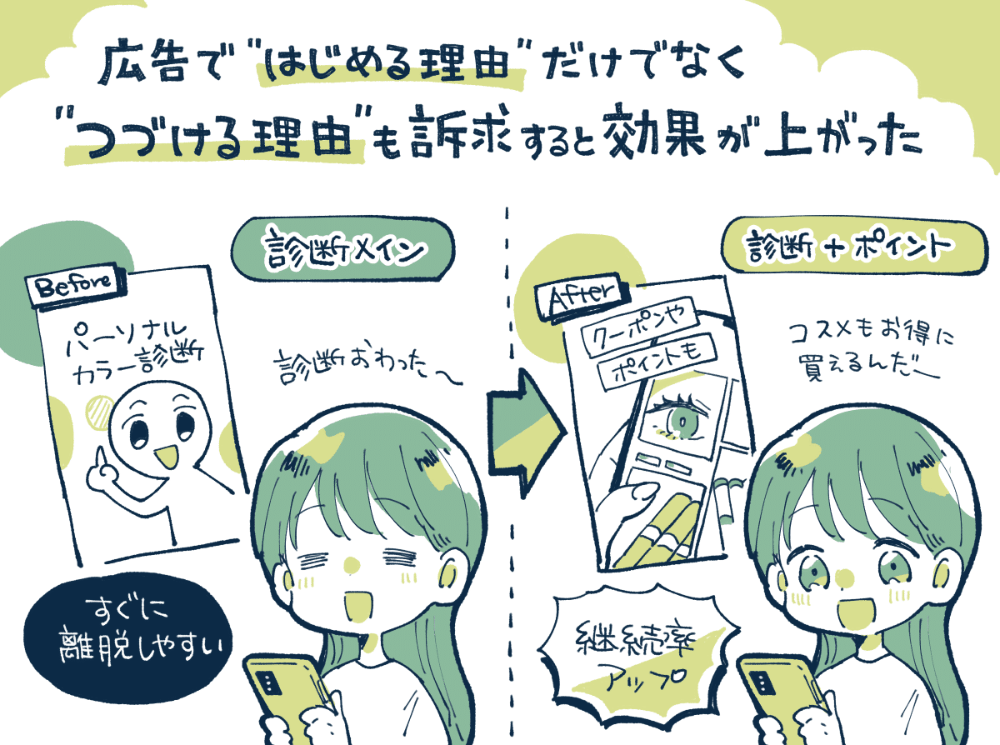
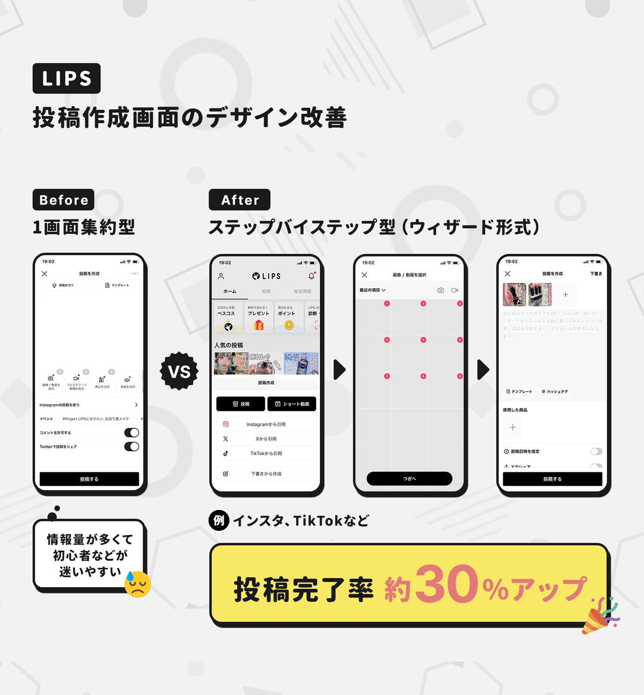
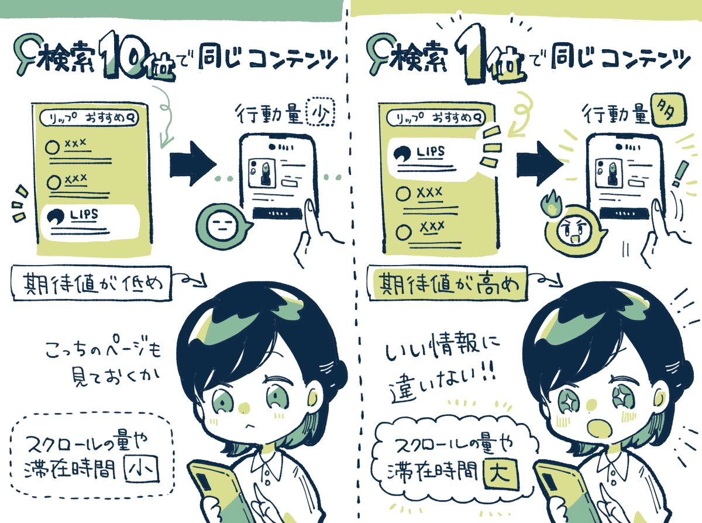
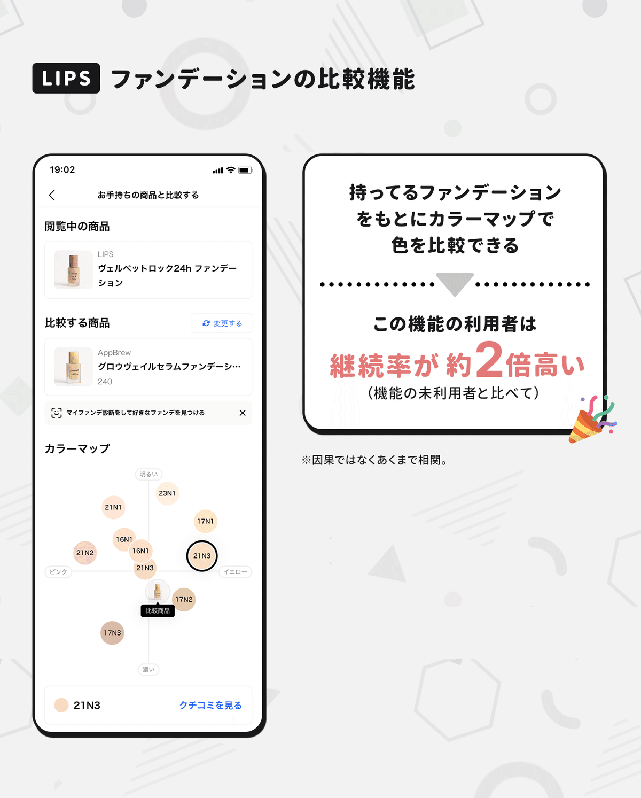
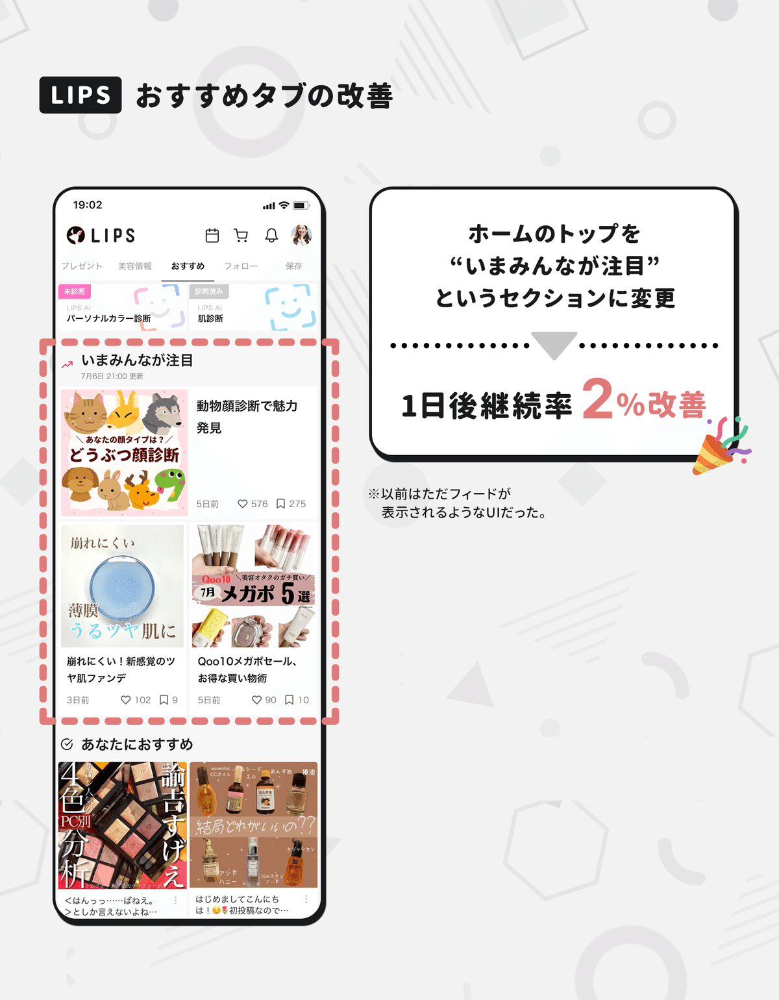

  

# プロモーションの中で「続ける理由」を訴求したら広告経由の継続率が約2倍になった。1,300万DLのコスメアプリ「LIPS」に聞く、アプリの成長につながった5つの成功施策。

28

[%22%20d%3D%22M-100-100h300v300h-300z%22%2F%3E%3C%2Fsvg%3E)](/)

[アプリマーケティング研究所](/)

2025年6月27日 11:30

¥2,000/月

コスメアプリの「LIPS」さんを取材しました。

（左から）株式会社AppBrew 取締役 堀江 慧さん、プロダクトマネージャー 安間 瑶耕さん、マーケティングマネージャー 一ノ瀬 駆さん、プロダクトマネージャー 松井 友里さん

> MAUは約1,000万人、アプリ1,300万DLを超える、美容プラットフォームの「LIPS」では、さまざまな工夫を重ねてユーザー体験を向上させています。具体的に「どんな施策」がうまくいったのかなど聞きました。本連載の一部は2026年に出版される書籍にも収録予定です。（[取材申請はコチラ](https://few-robin-203.notion.site/21353af152a3802f8f87c1eaca8cbb99)から）

### ⸺AppBrewは深澤さん松井さんらで創業されて、LIPSは松井さんの企画からはじまったと聞きました。ここまで成長するアプリを作るのは難しいと思います。振り返ってみるとどうですか…？

松井：  
運に恵まれつつも、**シンプルに「自分が欲しかったもの」をつくった結果、多くの方に共感していただけるものになった**という感覚が強いです。

当時はTwitterで「美容アカ」が流行りはじめたときで、たった1人が感じたリアルな情報が発信されていることに魅力を感じていました。

一方で、例えば「コスメの写真」がのっていても、**商品名をGoogleで検索しないと詳細がわからなかったり、クチコミと商品情報が「線でつながっていない」というところに不便さも感じていて。**

そこで、クチコミと商品データが連携しているような媒体が欲しいなと思ってLIPSを企画しました。

ただ、「自分はこんなのが欲しい！」と機能の企画をしたりもしますけど、感覚や勘に頼って判断するだけだと上手くいかなくて。そのため、AppBrewでは「定性と定量のバランス」を大切にしています。

例えば、ブラッシュアップする過程だったり、リリース後にどの機能を残すのかは、定量的にデータを見ながら厳しく判断しているんです。

このバランス感覚や、定性と定量の両方のスキルを個人としてもチームとしても持っておくことはとても大事だと感じています。

## アプリの指標を高めた「5つの成功施策」

### 成功施策①：診断コンテンツを広告に活用した。

一ノ瀬：  
LIPSでは、アプリ内にある診断コンテンツの診断回数が「累計1,000万回」を超えていますが、これをプロモーションに活用すると効果的でした。

方法としては、**インフルエンサーの方に診断コンテンツを試してもらい、その動画を広告配信などのプロモーションにも活用したんですね。**

これがとても好調で、通常の広告に比べると、**アプリの1インストールあたりの獲得効率が約3倍高くなっています。（CPI 450円→ 150円）**

そこからさらに、**広告の中に「続ける動機」を含めるとパフォーマンスを高めることができました。広告を見てくれた方の継続率が伸びたんです。**

ある時期に、1インストールあたりの獲得コストが約100円まで下がったのですが、診断を終えたらすぐに辞めてしまう方が増えてしまって。

そこで、LIPSのショッピングで使える「ポイント機能」も動画で紹介する構成にすると、元が低かったというのもありますが、低い獲得コストを維持しながら継続率を約2倍に改善することができました。

同じような広告でも「はじめる動機」だけではなく「続ける動機」も訴求することで効果を高められるケースがあるのだなと。

### 成功施策②：「ステップ・バイ・ステップ型」の投稿画面にしたら投稿完了率が30%アップ。

安間：  
投稿作成画面の事例です。もともとは**「1画面完結型」だったのですが、これを「ステップ・バイ・ステップ型」に変えたところ、ユーザーの投稿完了率が約30％ほど改善されました。**

主な理由は、画面の情報量を上げ過ぎると、初めてアプリを使う人などが「次に何をしたらいいのか？」と迷ってしまうためかなと。

基本はステップ数が増えると離脱も増えますが、適切なガイドが必要なシーンでは「あえて選択肢を絞る」というほうがいいのだと思います。

インスタやTikTokも「ステップ・バイ・ステップ型」に近いため「慣れもあるかも」とのこと。

### 成功施策③：Webは「検索上位」になるほどユーザーの行動量が増える傾向にある。

一ノ瀬：  
Web版のLIPSで興味深いのは、検索エンジンの順位が高いほどユーザー行動が良くなるというデータが見えていることです。

つまり、**同じWebコンテンツであっても、順位が上がるほどユーザー行動がめっちゃ良くなるんですよ。スクロール量とか滞在時間とか。**

なので、UIを細かく磨くよりかは「検索順位をどうしたら高められるか？」という視点で考えたほうがインパクトが大きくなると考えています。

理由のひとつは**「期待値の差」なのかなと。検索上位にあるコンテンツほど期待値が高くなって、品質が高いだろうと期待されてしっかり読まれる。**

逆に、検索結果の下のほうに行けば行くほど、そこの期待値は低くなって、サラッとしか読まれなくなるのではないかなと。

検索の下にあるほど「詳しく知りたい人」が訪れるため、しっかり読まれるのではとも思えますが、これは逆だったんですよね。

他にも、「集中力がなくなってくるから」などの要因も考えられますが、最も大きな要因は「期待値」ではと感じます。

### 成功施策④：ファンデーションの「色比較」の機能が好評。

安間：  
LIPSでは、ファンデーションの「色の比較機能」を実装したところ成功機能のひとつになっています。

これはオンラインだと「色選びが難しい」というニーズをもとに、自分の持っている商品を登録すると、カラーマップで「近い色の商品」などが直感的にわかるようにした機能です。

これがかなり好評で、この機能を使ったユーザーは、**それ以外のユーザーと比較すると「継続率が約2倍高い」というデータも出ています。**

これは相関データであり、元から継続率の高いユーザーが試しているだけという要因もありそうですが、これから分析を進めていくところです。

### 成功施策⑤：「おすすめタブ」の工夫で継続率が改善。

堀江：  
LIPSのおすすめフィードに、**「今みんなが注目」というセクションを作って、そこに更新時間も明示したところ継続率が向上しました。**

これはアプリを開いたけど「何をすればいいかわからない」「コンテンツを探すのが大変」という方が「まずはここを見よう」と思ってくれたのが理由ではないかなと考えています。

最近は「コンテンツを探しにいくカロリー」が高すぎると、先に進んでもらいにくい印象があるので、気軽に使えるUIを意識しました。

【取材協力】  
株式会社AppBrew：<https://appbrew.io/>   
LIPS：<https://lipscosme.com/>   
株式会社AppBrew 堀江慧さん、安間瑶耕さん、一ノ瀬駆さん、松井友里さん

【告知】AppBrewさんでは各領域で積極採用中。「長期的に転職を検討している」「まずは副業から考えてみたい」という方も大歓迎とのこと。ご興味あれば下記サイトからどうぞ。

[**採用情報 | AppBrew**
*株式会社AppBrewの採用情報ページです。*
*appbrew.io*](https://appbrew.io/careers/)

> ※ 以降は、＋αの3つの事例（成功施策 ⑥〜⑧）を購読会員向けにまとめています。検索サジェストのCTRを7倍に高めた工夫、コメントと継続率の関係とコメントユーザー率を16％増やした取り組み、AIを活用してコミュニティの安全性を高める方法、などご興味あればご覧ください。

  

ダウンロード

 

copy

## ここから先は

1,590字
/
4画像

%22%20d%3D%22M-100-100h300v300h-300z%22%2F%3E%3C%2Fsvg%3E)

アプリやプロダクトの成功事例が学べるマガジンです。プロダクトの売上やユーザー数を伸ばしたい人にオススメです。成長プロダクトのインタビュー、効果のあったマーケティング施策、事例やデータなどが中心（月に7記事ほど）多くの過去記事も5年ほど遡って読めます。クレカ決済だと初月無料なのでお試しでもぜひ。

### [月刊アプリマーケティング](/m/mc375c9b46464)

¥2,000 / 月  
初月無料

プロダクト運営について学べるマガジンです。アプリやプロダクトの売上やユーザー数を伸ばしたい人にオススメです。月に7記事ほどお届けします。

購読手続きへ

%22%20d%3D%22M-100-100h300v300h-300z%22%2F%3E%3C%2Fsvg%3E)

1人が高評価

[ログイン](https://note.com/cd/login?redirect_to=https%3A%2F%2Fmarkelabo.com%2Fn%2Fn9530fd6be032)

   

28

[%22%20d%3D%22M-100-100h300v300h-300z%22%2F%3E%3C%2Fsvg%3E)](/)

[アプリマーケティング研究所](/)

フォロー

プロダクトの成功事例を発信しているメディアです。2013年から約10年運営しています。取材相談はツイッターDM（@appmarkelabo）かメールにてどうぞ！info@appmarketinglabo.net