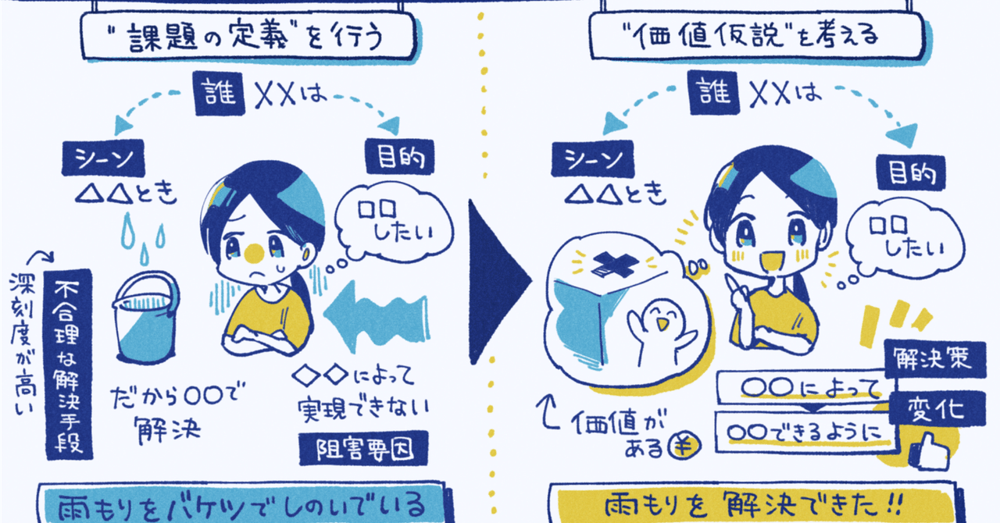  

# ユーザーの声を聴き続けて「新しい事業」を生み出しGMVは月数十億円に成長。「ワンバンク」のスマートバンクのサービス成長の裏側。Think N1シートと「不合理な代替手段」を見つける理由。

51

[%22%20d%3D%22M-100-100h300v300h-300z%22%2F%3E%3C%2Fsvg%3E)](/)

[アプリマーケティング研究所](/)

2025年7月23日 11:30

¥2,000/月

スマートバンクさんを取材しました。

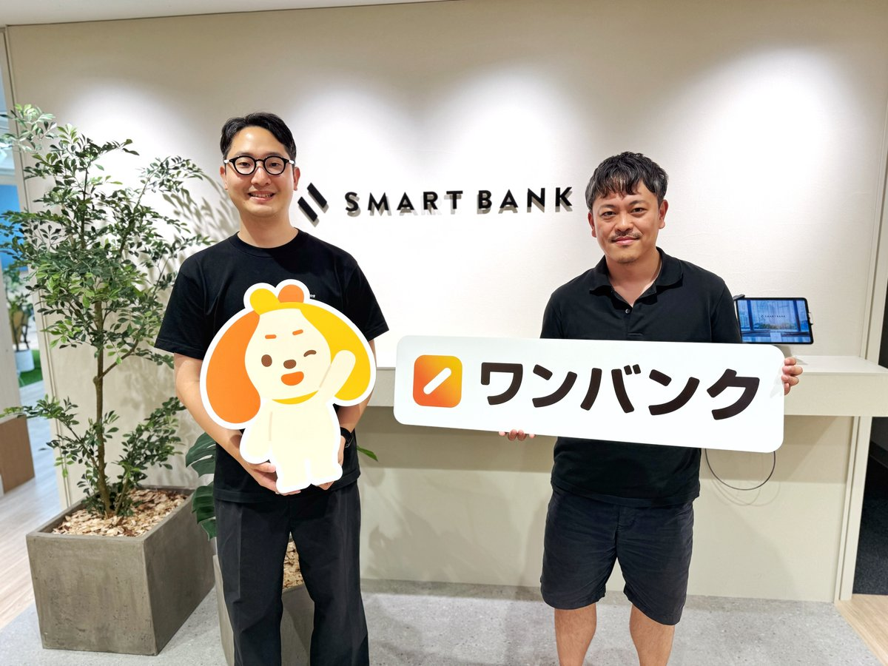

（左から）株式会社スマートバンク プロダクトマネージャー 稲垣 慶典さん、マーケティング部 部長 土屋 信博さん。

> 200万ダウンロードを超える「ワンバンク」などを運営するスマートバンクさんに成功施策や事業開発の裏側を聞きました。本連載の一部は2026年に出版される書籍にも収録予定です。（[取材申請はコチラ](https://few-robin-203.notion.site/21353af152a3802f8f87c1eaca8cbb99)から）

### ⸺ここまで「ワンバンク」はどのように成長してきたのでしょうか？

稲垣：  
最初は1人用の「家計簿プリカ」としてはじまり、そこから派生した1つの口座で2つのカードが使える「ペアカード」がヒットしました。

とくに**「未婚のカップルの方」を中心に広がっていて、約4年間でアプリは200万DLに到達し、GMVは月間で数十億円の規模になっています。**

そこから、もっと幅広い層に使ってもらえるように「AI家計簿アプリ」的な機能を拡充しながら市場を広げるチャレンジをしています。

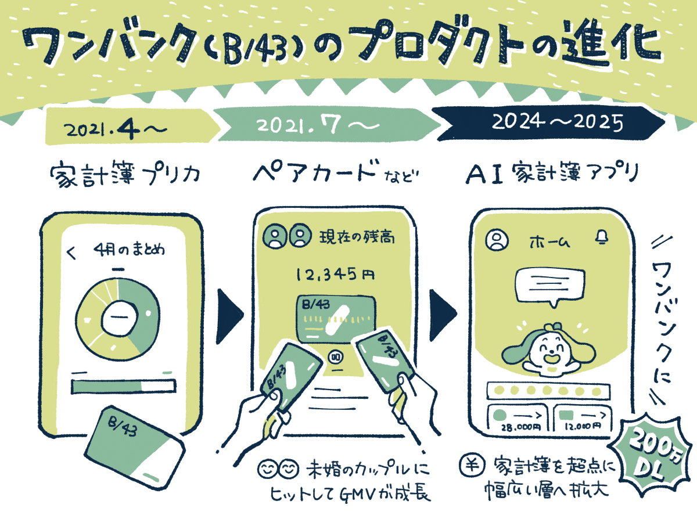

### ⸺スマートバンクではどのように「事業開発」を行なっているのでしょうか？

土屋：  
スマートバンクでは、年間100件以上のユーザーインタビューから得られたインサイトなどをもとに、事業やプロダクトの開発を進めています。

1人1人のユーザーに向き合い「無消費の市場から事業を作る」というユニークさに惹かれて僕もここで働いています。

顧客の課題を見極めたいときに、**スマートバンクで最も重視するのは、その市場にいる顧客の「課題」が存在するのか、存在するならどんな「代替手段」を今は取っているのかを確認しにいくことです。**

例えば、最初につくった「家計簿プリカ」は、無印良品のパスポートケースなどでお金を分けて管理するという代替手段に着目しました。

スマートバンクの創業者らが前職で開発したフリマアプリの「フリル」は、若い女性がブログで服を売るという代替手段に着目しました。

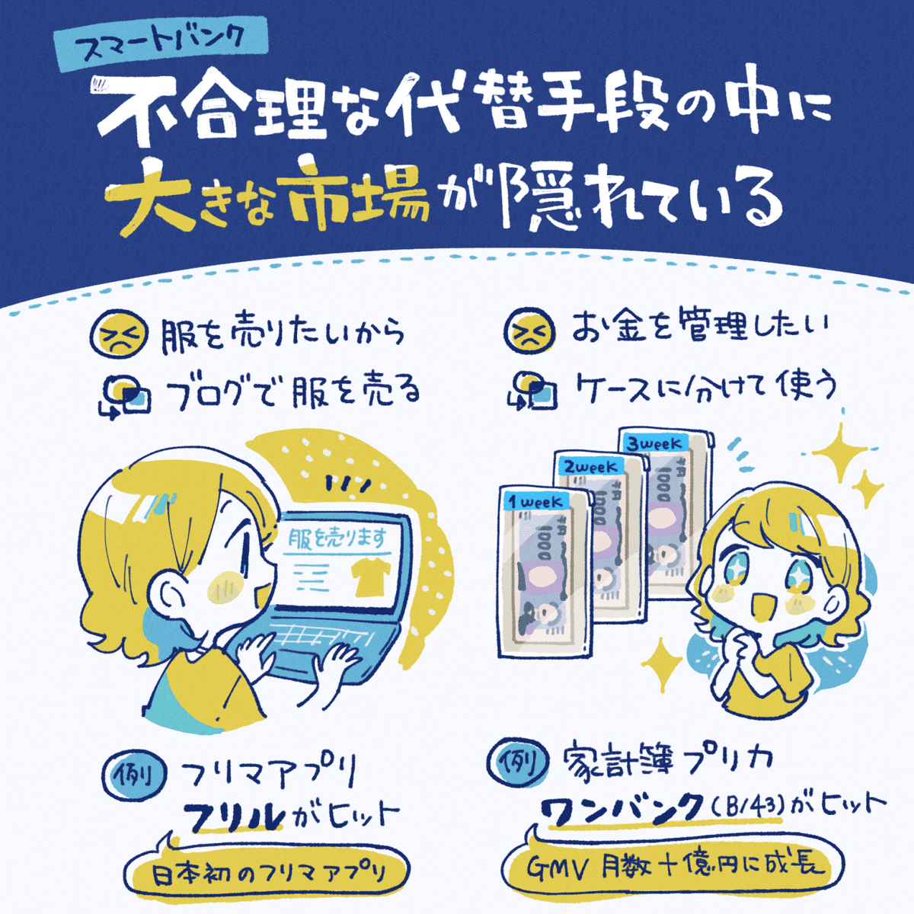

**もしそこに「課題」が存在するなら、ユーザーは何かしらの「代替手段」を採用して課題をすでに解決しています。**代替手段を採用しないならその課題はあまり大きくないのかもしれません。

そのため、ユーザーが課題に対して「不合理な代替手段」をとっているのかどうかを見ることで、商機があるかどうかを見極めています。

### ⸺ユーザーインタビューの「目的や進め方」についても知りたいです。

稲垣：  
僕らは、ユーザーの解像度が高まるほどに、精度の高いマーケティング施策を実行できると考えています。これはたった1人の声でも有効です。

リサーチについては、ユーザーインタビューを型化した「Think N1シート」というものに沿って考えるようにしています。

リサーチの進め方としては、最初はターゲットユーザーの解像度を上げるために、仮説も持たずに「まずは話を聞く」ということをやるんです。

そこから、**4～5人にお話を聞いた上で「この辺に課題がありそうかも？」という仮説を「Think N1シート」に落とし込んで考えます。**

その上で、「ここがまだわからないね」「ここの解像度上げたいよね」というところを切り出して仮説検証や深堀りを進めていますね。

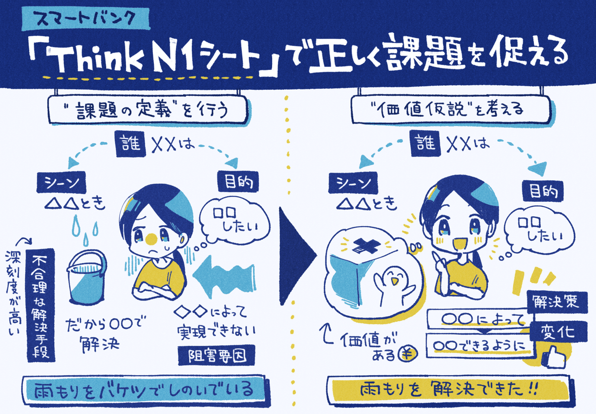

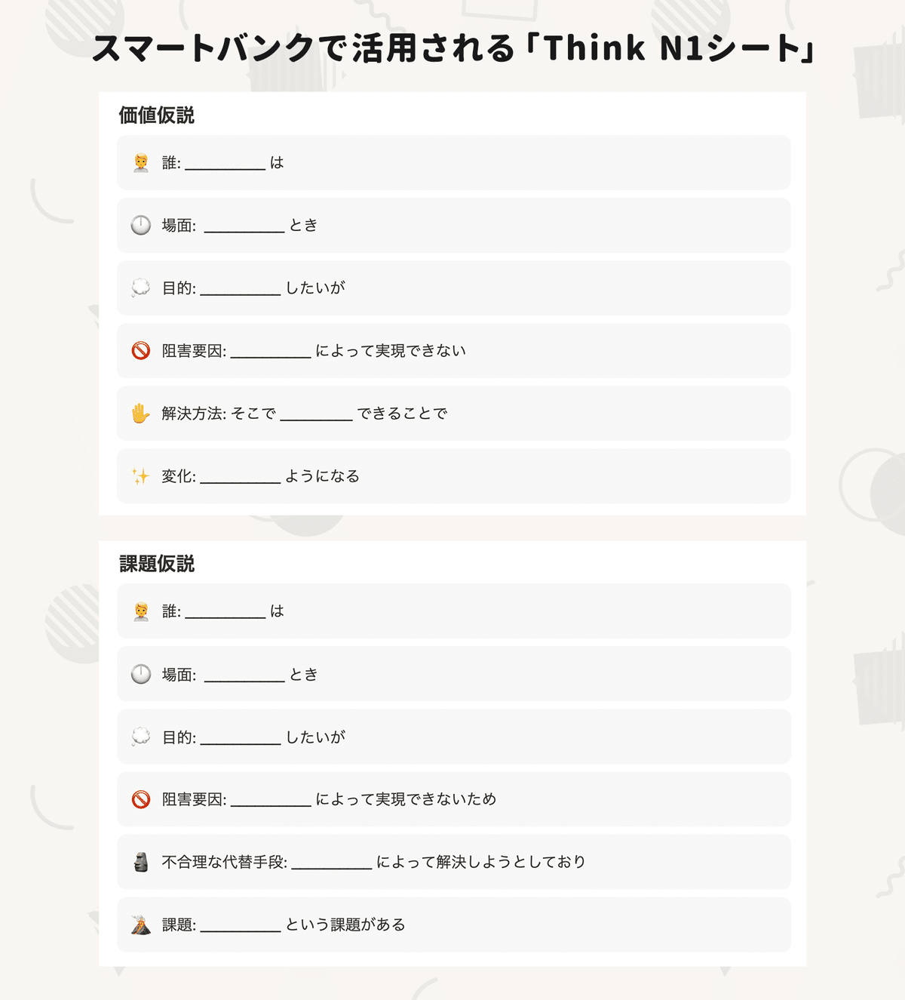

### ⸺事業の成長につながった「ペアカード」は何に着目して生まれたのでしょうか？

土屋：  
実は「ペアカード」も初期の構想にはあったものの、当初は「本当にニーズがあるのかどうか」まではわかっていませんでした。

ただ、**最初に1人用のカードを出したときに「2人で使えないんですか？」という問い合わせが来ていたんですね。能動的な反応は「課題があること」を示すシグナルのひとつだと考えています。**

こうした反響などから「これは課題があるのかも」と感じて、ペアカードを優先的に開発していきました。

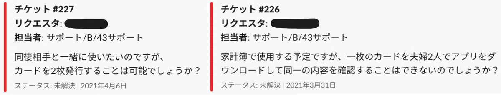

ユーザーからの「問い合わせ」がシグナルの一つに。

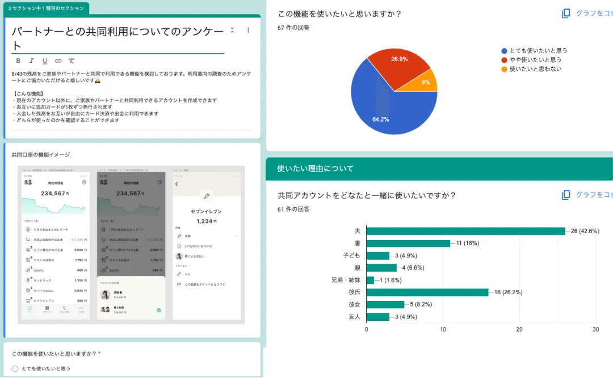

初期に行った「定量調査アンケート」

### ⸺ペアカードを出した後に「これは伸びるかも」と感じた瞬間はありましたか？

土屋： **手応えを感じたのは「継続率の高さ」でしたね。数ヶ月つかった人の半年後の継続率は90％を超えていて、毎月の離脱率もごく僅かでした。**

つまり、ペアカードを1回使ってみて「これめっちゃ便利だ！」と感じた人はほぼ離脱しないで使い続けてくれていたわけです。

ここまで来ると「課題をうまく解消できている」とわかりますよね。そこから事業を推進していくと成長が続きました。

また、課題を解決できているかを検証するために「課題を持つ人」にフォーカスしてユーザーインタビューを行ったりもしましたね。

**アンケートを送って「このサービスがなくなったらどう思いますか？」と質問して、「なくなると困る」という人に絞ってお話を聞きました。**

「サービスがなくなったらどう思いますか？」という質問に「とても残念」と回答する方の割合は、PMFのシグナルとしても参考にしています。

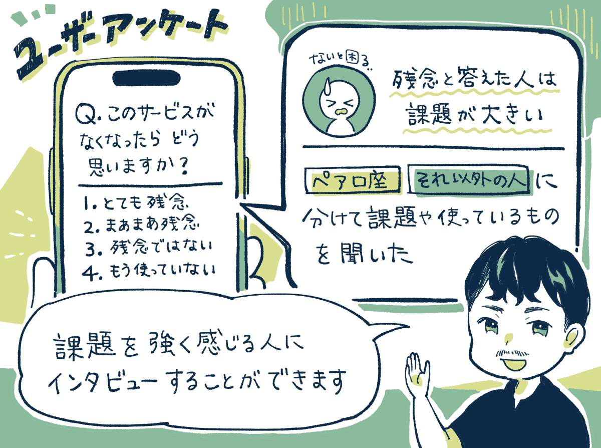

### ⸺ユーザーの声を起点にした「成功施策」があれば教えてください。

土屋：  
インタビューで得られた「ユーザーの声」を広告クリエイティブに活かすと反応がグッと良くなったことがあります。

具体的には、**ユーザーさんの言葉から「1つの口座に、2枚のカード」というメッセージを作ったところ、広告のコンバージョン率が跳ね上がりました。**

これはユーザーの方に「どんなサービスを探していましたか？」を聞くと、「2枚のカードがほしかったんです」みたいな意見が返ってきて。

僕らもペアカードについて「どう説明すればうまく伝えられるだろう？」と試行錯誤していましたが、ヒントはユーザーさんの言葉の中にありました。

YouTuber施策を行うときにも、ユーザーインタビューで出てきたYouTubeチャンネルやタレントを参考にしたりもします。

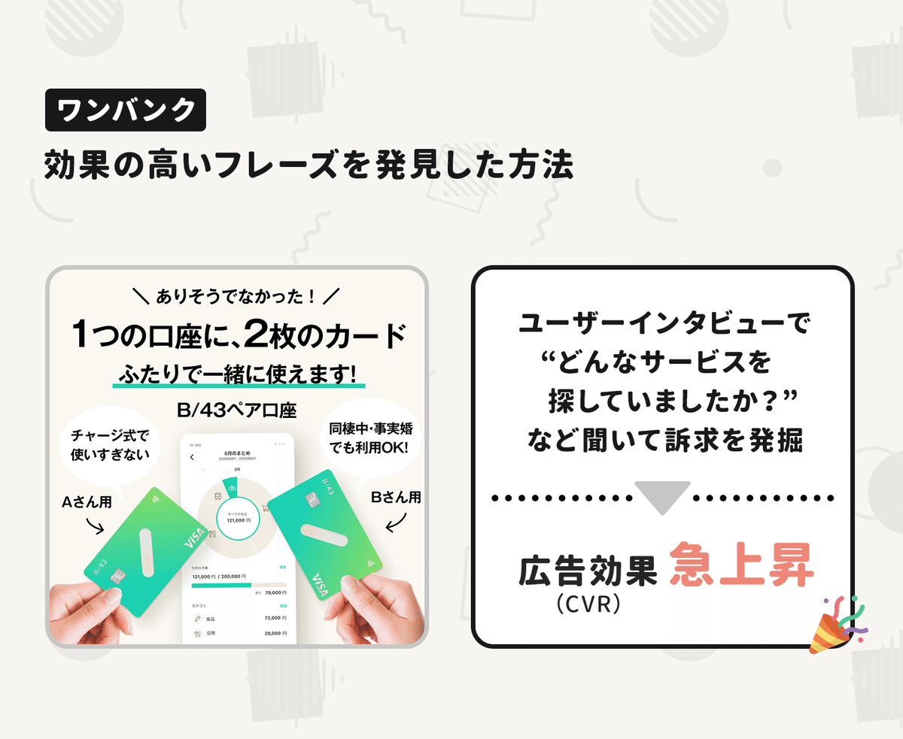

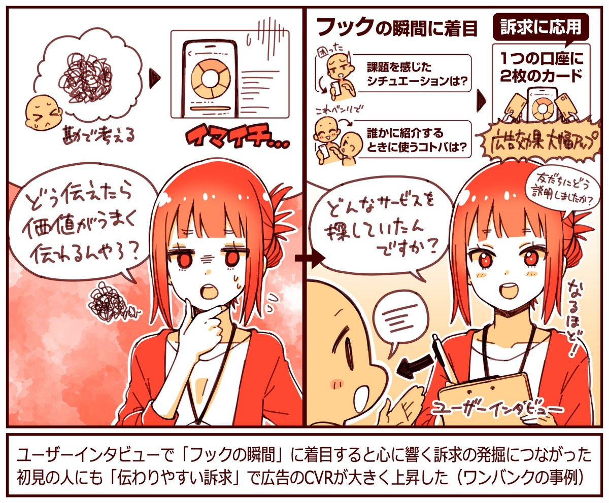

### ⸺他にも「マーケティングの成功事例」があれば教えてください。

稲垣：  
ワンバンクの機能である「AI支出チェッカー」では、インフルエンサーさんを巻き込みながらマーケティングを進めています。

機能をリリースしたら、家計管理インフルエンサーさんなどに「この機能の紹介動画をつくってください」と依頼をしました。対話をしながらPR動画を作っていただき、得られた洞察を広告配信などにも応用しました。

この方法によって、**2024年の初めと比べると、1ダウンロードあたりの獲得コスト（CPI）を約3分の1まで下げることができました。**

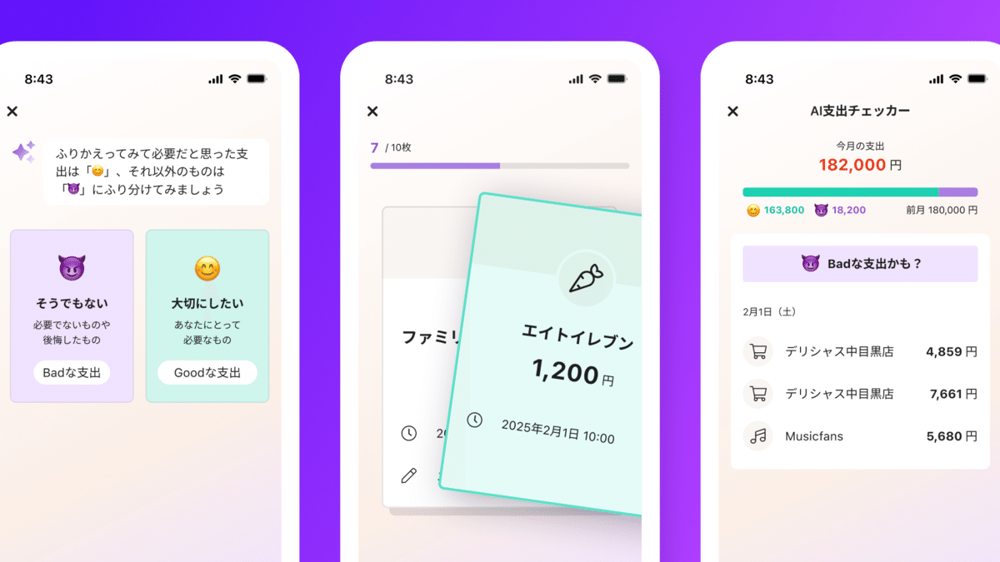

支出をもとに「Good」「Bad」と振り分けると、AIがお金の使い方の好みを学習。

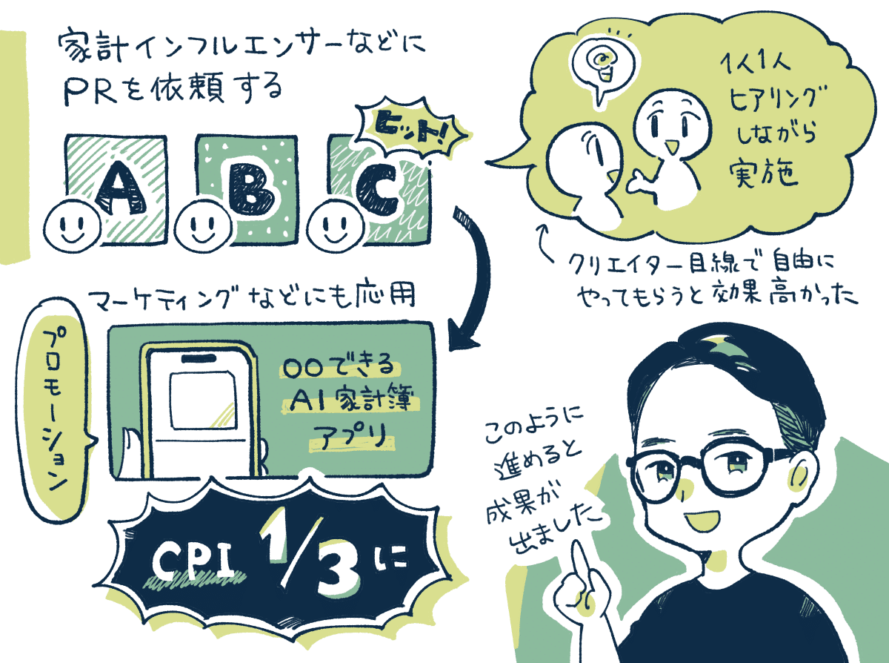

当初は「AIでこんなにハイテク！」など技術的な訴求をしていたが、インフルエンサーの投稿動画から「楽しい、面白い！」などエンタメ的な訴求が響くとわかった。

大きく成功した例に共通しているのは、**SNSの「フォロワーの多さ」よりも動画コンテンツの「制作能力の高さ」だと感じました。**

例えば、あるインフルエンサーの方は、フォロワー数は2万人ほどですが、投稿動画のクオリティが高くて、50万以上のリーチが出ていました。

こちらの枠に当てはめず自由に作ってもらうほうが、想像外のワードや訴求がどんどん生まれて成果につながりましたね。

【取材協力】  
株式会社スマートバンク：<https://smartbank.co.jp/>   
ワンバンク：<https://onebank.jp/>   
株式会社スマートバンク 稲垣 慶典さん、土屋 信博さん、広報の金子さん

【告知】スマートバンクさんでは各職種で採用中。プロダクトマネージャーなど探しているとのこと。ご興味あれば下記サイトからどうぞ。

[**採用情報 | 株式会社スマートバンク**
*株式会社スマートバンクの採用情報です。私達の価値観や募集中の職種、メンバーを紹介しています。*
*smartbank.co.jp*](https://smartbank.co.jp/recruit)

> ※ 以降は、＋αの4つのトピックを購読会員向けにまとめています。ユーザーからの「機能への期待値」を可視化する方法、ユーザーインタビューの募集プラットフォームの使い分け、ヒットする「AI機能」を生み出すポイント、などご興味あればご覧ください。

  

ダウンロード

 

copy

## ここから先は

2,084字
/
4画像

%22%20d%3D%22M-100-100h300v300h-300z%22%2F%3E%3C%2Fsvg%3E)

アプリやプロダクトの成功事例が学べるマガジンです。プロダクトの売上やユーザー数を伸ばしたい人にオススメです。成長プロダクトのインタビュー、効果のあったマーケティング施策、事例やデータなどが中心（月に7記事ほど）多くの過去記事も5年ほど遡って読めます。クレカ決済だと初月無料なのでお試しでもぜひ。

### [月刊アプリマーケティング](/m/mc375c9b46464)

¥2,000 / 月  
初月無料

プロダクト運営について学べるマガジンです。アプリやプロダクトの売上やユーザー数を伸ばしたい人にオススメです。月に7記事ほどお届けします。

購読手続きへ

%22%20d%3D%22M-100-100h300v300h-300z%22%2F%3E%3C%2Fsvg%3E)%22%20d%3D%22M-100-100h300v300h-300z%22%2F%3E%3C%2Fsvg%3E)%22%20d%3D%22M-100-100h300v300h-300z%22%2F%3E%3C%2Fsvg%3E)

3人が高評価

[ログイン](https://note.com/cd/login?redirect_to=https%3A%2F%2Fmarkelabo.com%2Fn%2Fn7c33291a73c8)

   

51

[%22%20d%3D%22M-100-100h300v300h-300z%22%2F%3E%3C%2Fsvg%3E)](/)

[アプリマーケティング研究所](/)

フォロー

プロダクトの成功事例を発信しているメディアです。2013年から約10年運営しています。取材相談はツイッターDM（@appmarkelabo）かメールにてどうぞ！info@appmarketinglabo.net