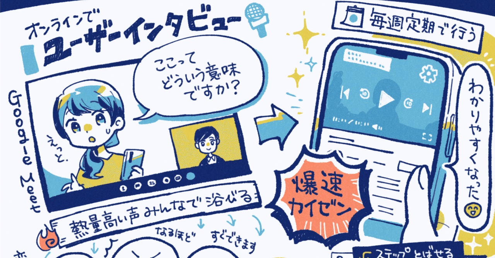  

# 熱量の高い「ユーザーの声」をチームで浴びながら爆速でカイゼン。NewsPicksが実践するUXリサーチの手法「ユーザーインタビュー・サースデイ」の裏側と3つの成功施策。

46

[%22%20d%3D%22M-100-100h300v300h-300z%22%2F%3E%3C%2Fsvg%3E)](/)

[アプリマーケティング研究所](/)

2025年7月28日 11:30

¥2,000/月

NewsPicksさんを取材しました。

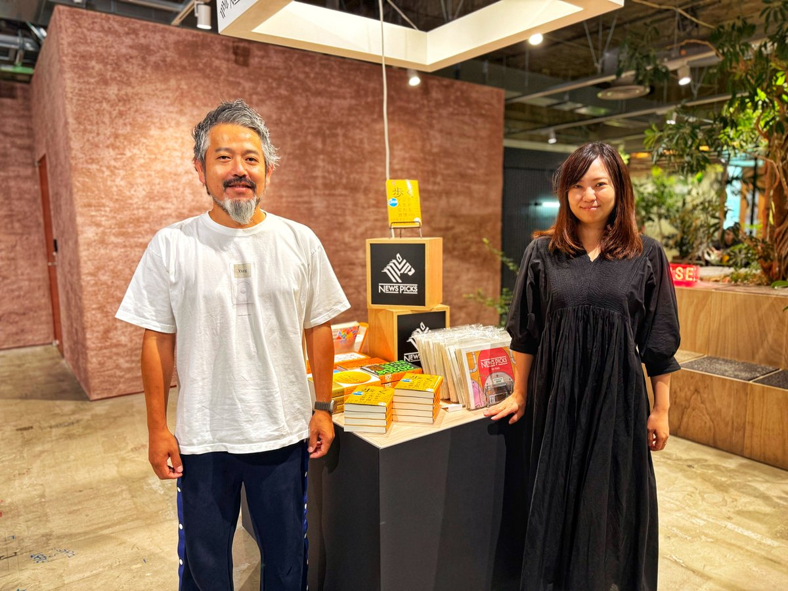

株式会社ユーザベース NewsPicks 執行役員 CXO 鳥居 大さん、プロダクトマネージャー 高橋 茉由実さん。

> 累計会員数が1,100万人を超えるソーシャル経済メディア「NewsPicks」さんに、UXリサーチの工夫やプロダクトの成功施策を聞きました。本連載の一部は2026年に出版される書籍にも収録予定です。（[取材申請はコチラ](https://few-robin-203.notion.site/21353af152a3802f8f87c1eaca8cbb99)から）

### ⸺NewsPicksで「ユーザー体験向上」のために続けていることを教えてください。

鳥居：  
毎週木曜に「ユーザーインタビュー・サースデイ」と呼ばれるインタビューの日を作って、UXリサーチを続けています。

当初は社内の参加者も少なかったのですが、毎週毎週続けると参加者が増えていって、約1年ほどでチームの文化になっていきました。

インタビューはGoogle Meetで実施、Slackで社内に中継していて。職種横断で集まった約20名がチャットをしながらリアルタイムで視聴しています。

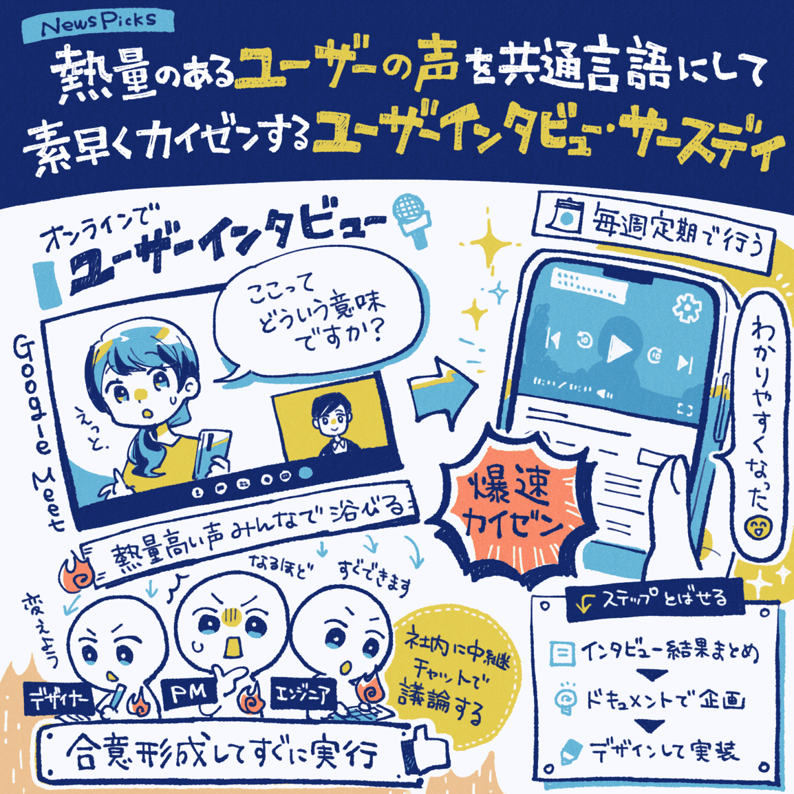

### ⸺これを続けたことで、どんなメリットが得られましたか？

高橋：  
これめちゃくちゃいいのは、**ユーザーさんの「熱量のある言葉」をみんなで浴びることで、すごい速さで合意形成して実装までいけるんですよ。**

例えば、以前にあったのは「動画を倍速で見たいけど、倍速がないから不便なんですよね」とユーザーの方がお話しになっていて。

**でも実際には「倍速機能」はあるんです。ただ、三点リーダーの中に隠れていて意味も伝わっておらず、機能を見つけてもらえていなかった。**

このやり取りを見て、リアルタイムで「意味が伝わっていない、変えよう！」と意思決定をして「歯車マーク」に変えることにしました。

本来なら、インタビューの意見をまとめて、ドキュメントに落とし込んで、デザインして実装しますが、デザイナーもエンジニアもPMも聞いていたので、これをすっ飛ばして実装できました。

つまり、チームみんなで同じ「生の声」を聞くと、それが共通言語のように機能して、企画から実装までのリードタイムが短くなるんです。

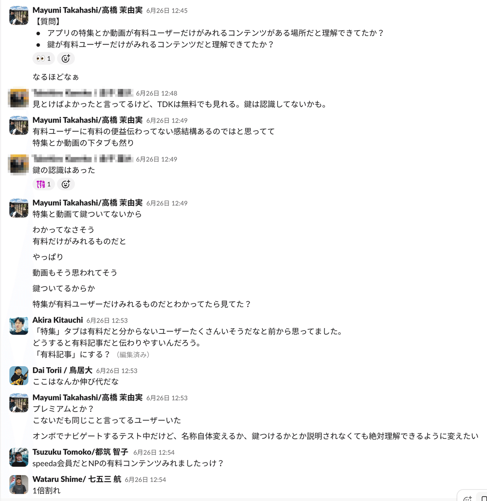

ユーザーインタビュー中の"社内チャットの様子"

### ⸺どんなユーザーに話を聞くと良いですか？

鳥居：  
目的によっても変わりますが、**主にずっと続けているのは「新規ユーザーの方」にお話を聞くことです。**

新規ユーザーに絞る理由は、**「何を期待して使いはじめて何が違ったのか？」という"心の中にあった期待とそのギャップ"を最も知りたいからですね。**

それを鮮明かつ具体的に聞けるのは「使いはじめたタイミング」なので、これが新規の方にお話を聞く理由のひとつになっています。

あとは、「どこで知ったか？」というチャネル、「何に時間を使っているか？」という可処分時間、「どう認知されたか」という認知経路なども聞きます。

**これって"先週と今週の差分"は小さいですが、"今週と1年後の差分"だと結構大きくなるはず。その変化を捉えることが狙いなんです。**

このギャップに「未来の成長要因」が潜んでいます。新しいチャネルを発掘できたり、想像もしなかった体験価値が見つかる可能性があります。

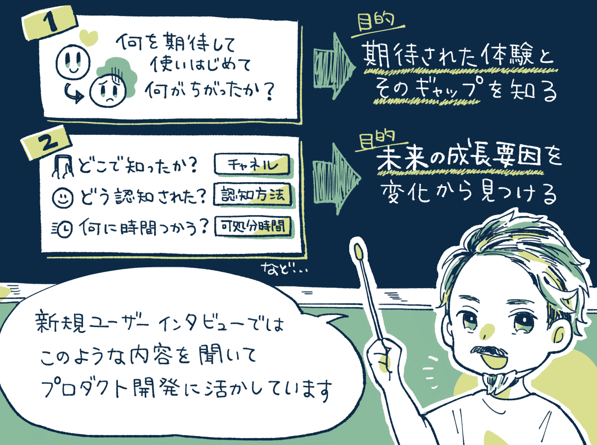

NewsPicksに定期的に流入する、新規登録ユーザーに「インタビューの招待メール」を自動送信、カレンダーから日程を予約してもらう形で"仕組み化"しているそう。

### ⸺インタビューのときの「質問のポイント」をぜひ教えてください。

高橋：  
**決まった質問をするよりは「どんな使い方をするか？アプリをどこからどう見ていくか？」を観察してペインポイントを探ることが大切です。**

スマホの画面を触ってもらいながら「ユーザーの方がどう使っているか？」を質問をしていくと発見があるんですよ。

例えば、「ここはなぜ見ないのかな？」「この機能の意味は伝わっているかな？」と思ったら突っ込んで質問をします。

すると「やっぱりそうか！」とわかります。このように"想定していた使い方とのギャップ"を見ていくと改善ポイントを発見しやすいです。

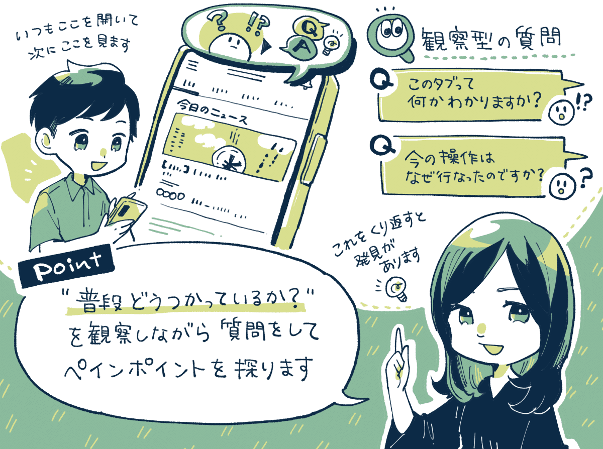

## ユーザーリサーチなどから「指標の改善」につながった3つの成功施策。

### 成功施策①：トライアルの開始直後に「ガイド」を表示したら有料転換率が13％上昇。

> 【2025. 9/10 追記】初期の検証では「CVRが高まる良い効果が見られた」が継続的なテストを行うと「CVRに優位差までは見られない」という結果になっており、また別の形での仕様を検証しているとのこと。

高橋：  
NewsPicksでは、**無料トライアルを開始した直後に、サービス内を案内するガイド（オンボーディング）を表示する**という仕組みを導入しました。

この施策によって、**無料トライアルから有料会員に移行する確率を13％ほど向上させることができました。**

導入のきっかけは、ユーザーインタビューをすると「有料コンテンツが見られる場所があまり伝わっていない」と実感したことです。

この課題に向けて「主要コンテンツの紹介」「有料コンテンツのタブの案内」などを行うようにしました。

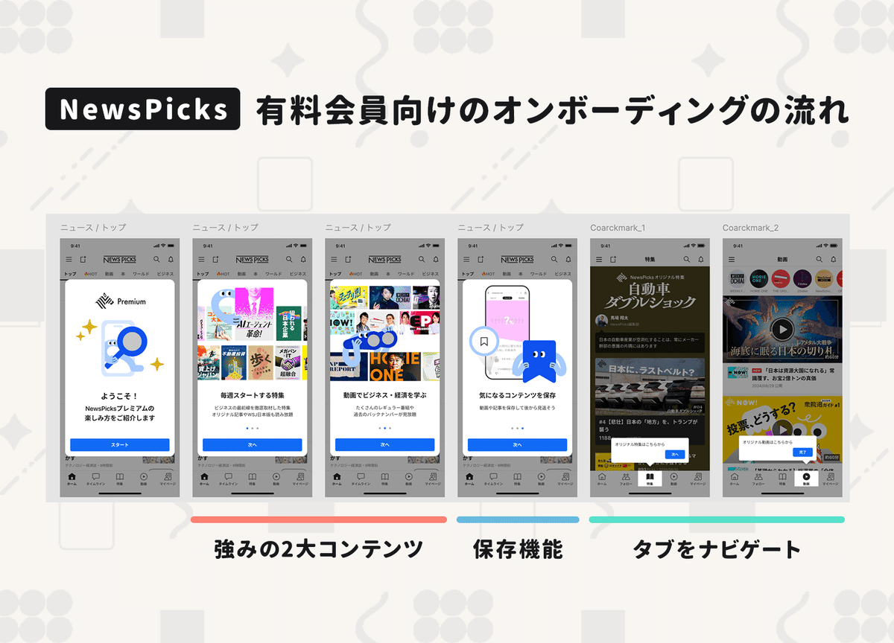

長めの動画も多く「隙間時間で消化できない人」も多かったため「保存機能（後から見返せる）」も訴求すべきだとユーザーインタビューから判断した。

### 成功施策②：プッシュ通知は「ニーズの高い通知」だけ許諾してもらうと体験が良くなりやすい。

高橋：  
プッシュ通知で上手くいった工夫は、**ユーザーが受け取りたい通知に絞って「通知をオンにしませんか？」と聞いてみることでした。**

具体的には、**速報ニュースに絞って「速報のプッシュをオンにしませんか？」と聞くポップアップを検証すると、通知の受信率が約6％改善されました。**

同じニュースの中でも、速報ニュースだけは受け取りたいけど、他のニュースは要らないという方って結構多いんですよ。

通知の種類を分けて「ニーズが高い通知」に絞って訴求すると効果が高くなりやすいのだなと学びました。

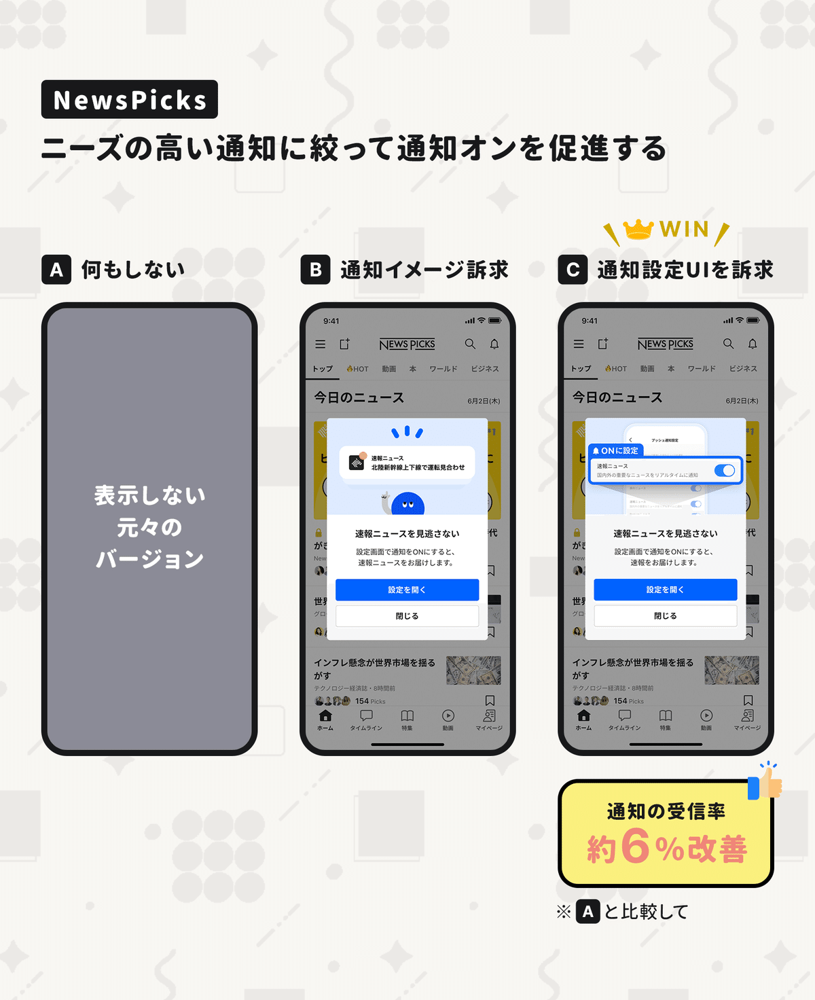

この施策の前段階として、2025年の年初に「通知の種類」を分けて通知のオン・オフを設定できるようにしたのも良かったですね。

種類を分けていない場合、1つの通知が「自分に合わない」と判断されると、通知全体を「オフ」にされて接点が消えてしまいます。

そのため「通知の種類」を細分化しておくほうが、通知オンにするハードルを下げることができます。

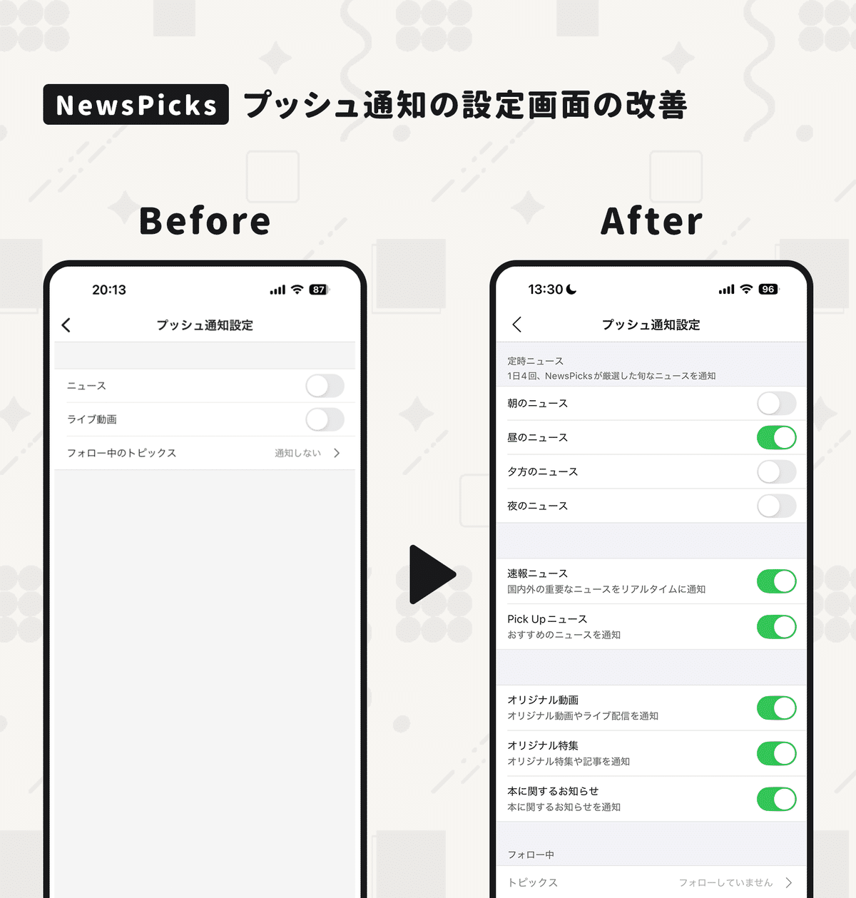

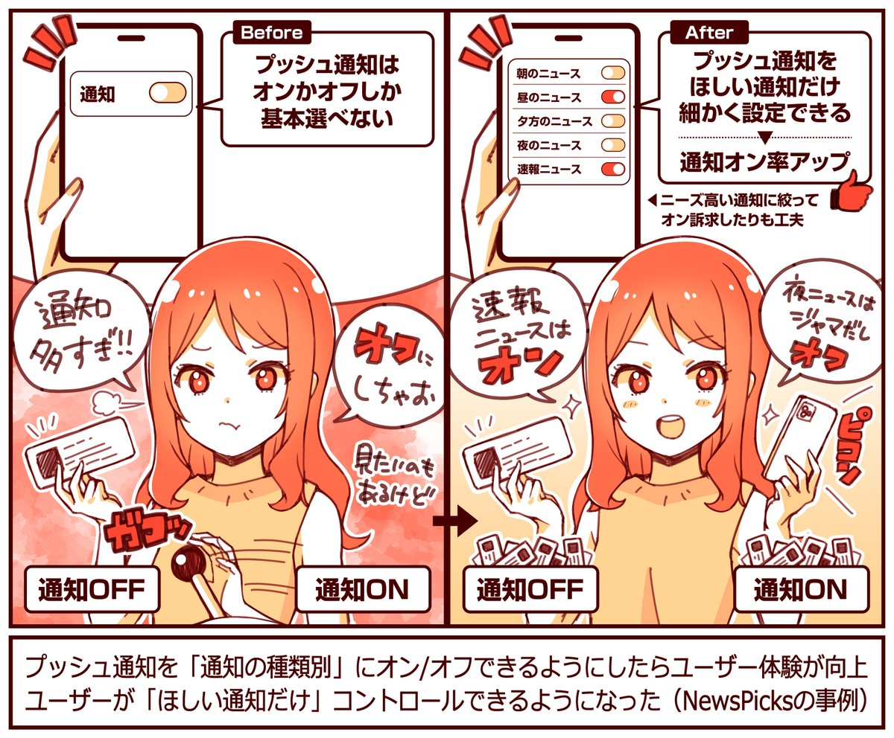

### 成功施策③：独自ボタン「PICKボタン」を分解したら指標が伸びた。

鳥居：  
NewsPicksには「PICKボタン」が2024年初頭まであったのですが、最終的にこのボタンを「なくす」という判断をしました。

理由の一つは、PICKボタンに対して「何が起こるのかわからなくて押すのが怖い」「そもそも使いづらい」という意見が出ていたためです。

そこで、**PICKボタンが担っていた「コメント・保存・シェア」という動機の異なる3つの役割を、それぞれの機能に分解することにしたんですね。**

結果的には、**3つの機能に分解したことで、ボタンを押すユーザーが約1.5倍に、コメントをするユーザーが約1.2倍に増える効果がありました。**

わかりやすくしたことで「アクションの総量が増える」というある種当たり前の結果になりましたね。

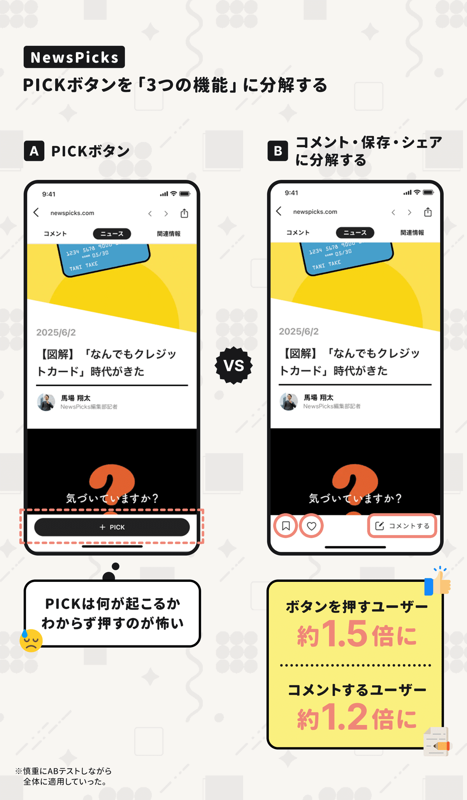

---

【取材協力】  
株式会社ユーザベース：<https://www.uzabase.com/jp/>   
NewsPicks：<https://newspicks.com/>   
株式会社ユーザベース 鳥居 大さん、高橋 茉由実さん

> ※ 以降は、＋αの【5つの事例】を購読会員向けにまとめています。  
> 【① プッシュ通知の反応率を**「小さな検証」で高める方法**】  
> 【② 有料転換率が動いた**「ペイウォール」の検証事例**】  
> 【③ 人力の「コンテキスト型編集」で**有料継続率を高めた話**】  
> 【④ 有料コンテンツの**「鍵アイコン」のデザイン検証**】  
> 【⑤ 動画の「おすすめ欄」の**ロジックの検証事例**】  
> などご興味あればご覧ください。

  

ダウンロード

 

copy

## ここから先は

1,986字
/
6画像

%22%20d%3D%22M-100-100h300v300h-300z%22%2F%3E%3C%2Fsvg%3E)

アプリやプロダクトの成功事例が学べるマガジンです。プロダクトの売上やユーザー数を伸ばしたい人にオススメです。成長プロダクトのインタビュー、効果のあったマーケティング施策、事例やデータなどが中心（月に7記事ほど）多くの過去記事も5年ほど遡って読めます。クレカ決済だと初月無料なのでお試しでもぜひ。

### [月刊アプリマーケティング](/m/mc375c9b46464)

¥2,000 / 月  
初月無料

プロダクト運営について学べるマガジンです。アプリやプロダクトの売上やユーザー数を伸ばしたい人にオススメです。月に7記事ほどお届けします。

購読手続きへ

%22%20d%3D%22M-100-100h300v300h-300z%22%2F%3E%3C%2Fsvg%3E)%22%20d%3D%22M-100-100h300v300h-300z%22%2F%3E%3C%2Fsvg%3E)%22%20d%3D%22M-100-100h300v300h-300z%22%2F%3E%3C%2Fsvg%3E)

3人が高評価

[ログイン](https://note.com/cd/login?redirect_to=https%3A%2F%2Fmarkelabo.com%2Fn%2Fn701af7b8f8fd)

   

46

[%22%20d%3D%22M-100-100h300v300h-300z%22%2F%3E%3C%2Fsvg%3E)](/)

[アプリマーケティング研究所](/)

フォロー

プロダクトの成功事例を発信しているメディアです。2013年から約10年運営しています。取材相談はツイッターDM（@appmarkelabo）かメールにてどうぞ！info@appmarketinglabo.net