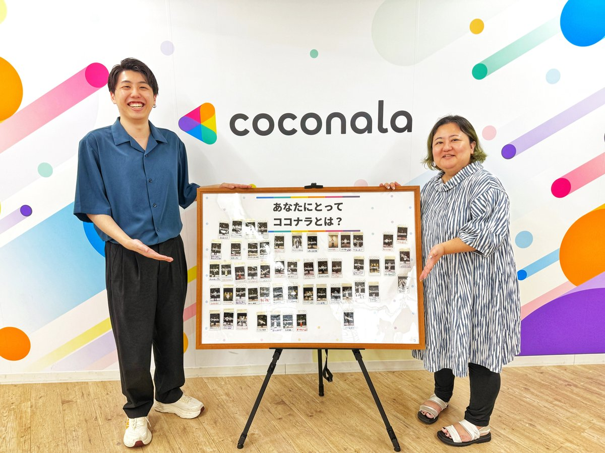
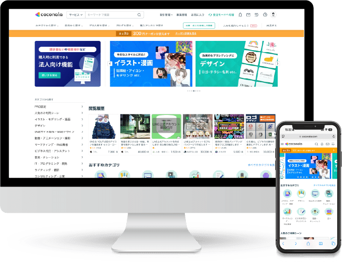
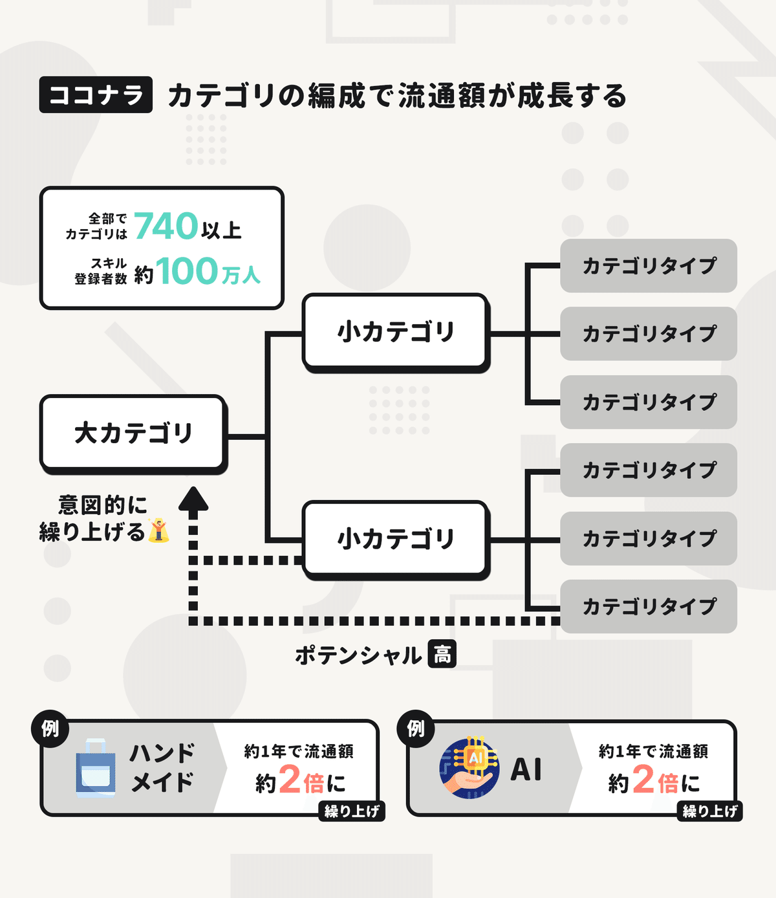
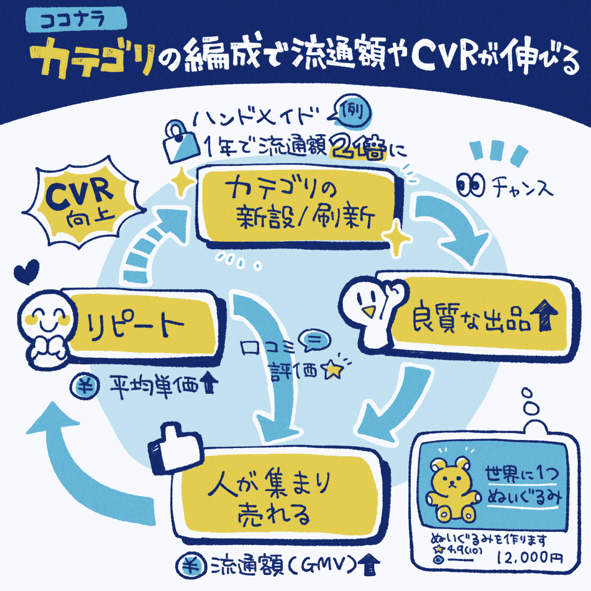
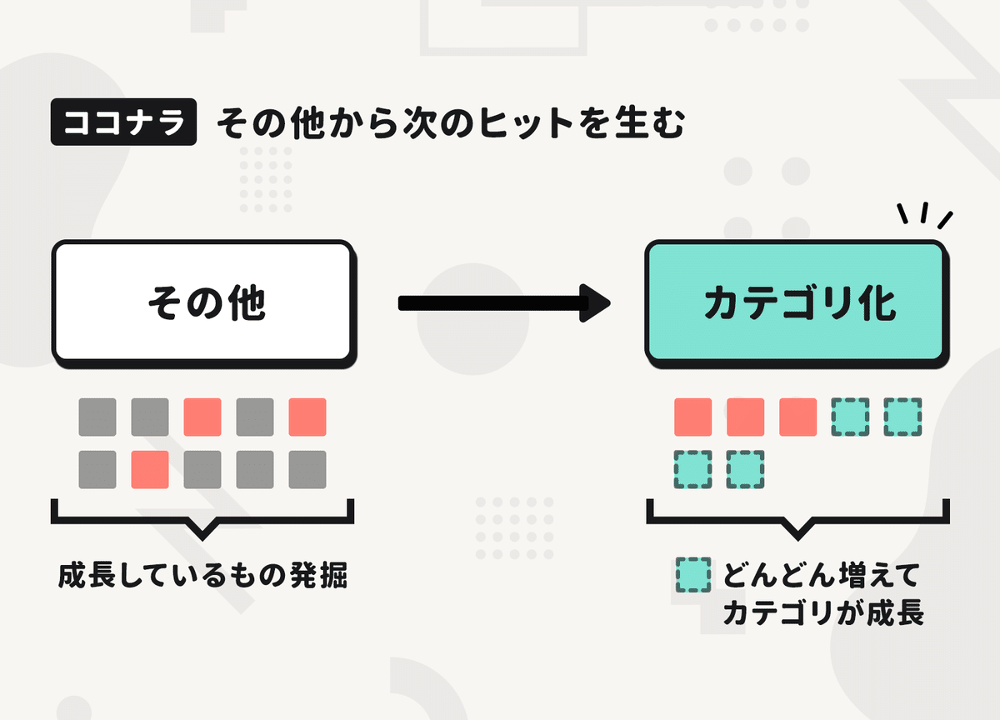
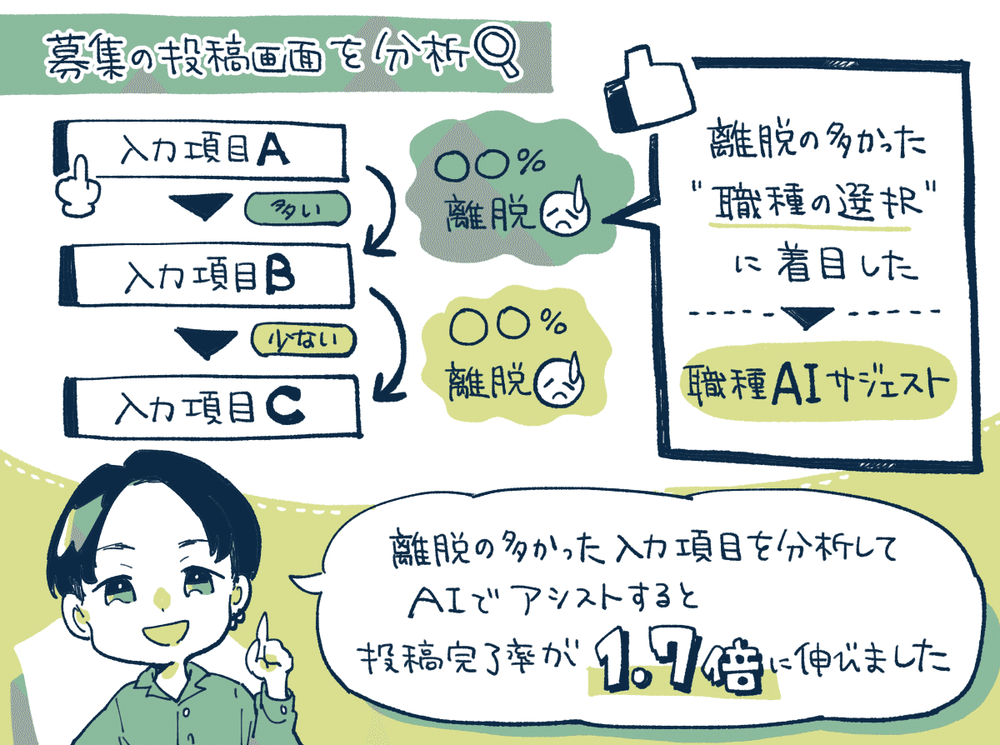
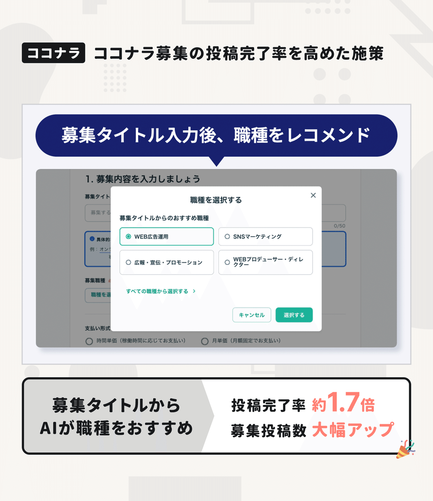
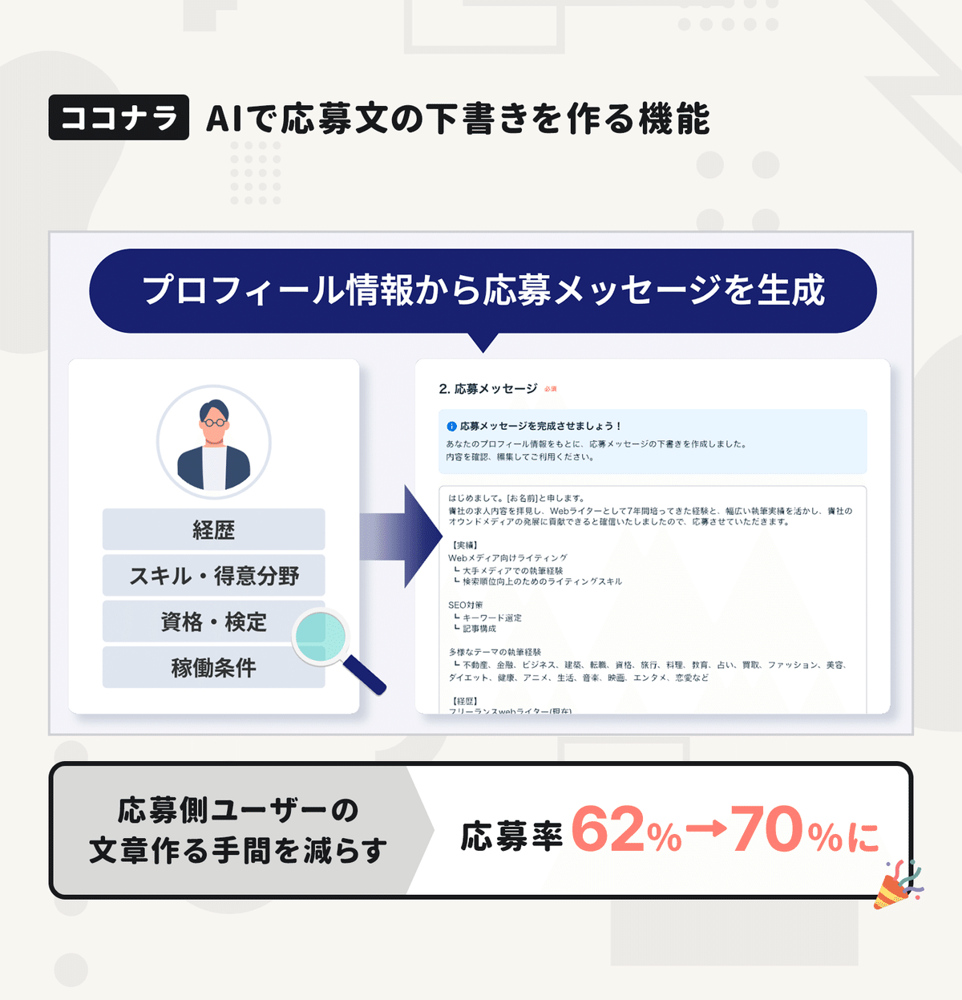

  

# 未来のヒットカテゴリは「その他」の中から発掘されて生まれる。マーケットプレイスのGMVが年間150億円を超える「ココナラ」に聞くカテゴリ編成戦略と2つの成功施策。

15

[%22%20d%3D%22M-100-100h300v300h-300z%22%2F%3E%3C%2Fsvg%3E)](/)

[アプリマーケティング研究所](/)

2025年7月30日 11:30

¥2,000/月

ココナラさんを取材しました。

(左から) 株式会社ココナラ 杉山 友翔さん、執行役員 VP of Product Management 竹下 加奈子さん

> マーケットプレイスのGMVは年間150億円以上、会員登録数540万人のスキルマーケット「ココナラ」さんに成功施策など聞きました。本連載の一部は2026年に出版される書籍にも収録予定です。（[取材申請はコチラ](https://few-robin-203.notion.site/21353af152a3802f8f87c1eaca8cbb99)から）

### ⸺ココナラではどんなポイントに着目して「流通額」などを伸ばしていますか？

竹下：  
ココナラには**現在「740以上のカテゴリ」があるのですが、購入数や流通額を引き上げるために力を入れているのが"カテゴリを分けること"**なんです。

カテゴリの「昇格・新設・分割・統合」などを適切に行うと、サービス全体の購入率や流通額を成長させることができます。

特に重要なのは、**時代の流れやトレンドを見ながら「下の階層のカテゴリ」にあるものを、並びの粒度に違和感があっても上層にドンと移動させることです。**

私も入社した時には「そんなことが効くんかいな？」と不思議に思いましたが、めちゃくちゃ効果があるので戦略的に行っています。

例えば**「ハンドメイド」カテゴリは、下の階層から上に移動したことで、1年で流通額が2倍になりました。**

これはカテゴリを分けただけ。それ以外は何もしていない。この采配こそが命なんです。それだけで流通額が変わるのは面白いですよね。

「大カテゴリ」「小カテゴリ」「カテゴリタイプ」の3層。2024年4月にカテゴリ数を「740以上」に増やした結果、全体の購入率（CVR）も向上した。

カテゴリを最適化できると「有力な出品サービスの増加」を軸に成長サイクルが回る。

### ⸺とくに「ここに注目してカテゴリを編成する」というポイントはありますか？

竹下：  
ココナラには「次のヒット」が生まれてくる場所があって。**それは「その他」というカテゴリ名のまだない出品が集まるカテゴリなんです。**

なので「その他」をめちゃくちゃ見ます。社内でも「その他は宝の山だ」と話しますし、運営チームに新しく入った人には、まずは「その他」を眺め回すことからはじめてもらっています。

「その他」を観察していると、徐々にムーブメントが盛り上がってきて「なぜこれが売れているんだ！？」というものが出てくるんですよ。

その状態から「その他」からカテゴリに切り出すと、流通高が爆発的に伸びるケースがあります。新しいステージを作ってスポットライトを当てて、みんなに知ってもらうイメージですね。

例えば、その他から昇格した**「VTuberモデリング・イラスト」カテゴリは、爆発的に成長していて今では柱の一つになっています。**

このように、ココナラの流通高のかなりの部分を支えるカテゴリの中にも、数年前は「小さなカテゴリだったもの」もあるんですね。

ただユーザーから見たときには「その他」は目立たないようにしています。以前は大カテゴリにもあったのですが今は2階層目以下にしかありません。

理由は、出品者としてはどうしても楽だから「その他」に入れがちですし、購入者からすると「その他」にあると探しづらくなるからです。

### ⸺「その他」の中にあるものの成長ポテンシャルはどう判断しますか？

竹下：  
複数の角度からいろいろな指標を見ながら、成長のポテンシャルを判断していますね。

例えば、サイト内ニーズと世の中のニーズを分けて考えます。**ココナラでの検索数を見れば「サイト内ニーズ」がわかります。Googleでどれくらい検索されているかを見れば「世の中のニーズ」が一定わかります。**

売上の成長率やキャンセル率を見れば、そのカテゴリの成長ポテンシャルが感じ取れます。このように突出した指標ではなく総合的に判断しますね。

どのくらいまで育てば「カテゴリ」として括ると火がつくかを見極めるのは職人芸に近いかもしれないです。当然、間違うこともあります。笑

## サービス成長につながった2つの成功施策。

### 成功施策①：ココナラ募集の「募集投稿完了率」を1.7倍に高めた機能。

杉山：  
ココナラには『ココナラ募集』と呼ばれる、「お願いしたいことがある人」と「対応できる人」をつなぐサービスがあります。

この『ココナラ募集』で成功したのが「職種AIサジェスト」という投稿者の負担を軽くする機能でした。

やったことはまず、**募集の投稿画面で「フォームの項目別の離脱率」を分析すると「職種の選択」で離脱しているユーザーが多いとわかりました。**

例えば、この募集は「マーケター向けかな？ それともコンサル向けかな？」と迷って離脱してしまう方が多かったんですね。

そこで、**まずは1行のタイトルで「やりたいこと」を書いてもらい、それに沿ってAIが「適切な職種はコレ」と提案するようにしました。**

すると成果としては、**募集の投稿完了率が1.7倍になり（約10%→約17%）、募集数の増加にもポジティブな影響がありました。**

この機能は「企業担当者の方」に使われることも多いため、忙しい担当の方の負担を減らすこともポイントでした。

以前は最初に「職種」を選ぶ形だったが、タイトルを書くと職種がレコメンドされるように。

### 成功施策②：ココナラ募集の「応募完了率」を高めた機能。

杉山：  
ココナラ募集の応募側の成功例としては**「プロフィールから応募文章をAIが作成するアシスト機能」を入れたところ応募率が伸びたことです。**

もともとの画面では、応募ボタンを押したあとに希望単価などを入力して「自分を売り込む文章」をゼロから書かないといけなかったので、多くの方がそこで離脱してしまっていました。

発注側にヒアリングをすると、発注が決まりやすい応募メッセージとは**「案件の内容を理解した上で、応募者がスキルをどう提供できるのか？」をきちんと語っている文章だ**とわかったんですね。

そこで考えたのが、応募者のプロフィールと案件内容をベースに、自動で下書きを作成するAI機能でした。

応募の画面を開くと**「御社の○○の案件に対して△△の経験があり、□□で貢献できます」という文章の骨子がAIで作成されて、それを調整して応募できるようにすると応募完了率が62％→70％まで上がりました。**

---

【取材協力】  
株式会社ココナラ：<https://coconala.co.jp/>   
ココナラ：<https://coconala.com/>   
株式会社ココナラ 竹下 加奈子さん、杉山 友翔さん、広報の小澤 美樹さん

【告知】ココナラさんでは各職種で採用中。プロダクトマネージャーやデータアナリストなど募集しているそう。ご興味あれば下記サイトからどうぞ。

[**トップ - 株式会社ココナラ 採用サイト**

*coconala.co.jp*](https://coconala.co.jp/recruit/)

> ※ 以降は、＋αの4つのトピックスを購読会員向けにまとめています。  
> 【① ココナラ**「定期購入」急成長に貢献した**仕掛け】  
> 【② ユーザーの**「温度感を感じる声」を集める**工夫】  
> 【③ ユーザーの声から**「ヒット機能」**が生まれた話】  
> 【④ サイト内広告**「サービスPR」想定外な活用法**】  
> などご興味あればご覧ください。

  

ダウンロード

 

copy

## ここから先は

2,193字
/
5画像

%22%20d%3D%22M-100-100h300v300h-300z%22%2F%3E%3C%2Fsvg%3E)

アプリやプロダクトの成功事例が学べるマガジンです。プロダクトの売上やユーザー数を伸ばしたい人にオススメです。成長プロダクトのインタビュー、効果のあったマーケティング施策、事例やデータなどが中心（月に7記事ほど）多くの過去記事も5年ほど遡って読めます。クレカ決済だと初月無料なのでお試しでもぜひ。

### [月刊アプリマーケティング](/m/mc375c9b46464)

¥2,000 / 月  
初月無料

プロダクト運営について学べるマガジンです。アプリやプロダクトの売上やユーザー数を伸ばしたい人にオススメです。月に7記事ほどお届けします。

購読手続きへ

[ログイン](https://note.com/cd/login?redirect_to=https%3A%2F%2Fmarkelabo.com%2Fn%2Fn5cbd62f873a5)

   

15

[%22%20d%3D%22M-100-100h300v300h-300z%22%2F%3E%3C%2Fsvg%3E)](/)

[アプリマーケティング研究所](/)

フォロー

プロダクトの成功事例を発信しているメディアです。2013年から約10年運営しています。取材相談はツイッターDM（@appmarkelabo）かメールにてどうぞ！info@appmarketinglabo.net