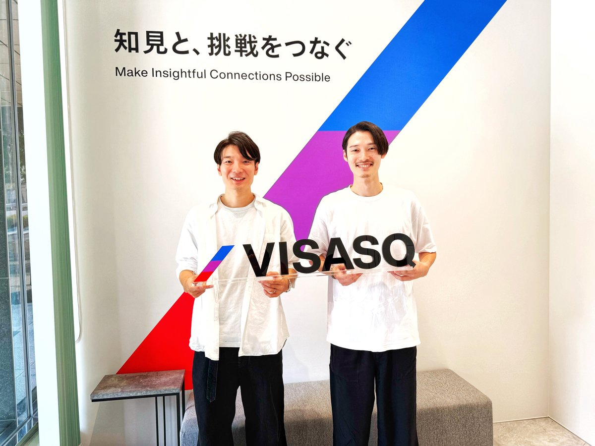
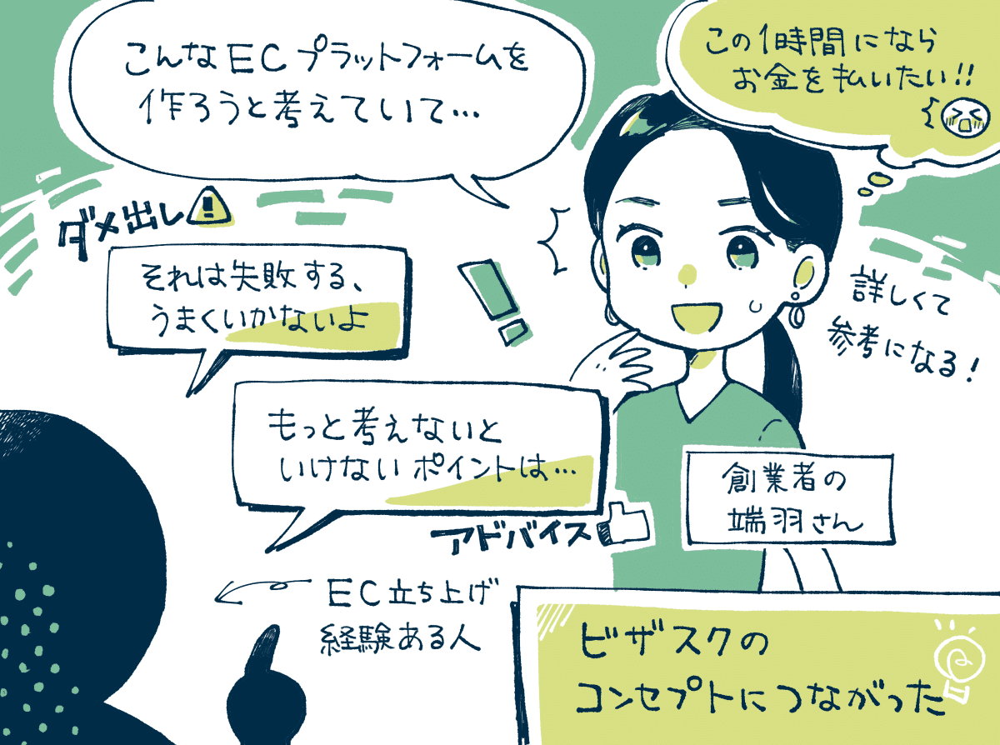
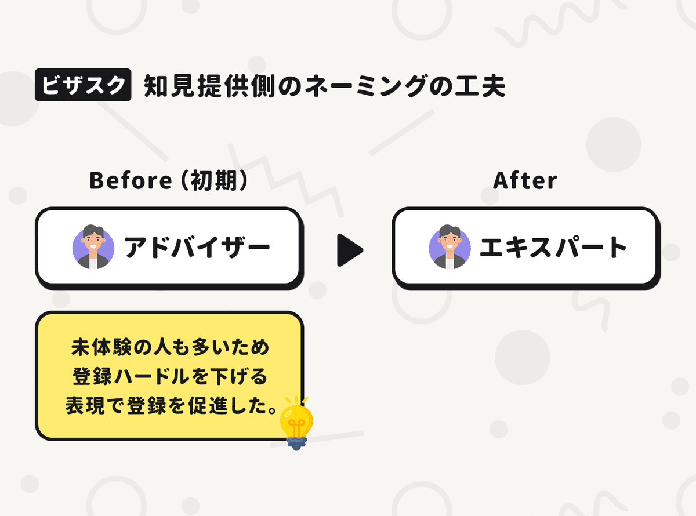
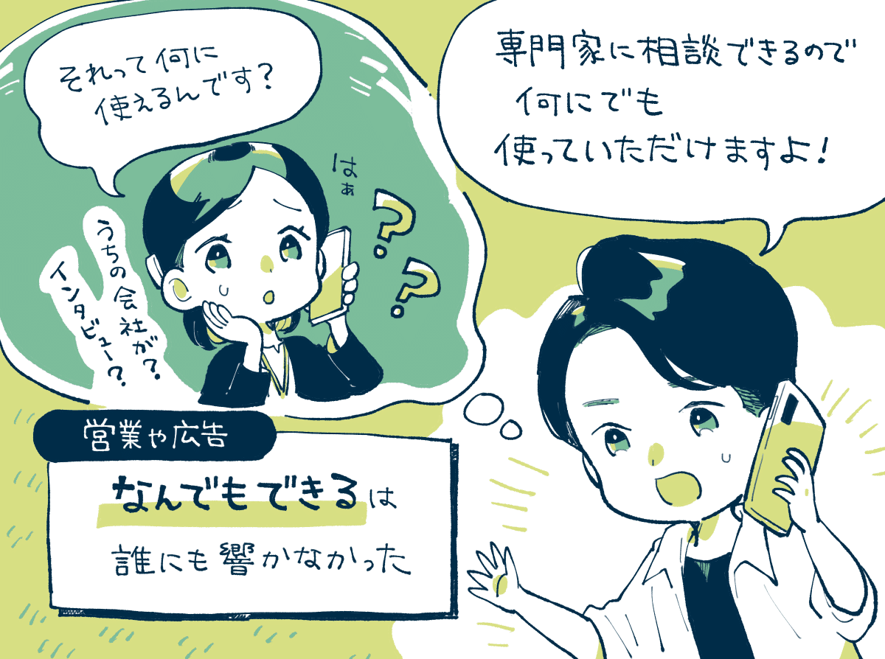
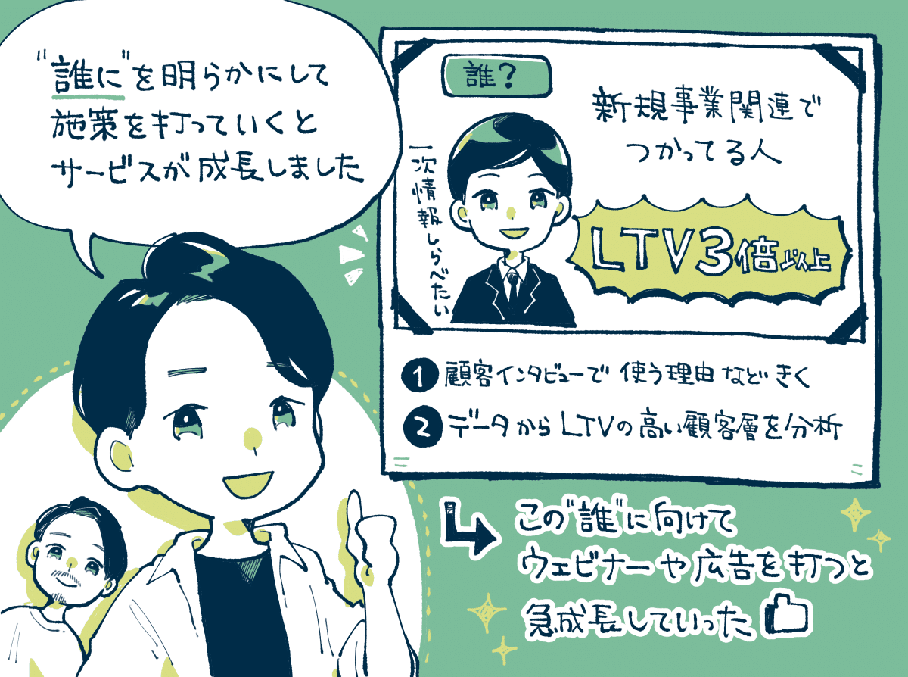
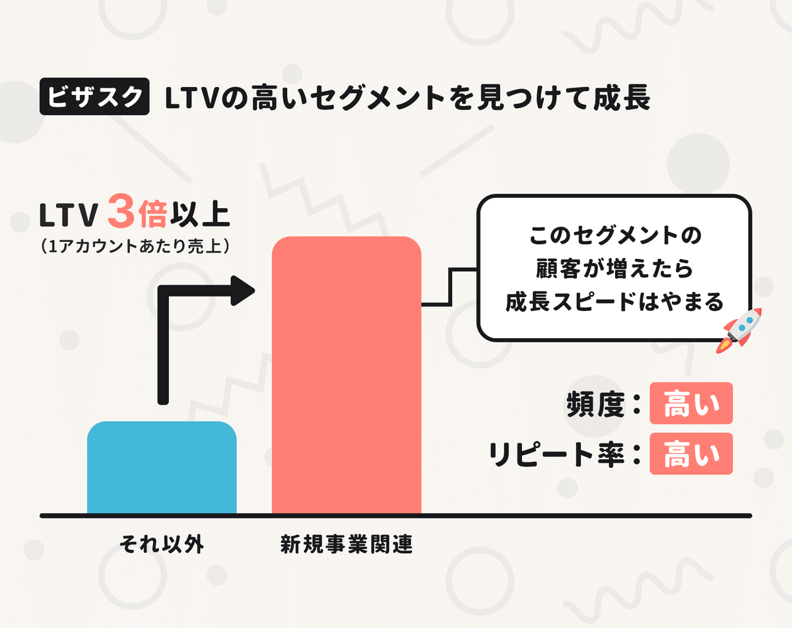
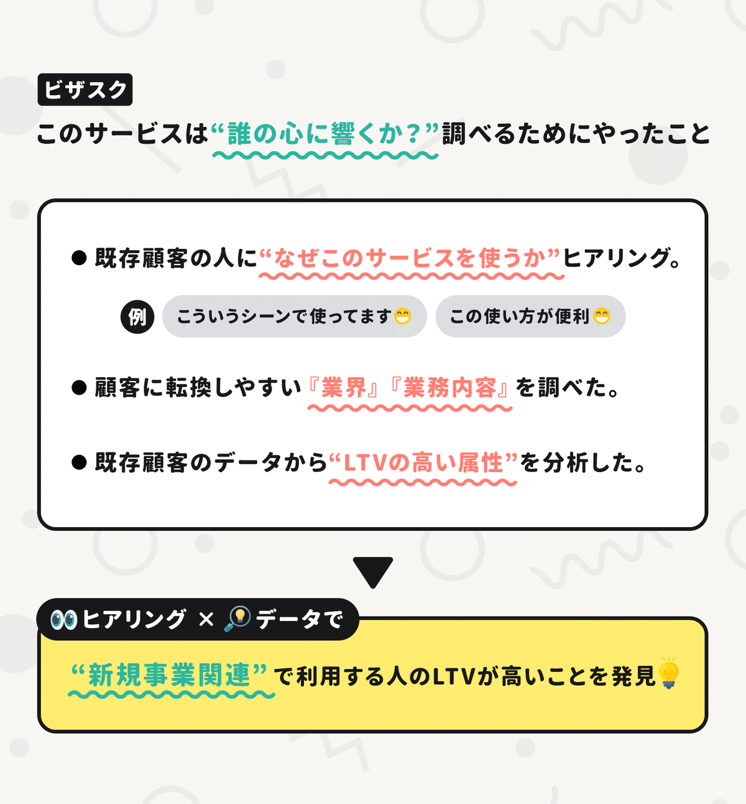
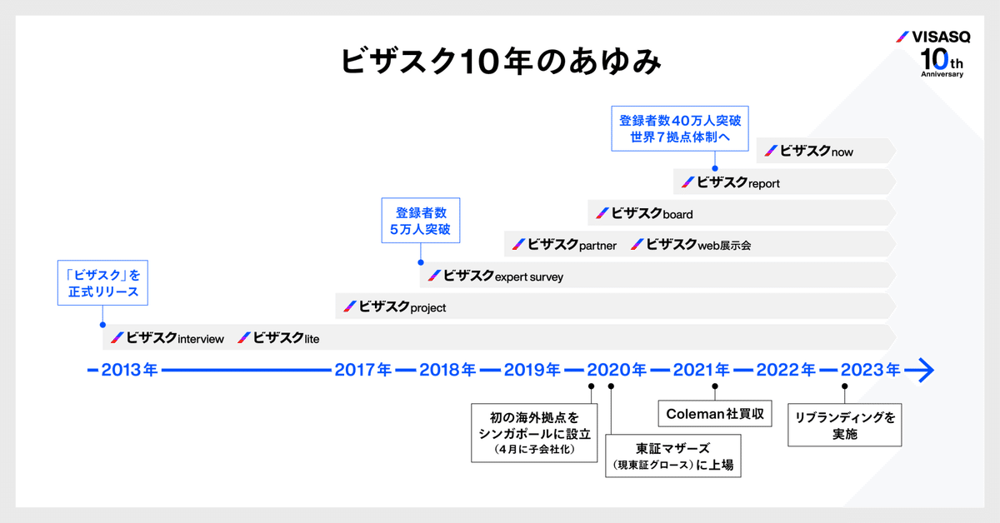
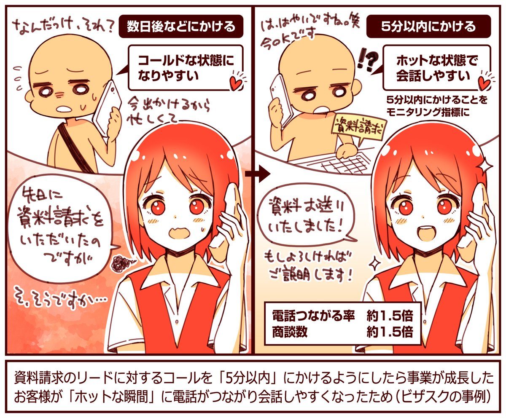
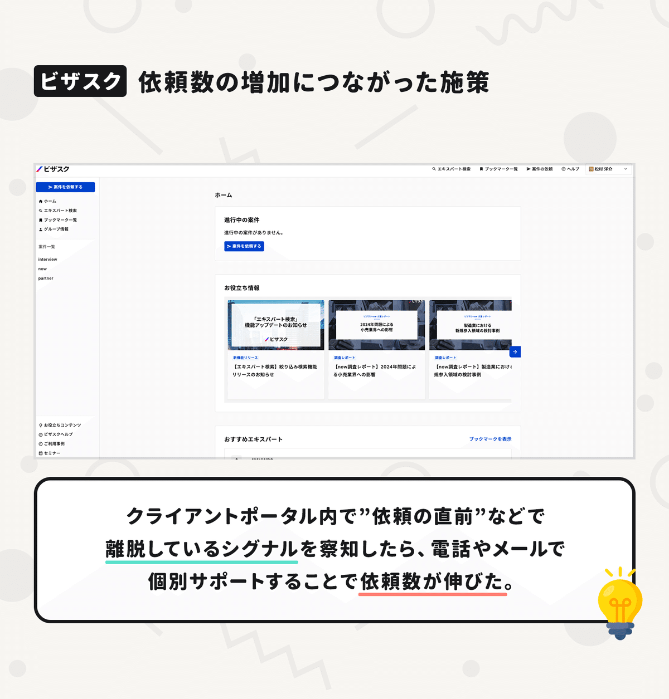

  

# 「誰に使われているのか？」既存ユーザーの分析からLTVが3倍高いセグメントを発見。連結取扱高が140億円を超える「ビザスク」が語る、リピート率やLTVは「ユースケース」によって決まる話。

40

[%22%20d%3D%22M-100-100h300v300h-300z%22%2F%3E%3C%2Fsvg%3E)](/)

[アプリマーケティング研究所](/)

2025年8月21日 11:30

¥2,000/月

ビザスクさんを取材しました。

（左から）株式会社ビザスク 取締役 ナレッジプラットフォーム事業 代表 宮崎 雄さん、ナレッジプラットフォーム事業 Growth部 松村 洋介さん

### ⸺「ビザスク」について教えてください。

宮崎：  
ビザスクは、2013年に「スポットコンサル=1時間インタビュー」を軸にしてスタートしたナレッジプラットフォームです。

2024年度の業績は、連結累計で取扱高が143億円、営業利益は約12億円。知見を提供するエキスパートの数は70万人を超えています。

創業期に遡ると、もともと**創業者（CEO）の端羽は、個人の経験に紐づいたモノを売るECプラットフォームを作ろうと考えていました。**

例えば、「熊本出身の私が選ぶ手土産」「金融出身の私が選ぶ電卓」みたいに人のおすすめから商品が買えるECを構想していたんですね。

しかし、ビジネスモデルを考えてみたり、エクセルで事業モデルを作ってみたりしたものの、上手くいく実感がイマイチ湧かなかった。

そこで、**知り合いに相談してみると「ECに詳しい人」を紹介されて。実際にアドバイスをもらいにいくと、納得感のある"ダメ出し"をひたすら1時間受け続けるという体験をしたんですね。**

このときに、「早くこの人に出会いたかった。この1時間にお金を払える！」と感じた実体験から、ビザスクのコンセプトが生まれました。

### ⸺初期に「サービスへの手応え」を得られたのはどんなタイミングだったのでしょうか？

宮崎：  
2013年にサービスを開始して、**明確に"PMFの兆し"が見えてきたのは2016年頃からコンサルティングファームからの利用が伸びてきたこと**でした。

コンサルティングファームでは「一次情報の調査・収集」にコストを大きくかける傾向があって、そのニーズと上手く合致したんです。

現在では、**ビザスクで知見を提供する人を「エキスパート」と呼びますが、当初は「アドバイザー」といった表現にして敷居を下げていました。**

その結果、アドバイザーが増え"知見のカバー範囲"が充実してきたことで、コンサルや金融機関のニーズが顕在化したのだと思います。

## 何でもできるは、誰にも響かなかった。

### ⸺そこからはどのように事業が成長していきましたか？

宮崎：  
2019年以降からは「事業会社の方にも、ビザスクを使っていただけるはず」と考えて、本格的にマーケティングをスタートしました。

僕は前職がリクルートだったのですが、**当初は"リクルート方式"で「上からとにかく営業をかければ売れるはずだ！」と考えていました。**

しかし、営業のコールをかけてみると、お客様から「どう使うんですか？」と言われてしまい、まったく獲得につながらなかったんですよ。

なぜなら、**皆さんビザスクのようなサービスを使ったことがないからです。そもそも"自分達向けのサービスだ"とも思ってもらえていなかった。**

つまり、顧客としての"誰"がない中で「このサービス使ってくれませんか？」といくら提案しても価値が伝わらなかったんですね。

### ⸺なるほど。それってどう解決したらいいんでしょうか。

宮崎：  
そこで、我々は"やり方"を変えることにしました。

まずは、**「そもそも、ビザスクって"誰"の心に刺さるのか？」を深く理解したいと思って、この"誰に"を分析してみることにしました。**

具体的には、顧客にインタビューして「どう使っているか？」を聞いたり、長く利用してくれる「LTVの高い顧客」をデータから分析しました。

すると、長く使ってくれているのは**「新規事業関連」で利用する人だとわかってきたんです。実際に、新規事業関連のお客様のLTVは、他のカテゴリと比べると3倍以上は高かったですね。**

## リピート率やLTVは「ユースケース」で決まる。

### ⸺どのセグメントに注目するかで成長効率が3倍も変わるんですね。

宮崎：  
そうです。この"誰に"がわかってからは、サービスの打ち出し方やウェビナーや広告の訴求なども、全部「新規事業」にガッと寄せていったんですね。

例えば、**「新規事業に関わる方が興味がありそうなテーマ」でウェビナーを開催して、リードを獲得してから提案していくと、以前よりも圧倒的に契約が獲得できるようになりました。**

広告なども、新規事業を行う人に向けて「顧客の実態を明らかにできていますか？」みたいな切り口で出すと反応がグッと良くなりました。

興味深いのは"単価"は同じなんですよ。**圧倒的に違うのは回数です。その企業における「ユーザー数の多さ × リピート率の高さ」で利用回数やLTVが変わってくるということです。**

ポイントだと思うのは、**この"誰が何に使う"というユースケースによって、リピート率やLTVが決まってくるということ。**

例えば、人事の方が「人事制度を改定する」みたいなユースケースだと"数年間に1回"しか発生しません。転職者の方が「業界調査をする」というユースケースも恐らく"数年間に1回"しか発生しません。

これも一つの使い方ではありますが、そこにフォーカスし過ぎると「数年に1回しか使われないサービス」になってしまいます。

なので、やはり「誰に売るべきか」を決めてから施策を考えるべきでした。「何でもできるは、誰にも響かない」だったんです。

新規事業のユースケースにフォーカスしてから、**2019年から2023年頃まではそこがメインの成長ドライバーになり、クライアントの口座数は約5倍に増えました**。

そこから、経営企画・営業・マーケティングなどの組織に広げていったり、新サービスを開発したりしてLTVを高めていき現在に至ります。

サービスを拡大して「LTV」を伸ばしていった。

## 指標改善につながった「2つの成功施策」

### 成功施策①：資料請求に「5分以内」に電話をかけたら商談率アップ。

宮崎：  
商談数を伸ばした工夫は、お客様から資料請求をいただいた後の「対応スピード」をできる限り早めたことでした。

具体的には、**資料請求をいただいたら「5分以内」に電話するようにしました。実際に5分以内に電話をすると繋がる率が1.5倍ほど高くなります。**電話からの商談化率が同じだとすると商談数も約1.5倍になります。

この「5分以内」という指標は、インサイドセールスのモニタリング指標に設定するようにもしていて、すぐに電話をするようにしていますね。

早すぎる分にはお客様は笑ってくれます。「まだ資料を見ていないよ笑」と。でも「一緒にご説明したほうが早いかと思いまして」と説明もできます。

以前は専任の担当がいなかったため、既存顧客の対応などに追われ、電話をかけるまでに数日かかってしまうこともありました。

対応スピードを速めると、お客さんにとっても"ホットな瞬間"にお話ができるので商談のお話なども進めやすくなりました。

### 成功施策②：途中離脱したユーザーに"声かけ"をして依頼数アップ。

松村：  
依頼数の増加につながったのは**「途中で離脱しているお客様」をマンパワーでサポートする取り組みでした。**

ビザスクinterviewでは、契約後に「クライアントポータル」からフォームに項目を入力いただき、それをもとにインタビューの候補者リストを我々が提案してマッチングしていきます。

しかし「誰に聞きたいか？」「何を聞きたいか？」といった内容をイメージしきれずにフォームの途中で離脱してしまうケースが目立ちました。

そこで、**こうした途中離脱を検知したら「お困り事はありませんか？」と直接連絡（メール・電話）して個別にサポートするようにしました。**

お店で言うなら、困っているお客様がいたら「店員がお声掛けをする」みたいな取り組みに近いです。**この施策により依頼数が約2％増加しました。**

---

【取材協力】  
株式会社ビザスク：<https://corp.visasq.co.jp/>  
ビザスク：<https://visasq.co.jp/>  
株式会社ビザスク 宮崎 雄さん 松村 洋介さん

【告知】ビザスクさんでは各職種で採用中。プロダクトマネージャーやマーケターなど募集されています。ご興味あれば下記サイトよりどうぞ。

[**採用情報 | 株式会社ビザスク**
*ビザスクの採用情報サイトです。「知見と、挑戦をつなぐ」をミッションの実現に向け、仲間を募集しています。メンバーやチーム、仕*
*recruit.visasq.co.jp*](https://recruit.visasq.co.jp/)

> ※ 以降は、＋αの【5つの事例】を購読会員向けにまとめています。  
> 【① 知見の価格を入力する際に**「適正な価格」に近づけるための工夫**】  
> 【② 有効な**「新規獲得チャネル」**見つけた方法】  
> 【③ **依頼数アップにつながった**成功機能の話】  
> 【④ 新規サービスを作るときに**見るシグナル**】  
> 【⑤ 法人利用に着目して**売上を伸ばした改善**】  
> など、ご興味あればご覧ください。

  

ダウンロード

 

copy

## ここから先は

2,020字
/
8画像

%22%20d%3D%22M-100-100h300v300h-300z%22%2F%3E%3C%2Fsvg%3E)

アプリやプロダクトの成功事例が学べるマガジンです。プロダクトの売上やユーザー数を伸ばしたい人にオススメです。成長プロダクトのインタビュー、効果のあったマーケティング施策、事例やデータなどが中心（月に7記事ほど）多くの過去記事も5年ほど遡って読めます。クレカ決済だと初月無料なのでお試しでもぜひ。

### [月刊アプリマーケティング](/m/mc375c9b46464)

¥2,000 / 月  
初月無料

プロダクト運営について学べるマガジンです。アプリやプロダクトの売上やユーザー数を伸ばしたい人にオススメです。月に7記事ほどお届けします。

購読手続きへ

%22%20d%3D%22M-100-100h300v300h-300z%22%2F%3E%3C%2Fsvg%3E)

1人が高評価

[ログイン](https://note.com/cd/login?redirect_to=https%3A%2F%2Fmarkelabo.com%2Fn%2Fn88ba6b28005a)

   

40

[%22%20d%3D%22M-100-100h300v300h-300z%22%2F%3E%3C%2Fsvg%3E)](/)

[アプリマーケティング研究所](/)

フォロー

プロダクトの成功事例を発信しているメディアです。2013年から約10年運営しています。取材相談はツイッターDM（@appmarkelabo）かメールにてどうぞ！info@appmarketinglabo.net