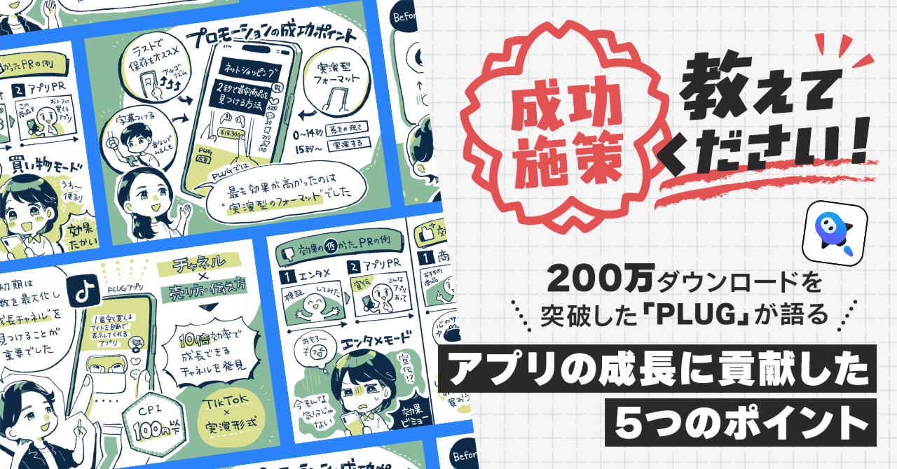  

# ユーザーが「トクする理由」を伝えたらアンケート回答率が7倍に。プロモの効果が心の財布で変わるワケ。ショッピングアシストアプリ「PLUG」年間GMV100億円到達までの5つの成長ストーリー。

45

[%22%20d%3D%22M-100-100h300v300h-300z%22%2F%3E%3C%2Fsvg%3E)](/)

[アプリマーケティング研究所](/)

2025年8月29日 11:30

¥2,000/月

200万ダウンロードに成長した「PLUG」の開発の裏側を取材しました。

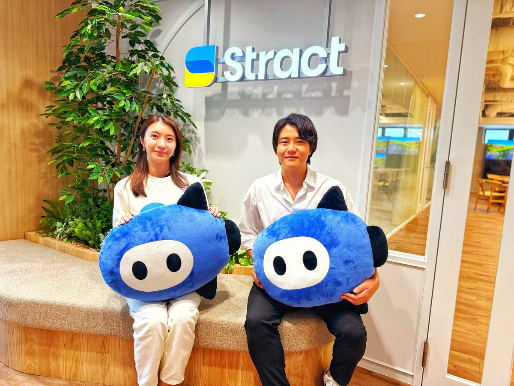

（右から）株式会社STRACT 代表取締役社長 伊藤 輝さん、CEO室 室長 山田 果歩さん

> PLUGは2,000超の提携ECサイトのキャッシュバックやクーポンや、最安値情報を自動で見つけるショッピングアシストアプリ。EC版のAIエージェント的な機能も展開中。**2024年の年間流通額は100億円規模に。成長につながった5つのポイントを聞きました。**本連載の一部は2026年に出版される書籍にも収録される予定です。（[取材申請はコチラ](https://few-robin-203.notion.site/21353af152a3802f8f87c1eaca8cbb99?pvs=143)から）

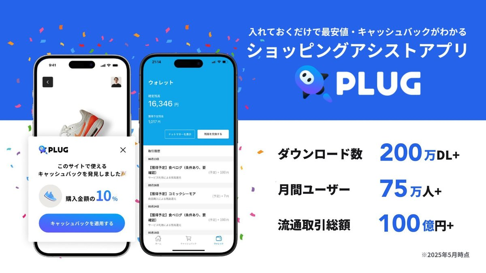

### 成長ポイント1：手数を増やして「成長チャネル」を見つけた。

伊藤：  
今と違って、はじめの数ヶ月は「PLUG」も伸び悩みました。アプリを公開しても無風。バズったりもしない。広告を出してもコストが高い。

転機になったのは、TikTokの広告にスマホで撮った動画を出したこと。**これにより1DLあたりの獲得コストは「2桁円」に下がり、他のチャネルと比べて約10倍の効率で成長できるようになったんです。**

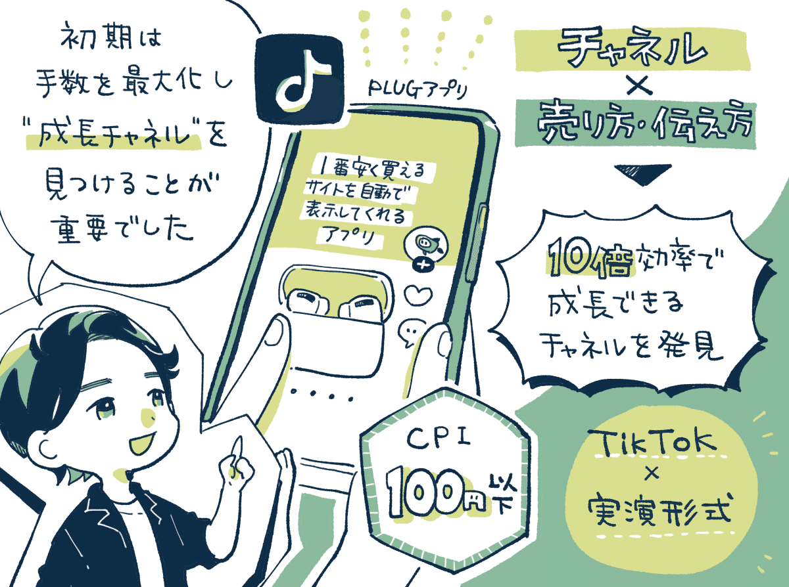

ここから学んだのは「適切な集客チャネル」を見つけることの大切さです。そのためには様々な「チャネル × 売り方・伝え方」を試す必要があります。

いいモノを作れば伸びるは性善説です。あまり売れていない良い商品だってたくさんある。「どう売るのか？」もやっぱり大事です。

**じゃあ「適切な集客チャネル」はどう見つけるか。鍵になるのは手数です。**スタートアップには資金や時間に限りがあります。制約の中で多くの手数を打って検証を行うことが生存確率を高めます。

PLUGも振り返ると、小さく手数を増やして「こういう伝え方なら伝わる。売れる」という勝ちパターンを見つけることが大切だったなと感じます。

### 成長ポイント2：プロダクトを改善して指標を磨いた。

伊藤：  
プロダクト開発においては、アクティブユーザー数（MAU）やブラウザ拡張の有効化率などの指標を追いかけながら磨き込んでいます。

例えば、**ユーザーにアンケートをお願いする際に「メリット主導の理由」を添えるようにしたところ回答率が約7倍に向上しました。**

以前は「アンケートにご協力ください」のように出していたのですが、これを**「もっとお得を発見するために、あなたについて教えていただけませんか？」と伝えるようにしたんですね。**

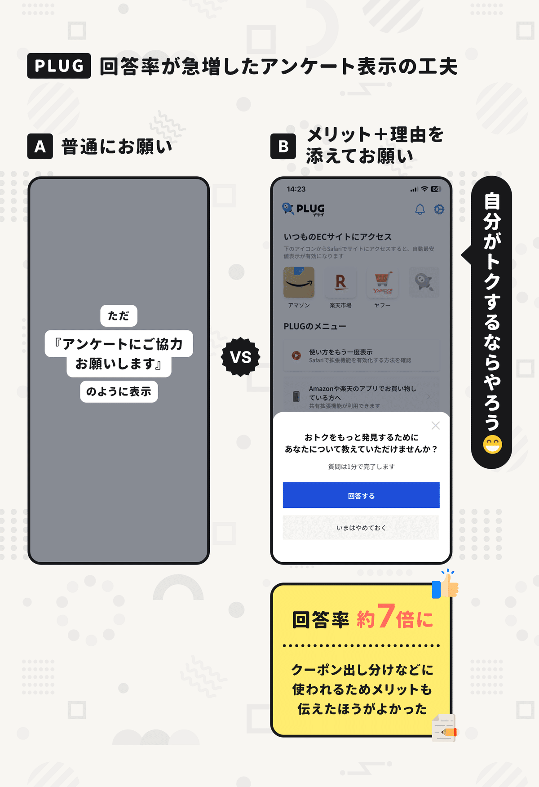

10〜15問のアンケート回答率がグッと高まり、ユーザーの「属性や関心」にそってクーポンなど表示できるように。

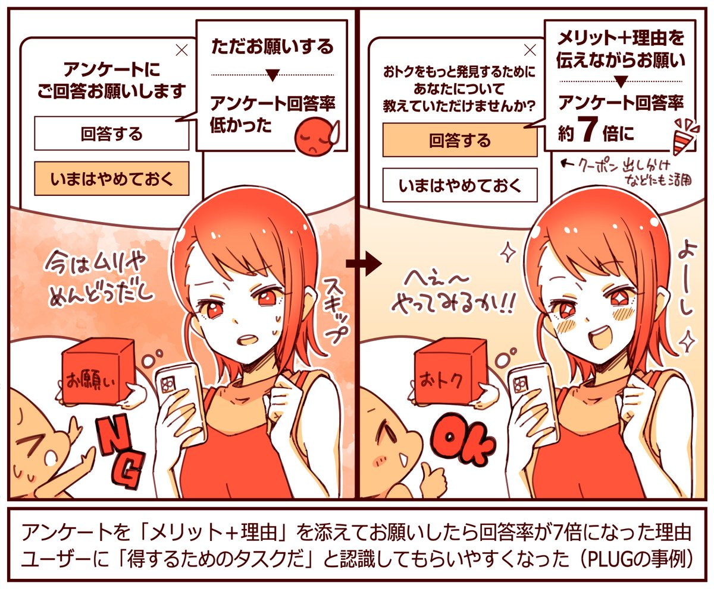

ポイントは「データはこの目的で使いますよ」と理由や目的を伝えること。そして「あなたにこんな良いことがある」とメリットも伝えること。

アンケートは内容によって「クーポンの出し分け」などに活用されるので、ユーザーにとってもお得が見つかるキッカケになるんですね。

**細かいUI改善としては、ポップアップよりもモーダルで表示したほうが回答率が高くなりました。**モーダルのほうが機能に"公式感"が出るのかなと。

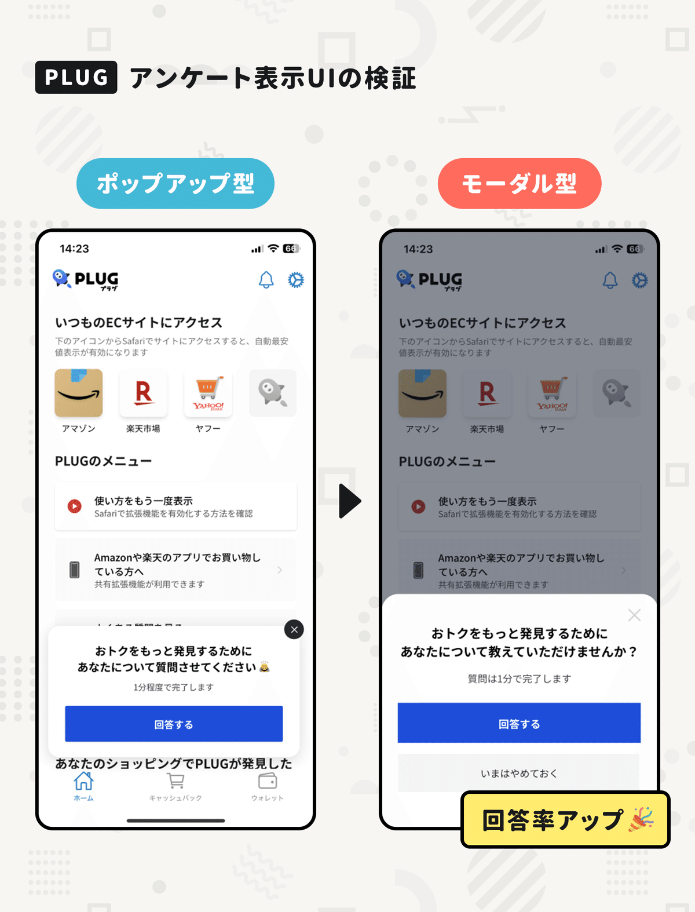

他には、PLUGで「価格比較」を行うときに、ローディング中のデザインを変更したところ離脱率が大きく減った事例もあります。

具体的には、**ぐるぐる回る「スピナー型」から、進捗を伝える「プログレスサークル型」に変更したところ、離脱者が90％も減りました。**

例えば「価格比較中です。今68％です。」のように進捗を可視化したことで、ユーザーが待ってくれるようになったんですね。

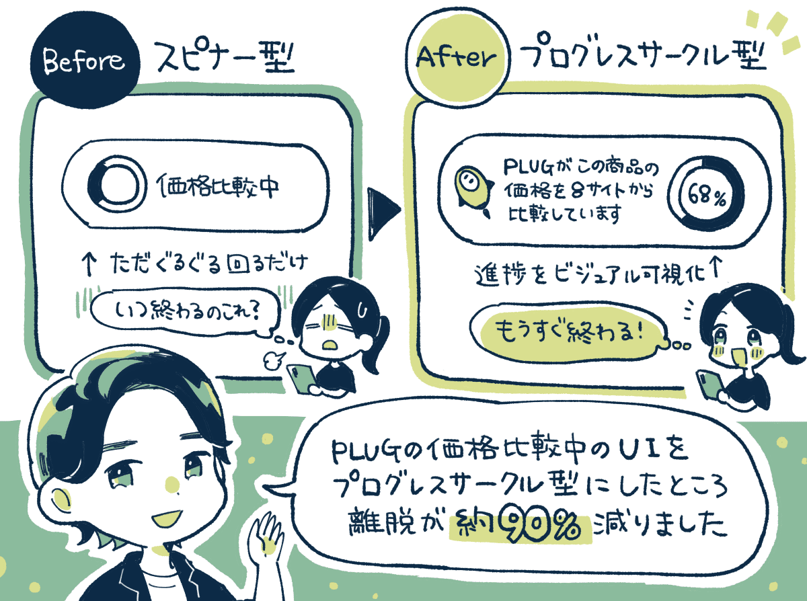

### 成長ポイント3：プロモーションのポイントは「心の財布」を持ってきてもらえているか？

山田：  
PLUGの新規獲得はプロモーションが「半数以上」を占めています。インフルエンサーマーケティングが20％程度、あとは運用型広告も多いですね。

最も成果が出たものだと、インフルエンサーさんの1つの投稿からアプリが約7万ダウンロードされた事例（CPIは100円以下）もあるんですよ。

フォーマットは色々と試した結果、**アプリの画面を見せながら解説する「実演形式の動画」の効果が圧倒的に高くなっていますね。**

成果の出たクリエイティブから逆算分析すると「惹きの強さ」「実演形式」この2つの要素がとくに大事だとわかっています。

そのため、大まかに14秒目までに「惹きの強いワード」を入れて、14秒前後から画面を見せながら「実演する」という形にしています。

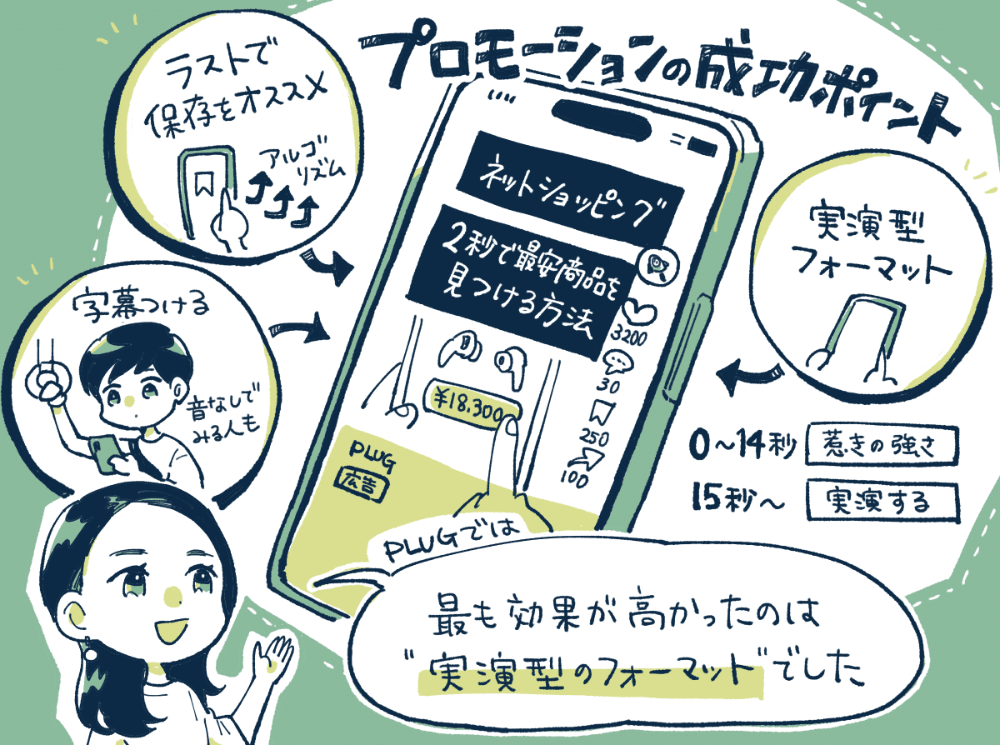

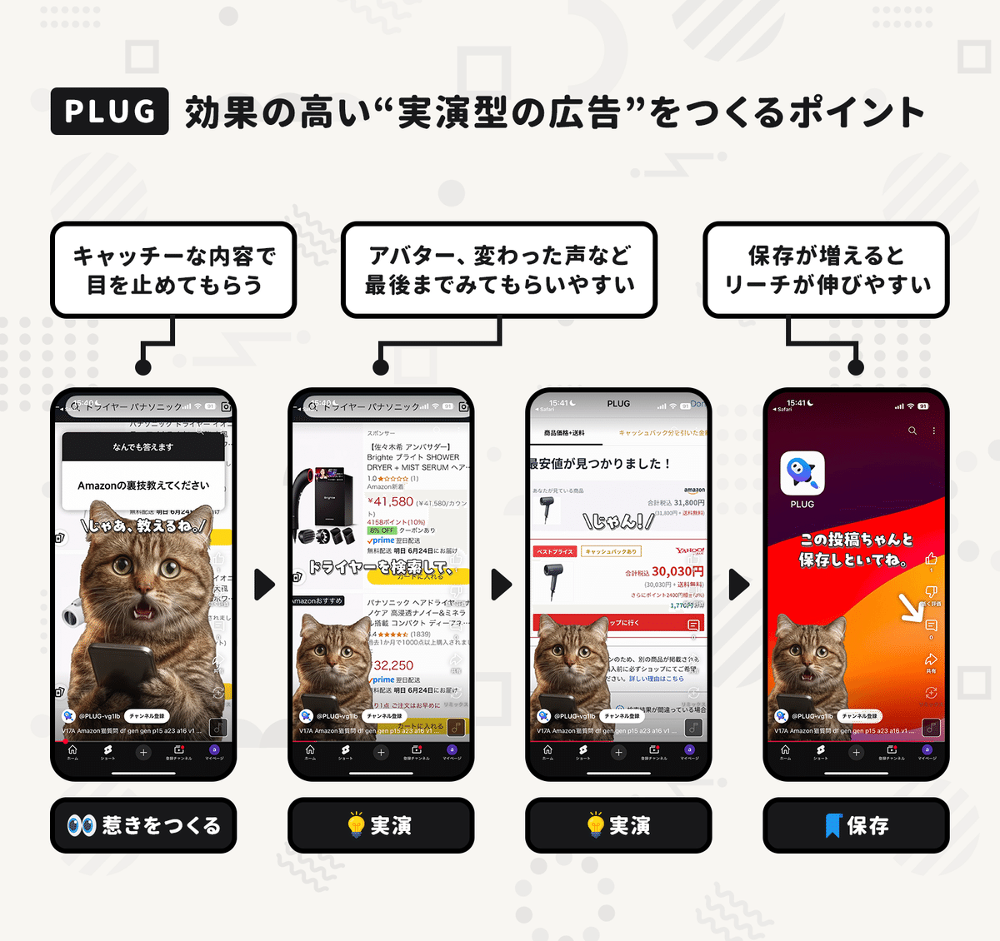

伊藤：  
ポイントとしては、**視聴者がそのコンテンツに触れたときに「お財布を持ってきてくれているか？」なんですよ。この要素がめちゃくちゃ大事。**

例えば、エンタメ系YouTuberの「おもしろい検証動画」の最後に突然シーンが切り替わって「さあ、ここからCMです！」と紹介しても伸びないんです。なぜなら、**視聴者は「お財布を持ってきていない」からなんですね。**

逆に、商品紹介系のYouTuberの方って、**視聴者は商品の動画を見にきているので「お財布を持ってきている」わけです。**いいものがあったら買おうと思っているから効果が高くなる傾向があります。

実際に、一通り商品を紹介したあとに、「PLUGを使って買うとお得だよ！」と内容にリンクさせてアプリを紹介してもらうと効果が高くなりました。

チャンネル登録の多いYouTuberの方でも、動画の趣旨と違ったところにCMっぽく強引に挟むと、ホントに面白いぐらいに伸びません。

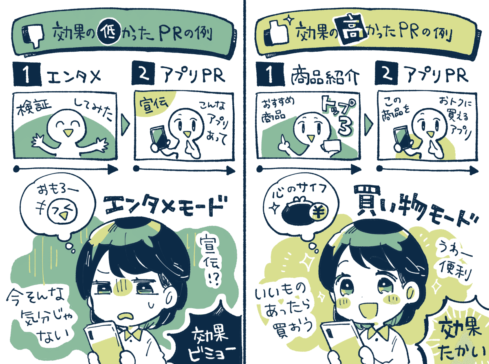

### 成長ポイント4：ECサービスとの「Win-Winの提携」で成長している。

山田：  
外部の企業との提携も順調で、相性の良いECサービスと連携させていただくことで、新規ユーザーを獲得する機会を増やしています。

例えば、Qoo10さんの「メガ割」などと提携して、期間中に商品を購入された方に購入金額の最大20%をキャッシュバックする「PLUG祭」が好調です。

キャッシュバックの原資はPLUGで負担していますが、これによってPLUGはセールを起点に新規ユーザーを獲得しやすくなり、ECサービスさんもPLUGから新規のユーザーさんを集めやすくなります。

**非常に成功しているのは「PLUG祭」をインフルエンサーマーケティングと掛け合わせて「こんなお得な企画がある」とSNSで広めてもらう施策です。**

こうしたインフルエンサーと連動した施策などで、**あるECサービスのPLUG経由のGMVが約15倍に成長したという事例もあります。**

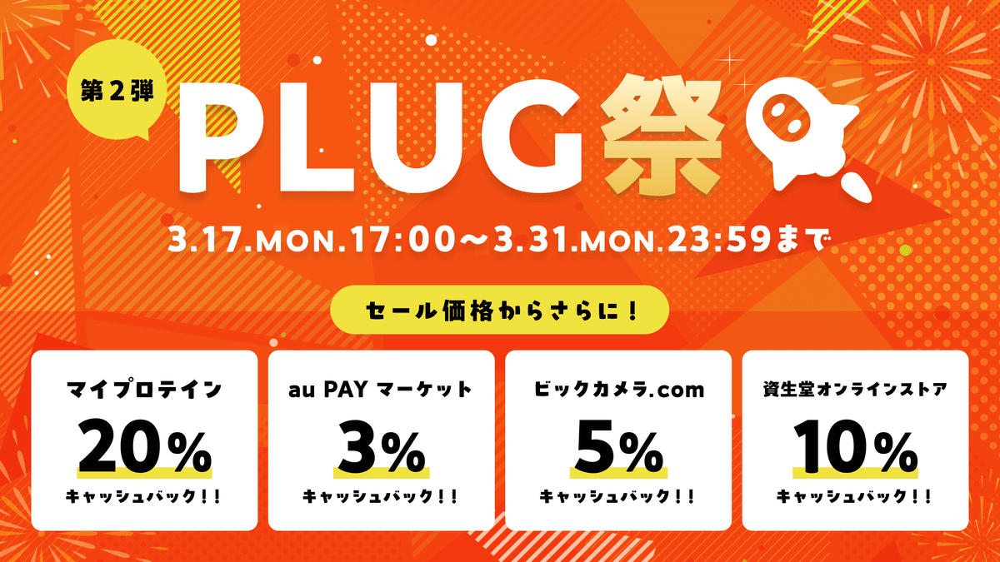

伊藤：  
メディアとの提携もうまくいってます。例えば、ギズモードさんの商品紹介記事の商品リンクに「PLUGのボタン」を置いていただいています。

メールアドレスを登録してもらうと、PLUGが商品価格を追跡して「ベストプライスが出たらお知らせしますよ。」というものですね。

購入されると収益（レベニューシェア）にもなるので、メディア側は収益の向上につながり、PLUGも認知や獲得につながります。

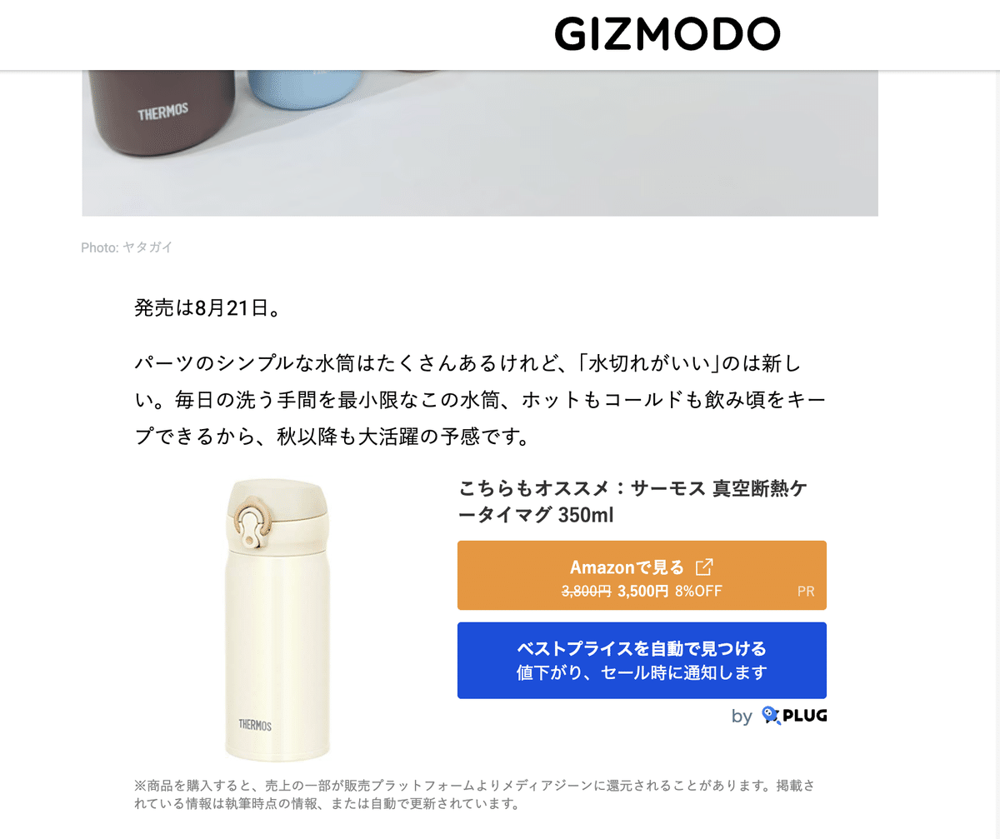

ギズモードとPLUGの連携例。

### 成長ポイント5：ビジネスモデルは「既にあるもの」の切り口を変える。

伊藤：  
最初は個人でアプリ開発をはじめて、そこから法人化してPLUGを開発したのですが、**大事だと思ったのは「世の中にないもの」を作るのではなくて、「世の中にあるもの」の切り口を変えることです。**

要はビジネスモデルってずっと同じなんです。突然「変わったビジネスモデルが出てきてお金がすごく稼げた」というケースはあまりない。PLUGもECの流通から手数料をいただくモデルです。

ポイントはまず「市場の大きさ」を考えること。例えば、Eコマースの市場は何兆円もあって伸びていて。一番のプレイヤーはAmazonで。**でも「ちょっとここが古いよね」みたいな切り口から始める。**

例えば、タイミーもアルバイト市場の中で「隙間」という切り口に変えた。企業が掲載してお金を払うというモデルはそのままです。

メルカリもヤフオクの市場が既にあって。それを「スマホ」という切り口に変えた。手数料で稼ぐというビジネスモデルはそのまま。

今はAIの時代で「世の中にないものをつくろう！」と考えがちです。これももうあるビジネスモデルに対して「AIという切り口でどう価値を生めるか？」と考えないと成立しにくいと思います。

なので、既にあるビジネスモデルの「切り口」を変える。それがスケールする事業やプロダクトを作る確率を上げる秘訣だと考えています。

【取材協力】  
株式会社STRACT：<https://stract.co.jp/>   
PLUG：<https://lp.plugapp.jp/>

【告知】PLUGさんでは各職種で積極採用中。PdM、UI/UXデザイナー、マーケターなどを探しているとのこと。ご興味あれば下記サイトからどうぞ。

[**STRACT, Inc.｜採用情報**
*Unlock the potential of technology through smart in*
*career.stract.co.jp*](https://career.stract.co.jp/)

> ※ 以降は、＋αの【5つの事例】を購読会員向けにまとめています。  
> 【① 価格表示の工夫で**CVRを改善した話**】  
> 【② **エンゲージメントを高めた**AI機能】  
> 【③ **プロモーションの効果**を高めるTIPS】  
> 【④ ECユーザーの**「購買意欲の変化」を意識して**企画を立てる話】  
> 【⑤ **プッシュ通知の許諾率**を高める工夫】  
> など、ご興味あればご覧ください。

  

ダウンロード

 

copy

## ここから先は

1,639字
/
5画像

%22%20d%3D%22M-100-100h300v300h-300z%22%2F%3E%3C%2Fsvg%3E)

アプリやプロダクトの成功事例が学べるマガジンです。プロダクトの売上やユーザー数を伸ばしたい人にオススメです。成長プロダクトのインタビュー、効果のあったマーケティング施策、事例やデータなどが中心（月に7記事ほど）多くの過去記事も5年ほど遡って読めます。クレカ決済だと初月無料なのでお試しでもぜひ。

### [月刊アプリマーケティング](/m/mc375c9b46464)

¥2,000 / 月  
初月無料

プロダクト運営について学べるマガジンです。アプリやプロダクトの売上やユーザー数を伸ばしたい人にオススメです。月に7記事ほどお届けします。

購読手続きへ

%22%20d%3D%22M-100-100h300v300h-300z%22%2F%3E%3C%2Fsvg%3E)

1人が高評価

[ログイン](https://note.com/cd/login?redirect_to=https%3A%2F%2Fmarkelabo.com%2Fn%2Fn7e31f583203d)

   

45

[%22%20d%3D%22M-100-100h300v300h-300z%22%2F%3E%3C%2Fsvg%3E)](/)

[アプリマーケティング研究所](/)

フォロー

プロダクトの成功事例を発信しているメディアです。2013年から約10年運営しています。取材相談はツイッターDM（@appmarkelabo）かメールにてどうぞ！info@appmarketinglabo.net