  

# 連結売上高は2,560億円。野菜のネーミングを工夫したらヒット続出。ミールキットの写真を「ファースト判断軸」に沿って変えたら購入率アップ。宅配サービスの「Oisix」に聞く成長施策。

30

[%22%20d%3D%22M-100-100h300v300h-300z%22%2F%3E%3C%2Fsvg%3E)](/)

[アプリマーケティング研究所](/)

2025年9月22日 11:30

¥2,000/月

Oisixさんを取材しました。

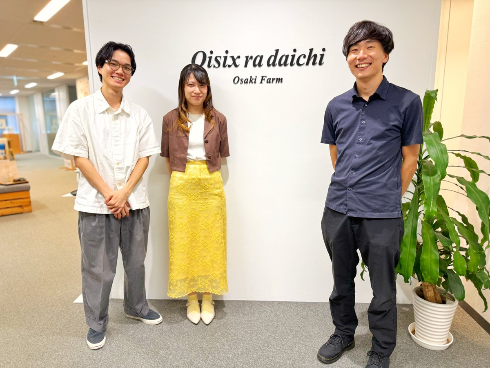

オイシックス・ラ・大地株式会社 OisixEC事業本部 販売企画室、Kit進化セクション マネージャー 水野 太智さん、売り場進化セクション マネージャー 野崎 真衣さん、産直・おいとくセクション マネージャー 小水流 峻亮さん

> 2000年に創業して、2025年3月期に連結売上高が2,560億円まで到達した、オイシックス・ラ・大地が運営する「Oisix」の成長の裏側を取材しました。本連載の一部は2026年に出版される書籍にも収録される予定です。

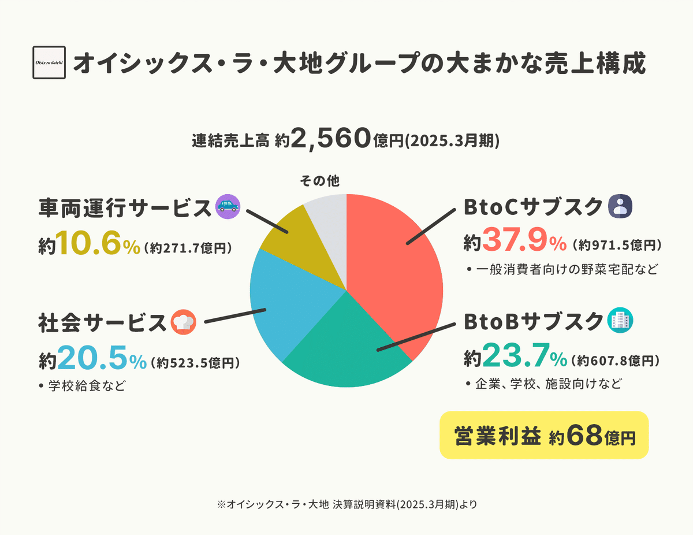

## 創業初期「立ち上げ」は甘くなかった。

創業は2000年。「安心できる野菜をネットで買えるサイトを作ろう」という想いはあったが、ツテも何もないゼロからはじまった。

創業者の高島さんは、コンサル企業マッキンゼーで2年働いた経験があり、問題解決やビジネスの知識はついているはずと自負していた。

しかし、実際には「ネットで野菜を売る」という事業は想像以上に難易度が高く、すぐに見通しが甘かったことに気付かされる。

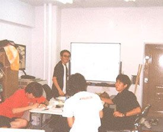

創業期のオフィスの様子

とくに苦労したのは、野菜を取引してくれる農家の開拓だったという。

最初は農家の方と交渉しようと、**青果市場を回ってダンボールに書かれている「農家の電話番号」をメモして電話をかけていった。**

「ネットで野菜の宅配ビジネスを立ち上げます。野菜の取引をさせていただけないでしょうか？」

アポを取って訪問すると、**待っていたのは「ネットってなんだ？」という言葉だった。「よくわからないから帰ってよ」と追い返されたことも。**

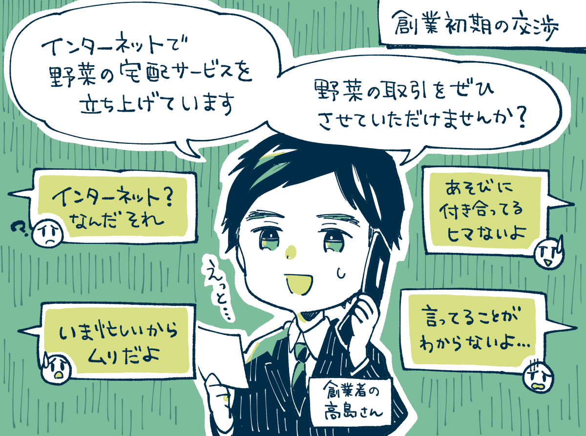

しかし、諦めずに何度も顔を出して作業を手伝うと「そこまで言うのなら」と半ば諦めや同情に近い形でやっと取引してもらえた。

**「そんなにうちの野菜がいいなら、畑の土を食べてみなよ」と言われて土を食べて感想を言うと「覚悟あるね」と認めてもらえたことも。**

いくらお金を積んだところで「農家がこだわりをもって作った食材」を易々と売ってもらえるわけではなかったのだった。

ロジックだけで事業は立ち上がらなかった。創業者やメンバーの粘り強さや熱意が人の心を動かし、少しずつ事業が形になっていく。

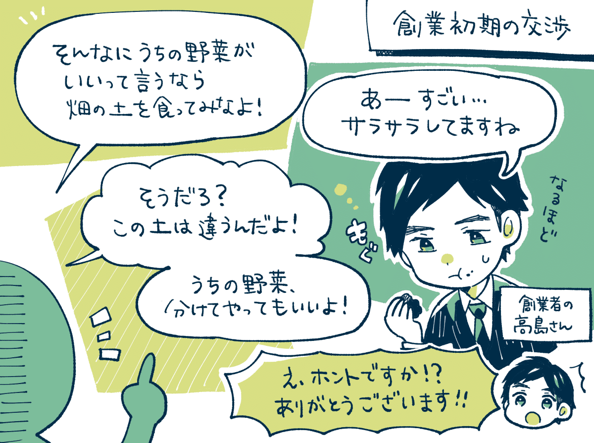

こうして野菜を仕入れてサイトを準備。約100人の記者に向けて記者会見を開いてメディアの取材も受けて、期待を膨らませながらオープンした。

サイトをオープンして「何が起きたか」というと何も起こらなかった。注文は1日数件あればいいほう。注文が入ったと思ったら社員の親戚。公開しただけでは全く売れなかった。

ただ良い兆候も見えていた。**ユーザーがほんの僅かしかいない時期から、繰り返し購入してくれる「リピート率」が非常に高かったのだった。**

## 売上を成長させた「わらしべ長者戦略」

野菜を売るために実行したのが「わらしべ長者戦略」だった。お金もなかったのでコストをかけずに集客する方法が必要だった。

まず出資してくれた**シダックス社から大量のレシピ情報を取得。シダックスは「質の高いレシピ」を大量に保有していたが、これは全て紙で保存されていた**のだという。

そこで「レシピをネットで見られるシステムを無料で開発します。その代わりレシピを自由につかわせて欲しい」と提案すると快諾してもらえた。

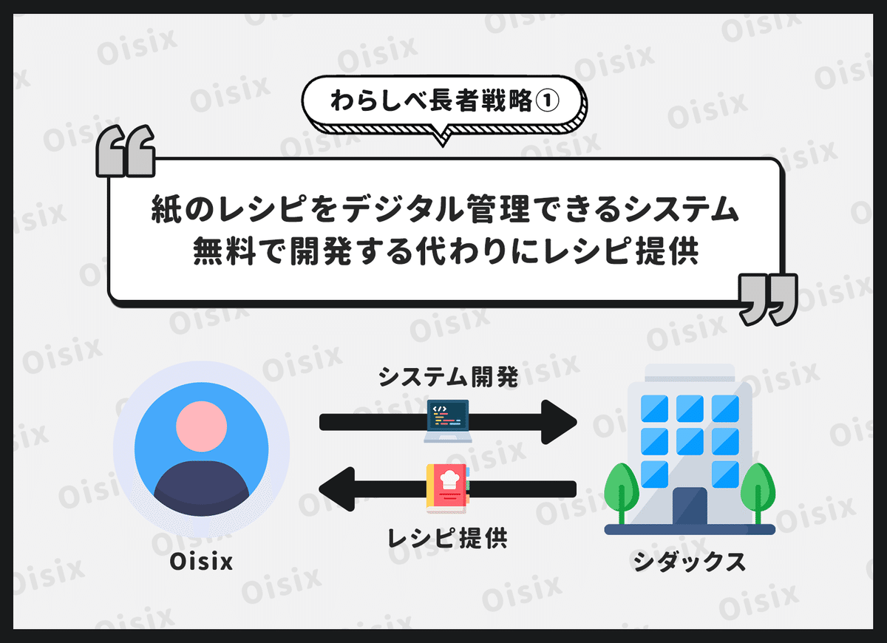

次に、**このレシピを「女性誌のサイト」に無料で提供する代わりにリンクを貼ってもらう交渉を行い、レシピと引き換えにトラフィックを獲得。**

出版社にひとつひとつ訪問して交渉、レシピを女性誌のサイトに無料提供。その代わりにリンクを貼ってもらった。じわじわと売上が伸びていった。

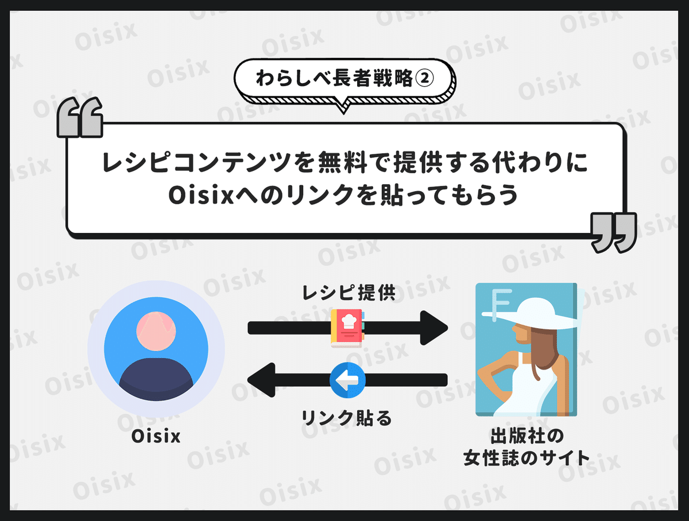

当時は大量にあった「個人運営のホームページ」にもメールを送って相互リンクを貼ってもらった。

社内で「相互リンクデイ」を作って、朝10時〜14時まで多くのリンクを獲得した社員を表彰。この方法で1日で数百のリンクを貼ってもらえた。

この「わらしべ長者戦略」によって、少しずつ事業が軌道に乗っていった。じわじわと売上が伸びて5年目に黒字化した。

## 野菜のネーミングからヒットが生まれた。

初期にヒットをもたらしたのは「野菜のネーミング」だった。同じ商品でも「どんな名前にするか？」で売れ行きが変わってきたのだ。

**例えば、大ヒット商品「トロなす」も2回改名している。「白なす」「緑なす」のときはそこまで売れなかったが、これを「トロなす」というネーミングにしたところ売上が2年で10倍以上に伸びました。**

口に入れたときの「トロッととろける」食感から、「トロなす」と命名するとすぐに売り切れた。**体験価値がパッと伝わる名称にしたことでメディアで話題になり口コミも広がりやすくなった。**

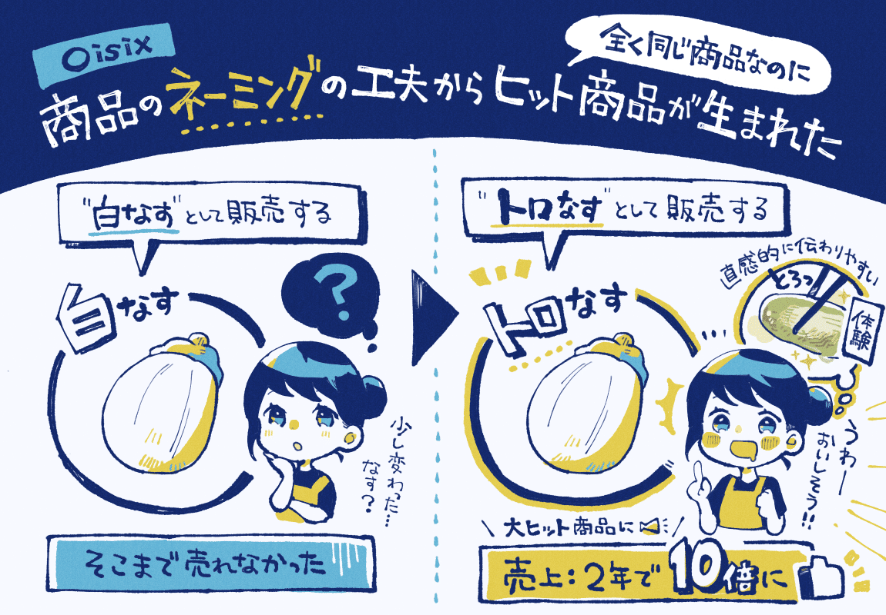

**ヒット商品の「ピーチかぶ」も、当初は「スイーツかぶ」といった候補名もあったが「ピーチかぶ」として売ると大人気に。**甘さやみずみずしさを表現した名前が反響を呼んで大ヒット商品に。

他にも、マッシュルームの軸を「マッシュルン」として販売すると好評だった。規格外の野菜を集めた「ふぞろい野菜」もヒットにつながった。

このような、名もない野菜たちに「ドレスを着させてあげる」ような工夫をすると食材をイメージしやすくなり売れることが多かった。

> その後、2013年に東証マザーズに上場、2016年にとくし丸（移動スーパー）を連結子会社化、2017-2018年に「大地を守る会」「らでぃっしゅぼーや」と経営統合して、社名が「オイシックス・ラ・大地」になり事業を拡大。2022年には東証プライム市場に移行した。

## 事業成長に大きく貢献した、ミールキットの開発。

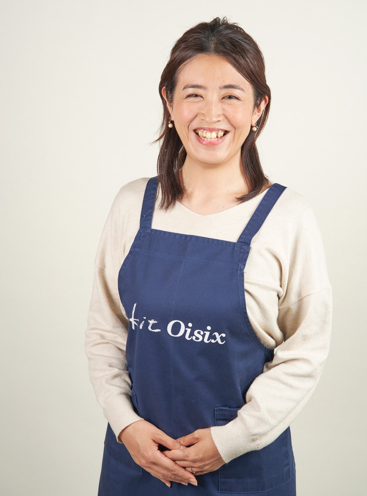

ミールキットのお話を聞いた、オイシックス・ラ・大地株式会社 森田 佐和子さん

その後、事業の大きな成長につながったのが、ミールキット「Kit Oisix」の開発だった。Oisixは日本では「一般家庭向けにミールキットを販売したパイオニア的存在」だという。これはどう生まれたのか。

はじまりは、Oisixを辞めてしまった人や購入頻度が下がった顧客にインタビューを行うと**「時間がなくて料理ができない」「野菜を使いこなせない」といった課題が挙がったのがキッカケのひとつ。**

商品開発はモック（資料）を想定ユーザーに見せて、「こんな材料が届いて、こんなお料理ができて、レシピカードがついてきます。どうですか？」と説明してヒアリングをしながら手応えを掴んでいった。

そして、当時あった直販店舗でミールキットをテスト販売してみて、「どう声掛けをしたら、みんなが振り向いてくれるのか？」を検証した。

**結果としては「ミールキット」よりも、「20分で2品がつくれる、食材とレシピのセットです！」といった表現のほうが伝わるとわかって**、その反応の良かったフレーズをWebページにも反映していった。

こうして2013年に生まれたミールキット「Kit Oisix」は、現在ではシリーズ累計出荷数が2億食を超えるまでに成長した。

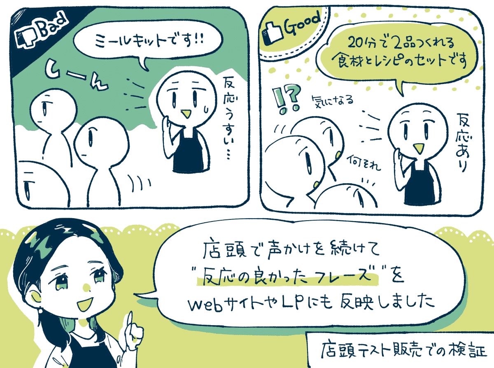

## ミールキットの「写真の訴求軸」を変えたら購入率が上昇した話。

水野：  
意外な結果になった施策としては、ミールキットの写真で「何を訴求するか」を変えたところ、お客様の反応が大きく変わったことです。

ミールキットの定期ボックスでは、もともとは「主菜がこれ、副菜がこれ」みたいな感じで、全体像が見えるような写真をのせていました。

しかし、**お客様に「どんな基準で商品を選んでいるか？」をヒアリングすると「美味しそうかで選びますよ」と話される方が多かったんです。**

その話を聞くまでは、ミールキットってお客様に調理してもらって成立するものだから「完成系はどうなるのか？」「食材や量はどれくらいか？」がわかるほうが親切だと思っていたけど、これが間違いかもと気づいてきた。

そこで実際に**「美味そうに見える、食欲がそそられるような写真」を撮ってのせてみたところ、購入率がめちゃくちゃ伸びたんですよ。**

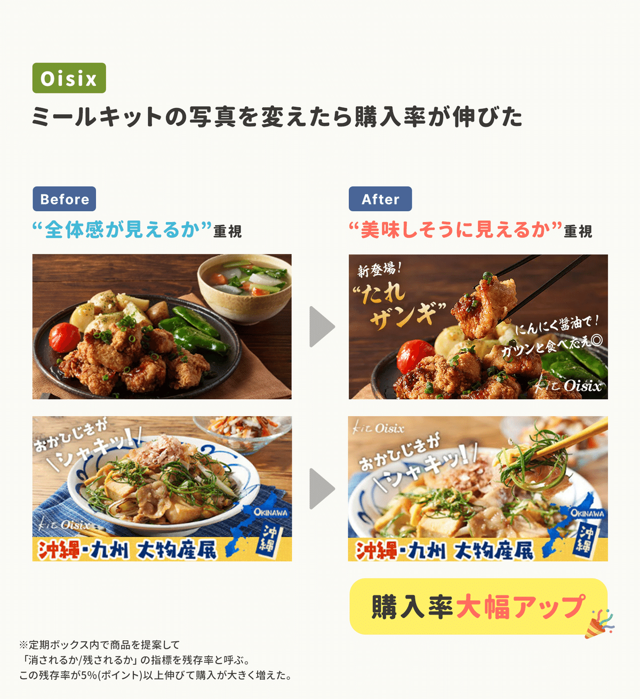

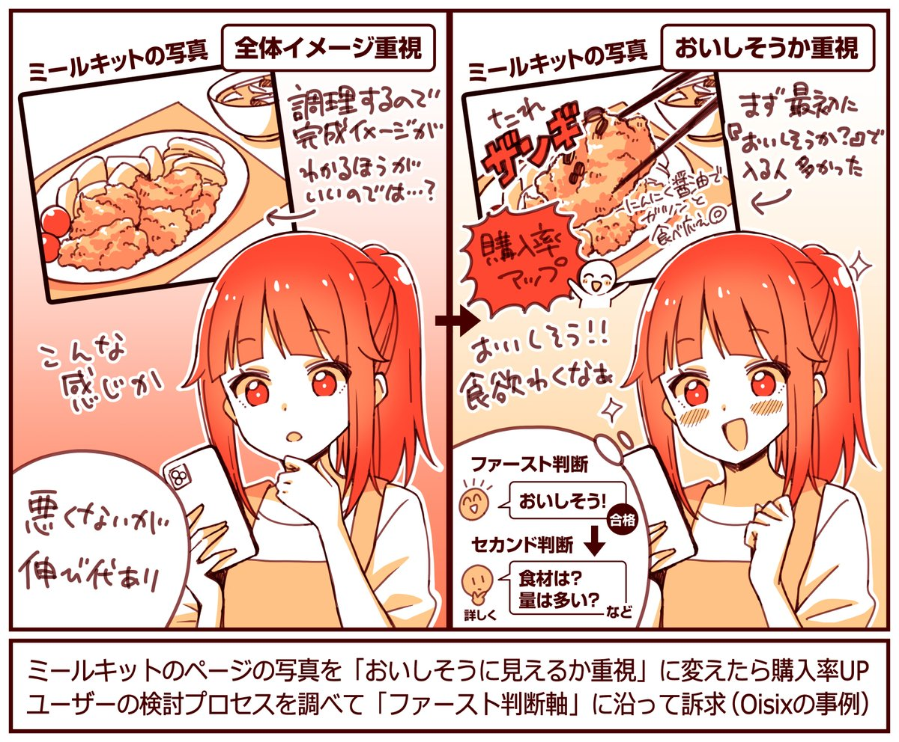

例えば、唐揚げなら「引きで撮った写真」よりも「ジュワッとした唐揚げの断面の写真」をのせるほうが良かった。美味しそうに全振りしました。

ここから言えるのは、判断のファーストインプレッションがどこにあるか、次に来るセカンドインプレッションは何かを知るのが大事。

まずは「美味しそうか」をパッと判断して、それからその他の要素の検討に入っていた。この「最初の判断軸は何か？」を見つけるのが重要でした。

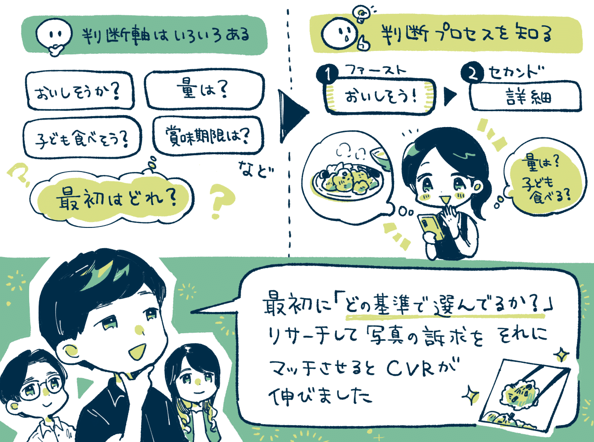

インタビューをすると「選ぶ基準」は色々あって。「子どもが食べそうか」「量が多そうか」「賞味期限は長そうか」たくさんあるのですが、最初にフックになる基準は「美味しそうか」だった。

まずは「美味しそうか？」の土台に乗らないと、値段や賞味期限はそこまで関係ないのだなと。この最初の判断軸を知ることが大事でしたね。

---

【取材協力】  
オイシックス・ラ・大地株式会社：<https://www.oisixradaichi.co.jp/>   
Oisix：<https://www.oisix.com/> さん

【告知】オイシックス・ラ・大地さんでは各職種で採用中。ご興味あれば下記のサイトよりどうぞ。

[**オイシックス・ラ・大地 株式会社**
*これからの食卓、これからの畑*
*recruit.oisixradaichi.co.jp*](https://recruit.oisixradaichi.co.jp/)

> ※ 以降は、＋αの【4つの事例】を購読会員向けにまとめています。  
> 【① 登録後に**アプリのダウンロード**を大きく促進した施策】  
> 【② アプリからの**受注率を高めた改善**】  
> 【③ 購入単価を引き上げた**カート画面の工夫**】  
> 【④ ECユーザーの**「購買意欲の変化」を意識して**企画を立てる話】  
> 【⑤ **売上の大幅アップ**につながった定期ボックスの工夫】  
> など、ご興味あればご覧ください。

  

ダウンロード

 

copy

## ここから先は

1,397字
/
5画像

%22%20d%3D%22M-100-100h300v300h-300z%22%2F%3E%3C%2Fsvg%3E)

アプリやプロダクトの成功事例が学べるマガジンです。プロダクトの売上やユーザー数を伸ばしたい人にオススメです。成長プロダクトのインタビュー、効果のあったマーケティング施策、事例やデータなどが中心（月に7記事ほど）多くの過去記事も5年ほど遡って読めます。クレカ決済だと初月無料なのでお試しでもぜひ。

### [月刊アプリマーケティング](/m/mc375c9b46464)

¥2,000 / 月  
初月無料

プロダクト運営について学べるマガジンです。アプリやプロダクトの売上やユーザー数を伸ばしたい人にオススメです。月に7記事ほどお届けします。

購読手続きへ

%22%20d%3D%22M-100-100h300v300h-300z%22%2F%3E%3C%2Fsvg%3E)

1人が高評価

[ログイン](https://note.com/cd/login?redirect_to=https%3A%2F%2Fmarkelabo.com%2Fn%2Fn3e8b3a9c5cc6)

   

30

[%22%20d%3D%22M-100-100h300v300h-300z%22%2F%3E%3C%2Fsvg%3E)](/)

[アプリマーケティング研究所](/)

フォロー

プロダクトの成功事例を発信しているメディアです。2013年から約10年運営しています。取材相談はツイッターDM（@appmarkelabo）かメールにてどうぞ！info@appmarketinglabo.net