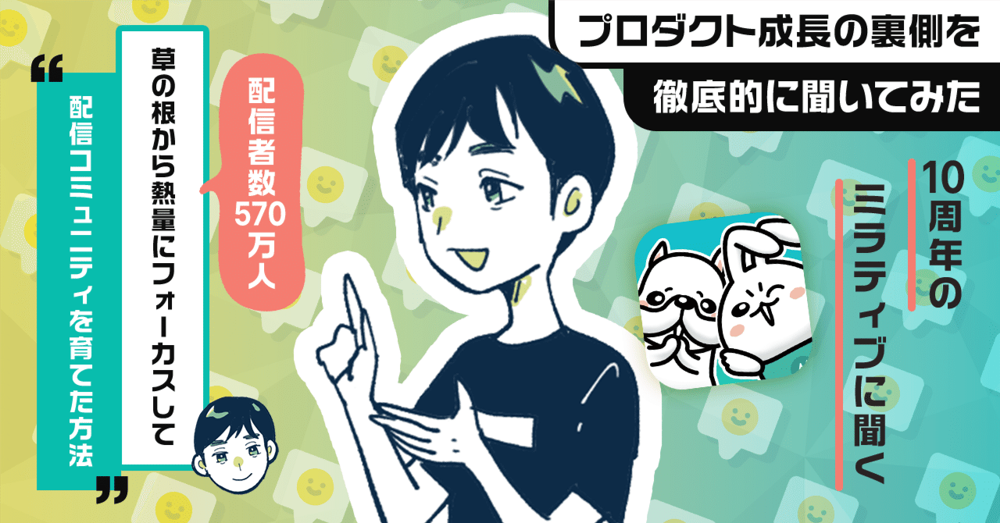  

# 初期は「熱量」にフォーカスする。使われるサービスを作るなら「需要」を発明しない。黒字化に到達した「ミラティブ」に聞く10年の失敗と成功。コミュニティサービス成長の裏側。

74

[%22%20d%3D%22M-100-100h300v300h-300z%22%2F%3E%3C%2Fsvg%3E)](/)

[アプリマーケティング研究所](/)

2025年9月29日 11:30

¥2,000/月

10周年の「ミラティブ」さんを取材しました。

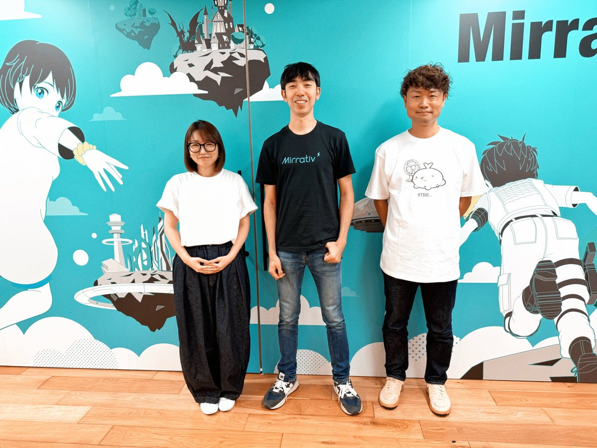

株式会社ミラティブ 代表取締役CEO 赤川 隼一さん（中央）、co-founder 小川 まさみさん（左）、執行役員 ミラティブ事業本部 本部長 岡田 裕次郎さん（右）

## ミラティブ（Mirrativ）について

赤川：  
スマホゲームの配信者数では、日本一のゲーム配信プラットフォームです。配信者は累計570万人以上。2025年8月にリリース10周年を迎えました。

ミラティブはプラットフォームとして、おかげさまで利益も出ていて売上もずっと右肩上がりです。

2021年に黒字が出るようになって、そこからライブゲームに1回投資して、その後も綺麗に伸び続けていて利益も出ています。

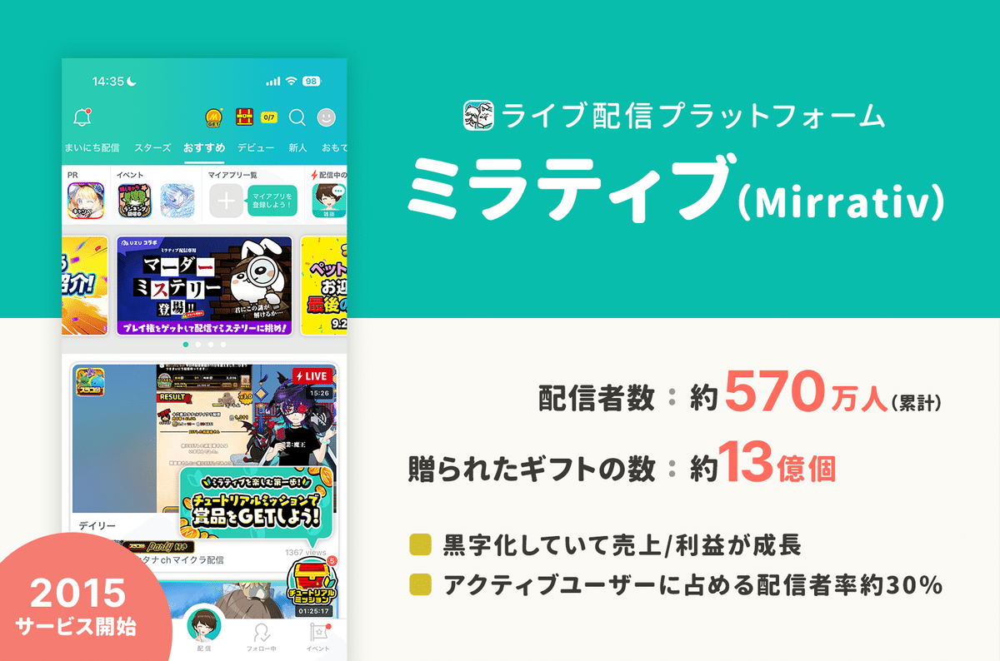

## ミラティブはどう誕生したか。

赤川：  
はじまりは、スマホゲームの流れが来ていた中で、Android 5.0で画面共有ができるAPIが出ると知り、それを使って配信サービスを作ったのが最初です。

コンセプトは「友だちの家でドラクエやってる感じ」テレビやゲームを囲み友達の輪ができる体験を、スマホで再現する世界観を目指しました。

意識したのは、**0→1で体験を作るのではなく「既存の体験」をショートカットしてあげること。僕らはこれを「需要を発明しない」と表現しています。この考え方は今でもずっと大事にしていますね。**

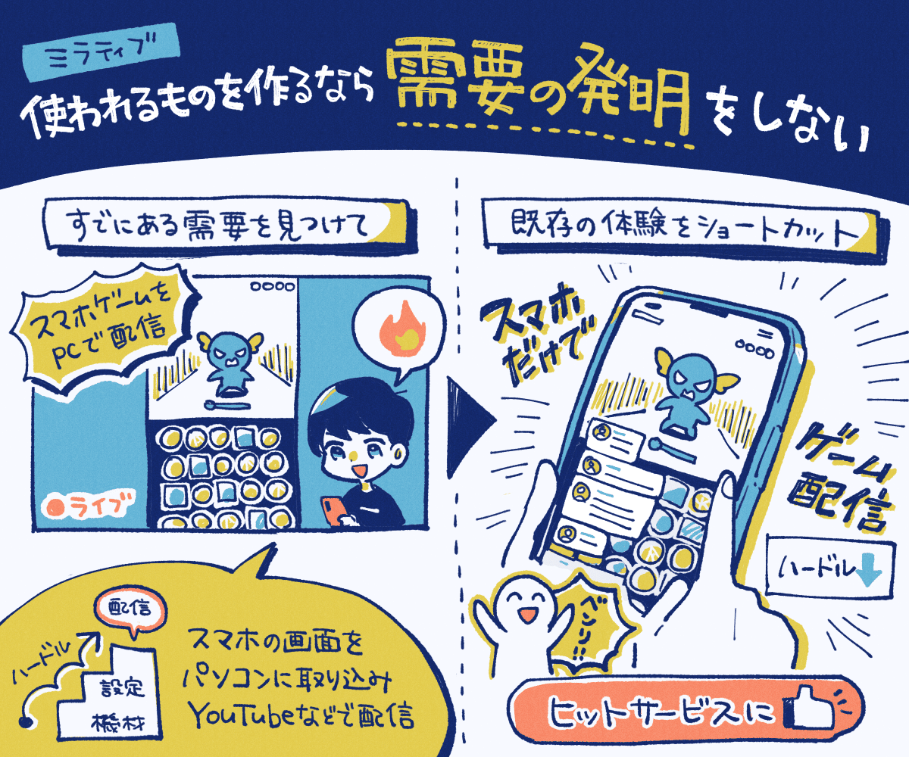

つまり、**僕らが「スマホのゲーム実況文化」を発明したわけじゃなくて、すでに盛り上がっていたものを「やりやすくした」**だけなんですよ。

スマホのゲーム実況って大変なんですね。PCにスマホ画面をキャプチャして取り込まないといけない。機材や設定も必要ですよね。

それでも、当時は「パズドラの配信」などをYouTubeでやってる人がいて。それを乗り超えてでもやりたい「熱量と需要があった」わけですね。

そこに着目してアプリを開発して。公開ボタンを押した瞬間はやはり特別でエモい気持ちでした。徹夜明けで忙しかったけど高揚感がありました。

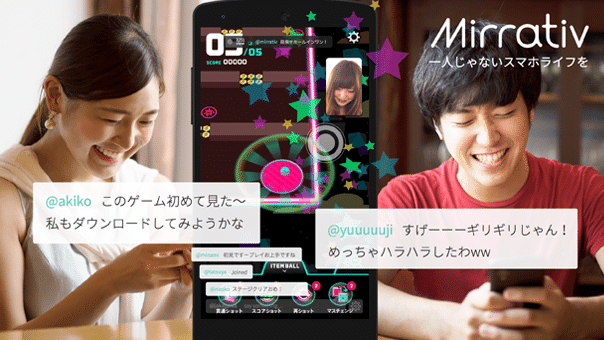

リリース当時の画面

## スマホ20台を並べて、草の根から「熱量」を高めてコミュニティを作っていった。

赤川：  
プレスリリースを出して、ネットニュースになり人は入ってきたのですが、使い続けてくれる人は少なかったんですよ。

プレスリリースを打ったのは失敗でした。なぜなら入ってくるのは「業界人」ばかりだったからです。純粋なユーザーではない人を呼んでも検証が遅れるだけ。実際に、1ヶ月経っても全然伸びなかったんです。

正直「これはまずいぞ」と思いました。それで必死になってはじめたのが、草の根から熱量を高めてコミュニティを作っていく活動でした。

初期に徹底してやったのは、**誰かの配信がはじまったら、すぐに公式アカウントで入室して「ミラティブへようこそ！」と声をかけていくこと。**

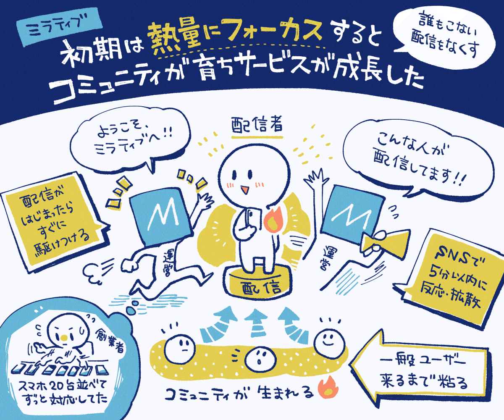

配信で一番つらいのって「誰も来ないこと」なんですよ。なので、配信がはじまったらSlackに通知が飛ぶようにして、即コメントしにいきました。

土日も含めて1日18時間ぐらい、スマホを約20台並べてやっていましたね。寝る時以外はもうずーっとコメントしていました。

**中の人として配信を盛り上げて、一般ユーザーがきたらそっと立ち去る、Twitter（X）で「配信開始しました」と誰かが投稿したら5分以内に反応する。**火種を作り熱量を上げることに全集中しました。

これを続けると本当に伸びたんです。配信で一緒になった人をSNSを含めつなげてあげることで、徐々にコミュニティが生まれたのだと思います。

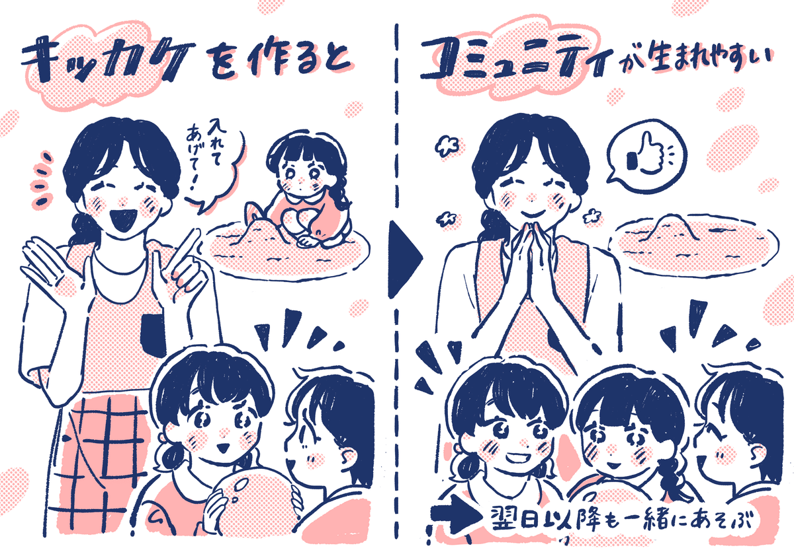

「ユーザーを子どもに例えたい訳ではない」という前提で、これは「公園や幼稚園で1人で遊んでいる子」に声をかけて繋いであげるとコミュニティが生まれる現象に似ているとのこと。さらに、1人で遊べる砂場のような遊具があると（ミラティブでは「ゲーム実況」）1人でもしばらく間が持つためキッカケを作りやすくなると。

## 初期は「バイユーザー」を集める理由。

赤川：  
ミラティブのようなサービスは「配信者」と「視聴者」の両方を集めていく必要がありますが、別々に集めていくと大変なんですね。

という意味では、コミュニティサービスの初期は、視聴者でもあり配信もしてくれる「バイユーザー」を集めることが大事だったなと感じます。

**視聴者って配信するとは限らないけど、配信者は「自分を見に来てもらうための視聴」もします。つまり、配信者を集めていくとコミュニティは立ち上がりやすいわけです。**

実際に「バイユーザー」って、そうではない人に比べると**「あらゆる指標」が高いんですよ。継続率は高いですし、視聴時間は長いわけです。**これは今のミラティブでも変わりません。コインでギフトをする率も圧倒的に高いですね。

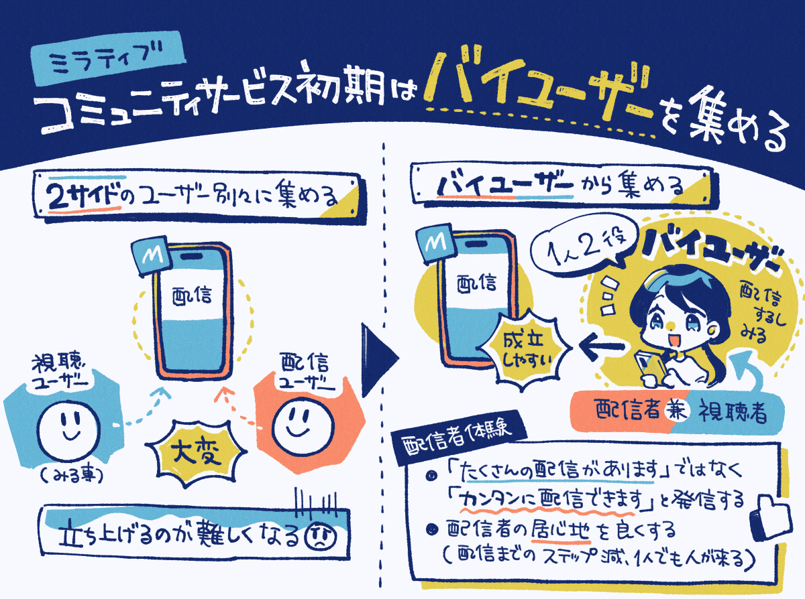

では「バイユーザー」を集めるにはどうするか。答えは「相互補完的な特徴を持ったひとつの機能」をプッシュすると良いんですよ。

例えば、ミラティブで「面白い配信がたくさんありますよ！」と言ってしまうと、これは視聴者に向けたメッセージですよね。なので、あんまり発信しません。

**そうではなくて、配信者に向けて「簡単に配信できますよ！」と発信します。「配信ができるアプリです。スマホだけで配信できます。ゲーム実況できます」**これをずーっと言い続ける感じですね。

そして、配信開始までのステップを少なくして、離脱が起こらないようにする、配信に1人でも来やすくする。とにかく配信体験を良くすると。

シンプルに言うと、配信者 兼 視聴者のバイユーザーにとって「居心地が良い場所」を目指していくと立ち上がりやすいということです。

あと、大きくユーザー数が伸びたのは、iOS11に画面録画がついて配信が簡単になったことです。ここで裾野が広がって軌道に乗りました。

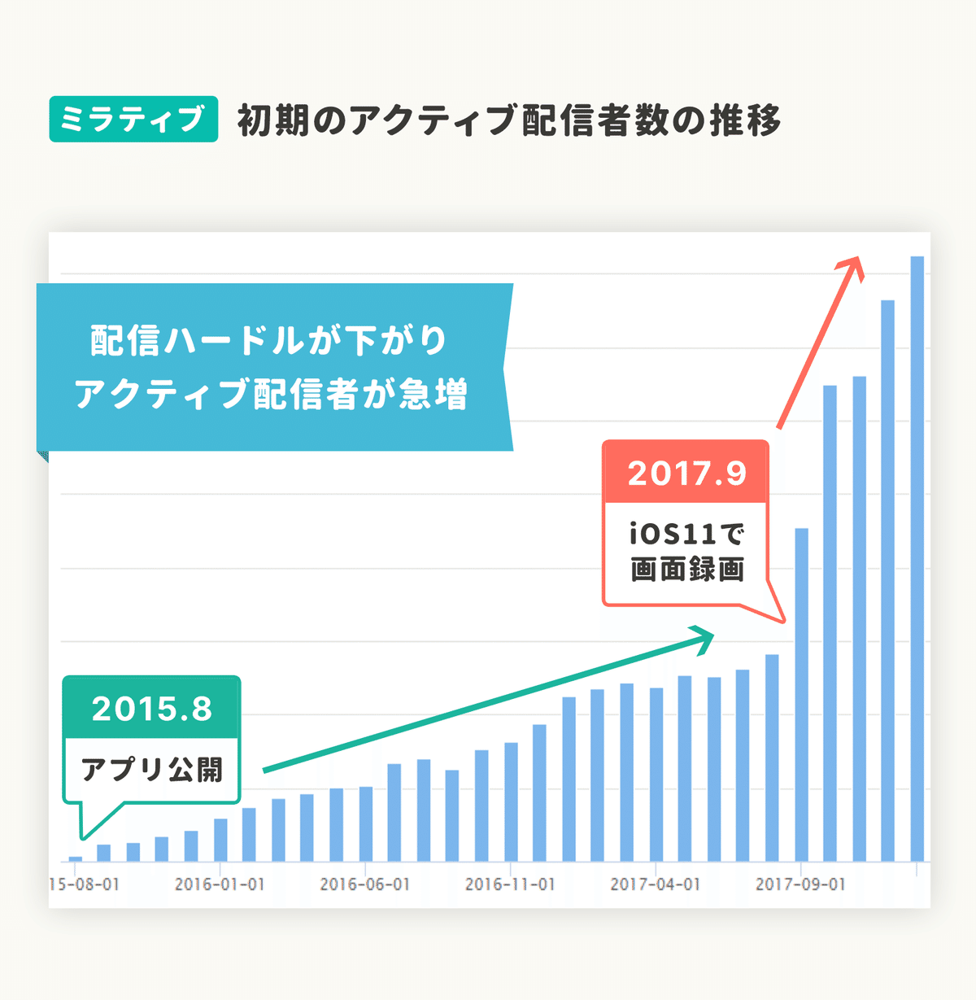

## 雑談ニーズとVTuberが「アバターを生んだ」

赤川：  
元々ミラティブは、DeNAの新規事業としてはじまったのですが、2018年4月に事業を買い取ってMBOという形で独立しました。

そこから2018年8月にはアバター（エモモ）を実装したことも事業の成長につながりました。

やるべきだなと思ったキッカケの一つは、**ミラティブで「スマホのホーム画面」を映しながら雑談配信している人がめっちゃ増えていたこと。**

最初にこれを見たときは複雑でした。だって「ゲーム実況」を売りにしているアプリなのに、めっちゃ雑談をしていたわけなので。笑

でも、これリアルで考えるとわかります。**最初は何かキッカケが必要なんだけど仲良くなると「その人と一緒に過ごすこと」の優先度が高くなる。**

キッカケはゲームやサッカーで仲良くなるけど、友達と仲良くなったら「雑談」だけでもすごく楽しいじゃないですか。

つまり、コミュニティが成熟してくると「雑談」が求められる。ミラティブだと画面共有が必須だから「テキトーな画面」を映して雑談する。この画面を埋められるものを作ったらもっと盛り上がるのではないか？

そんな中で、**2017年末頃に「第1次VTuberブーム」みたいな流れが起こってきたんですよね。**

KizunaAIさんは少し前からいましたけど、ねこますさん、ホロライブのときのそらさんが注目を集めたり。VTuberの人気に火がついてきた。

その少しあと2018年2月に、にじさんじの1期生がミラティブでデビュー配信をしてくれたりもして。3Dでガンガン動いていなくてもLive2Dアバターでもこんなに愛情が湧くんだなと。

そんな感じで、VTuberが熱狂的なファンを獲得していたこともアバター機能を開発した一つのキッカケになりましたね。

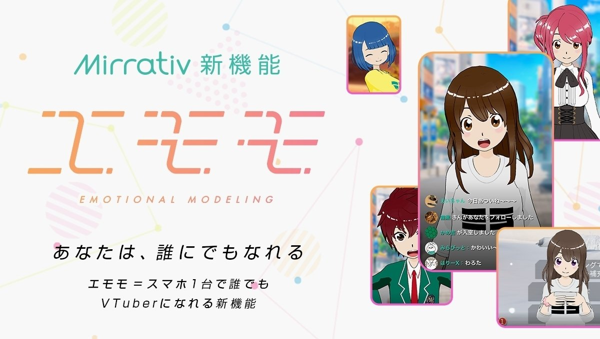

2018年にリリースした「アバター機能」（エモモ）

そこからは、2019年にはカラオケ機能の「エモカラ」を出したり、2021年頃から「ライブゲーム」が伸びてきて収益のドライバーになったり。

2023年には「ミラティブスターズ」（公認配信者）という収益化できる仕組みを作ったりしたことで、事業が成長していきましたね。

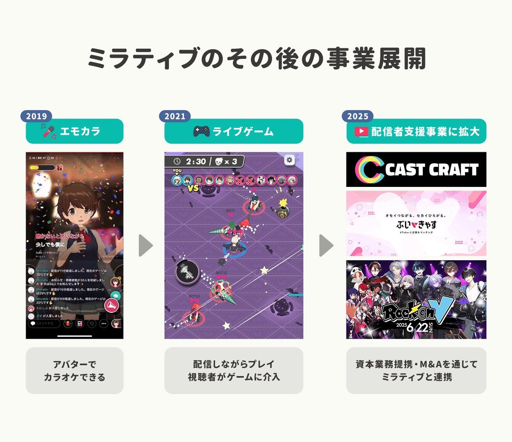

## ユーザーが「勝手にやっていること」からヒット機能が生まれる。

赤川：  
ミラティブのヒットした機能って、**ユーザーが「勝手にやってること」から生まれているんですよね。なので「需要を発明しない」がテッパンです。**

例えば、コラボ通話は「勝手にSkypeで通話していた」というところから。配信のメモ機能は「スマホのメモ帳に"その配信のルール"を書いて出している人がいた」ところからはじまっています。

**大事なのは「作った機能の外れ値」なんです。「こんな使われ方すると思ってなかったな」みたいなところにめっちゃヒントが詰まってる。**それを見つけるためにひたすら観察とログを見ます。

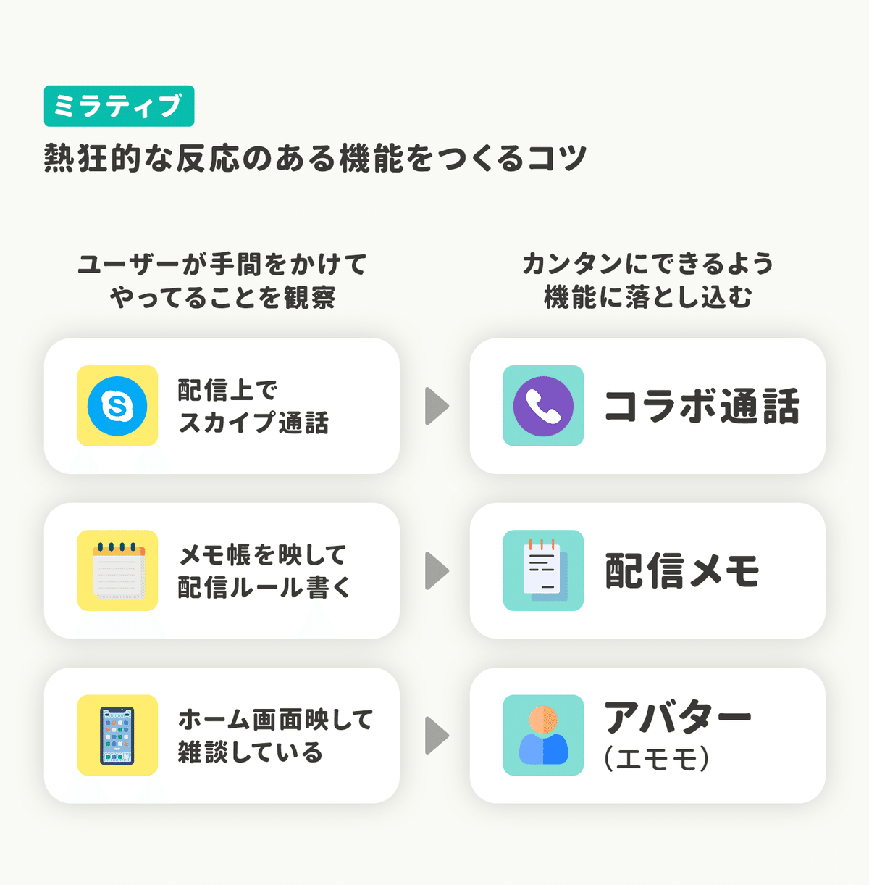

まずは、なるべく開発せず小さく作って一部の人に使ってもらう。すると、「あれ？こう使われているな。てことは、こういう需要があるんちゃう？」みたいなものが見えてきます。

ユーザーさんの解像度が高い状態で、できるだけ機能開発をせずに試して**「これは深く刺さる」ってものが見えたら、それを「1人」だけじゃなくて、多くの人に「どう広げるか？」を考えるのが機能開発のポイントです。**

**失敗しがちなのは「このKPIをあげなきゃ」みたいに機能を作ること。これを「提供者論理」と呼んでいます。**ユーザー不在で「こうしたい」「こうすべき」と作ると誰にも刺さずに終わります。

ユーザーさんを観察して解像度を上げて小さく実験して、「イケる」と思ったものは機能や仕組みで複利を効かせる。この順序がものすごく大事ですね。

## ミラティブで成功した「2つの施策」

## 成功施策①：ポップアップストアを「参加型」にしたら売上が2〜3倍になった。

岡田：  
ミラティブでは、**ポップアップストアを「参加型のストア」として設計したところ、売上や来場者数が2〜3倍に伸びた**ことがあります。

実は、1回目は単なる「物販型のストア」でした。この時は来場者数も売上も少なくて「もうやらない方がいいのでは」と思うほど辛かった。

でも、**「熱量が高まる瞬間」もあって。それは配信者さんがお店に来てくれたときにファンも集まる**という現象が起こったんですね。

それで、2回目は単にモノを売るだけではなく「参加型のイベント」を拡充しました。運営による現地配信を増やしたり、寄せ書きスペースに自己紹介カードを置いたり、ゲームを一緒に遊ぶ配信をしたり。

参加型のイベントを企画すると、配信でも「当選したよ」と話題になったり、視聴者間でも「一緒に行こう。オフ会しましょう」と交流が生まれます。オフラインとオンラインの体験がつながるんです。

ポップアップストアを「ショッピングの場」として捉えずに、**配信者さんや視聴者さんにとっての「思い出になる場」にしたところ、来店機会が増えて結果的に売上も伸びましたね。**

参加型のポイントは「思い出になる」だと思いますね。「誰かに会える」「自分の爪痕を残せる」「人とつながれる」みたいな感じです。

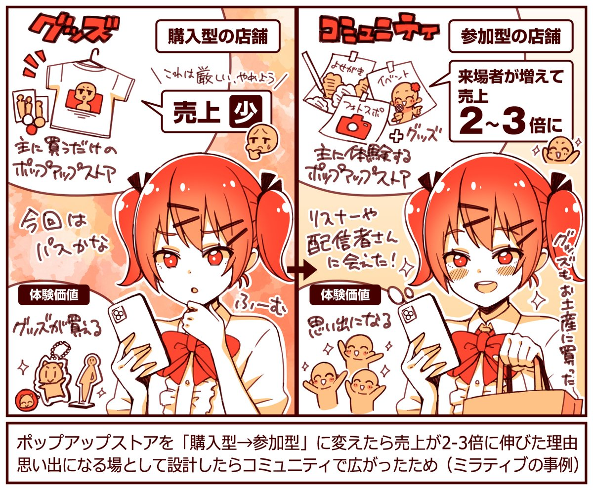

## 成功施策②：プロフィール帳のような「こんにちはシート」が組織を活性化した。

小川：  
ミラティブ社で**「組織の活性化」に効果があったのは、入社したメンバーに「こんにちはシート」を書いてもらうようにしたことです。**

プロフィール帳のような感じで「性格診断」「出身地」「今ハマっていること」などを書いてもらうんですね。これを見てもらうと社内の人たちに「人となり」が伝わって会話が生まれやすくなります。

組織が拡大すると**「誰が何を担当しているのかわからない」「何を話して良いかわからない」といった、「誰だこいつ病」に罹りやすくなります。**

これが蔓延すると、コミュニケーションが停滞し業務に支障が生まれたり、居心地が悪くなってロイヤリティが下がったりするんですね。それを事前に防ぐ仕組みとしても機能します。

面白かったのは、**「社内のSlackに投稿する」というルールを加えただけで、投稿にコメントがつき、ボロボロと会話が生まれるようになったことです。**

例えば、「出身が同じだ」とか「趣味が同じだ」とか、共通点が見つかるだけでもコミュニケーションってしやすくなりますよね。

共通点の可視化も大事なんです。話すきっかけは多いほうがいいですよね。共通点があるとついコメントしたくなります。

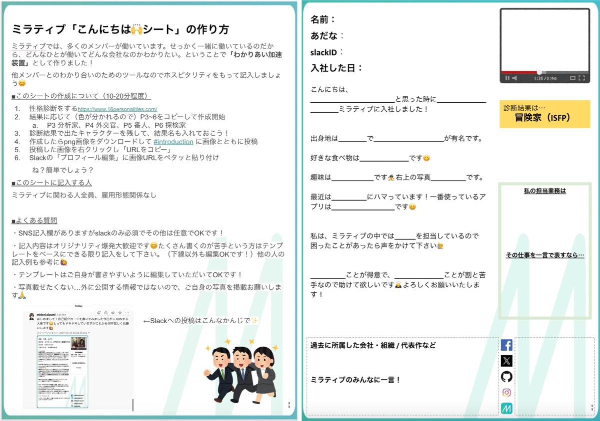

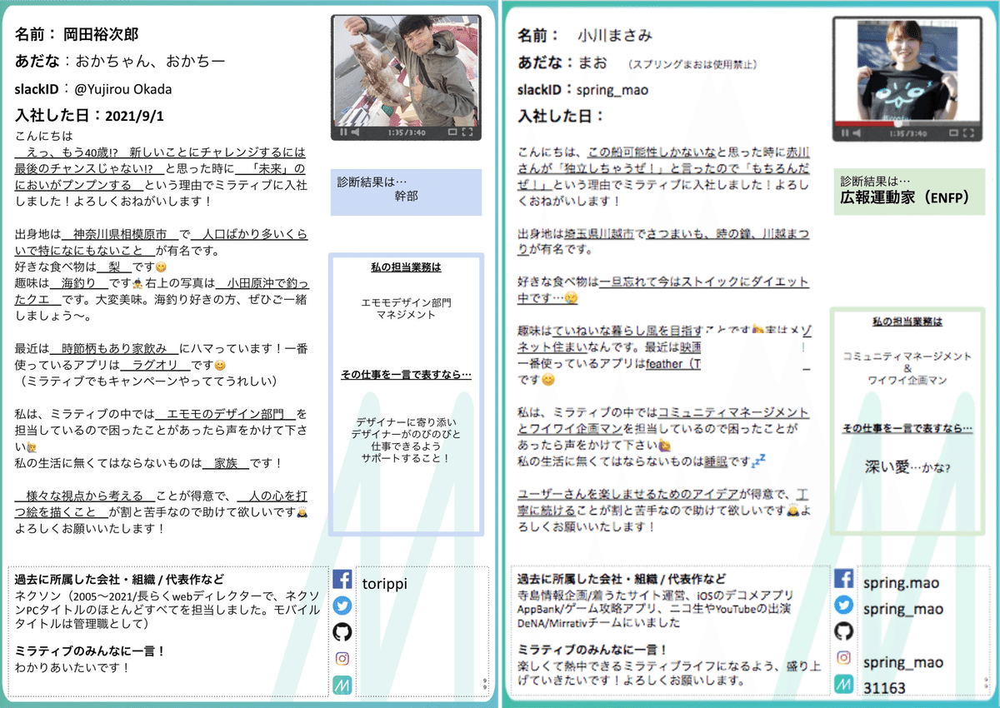

---

【取材協力】  
株式会社ミラティブ：<https://www.mirrativ.co.jp/>   
Mirrativ（ミラティブ）：<https://www.mirrativ.com/>

【告知】ミラティブさんでは各職種にて採用中。ご興味あれば下記のサイトよりどうぞ。

[**株式会社ミラティブ**
*Mirrativ（ミラティブ）採用サイト｜人の願いをつなぐしごと。*
*www.mirrativ.co.jp*](https://www.mirrativ.co.jp/recruit/)

> ※ 以降は、＋αの【5つの事例】を購読会員向けにまとめています。  
> 【① コミュニティサービス初期は**「賑わい」を演出する**】  
> 【② **リテンションに効いた**「2つの仕組み」】  
> 【③ コミュニティサービスを作るなら**最初はどの指標を追う？**】  
> 【④ アバターの**マネタイズを加速させた**「売り方の発明」】  
> 【⑤ イベントの**盛り上がりと売上を大きく高めた工夫**】  
> など、ご興味あればご覧ください。

  

ダウンロード

 

copy

## ここから先は

2,400字
/
7画像

%22%20d%3D%22M-100-100h300v300h-300z%22%2F%3E%3C%2Fsvg%3E)

アプリやプロダクトの成功事例が学べるマガジンです。プロダクトの売上やユーザー数を伸ばしたい人にオススメです。成長プロダクトのインタビュー、効果のあったマーケティング施策、事例やデータなどが中心（月に7記事ほど）多くの過去記事も5年ほど遡って読めます。クレカ決済だと初月無料なのでお試しでもぜひ。

### [月刊アプリマーケティング](/m/mc375c9b46464)

¥2,000 / 月  
初月無料

プロダクト運営について学べるマガジンです。アプリやプロダクトの売上やユーザー数を伸ばしたい人にオススメです。月に7記事ほどお届けします。

購読手続きへ

%22%20d%3D%22M-100-100h300v300h-300z%22%2F%3E%3C%2Fsvg%3E)

1人が高評価

[ログイン](https://note.com/cd/login?redirect_to=https%3A%2F%2Fmarkelabo.com%2Fn%2Fn384db632b67a)

   

* [#マーケティング](https://note.com/hashtag/%E3%83%9E%E3%83%BC%E3%82%B1%E3%83%86%E3%82%A3%E3%83%B3%E3%82%B0)
* [#ミラティブ](https://note.com/hashtag/%E3%83%9F%E3%83%A9%E3%83%86%E3%82%A3%E3%83%96)

74

[%22%20d%3D%22M-100-100h300v300h-300z%22%2F%3E%3C%2Fsvg%3E)](/)

[アプリマーケティング研究所](/)

フォロー

プロダクトの成功事例を発信しているメディアです。2013年から約10年運営しています。取材相談はツイッターDM（@appmarkelabo）かメールにてどうぞ！info@appmarketinglabo.net