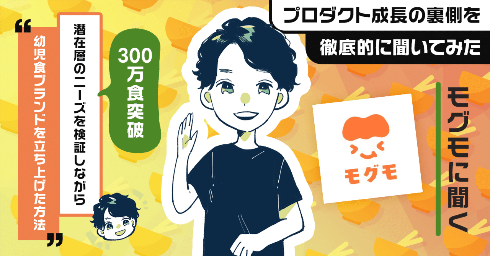  

# 丁寧な検証で「潜在的なニーズ」にアクセスして3年間で300万食を販売。冷凍幼児食の「モグモ」が語る「子育ての悩み」からスタートしてブランドを立ち上げた方法。

31

[%22%20d%3D%22M-100-100h300v300h-300z%22%2F%3E%3C%2Fsvg%3E)](/)

[アプリマーケティング研究所](/)

2025年10月20日 11:30

¥2,000/月

3年で300万食を販売した「モグモ」さんを取材しました。

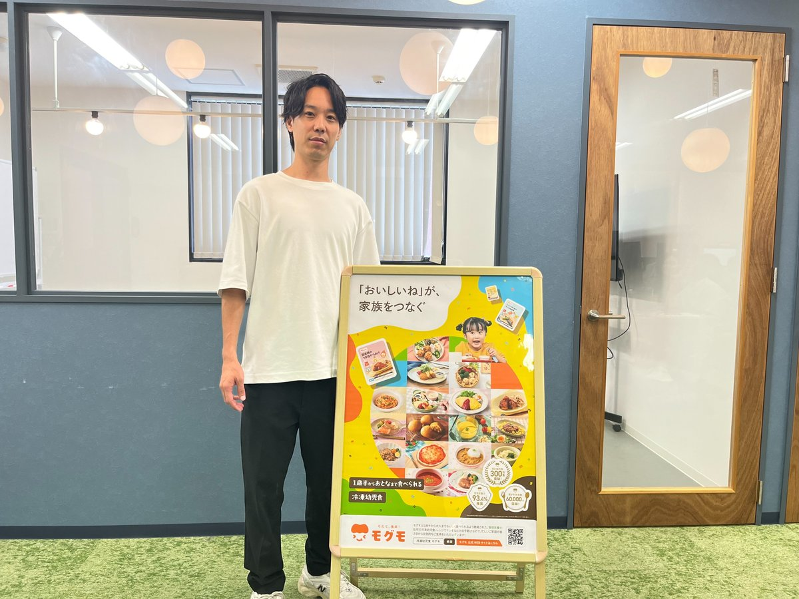

株式会社Oxxx 代表取締役CEO 黒瀬 優作さん

## ⸺「モグモ」について教えてください。

黒瀬：  
モグモは、幼児期の「食卓の悩み」を楽しく解決する冷凍幼児食です。家族の成長を支えるライフスタイルブランドとして展開しています。

2022年5月にサービスを開始して、**累計6万以上の家族に利用していただき、累計300万食以上を販売しています。**

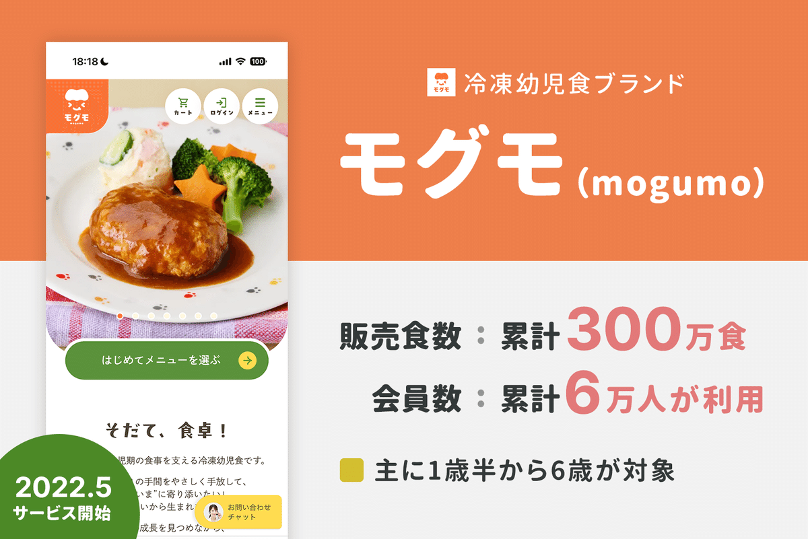

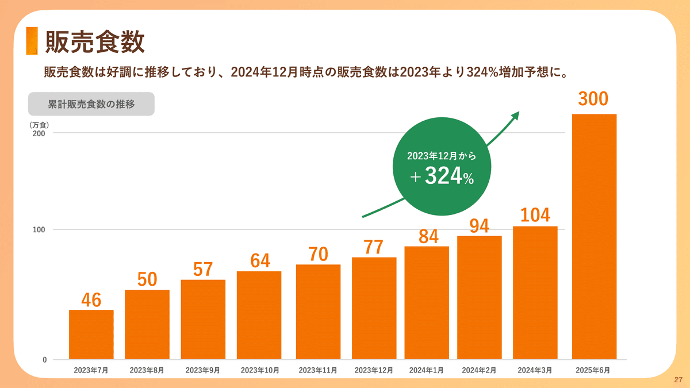

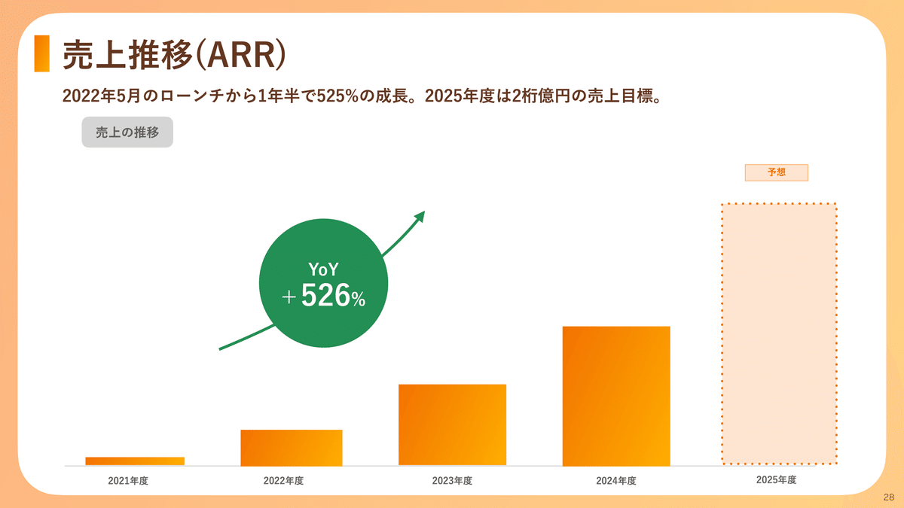

## ⸺どのように「モグモ」の事業アイディアを着想したのでしょう？

黒瀬：  
2021年に創業した当時、**1歳半の娘が幼児食に移行するタイミングでした。このときに実感したのが「幼児食の選択肢の少なさ」でした。**

離乳食のときには「作るか・買うか」という選択肢がありましたが、幼児食になると「買う」という選択肢がこんなに少なくなるんだなと。

幼児食って、塩分濃度や噛む力の違いから、大人と食事を分けて作ることが理想的なのですが、共働きの家庭ではその負担が大きいんですね。

そこで、「同じように悩んでいる家庭はきっと多いのではないか」と考えて、モグモという幼児食のブランドを構想しました。

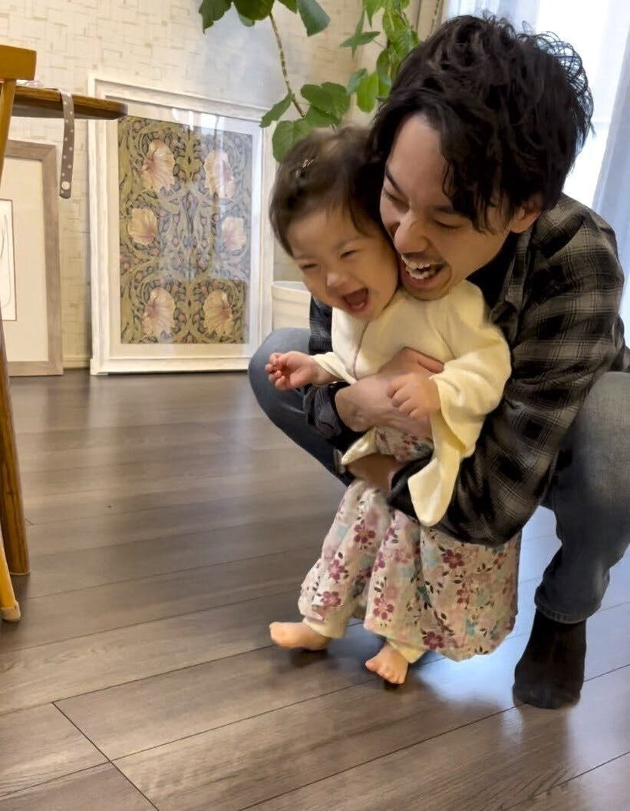

娘の子育ての「悩み」からスタートした。

## 検証したのは"ニーズの再現性"

## ⸺ブランドを作るために「最初にやったこと」を教えてください。

黒瀬： **まず最初に検証したのは「ニーズの再現性」です。**自分たちや自分の周りにはたしかに「子どもの食事で困っている人」がいました。

じゃあ、この「悩み」って本当に多くの人が持っているものなのだろうか？これをまずは確かめる必要があると考えました。

なぜなら「幼児食の悩み」をたくさんの人が感じているなら、潜在的な市場も大きいことになりサービスが成立する可能性も高くなるからです。

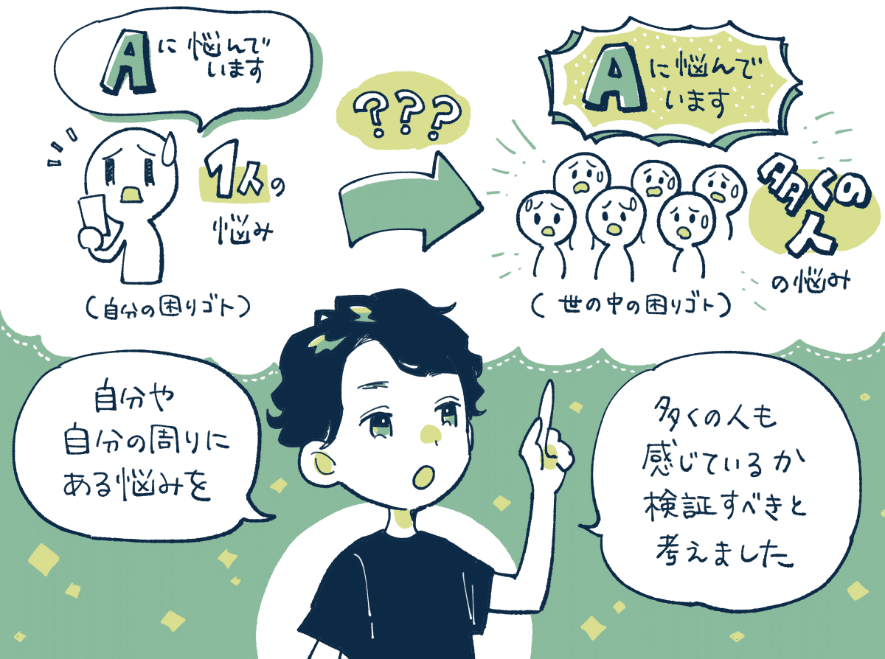

方法としては、**まず事前登録ができるティザーサイトを作って、LINEに登録してもらい、約1,500件のアンケート（回答率は約60％）を集めました。**

集客は「Google広告」に少し出稿しながら、「LINEの友だち追加広告」を活用しました。**今はもっと高騰していると思いますが、当時は1人10円ほどで追加してもらえたんです。**

ティザーサイトでは、抽選で「無料プレゼント」がもらえるようにして、LINE登録後にアンケートに回答してもらうようにしました。

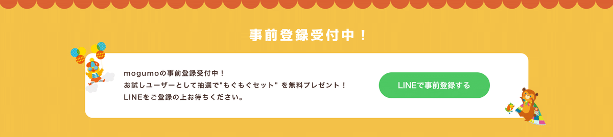

アンケートの結果を見ると**「偏食や好き嫌いがあります。子どもが食べてくれません」といった悩みがとても多かった。**やっぱり多くの人が悩んでいるんだとわかり、仮説の確度がグッと上がった感覚がありました。

さらに共働き世代は増えているので「悩み」の総量も世の中に増えている。気軽に食べられる「冷凍の宅配幼児食」にはニーズがあるはずだと。

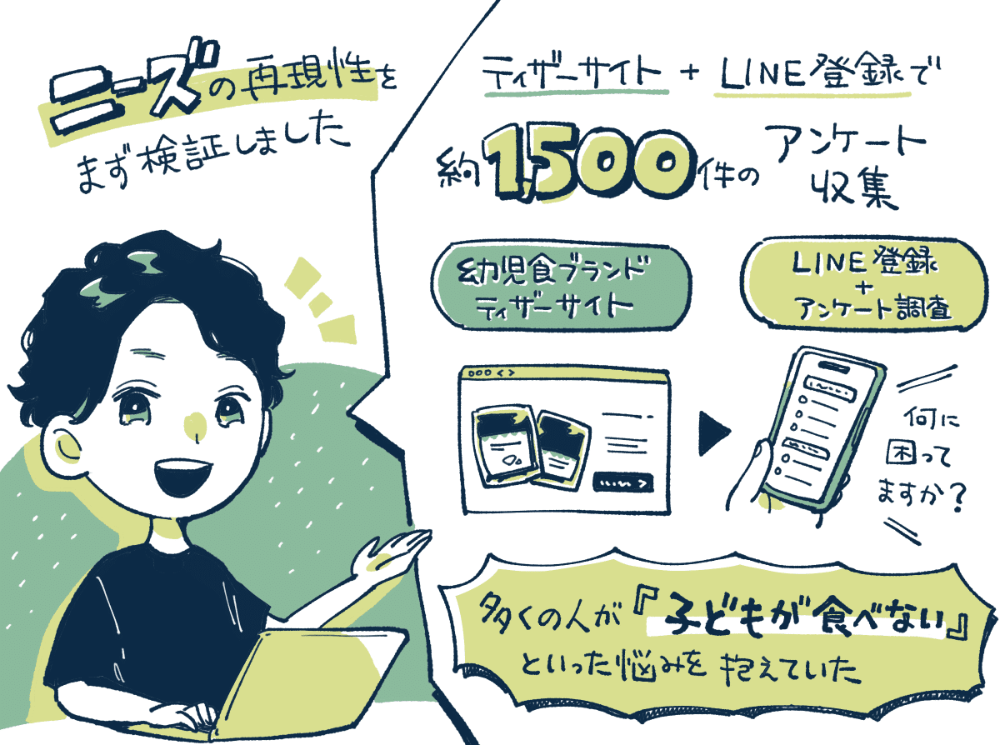

## ⸺ニーズが確認できた後は、どのように展開していきましたか？

黒瀬：  
その次に「お金を払ってもらえるか？」という検証も含めて、商品の開発と並行しながらクラウドファンディングを実施しましたね。

すると、**初日に先行販売が1,000食売れて**、**悩みを抱えている人たちが実際に「お金を払ってくれるんだ！」とわかりました。**

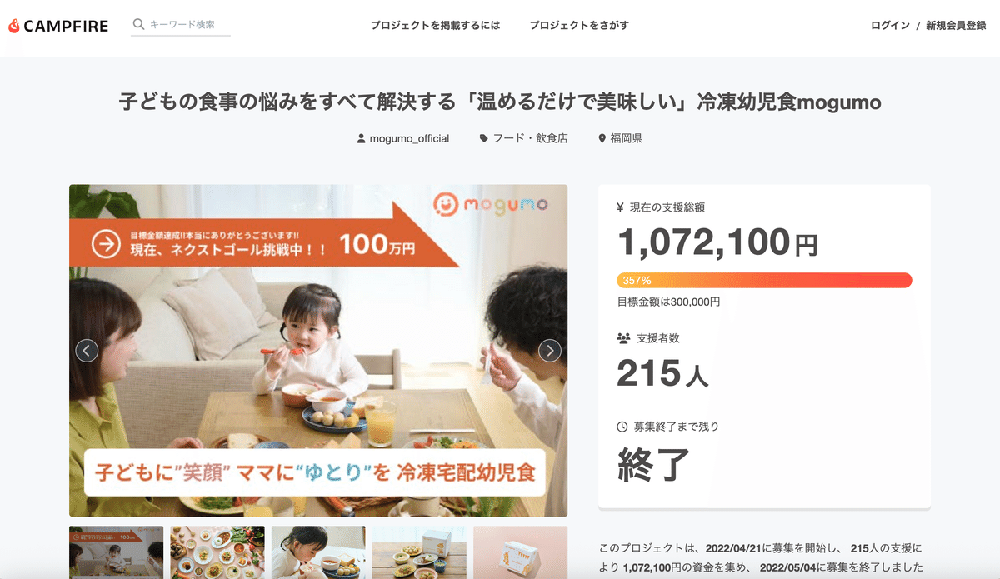

CAMPFIREより

もちろん商品にもこだわり、専門家と共に「数百食の試行錯誤」をくり返しながら、時短だけでなく「栄養バランス・味・安心安全」を追求しました。

工場を見つけるのも大変でしたね。設備面でのハードルもあって、50件連絡して受けてくれる工場が1つ見つかるという感じでした。

このような形で、ニーズの検証、お金を払ってくれるのかを検証をしながら2022年にブランドを正式リリースしました。

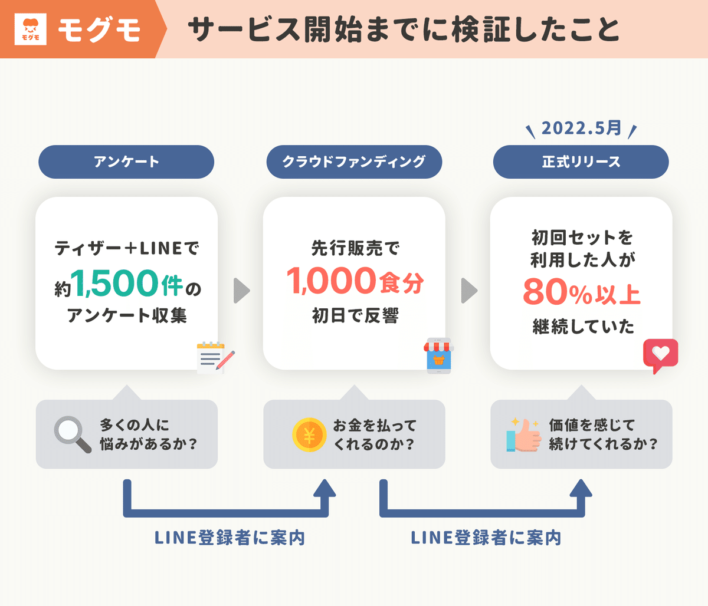

## 潜在的なニーズにアクセスする方法。

## ⸺リリース後も気になります、初期は何を考えブランドを広げていきましたか？

黒瀬：  
まず考えたのはどう広げていくか。**「幼児食」ってGoogleの検索回数も少なくて言葉自体を知らない方も多い。かなり潜在的なニーズなんですよ。**

日本国内の幼児は約490万人、8割超の家庭が「子どもの食事で悩んでいる」と言われています。仮に1人あたり月1万円を幼児食に使っているとすると、約5,000億円という市場になります。

市場の中に「顕在層と潜在層」がいるとして。潜在層に近い方にどう使っていただけるかと考えたときに、やはりSNSって外せないなと。

**とくに「同じ悩みを持つママ」からリアルな感想を発信してもらえると非常に相性がいいだろう**と、ママインフルエンサーに着目しました。結果としては想像以上に大きな反響がありました。

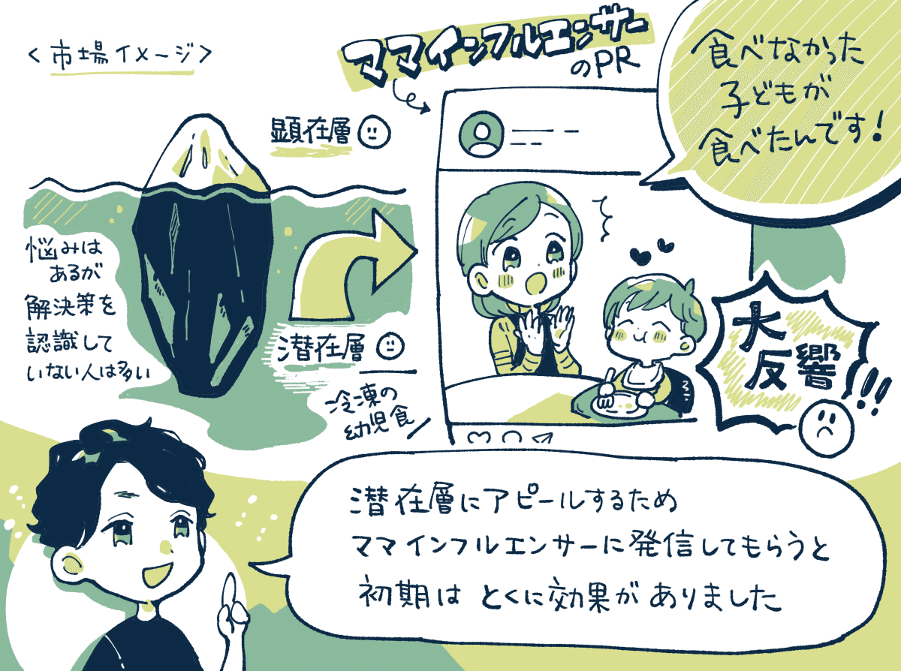

**中でも、効果が高かったのは「食べない子が食べた！」という投稿でした。この訴求への反響がものすごかったんです。**「うちの子も食べない」という悩みを持っている人が多くて、共感の連鎖が起きていました。

僕らもそれを見て「これだ！」と改めて気づきました。「偏食や小食で食べない子が、食べるようになる」これって大きな価値があるんだと。

## ⸺ブランドを広げる中で「これはやって良かった」と思うことを教えてください。

黒瀬：  
2024年には、ママタレントの辻希美さんに、モグモの公式アンバサダーに就任していただいたこともブランドの成長につながりましたね。

辻希美さんは、日本で最も影響力のあるママタレントだと思っていたので、ぜひアンバサダーに就任していただきたいと考えました。

**ただ、受けていただくには高いハードルもあったので、まずは「ぜひ食べてみてください！」と辻さんに商品を送っていました。**すると、偏食の息子さんが喜んで食べてくれたそうで、受けていただけることになりました。

結果としては、お客様も増えましたし採用にも効きました。広告のCVRが上がったりもしました。多方面で影響力があったなと思います。

有名な方が使ってくれたことで、「それなら私も使ってみようかな」と安心・安全を感じてもらえる効果があったのかなと。

## 内製化によって収益性が大きく伸びた。

## ⸺ブランドの成長に大きなインパクトを与えた変更はありましたか？

黒瀬：  
初期は「一部の業務」を外注していたのですが、途中から「全てを内製化する方針に変えた」（製造以外）のはとても良かったです。

商品開発スピード、CS経由でのお客様の声の収集、ロゴやデザイン改善など、全体的なクオリティが上がり売上も向上しました。

わかりやすいものだと、**商品パッケージを「シールで貼る方式」から、「パウチに印刷する方式」に変えたところ、LTV（1顧客あたりの収益）が伸びたんですよ。**

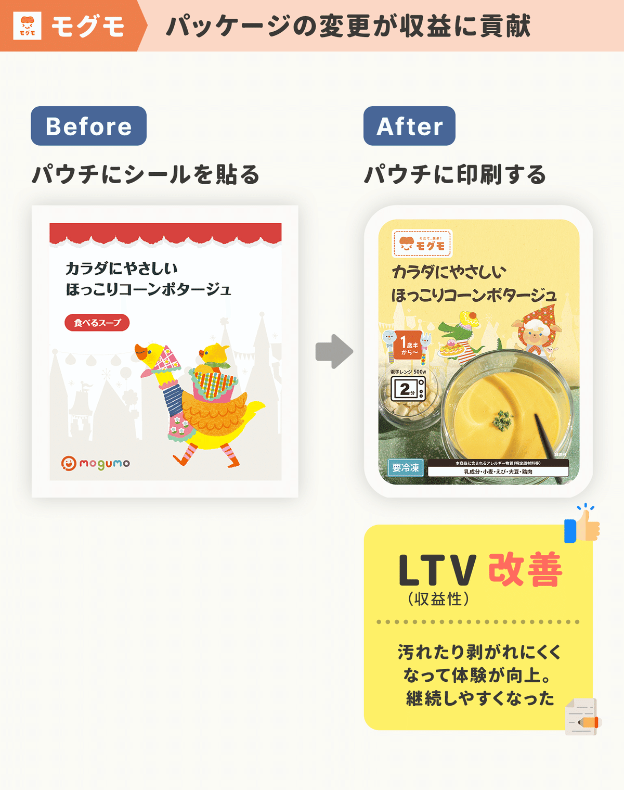

理由としては、商品自体は変わらなくても、**手に取って使っていただく中で「これはいいものだな」とお客様に感じてもらえる、体験価値が大幅に変わったからだと考えています。**

例えば、シールだと汚れやすかったり剥がれやすかったりして、商品自体は良くても、どうしても見た目や手触りでチープさを感じてしまう。

印刷方式に変えてから、より良いものだと感じていただけるようになって、写真を撮ってSNSに投稿してくださる方もグッと増えました。

## ⸺商品開発でこだわっているポイントを教えてください。

黒瀬：  
モグモのようなサービスは、子どもが食べてくれないと売れません。解約理由で一番多いのも「子どもが食べない」です。なので、そこにこだわりを持って商品を開発しています。

指標としては、**「リピート率が40％を超える商品を開発する」というのをKPIに置いていて。今ある商品も約9割がこの40％を超えています。**

その中でも**最もリピート率が高いのって実は「魚」なんですよ。**大人向けのお弁当や冷凍食品だと「魚が一番人気」ってあまりないと思います。

でも幼児向けの魚はニーズがある。食べる味付けや骨とりがされていて栄養面でも優秀。**なので親は食べさせたい。でも調理するには魚を捌いたりグリルを使うのが面倒。それを冷凍で解決できる点がウケているのかなと。**

リピート率40％を目指すために、商品開発の時点で「子どもの完食率が80％以上」という基準も設けています。社内で試食して「これはいけそう」というものを社員の子どもなどに食べてもらっています。

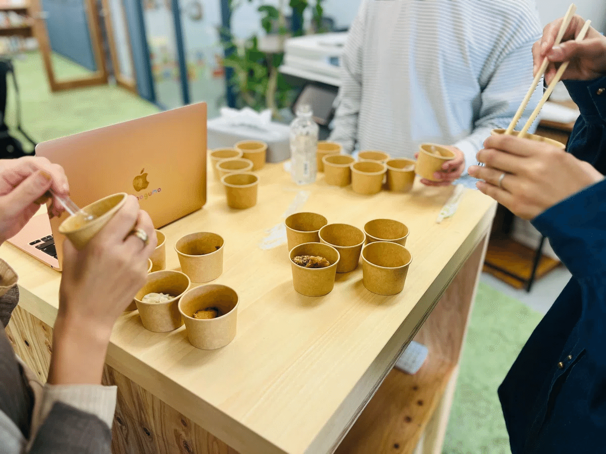

試食会の様子

また、モグモの特徴は**「能動的な体験」を提供していること。受動的になりがちな幼児食をテンションが上がるような体験に変えているんです。**

例えば、食べる前に「メニュー表」を見せて子どもに選んでもらう。レンジの「ボタン」を一緒に押してもらう。一緒に「盛り付け」をやってもらう。

このように能動的に体験してもらうことで、**食べなかった子どもが10人中10人食べるようになったケースもあるんですよ。**

これまでの幼児食ってかなり「受動的だった」と思っていて。忙しい毎日の中で親御さんが作ってくれたご飯を食べるだけになりがち。これを逆転させたら食べてくれるのではと考えました。

これは大人も同じ。キャンプで食べる焼きそばっておいしく感じませんか？ 僕もいつもの2倍食べてしまったりする。食事の周りにある「体験や環境」がそうさせている。子どもの食事も同じなんです。

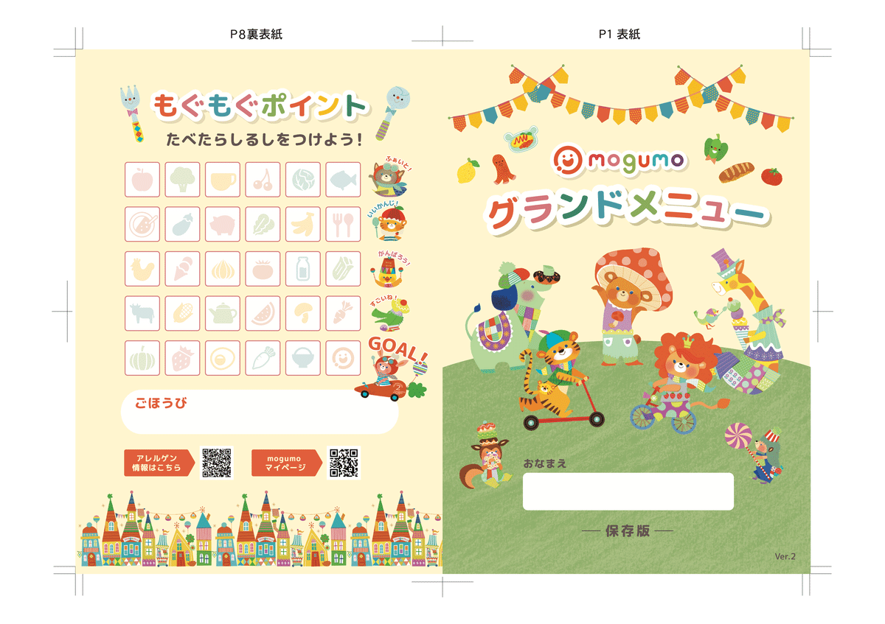

メニュー表を同梱するなど「幼児食を能動的な体験」に変えている。

## 成功施策①：LINEに登録している人は「LTVが1.5倍高い」

黒瀬：  
モグモのLINE公式アカウントに**「登録している人」と「登録していない人」を比べると、LTVに1.5倍〜2倍の差がある**ことがわかっています。

理由のひとつは、LINEが「ミニアプリ」のように機能するためです。これがマイページへのアクセスしやすさに繋がるのかなと。**Googleで「モグモ」と毎回検索するよりも、LINEから直接入るほうが圧倒的にラクですよね。**

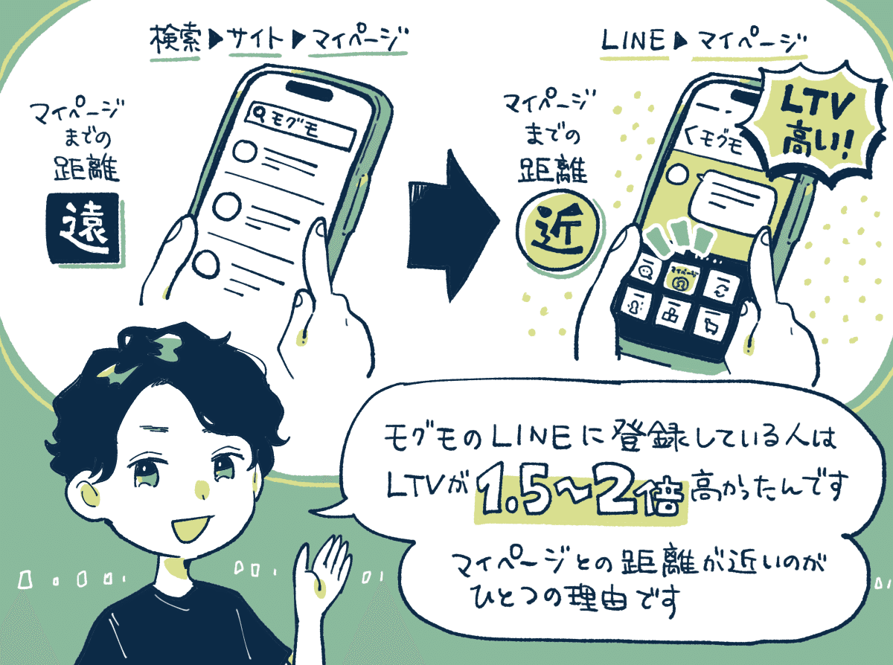

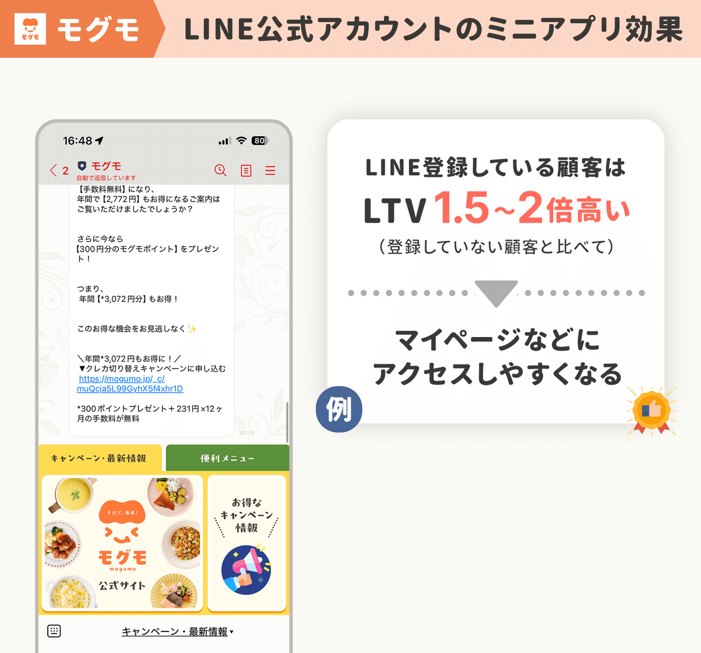

そのため、サンクスページでLINE登録を促進したり、LINE登録してない方には「LINE登録してね」という同梱物も入れるようにしています。

マイページの体験にもこだわっています。**マイページ内の「順番・表記・デザイン」などをリニューアルしたところ継続率が向上しました。**

ポイントは、お客様が迷わないようにしつつ「したい」と思っていることをすぐ出来るようにしたこと。文字を見やすくしたり、ボタンにテキストをつけて押したら何が起こるかわかるようにしました。

お客様のステータスによって（継続中の人、お休み中の人など）LINEのリッチメニューを変えるような工夫もしています。

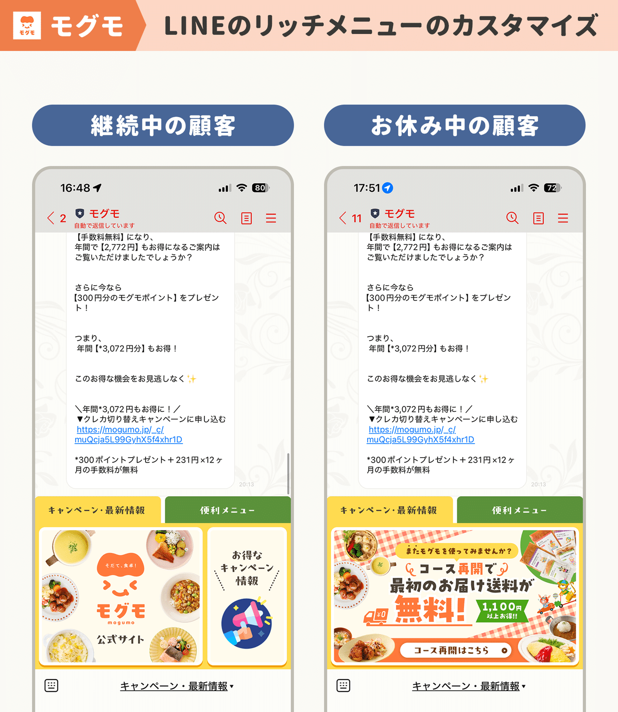

## 成功施策②：初回セットを変えたらLTVが向上。

**初回セットの内容を「6食 1,980円」→「8食 2,980円」に変更してから継続率が上がってLTVも大幅に向上**しました。

理由は、「真剣度の高いお客様」が増えたためだという印象を持っています。短期でやめてしまう方が大幅に減ったのが大きいですね。

---

【取材協力】  
株式会社Oxxx：<https://oxxx.co.jp/>   
モグモ：<https://mogumo.jp/>

【告知】Oxxxさんでは各職種にて採用中。広告運用担当やマーケターなどをとくに探しているそう。ご興味あれば下記のサイトよりどうぞ。

[**株式会社Oxxxの募集・採用・募集条件 - Wantedly**
*株式会社Oxxxの新卒・中途・インターンの募集が73件あります。気軽に面談して話を聞いてみよう。職種や採用形態からあなたに*
*www.wantedly.com*](https://www.wantedly.com/companies/oxxx/projects)

> ※ 以降は、＋αの【5つの事例】を購読会員向けにまとめています。  
> 【① 長く続けている**ユーザーの共通点は？**】  
> 【② 商品の並べ方で**継続率がアップした話**】  
> 【③ **解約率の緩和**につながった工夫】  
> 【④ 口コミから**「新しい市場」を発掘した方法**】  
> 【⑤ 新規ユーザーの**獲得効果を高めた**工夫】  
> など、ご興味あればご覧ください。

  

ダウンロード

 

copy

## ここから先は

1,414字
/
5画像

%22%20d%3D%22M-100-100h300v300h-300z%22%2F%3E%3C%2Fsvg%3E)

アプリやプロダクトの成功事例が学べるマガジンです。プロダクトの売上やユーザー数を伸ばしたい人にオススメです。成長プロダクトのインタビュー、効果のあったマーケティング施策、事例やデータなどが中心（月に7記事ほど）多くの過去記事も5年ほど遡って読めます。クレカ決済だと初月無料なのでお試しでもぜひ。

### [月刊アプリマーケティング](/m/mc375c9b46464)

¥2,000 / 月  
初月無料

プロダクト運営について学べるマガジンです。アプリやプロダクトの売上やユーザー数を伸ばしたい人にオススメです。月に7記事ほどお届けします。

購読手続きへ

%22%20d%3D%22M-100-100h300v300h-300z%22%2F%3E%3C%2Fsvg%3E)

1人が高評価

[ログイン](https://note.com/cd/login?redirect_to=https%3A%2F%2Fmarkelabo.com%2Fn%2Fn15a400f6aec3)

   

* [#マーケティング](https://note.com/hashtag/%E3%83%9E%E3%83%BC%E3%82%B1%E3%83%86%E3%82%A3%E3%83%B3%E3%82%B0)

31

[%22%20d%3D%22M-100-100h300v300h-300z%22%2F%3E%3C%2Fsvg%3E)](/)

[アプリマーケティング研究所](/)

フォロー

プロダクトの成功事例を発信しているメディアです。2013年から約10年運営しています。取材相談はツイッターDM（@appmarkelabo）かメールにてどうぞ！info@appmarketinglabo.net