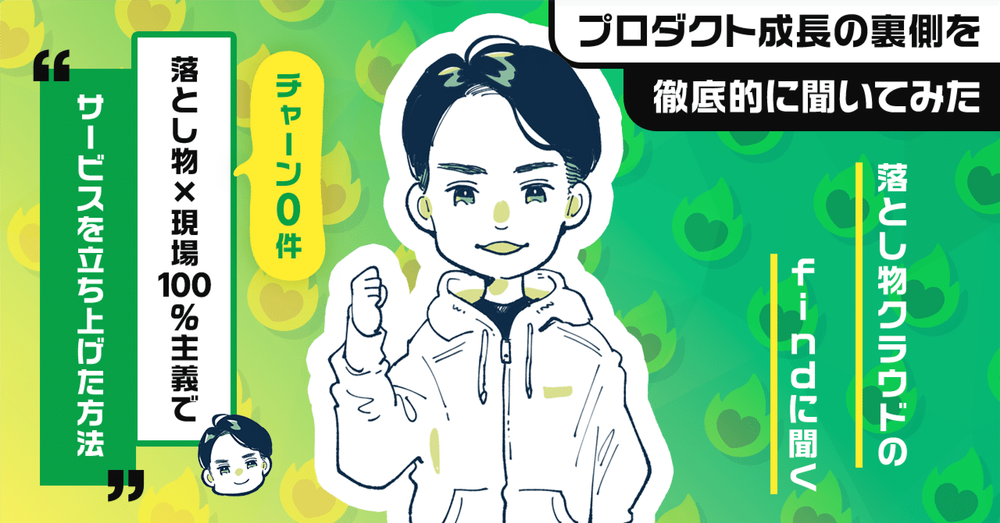  

# 広告費ほぼ0円、チャーン0件、売上は5億円規模に成長。「落とし物クラウドfind」が語る「現場100％主義」のサービス改善と拡張しすぎないことが成長につながった話。

44

[%22%20d%3D%22M-100-100h300v300h-300z%22%2F%3E%3C%2Fsvg%3E)](/)

[アプリマーケティング研究所](/)

2025年10月28日 11:30

¥2,000/月

findさんを取材しました。

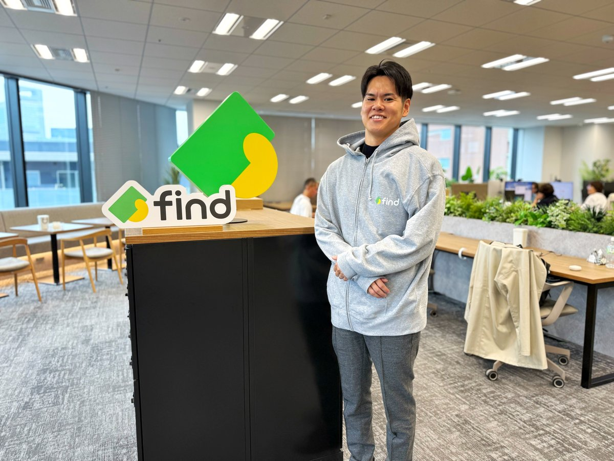

株式会社find 取締役 COO 和田 龍さん。

## ⸺「find」について教えてください。

和田：  
僕たちは「落とし物が必ず見つかる世界」を実現するために、落とし物の課題を解決する「落とし物クラウドfind」（以下、find）を提供しています。

2023年のサービス開始から、**約3,000施設で導入されていて、ARRは約5億円に到達しています。（内示込みの売上は15億円規模。）**

開始からまだ数年しか経っていないこともありますが、正式リリースからの解約数（チャーン）はありがたいことにまだ0件です。

findを導入した企業・施設では、**落とし物の返却率が従来比で約3倍になり、業務負担が8割軽減するというデータも出ています。**

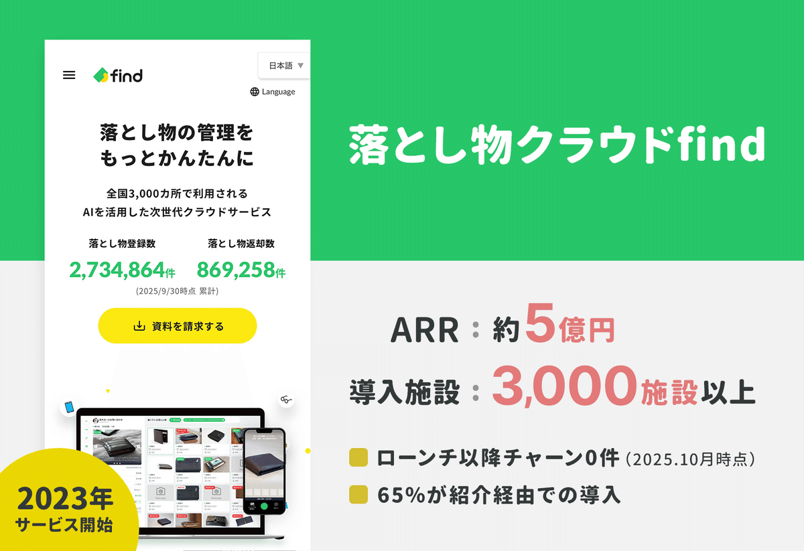

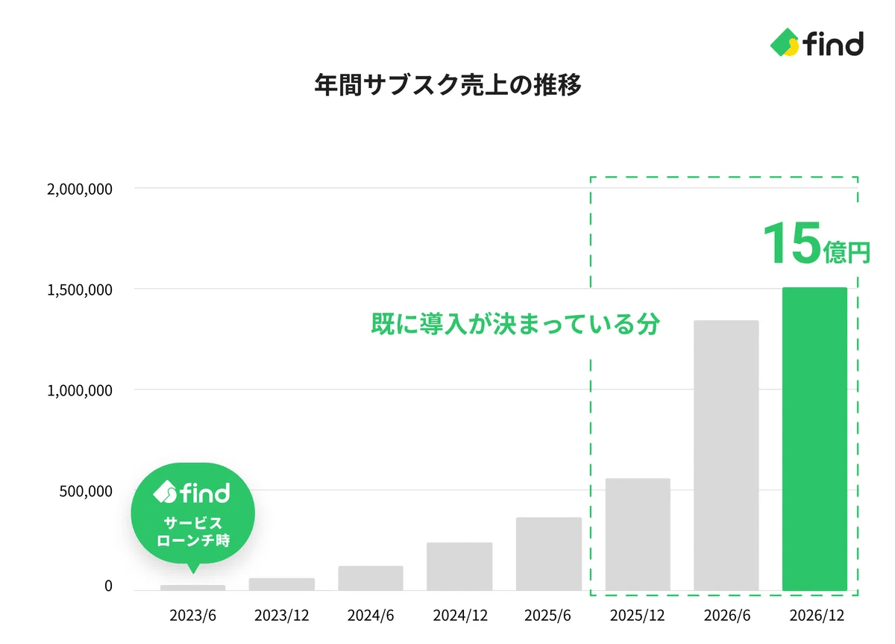

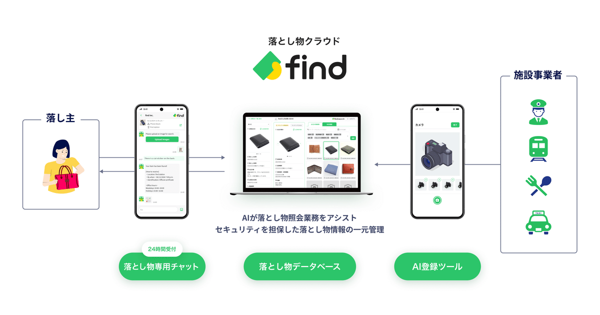

## ⸺もともとは、どのようにして「find」が生まれたのでしょうか？

和田：  
もともとは、落とし物の課題を解決するために、2021年末に2人で500万円ずつを出し合って、友人だった高島と共同創業したのがはじまりです。

テーマとして「落とし物」に着目したのは、高島が飲み会の日に「どこか」にカバンやスマホの落とし物をしてしまったのがキッカケでした。

最終的には、**警察から連絡が来て見つかったものの、駅やお店など施設への問い合わせや手続きがめちゃくちゃ大変で「泣きそうになった」**と。

でもちょっと待てよ。それって「課題がある」ってことだ。この課題を解決するサービスは現状ない。事業になるのでは？と考えたんですね。

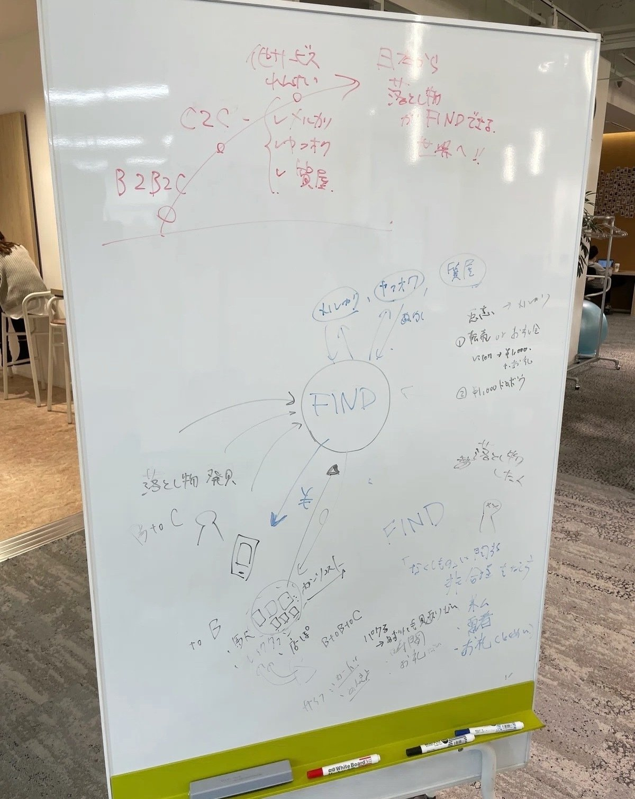

初期に「事業アイディア」をディスカッションした時のボード。

ただ、わかったのは「落とし物」に課題があることだけ。どうしたら「誰かの価値になるか？」がわからず、8ヶ月間はトライ&エラーの連続でした。

訪日外国人に向けて**「もし日本で落とし物をしたら、代わりに探しますよ」というチラシを1日かけて配ってみたけれど利用者はゼロ。**

**落とし主と拾い主をつなぐ「CtoCの落とし物マッチングアプリ」も企画したのですがユーザーの反応が悪くて。途中で開発を中止しました。**

デモを知人に使ってもらうと、**拾い主側としては「落とし物を拾ったとしても、知らない人の持ち物を保管しておくのは気持ち悪い」といった「アプリを使わない理由」ばかり挙がってきた**んですよ。笑

そんな感じで、はじめは失敗続きでした。落とし物の領域には「課題が満載だ」という確信があった。でも、誰にどんな解決策を提供したら事業になるのかがわからず迷走していたんです。

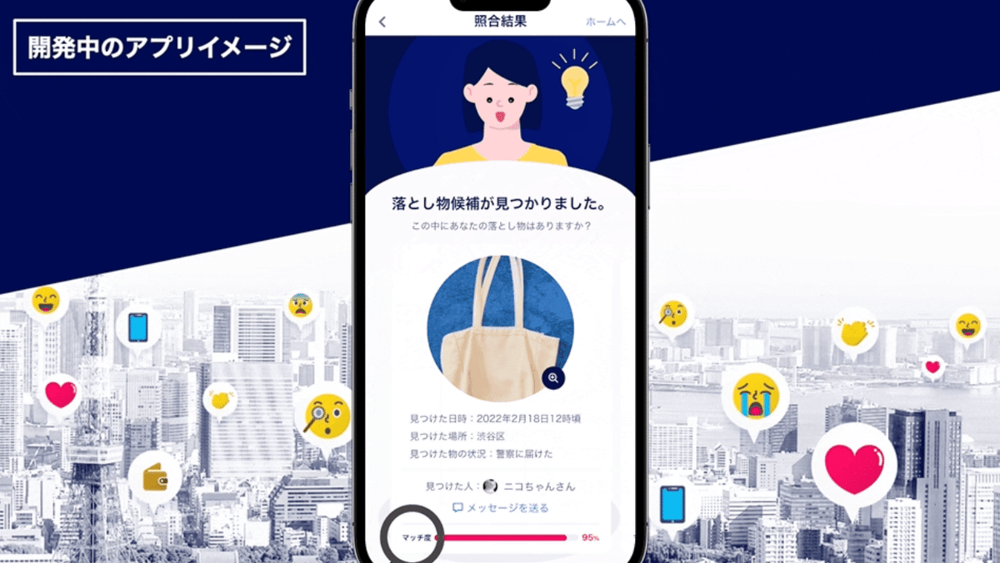

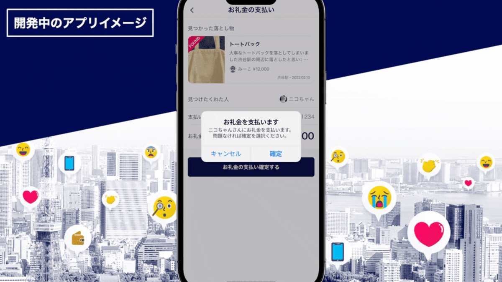

初期にボツになった、CtoCの落とし物マッチングアプリ。

## 京王電鉄との出会いから「駅の落とし物」の課題を発見した。

## ⸺そこから今の「find」が生まれるまでに、何が転換点になったのでしょうか？

和田：  
転機になったのは、鉄道会社の方にお話を聞きにいったことでした。

落とし物を拾った人が「どこに届けるか」を調べると、交番よりも鉄道会社に届ける人が多かったんですよ。生活圏内にあって毎日訪れる場所だから。

そこで**「落とし物が集まる場所」と「落とし主」をつなげたら課題解決になるのではという発想で、鉄道会社にお話を聞きに行ったんですね。**

3社に提案しにいくと、2社には断られてしまいましたが、京王電鉄さんだけはfindのビジョンに共感してくれました。**さらに「現場を見に来ませんか？」と言ってくれて、数日間働かせてもらえることになりました。**

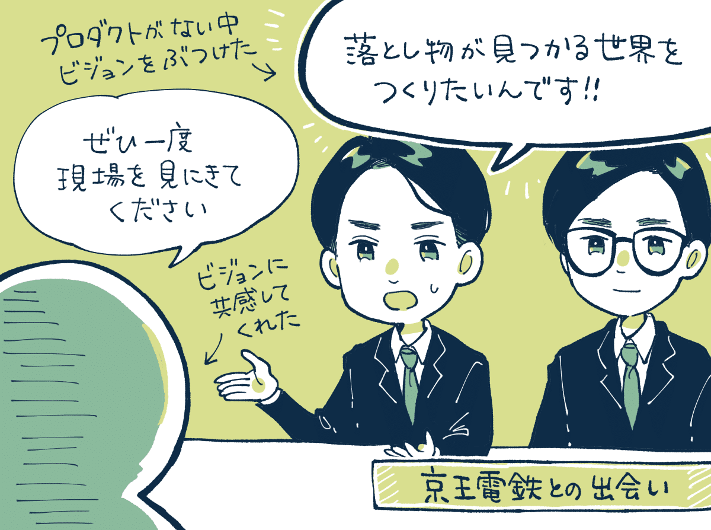

実際に「お忘れ物取扱所」で働いてみると、めちゃくちゃ課題がありました。そして、想像以上に「お客様の立場」に立って落とし物が丁寧に管理されていることも学びました。

例えば、1日に数百個落とし物が届く。それをスピーディに仕分けする。各駅にデータを手入力する。お客様からの問い合わせに電話で対応する。これらを現場のスタッフさんが丁寧に行われていました。

**ここで、駅のバックヤードにおける遺失物管理ってめちゃくちゃ大変なんだ。そしてこれは今の技術で解決できる。そう実感しました。**

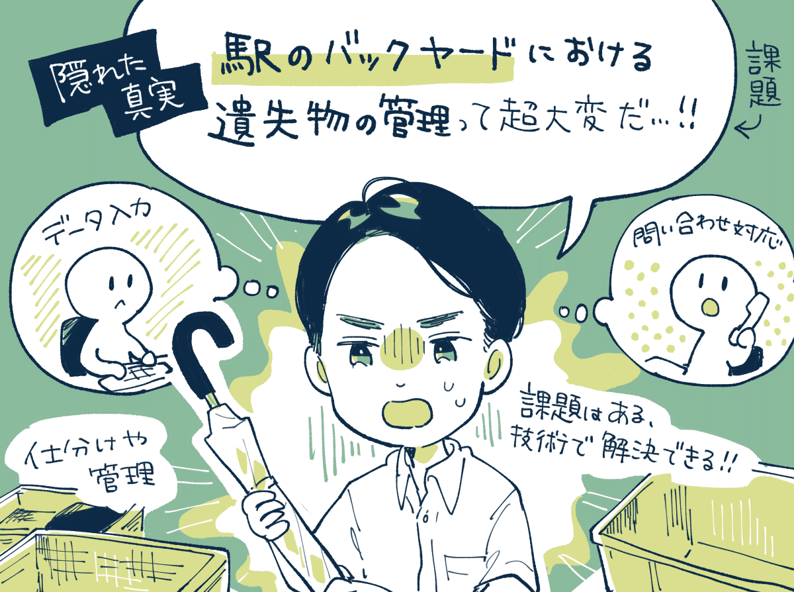

その学びをもとに「落とし主がLINEで問い合わせできる」「駅員は落とし物を画像で登録して検索して探せる」といったfindの原型企画を提案すると、**京王電鉄さんから「ぜひ実証実験をしてみたい」と言ってもらえました。**

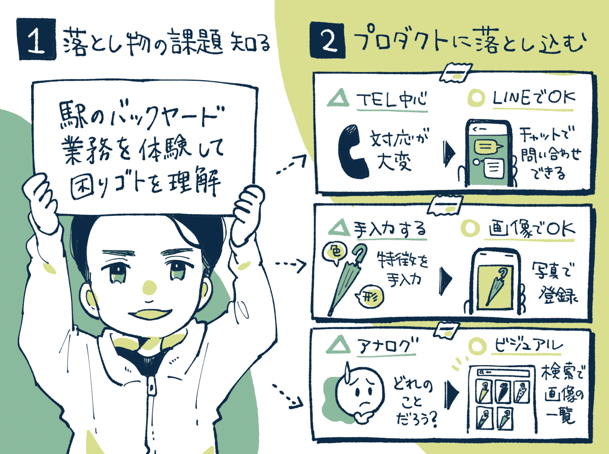

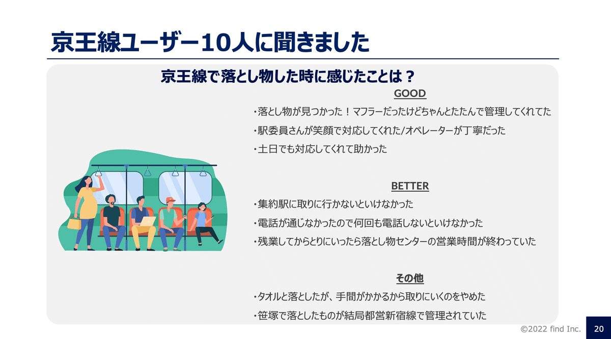

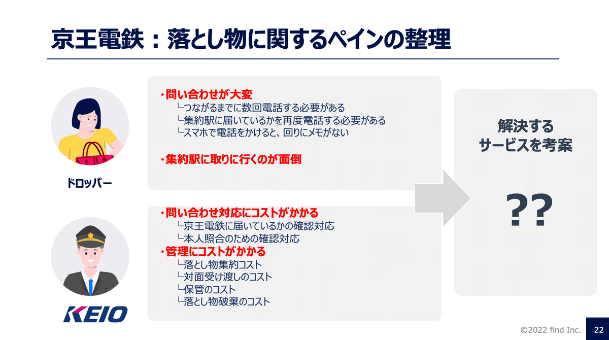

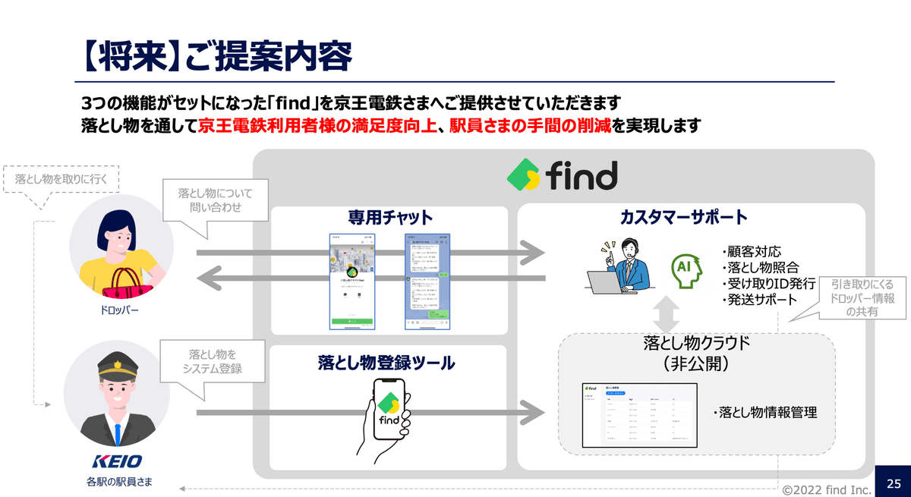

当時、京王電鉄に向けて提案した時のスライド。

## 鉄道会社との実証実験で検証したこと。

## ⸺実証実験では「どんな指標」を検証していきましたか？

和田：  
実証実験では、**京王電鉄さんは「お客さんに価値を届けたい」という想いが強い会社だったので「遺失物の返却率が上がるか？」を検証しました。**

ほかには「現場の負担が軽減できるか？」も検証しました。**電話のお問い合わせが減って、チャットに流れたほうが負担が減りますよね。**

そこから、JR九州さんも加わってくれて、2社で実証実験を進めました。プロダクトを開発しながら、現場での検証を進めた形です。

結果としては、**返却率は約3倍になって、電話の問い合わせの件数が大幅に減るという成果が出たんです。これを受けて正式導入も決まりました。**

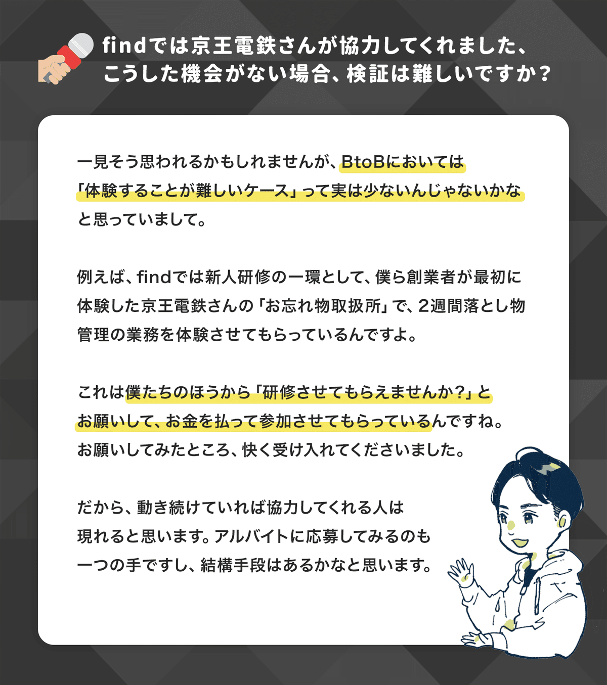

## ⸺初期フェーズにおいて「これをやったから後の成長につながった」と感じることはなんですか？

和田：  
京王電鉄さんとJR九州さんが「最初の2社」のお客さんだったのですが、そこから半年（2023年の間）はその2社以外は受け入れなかったことです。

お問い合わせは来ていたので、お客さんを増やすこともできたのですが、まずは「目の前の2社」に全力で集中しました。僕も博多に行ってJR九州さんに張り付いて、現場の声を拾い続けました。

**すると、結果的にすごく満足度の高いものが出来て、その2社が色々な会社さんを紹介してくれたんですよ。**それって満足したから広がっている。サービスとして合格点をもらえているんだと。

そして、この**「お客さんがほかのお客さんを紹介してくれる状態」を僕らはPMF達成のサインだと判断しました。**なので「拡張しすぎないことを頑張る」というのは、とても大事なことだったと感じています。

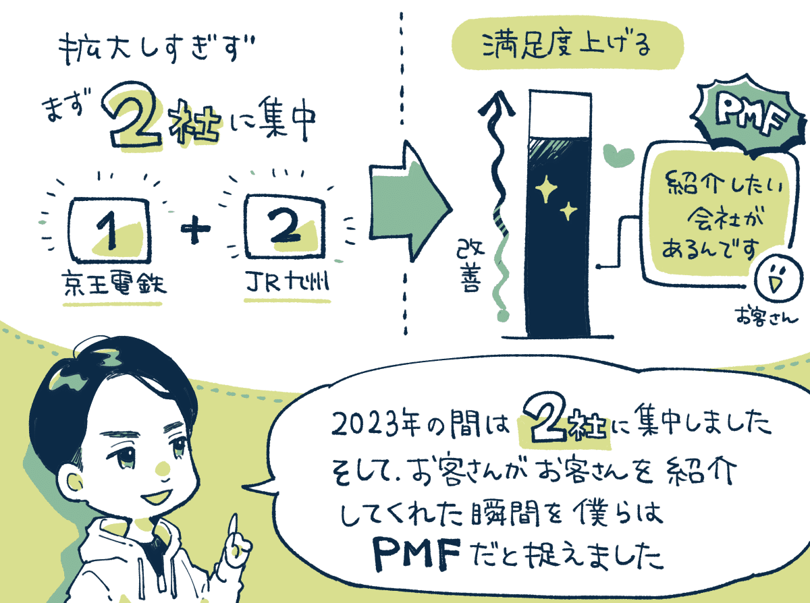

満足度の高いプロダクトが作れてきたので、2024年からは他の会社にも広げていったところ、どんどん導入数が増えていきました。

鉄道会社以外にも「落とし物」の課題はあって、警察署、タクシー、バス、空港、百貨店、大学など、様々な業界にfindが広がりました。

## ⸺どのような集客経路から、導入が決まることが多いですか？

和田：  
現在までありがたいことに、**findの効果を実感した企業が「他社を紹介してくれる」という口コミで広がっています。**今までかけたマーケティング費用はほぼ0円です。

導入経路としては、導入企業や株主の方からの紹介が65％、各種メディアからのお問い合わせが30％となっています。

とくに**鉄道業界って業界内の仲が良いようで、良いサービスを業界で積極的に共有してくれました。**

メディア経由での導入も多く、2025年1〜5月だけで推定受注額は数億円を超えます。商談からのリードタイムも長いため実際はそれ以上だと思います。

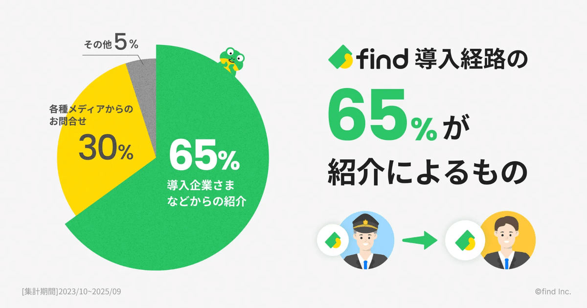

あとは、findの多くの導入施設で、**落とし物が探せる「find chat」というチャットを、積極的に紹介してくれているのも大きいです。**

例えば、駅のサイネージ、電車の中吊り広告、タクシー車内のステッカーなどです。施設にとっても**チャットでの問い合わせが増えたほうが「業務効率化につながる」といったメリットがあります。**

企業の役員の方などが実際に落とし物をされた際、findを使って「これは便利だ！」と感じて導入のお問い合わせをいただけることも多いです。

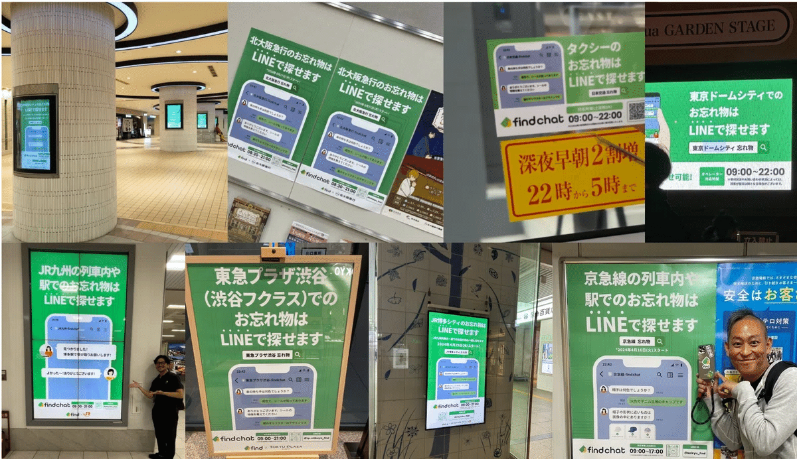

## ⸺紹介を広げるために「意識していること」などがあれば知りたいです。

和田：  
紹介で広がったのはお客さんが満足してくれたからですが、**前提として僕らは「満足のいくサービスとは何か？」を定義しています。**

まず「満足」って何かと考えた時に、本当は「なにも説明せずに」システムを渡したら使ってもらえるのが理想です。ただ、現実ってそうはならない。現場には様々な方がいらっしゃって様々な事情があるから。

なので、**良いものであることは前提に、それを「現場で使っていただく」というところまでをfindのサービスだと捉えています。**

だからこそ、僕らは現場に足を運んで、レクチャーをさせていただき現場で使ってもらうことに尽力します。オンボーディングにも3～4ヶ月かけます。すると、お客様との信頼関係が生まれて紹介をしてもらえます。

カスタマーサクセスの指標にも「紹介数」を置いています。**お客様の究極の満足って「他社にも紹介したい」と思ってもらえることですよね。**

直接的に「紹介してください！」とは言わないですが、**自然と紹介してもらえるぐらい強力なパートナーシップを築こうという意図を込めています。**

この「紹介数」は指標にして良かったですね。優秀なカスタマーサクセスは実際に紹介数も多いです。

## 業界の「トップ企業」への導入にこだわる理由。

## ⸺拡大戦略で「これは成功した」というポイントがあれば教えてください。

和田：  
ターゲットの業界を絞りに絞って、**業界の「トップ企業に導入していただく」ということを徹底したのが非常によかったと思います。**

僕らは、最も落とし物が集まる「鉄道・空港・タクシー・バス」という4つの交通事業者を「オセロの4角」として戦略の中心に置いていました。

findって導入施設が増えるほど、**落とし物のデータベースが蓄積されて、落とし物をしたら「findを見れば見つかる」という世界に近づく。**そう考えるとfindの独自価値って、技術よりも「ネットワーク効果」に宿るはずなんですよ。

また、オセロの4角を狙うには「業界のトップ企業」に導入いただくことが大切になります。

**なぜなら、大企業では「他社がやっていないからやろう」というよりも、「あそこがやってるならやろう」と意思決定をする傾向が強いためです。**

大企業は「業界1位」に従って動くことが多いです。業界トップに導入してもらえると信頼されて、より多くの企業に興味を持っていただけます。

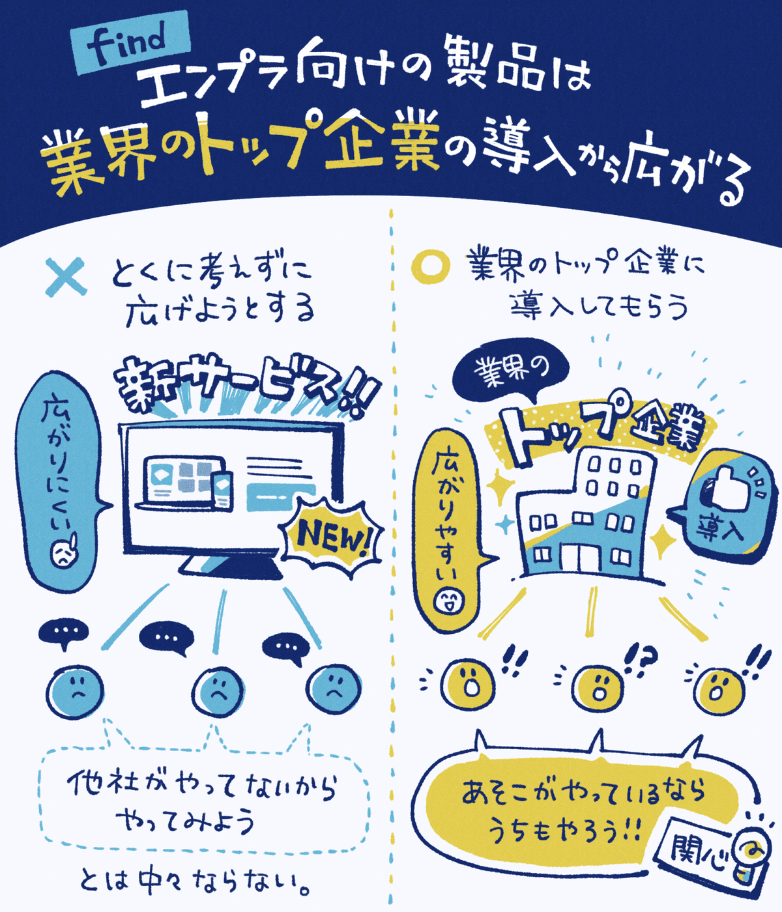

## 成功施策①：コアなアクションの「前後のシーン」からヒントを見つける。

和田：  
落とし物が探せる**「find chat」に登録してもらう工夫としては、施設のホームページにリンクを置いてもらったこと**でした。

まず自分が落とし物をしたときに「**まず何をするだろうか？」と考えると、ホームページで電話番号を調べるはずだ**と考えました。

実際に「落とし主の行動」を分析すると、**約80％の人が施設のホームページにアクセスして電話番号を調べていたんです。**例えば、京王線で落とし物をした人は「京王電鉄　落とし物」と検索してホームページを調べますよね。

そこに着目して、**施設のホームページに「find chat」への導線を設置してもらったところ、効果的な問い合わせの経路になりました。**

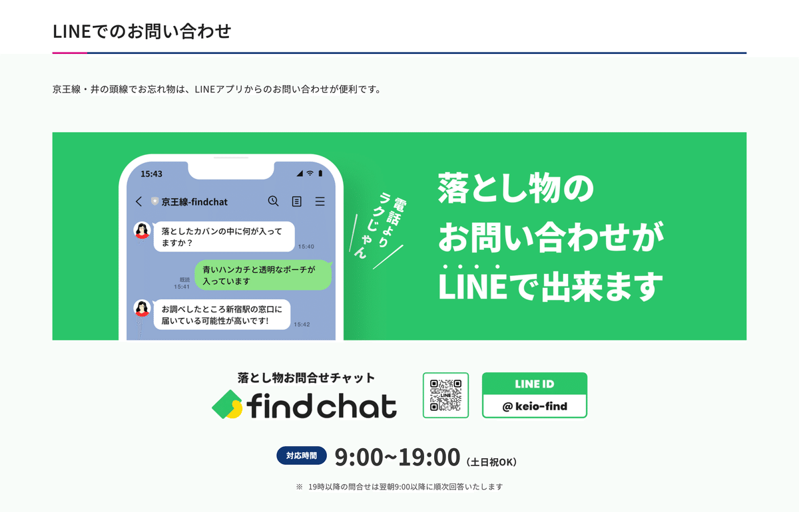

京王電鉄のホームページから引用

この仕掛けによって、**京王電鉄さんで導入された時は、findの存在を関係者以外は誰も知らなかったのですが、導入初日から「find chat」に問い合わせが200件も来たんですよ。**これは大成功でした。

## 成功施策②：周りの人から「何度も聞かれたこと」をnoteやSNSで発信する。

和田：  
findの創業ストーリーなどを、noteに「1つの記事」としてまとめたのも効果が高かったです。最初に僕が書いた記事は1,900いいねが付きました。

**スタートアップって「創業者のストーリー」が求められますよね。それをありのままに書いてみたら話題になったんですよ。**「創業ストーリーが面白くてファンになりました」というコメントも多くて嬉しかったです。

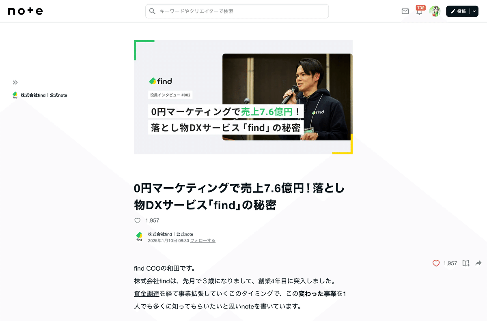

1,900いいねついた[noteの投稿](https://note.com/find_info/n/n476ca2ef629f)。

ポイントとしては**「友達や仕事仲間からよく質問されること」を書くことを意識しました。なぜなら、それって「みんなが気になってること」の裏返しじゃないですか。**読者の関心が高いことを書くほうがいいですよね。

例えば、「なぜ落とし物で起業したのか？」「どうプロダクトが生まれたか？」「なぜ1社目が大企業だったのか？」という質問って何度も聞かれたんです。複数の人から何度も聞かれることは関心のシグナルだと思います。

それと、**売上や失敗などの「ちょっと出したくない話」もオープンにする。これをやると自慢っぽくならずに「ありのまま」な記事になると思います。**

僕らの会社には「オープンでいこう」という文化があり、メディアの取材等でもセンシティブなもの以外はなるべく回答するようにもしています。

創業ストーリーを発信することは、事業の内容が「ストーリー」として人に伝わりやすくなる効果があります。記事のURLを共有すれば良いので、メディアとのコミュニケーションも楽になりました。

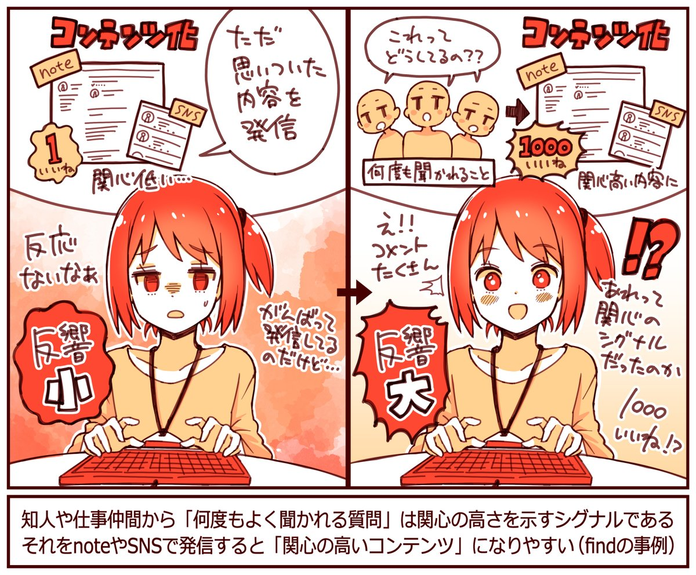

---

【取材協力】  
株式会社find（ファインド）：<https://www.finds.co.jp/>   
落とし物クラウドfind：<https://service.finds.co.jp/>

【告知】findさんでは各職種にて採用・カジュアル面談を実施中。ご興味あれば下記のサイトよりどうぞ。

[**採用情報｜株式会社find**
*株式会社findの採用情報を紹介しております。ご応募お待ちしております。*
*www.finds.co.jp*](https://www.finds.co.jp/recruit)

> ※ 以降は、＋αの【6つの事例】を購読会員向けにまとめています。  
> 【① **現場主義を浸透させていく**ための取り組み】  
> 【② **紹介などが生まれた**コミュニケーション施策】  
> 【③ 価格設計や**ビジネスモデルの成功ポイント**】  
> 【④ 落とし物との**マッチング率を高めた工夫**】  
> 【⑤ 効果の高かった**情報発信の取り組み**】  
> など、ご興味あればご覧ください。

  

ダウンロード

 

copy

## ここから先は

2,031字
/
5画像

%22%20d%3D%22M-100-100h300v300h-300z%22%2F%3E%3C%2Fsvg%3E)

アプリやプロダクトの成功事例が学べるマガジンです。プロダクトの売上やユーザー数を伸ばしたい人にオススメです。成長プロダクトのインタビュー、効果のあったマーケティング施策、事例やデータなどが中心（月に7記事ほど）多くの過去記事も5年ほど遡って読めます。クレカ決済だと初月無料なのでお試しでもぜひ。

### [月刊アプリマーケティング](/m/mc375c9b46464)

¥2,000 / 月  
初月無料

プロダクト運営について学べるマガジンです。アプリやプロダクトの売上やユーザー数を伸ばしたい人にオススメです。月に7記事ほどお届けします。

購読手続きへ

%22%20d%3D%22M-100-100h300v300h-300z%22%2F%3E%3C%2Fsvg%3E)

1人が高評価

[ログイン](https://note.com/cd/login?redirect_to=https%3A%2F%2Fmarkelabo.com%2Fn%2Fn677822fa18f0)

   

44

[%22%20d%3D%22M-100-100h300v300h-300z%22%2F%3E%3C%2Fsvg%3E)](/)

[アプリマーケティング研究所](/)

フォロー

プロダクトの成功事例を発信しているメディアです。2013年から約10年運営しています。取材相談はツイッターDM（@appmarkelabo）かメールにてどうぞ！info@appmarketinglabo.net