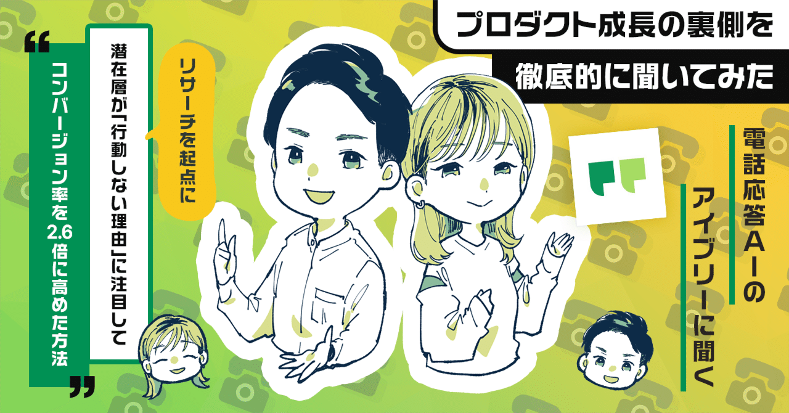
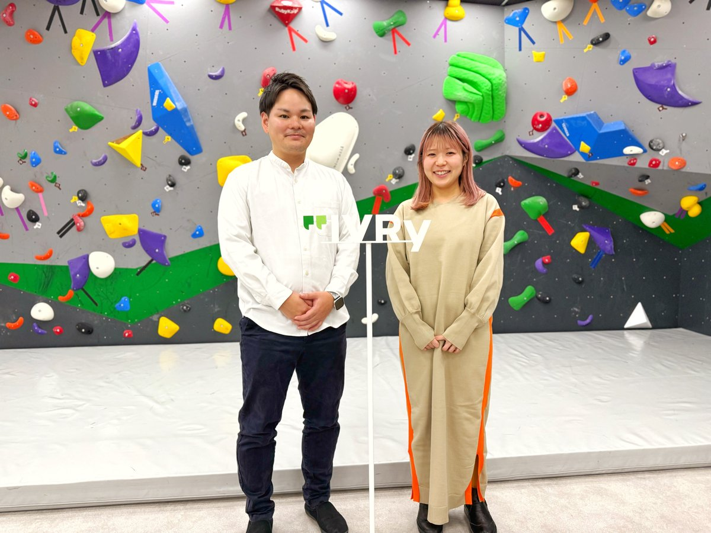
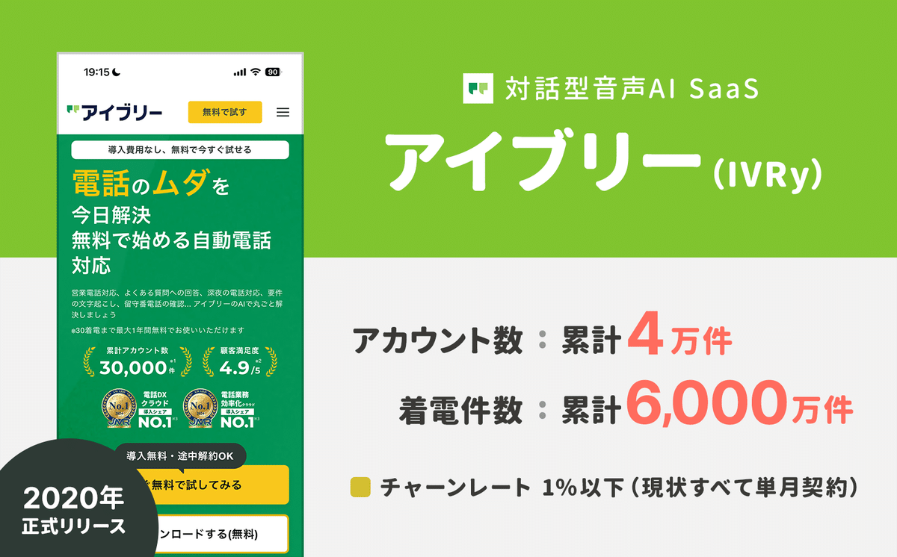
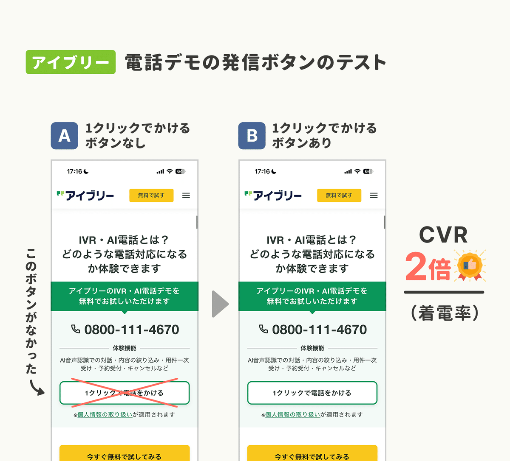
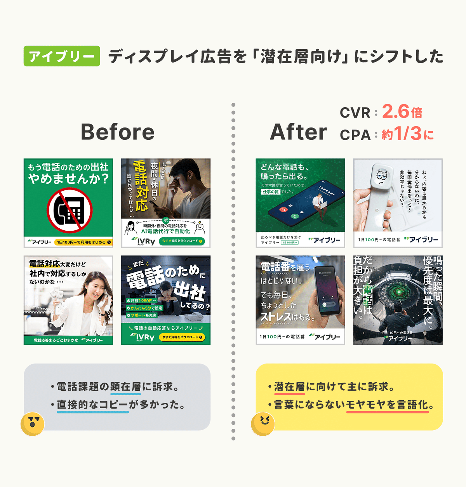
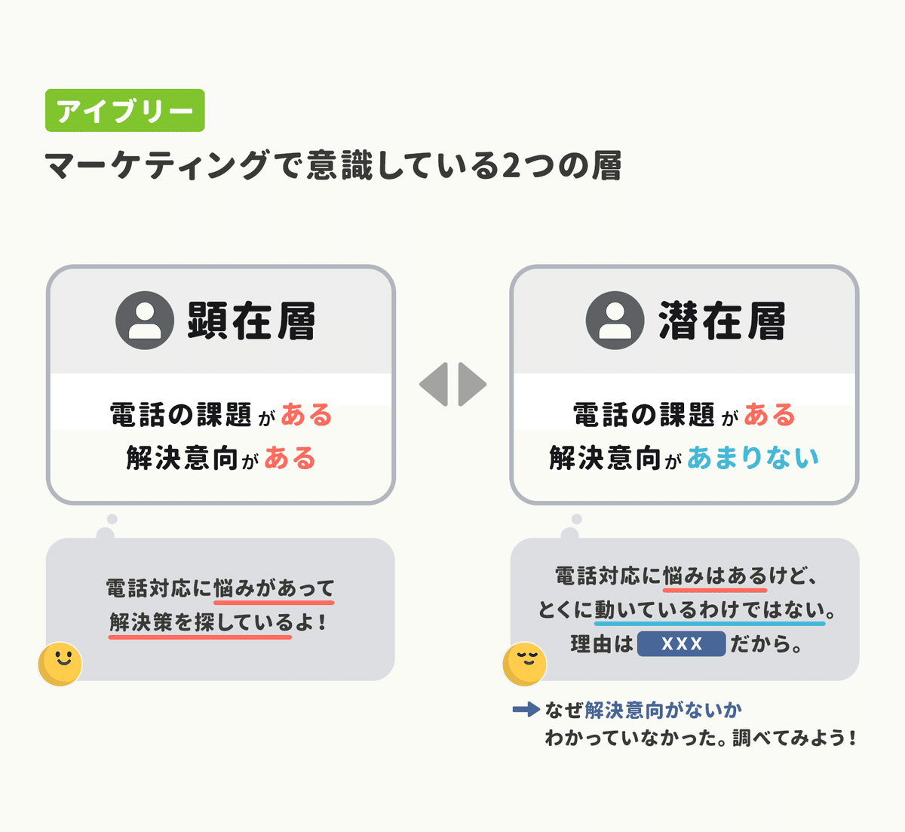
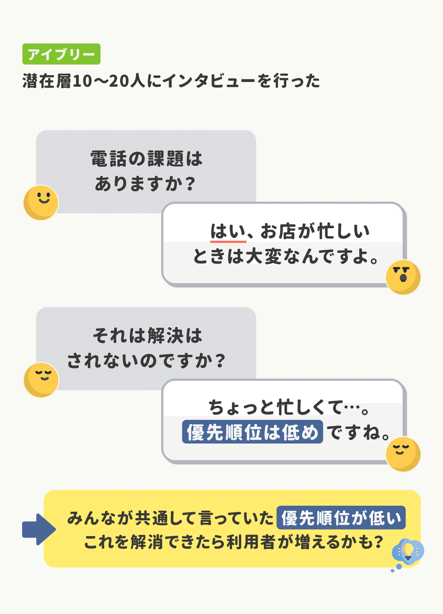
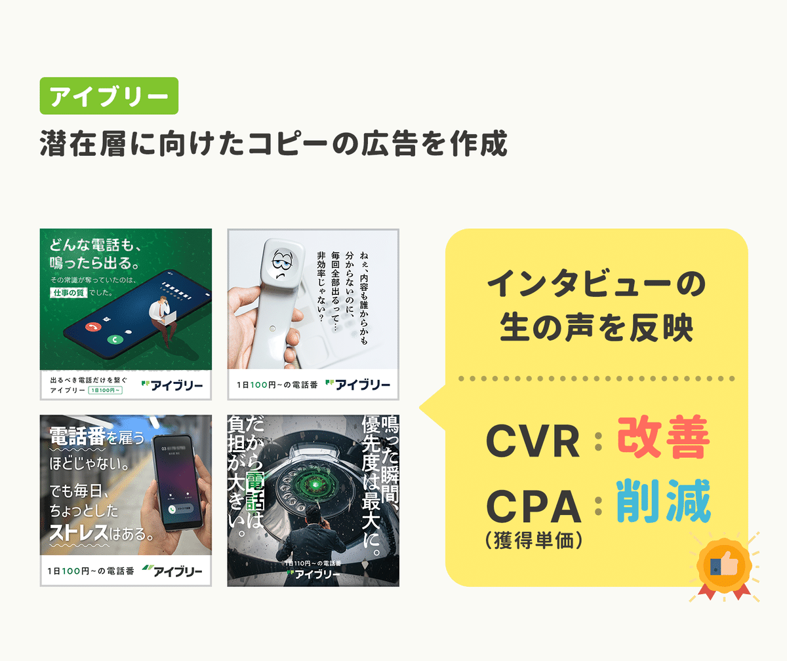
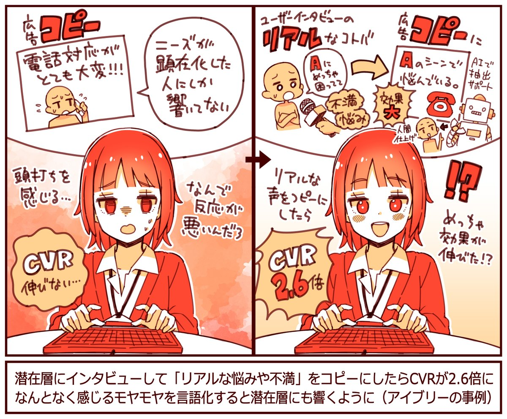

  

# 潜在層の「行動しない理由」をリサーチでひも解いたらCVRが2.6倍に。LPからヘッダーを削除したらCVRが1.3倍に。電話応答AIの「アイブリー」に聞く3つのグロース施策。

36

[%22%20d%3D%22M-100-100h300v300h-300z%22%2F%3E%3C%2Fsvg%3E)](/)

[アプリマーケティング研究所](/)

2025年11月20日 11:30

¥2,000/月

IVRyさんを取材しました。累計アカウントは4万件以上。着電数は累計6,000万件を超えている。

株式会社IVRy マーケティングマネージャー 今坂 良平さん、クリエイティブディレクター 鐘ケ江 あいびさん

電話対応をAIで自動化できるサービス。

## LPからヘッダーのメニューを削除したらCVRが1.3倍に。

### ——アイブリーでは様々な「マーケティング施策」が行なわれていますが、おもしろい結果になった事例があれば教えてください。

今坂：  
興味深い結果になったのは、**広告からの飛び先である「広告LP」のヘッダーメニューを削除したら、資料請求率（CVR）が1.3倍に上昇**したことです。

これ、なぜだと思いますか…？ 僕らの解釈としては、**LPに訪れるユーザーの「ニーズの高さや関心度」によって、最適なUIやデザインは変化する**ということだと考えていて。

例えば、「指名検索」から訪れる人のLPにはヘッダーを表示すべきです。なぜなら、**会社やサービスのことを「もっと知りたい」と考えているから。**回遊しやすいサイト設計のほうが効果が高いはず。

一方、「広告」から訪れる人のLPではヘッダーは非表示のほうが良かった。なぜなら、**ニーズが明確で「次の行動」に進む準備が整っている傾向が強いため**、真っ直ぐに資料請求に向かってもらう設計のほうが良いのかなと。

ヒートマップで分析すると「細かい導入事例」などを読むうちに、そのまま離脱してしまう人も多かったという。

### ——なるほど。「ヘッダーのメニュー」だけでも違いがでるんですね。

今坂：  
はい。当初は「ヘッダーを消して大丈夫かな?」という懸念もありましたが、やってみると資料請求や商談数が純増する、とても良い施策になりました。

ちなみに、スマホの広告用LPでは、ヘッダーがあってもなくても変わりませんでした。あまりヘッダーに意識が向かないのだと思います。

アイブリーの場合、顕在層ほど「PCからのコンバージョン数」が多くなる傾向にありますね。PCが60％：スマホ40％ぐらいという感じです。

### ——お店でいうなら「買うもの」が既に決まっているなら、もうレジで商品を用意しておくほうが「お客様も嬉しい」みたいな？

今坂：  
それに近いかもしれません。お店で例えるなら「買う物が決まっている人」には回り道せずにレジにご案内したほうが体験も良いですよね。

実際にアイブリーのサイトでも、**データを分析すると「導入事例」などをたくさん読んでそのまま離脱してしまう人がたくさんいました。**

もしかしたら、別の用事があったのかもしれないですし「また後で見よう」と思ってそのまま離脱してしまったのかもしれません。

それだと、僕らが目的とする「業務課題の改善」にはつながりません。お問い合わせや商談につながるほうが顧客体験を良くできると考えています。

## 「電話をかけられるボタン」でCVRが2倍。

### ——ほかにも「印象的だった施策」があればお聞きしたいです。

今坂：  
アイブリーのサイトには「AI電話応答のデモ」が体験できる電話番号を載せているのですが、**「番号をどのように表示するのか？」によってデモの体験数が結構変わるんですよね。**

例えば、**スマホサイトに1クリックで「電話をかけられるボタン」をつけたところ、デモの体験率（CVR）が2倍以上になりました。**

やっぱり、番号を載せるだけだと「自分で打ち込まないといけないのか」と思われてしまったり、ハードルが上がってしまうのかなと。

番号自体をタップしても発信できるので「番号を押してくれるだろう」とも思っていたのですが、あまり押してもらえませんでしたね…。笑

つまり、大事なアクションは「わかりやすいほどにわかりやすくする」というのが、とても大切だったのかなと思っています。

## 潜在層にフォーカスした広告でCVRが2.6倍に。

### ——プロモーションで「成果の出た施策」について教えてください。

鐘ケ江：  
ディスプレイ広告を**「潜在層向けの訴求内容」に変更したところ、コンバージョン率（CVR）を2.6倍に引き上げることができました。**CPA（獲得単価）も約1/3に削減できています。

これまでのアイブリーって、課題や解決意向がハッキリしている「顕在層向けのマーケティング」で主に成長してきました。ただそれ一本だと頭打ち感も若干感じていたんですね。

今坂：  
でも、市場としてはものすごく大きくて、市場の1％も獲得できていない。そこで**「どうしたら潜在層にアプローチできるか？何か視点を変えられないだろうか？」と考えました。**

それで、ディスプレイ系の広告なら「潜在層向け」の方々にもアプローチしやすい。訴求を広げて潜在層にアプローチしようと。

### ——どんなところを変えたんでしょうか？

鐘ケ江：  
大きく変えたのは、以前は「顕在層」向けに広告をつくっていたのですが、これを「潜在層」向けにつくるようにしたことです。

アイブリーでは、**課題があって解決しようと考えている人を「顕在層」、課題はあるけど解決はあまり考えていない人を「潜在層」**とわけていました。

ただ、課題があって「解決意向がない人」はいっぱいいるけど、じゃあ「なんで解決意向がないか？」ってあんまりわかっていなかったんですよ。

それで、お客様に「アイブリーを認知する前」のお話を聞いたり、未顧客インタビューを行うことで、解決意向がない理由を調べることにしました。

### ——なるほど。インタビューから「どんな発見」が得られましたか？

鐘ケ江：  
それが、10〜20人にインタビューを行なうと、ほぼ全員が「共通のこと」を言っていたんですね。

それは「たしかに、電話対応には課題がある。**だけど、優先順位が低いからまだ解決できていないんです…。」というニュアンスの発言です。**

例えば、飲食店さんなら「忙しいときに電話が来たら困るよ。**でもなんとか回っているから10年放置していて…。**」みたいな感じですね。

会社さんなら「代表電話に電話がたくさんかかってきて大変。**でもほかの業務も忙しいからそのままなんです…。**」とか。

つまり、**わかったのは「優先順位がとにかく低い」ってこと**。課題がある人の放置している理由は同じだ。それなら、そこに向けたコピーを作ろうと。

課題はある「だけど解決しない理由は…○○」の○○を特定していった。

### ——そこからは、どう「広告クリエイティブ」に落とし込んでいったのでしょう…？

鐘ケ江：  
まず優先度を上げてもらうには「どんなコピーがいいか？」と考えました。自分でも考えますが、ここはAIも補助的に活用しましたね。

コピーを作るときには、**インタビューの結果をテキスト化して、それをもとにAIにコピー案を出してもらい、最後に人間が仕上げます。**これをやると「コピーを考えるタスク」が格段に速くなるんですよ。

わたしは、前職で広告代理店にいたのですが、AIがない時代は「コピーが思いつかなくて行き詰まる」ことがよくありました。でも、AIが登場してからはそれがかなり減ったなと感じています。

もちろん、個人情報などは含めずに、また学習には利用されない形でAIに読み込ませています。

例えば「この人がSNSでどんな言葉を見たら手が止まりますか？」のようにAIに聞くと引きのあるワードが出てくる。そこからコピーを作ります。

あとは、潜在層向けには「BtoBっぽくない広告デザイン」を採用しました。なんとなくSNSを見ている人の目にも留まりやすくしたかったからです。

バナーのデザインはデザイナーが行なっている。

### ——生産性を高めるために「やって良かった」と思える工夫があれば教えてください。

今坂：  
IVRyでは、初期から「プロジェクト制」を採用していて。職種の縦割りではなく「目的や課題ごと」にチームを四半期毎に組んでいるんですね。

これは良かったなと。**理由は状況にあわせて「組織の再編」を連続的に行えるため、スピードを上げつつも既得権益を生まれにくくできるんですよ。**

社内で顔見知りも多くなりますし、協力関係を築きやすくなります。部門間での垣根はめちゃくちゃ低くなっているなと感じますね。

例えば「プラン改定プロジェクト」では、マーケティング、インサイドセールス、開発などのメンバーが、部門を横断してチームを組んでいます。

これをやると意思決定のベクトルが、「組織長が合意しない」とかではなく、全ての意思決定が「ユーザーのため」「事業のため」という方向に向きやすくなるのも良いですね。

正式な体制とは別に、有志のメンバーによる「デモ体験の改善プロジェクト」みたいなミニプロジェクトも数多く存在しています。

---

【取材協力】  
株式会社IVRy ：<https://ivry.jp/company/>   
アイブリー：<https://ivry.jp/>

【告知】IVRyさんでは各職種にて採用中。マーケティングマネージャー/担当者など大募集しているそう。ご興味あれば下記のページよりどうぞ。

[**the NEXT 採用特設サイト2025 | IVRy（アイブリー）**
*対話データと音声AIで"働く"に変革を。IVRyはこれまで以上に非連続な進化を遂げていきます。その進化をリードし、「次のス*
*ivry.jp*](https://ivry.jp/lp-article/recruit/series-d/)

> ※ 以降は、＋αの【4つの事例】を購読会員向けにまとめています。  
> 【① AIに**「コピー案」を考えてもらう際のプロンプト**のポイント】  
> 【② LPごとの**「ニーズに合わせた最適化」でCVRが2倍に**。】  
> 【③ デモ経由の**「商談獲得数」を前年比で20倍**に伸ばした話。】  
> 【④ サービス**ロゴを「カタカナ」に変えたら**どうなったか？】  
> など、ご興味あればご覧ください。

  

ダウンロード

 

copy

## ここから先は

2,321字
/
5画像

%22%20d%3D%22M-100-100h300v300h-300z%22%2F%3E%3C%2Fsvg%3E)

アプリやプロダクトの成功事例が学べるマガジンです。プロダクトの売上やユーザー数を伸ばしたい人にオススメです。成長プロダクトのインタビュー、効果のあったマーケティング施策、事例やデータなどが中心（月に7記事ほど）多くの過去記事も5年ほど遡って読めます。クレカ決済だと初月無料なのでお試しでもぜひ。

### [月刊アプリマーケティング](/m/mc375c9b46464)

¥2,000 / 月  
初月無料

プロダクト運営について学べるマガジンです。アプリやプロダクトの売上やユーザー数を伸ばしたい人にオススメです。月に7記事ほどお届けします。

購読手続きへ

[ログイン](https://note.com/cd/login?redirect_to=https%3A%2F%2Fmarkelabo.com%2Fn%2Fnd86d7fe7cdef)

   

36

[%22%20d%3D%22M-100-100h300v300h-300z%22%2F%3E%3C%2Fsvg%3E)](/)

[アプリマーケティング研究所](/)

フォロー

プロダクトの成功事例を発信しているメディアです。2013年から約10年運営しています。取材相談はツイッターDM（@appmarkelabo）かメールにてどうぞ！info@appmarketinglabo.net