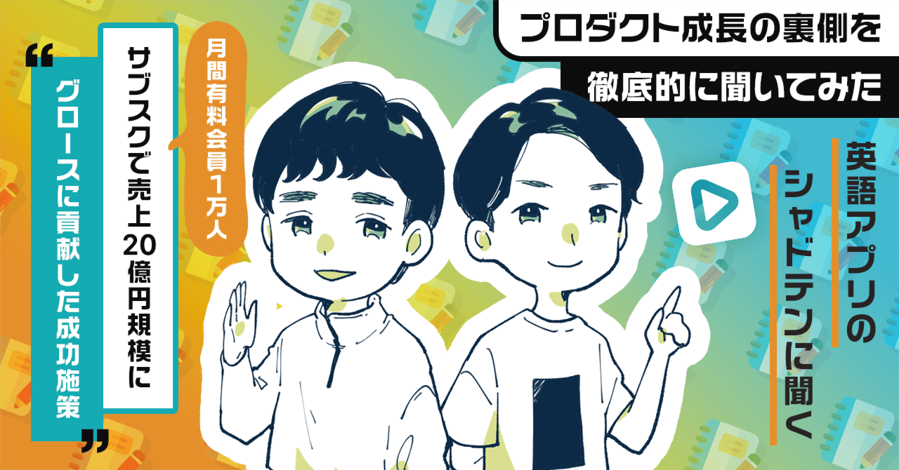  

# なぜ「シャドテン」は年間売上20億円規模のサブスクアプリに成長できたのか。UIはコピーできてもオペレーションはコピーできない。電車広告を続ける理由。

23

[%22%20d%3D%22M-100-100h300v300h-300z%22%2F%3E%3C%2Fsvg%3E)](/)

[アプリマーケティング研究所](/)

2025年11月27日 11:30

¥2,000/月

プログリットさんを取材しました。サブスクモデルで年間売上20億円規模に成長した、英語学習アプリ「シャドテン」 その成長の裏側を聞いた。

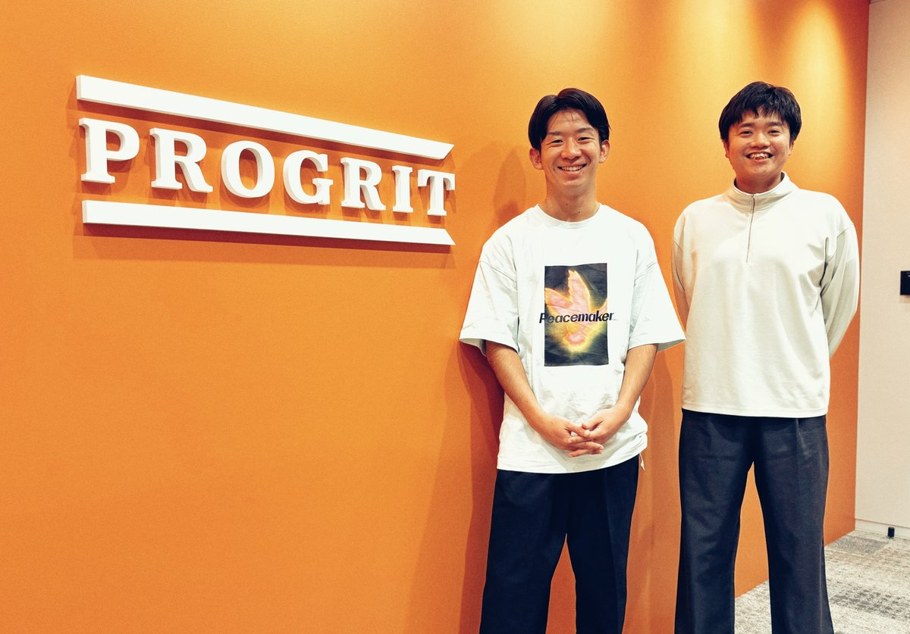

株式会社プログリット （左から）シャドテン プロダクト開発担当 木村環太さん、スピフル 事業責任者 越野僚太さん

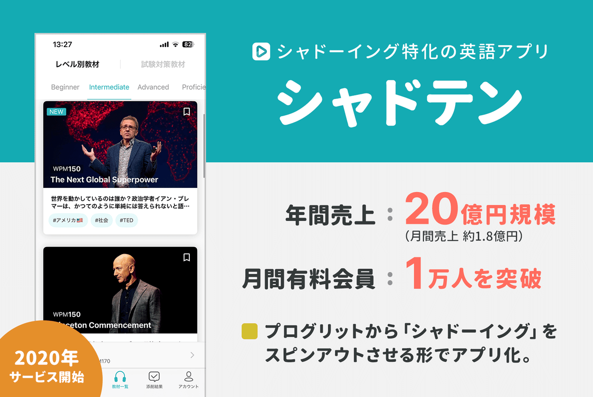

月間売上は1.8億円、月間の有料会員数は1万人に。

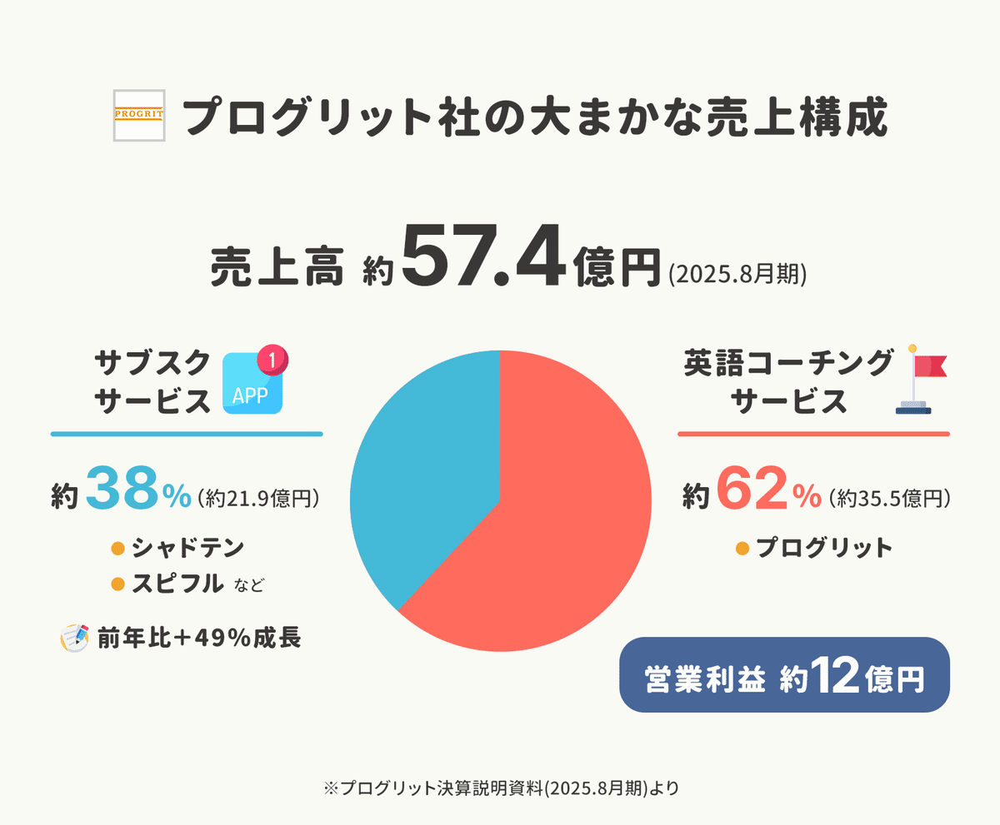

英語コーチング「プログリット」が主力事業だが、好調の裏側には「サブスクアプリ」があり売上の38％を占めるまでに。

## 売上20億円規模に成長した「シャドテン」初期の立ち上げ戦略。

### ——もともと「シャドテン」はどのように生まれたのでしょうか？

越野：  
シャドテンは、英語のリスニング力を鍛える「シャドーイング」特化のアプリです。1件1件プロが音声を聞いて添削してお返ししています。

もともとは、**祖業である英語コーチング「プログリット」の中で提供していたサービスを、"スピンアウトさせるような形"ではじまりました。**

英語コーチングの「プログリット」では、3ヶ月で約60万円のコースを提供しています。その受講後の継続サービスとして「シャドーイング添削」などを提供していて、かなり好評だったんですね。

それが原型になって、プログリットに通われていない方にも提供したいと、新規事業として開始したのが「シャドテン」（2020年6月開始）でした。

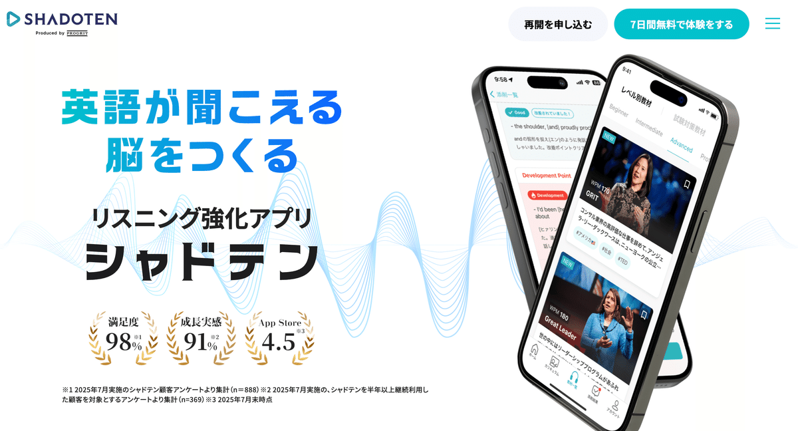

プログリットの「英語力が伸びる」かつ「満足度が高い領域」を切り出し単体アプリ化。

ちなみに、初期はLINEでサービスを提供していたんですよ。ボイスメッセージで音声を送っていただき、それを1件ずつ添削してチャットでお返しするという、人力な仕組みでスタートしましたね。

この検証で、きちんとお金を払ってもらえて「良い体験を提供できる」とわかってきたので、本格的にアプリを開発していきました。

### ——立ち上げ初期は、どのようにユーザーを集めていきましたか？

越野：  
MetaなどのWeb広告に出稿しつつ、**初期はインフルエンサーマーケティングに投資したことが成長のキッカケになりました。**

もともと「シャドーイング」って、学習手法としての知名度が高くなくて、英会話と比べると「何それ？知らない。」となってしまう方も多かった。

ただ、同時通訳者や指導者の間では、**馴染みのあるトレーニング方法だったので、まずは「手法の有効性」を広めていこうと。**

それで、英語学習インフルエンサーの方などに、YouTubeを中心に発信していただくことで、認知のギャップを解消しようと考えました。

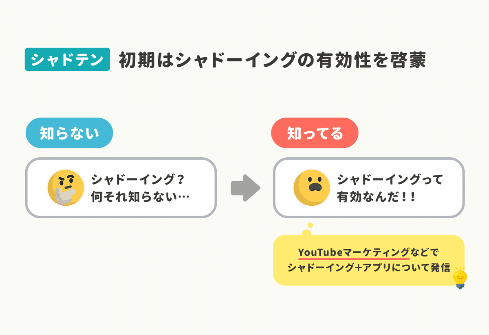

とくに効果が高かったのは、**インフルエンサーさんに語ってもらうだけではなく、第三者の方に「効果検証をしてもらう動画」だったんですよ。**

例えば、インフルエンサーの方がアプリを紹介しつつ、教え子の方にも体験してもらい「リスニング力がどう変わったか？」を検証してもらう。

すると、**視聴者さんも「自分ゴト」として感じられやすくなりますし、納得感が生まれて「体験してみたい！」と思ってもらいやすい。**つまり、ポイントとしては「本当っぽさ」だったのかなと。

やっぱり、成果の出た動画にはこの要素があって。**動画の再生回数、概要欄からの流入数、指名検索数にポジティブな影響を与えました。**

これを続けたことで、シャドーイングが広まっていき「知る人ぞ知る有効な学習方法」のように徐々になっていきました。

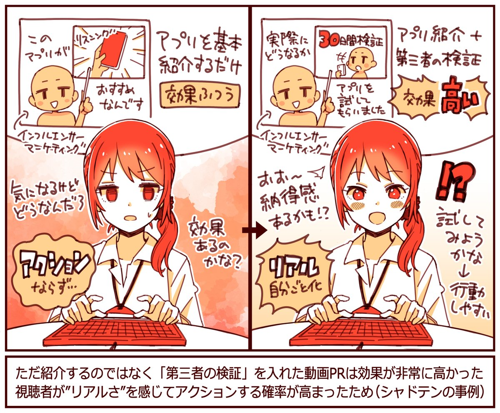

## シャドテンが「電車広告」に投資する理由。

### ——ほかに「ここに投資して良かった」と思うことを教えてください。

木村：  
シャドテンでは、電車広告やトラック広告など「認知度を高める広告」にも広告費を投資しています。これにはいくつか理由があります。

英語学習のサービスを**「どう選ぶのか？」をインタビューすると、最後は「有名だから」と知名度で選んでいる方も多かったんですね。**

特に単価の高いサービスって**「見合った品質」であることを前提に、いかに信頼性を高められるかが、マーケティングのポイントだと考えていて**。

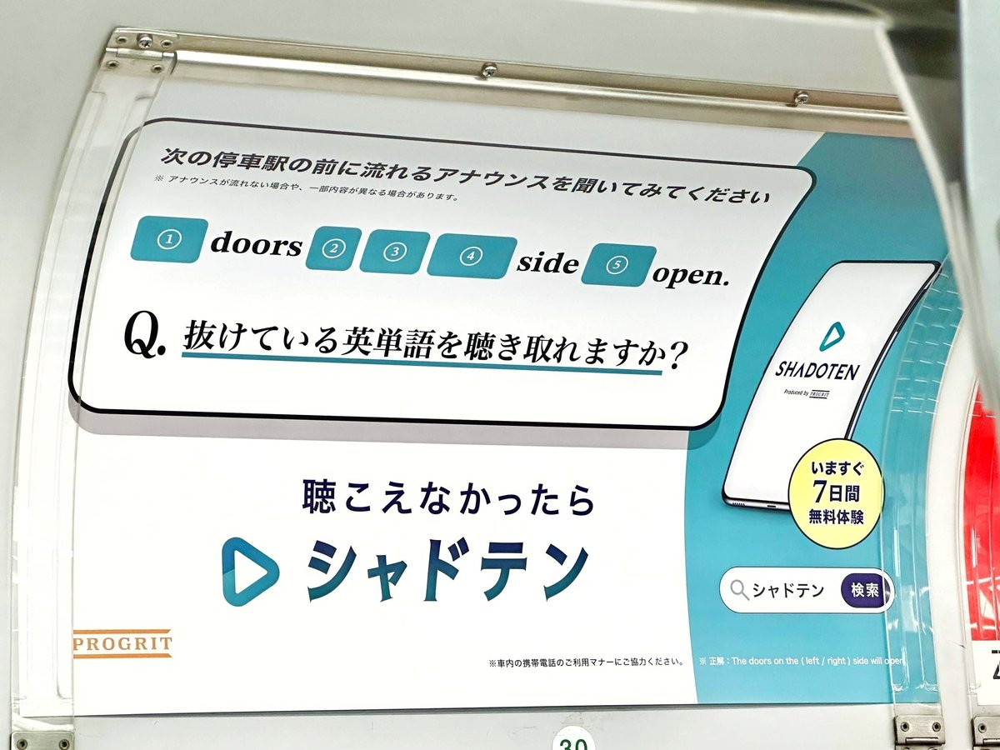

電車広告の例。写真に撮られてSNSでも話題に。

英語コーチングの「プログリット」でも、書籍化してノウハウをどんどん公開して、**ここまでしっかりしているなら「きっと良いサービスだろう」と信頼されたことが売上の成長につながりました**。

また「プログリット」でも電車広告を続けたことで認知度が上がっていき、サービスの信頼度も高まっていったと実感しています。

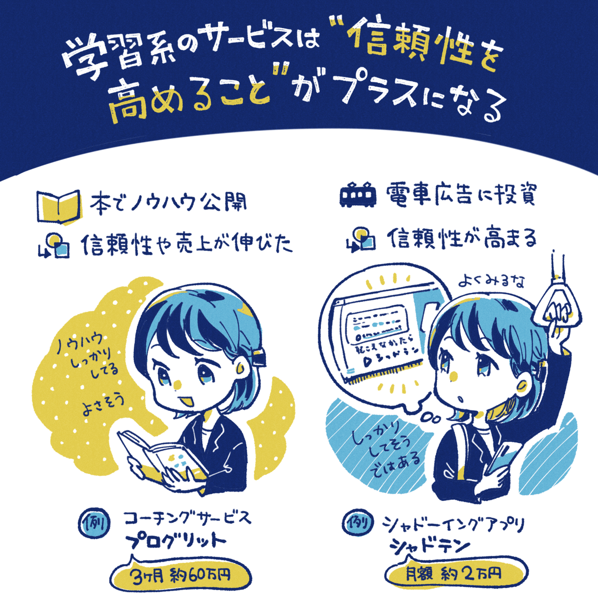

狙いは「シャドテン」も同じです。実際に認知も伸びてきていて、厳密な効果測定はできないものの「投資する価値はある」と判断しています。

とはいえ、何も見ないわけではなく、**出稿エリアにおける「シャドテン」という指名検索数への影響は見ていて成果も出ていますね。**

あとは、認知広告は「獲得広告のCVR」に貢献している実感もあります。電車広告で知ったあとに広告から登録してくれたりです。

### ——ほかに、「ここはターニングポイントだった」と感じているところはありますか？

越野：  
初期は「いかにオペレーションを綺麗に回せるようにするか」もターニングポイントでした。

**アプリのUIはコピーできても、泥臭いオペレーションの改善って簡単には真似できません。これが意外と参入障壁になるんですよね。**

例えば、プロモーションで一気にお客様が増えたとしても、添削が間に合わなければサービスの品質を維持できません。

そうなると、プロダクトの改善も大事だけど、お客様に添削をいかに早く返すか、添削の供給をしっかり安定させることも大事になる。

初期は添削の返却に20時間かかっていた時期もありました。「添削の返却が遅い！」となると翌日の学習率やDAUにもかなり影響があります。

そのため「添削の返却時間」をモニタリングして改善しました。今では数時間で返せることも多く、かなり安定するようになりましたね。

## 習慣化しやすいのは「週6日」より「週7日」使う人。

### ——おもしろい結果になった「プロダクトの改善事例」などがあれば教えてください。

木村：  
シャドテンに、連続学習が記録される「連続学習（ストリーク）」の機能を入れたところ、継続率にかなりインパクトがあったことです。

毎日学習すると「2日連続！」「3日連続！」とポップアップが表示されたり、学習成果のカレンダーにも反映されたりします。

この機能によって、**新規ユーザーの「3週間後の継続率」が1.2倍に伸びるという検証データも出ていますね。**

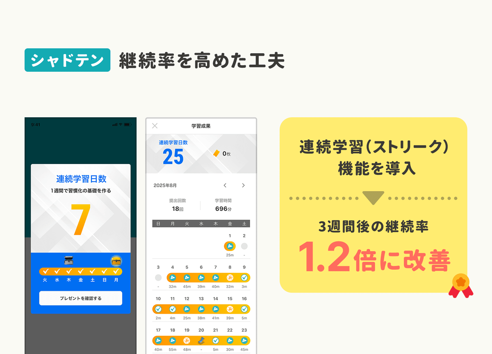

何が良いかというと「毎日やることが大事だ！」とお客様に自然に伝えられることだと考えていて。

面白いポイントとしては**「週6日学習する人」と「週7日学習する人」って、習慣化の度合いに結構な差があることがわかっているんですよ。**

翌月の解約率だとあまり変わらないのですが、すこし先を見ると**「週6日」よりも「週7日」のほうがずっと継続しやすい。違いは「毎日やるものだ」と思っていて習慣化しているかどうかなんですよ。**

例えば、ランニングを週7日やる人って、そもそも「毎日続けること」が前提になっているから、数ヶ月後も週7日ずっと続けてやめにくいですよね。

でも、ランニングを週6日やる人は、「毎日続けること」が前提でないので、数ヶ月後には週5日になっているかもしれない。すると、やめてしまう確率も高くなる。

なので、「週6日」と「週7日」は一見ほとんど同じように見えますが、習慣化という観点では、小さいようで大きな差があるんですね。

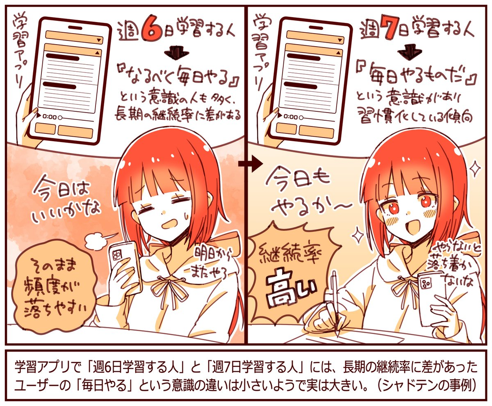

### ——ユーザー体験を良くするために、「継続的に行っていること」はありますか？

越野：  
スピーキング特化の英語アプリ「スピフル」の事例になりますが、顧客の声を反映するために、要望を収集するシステムを作っています。

まず、お問い合わせフォームに届いた内容に対して、**カスタマーサポートが Slack上で「VoC」（顧客の声）スタンプを押すと、エンジニア全員に通知が届く仕組みにしています。**

さらに、「Notion」スタンプを押すと、Notionに課題（イシュー）として自動で登録されます。

これを続けると「定性的な声」がどんどん蓄積され、課題の手触り感も増します。さらに、機能を考えるときの着想ネタの宝庫にもなるんですよ。

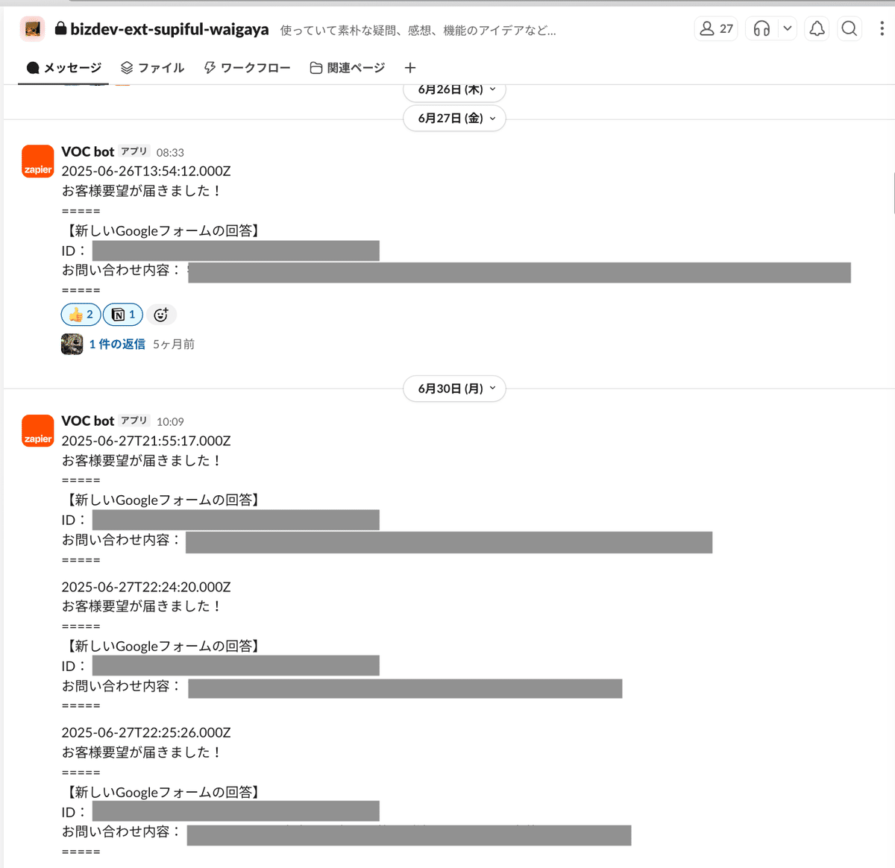

Slackにて「顧客の声」（個人情報は除く）を共有。

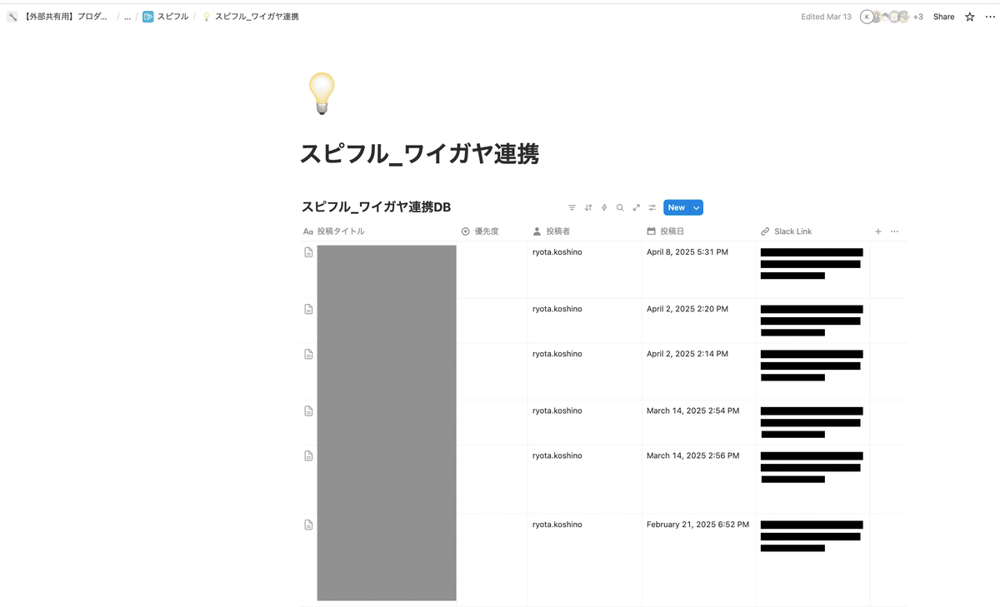

Notionに「イシュー」を蓄積している。

エンジニアからも「ユーザーが何を感じているか見えるようになった」「どの声をもとに機能を作っているかが理解できる」と好評です。

要望を送ってくださるのは、本当に困っている方か、サービスに強い期待を寄せてくれている方なので、丁寧に読むようにしていますね。

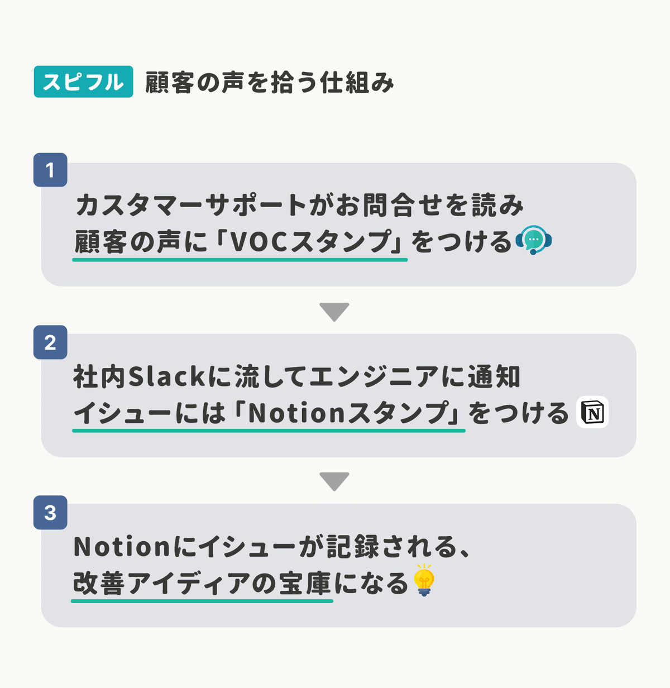

---

【取材協力】  
株式会社プログリット：<https://about.progrit.co.jp/>   
シャドテン：<https://www.shadoten.com/>  
スピフル：<https://www.supiful.jp/>

【告知】プログリットさんでは各職種で採用中。プロダクトマネージャーやマーケターなどを募集しているとのこと。ご興味ある方は、下記のページからご覧ください。

[**PROGRIT採用情報**
*株式会社プログリットは「世界で活躍できる人を増やす」をミッションに英語コーチング”プログリット”をはじめとしたサービスを運*
*recruit.progrit.co.jp*](https://recruit.progrit.co.jp/)

> ※ 以降は、＋αの【5つの事例】を購読会員向けにまとめています。  
> 【① シャドテンの**解約率が約30％改善**された取り組み。】  
> 【② スピフルが**「たった1枚の画面」を挟んで継続率を高めた話**。】  
> 【③ スピフルの**「年間プランの選択率」が10％増えた**改善。】  
> 【④ スピフルの**有料転換率を高めたAI機能。**】  
> 【⑤ スピフルの**「初日の学習率」を高めた**工夫。】  
> など、ご興味あればご覧ください。

  

ダウンロード

 

copy

## ここから先は

1,503字
/
5画像

%22%20d%3D%22M-100-100h300v300h-300z%22%2F%3E%3C%2Fsvg%3E)

アプリやプロダクトの成功事例が学べるマガジンです。プロダクトの売上やユーザー数を伸ばしたい人にオススメです。成長プロダクトのインタビュー、効果のあったマーケティング施策、事例やデータなどが中心（月に7記事ほど）多くの過去記事も5年ほど遡って読めます。クレカ決済だと初月無料なのでお試しでもぜひ。

### [月刊アプリマーケティング](/m/mc375c9b46464)

¥2,000 / 月  
初月無料

プロダクト運営について学べるマガジンです。アプリやプロダクトの売上やユーザー数を伸ばしたい人にオススメです。月に7記事ほどお届けします。

購読手続きへ

%22%20d%3D%22M-100-100h300v300h-300z%22%2F%3E%3C%2Fsvg%3E)%22%20d%3D%22M-100-100h300v300h-300z%22%2F%3E%3C%2Fsvg%3E)

2人が高評価

[ログイン](https://note.com/cd/login?redirect_to=https%3A%2F%2Fmarkelabo.com%2Fn%2Fn4978ad140741)

   

23

[%22%20d%3D%22M-100-100h300v300h-300z%22%2F%3E%3C%2Fsvg%3E)](/)

[アプリマーケティング研究所](/)

フォロー

プロダクトの成功事例を発信しているメディアです。2013年から約10年運営しています。取材相談はツイッターDM（@appmarkelabo）かメールにてどうぞ！info@appmarketinglabo.net