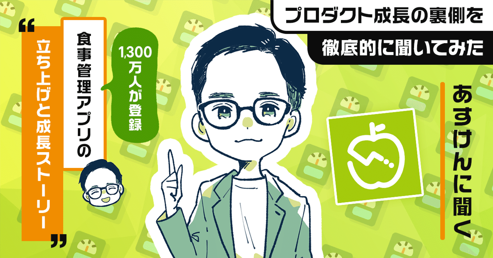  

# 赤字続きだった初期から、1,300万人が登録するサービスへ成長。「あすけん」に聞く栄養士の人柄ごとサービス化したら愛されるアプリに育った話、2つの成功施策。

28

[%22%20d%3D%22M-100-100h300v300h-300z%22%2F%3E%3C%2Fsvg%3E)](/)

[アプリマーケティング研究所](/)

2025年12月23日 11:00

¥2,000/月

あすけんさんを取材しました。

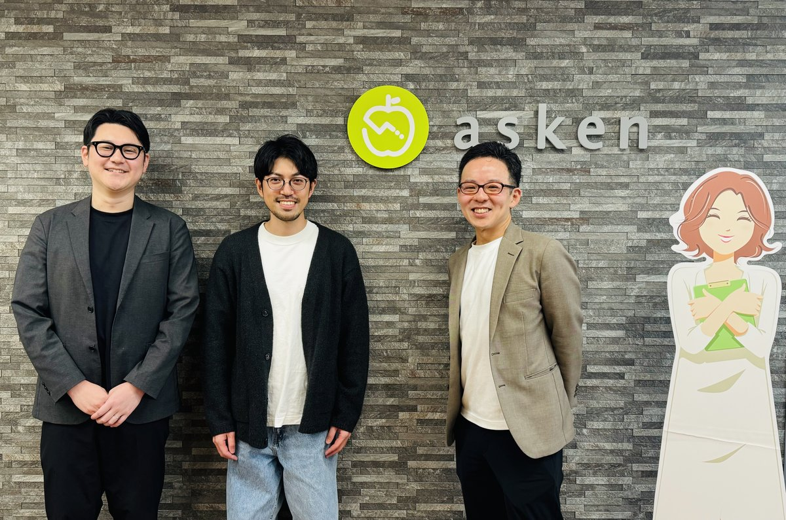

株式会社asken 取締役 天辰 次郎さん(右)、コンシューマー事業本部 マーケティング部 部長 渡辺 良介さん(中央)、AX推進部 シニアプロダクトマネージャー 伊藤 拓哉さん(左)

### ⸺「あすけん」について教えてください。

天辰：  
あすけんはカロリーや栄養素を自動計算できる「AI食事管理アプリ」です。**会員数は累計1,300万人を突破しています。**

特徴は「管理栄養士さんに寄り添ってもらえるような体験」です。ただのカロリー計算機ではなく栄養士さんの考え方が詰まっています。

食事記録データは約100億件たまっていて、**現在表示されるアドバイスパターンは20万以上です。**

ユーザーさんの比率は「女性70％:男性30％」ですが、徐々に男性比率が上がってきていて、年齢層も幅広く拡大していっています。

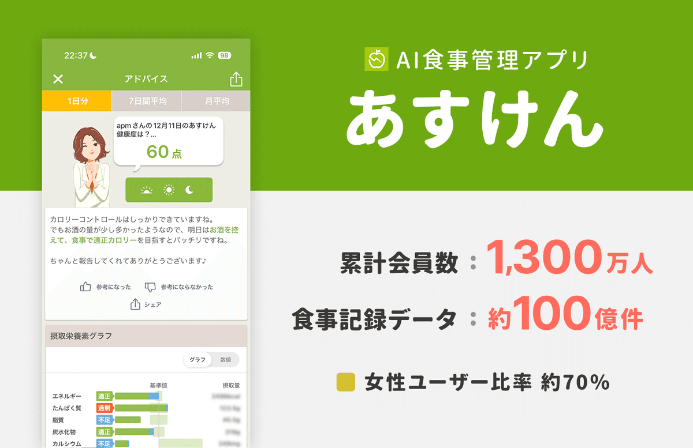

ビジネスモデルは「サブスク(主力)・広告・EC・法人向け」など。

### ⸺もともと、どのように「あすけん」は始まったのでしょうか？

天辰：  
askenにはグリーンハウスという親会社があります。この会社では70年以上にわたって「食と健康」の事業を展開しています。グループのレストラン事業で展開している「とんかつ新宿さぼてん」などはよく知られているかもしれません。

その中で、1番の主力事業は「社員食堂でのフードサービスの提供」ですが、そのお客様に健康サービスを提供しようと生まれたのがあすけんでした。

ということで、**あすけんって最初は「企業向け」だったんです。でも、初期は苦戦して伸びなかった。**かっこよく言うなら「早過ぎた」です。笑

なぜ伸びなかったかというと、**当時はまだ、社員の健康支援の優先順位が、現在ほど高く認識されていませんでした。**担当者の方にプレゼンすると「素晴らしいですね！でも予算はありません」とよく言われていました。

当初は「数年で黒字化したい」と考えていましたが赤字続きでした。4人程の小さなチームで淡々と運営を続けていましたね。

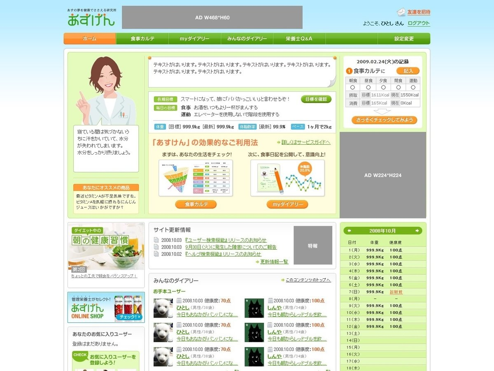

初期のPCブラウザ版の「あすけん」（イメージ画像）

### ⸺そこからは、どんな「転換点」がありましたか？

天辰：  
ひとつ転換点になったのは「コンシューマー向け」にシフトしたことです。これは戦略というよりは「結果的にそうなった」という感じですね。

というのも、法人向けで苦戦する中、個人向けにブラウザ版を「期間限定で無料で使えます」と、検索エンジンの広告（リスティング広告）に少額を出してみたところ、すごい手応えがあったんです。

当時は注目されていなかった**「カロリー計算」などのキーワードで広告を出してみると、1ユーザーの獲得コストが約15円で獲得できた。**かなり奇跡的な数字ですよね。

そこから、食事記録を用いたダイエットが盛り上がり検索回数が伸びてきて、若い女性を中心に個人ユーザーが伸びていきました。

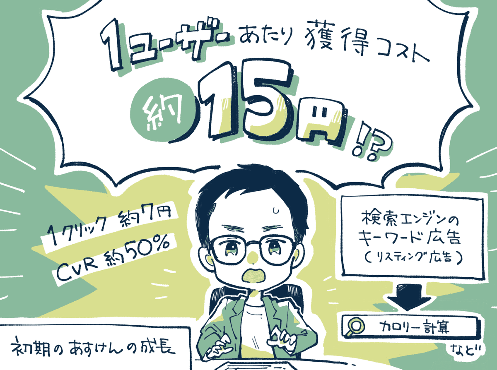

ダイエットは「見た目」が変わると口コミが生まれるため、口コミでもじわじわと広がった。

### ⸺あすけんは「栄養士のキャラ」も特徴の1つですよね。どのように生まれたのでしょう？

天辰：  
あすけんを企画していた当時、グリーンハウスグループにいた栄養士さんたちにお話を聞きながら企画を立てていたんですよね。

**その中で「ただ栄養計算ツールをつくるんじゃなくて、栄養士さんの人柄ごとサービスにできたらいいよね」**みたいなことを考えていて。

それで、色々な案をつくる中で「栄養士さんのキャラクター」を入れたバージョンがあって。これだ！と思って採用することになりました。

ちなみに、企画時の名称は「明日の健康研究所」でした。それを略して「あすけん」になりましたね。

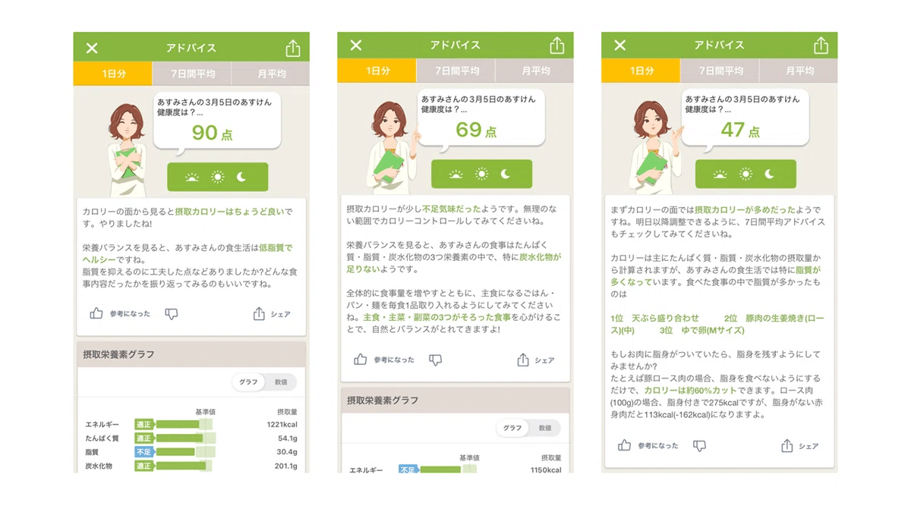

現在のアプリ画面。デザインは違ったが初期から「栄養士のキャラ」がいた。

### ⸺サービス開発の初期に大変だったことはありますか？

天辰：  
地道で大変だったなと思うのは「栄養士さんたちが頭の中で考えていること」を理解して、アドバイスのアルゴリズムに落とし込むことです。

**栄養士さんに「こんな人が来て、この食事内容と言われたら、何を見てどんなアドバイスをしますか？」と聞きまくったんですよ**。栄養士さんがやっていることを「再現したい」って想いがすごい強かったので。

あすけんでは、食事の記録時に 「ラーメンの汁を飲んだか？」 も選べます。こんな細かい項目があるのは世界中探してもおそらくあすけんだけ。

これも、栄養士さんにお話を聞くと「そこを真っ先に見る」という方が圧倒的に多かったんです。それをシステムで再現すると複雑になって大変なのですが、「これはやるしかないね」と頑張りました。

今でも「ただ体重を減らす」のではなく、バランスの良い食事を実現してもらうためのサービスづくりを大切にしていますね。

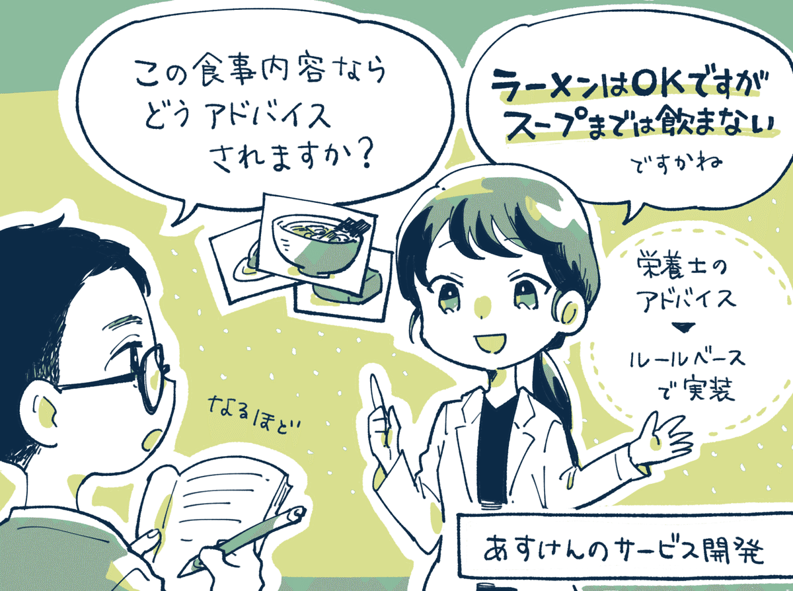

現在もメニューデータ内に「この部分は汁」という判定があり、「汁を半分飲んだ」という場合には一定の係数をかけて計算している。

### ⸺会員数が伸びるキッカケになった出来事はありますか。

天辰：  
会員数が大きく伸びていくきっかけになったのは、2013年にスマホアプリを出したことでした。

最初は500円の買い切りアプリでしたが、約1年後にサブスクモデルに移行しました。基本無料になったことで、会員数の増加にも弾みがつきました。

正直タイミングも良かったなと。**当時は周りの人に聞いても「もうアプリは激戦区だ。今さらやっても遅いよ」と言われていたんですよ。**しかし、実際には2013年というのは十分に早いほうでした。

初期にアプリが広まったのは、ロイヤルカスタマーのおかげです。既存会員の方がダウンロードしてくれてストアのランキングが伸びました。

当時はランキングの影響力が強かったので、そこで目立つと多くのユーザーさんが入ってきて、またランキングが上がるサイクルが生まれました。

カロリー計算アプリは当時もありましたが機能的にシンプルなものが多く、あすけんは「本格的な食事管理アプリ」として注目してもらえましたね。

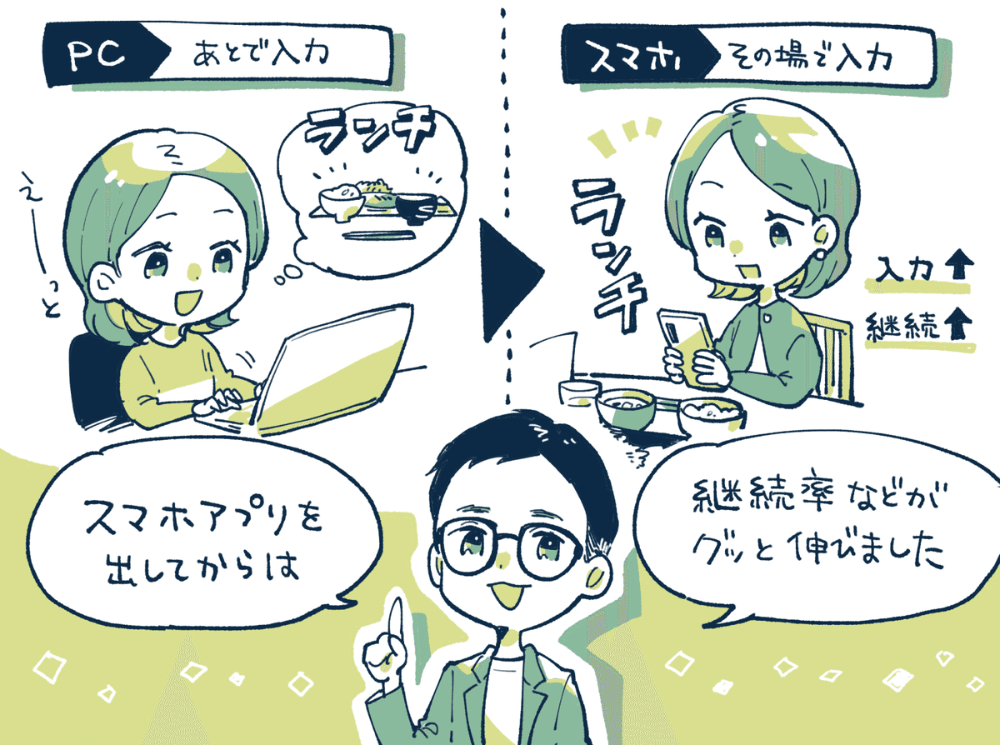

アプリになって入力率や継続率もグッと伸びた。PCだと「帰宅後にまとめて入力する」になりがちだが、スマホなら「その場で入力→カロリーの確認」ができるため。

### ⸺そこからは、どのように1,300万人まで成長したのでしょうか。

天辰：  
少しずつ成長したというのが実態ですが、**1つ言えるとしたら「成長サイクルが回るようになった」というのはあったかなと思います。**

1つ目のループは、ユーザーさんが増えると、アプリストアやメディアなどで注目いただき、知っている人が増えてまたユーザーさんが増える。

2つ目のループは、だんだん売上利益が伸びてくると、かけられる予算も増えてきて、人も増やせるようになって、施策の数や質が上がっていく。

3つ目のループは、会員数が増えてくると、人材市場での認知が伸びていき、会社のビジョンに心から共感してくれる心強い仲間が増えて、マーケティングや開発がより進む。

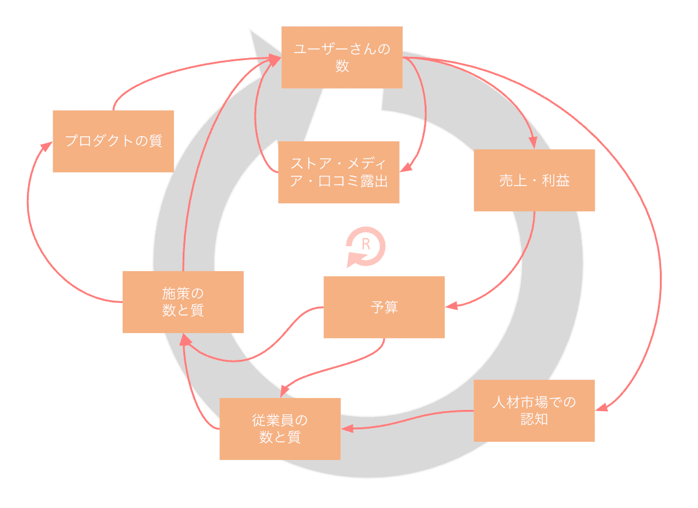

SNSの運用も正にそうです。ずっと「やらなきゃ」と思っていたけれど、SNSに強い人が入社してくれて、力を入れたら見てもらえるようになりました。

SNSでは「あすけんの女」と呼んでいただき、栄養士のキャラクターの未来（みき）さんを話題にしていただけることも多いです。

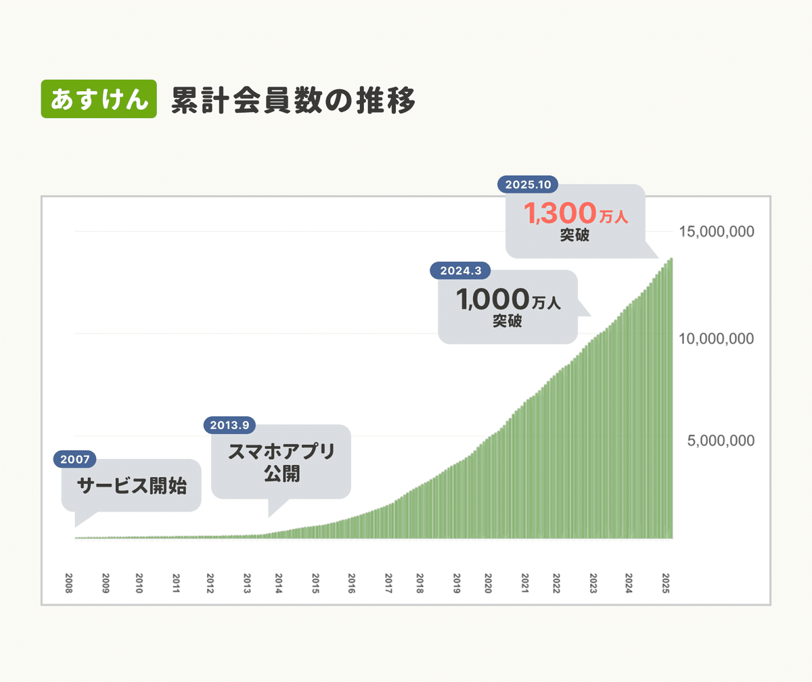

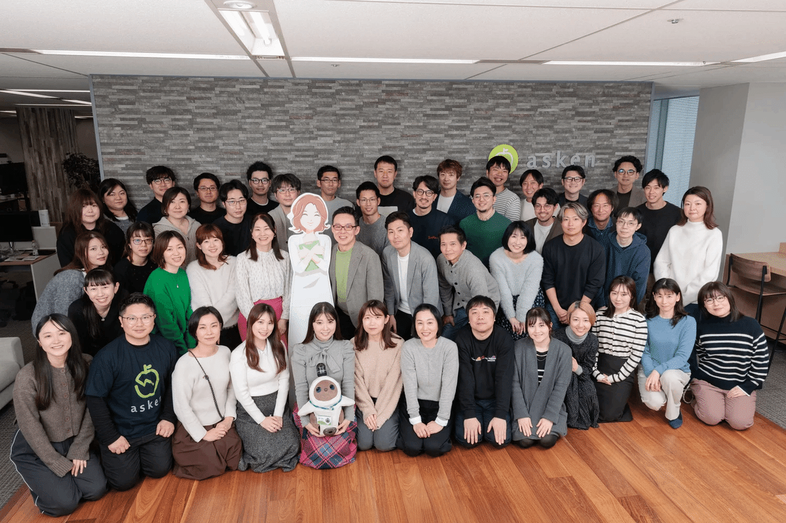

当初4名のチームだったあすけんは、現在は約80名のチームで運営されている。

## あすけんの「プロダクト開発」について。

### ⸺あすけんは「続けてもらうこと」も重要ですよね。継続率に影響を与える要素には、どのようなものがあるのでしょうか。

渡辺：  
継続に大きく貢献するのは「記録の簡単さ」だと考えています。実際にあすけんのデータからもちょっとした継続の分岐点が見えていて。

それは、**初日に3品を記録してもらえると翌週の継続率が上がる、また1週間以内に19品を記録してもらえるとその後の継続率が上がりやすい**というデータが出ているんですよね。

このデータが何を示すかというと、**突き詰めると「食事記録をいかに簡単にできるか？」みたいなところがポイントになると思っています。**

例えば、初日に3品って「白米・味噌汁・サラダ」のように1食分を入れて、アドバイスの画面まで到達している、みたいな状態ですよね。

そこに至るまでに、記録のためにキーワードを入力したり、検索結果に妥当性を感じたり、そうした体験が積み重なって継続してくれるのかなと。

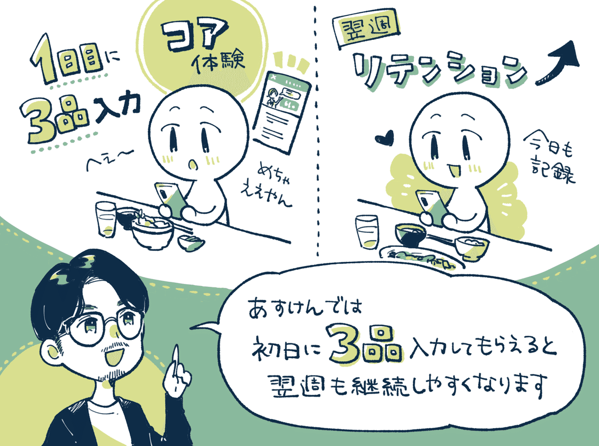

伊藤：  
ほかには、あすけんの「好循環モデル」というものを作って、このループを1つの参考にしながら改善を行ったりもしています。

これは何かを食べる、食べたら記録をする、記録をするとアドバイスを受け取って何かに気づける、といったサイクルのことです。

**アドバイスを受け取って「じゃあ、これを食べよう」と気づくことを「食事の選択力が向上する」と呼んでいます**。

例えば、「ラーメンは少しカロリーが高くて、1日のカロリーがオーバーしそうだからお昼はそばにしよう」「トッピングをしてたんぱく質を補強しよう」みたいな感じですね。

その結果「ダイエット成功」といった目標に到達すると、そのストーリーを誰かに話してくれて、新規の方が入ってきてくれます。

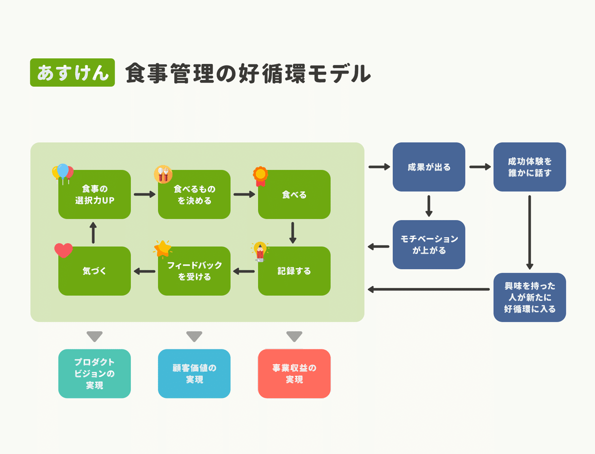

### ⸺印象的だった「ユーザーの声」はどんなものがありますか？

渡辺：  
インタビューで**「あすけんはお守りのようなもの」と話してくださるなど、情緒的な安心感のようなものを評価してくれる方が多い**ことです。

例えば、ダイエットや健康のために「何かしたい」って気持ちがあっても、何もできない日もやっぱりあるじゃないですか。

その時に、あすけんに記録するだけでも「何かしている感」が感じられて、そんな日でも「前に進んでいる。今日は良し！」と思える。

食べ過ぎた日があっても、あすけんを続けていれば「もとのペースに戻れる」という意見も多くて。伴走者のように感じていただけているのかなと。

伊藤：  
あすけんのウィジェットを出した時も、**「未来（みき）さんとカロリーがドンと表示されるデザイン」がSNSでも好評でしたね。**

当初は「カロリーのグラフが出る」みたいな、実用的なものが良さそうだろうと考えていたのですが、「見守ってくれること」に価値を感じてくれる方も多かった。

例えば「未来（みき）さんに見張られていて気が引き締まる」みたいなSNSの投稿も多くて。あすけんの体験の軸になっているんだなと。

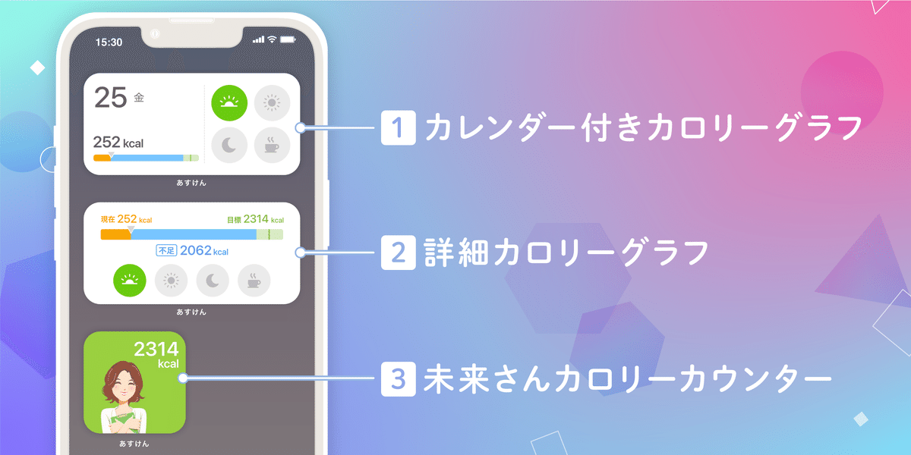

ウィジェットの例

### ⸺アドバイスのメッセージはどんな点を工夫していますか？

伊藤：  
栄養士の未来（みき）さんのアドバイスも真心を込めて作っています。寄り添うようなメッセージがみなさんからも好評をいただいています。

例えば、**「お酒を飲み過ぎですよ」とお伝えするときに、以前は1パターンしかなかったのですが、バリエーションを増やしました。**

具体的には、「お酒の量が多かったですね…。毎日続くと心配です。でも、正直に教えてくれてありがとうございます。」「正直に報告してくれてありがとうございます！明日は休肝日を検討してもらえると嬉しいです。」という感じです。この変更はSNSなどでも好評でした。

あとは、食べ過ぎた日に従来は「やめましょう」という感じだった。でも、何日かの記録を見て「今日だけ」ならあまり言わないようにする。

例えば、「今日はカロリーが多めだったけれど、いつもはカロリーコントロールができているので心配していませんよ！」とお伝えする。これってリアルの栄養士さんにもそういうところがあるのでそれを再現しているんですよ。

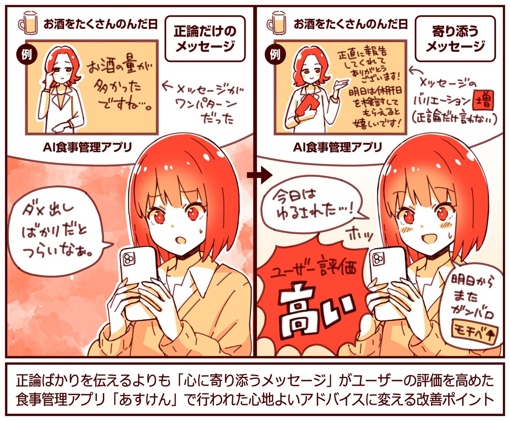

口調も「〜してください」と指示するのではなく、「〜してみませんか」と提案型のアドバイスになるように工夫しているそう。

### 成功施策①：ホームに「現在のコース」を表示したら有料会員が増加。

伊藤：  
あすけんにはコースと呼ばれる、**ユーザーさんの目的に合わせた食事管理のコースがありますが、それに気づいていない方もいらっしゃいました。**

例えば、無料サービスには「ダイエット基本コース」、プレミアム（有料）サービスには「ゆる糖質制限ダイエットコース」「あす筋ボディメイクコース」などがありますが、コースというものを"意識してもらえる瞬間"が体験の中にあまりなかったんですよ。

この課題を解消するために、**ホーム画面に「あなたは今このコースですよ」と現在のコースを表示するようにしました。**

シンプルに「自分が今どのコースか？」を一目でわかるようにしたことで、ユーザーさんがコースを見直してくれやすくなったんです。

結果としては、**コースの変更率が約10ポイント上がって、プレミアムプランの登録率も上昇するという成果につながりました。**

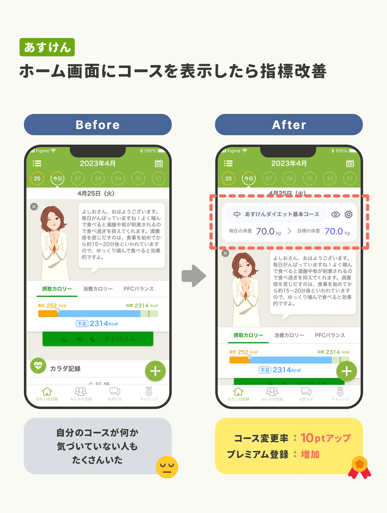

### 成功施策②：AIツールをつかって高速で検証する。

伊藤：  
2025年9月に「話して記録」（2025年12月に「AIおまかせ記録」に変更）というAIを使った機能のβ版を出したのですが、開発プロセスにAIを活用すると高速で検証を進められました。

**具体的には、アイディアを着想したら、プロトタイプをAIを活用して4日間で作って、ユーザーさんに試してもらってから、β版のリリースに進みましたね。**

AIで「やりはじめる壁」が劇的に下がっています。作って試してもらって、「価値がある」と思ったものを本格的に開発できます。

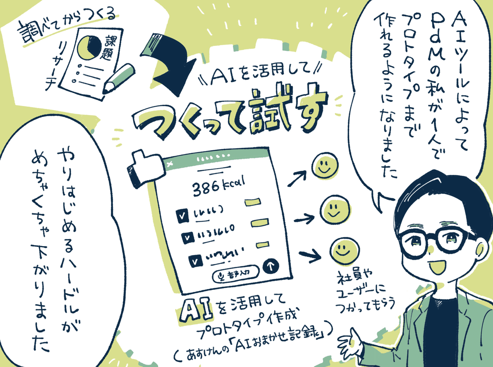

検証については**「あすけんラボ」という、モニター会員のみなさんにいち早く新機能を試していただける仕組みを活用しました。**

そこで、文字入力に課題を感じている人に、機能を使ってもらった後に**「文字入力の面倒さは解消されましたか？」とアンケートを取ると、50％以上が「解消された」と回答されていたんです。**

あと、社内で使ってみて「これは便利だ。今までより簡単に記録ができた」みたいな声があがったのでそれも後押しになりましたね。

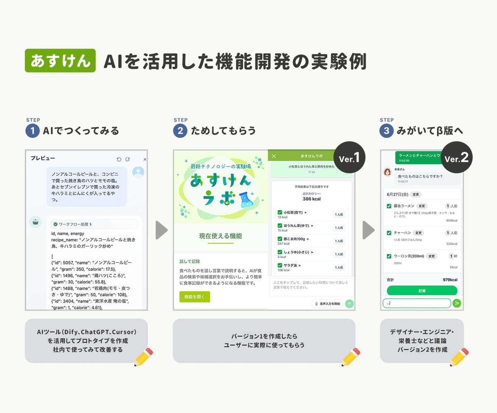

---

【取材協力】  
株式会社asken：<https://www.asken.inc/>  
あすけん：<https://www.asken.jp/>

【告知】askenではさまざまな職種で採用を行っている。ご興味のある方は下記サイトよりご覧ください。

[**採用情報 — 株式会社asken (あすけん）**

*www.asken.inc*](https://www.asken.inc/recruit)

> ※ 以降は、＋αの【5つの事例】を購読会員向けにまとめています。  
> 【① オンボーディングの工夫で**有料会員が月に2,000人増えた施策**】  
> 【② 大きな発見があった**ユーザーインタビューの手法**】  
> 【③ ユーザー投稿を軸に**「データベースの品質」を高める仕組み**】  
> 【④ AIで機能の**満足度アップを実現した話**】  
> 【⑤ ソーシャル機能が**続ける理由につながる話**】  
> など、ご興味あればご覧ください。

  

ダウンロード

 

copy

## ここから先は

2,319字
/
5画像

%22%20d%3D%22M-100-100h300v300h-300z%22%2F%3E%3C%2Fsvg%3E)

アプリやプロダクトの成功事例が学べるマガジンです。プロダクトの売上やユーザー数を伸ばしたい人にオススメです。成長プロダクトのインタビュー、効果のあったマーケティング施策、事例やデータなどが中心（月に7記事ほど）多くの過去記事も5年ほど遡って読めます。クレカ決済だと初月無料なのでお試しでもぜひ。

### [月刊アプリマーケティング](/m/mc375c9b46464)

¥2,000 / 月  
初月無料

プロダクト運営について学べるマガジンです。アプリやプロダクトの売上やユーザー数を伸ばしたい人にオススメです。月に7記事ほどお届けします。

購読手続きへ

%22%20d%3D%22M-100-100h300v300h-300z%22%2F%3E%3C%2Fsvg%3E)

1人が高評価

[ログイン](https://note.com/cd/login?redirect_to=https%3A%2F%2Fmarkelabo.com%2Fn%2Fn3a9fa6ad13e7)

   

28

[%22%20d%3D%22M-100-100h300v300h-300z%22%2F%3E%3C%2Fsvg%3E)](/)

[アプリマーケティング研究所](/)

フォロー

プロダクトの成功事例を発信しているメディアです。2013年から約10年運営しています。取材相談はツイッターDM（@appmarkelabo）かメールにてどうぞ！info@appmarketinglabo.net