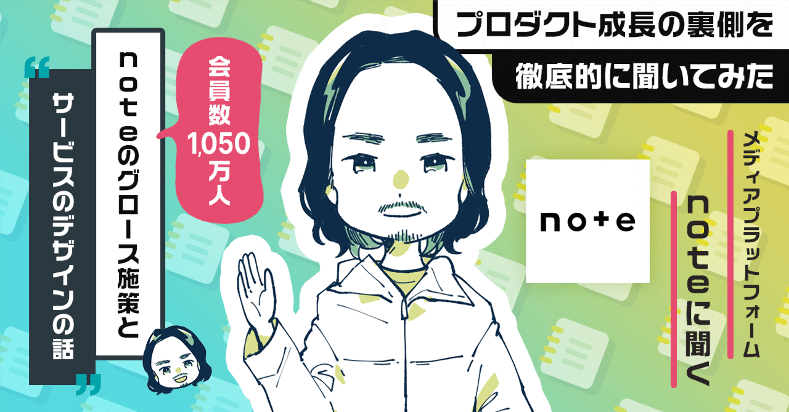  

# noteの「グロースモデル」誕生のヒミツ、サポートをチップに変えたら流通額が伸びたワケ、会員数1,050万人の「note」に聞く、noteらしさを生むサービスデザインの話。

75

[%22%20d%3D%22M-100-100h300v300h-300z%22%2F%3E%3C%2Fsvg%3E)](/)

[アプリマーケティング研究所](/)

2025年12月25日 11:30

¥2,000/月

noteさんを取材しました。

note株式会社 CXO 深津 貴之さん

## noteの急成長に貢献した「グロースモデル」のヒミツ。

### ⸺2017年に生まれた「noteのグロースモデル」について教えてください。これはどのようにつくられたのでしょうか？

深津：  
noteの中のエッセンスというか「重要なこと」を書き出して、どの要素とどの要素に因果関係があるのかを考えながら作りましたね。

noteで**最優先となるユーザー体験は、「読んで楽しい」と「書いて楽しい」だと思ったので、それを軸にグロースモデルへ落とし込みました。**

noteのグロースモデル。

### ⸺グロースモデルを渡されたら「何からやればいいのかな？」と迷う気もします。どんなところからやるといいですか？

深津：  
グロースモデルって、**車輪のようなもので「回転して前に進めているか？」というところが最も大事になるんですよ。**

何かに例えるなら、**自転車のチェーンに近いと思います。自転車のチェーンって1箇所が切れていたら進めなくなるじゃないですか。**

なので、どこから回すというよりは、細くてもいいからつながっているか、それともどこかでちょん切れて回転しないのかを見ていきます。

もし切れてるところがあるなら、切れてるところをつないで回転させて、回転速度をあげるとどんどん速くなるのかを見る感じですね。

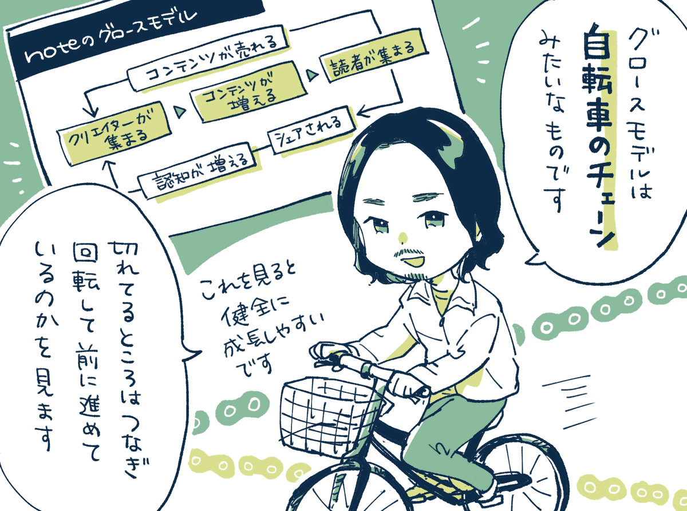

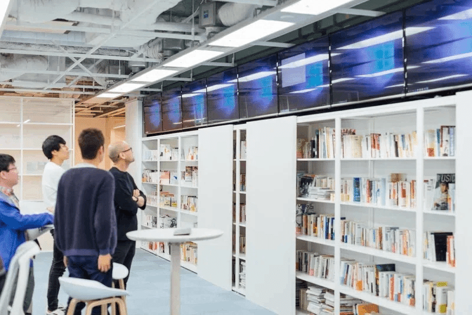

オフィスでの日常会話の中でも意識できるように、各指標の数値をまとめたダッシュボードを作り、ディスプレイに表示していた。（2019年頃の写真）

### ⸺もしこの「グロースモデル」がなかったら、どんな良くないことが起こり得ますか？

深津：  
サービスが「不健全な伸び方をする」可能性が上がります。

例えば、読者はめちゃめちゃ集まったけど、次の世代のクリエイターが集まらないとか、コンテンツは増えたけど、誰も読んでくれないとか。

**人間の健康診断で考えるとわかりやすいです。「血糖値をA判定にしよう。ほかは知りません。」みたいに考えるとサービスが死んでいきますよね。**全体を見て「D判定、E判定がない」ほうが重要です。

なので、統括的に物事を見ることが大事で、それをみんなが再現できるようにグロースモデルやミッションに落とし込めるといいですよね。

グロースモデルが回り始めたら、周りに加速のためのサポート装置を置いたり、弱点をカバーする補強装置を追加する、そんな進め方が僕は好きです。

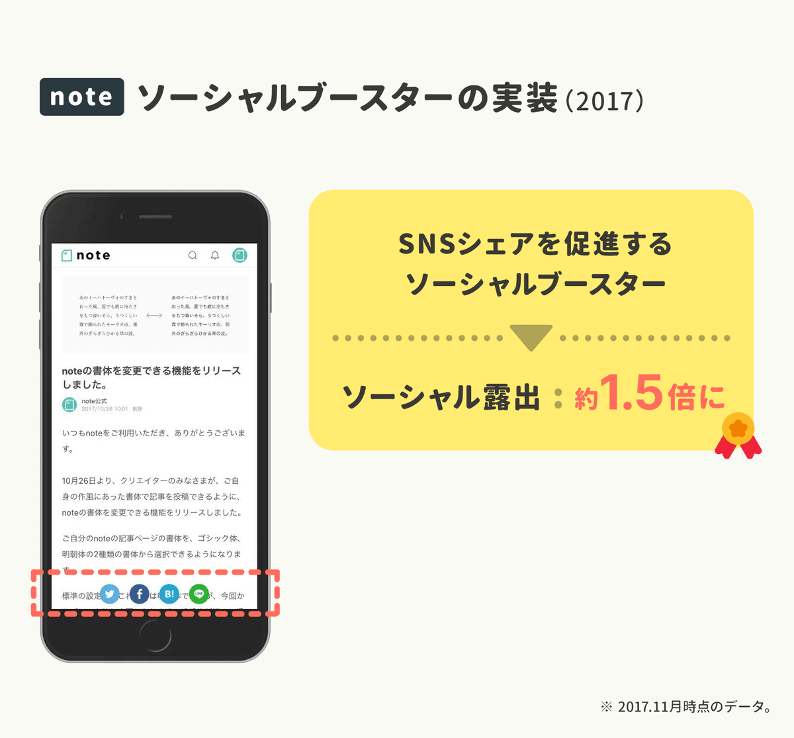

初期のサポート装置の例。SNSへのシェアが加速した。

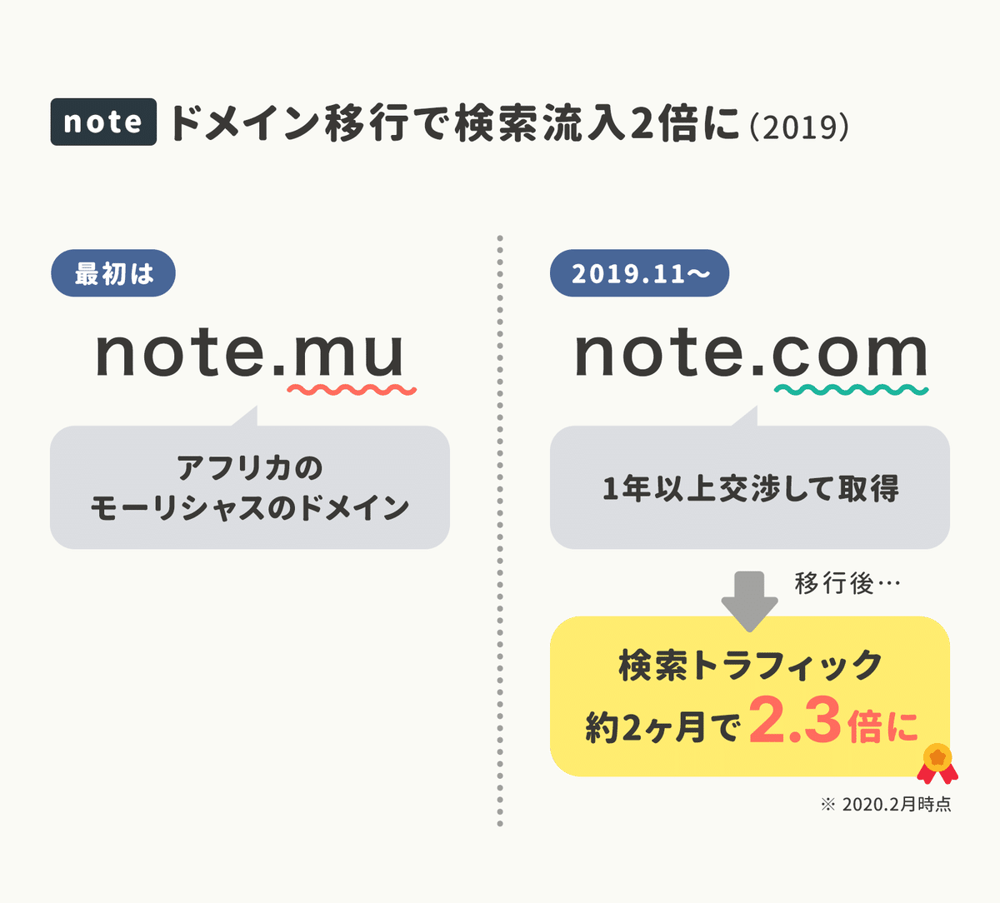

2019年には「note.com」にドメインを移行した。

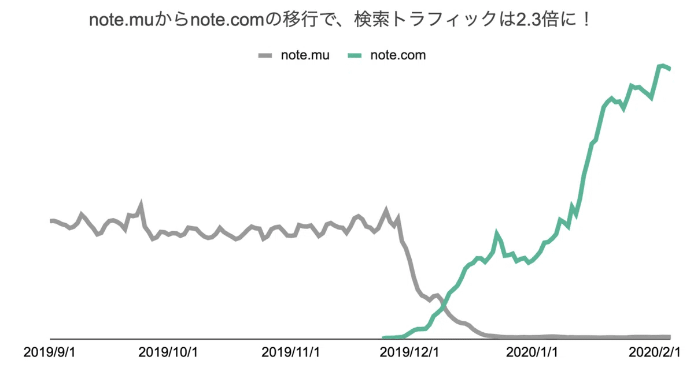

### ⸺グロースモデルの「適切なシンプルさ」はどれくらいですか？

深津：  
紙に書いて渡して、1ヶ月ほど運用してもらったあとに、「じゃあ、書いてみて」と言って、再現できるくらいのシンプルさが合格ラインだと思います。

読者を「toB読者・toC読者」と分岐させたり、コンテンツを「読み切り・サブスク」と分岐させたりすると、みんなが読めない図になりますよね。

なので、全体向けはシンプルにして、営業チーム向けには必要なところの解像度を上げた図を作る、みたいにするのがいいと思います。

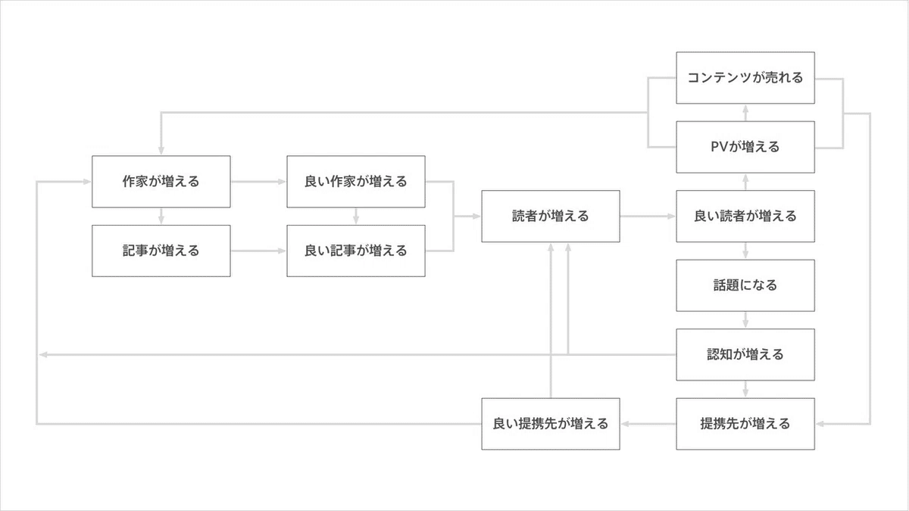

より細かいバージョンのグロースモデル。

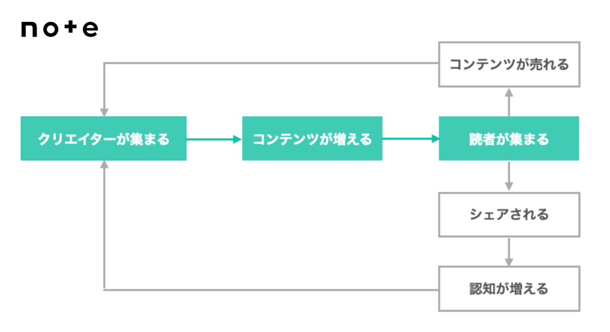

シンプルなバージョンのグロースモデル。

### ⸺深津さんはグロースモデルを2週間ほどでつくられたそうですが、そのためには何をしましたか？

深津：  
データの分析やヒアリングもしましたが、**1番大事だったと思うのは自分でひたすら書いて投稿して、肌感覚をつかむことです。**

僕はこのドッグフーディングを絶対にやります。そのサービスの輪っかに自分でコミットするんです。

noteだったら記事をひたすら書いて読みますし、株式のサービスを手伝うときは相当の財産を一回は株式投資に投じますし、不動産サービスを手伝うときは大赤字になっても不動産を買ってみます。

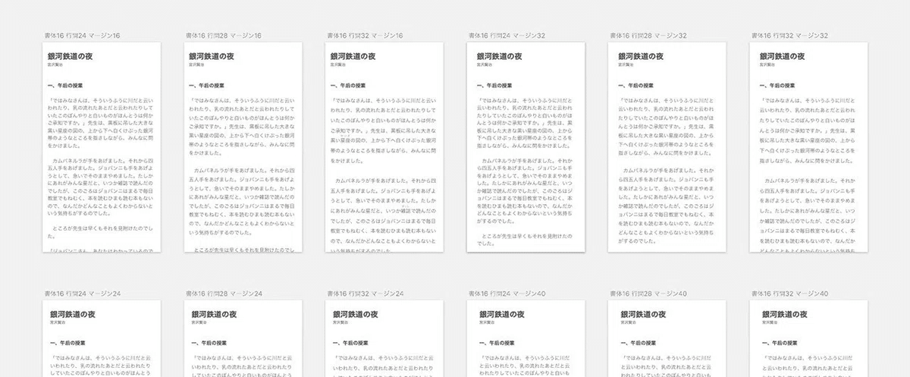

2017年に「行間、マージン」を1ptづつ変えたものを並べて、どのバージョンのnoteが読みやすいかなども考えた。

## noteのスキはなぜ「ハート型」なのか。

### ⸺noteでは2018年に、スキを「星」から「ハート」に変更しています。これはなぜそうしたのでしょうか？

深津：  
これは「ハートだから良い」「星だからダメ」というよりは、コンセプトに対して整合性が生まれるデザインにしたという感じですね。

結果的には**「星」から「ハート」に変えたことで、スキ率も約20％ほど伸びています。**

> ※ 変更前の3ヶ月間（2017年10-12月）と、変更後の3ヶ月間（2018年1-3月）での平均値の比較。

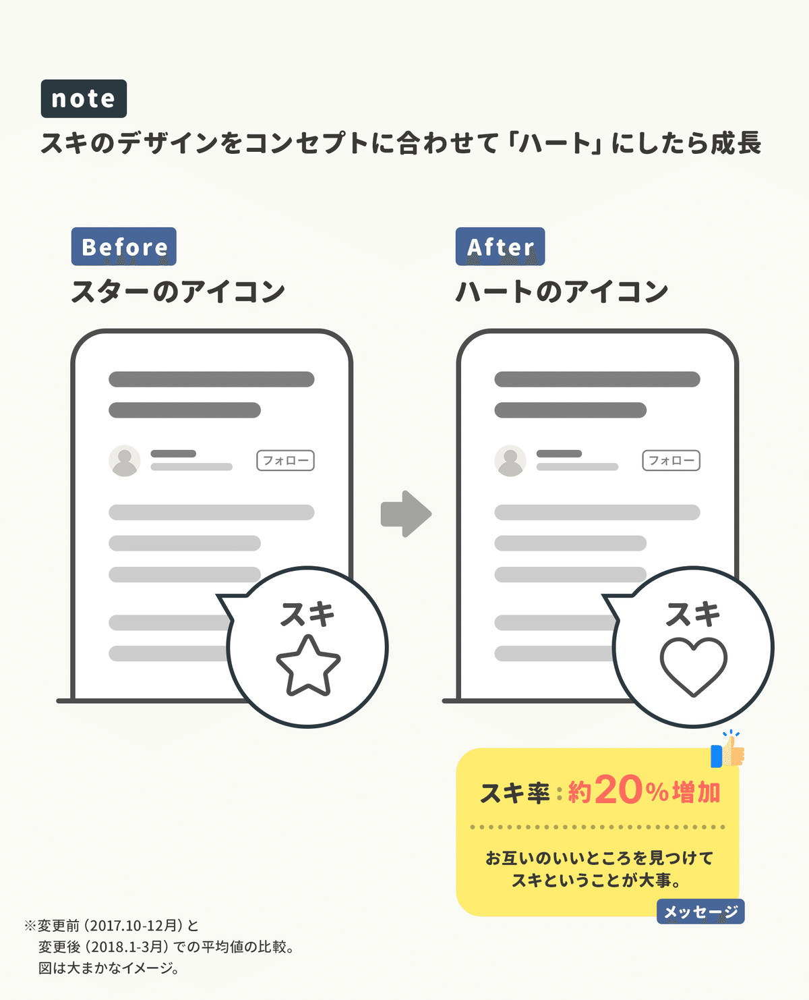

スキをハートにすると**「noteではお互いのいいところを見つけてスキと伝えることが大事だよ」というメッセージになります。**

もしこれが「ブックマーク」「拡散」というボタンなら、**嫌いなもの・炎上させたいものにも押すという意味合いが強くなります。**ハートにすることでそのインセンティブを減らすことができます。

伝え方も同じです。「スキを押そう」ではなく「スキを集めよう」と表現することで、ブックマークのような意味合いが生まれ、より気軽に押しやすくなります。

そんな感じで、コンセプトに対する「全体のストーリー」をちゃんとつくることが大事なんですね。

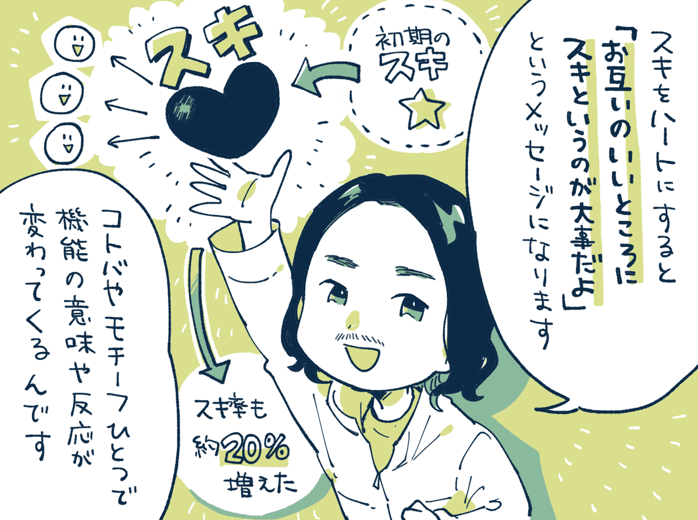

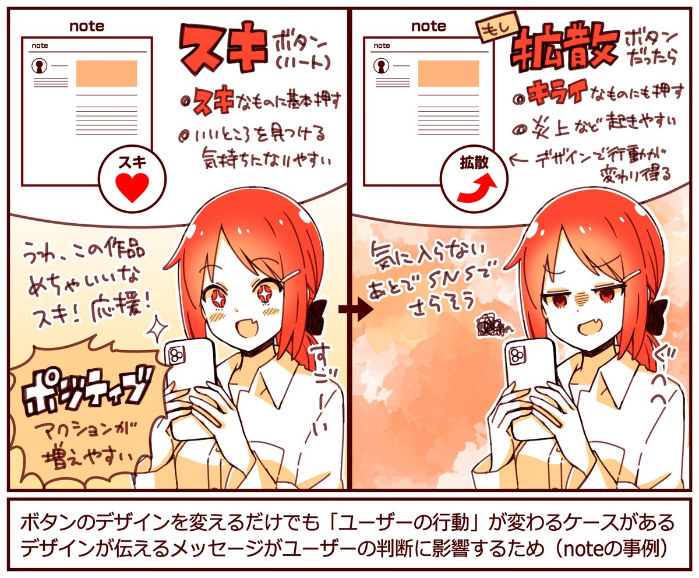

### ⸺ほかに、noteのデザインに関わる中で「ここは大事にしていた」というポイントがあれば、教えてください。

深津：  
重要なアクションをとったときに、**コミュニケーションが発生する or 発生しやすくなるようにするのは、僕の中では大事にしていますね。**

noteで重要なアクションを行うと、何かしら「人間の声」として認識できるコミュニケーションが返ってくるようになっています。スキを押したりチップを送ったら、「ありがとう」とか「イエーイ」と返ってきたり。

僕の勝手なイメージですが、インターネットCGM最大のペインというのは、**頑張ってつくったり、なにか話しかけたのに、それがネットの虚空に消えてこだまが返ってこないこと**だと思っていて。

そこに対して、ちょっとコーンって叩いたら、コーンって返ってくるような感覚が少しでもあることを大事にしました。

大きな話として集約すると、**インターネットのコミュニケーションの中に、背後にいる「人の気配」をちゃんと見えるようにしてあげること。**

ただの文章じゃなくて「向こうに人間がいるんだよ」と見えるようにすることを意識しましたね。

それが、2つ目の投稿をしてみようとか、noteって楽しいなと感じるキッカケにもなると思うので、そういうところを丁寧にやっていました。

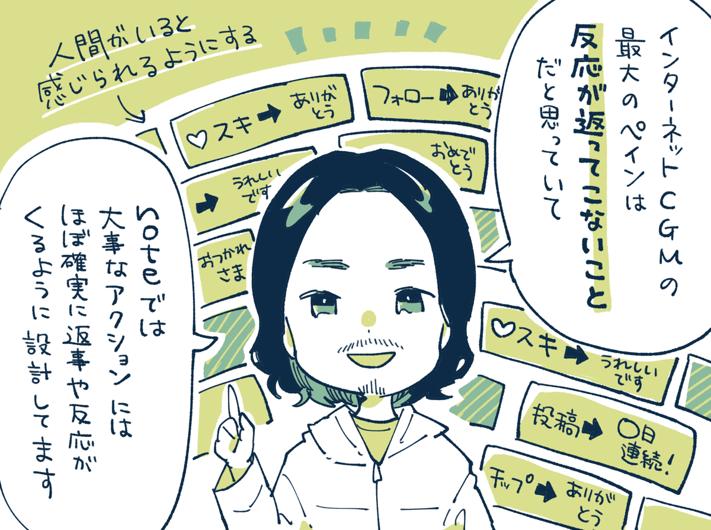

## サービスを「街」のように開発する話。

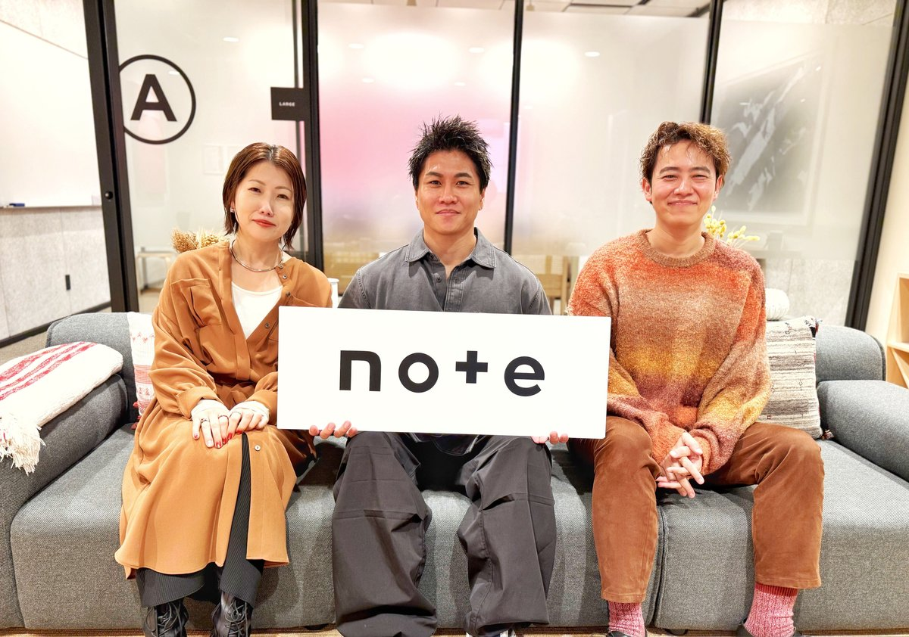

note株式会社 執行役員 Chief Design Officer 宇野 雄さん(右)、Principal Product Manager 安藤 徹さん(中央)、プロダクトマネジメント部長 山根 智子さん(左)

### ⸺サービス開発では、どんなことを意識して取り組んでいますか？

安藤：  
noteでは創作を中心とした**「街を目指している」という話をよくしますが、開発においても街にたとえながら進めるようにしています。**

おかげさまで、noteの会員数は1,050万人を突破しました。これからこの規模をさらに10倍、100倍へと拡大していきたいと考えています。

そのため街にたとえるなら、地道な整備を続けるだけでなく、インフラを抜本的に刷新したり、街の目玉となる建造物をつくったりと、noteという街を長期的な視点でつくり変えていくことも目指しています。

世の中の認識だと「会員数も多く、完成されたサービスだ」と思われる方も多いかもしれないのですが、われわれはそうは捉えていません。

noteを知らなかった人が、街に来る新たなきっかけになるものを作り、世界中の誰もが知っている街をつくり上げていきたいと強く思っています。

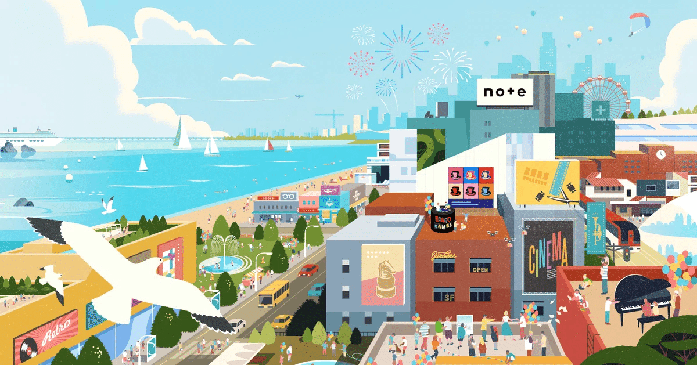

noteが目指す「創作の街」をイメージしたイラスト。

### ⸺街になぞらえると、開発にはどんな「良い影響」がありますか？

安藤：  
街になぞらえると、**「この機能は何のために作っていて、どんな人にどんな価値を届けたいのか？」という目的が、グッとわかりやすくなります。**

例えば、「街として考えるとこれは必要だよね」「この機能を街に置き換えるとこうだよね」といった具合に、コミュニケーションの中で共通言語として機能するようになります。

そのため、開発のストーリーラインも「街の中で何をつくるのか」を明確にしながら進めています。

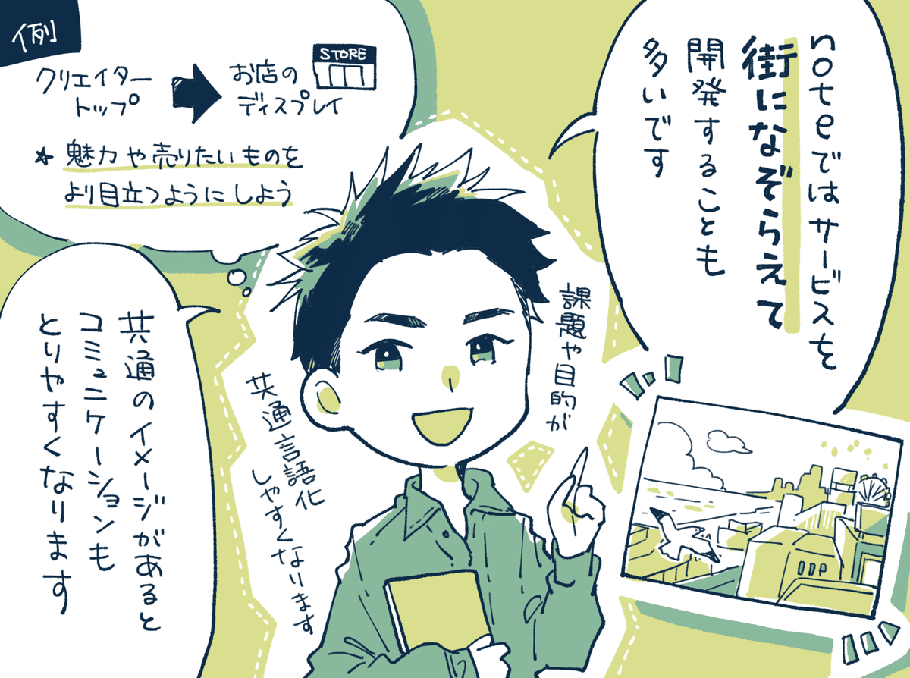

IDを持っている人は「noteに住所を持っていること」、有料記事を売ることは「お店を開くこと」、メッセージ機能は「街の中で手紙が出せること」のように例えている。

### ⸺具体的な、noteの「カイゼン事例」があれば教えてください。

宇野：  
noteには、初期から「サポートする」という機能があったのですが、2024年の11月に「チップで応援する」に変更したんですよね。

主に変わったのは「名称とアイコン」ですが、この変更によって**noteの流通総額における「チップが占める割合」が約15％ほど上昇しました。**※

> ※ 前年同期比の数値（2014年12月 - 2015年11月）

ポイントとしては、**チップになったことで「何が起こるか？」が想起できるようになったのが良かったのだと感じています。**

当初からあった「サポート」はとても愛されている機能でした。ただ「少しわかりにくい」「何が起きるかわからない」という課題もあって。

不安を感じて押せないという方や、押してみてもどうすれば良いかわからないから、離脱する方もいらっしゃいました。

チップにしたことで、ハードルを下げながらも、読者の方の感情が乗っけられるようなデザインにできたのが良かったのかなと。

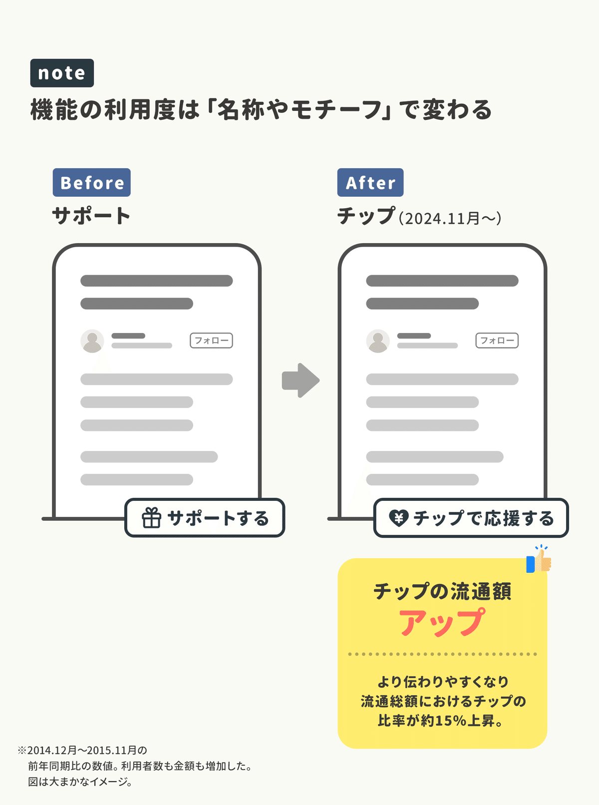

日本ではチップ文化は浸透していないが認知はされているためメタファーとして成立したという。

### ⸺アイコンのデザインは、なぜ「ハート＋お金」にしたのでしょう？

宇野：  
アイコンのデザインは、社内でも議論がありました。「金銭的な応援だと一定はわかるほうがいい。でも、お金っぽくなりすぎると違うね」とか。

議論する中で見えてきたのは、**これって「愛を伝えるためのお金なんだよね」みたいなところです。**本当に送りたいのって「お金」ではなくて、その人への「感謝や応援」なんだよねと。

正直、300円が送られても生活は変わらないかもしれないけど、**自分が公開したものに「ものすごく感動しました！」とチップを送ってもらえたら、その1日は幸せな気持ちになれたりもします。**

それは金銭的な報酬だけではなく、感情的なうれしさでもあり、それは次の記事を「さらに書いてみよう」と思うキッカケにもなります。

最終的には、**お金よりも先に「気持ち」があり、その形としてのお金なんだということで、ハート＋お金というデザインになりました。**

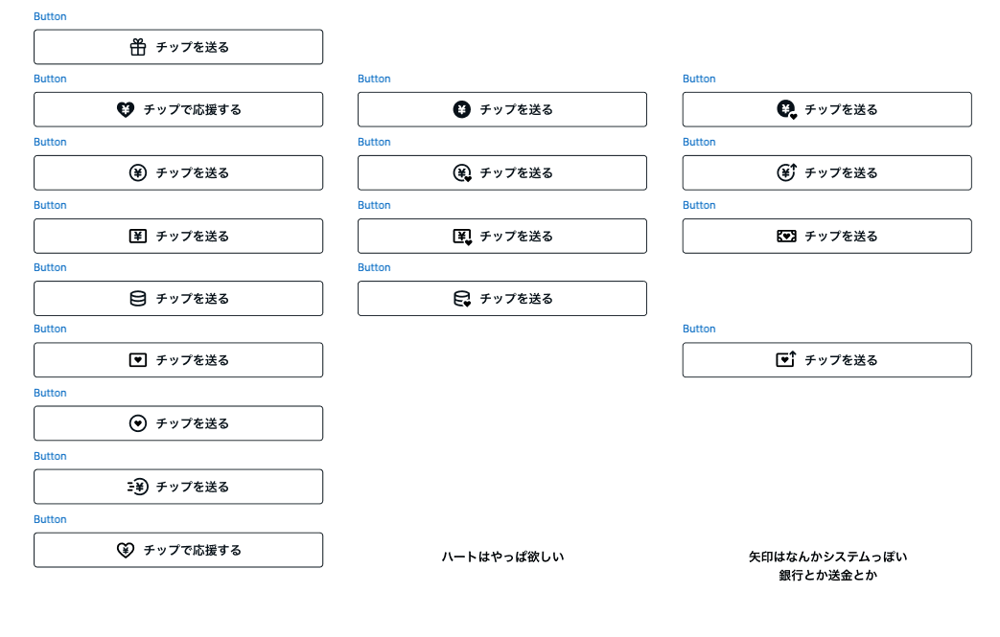

チップのアイコンデザインの候補。

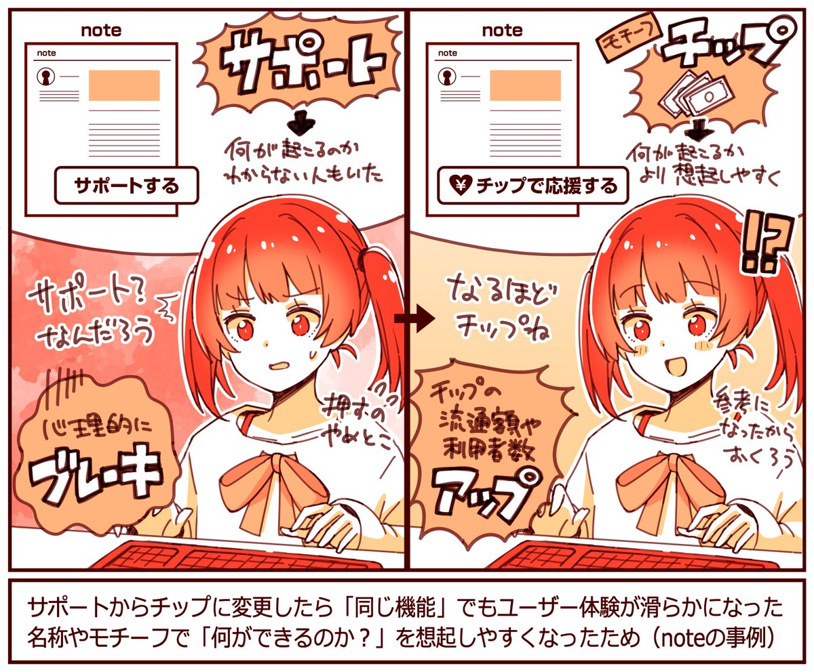

### ⸺ほかにも、工夫があれば教えてください。

山根：  
noteでは、「noteさん」という人格を設定することで、いろんな社員が機能の実装や表現をしたときにでも、noteらしさを保てるよう工夫しています。

2025年に、5つの投稿形式をひとつにまとめる変更を行ったのですが、その際の予告記事も「noteさん」を思い浮かべて何度も書き直しましたね。

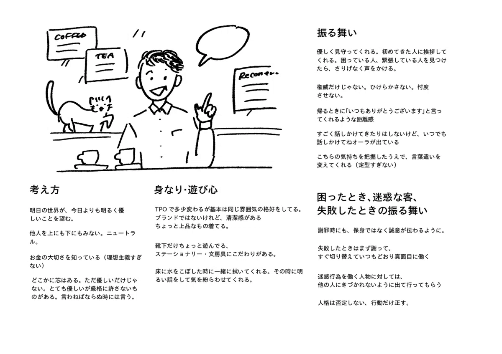

ワークショップですり合わせた「noteさん」の人格。

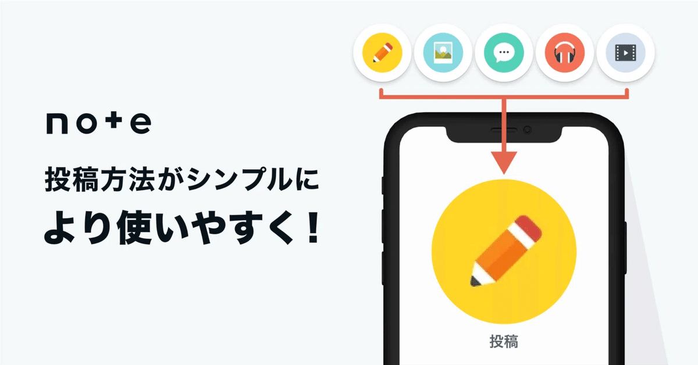

5つの投稿形式をひとつにまとめた。

例えば、記事の中に「統合されます」という表現があったのですが、それもちょっとカタイよねということで「1つにまとめます」にしました。

文調文体はすべて、「noteさんだったらこう言うよね」と考えながら、1つ1つチューニングしました。

できる限り丁寧に進めた結果、この変更はわれわれとしても大きな意思決定だったのですが、ポジティブな反応も多くいただけて嬉しかったです。

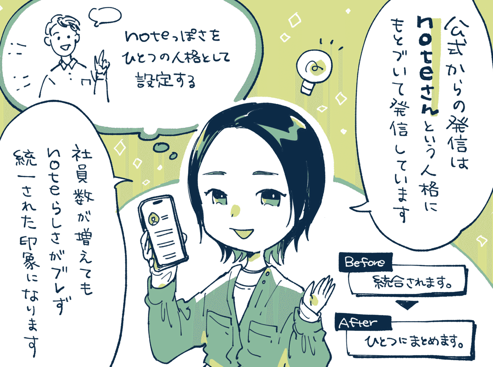

---

【取材協力】  
note株式会社：<https://note.jp/>  
note：<https://note.com/>

【告知】noteではさまざまな職種で採用を行っています。ご興味のある方は下記サイトよりご覧ください。

> ※ 以降は、＋αの【5つの事例】を購読会員向けにまとめています。  
> 【① **AIを活用してフィードバックを収集**する話】  
> 【② カスタマージャーニーは**物語で考えると綺麗につくれる**】  
> 【③ **サブKPIをつくると健全に成長しやすい話**】  
> 【④ 適切な**成長に導く"ミッション"をつくるコツ**】  
> 【⑤ マーケコストを下げる**ネーミングのヒント**】  
> など、ご興味あればご覧ください。

  

ダウンロード

 

copy

## ここから先は

2,493字
/
4画像

%22%20d%3D%22M-100-100h300v300h-300z%22%2F%3E%3C%2Fsvg%3E)

アプリやプロダクトの成功事例が学べるマガジンです。プロダクトの売上やユーザー数を伸ばしたい人にオススメです。成長プロダクトのインタビュー、効果のあったマーケティング施策、事例やデータなどが中心（月に7記事ほど）多くの過去記事も5年ほど遡って読めます。クレカ決済だと初月無料なのでお試しでもぜひ。

### [月刊アプリマーケティング](/m/mc375c9b46464)

¥2,000 / 月  
初月無料

プロダクト運営について学べるマガジンです。アプリやプロダクトの売上やユーザー数を伸ばしたい人にオススメです。月に7記事ほどお届けします。

購読手続きへ

%22%20d%3D%22M-100-100h300v300h-300z%22%2F%3E%3C%2Fsvg%3E)%22%20d%3D%22M-100-100h300v300h-300z%22%2F%3E%3C%2Fsvg%3E)%22%20d%3D%22M-100-100h300v300h-300z%22%2F%3E%3C%2Fsvg%3E)%22%20d%3D%22M-100-100h300v300h-300z%22%2F%3E%3C%2Fsvg%3E)

4人が高評価

[ログイン](https://note.com/cd/login?redirect_to=https%3A%2F%2Fmarkelabo.com%2Fn%2Fn6185334bfdbf)

   

* [#デザイン](https://note.com/hashtag/%E3%83%87%E3%82%B6%E3%82%A4%E3%83%B3)
* [#マーケティング](https://note.com/hashtag/%E3%83%9E%E3%83%BC%E3%82%B1%E3%83%86%E3%82%A3%E3%83%B3%E3%82%B0)

75

[%22%20d%3D%22M-100-100h300v300h-300z%22%2F%3E%3C%2Fsvg%3E)](/)

[アプリマーケティング研究所](/)

フォロー

プロダクトの成功事例を発信しているメディアです。2013年から約10年運営しています。取材相談はツイッターDM（@appmarkelabo）かメールにてどうぞ！info@appmarketinglabo.net