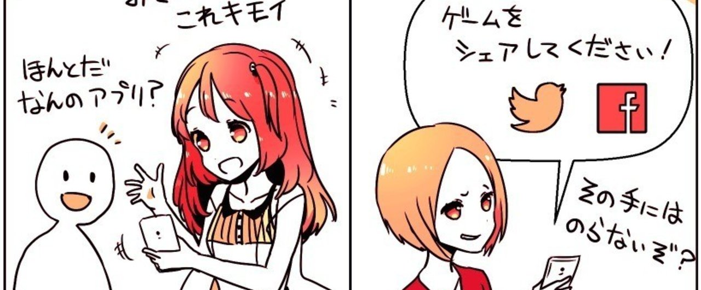
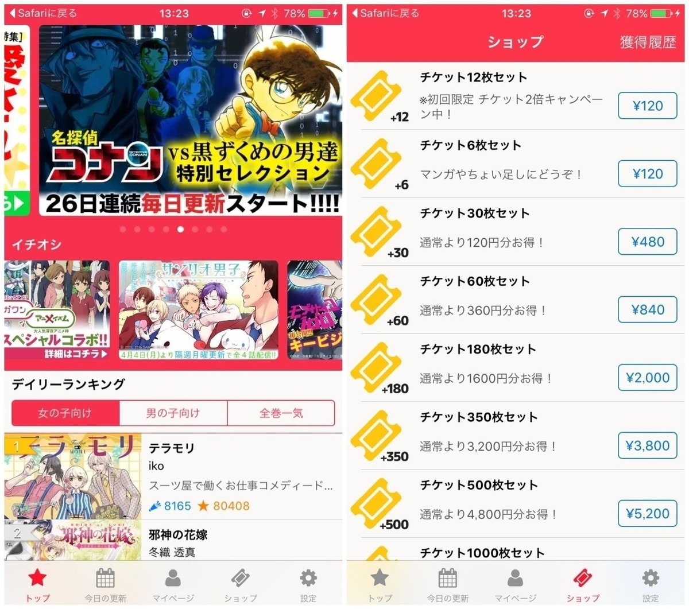
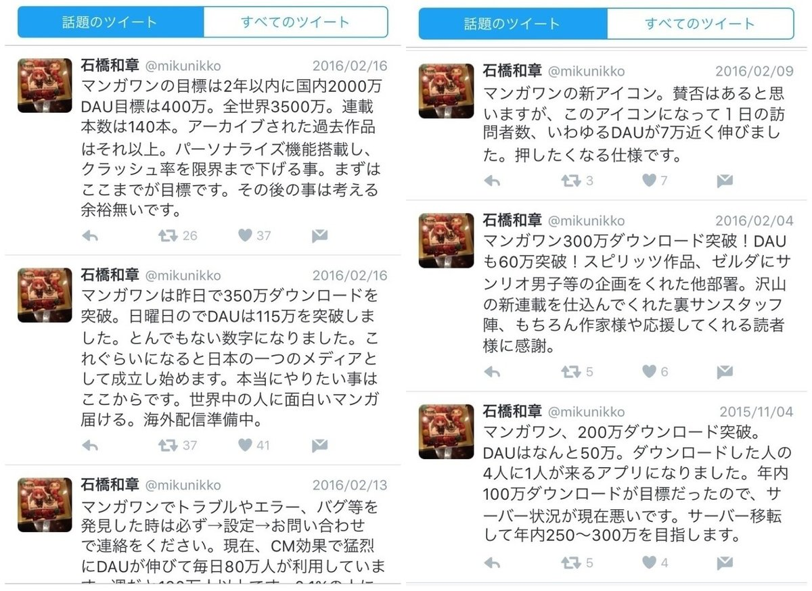
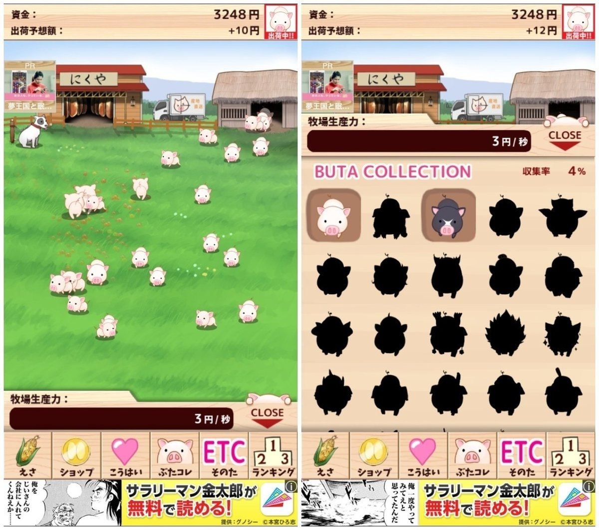
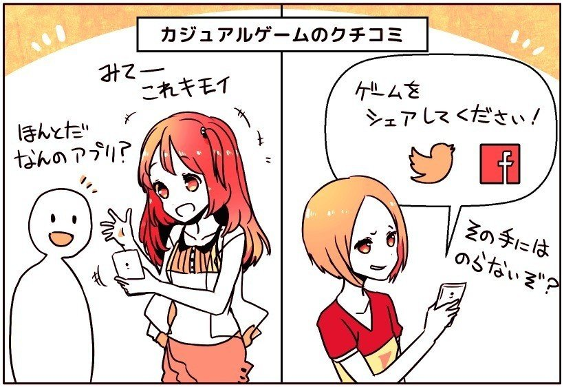
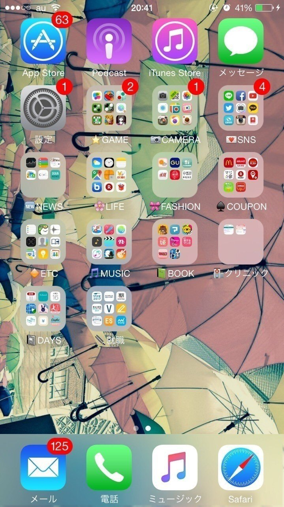

  

# 「アプリに課金するのは、負けた気がする」とある女子大生がぜったい課金しない理由（日本のスマホユーザー3）

3

[%22%20d%3D%22M-100-100h300v300h-300z%22%2F%3E%3C%2Fsvg%3E)](/)

[アプリマーケティング研究所](/)

2016年4月24日 18:53

購読中

日本のスマホユーザーインタビュー。今回は神奈川のアカネさん。21歳の大学生。つかっているスマホはiPhone6。

この記事のハイライト  
・SNSで「いいね」をもらうためにやっていること。  
・マンガやゲームアプリに、ぜったい課金しない理由。  
・「LINEミュージック」は、最初は無料だけど「ワナ」がある。  
・放置ゲーム「出荷ぶた」にハマった話、クチコミの仕方。

## 周りの友だちはiPhoneが多いですか？

周りはiPhoneとAndroidは半々くらいだと思います、「Androidがダサい」という雰囲気は、全然ないと思いますよ。

## よくつかっているSNSは？

LINE、ツイッター、インスタを毎日つかっています。Facebookは登録はしているけど、むずかしくて、つかっていないです。

## SNSのどんなところが楽しいですか？

やっぱり、ツイッターで「フォロー」「いいね」をもらえると嬉しいです。だから、ネタにする写真をわざわざ撮って、投稿したりもしていますよ。笑

このヘンな写真も学校でとりました。「プランキング」ていうんですけど。シュールでおもしろくないですか？ これは「35いいね」くらいつきました。

> ※上の写真は、学校の授業中っぽく、周りに協力してもらい、撮影したとのこと。下はLINEスタンプ、「これに似てるでしょ？笑」みたいな意味。

## なるほど、おもしろいですね。

あと、友だちで「さえない男の子」を、わたしが髪をきってあげて、ビフォーアフターの写真をアップして、「いいね」をたくさんもらいました。

光を当てて、一番「盛れる角度」を探したり、 表情もそうですけど、イケメンっぽく写真も加工して、ぜんぶプロデュースしました。笑

ほかにも、SNSで「いいね」してもらうことも考えて、新しく上陸したお店に、いったりすることはありますね。

## 「インスタ」はどんなふうにつかいますか？

インスタは毎日つかっていますけど、「おしゃれな朝食」を投稿している、アカウントの人をフォローして、いっぱい「いいね」しています。

そうすると、相手もわたしの写真に「いいね」してくれるからです。だから、毎日作業のように、ひたすら「いいね」しています。笑

## ほかにハマっているアプリはありますか？

マンガアプリをよく読みます。「LINEマンガ」「マンガONE」「マンガボックス」とかですね。とくに「マンガONE」です。

「マンガONE」は、新規登録すると100話まで、無料でよめるんです。なので、妹とか母親のスマホを借りてまで、無料でよんだりします。

> ※「マンガONE」（小学館）の編集長のツイッターより。2月に350万ダウンロード、DAU 110万を突破していると。すごいですね。

## そうまでするのは、課金するのがイヤだから？

そう。課金するのは悔しいので、ぜったいにしません。

わたしはやらないですけど、違法ダウンロードで、マンガを読む人がいますよね。そういう人がいるのに、自分が課金するのは、すごく負けた気がします。

課金するとしたら、わたしはLINEスタンプだけ。といっても、600円くらいしか、課金したことないですけどね。

## 「LINEスタンプ」はいいんですか？

LINEスタンプはいいんです！ だって、LINEはずーっとつかうだろうし、自分の好きな「かわいいスタンプ」をつかえるなら、それはいいんですよ。

ほかは、課金しても「思い出」に残らないじゃないですか、とくにゲームはそうです。あとマンガは、紙の単行本なら、形に残るから許します。

## なるほど。

まえにコンビニのバイトやってたんですけど、土方みたいなひとが、iTunesカードを、1万円も買っているのをみて、悲しくなりました。

なんていうんですかね、「その1万円があれば、おいしいコース料理たべれるのに」って...。

## ほかにスマホをつかうとき、気にすることはありますか？

「通信制限」はすごく気にしますね。制限かかると、すごく致命的ですよ。LINEで画像さえも、送れなくなるし。

だから、学校で友だちとおもしろい動画をみるときは、「おまえのスマホで再生しろよ」みたいに、押し付けあいになります。笑

「LINEミュージック」とかも、最初の3ヶ月は無料でつかえるけど、あれも結局ワナなんですよ。すぐ通信制限に、かかっちゃうからです。

## 「スマホゲーム」はどんなのをやりますか？

ハマったのは「出荷ぶた」というゲームです。なんか、すごい気持ち悪いんですよ。ブタがうじゃうじゃ出てきて、出荷されちゃうんです。

なんだろう、「ほどよい気持ち悪さ」は、クセになりますね。「アルパカにいさん」とかもやったのですが、グロすぎてちょっと無理でした。

## 「出荷ぶた」はどういうところが楽しいんでしょうか？

「出荷ぶた」は、ゆるい感じであそべるのが、いいですね。まあ、ストレス解消ですね、レポートをやっているとき、1段落したら気分転換にやったり。

最近「LINE ブラウンファーム」をやってるのですが、それはちょっと義務っぽく感じるんですよ。「ログインボーナス」につられてしまったり。

## 友だちにゲームをクチコミすることはありますか？

ありますよ。「出荷ぶた」も学校で友だちにあったときに、「これ気持ち悪くない？」って見せたりしましたし。

でも、ツイッターとか、LINEのタイムラインへの、「シェアしよう！」みたいな、宣伝っぽいのはやりません。その手には乗りませんよ。笑

## ほかにスマホでやっていることは？

電車の中では、ずっとスマホやっていますね。スマホならぜんぶ無料なので。

でも、スマホをずっと、下見ながらやってると、「スマホブス」になるんですよ。ホウレイ線ができちゃう。「MERY」で読みました。気をつけないと。

もう「雑誌」なんて、ぜんぜん読まないです。雑誌が無料だったら読むと思います。目が疲れないですし、一目で情報がいっぱい入ってくるので。

## ホーム画面のスクリーンショット。

## 編集後記

LINEミュージックは「無料だけど、通信制限になるから、結局ワナ」というのは、なかなかリアルで、おもしろい意見だなと思いました。

課金も、違法で見ている人もいて、それと比べて「負けた気がする」というのも、つくり手からすると刺激的ですが、実際そういう人が大半なのでしょう。

「通信がたくさんかかる = 完全無料とは見なさない」という点など、新興国のユーザーと、日本の学生には、共通する点もあるのかもしれません。

  

ダウンロード

 

copy

## 高評価して応援しよう！

高評価

  

3

[%22%20d%3D%22M-100-100h300v300h-300z%22%2F%3E%3C%2Fsvg%3E)](/)

[アプリマーケティング研究所](/)

フォロー中

プロダクトの成功事例を発信しているメディアです。2013年から約10年運営しています。取材相談はツイッターDM（@appmarkelabo）かメールにてどうぞ！info@appmarketinglabo.net