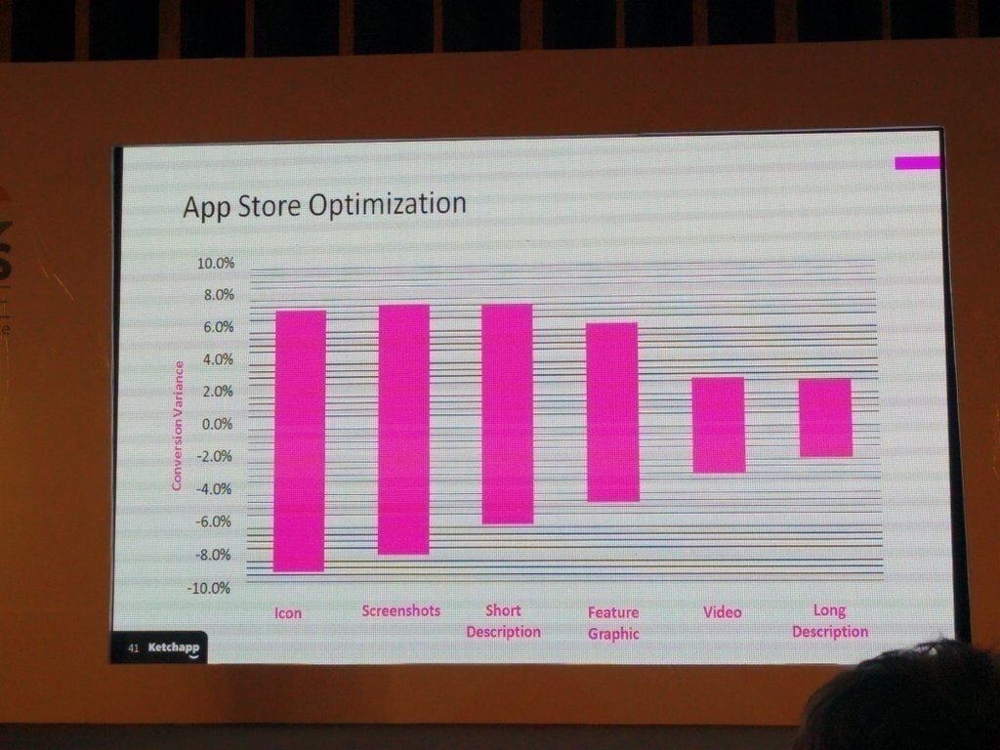
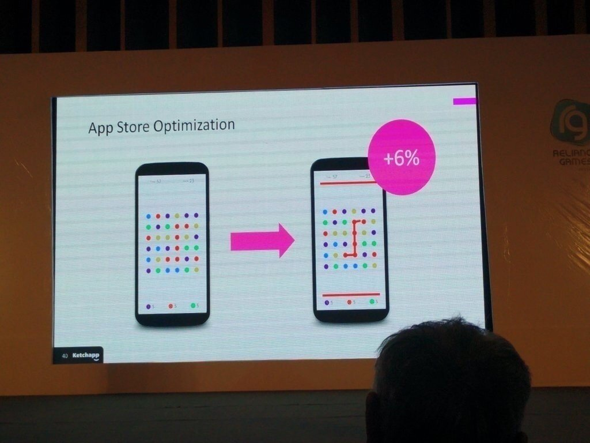
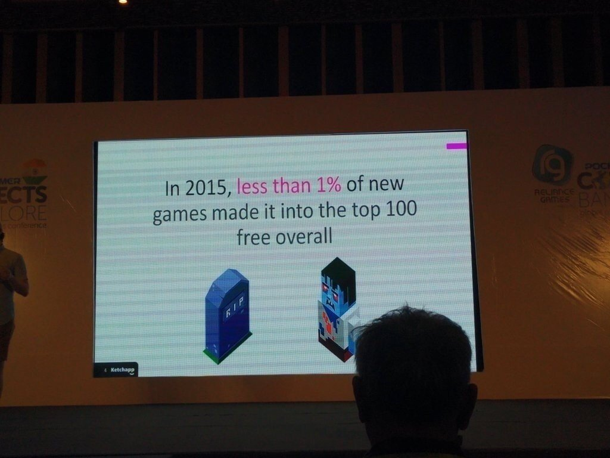
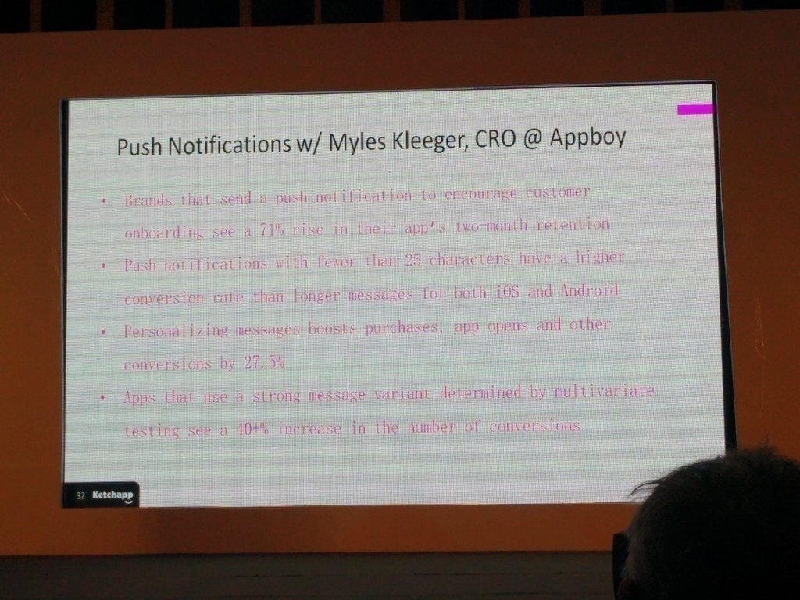
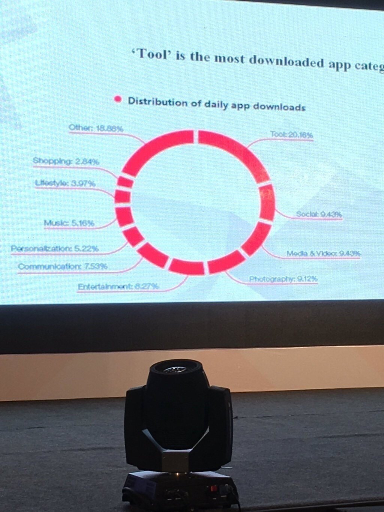
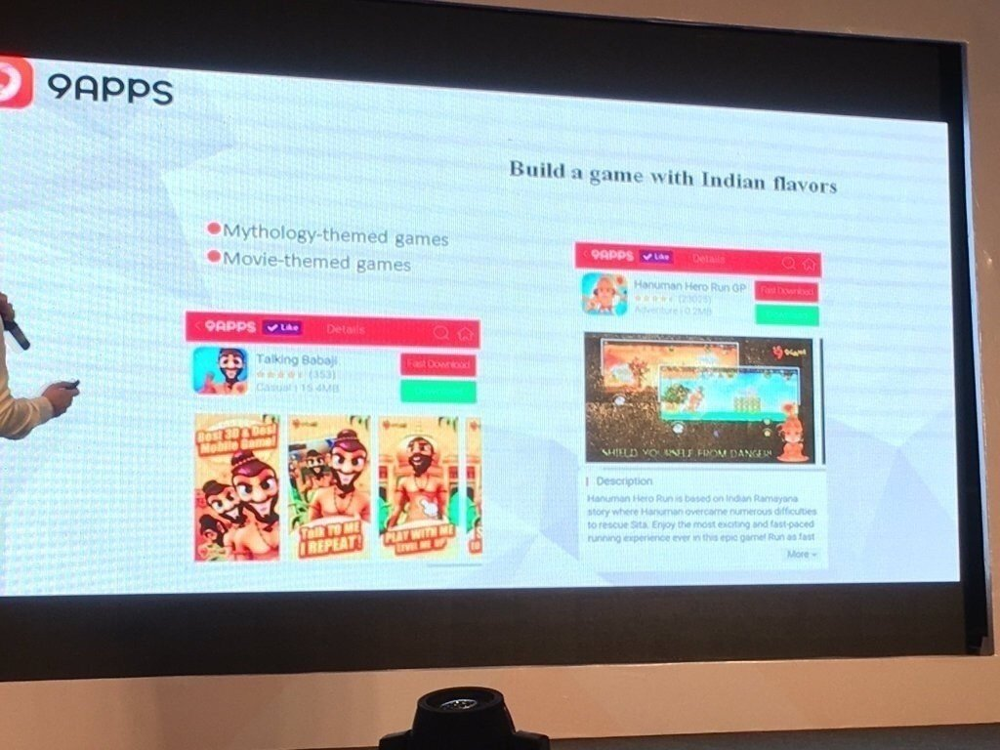
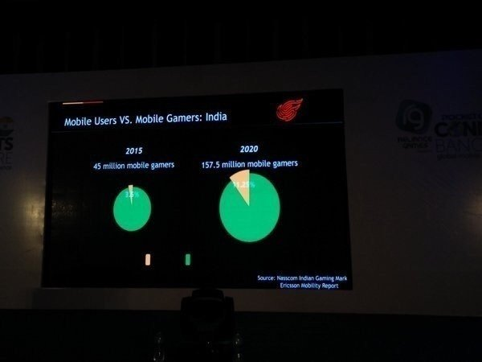
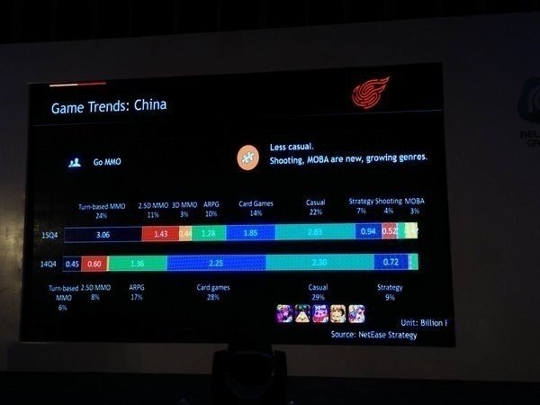
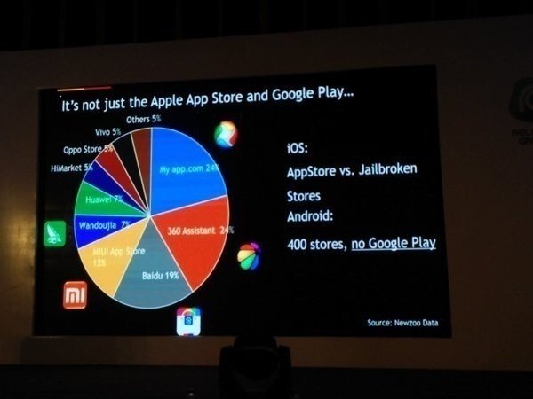
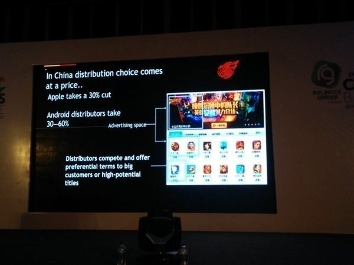

  

# カジュアルゲームアプリのASO影響データなど「Pocket Gamer Connect」in インド、気になった講演資料まとめ。

2

[%22%20d%3D%22M-100-100h300v300h-300z%22%2F%3E%3C%2Fsvg%3E)](/)

[アプリマーケティング研究所](/)

2016年4月26日 17:55

購読中

先日、インドのバンガロールで「Pocket Gamer Connect」という、ゲーム開発者向けカンファレンスがありました。

それのハッシュタグを、ツイッターで追いかけていて見つけた、おもしろい講演資料などをまとめています。

## カジュアルゲームのASOって、どのくらい効果あるの？

カジュアルゲームデベロッパー「Ketchapp」の講演より。ASOを行ったとき、各要素にどのくらい影響するか？というデータ。

結論、カジュアルゲームのダウンロード率に、一番影響するのは「アイコン」、つづいて影響値が大きいのが「スクリーンショット」だったと。

「動画」の影響値は、ほかに比べて大きくないので、ここを最適化するのは、コストパフォーマンス的には、合わなそうですね。

・アイコン -9%〜+6%  
・スクショ -8%〜+7%  
・説明文（短）-6%〜+7%  
・Feature Graphic -5%〜+5% （フィーチャー時のバナー画像？）  
・動画 -3%〜+6%  
・説明文（長）-2%〜+2%

「スクリーンショット」を変えたら、ダウンロード率が6％も変わりましたと。たしかに、右のほうがゲームもイメージしやすいし、楽しそうですね。

2015年において、無料トップ100に入る新ゲームアプリは、1%以下になっている。

プッシュ通知は、25文字以下にすると、よい反応率が得られる（iOSでもAndroidでも）

参考：<https://twitter.com/manas_gajare>

## インドのアプリ市場について

「9APPS」さんの講演より。インドで一番ダウンロードされている、アプリカテゴリは「ツール」である。

インドではボリウッドっぽいゲームが、来年はうまくいくのではないかと。

参考：<https://twitter.com/MikeFHines>

-----------

インドのモバイルゲームユーザー、2015年には4,500万人が、2020年には1.5億人まで増える見込み。

中国のゲームトレンド、この1年でカジュアルゲームは減り、シューティング、MOBA（マルチプレイヤーオンラインバトル）の市場が成長。

中国のAndroidアプリストアのシェア、Androidのストアは400くらいあるけれど、主要なものは以下のようなところだよと。

My app.com（24％）  
360 Assistant（24％）  
Baidu（19％）  
MIUI AppStore（13％）  
Wandoujia（7％）  
Huawei（7％）

中国ストアの掲載位置は「お金」で決まるという話。お金を払うか、ポテンシャルの高いアプリが、良い位置を獲得できると。

AppStoreの手数料は30％だけど、サードパーティーのAndroidアプリストアでは、30〜60％の手数料がかかるらしい。

参照：<https://twitter.com/mahi_sharmag8>

  

ダウンロード

 

copy

## 高評価して応援しよう！

高評価

  

2

[%22%20d%3D%22M-100-100h300v300h-300z%22%2F%3E%3C%2Fsvg%3E)](/)

[アプリマーケティング研究所](/)

フォロー中

プロダクトの成功事例を発信しているメディアです。2013年から約10年運営しています。取材相談はツイッターDM（@appmarkelabo）かメールにてどうぞ！info@appmarketinglabo.net