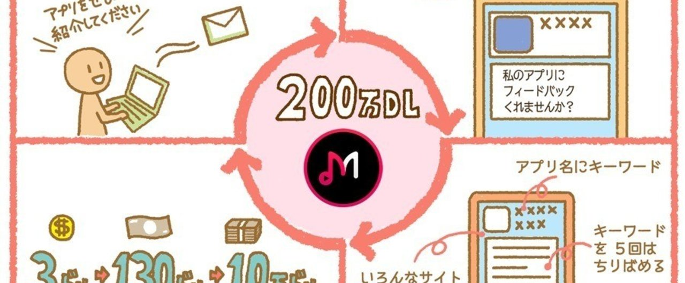
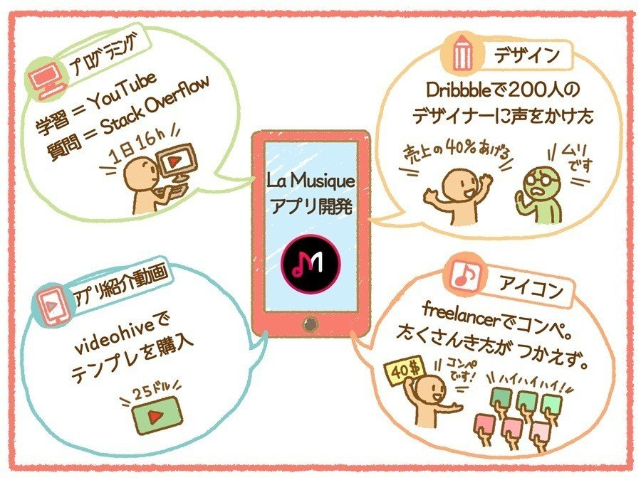
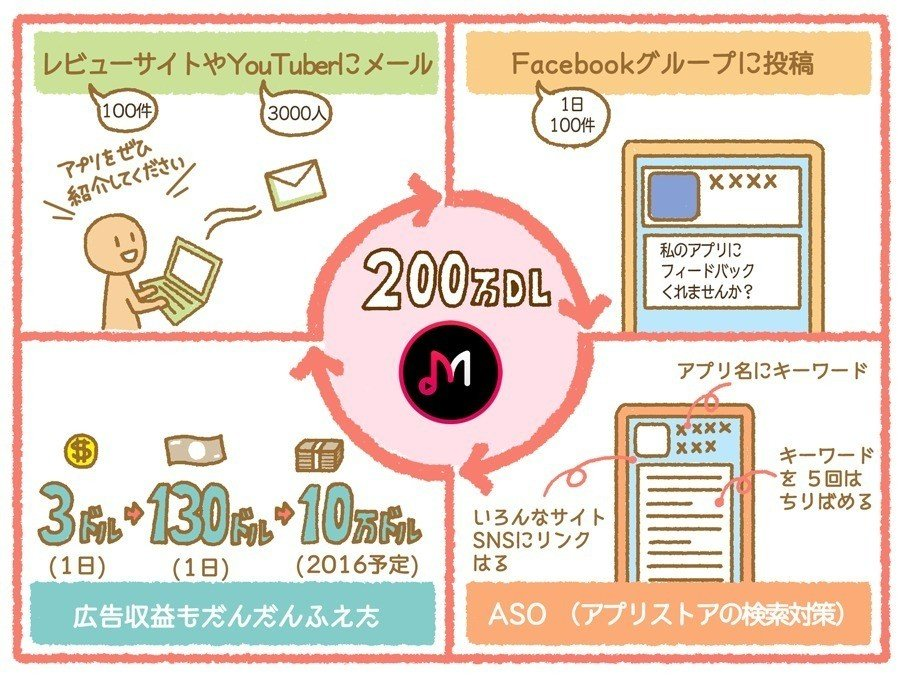
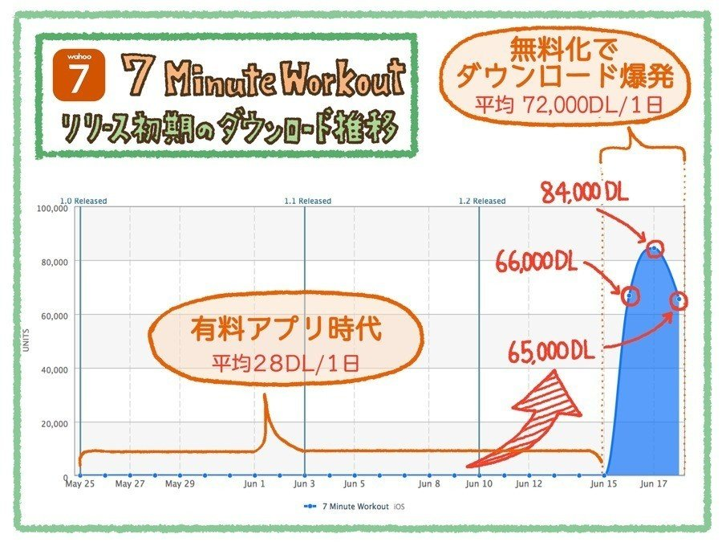
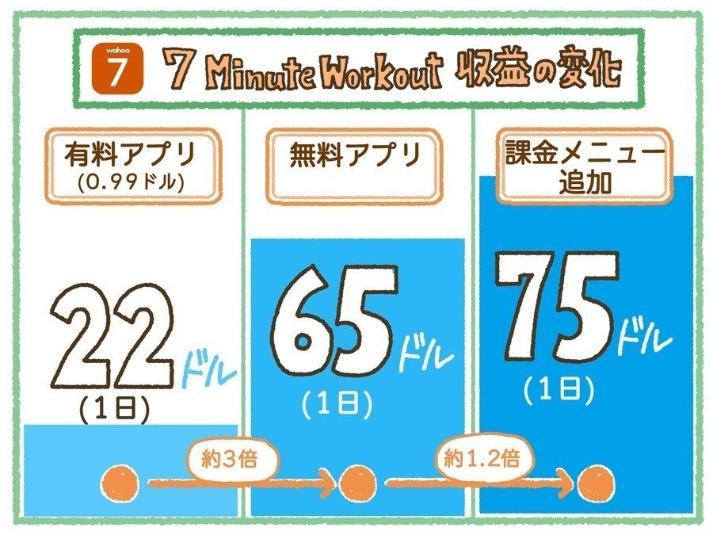
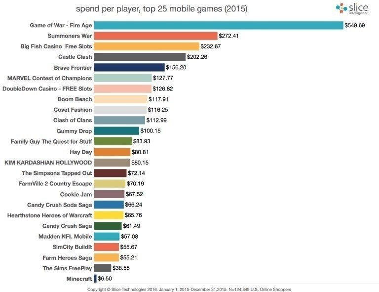
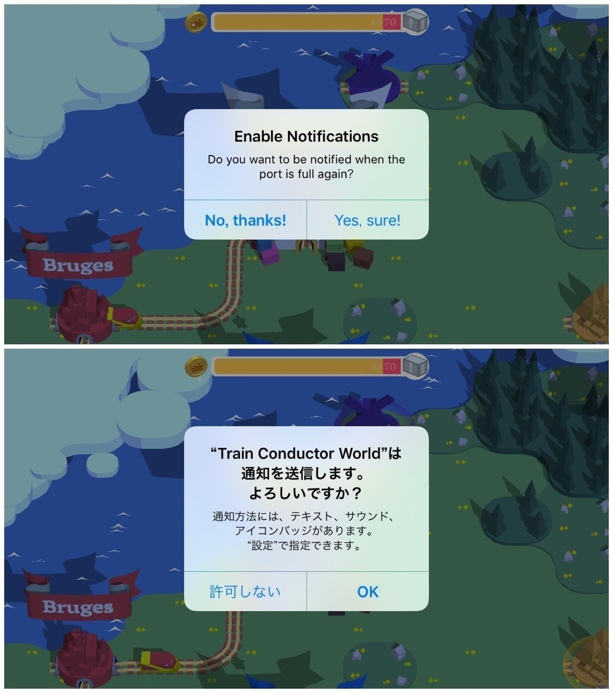
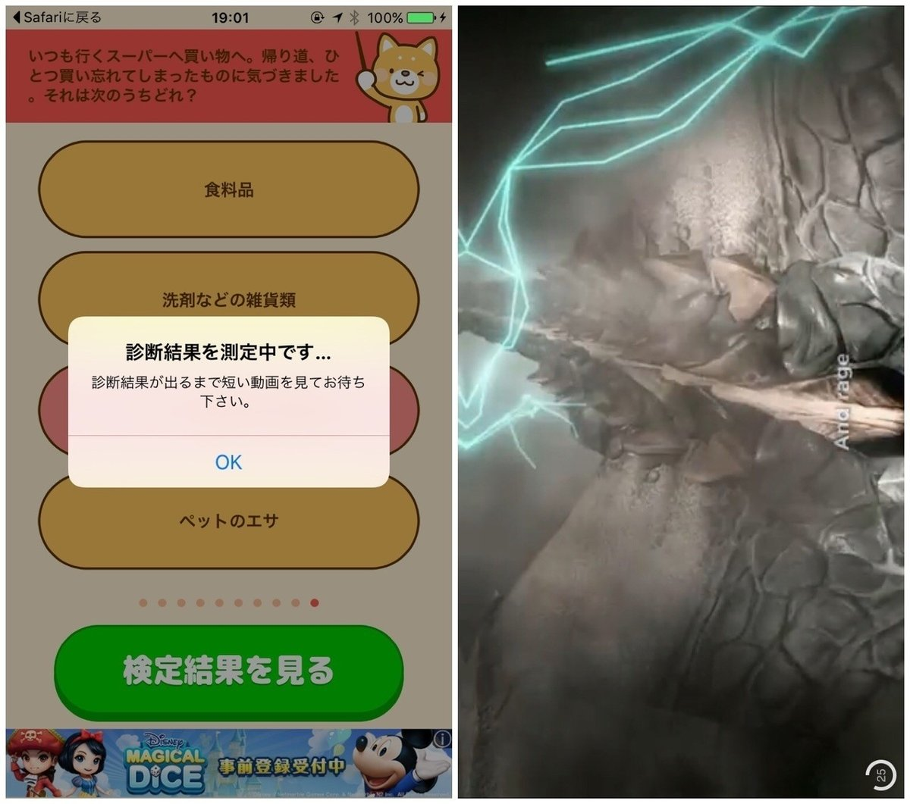
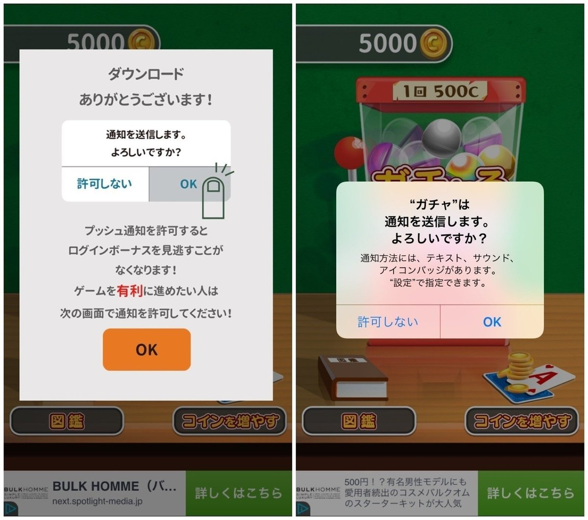
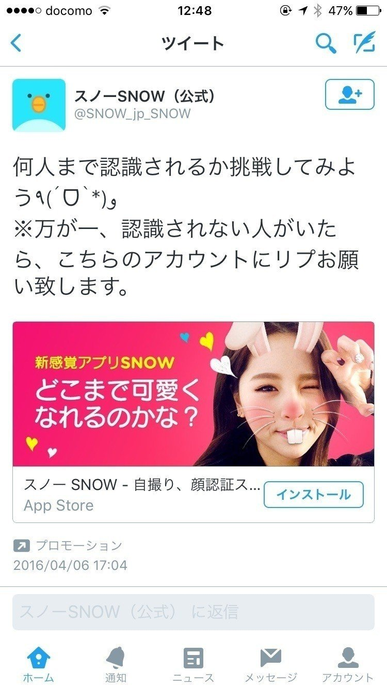

  

# 「手段をえらばない、インドのアプリ開発者が、ネットを駆使して200万ダウンロード達成」など、世界のアプリビジネス記事まとめ（4月）

7

[%22%20d%3D%22M-100-100h300v300h-300z%22%2F%3E%3C%2Fsvg%3E)](/)

[アプリマーケティング研究所](/)

2016年4月29日 18:17

購読中

今月読んだ、アプリ関連の記事（海外の記事が中心です）で、おもしろかったものなどを、ピックアップして紹介したいとおもいます。

この記事のトピックス  
１、手段をえらばないインド人のアプリが200万DL達成。  
２、アプリを無料化して、DL数が2,500倍になった話。  
３、海外レビューサイトにバナーを出すくらいなら○○をやれ。  
４、サウジアラビアにゲームを広めるときに気をつけるべきこと。  
５、ロシアにアプリを出すときにやるべきこと。  
６、プッシュ通知は「短いほど良い」というデータ。  
７、「Game of War」の1ユーザーあたりの課金額。  
８、海外アプリマーケ書籍でオススメされていたPRサービス。  
９、アプリのレビューを交換し合う無料サイト。  
１０、ゲームアプリのPRでオススメのツイッターのハッシュタグは？  
１１、今月気になったアプリの施策５（プッシュ通知の出し方、ツイッター広告でクチコミを発生させる方法、など）

## １、手段をえらばないインド人のアプリが、200万ダウンロード達成した話。

インド人のアプリ開発者がつくった「La Musique」（フランス語で「音楽」という意味）という、音楽プレイヤーアプリの話。

インドの大学生Ankitさんは、なんとまったくの未経験から、ネットを駆使しして、宣伝費をつかわず、200万ダウンロードを達成してしまいます。

**<アプリを開発するまでにやったこと>**  
・YouTube動画でプログラミングを勉強した、行き詰まったら「[Stack Overflow](http://stackoverflow.com/)」で質問、4〜5ヶ月かけて、アプリを完成させた。

・「[Dribble](https://dribbble.com/)」というサイトで、デザイナー200人に「収益の40％あげるからデザインしてくれ」と声をかけた。しかし、まったく誰も相手にされず。

・アプリ紹介動画は「[videohive](http://videohive.net/)」というサイトで、25ドル（3,000円くらい）でテンプレを買ってつくった。

・アイコンは「[Freelancer](https://www.freelancer.com/)」というサイトで、40ドル（5,000円くらい）でコンペを開催した。（たくさん応募があったが、どれもつかえなかった）

**<アプリのダウンロードを増やすためにやったこと>**

・Facebook（個人の）に友達を追加しまくって、1,000人まで伸ばした。

・「[Freelancer](https://www.freelancer.com/)」というサイトで、Facebookページの「いいね」を4万に増やした。しかし、これはすべて偽アカウントで、完全にムダになった。

・アプリのレビューサイト100件にメールを送った。アプリを紹介しているYouTuberをリストアップし、3,000人にメッセージを送った。

YouTuberへのメールは、一定の効果があったそうで、 “Music Player”と検索すると、上位（2位）に動画がでてくるようにもなった。

・世界中のFacebookグループに毎日100投稿した。宣伝と思われないよう「フィードバックください」と投稿。1日1,000 DLにつながった。

**<1年足らずで200万ダウンロードに到達>**

・そんなことを続けて、3ヶ月で1日10,000ダウンロード、安定的に入ってくるようになり、リリース1年以内で、200万ダウンロードに到達した。

・収益も1日130ドルまで成長。リリース6ヶ月で8,000ドル（約10万円）、そこから1年で50,000ドル（約600万円）稼げるようになった。

参考：<https://mng.lincolnwdaniel.com/how-my-first-app-got-2-million-downloads-within-first-year-without-spending-any-money-4bbc83d39b5#.nn6noffds>

> Facebookグループに投稿しまくって、1日1,000DLになった話は、わりと衝撃でした（スパムにならないよう注意ですが）

## ２、アプリを無料化してみたら、短期的なダウンロード数が2,500倍になった話

「7 Minute Workout」（日本名は「7分ワークアウト」）というアメリカ発のフィットネスアプリのお話。無料化したらうまくいきはじめた。

**<アプリを無料化したらダウンロード数が激増>**

・当初は0.99ドル（120円）の有料アプリとして公開していたが、1日に平均28ダウンロードにしかならなかった。

・1ヶ月後に無料化してみたら、1日のダウンロード数が72,000（2,500倍）に。たった3日間で、21万ダウンロードも伸びた。

・結果、「有料アプリ」として売るよりも、「無料→アプリ内課金」のほうがうまくいった。無料ダウンロードから、2〜3％が課金してくれたそう。

**<収益性の変化など>**

・オーストラリアのAppStoreでフィーチャーされた。1日10,000〜15,000ダウンロードのプラス、売上も1日100ドル（10,000円くらい）プラスされた。

・学校でアプリがつかわれる「Apple’s education program」に選ばれたことで、ダウンロード数が3日で、5,5000ダウンロードほど伸びた。

・有料の時は「22ドル/1日」だったが、無料化（フリーミアム）して「65ドル/1日」までアップ。その後、課金メニューも追加して「75ドル/1日」に。

・最終的には、230万DL、72,000ドル（約850万円）の収益になった。

参考：<https://medium.com/@stuartkhall/how-i-got-2-3m-app-downloads-without-spending-a-cent-on-marketing-f4823b6bc779#.wikzn5ral>

> 「課金メニューの追加」は、レビューで要望が多いものから、どんどん課金メニューに追加していったとのこと。

## ３、海外でのアプリ宣伝の定番はFacebook広告？

インディーゲームQAサイトでの「どのレビューサイトに、バナー広告を出したらいいかな？」という投稿。

それに対して、多くの回答者が「それならFacebook広告やれ」と返答していた。2週間で7,000円出稿して、ダウンロード400%になったアプリも。

参考：<http://forums.indiegamer.com/threads/how-effective-are-ads-on-major-review-sites.49009/>

> そういえば、クパチーノ（アップル本社のある街）にターゲティングして、Facebook広告を出稿する、という謎テクニックも、何かで見たことあります（アップル社員に見てもらい、フィーチャーしてもらおう的な）

## ４、サウジアラビアにゲームを広める方法

「サウジアラビアにゲームを広める方法」をまとめた記事。まずはアラビア語に翻訳すること（アラビア語のテキストは、右から左に進む）

女性の胸のサイズに気をつけること、人間キャラはポケモンのような中立的なデザインにする。

YouTuberの影響は絶大であると（160万フォロワーいる人も）サウジアラビアにもYouTuberがいるんですね。

参考：<http://venturebeat.com/2015/11/02/why-saudi-arabias-dolphins-and-whales-matter-to-the-gaming-industry/>

## ５、ロシアでアプリをだすときに知っておくべきこと。

ロシアのゲームアプリ市場について。人口は1.4億人いるが、英語の話者は11%しかいない。なので、必ずロシア語に翻訳すること。

スマホはAndroidが強い（Android 75%：iOS 12%）モバイルゲームアプリ市場は伸びてるが、課金よりも広告マネタイズのほうが現実的である。

Facebookではなく、[Vkontakte](https://vk.com/)というSNSが主流だそう。登録者は5,300万人。

なお、Vkontakteに比べると、Facebookはその半分以下、ツイッターは20%くらいの数しか、ユーザーがいないらしい。

参考：<http://gamasutra.com/blogs/DmitryTerekhin/20160210/265067/6_Things_To_Know_Before_Launching_Your_Mobile_Game_In_Russia.php>

## ６、プッシュ通知は短いほうがクリック率が高くなる

プッシュ通知のクリック率は、10単語以下 8.8%、11-20単語 4.9%、21単語以上 3.2%と長いほど、クリックされない。

これは英語での話なので、日本語に置き換えると「20〜30文字くらいにしよう」という感じでしょうか。

## ７、「Game of War」の課金額は圧倒的らしい。

モバイルゲームの年間化金額トップ25、課金額が圧倒的なのは「Game of War」（549ドル）なのだとか。

参考：<http://intelligence.slice.com/hardly-pocket-change-mobile-gamers-spend-an-average-of-87-dollars-on-in-app-purchases/>

## ８、海外のプレスリリースサービスはどこがメジャー？

「Mobile App Marketing And Monetization」（著 Alex Gabadinik）という、海外のアプリマーケティングの書籍より。

有名なプレスリリースサービスとして、[PRWeb.com](http://www.prweb.com) がオススメされていた。料金は159ドル〜いろんなサイトに配信してくれるよう。

## ９、AppStoreのレビューを交換投稿するサイト

アプリデベロッパー同士で、アプリのレビューを交換し合うサービス「[Favorr](https://favorr.io)」基本は無料でつかえるよう。

サイトに掲載されている、誰かのアプリのレビューを10つ投稿すると、自分もそのくらい書いてもらえるよ、みたいな感じ。

ただし、USのユーザーアカウントでの、レビューからしか対応してないそうなので、それをつくる必要はある。

## １０、海外ツイッターでオススメのハッシュタグ

Redditに投稿されていた「ゲームアプリはじめてつくったんだけど、何したらいいかな？」というスレッド。

「ツイッターで [#gamedev](https://note.com/hashtag/gamedev) [#indiedev](https://note.com/hashtag/indiedev) というタグをリツイートするボットがたくさんあるので、それをつけて投稿してみれば？」という回答。

たしかに、このハッシュタグで、海外のゲーム開発者が投稿してるのよく見かけます。（効果あるのかわからないですが）

参照：<https://www.reddit.com/r/gamedev/comments/4fuw5k/how_did_you_promote_your_game/>

## １１、気になったアプリの施策など

**１、プッシュ通知を出す前に「メリット」を説明する。**

プッシュの許諾を得る前に「ポイントが満タンになったら通知を得たいですか？」とワンクッションはさんで、メリットを伝える。

「[Train Conductor World](https://appsto.re/jp/fZkK3.i)」というカジュアルゲーム。

**２、ゲームで死ぬと「死んだところ」が記録される。**

「[Ball Maze!](https://appsto.re/jp/k3EC-.i)」というカジュアルゲーム。自分がこれまで死んだところが、オレンジのペンキで記録されていく、というアイデア。

「あ、あそこ死にポイントだから、気をつけよう」という気になる。ゲームのクリア率や、継続率に影響をあたえるかもしれない。

**３、わざと「待ち」を入れて広告を表示する。**

10問に回答して診断を見る、「[心の美男美女診断](https://appsto.re/jp/vgt9ab.i)」という日本のアプリ。

結果が表示される前に「診断結果を測定中です...それまで短い動画を見てお待ちください」と動画広告を入れている。

（おそらく、すぐに結果を表示できるけど、広告を入れるために「待ち」をつくってる。ちょっとずる賢いというか...。）

しかし、意外に自然な感じで、動画広告を見てしまった。実際、レビューを見ても「動画広告入れるな」みたいな文句は少ない。

**４、「ゲームを有利に進めるために」プッシュ通知ONにしてください。**

こちらもプッシュ通知の話。「[小学生あるあるガチャ](https://appsto.re/jp/8-0dbb.i)」という、内容はくだらないゲームなのだが、ダウンロード後に、プッシュ通知の促進をだしてた。

「見逃さないために」「ゲームを有利に進めるため」というキャッチが良さげだと感じた。（人間の「損したくない」という心理が刺激される）

**５、「SNOW」のツイッター広告の見せ方**

「SNOW」という、顔認識カメラアプリのツイッター広告。「何人まで認識されるか挑戦しよう」と友だちを巻き込ませ、クチコミ発生を狙っている。

参照：<https://twitter.com/snow_jp_snow/status/717624124508479489>

## 4月号のご購読ありがとうございました！

4月の更新はこれでおしまいです、お届けした記事は11記事でした。

１、[インスタの「LIKE」を増やすアプリをつかう理由](https://note.com/marketing/n/na8b18b215ac4)  
２、[「テレビの代わり」に1日に3時間つかっているアプリ](https://note.com/marketing/n/nc9693cc63bd4)  
３、[アプリストア検索からダウンロードを増やす、７つのASO情報まとめ](https://note.com/marketing/n/nc09333bfa719)  
４、[地方の女子大生が、スマホゲームをやるようになった理由](https://note.com/marketing/n/n9ca807358b1b)  
５、[約7,000円で、アプリのアンケートを、600件も回収していた方法。](https://note.com/marketing/n/n11a40853a8a6)  
６、[京都のオタク女性が恋愛ゲームアプリに月1万円課金した話](https://note.com/marketing/n/nff48630bf1b7)  
７、[「Downwell」パブリッシャーによるGDC講演](https://note.com/marketing/n/n3c44ebb93ccf)  
８、[アメリカの女子大生が語る「ねこあつめ」アプリの魅力](https://note.com/marketing/n/n893f1994d6a3)  
９、[「アプリに課金するのは負け」女子大生が課金しない理由](https://note.com/marketing/n/n1d3d80dff523)  
10、[「Pocket Gamer Connect」in インド 気になった資料まとめ](https://note.com/marketing/n/n4d0faf030dfd)  
11、アプリビジネス記事まとめ4月（この記事）

## 5月の予定コンテンツ

5月は以下のようなコンテンツを考えています（予定）。引き続きご購読いただける方は、よろしくお願いします！

・読者のアプリ（いくつか）を、YouTuberに実況してもらう的な企画。  
・日本のYouTuberリストをつくって共有してみる。  
・その他、スマホユーザーインタビュー、アプリマーケ情報 などなど。

あと、もし良かったらコメント欄に、「今月のこれがおもしろかった」「もっとこうして欲しい」など、感想やリクエストなどありましたら、書いてもらえると嬉しいです！ 今後の参考にしたく思います^^

  

ダウンロード

 

copy

## 高評価して応援しよう！

高評価

  

* [#gamedev](https://note.com/hashtag/gamedev)
* [#indiedev](https://note.com/hashtag/indiedev)

7

[%22%20d%3D%22M-100-100h300v300h-300z%22%2F%3E%3C%2Fsvg%3E)](/)

[アプリマーケティング研究所](/)

フォロー中

プロダクトの成功事例を発信しているメディアです。2013年から約10年運営しています。取材相談はツイッターDM（@appmarkelabo）かメールにてどうぞ！info@appmarketinglabo.net