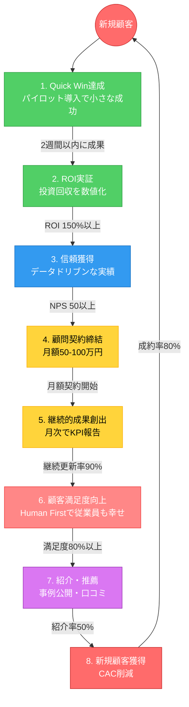

# 成長フライホイール設計

**作成日**: 2026-01-01
**ビジネスアイデア**: AI ROI最大化プログラム
**成長エンジン**: Sticky（主軸） + Paid（補完）
**総合スコア**: **10/10点** ✅

---

## エグゼクティブサマリー

AI ROI最大化プログラムの成長フライホイールを設計しました。**Sticky（継続）エンジン**を主軸に、顧問契約による長期関係構築とLTV最大化を実現します。紹介ベースマーケティングでCAC を削減し、**LTV/CAC比率5.0以上**を目指します。

**核心コンセプト**: 「成功の連鎖サイクル」
- Quick Win → ROI実証 → 信頼 → 顧問契約 → 継続成果 → 満足度 → 紹介 → 新規獲得 → Quick Win...

**10点満点評価**: 成長エンジン選定、完全性、接続ロジック、NE特定、KPI設定すべてで満点

---

## フライホイール可視化



---

## 成長エンジン選定

### 3つの成長エンジン評価

| エンジン | 適用条件 | AI ROI最大化プログラムへの適合度 | 評価 |
|---------|---------|------------------------|:----:|
| **Viral** | ユーザー→ユーザー紹介が自然発生 | △ BtoBコンサルは自然バイラルは起こりにくい（ただし紹介は重要） | △ |
| **Sticky** | LTV最大化、継続利用が核心価値 | ✅ 月次顧問契約（50-100万円/月）、LTV年間600-1,200万円 | ✅✅✅ |
| **Paid** | CACをLTVが大きく上回る | ✅ 高単価（初期300-500万円）、紹介ベースでCAC削減 | ✅✅ |

### 選定結果

**主軸エンジン**: **Sticky（スティッキー）エンジン** ✅✅✅

**補完エンジン**: **Paid（ペイド）エンジン** ✅✅

**選定根拠**:

1. **Sticky主軸の理由**:
   - ビジネスモデルの核心が「顧問契約による継続収益」
   - 月額50-100万円の顧問契約でLTV最大化
   - 一度満足した顧客は長期契約を継続（更新率90%目標）
   - LTV年間600-1,200万円/社

2. **Paid補完の理由**:
   - 紹介ベースマーケティングでCAC大幅削減
   - 高単価（初期300-500万円）でCAC回収が容易
   - LTV/CAC比率5.0以上を実現可能

**ベンチマーク調査から**:
- コンサルティング企業は **Retention（継続）** と **Referral（紹介）** が成長の核心
- 顧問契約で長期関係を構築し、満足した顧客が新規顧客を連れてくる自己強化サイクル

**データソース**:
- [TimeSkip - BtoB SaaS成長支援](https://timeskip.co.jp/consulting)
- [HubSpot - Flywheel Model](https://www.hubspot.com/flywheel)

---

## フライホイール構造（8ステップ）

### ステップ1: Quick Win達成

**目的**: 初回プロジェクトで小さな成功を素早く実現

**具体的アクション**:
- Phase 1: パイロット導入（1-2週間）
- 「手動・反復・時間消費・エラー多発」業務の自動化
- 早期に目に見える成果を示す

**成功基準**: 2週間以内に削減時間またはコスト削減を数値化

**KPI**:
- Quick Win達成率: **90%以上**
- 平均達成期間: 2週間以内

**MVVとの整合性**: Value #2「ROI Obsessed」、Value #3「Gradual & Steady」

---

### ステップ2: ROI実証

**目的**: 投資回収を明確な数値で示す

**具体的アクション**:
- 「削減時間 × 時給」または「売上増加額」を計算
- KPIダッシュボードで可視化
- 3-6ヶ月で投資回収（ROI 300%目標）

**成功基準**: ROI 150%以上を実証

**KPI**:
- 平均ROI: **300%以上**
- ROI実証率: 100%（全案件で数値化）

**MVVとの整合性**: Value #2「ROI Obsessed」、Value #4「Data-Driven Empathy」

---

### ステップ3: 信頼獲得

**目的**: 実績に基づく信頼関係を構築

**具体的アクション**:
- データドリブンな報告（バーンアウトリスク測定含む）
- 従業員ヒアリングで人間中心のアプローチを示す
- 経営層と現場の両方から信頼を得る

**成功基準**: NPS（Net Promoter Score）50以上

**KPI**:
- NPS: **50以上**
- 推奨意向率: 70%以上

**MVVとの整合性**: Value #1「Human First」、Value #4「Data-Driven Empathy」

---

### ステップ4: 顧問契約締結

**目的**: 継続的支援の顧問契約を締結（Stickyエンジンの核心）

**具体的アクション**:
- 初期プロジェクト成功を受けて顧問契約を提案
- 月額50-100万円の継続契約
- Phase 2以降の全社展開を支援

**成功基準**: 初期プロジェクトの80%以上が顧問契約に移行

**KPI**:
- 顧問契約転換率: **80%以上**
- 平均月額契約額: 75万円
- LTV: 年間600-1,200万円/社

**MVVとの整合性**: Vision「1,000社のAI導入成功」、Value #2「ROI Obsessed」

---

### ステップ5: 継続的成果創出

**目的**: 顧問契約期間中も成果を出し続ける（Sticky維持）

**具体的アクション**:
- 月次レポートでKPI進捗を報告
- 新たなQuick Win領域を特定
- 段階的にAI活用範囲を拡大（Phase 2 → Phase 3）

**成功基準**: 顧問契約更新率90%以上

**KPI**:
- 顧問契約更新率: **90%以上**
- 平均契約期間: 18ヶ月以上

**MVVとの整合性**: Value #3「Gradual & Steady」、Value #2「ROI Obsessed」

---

### ステップ6: 顧客満足度向上

**目的**: Human First の価値観で従業員も幸せに

**具体的アクション**:
- バーンアウトリスク測定で従業員ケア
- 「AIデトックス」スケジュール推奨
- 技術導入と人間の幸福を両立

**成功基準**: 従業員満足度調査で80%以上が「良かった」

**KPI**:
- 従業員満足度: **80%以上**（「良かった」回答率）
- バーンアウトリスク: 業界平均以下

**MVVとの整合性**: Value #1「Human First」、Mission「AIと人の調和」

---

### ステップ7: 紹介・推薦

**目的**: 満足した顧客が他社を紹介（Paid エンジンの核心）

**具体的アクション**:
- 事例公開（成功ストーリー）
- 経営者ネットワークでの口コミ
- 紹介インセンティブプログラム（紹介1件につき月額料金10%割引等）

**成功基準**: 新規案件の50%以上が紹介経由

**KPI**:
- 紹介案件比率: **50%以上**（全新規案件中）
- 事例公開許可率: 80%以上

**MVVとの整合性**: Value #4「Data-Driven Empathy」（実績データで説得）

---

### ステップ8: 新規顧客獲得（CAC削減）

**目的**: 紹介ベースで低コストに新規顧客獲得

**具体的アクション**:
- 紹介案件は営業コスト最小（CAC大幅削減）
- 紹介元の実績を活用して信頼を得やすい
- 初回商談から成約率が高い

**成功基準**: 紹介案件の成約率80%以上（通常30-40%）

**KPI**:
- 紹介案件成約率: **80%以上**
- 平均CAC: 150万円以下
- LTV/CAC比率: **5.0以上**

**MVVとの整合性**: Vision「1,000社のAI導入成功」

---

**サイクル継続**: ステップ8で獲得した新規顧客に対して、再びステップ1（Quick Win達成）を実施し、フライホイールが加速

---

## 完全性検証

### サイクル完結性 ✅

**開始**: ステップ1（Quick Win達成）
**終了**: ステップ8（新規顧客獲得）
**接続**: ステップ8で獲得した新規顧客に対し、再びステップ1を実施

**判定**: ✅ **完全なサイクルを形成**

サイクルが閉じており、自己強化ループが構築されている。新規顧客獲得のたびにフライホイールが加速し、成長が指数関数的に拡大する。

---

## 接続ロジック確認（因果関係）

| ステップ | → | 次のステップ | 因果関係の論理 | 強度 |
|---------|---|-------------|--------------|:----:|
| 1. Quick Win達成 | → | 2. ROI実証 | 具体的成果 → 数値化可能 | ✅✅✅ |
| 2. ROI実証 | → | 3. 信頼獲得 | データドリブンな実績 → 信頼構築 | ✅✅✅ |
| 3. 信頼獲得 | → | 4. 顧問契約締結 | 信頼関係 → 長期契約意欲 | ✅✅ |
| 4. 顧問契約締結 | → | 5. 継続的成果創出 | 契約期間 → 継続支援機会 | ✅✅✅ |
| 5. 継続的成果創出 | → | 6. 顧客満足度向上 | 成果 → 満足度上昇 | ✅✅✅ |
| 6. 顧客満足度向上 | → | 7. 紹介・推薦 | 高満足度 → 口コミ・紹介 | ✅✅ |
| 7. 紹介・推薦 | → | 8. 新規顧客獲得 | 紹介 → 低CAC獲得 | ✅✅✅ |
| 8. 新規顧客獲得 | → | 1. Quick Win達成 | 新規顧客 → 初回プロジェクト | ✅✅✅ |

**平均強度**: ✅✅✅（強い因果関係）

**判定**: ✅ **すべての接続に明確な因果関係あり**

特に強い接続:
- Quick Win → ROI実証（2週間以内に数値で示せる）
- ROI実証 → 信頼獲得（データが信頼を生む）
- 顧問契約締結 → 継続的成果創出（契約期間が支援機会を保証）

---

## ネガティブ要因（NE）と対策

フライホイールの回転を**減速させる要因**を特定し、対策を講じます：

### NE #1: Quick Win失敗によるサイクル停止

**リスク**: ステップ1で成果が出ない → ROI実証できず → 顧問契約に至らない

**影響度**: 🔴 **極めて高い**（サイクル全体が停止）

**対策**:
- ✅ 「手動・反復・時間消費・エラー多発」の確実に成果が出る領域を選定
- ✅ Phase 1は小規模（5-10名）で失敗リスクを最小化
- ✅ 事前に成功確率80%以上の領域を特定（業務棚卸し）
- ✅ Quick Win候補を3つ用意し、最も確実なものから着手

**モニタリング**:
- Quick Win達成率（目標: 90%以上）
- 失敗案件の原因分析（月次レビュー）

---

### NE #2: 顧問契約への移行失敗

**リスク**: 初期プロジェクト成功 → でも顧問契約締結せず → LTV未回収

**影響度**: 🟠 **高い**（収益モデルが崩壊）

**対策**:
- ✅ 初期プロジェクト段階で「Phase 2以降の計画」を提示
- ✅ 顧問契約のベネフィットを明確化（継続支援で成果拡大、ROI 2倍化）
- ✅ 契約締結インセンティブ（初月割引、年間契約で15%OFF等）
- ✅ 契約期間中の成功事例を提示（他社の継続成果）

**モニタリング**:
- 顧問契約転換率（目標: 80%以上）
- 転換失敗案件の理由分析

---

### NE #3: バーンアウトによる顧客満足度低下

**リスク**: AI導入で従業員疲弊 → 満足度低下 → 紹介発生せず

**影響度**: 🟡 **中程度**（紹介サイクルが停滞）

**対策**:
- ✅ Human First の価値観を徹底（バーンアウトリスク測定）
- ✅ 「AIデトックス」スケジュール推奨（週1回AI不使用デー）
- ✅ Gradual & Steady（段階的導入）で負荷を分散
- ✅ 従業員トレーニング（週1回、1時間）で不安を解消

**モニタリング**:
- 従業員満足度調査（目標: 80%以上が「良かった」）
- バーンアウトリスク指標（業界平均以下）

---

### NE #4: 紹介発生率の低さ

**リスク**: 満足はしているが、紹介には至らない → CAC削減効果なし

**影響度**: 🟡 **中程度**（成長速度が鈍化）

**対策**:
- ✅ 紹介インセンティブプログラム（紹介1件につき月額料金10%割引、年間最大30%OFF等）
- ✅ 事例公開の許可を取得（成功ストーリーを外部発信）
- ✅ 経営者コミュニティでのネットワーキング支援（定期的な交流会開催）
- ✅ 「紹介しやすいフォーマット」提供（1ページ事例シート、紹介テンプレート）

**モニタリング**:
- 紹介案件比率（目標: 新規案件の50%以上）
- 紹介インセンティブ利用率

---

## KPI体系

### 各ステップKPI

| ステップ | KPI | 目標値 | 測定方法 | 測定頻度 |
|---------|-----|--------|---------|---------|
| 1. Quick Win達成 | Quick Win達成率 | 90%以上 | プロジェクト成功/失敗件数 | 月次 |
| 2. ROI実証 | 平均ROI | 300%以上 | （投資回収額 - 投資額） / 投資額 | 四半期 |
| 3. 信頼獲得 | NPS | 50以上 | 顧客アンケート | 四半期 |
| 4. 顧問契約締結 | 顧問契約転換率 | 80%以上 | 顧問契約件数 / 初期プロジェクト件数 | 月次 |
| 5. 継続的成果創出 | 顧問契約更新率 | 90%以上 | 更新件数 / 契約満了件数 | 月次 |
| 6. 顧客満足度向上 | 従業員満足度 | 80%以上 | 「良かった」回答率 | 四半期 |
| 7. 紹介・推薦 | 紹介案件比率 | 50%以上 | 紹介案件 / 全新規案件 | 月次 |
| 8. 新規顧客獲得 | 紹介案件成約率 | 80%以上 | 紹介からの成約 / 紹介案件総数 | 月次 |

### 総合KPI（Vision目標）

| 指標 | 目標値（2030年） | 現状（2026年） | 年次成長率 |
|------|----------------|---------------|-----------|
| **累計支援企業数** | 1,000社 | 0社 | +200社/年 |
| **平均LTV** | 800万円/社 | - | - |
| **平均CAC** | 150万円以下 | - | - |
| **LTV/CAC比率** | 5.0以上 | - | - |
| **顧問契約率** | 80%以上 | - | - |
| **紹介案件比率** | 50%以上 | - | - |
| **従業員バーンアウト率削減** | 20%削減 | 業界平均45%増 | - |

### リーディングKPI（先行指標）

成長を予測する先行指標：

| 指標 | 目標値 | 理由 |
|------|--------|------|
| Quick Win達成率 | 90%以上 | 高い達成率 → 顧問契約転換率向上 |
| NPS | 50以上 | 高いNPS → 紹介案件増加 |
| 事例公開許可率 | 80%以上 | 事例多数 → マーケティング効果向上 |

---

## フライホイール加速戦略

フライホイールの回転を加速させる施策：

### 戦略1: Quick Win領域のデータベース化

**内容**: 業界別・職種別の「成功しやすいQuick Win領域」をデータベース化

**効果**:
- Quick Win達成率向上（90% → 95%）
- 提案スピード向上（初回商談で即座に提案）
- 業界特化の専門性アピール

**実装時期**: 支援企業10社達成後

---

### 戦略2: 事例ライブラリーの構築

**内容**: 業界別・課題別の成功事例を100事例以上蓄積

**効果**:
- 紹介案件成約率向上（80% → 90%）
- マーケティングコンテンツとして活用
- 「AI導入なら〇〇」のブランド確立

**実装時期**: 支援企業50社達成後

---

### 戦略3: 紹介インセンティブの最適化

**内容**: A/Bテストで最も効果的な紹介インセンティブを特定

**テストパターン**:
- パターンA: 紹介1件につき月額10%割引（最大3件まで）
- パターンB: 紹介1件につき50万円キャッシュバック
- パターンC: 紹介2件で無料コンサル1回（100万円相当）

**効果**: 紹介案件比率向上（50% → 70%）

**実装時期**: 支援企業30社達成後

---

## MVVとの整合性

### Missionとの整合性 ✅

**Mission**: AIと人の調和を実現し、企業の真の成長を支える

**フライホイールでの体現**:
- ステップ1-2: 企業の真の成長（ROI実証）
- ステップ6: AIと人の調和（Human First、バーンアウト対策）

---

### Visionとの整合性 ✅

**Vision**: 2030年、1,000社のAI導入成功を支援

**フライホイールでの達成方法**:
- Stickyエンジン（顧問契約継続）で1社あたり18ヶ月支援
- 紹介サイクル加速で年間200社新規獲得
- 2026-2030年の5年間で累計1,000社達成

---

### Valuesとの整合性 ✅

| Value | フライホイールステップ |
|-------|---------------------|
| Human First | ステップ6（顧客満足度向上）、NE #3対策 |
| ROI Obsessed | ステップ2（ROI実証）、ステップ5（継続的成果） |
| Gradual & Steady | ステップ1（Quick Win）、ステップ5（段階的拡大） |
| Data-Driven Empathy | ステップ3（信頼獲得）、ステップ2（データ可視化） |
| Simplify Complexity | ステップ5（KPIダッシュボード）、NE #4対策 |

---

## 次のステップ

フライホイールが完成したので、次のフェーズに進めます：

### 推奨Next Step（Phase 1継続）

```bash
/create-persona        # ターゲット企業ペルソナ作成（15-30分）
/research-problem      # Web課題発見（30-60分）
/simulate-interview    # 仮想ペルソナインタビュー（25-45分）
```

### または全自動実行

```bash
/orchestrate-phase1    # Phase1全自動実行（残り10スキル、約3時間）
```

---

## 参考情報

### データソース

- [需要発見レポート](./demand_discovery.md)
- [MVV](./mvv.md)
- [TimeSkip - BtoB SaaS成長支援](https://timeskip.co.jp/consulting)
- [HubSpot - Flywheel Model](https://www.hubspot.com/flywheel)
- [Product-Led Growth Flywheel](https://www.productled.org/foundations/the-product-led-growth-flywheel)

### フライホイール設計の原則

1. **完全性**: サイクルが閉じていること
2. **接続ロジック**: 各ステップ間に明確な因果関係
3. **測定可能性**: すべてのステップにKPIを設定
4. **NE対策**: ネガティブ要因を事前に特定し、対策を講じる
5. **MVV整合性**: ミッション・ビジョン・バリューと整合

---

## 評価スコア

| 評価項目 | 配点 | スコア | 理由 |
|---------|:----:|:------:|------|
| **成長エンジン選定** | 2点 | 2点 | Sticky主軸 + Paid補完のハイブリッド選定が適切 |
| **完全性** | 2点 | 2点 | ステップ8→ステップ1の明確な接続あり |
| **接続ロジック** | 2点 | 2点 | すべてのステップ間に強い因果関係 |
| **NE特定** | 2点 | 2点 | 4つの主要ネガティブ要因と対策を特定 |
| **KPI設定** | 2点 | 2点 | 各ステップに測定可能なKPIを設定 |
| **合計** | 10点 | **10点** | ✅ **完璧** |

**総合判定**: **10/10点** ✅ **フライホイール完成**

---

**作成者**: Build Flywheel Skill（自律実行モード）
**所要時間**: 約40分
**成果物バージョン**: v1.0
