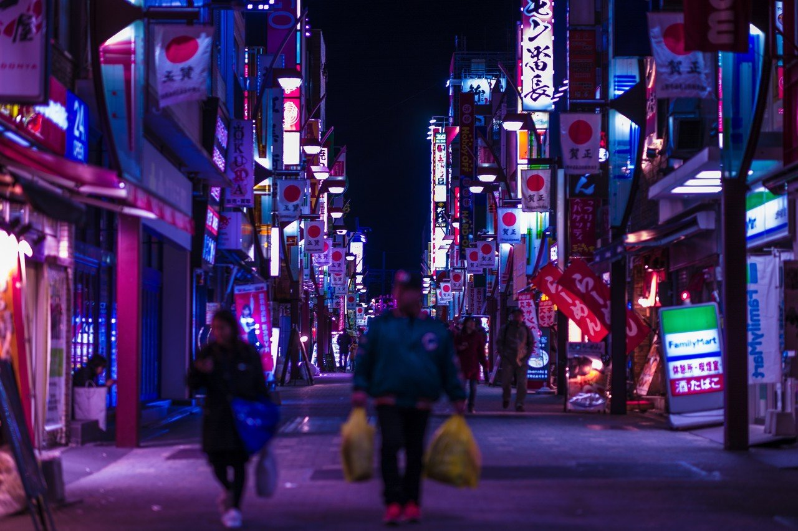

# CCDセンサーで見る夜の街はなぜこんなに妖艶なんだろう（随時更新）

123

[%22%20d%3D%22M-100-100h300v300h-300z%22%2F%3E%3C%2Fsvg%3E)](/ochyai)

[落合陽一](/ochyai)

2019年1月6日 22:13

購読中

 上野    新橋 新橋 上野

## 高評価して応援しよう！

高評価

%22%20d%3D%22M-100-100h300v300h-300z%22%2F%3E%3C%2Fsvg%3E)%22%20d%3D%22M-100-100h300v300h-300z%22%2F%3E%3C%2Fsvg%3E)

2人

  

* [#落合陽一](https://note.com/hashtag/落合陽一)
* [#落合陽一公式](https://note.com/hashtag/落合陽一公式)

123

1

いつも応援してくださる皆様に落合陽一は支えられています．本当にありがとうございます．

チップで応援

[%22%20d%3D%22M-100-100h300v300h-300z%22%2F%3E%3C%2Fsvg%3E)](/ochyai)

[落合陽一](/ochyai)

フォロー中

メディアアーティストで光や音や物性や計算機メディアの研究をしているような感覚的物書きで博士持ちのスナップ写真家です．多様性社会を目指す波動使いの准教授．noteは作家としての個人的な発信です．ご連絡はリンク先のお問い合わせまで．　<https://yoichiochiai.com>