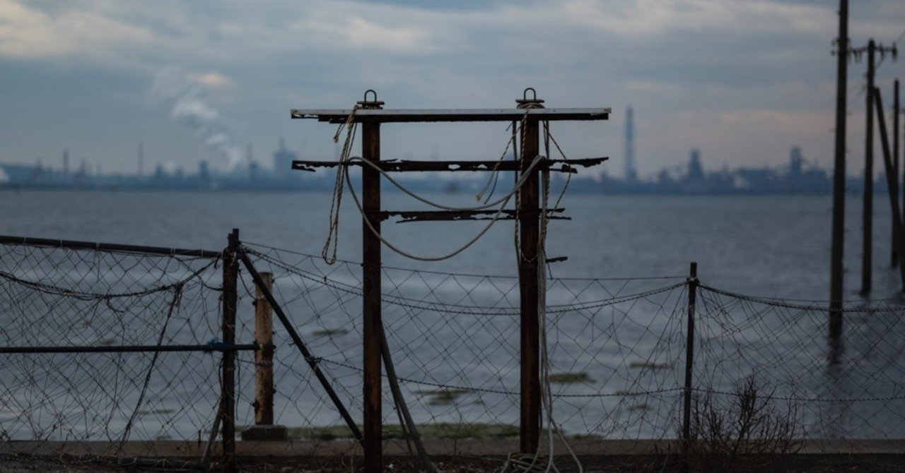
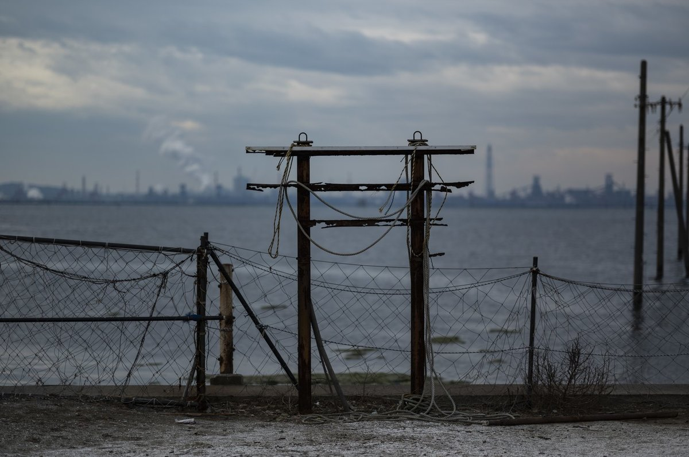

  

# #0 メディア装置と質量

125

[%22%20d%3D%22M-100-100h300v300h-300z%22%2F%3E%3C%2Fsvg%3E)](/ochyai)

[落合陽一](/ochyai)

2019年1月7日 07:08

購読中

落合陽一はメディアアーティストをしながらメディア装置の研究者をしている．他にも教員やら起業家やら様々な肩書きはあるもののこのマガジンでは肩書きは一旦忘れたい．ひとりのアーティストであり，また研究しながら世界を俯瞰する洞察者としての着眼点から，落合陽一というフィルターを通じて，世界を文章や写真で切り取って行きたいと考えている．

このマガジンでは僕が社会と接する中で目的やフレームに対して行うこと，というよりはむしろもっと個人的なこと，生の言葉や見てる風景を感じたままに，ルールの決まったゲームではなく一つの関数的に何かを表現したい．なぜだろうか．

[魔法の世紀](https://www.amazon.co.jp/dp/4905325056/ref=cm_sw_r_tw_dp_U_x_uTymCb7TD2FRS)や[デジタルネイチャー](https://www.amazon.co.jp/dp/4905325099/ref=cm_sw_r_tw_dp_U_x_oUymCb1BBTT2M)といった文章は書きつつも，自分の創作から見える見地やメディア観についての議論を他の社会的なメッセージと切り離して，より深めていくような「文章というまとまり」 を今まで書いてきたことは少ないと思う．本になって出版される頃には生の言葉は薄まってしまうし，時代感は変化してしまう．僕は自分の言葉をライターによるインタビューなしで書いた本を仕上げるにはやはり数年かかるから，その間の工程をいつももどかしく思っている．

結局のところ，フレームや目的に最適化されていないときの僕は僕の目指す存在になりたいのであって，本を書く執筆者になりたいわけでもなければ，論文が引用されるかされないか，学会で評価されるかされないかに一喜一憂する研究者になりたいわけでもない．ましてや他人から承認されるインフルエンサーになりたいわけでもないしお金を稼ぎたいわけでもなければ社会システムを変革したいわけでもない．こういった観点を語弊のないように補足しておくと面白そうなフレームと目的が決まればそれを達成するのは大好きだし，その目的に応じて自己を最適化することは好きだ．まだ見たことのない地平をつくるような高まりを感じ，僕が自然の中にいるときに感じる柔らかで滑らかな接続感を持ちながら，目的と活動するフレームが決めて，それを行っていくことは楽しい．例えば，起業家としては人の役に立つこと，社会の中で皆が生きる日々の生活を支えたり，事業を拡大したり，より良い循環をもたらす経済活動を行うこと，それに自分の持てる能力を使うことは快感だ．また研究者としては論文を書いて知を広めることや後進を育てること，研究の中で未だ知に還元されてない多くの技術や発明を繰り返すことでそれを体系化したり社会に役立てたりしていくこともご飯を食べるよりも好きだ．本を書いているときもそれを読者に届けたいと思って書いているし，国プロに関わるときはどうしたらより良い社会を実現するための研究や発見や教育やエコシステムを構築できるか本気で頭を使っている．それらの役割やピースは僕を構成する個別の要素であって，フレームや目的に最適化された自分である．その自分に有限な時間が使われて行くことにはそこまで抵抗はない．誰か困った人がいれば助けたいと思うし，なんらかの課題があれば常に解いてみたいと思う．それは能動的ニヒリズムの中に身をおく自分が生きる喜びの一つだからだ．「デジタルネイチャー 的自然派」の社会彫刻を愛するアーティストなのだと思ってくれればその理解はしやすいのだろう．要は社会彫刻を刻んでいるとき，見えている未来ビジョンと比べたときの差異をなんとかして埋めたい，どうにかしたいと思いながら毎日を生きているのである．

ただ一人の求道者としての落合陽一はどうだろうか．アーティストとしての落合陽一はどうだろう．僕は今メディア装置を見たりそれを洞察したりしながら，何を考えているのだろうか．僕は作品を作っているときや研究をしているときは，誰もいない世界でほっておかれてもずっとやってるだろうと思う．まだ見たことのないものを見たいし，それを愛でているときの快感はとても大きいからだ．

2019/1/24から個展「質量への憧憬展」が始まる（後から読む人にとっては「始まった」）のだが，そのときに作ったアーティストステートメントがある．おそらく，アーティストステートメントの中では僕は社会性を切り離した自分として，ただ一人の求道者としての落合陽一が言葉を紡いでいる．

> 人が留められないものはなんだろうか．共有できないものはなんだろうか．  
> 時間，空間，瞬間，すべては失われていく，ありありとした解像度を体験し続けることは生きることだ．生きることはそれらを忘却し失い続けていくことかもしれない．過去にしてしまう価値を閉じ込めたいと思ったときに人は芸術作品やメディア装置を手に取る．物質になることを嫌がる情報を僕らは社会彫刻に作り変えることもある．人が金，法人，宗教，法律，共同体を作る動機は留めたいこころにあるのかもしれない．

> メディアアートに惹かれた二つの気持ちは分解できる．だれも見たことがないものを見たいこと，刹那で失われるなにかを留めておきたい体験の物象化だ．煙，泡，波面，プラズマ，生体，一瞬の運動や宙に存在するその刹那性のようなものだ．瞬間の美しさを失えば，それは誰も見れないものになってしまう．その上に沢山のコンテクストを載せようと思えばできる．メディア装置の批評性や社会性の中での機能をはめるパズルゲームやなにかを引き継ぐビジュアルデザインを繰り返すことによって一定の所有欲や連帯感を演出しながら生きつづけることは出来るだろう．それは刹那の体験性を，この生の消失を騙しながら誤魔化しながら鈍い解像感の中に留めていく無間地獄のようだ．

> メディア装置の表現が好きな理由は個の消失と存在を繰り返すある種の抽象性にある．言語やビジュアルによる表現から分離し，コンテンツを切り離して存在する美を探す活動の中で自分は自然と一体化できる．観察し，観察される立場から機能的な主体を取り戻し追体験させるメタ機能になることができる．それは，パズルゲームを超えたものに思えたのだ．

> 写真を撮ること，撮り続けることが好きだ．メディアアートとして表現することで作家として消し去ろうとした一人称が，写真やイメージを集合させることで浮かび上がる．視点の集合と離散を通じて，不可逆な時間を生きることを自覚させられる．瞬間と瞬間が物質性を伴って記録され，その展示自体も風景にされて行く．そういったプロセスを感じながら過去を生み出して行くことが好きだ．僕が写真を撮るとき，アナログな身体と光の中でそこにあるデジタルを研ぎ澄ます．デジタルでしか見えない世界認識で，失われつつあるものを切り取り，手触りを与えるプロセスを通じ，時間と空間の解像度との対話している．

> そのイメージの集合体を吐き出すことによって描かれる自然は僕の形をしているだろうか？ イメージの集合体が向かう先にあるのはコンテンツであり，コンテクストだろう．あえて，発掘的にその分析をつづけることによって見いだせるものがあるかもしれない．

> 質量への憧憬の目指す先は祈りだ．祈りは実行と形を持たないソフトウェアアップデートだ．精神のチューニングと出力の連続活動かもしれない．そういった中で可視化される心象の原風景にある作品は心に引っかかってしまうコンテクストを伴った美的感覚だ．刹那性と共感性の過程にある美的感覚を世界の切り出しによって表現しようと試行錯誤した結果だ．物質としての写真は物理的な存在になった写真の意味を．瞬間や空間の永続性を得たもの，写真というマテリアルの追求だ．映像としての写真は物質性から時間と空間の刹那を切り出しながら，なお動的な現象を保つ，固定されない運動と現象だ．僕の作品のキーテーマである映像と物質はその橋梁をになうメディアアート的な表現だ．そういった写真の中で，大切にしている価値観やベースになった記憶，それが接合したり外在性を得たりしながら出てきた表現，そして浮かび上がった表現を作っていく．その端々に散りばめられたのは，社会彫刻を作ろうとする僕が見てきた風景だ．

きっと今の時点での僕はここに右脳で捉えたい世界があって，それは質量とデータの間にあるある種のノスタルジアなのだ．憧憬でもある．データ化する質量のない世界の中で質量のあるものやフィジカルな機能を質量のない世界から見たときに感じる物質性を求めているのだと思う．デジタルなものは永続性を持つが失われるのも一瞬だ．エイジングすることもなければ，メディア装置それ自体と切り離されることがほとんどだ．

質量を持つメディア装置は壊れる．ブラウン管に感じるノスタルジアはナムジュンパイクの時代にあったビデオアートの先駆性と異なっている．我々が今ブラウン管にみる質量性は液晶やLEDや有機ELの時代から見た価値観に基づいている．テクノロジーは変わる．メディアアートの時代性は時代によってそのテクノロジーの風化を伴うエイジングをする．しかしデジタルデータはどうだろうか．もちろん処理能力が上がればより高精細に見えるようなアルゴリズムもあるかもしれない．しかし解像度の足らない画像データから見えるのはノスタルジアだろうか，それともエイジングだろうか．

僕は日々変わるメディア環境と日進月歩のテクノロジーを開発する側の人間としてその視座を常に書き起こしておきたいし，ビジョンに向けたあゆみやロードマップを見据えるだけでなく，その瞬間瞬間を書き起こすことによって生まれる視点や表現もあるのだと思う．そういった観点を重要にしながらこのマガジンでは，ひとりのアーティストであり，また研究しながら世界を俯瞰する洞察者としての着眼点から，落合陽一というフィルターを通じて，世界を文章や写真で切り取って行きたいと考えている．そういうメディア観や作品性を保ちながら，一緒に世界を切り取って観察したり洞察したりしていきたい方はぜひマガジンをフォローしてほしいと願っている．

アーティストや観察者でいるときの社会性のない僕でも，自分が好きだと思う価値観の中，誰かと一緒に世界を切り取って，それについて吟味したり話したりしていくことは，なんだか嬉しくなることの一つだ．パーティは苦手だけれど，誰かと風景を共有しながら，それをまた一つの風景へと変換していくこと，有限の時間の中，個展や作品を見てくれる方々と過ごす時間もかけがえのない時間の一つだからだ．

ここから先は有料部分です

ダウンロード

 

copy

## 高評価して応援しよう！

高評価

%22%20d%3D%22M-100-100h300v300h-300z%22%2F%3E%3C%2Fsvg%3E)%22%20d%3D%22M-100-100h300v300h-300z%22%2F%3E%3C%2Fsvg%3E)%22%20d%3D%22M-100-100h300v300h-300z%22%2F%3E%3C%2Fsvg%3E)

3人

  

* [#落合陽一](https://note.com/hashtag/落合陽一)
* [#落合陽一公式](https://note.com/hashtag/落合陽一公式)

125

3

いつも応援してくださる皆様に落合陽一は支えられています．本当にありがとうございます．

チップで応援

[%22%20d%3D%22M-100-100h300v300h-300z%22%2F%3E%3C%2Fsvg%3E)](/ochyai)

[落合陽一](/ochyai)

フォロー中

メディアアーティストで光や音や物性や計算機メディアの研究をしているような感覚的物書きで博士持ちのスナップ写真家です．多様性社会を目指す波動使いの准教授．noteは作家としての個人的な発信です．ご連絡はリンク先のお問い合わせまで．　<https://yoichiochiai.com>