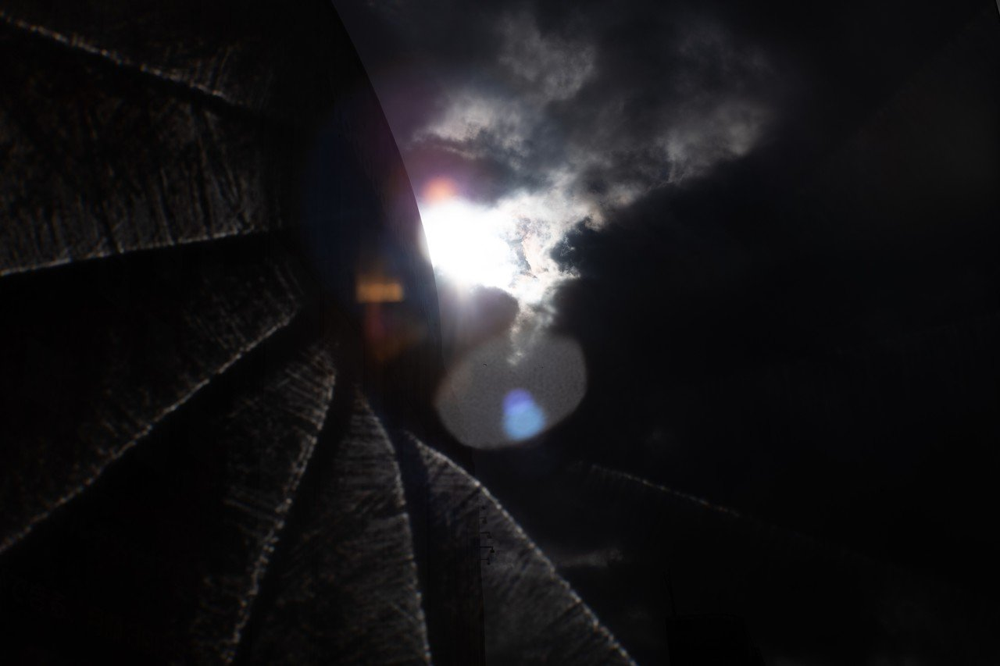

# 透明なものになぜ惹かれるのか（随時更新）

117

[%22%20d%3D%22M-100-100h300v300h-300z%22%2F%3E%3C%2Fsvg%3E)](/ochyai)

[落合陽一](/ochyai)

2019年1月7日 17:03

購読中

 モノクロで撮る透明なものの反射や屈折を感じるときに自分の目ではない見え方を感じる    フレームの切り取りを感じているからか，窓枠にはめられたガラスが気になる 映るはずのないレンズそれ自体の反射はものすごく惹かれる．これはオールドレンズの絞りの反射．

## 高評価して応援しよう！

高評価

%22%20d%3D%22M-100-100h300v300h-300z%22%2F%3E%3C%2Fsvg%3E)

1人

  

* [#写真](https://note.com/hashtag/写真)
* [#落合陽一](https://note.com/hashtag/落合陽一)
* [#落合陽一公式](https://note.com/hashtag/落合陽一公式)

117

2

いつも応援してくださる皆様に落合陽一は支えられています．本当にありがとうございます．

チップで応援

[%22%20d%3D%22M-100-100h300v300h-300z%22%2F%3E%3C%2Fsvg%3E)](/ochyai)

[落合陽一](/ochyai)

フォロー中

メディアアーティストで光や音や物性や計算機メディアの研究をしているような感覚的物書きで博士持ちのスナップ写真家です．多様性社会を目指す波動使いの准教授．noteは作家としての個人的な発信です．ご連絡はリンク先のお問い合わせまで．　<https://yoichiochiai.com>