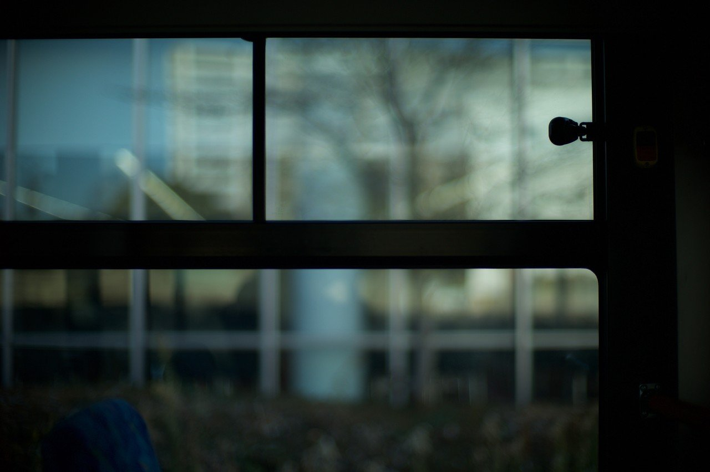
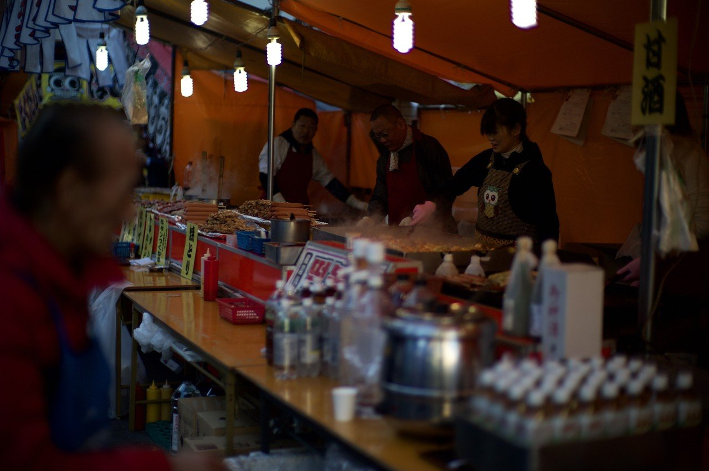
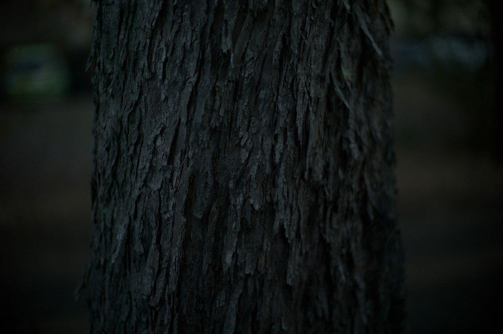
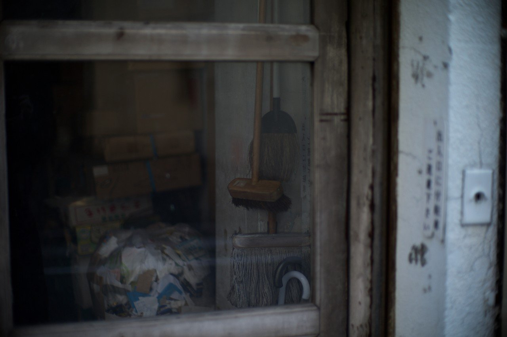

# CCDセンサーに感じるノスタルジックな感覚は何なんだろう

102

[%22%20d%3D%22M-100-100h300v300h-300z%22%2F%3E%3C%2Fsvg%3E)](/ochyai)

[落合陽一](/ochyai)

2019年1月8日 06:46

購読中

 CMOSセンサーデジカメが主流の中，異世界に迷い込んだような見た目に感じる．    いつもの風景が不思議な湿度を保っている． レンズのボケや透明感が不思議な淀みをもつ． 原色が強調され安っぽくなる． 暗所のノイズが生活感を作り出す． パッキリしていないコントラストの低いノイズ感がざわめきを感じる． 石や枯葉の埃っぽさ 街路樹の皮の乾いた質感 低解像度でノイジーなもの，見えにくいもの そう言ったものが気配感を増幅することもあるのかもしれない． 雑踏や街並みを切り取るときに声を残す それはエイジングのある物体を写すときに見えるのかもしれないし 生活感を切り取るときにあるかもしれない CMOS時代のCCDノスタルジアっていうものはどこかにひっそりあると思う．

## 高評価して応援しよう！

高評価

%22%20d%3D%22M-100-100h300v300h-300z%22%2F%3E%3C%2Fsvg%3E)

1人

  

* [#写真](https://note.com/hashtag/写真)
* [#落合陽一](https://note.com/hashtag/落合陽一)
* [#落合陽一公式](https://note.com/hashtag/落合陽一公式)

102

5

いつも応援してくださる皆様に落合陽一は支えられています．本当にありがとうございます．

チップで応援

[%22%20d%3D%22M-100-100h300v300h-300z%22%2F%3E%3C%2Fsvg%3E)](/ochyai)

[落合陽一](/ochyai)

フォロー中

メディアアーティストで光や音や物性や計算機メディアの研究をしているような感覚的物書きで博士持ちのスナップ写真家です．多様性社会を目指す波動使いの准教授．noteは作家としての個人的な発信です．ご連絡はリンク先のお問い合わせまで．　<https://yoichiochiai.com>