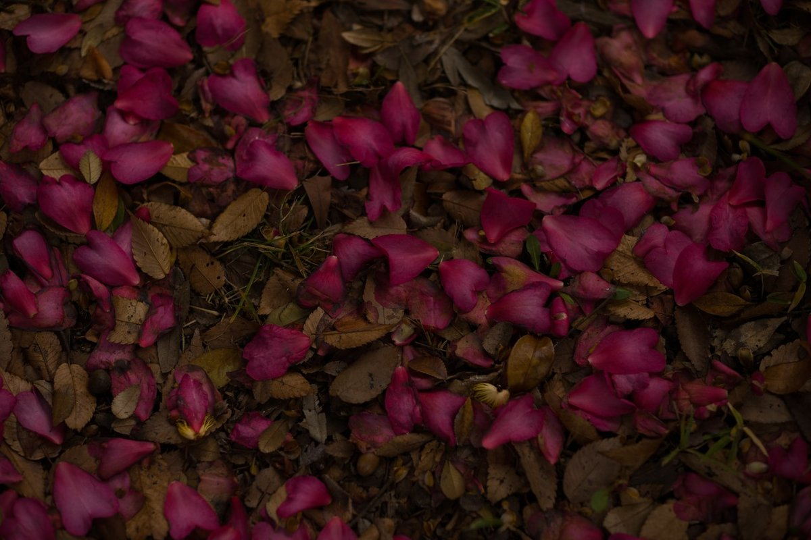

  

# 【＃1】デジタル時代のビジョンから振り返ったときに感じる憧憬は質量への憧憬だろうか？（書き途中）

74

[%22%20d%3D%22M-100-100h300v300h-300z%22%2F%3E%3C%2Fsvg%3E)](/ochyai)

[落合陽一](/ochyai)

2019年1月9日 17:26

購読中

デジタル時代のノスタルジアを考えている．ノスタルジアといってもテクノロジーと考え方が移り変わる中で，コストの面でも時代の平衡点が動く中に感じる愛着のようなものだ．だから昔は良かったなぁという感覚を想起するというよりは，それを内包しながら共に歩むような感覚に近いのだと思う．猪子さんが昔，「質量があるものはダサい」といったとき，すごいカッコいいセリフだと思ったことがある．質量は永続性から遠く，ピュアでないといえばその通りだ．解像度の問題はやがて超克されるし，人類が感じる解像感という意味では完全性を得られることもあるかもしれない．しかし，それは僕を奮い立たせない．物質への，おそらく質量への，もしくは寂びへの憧憬があるからだ．

ここで憧憬という言葉を選んでいることには訳がある．ドイツ語の Sehnsuchtの訳語として捉えたときの憧憬こそが今このデジタル世界から見たときの質量を論じるに足る感覚なのではないか，と考えたからだ．デジタル世界から見たアナログ世界を解像度や質量や複製不可能性や劣化から考えたときにどうやってとらえることができるか考えてみたい．デジタルもアナログも僕にとっては不可分だ．しかし，幾ばくかの違いはある．そのギャップに何があるのかを言葉や絵に変えていく．

（続く）

  

ダウンロード

 

copy

## 高評価して応援しよう！

高評価

  

* [#写真](https://note.com/hashtag/写真)
* [#落合陽一](https://note.com/hashtag/落合陽一)
* [#落合陽一公式](https://note.com/hashtag/落合陽一公式)

74

1

いつも応援してくださる皆様に落合陽一は支えられています．本当にありがとうございます．

チップで応援

[%22%20d%3D%22M-100-100h300v300h-300z%22%2F%3E%3C%2Fsvg%3E)](/ochyai)

[落合陽一](/ochyai)

フォロー中

メディアアーティストで光や音や物性や計算機メディアの研究をしているような感覚的物書きで博士持ちのスナップ写真家です．多様性社会を目指す波動使いの准教授．noteは作家としての個人的な発信です．ご連絡はリンク先のお問い合わせまで．　<https://yoichiochiai.com>