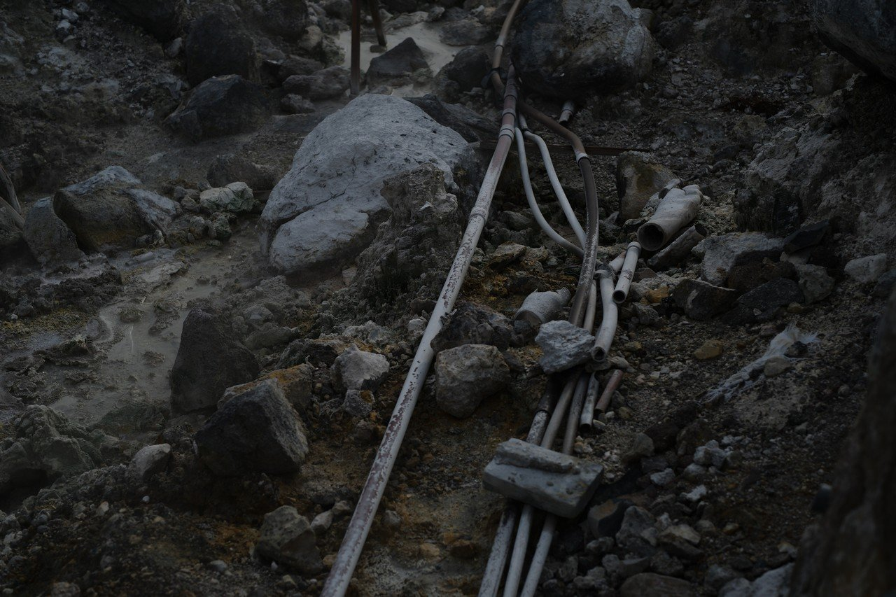
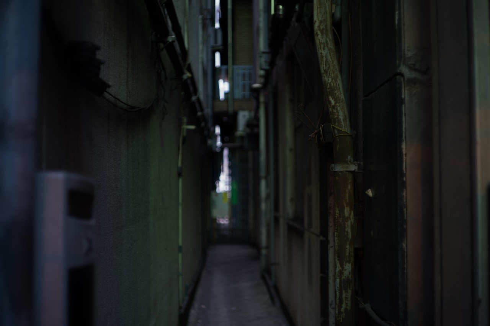
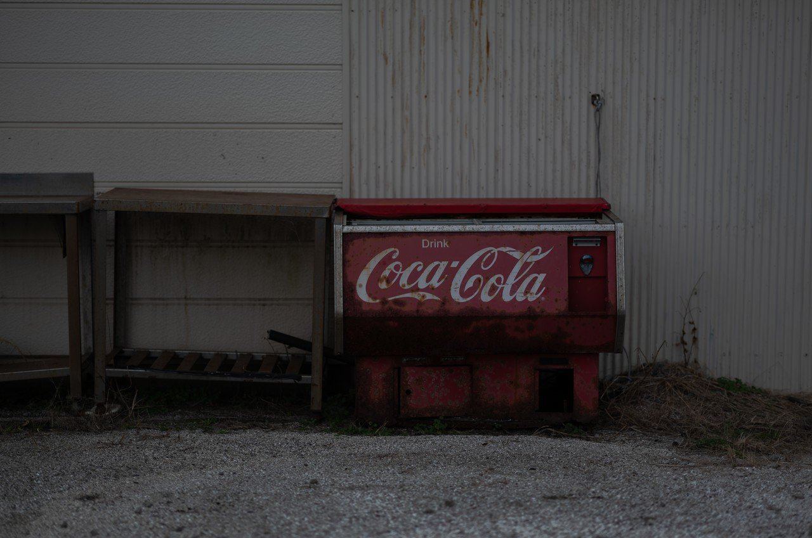

# 寂びた機械から感じられる時間経過の凝縮と美しさはなんだろう（随時更新）

96

[%22%20d%3D%22M-100-100h300v300h-300z%22%2F%3E%3C%2Fsvg%3E)](/ochyai)

[落合陽一](/ochyai)

2019年1月9日 17:09

購読中

 茶を丸める機械から感じる繰り返しの美    源泉と人工物の中で抗う人工物 有線接続への懐かしさと確実性を得ながら寂びていく たしかに地獄は危険だけど地獄のことを忘れても残るか？ 表面の時間経過と反射変化が気になる 埃の層も気になる 路地裏で歪みつつある配管 時間経過を刻んでいく鉄橋 いつからここにいるんだろう アメリカ文化が自然に還っていく

## 高評価して応援しよう！

高評価

%22%20d%3D%22M-100-100h300v300h-300z%22%2F%3E%3C%2Fsvg%3E)

1人

  

* [#写真](https://note.com/hashtag/写真)
* [#落合陽一](https://note.com/hashtag/落合陽一)
* [#落合陽一公式](https://note.com/hashtag/落合陽一公式)

96

3

いつも応援してくださる皆様に落合陽一は支えられています．本当にありがとうございます．

チップで応援

[%22%20d%3D%22M-100-100h300v300h-300z%22%2F%3E%3C%2Fsvg%3E)](/ochyai)

[落合陽一](/ochyai)

フォロー中

メディアアーティストで光や音や物性や計算機メディアの研究をしているような感覚的物書きで博士持ちのスナップ写真家です．多様性社会を目指す波動使いの准教授．noteは作家としての個人的な発信です．ご連絡はリンク先のお問い合わせまで．　<https://yoichiochiai.com>