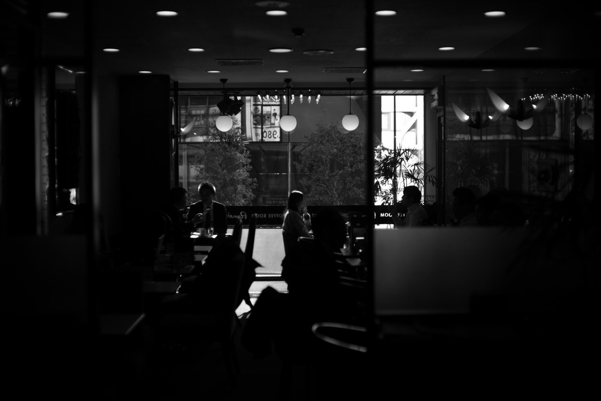
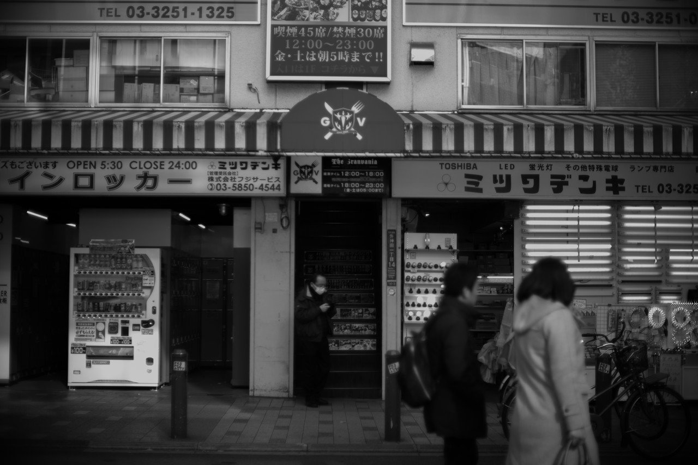
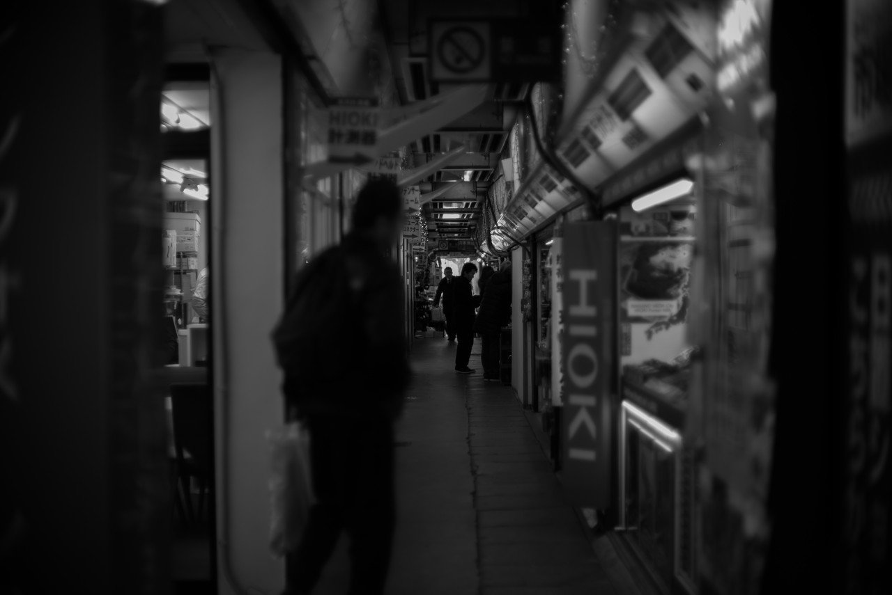
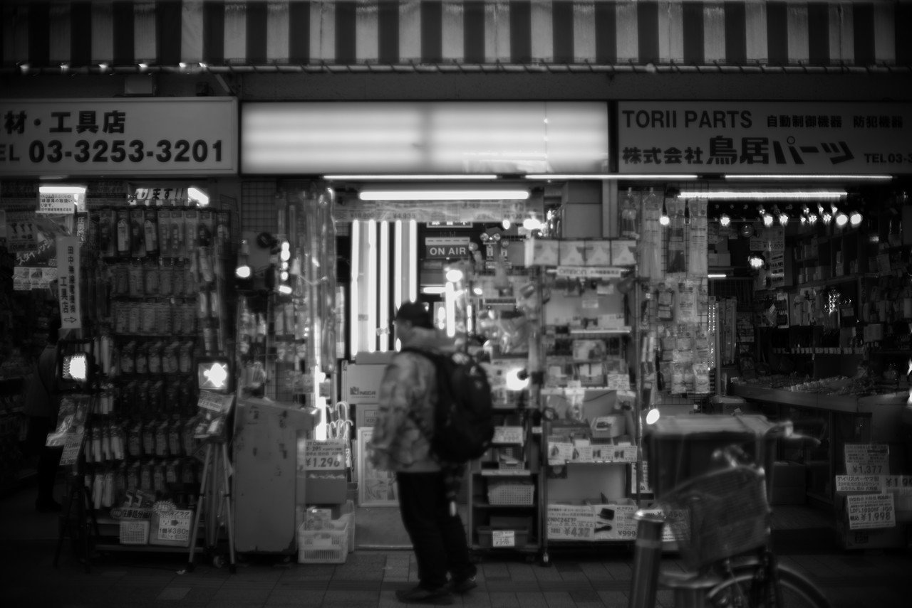
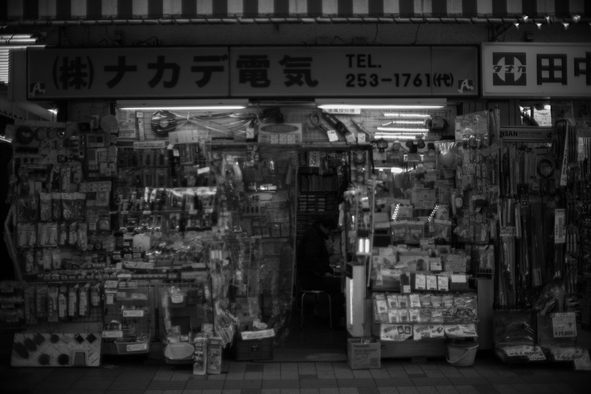

# モノクロで見る秋葉原からはサブカルチャーとネオンカラーの手触りがしない．

100

[%22%20d%3D%22M-100-100h300v300h-300z%22%2F%3E%3C%2Fsvg%3E)](/ochyai)

[落合陽一](/ochyai)

2019年1月12日 10:34

購読中

 カラフルなLEDが見えない回廊はディストピアの入口のようで    冬の日差しが射すカフェは無機質だ 色とりどりの主張がなければ全部オフィス蛍光灯みたいで 仲見世なのか駅弁なのかお土産物屋なのか まさか電気関連商品とは思わないのが色彩を失った風景 駄菓子のような懐かしさ 何語圏かわからない看板 秋葉原カラーもモノクロでは成り立たないが，それはそれで美しい

## 高評価して応援しよう！

高評価

%22%20d%3D%22M-100-100h300v300h-300z%22%2F%3E%3C%2Fsvg%3E)

1人

  

* [#写真](https://note.com/hashtag/写真)
* [#落合陽一](https://note.com/hashtag/落合陽一)
* [#落合陽一公式](https://note.com/hashtag/落合陽一公式)

100

4

いつも応援してくださる皆様に落合陽一は支えられています．本当にありがとうございます．

チップで応援

[%22%20d%3D%22M-100-100h300v300h-300z%22%2F%3E%3C%2Fsvg%3E)](/ochyai)

[落合陽一](/ochyai)

フォロー中

メディアアーティストで光や音や物性や計算機メディアの研究をしているような感覚的物書きで博士持ちのスナップ写真家です．多様性社会を目指す波動使いの准教授．noteは作家としての個人的な発信です．ご連絡はリンク先のお問い合わせまで．　<https://yoichiochiai.com>