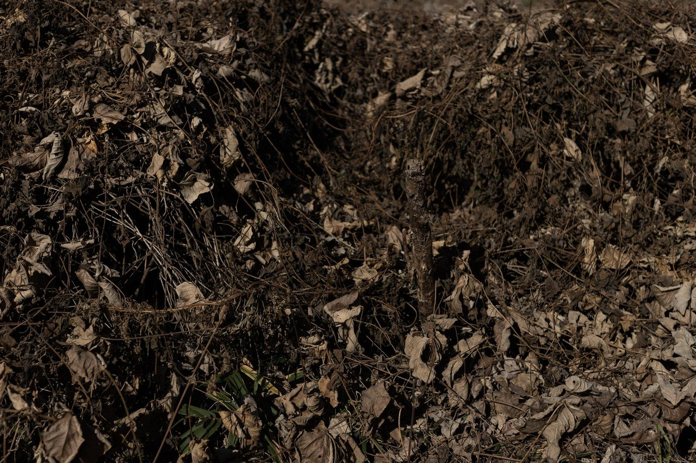
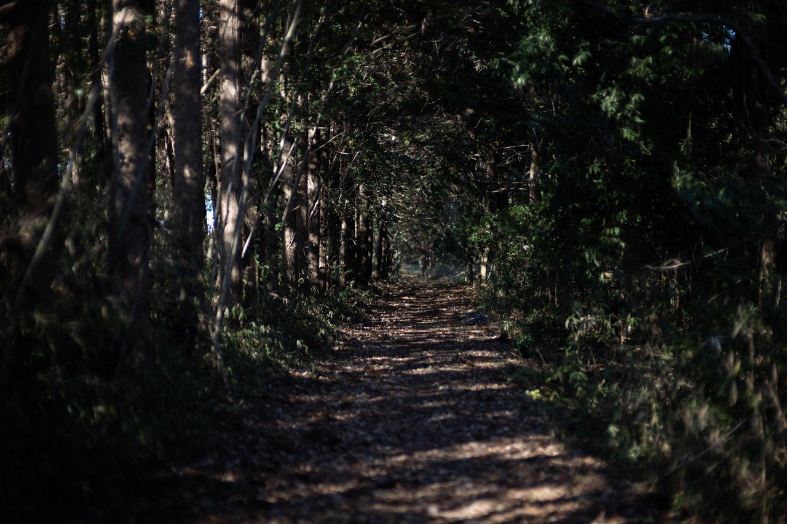
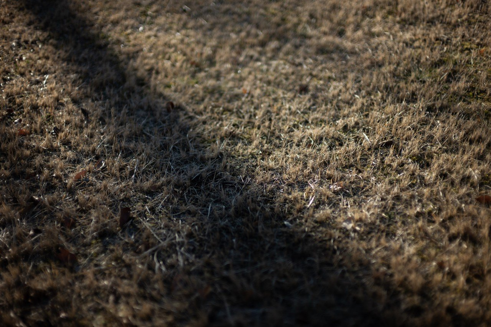
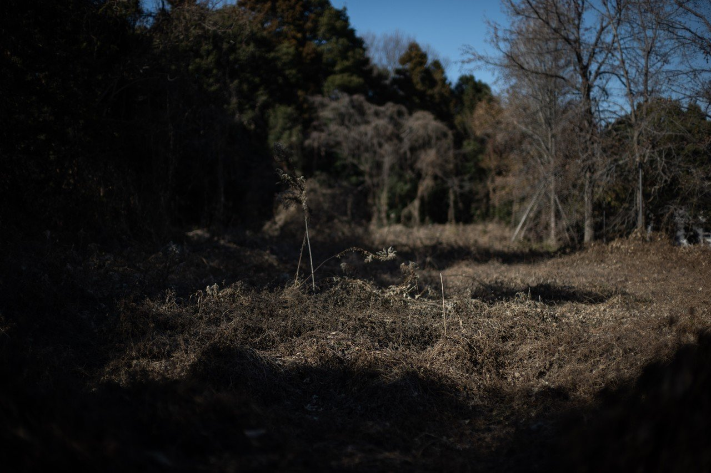
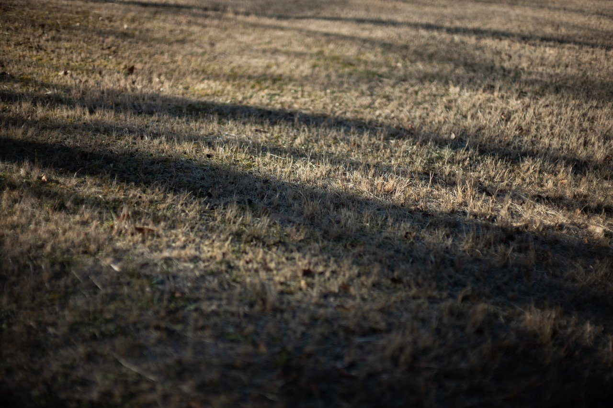

# 日差しの中に枯れ葉の反射光を感じる季節に茶色い光線空間を眺めながら自然を切り取る

98

[%22%20d%3D%22M-100-100h300v300h-300z%22%2F%3E%3C%2Fsvg%3E)](/ochyai)

[落合陽一](/ochyai)

2019年1月15日 13:15

購読中

 窓から入ってくる光が枯葉の色をしている季節．影が濃く，光は暖色．    暖色なのに寒そうで，埃が似合う色なのは茶色だからか？ 斜めに射す光も夕暮れに近い成分と反射光がふくまれる すでに生きていないからシャープなのか？ シャープだから非生物なのか 枯れ木の中に生命を感じることもある 森の落ち葉と日差しと常緑樹のコントラストが取れ始める 寒そうなのに暖かそうな光が反射する 覆い尽くさんばかりの植物と色味 影の向こうの暖色 反射を作り出す広大な枯葉 人がいたときのことをいないときに思い出すから成立する景色 枯れ木の光が床に転写された 影が染めたのはなんだろう 影の川のような

## 高評価して応援しよう！

高評価

%22%20d%3D%22M-100-100h300v300h-300z%22%2F%3E%3C%2Fsvg%3E)

1人

  

* [#写真](https://note.com/hashtag/写真)
* [#落合陽一](https://note.com/hashtag/落合陽一)
* [#落合陽一公式](https://note.com/hashtag/落合陽一公式)

98

2

いつも応援してくださる皆様に落合陽一は支えられています．本当にありがとうございます．

チップで応援

[%22%20d%3D%22M-100-100h300v300h-300z%22%2F%3E%3C%2Fsvg%3E)](/ochyai)

[落合陽一](/ochyai)

フォロー中

メディアアーティストで光や音や物性や計算機メディアの研究をしているような感覚的物書きで博士持ちのスナップ写真家です．多様性社会を目指す波動使いの准教授．noteは作家としての個人的な発信です．ご連絡はリンク先のお問い合わせまで．　<https://yoichiochiai.com>